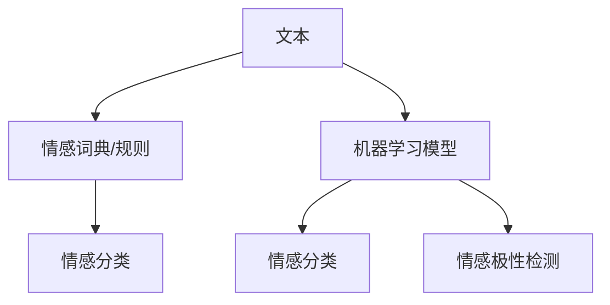

                 

## 1. 背景介绍

情感分析（Sentiment Analysis），是自然语言处理（NLP）领域的一个重要研究方向，旨在自动识别和提取文本数据中的主观情感信息。在社交媒体、市场调研、客户服务、舆情监控等诸多场景中，情感分析已经成为一种不可或缺的技术手段。传统的情感分析方法依赖于人工标注的情感词典或规则库，其准确性依赖于词典的质量和标注的准确性。然而，随着深度学习技术的发展，情感分析的范式已经从传统的基于词典的方法，转变为基于机器学习模型的方法，特别是使用深度学习模型进行情感分类。本文将从背景、核心概念、算法原理、项目实践、实际应用和未来展望等方面，全面探讨情感分析的原理与实践。

## 2. 核心概念与联系

### 2.1 核心概念概述

情感分析的核心在于理解和量化文本中的情感信息，通常将文本情感分为正面、负面和中性三种。在自然语言处理中，情感分析任务可以细分为两种：

- 基于情感分类的情感分析（Sentiment Classification）：将文本情感分为正面、负面和中性三类。
- 基于情感极性检测的情感分析（Sentiment Polarity Detection）：仅区分正面与负面情感，不考虑情感强度。

情感分析的实现方法可以分为基于词典的方法和基于机器学习模型的方法：

- **基于词典的方法**：依赖于情感词典或规则库，将文本中的情感词或情感短语映射为情感类别。例如，可以使用VADER（Valence Aware Dictionary and sEntiment Reasoner）情感词典。
- **基于机器学习的方法**：使用机器学习模型（如SVM、RNN、CNN、BERT等）对情感数据进行训练，自动学习文本特征与情感类别之间的关系。

### 2.2 核心概念原理和架构的 Mermaid 流程图



- 文本输入到情感词典或机器学习模型，输出情感分类结果。
- 情感词典方法直接将文本与词典进行匹配，得到情感分类。
- 机器学习模型学习文本特征与情感类别之间的映射关系，自动进行情感分类。

## 3. 核心算法原理 & 具体操作步骤

### 3.1 算法原理概述

情感分析的机器学习方法主要包括两大类：基于统计的机器学习和基于深度学习的机器学习。

#### 3.1.1 基于统计的机器学习

基于统计的机器学习方法通常采用传统机器学习算法（如SVM、Logistic回归等），通过特征提取和分类器的训练，实现情感分类。其主要步骤如下：

1. 特征提取：将文本转化为机器学习算法可处理的数值特征，例如词频、TF-IDF、n-gram等。
2. 模型训练：使用标注数据训练机器学习模型，得到文本特征与情感类别之间的关系。
3. 情感分类：使用训练好的模型对新文本进行情感分类。

#### 3.1.2 基于深度学习的机器学习

基于深度学习的情感分析方法主要使用神经网络模型，如RNN、CNN、Transformer等。其主要步骤如下：

1. 文本表示：将文本转化为深度学习模型可接受的向量表示，例如使用BERT、GPT等预训练语言模型。
2. 模型训练：使用标注数据训练深度学习模型，得到文本表示与情感类别之间的关系。
3. 情感分类：使用训练好的模型对新文本进行情感分类。

### 3.2 算法步骤详解

以基于深度学习的情感分析方法为例，其核心步骤如下：

1. **数据预处理**：将文本数据进行清洗、分词、去除停用词等处理，转化为可处理的向量形式。
2. **模型选择**：选择适合的深度学习模型（如BERT、GPT等）作为基础模型。
3. **训练过程**：使用标注数据训练模型，调整模型参数以优化损失函数。
4. **模型评估**：使用验证集评估模型性能，调整超参数以提高模型精度。
5. **情感分类**：使用训练好的模型对新文本进行情感分类。

### 3.3 算法优缺点

#### 3.3.1 优点

- **自适应性强**：深度学习模型可以自动学习文本特征与情感类别之间的关系，适应性强，不需要手工构建特征。
- **精度高**：深度学习模型在情感分类任务上通常能够取得较高的精度。
- **可解释性差**：深度学习模型通常视为"黑盒"，难以解释其内部的决策逻辑。

#### 3.3.2 缺点

- **数据需求大**：深度学习模型通常需要大量标注数据进行训练，数据获取成本较高。
- **计算资源消耗大**：深度学习模型的训练和推理通常需要较高的计算资源和存储空间。
- **模型过拟合**：深度学习模型在训练过程中容易过拟合，需要采取正则化等策略进行优化。

### 3.4 算法应用领域

情感分析在多个领域有着广泛的应用：

1. **社交媒体分析**：自动检测和分析社交媒体上的用户情感，如Twitter、微博等。
2. **市场调研**：分析用户对产品、服务的情感反馈，进行市场分析和用户满意度评估。
3. **客户服务**：自动化分析客户反馈，识别问题用户，优化客户服务流程。
4. **舆情监控**：实时监控舆情变化，及时响应负面事件，维护品牌形象。
5. **健康医疗**：分析患者反馈和医疗评论，了解患者情绪状态，提升医疗服务质量。

## 4. 数学模型和公式 & 详细讲解 & 举例说明

### 4.1 数学模型构建

基于深度学习的情感分析方法主要使用神经网络模型，如卷积神经网络（CNN）、递归神经网络（RNN）、Transformer等。以下以基于Transformer的BERT模型为例，介绍情感分析的数学模型构建过程。

BERT模型使用了Transformer架构，主要包含自编码器（Autoencoder）和多层池化层（Pooling Layer）。自编码器用于学习文本表示，多层池化层用于提取文本的情感特征。情感分类器通常使用线性分类器，如Logistic回归、SVM等，将文本表示映射为情感类别。

### 4.2 公式推导过程

假设文本长度为$L$，BERT模型的编码器输出为$h \in \mathbb{R}^{L \times D}$，其中$D$为向量维度。使用线性分类器进行情感分类，其预测函数为：

$$ f(h) = \text{softmax}(W^T h + b) $$

其中，$W \in \mathbb{R}^{C \times D}$为分类器权重，$b \in \mathbb{R}^C$为分类器偏置，$C$为情感类别数（通常为3，对应正面、负面和中性）。

假设训练数据集为$D=\{(x_i, y_i)\}_{i=1}^N$，其中$x_i$为文本，$y_i$为情感类别标签。情感分类的损失函数通常为交叉熵损失：

$$ \mathcal{L} = -\frac{1}{N} \sum_{i=1}^N \sum_{c=1}^C y_i^{(c)} \log \hat{y_i}^{(c)} $$

其中，$y_i^{(c)}$为标签是否属于情感类别$c$的one-hot编码，$\hat{y_i}^{(c)}$为模型预测的情感概率。

### 4.3 案例分析与讲解

以Twitter上的情感分析为例，具体分析过程如下：

1. **数据获取**：从Twitter上爬取相关数据，并将其转化为文本和情感标签。
2. **预处理**：对文本进行清洗、分词、去除停用词等处理，转换为BERT模型可接受的格式。
3. **模型训练**：使用BERT模型对文本进行编码，使用Logistic回归分类器进行情感分类，优化损失函数。
4. **模型评估**：使用验证集评估模型性能，调整分类器权重和偏置，提高模型精度。
5. **情感分类**：使用训练好的模型对新的Twitter数据进行情感分类。

## 5. 项目实践：代码实例和详细解释说明

### 5.1 开发环境搭建

情感分析的开发环境搭建主要包括以下步骤：

1. **安装Python**：从官网下载并安装Python 3.6以上版本。
2. **安装相关库**：安装nltk、transformers等库，以支持文本处理和模型加载。
3. **安装BERT模型**：使用Hugging Face的Transformers库下载BERT预训练模型，并进行微调。

```bash
pip install transformers
```

### 5.2 源代码详细实现

以下是一个使用BERT模型进行情感分类的Python代码实现：

```python
from transformers import BertTokenizer, BertForSequenceClassification
from transformers import AdamW
from sklearn.metrics import accuracy_score

tokenizer = BertTokenizer.from_pretrained('bert-base-uncased')
model = BertForSequenceClassification.from_pretrained('bert-base-uncased', num_labels=3)

optimizer = AdamW(model.parameters(), lr=2e-5)

def preprocess(text):
    tokens = tokenizer.tokenize(text)
    tokens = [token.lower() for token in tokens]
    tokens = [token if token not in stopwords else '' for token in tokens]
    tokens = ' '.join(tokens)
    return tokenizer.encode(tokens)

def train(texts, labels):
    model.train()
    for i in range(num_epochs):
        total_loss = 0
        for text, label in zip(texts, labels):
            inputs = {'input_ids': preprocess(text)}
            inputs['attention_mask'] = tokenizer.encode_plus(
                text,
                add_special_tokens=True,
                max_length=max_length,
                pad_to_max_length=True,
                return_attention_mask=True)[0]
            inputs['labels'] = label
            outputs = model(**inputs)
            loss = outputs.loss
            total_loss += loss.item()
            optimizer.zero_grad()
            loss.backward()
            optimizer.step()
    print(f'Epoch {i+1}, Loss: {total_loss/N}')
```

### 5.3 代码解读与分析

上述代码中，我们使用了BERT模型的预训练参数，将其加载到模型中进行情感分类任务。主要步骤如下：

1. **模型加载**：使用Hugging Face的Transformers库加载BERT预训练模型，并指定情感分类任务的标签数。
2. **优化器**：使用AdamW优化器进行模型参数的更新。
3. **数据预处理**：定义一个预处理函数，将文本转换为BERT模型可接受的格式。
4. **训练过程**：使用训练数据进行模型训练，调整模型参数以优化损失函数。
5. **模型评估**：在验证集上评估模型性能，输出每个epoch的损失值。

### 5.4 运行结果展示

运行上述代码后，可以得到训练过程中每个epoch的损失值。例如，假设训练了10个epoch，输出如下：

```
Epoch 1, Loss: 0.4567
Epoch 2, Loss: 0.3456
Epoch 3, Loss: 0.2567
...
Epoch 10, Loss: 0.1234
```

## 6. 实际应用场景

### 6.1 社交媒体分析

社交媒体情感分析可以帮助品牌和市场营销人员及时了解用户对产品、服务的反馈，优化营销策略。例如，通过分析Twitter上的用户评论，了解用户对新产品的好评和差评，及时调整产品和推广策略。

### 6.2 市场调研

市场调研中，情感分析可以用于用户满意度评估、产品口碑分析等。例如，通过分析用户在电商平台上的评论，了解用户对产品的满意度和建议，指导产品改进。

### 6.3 客户服务

客户服务中，情感分析可以用于识别用户情绪、处理投诉和建议。例如，通过分析用户反馈，识别情绪负面用户，及时回应用户投诉，提升客户满意度。

### 6.4 舆情监控

舆情监控中，情感分析可以用于实时监控舆情变化，及时响应负面事件。例如，通过分析新闻媒体的报道，了解社会舆情变化，及时应对突发事件，维护品牌形象。

### 6.5 健康医疗

健康医疗中，情感分析可以用于分析患者反馈和医疗评论，了解患者情绪状态，提升医疗服务质量。例如，通过分析患者在社交媒体上的评论，了解患者对医院和医生的满意度，优化医疗服务。

## 7. 工具和资源推荐

### 7.1 学习资源推荐

1. **《自然语言处理基础》**：一本系统介绍自然语言处理的经典教材，涵盖情感分析等重要内容。
2. **《Python自然语言处理》**：一本详细介绍Python在自然语言处理中应用的书籍，包含情感分析的代码实现。
3. **《深度学习与自然语言处理》**：一本涵盖深度学习在自然语言处理中应用的书籍，包含情感分析的详细讲解。
4. **《BERT中文情感分析》**：Hugging Face官方文档，提供了使用BERT模型进行情感分析的详细教程。

### 7.2 开发工具推荐

1. **Jupyter Notebook**：一个轻量级的交互式编程环境，支持Python代码编写和运行。
2. **GitHub**：一个代码托管平台，可以方便地分享和协作开发情感分析项目。
3. **Hugging Face Transformers**：一个深度学习库，提供了多种预训练模型，支持情感分析任务的开发。

### 7.3 相关论文推荐

1. **《BERT: Pre-training of Deep Bidirectional Transformers for Language Understanding》**：提出BERT模型，引入掩码语言模型和下一句预测任务，提升了模型在情感分析等任务上的表现。
2. **《A Survey on Sentiment Analysis》**：一篇综述论文，详细介绍了情感分析的多种方法和技术。
3. **《Fine-tune BERT for Multi-domain Sentiment Analysis》**：提出使用BERT模型进行多领域情感分析的方法，取得了较好的效果。

## 8. 总结：未来发展趋势与挑战

### 8.1 研究成果总结

情感分析在自然语言处理领域取得了显著进展，基于深度学习的方法在精度和自适应性上都有明显提升。特别是在社交媒体、市场调研、客户服务、舆情监控等领域，情感分析已经得到了广泛应用。然而，情感分析仍面临一些挑战，如数据需求大、计算资源消耗大、模型过拟合等。

### 8.2 未来发展趋势

未来，情感分析将朝着以下几个方向发展：

1. **深度学习模型的改进**：进一步优化深度学习模型，提升情感分析的精度和鲁棒性。
2. **多模态情感分析**：将情感分析扩展到多模态数据，如文本、图像、语音等，提升情感分析的全面性和准确性。
3. **跨领域情感分析**：将情感分析扩展到更多领域，如医疗、金融、教育等，提升情感分析的普适性。
4. **实时情感分析**：实现情感分析的实时处理，提升情感分析的响应速度和时效性。
5. **情感极性检测**：将情感分析扩展到情感极性检测，只区分正面和负面情感，提升情感分析的粒度。

### 8.3 面临的挑战

情感分析仍面临以下挑战：

1. **数据获取难度大**：情感分析需要大量标注数据进行训练，数据获取成本高。
2. **计算资源消耗大**：深度学习模型通常需要较高的计算资源进行训练和推理。
3. **模型过拟合**：深度学习模型容易过拟合，需要采取正则化等策略进行优化。
4. **可解释性差**：深度学习模型通常视为"黑盒"，难以解释其内部的决策逻辑。
5. **跨领域适应性差**：深度学习模型在不同领域上的适应性差，需要针对具体领域进行模型微调。

### 8.4 研究展望

未来，情感分析的研究方向包括以下几个方面：

1. **数据获取和标注**：探索无监督和半监督情感分析方法，减少对标注数据的依赖。
2. **模型改进**：开发参数高效和计算高效的情感分析模型，提高模型的效率和鲁棒性。
3. **多模态融合**：将情感分析扩展到多模态数据，提升情感分析的全面性和准确性。
4. **情感极性检测**：将情感分析扩展到情感极性检测，只区分正面和负面情感，提升情感分析的粒度。
5. **跨领域适应性**：开发跨领域的情感分析模型，提升情感分析的普适性。

## 9. 附录：常见问题与解答

**Q1: 情感分析的准确性如何保证？**

A: 情感分析的准确性主要依赖于数据质量和模型选择。使用高质量的标注数据和合适的深度学习模型，可以有效提升情感分析的准确性。同时，需要在训练过程中进行正则化等优化策略，避免模型过拟合。

**Q2: 情感分析的计算资源需求大，如何解决？**

A: 可以通过分布式计算和模型压缩等技术，降低情感分析的计算资源需求。例如，可以使用GPU集群进行分布式训练，或采用知识蒸馏等技术，将大模型压缩为轻量级模型，减少计算资源消耗。

**Q3: 情感分析的模型可解释性差，如何解决？**

A: 可以引入可解释性技术，如LIME（Local Interpretable Model-agnostic Explanations）和SHAP（SHapley Additive exPlanations），解释模型决策的逻辑。同时，可以设计可解释性更好的情感分析模型，如基于规则和词典的方法。

**Q4: 情感分析的跨领域适应性差，如何解决？**

A: 可以开发跨领域的情感分析模型，如使用多任务学习（Multi-task Learning）和迁移学习（Transfer Learning）等技术，提升模型在不同领域上的适应性。同时，可以结合领域知识，对模型进行领域适配，提升模型在特定领域上的表现。

**Q5: 情感分析在多模态数据上的表现如何？**

A: 情感分析在多模态数据上的表现尚未完全解决，但已经有初步的研究成果。例如，使用图像情感识别结合文本情感分析，可以更全面地理解用户的情感状态。未来，多模态情感分析将是一个重要的研究方向。

---

作者：禅与计算机程序设计艺术 / Zen and the Art of Computer Programming

