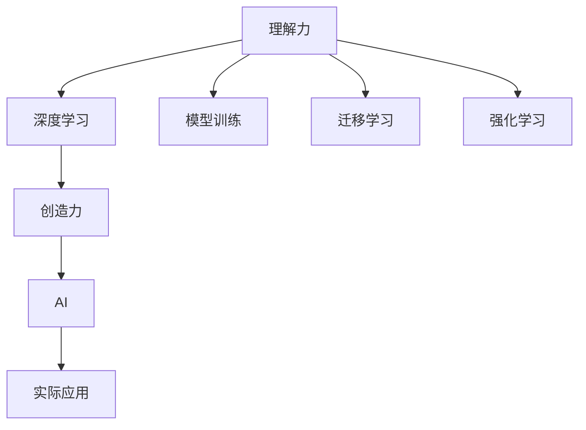

                 

# 我无法创造的东西，我就不明白。 ——理查德·费曼

> 关键词：理解力,创造力,人工智能,机器学习,深度学习

## 1. 背景介绍

在研究人工智能(AI)的征途中，我们是否曾因无法充分理解某些概念或理论而陷入困惑？理查德·费曼曾说过：“我无法创造的东西，我就不明白。”这句话不仅体现了科学的追求本质，也深刻揭示了理解和创造之间的微妙联系。对于人工智能领域而言，这种联系更为紧密，因为理解力在人工智能的探索与实现中扮演着核心角色。

### 1.1 问题的由来

人工智能的核心在于让机器具备类似人类的理解力。这种理解力不仅包括识别和分类，还涵盖了更广泛的能力，如生成文本、理解复杂逻辑关系、甚至具有创造力。然而，如何使机器具备这种理解力，并应用到实际问题中，成为人工智能研究中的一个核心问题。

### 1.2 问题核心关键点

人工智能的理解力提升，主要依赖于机器学习，特别是深度学习的发展。通过构建复杂的网络结构，使得机器能够处理大量非结构化数据，并从中学习模式。这种学习过程本质上是一种对数据的“理解”，但这种理解力是否与人类相同？如何评价和提升这种理解力？这些问题构成了人工智能理解力提升的关键。

## 2. 核心概念与联系

### 2.1 核心概念概述

理解力与创造力的关系是人工智能领域中一个重要议题。通过深入理解基础概念和核心原理，我们可以更好地把握这一议题。

- **理解力(Understanding)：** 机器对数据的理解和处理能力，包括特征提取、模式识别、逻辑推理等。
- **创造力(Creativity)：** 机器能够基于已有知识，生成新的、有意义的内容，如文本、图像、音乐等。
- **人工智能(AI)：** 通过算法和模型，使机器具备理解力和创造力的技术体系。
- **深度学习(Deep Learning)：** 一种基于多层神经网络的机器学习技术，通过逐层逼近复杂模式，实现对数据的深度理解。
- **模型训练(Model Training)：** 通过大量标注数据训练模型，使其能够识别和处理特定任务。
- **迁移学习(Transfer Learning)：** 通过在一个任务上的学习，迁移到另一个相似任务上，以减少训练时间。
- **强化学习(Reinforcement Learning)：** 通过与环境的交互，使机器学习最优策略，提升性能。

这些核心概念之间的联系可以通过以下Mermaid流程图来展示：



这个流程图展示了一个从理解力到创造力，再到AI应用的过程：

1. 理解力是AI的基础，通过深度学习、模型训练、迁移学习和强化学习等多种方式提升。
2. 创造力是在理解力的基础上，通过深度学习等技术生成新的内容。
3. AI技术通过理解和创造力，被应用于各种实际问题中。

## 3. 核心算法原理 & 具体操作步骤

### 3.1 算法原理概述

人工智能的理解力提升主要依赖于深度学习技术。深度学习通过多层神经网络的逐层逼近，从数据中学习复杂的非线性模式，从而实现对数据的深度理解。这种理解力主要体现在以下几个方面：

- **特征提取(Feature Extraction)：** 从原始数据中提取有意义的特征，是理解数据的基础。
- **模式识别(Pattern Recognition)：** 识别数据中的模式和规律，是理解数据的核心。
- **逻辑推理(Logical Reasoning)：** 基于已有知识，进行逻辑推理和推断，是理解力的高级应用。

### 3.2 算法步骤详解

深度学习模型的构建和训练通常包括以下几个关键步骤：

**Step 1: 准备数据集**
- 收集并标注数据集，确保数据的质量和多样性。
- 划分训练集、验证集和测试集，以进行模型训练、调优和最终评估。

**Step 2: 选择模型架构**
- 选择合适的深度学习模型架构，如卷积神经网络(CNN)、循环神经网络(RNN)、变分自编码器(VAE)等。
- 根据任务特性调整网络结构，如增加层数、调整激活函数等。

**Step 3: 初始化模型参数**
- 对模型参数进行随机初始化，通常使用Xavier或He初始化方法。
- 设置超参数，如学习率、批大小、迭代轮数等。

**Step 4: 进行模型训练**
- 使用随机梯度下降(SGD)、Adam等优化算法，对模型参数进行优化。
- 通过前向传播计算损失函数，反向传播更新参数，迭代训练直到收敛。

**Step 5: 模型评估与调优**
- 在验证集上评估模型性能，根据评估结果调整模型结构和超参数。
- 使用交叉验证、早停法等技术防止过拟合，提升模型泛化能力。

**Step 6: 应用与优化**
- 将训练好的模型应用于实际问题中，并进行性能优化。
- 持续收集新数据，重新训练模型以保持其最新状态。

### 3.3 算法优缺点

深度学习模型在理解力提升方面具有以下优点：

- **自适应能力强：** 能够处理非结构化数据，如图像、文本、音频等。
- **高效特征提取：** 通过多层网络自动提取数据特征，无需手动设计特征。
- **泛化能力强：** 通过大量数据训练，能够泛化到新的数据集。

但同时也存在以下缺点：

- **计算资源需求高：** 模型参数量大，训练和推理耗时较长，需要高性能计算资源。
- **过拟合风险：** 数据量不足时容易发生过拟合，影响模型泛化能力。
- **模型可解释性差：** 深度学习模型通常是“黑盒”，难以解释内部决策逻辑。

### 3.4 算法应用领域

深度学习模型在多个领域中都有广泛应用，包括但不限于：

- **计算机视觉(Computer Vision)：** 如图像分类、目标检测、图像生成等。
- **自然语言处理(Natural Language Processing, NLP)：** 如文本分类、机器翻译、情感分析等。
- **语音识别(Speech Recognition)：** 如自动语音识别、语音合成等。
- **推荐系统(Recommendation System)：** 如商品推荐、新闻推荐等。
- **游戏(AI Games)：** 如AlphaGo等，展示了AI在游戏领域的深度学习应用。

## 4. 数学模型和公式 & 详细讲解 & 举例说明

### 4.1 数学模型构建

在深度学习中，理解力提升通常通过构建神经网络模型来实现。以一个简单的两层全连接神经网络为例：

$$
\begin{aligned}
f(x) &= \sigma(W_2 \cdot \sigma(W_1 \cdot x + b_1) + b_2) \\
    &= \sigma(W_2 \cdot h(x) + b_2)
\end{aligned}
$$

其中，$W_1$ 和 $W_2$ 是权重矩阵，$b_1$ 和 $b_2$ 是偏置项，$\sigma$ 是激活函数。$h(x)$ 是中间层的输出，$x$ 是输入数据。

### 4.2 公式推导过程

假设我们有一个二分类任务，输入为 $x$，输出为 $y \in \{0,1\}$。通过多层神经网络，我们将 $x$ 映射到一个二维向量 $z \in \mathbb{R}^2$，然后通过一个线性分类器进行分类：

$$
y = \sigma(W \cdot z + b)
$$

其中，$W$ 和 $b$ 是分类器的权重和偏置项，$\sigma$ 是sigmoid函数。通过最小化交叉熵损失函数：

$$
L(y,\hat{y}) = -(y \cdot \log(\hat{y}) + (1-y) \cdot \log(1-\hat{y}))
$$

来训练模型。其中 $\hat{y} = \sigma(W \cdot z + b)$ 是模型的预测输出。

### 4.3 案例分析与讲解

以图像分类为例，我们希望训练一个模型，将图像分类为猫和狗两类。假设我们有1000张猫的图片和1000张狗的图片，每个图片大小为32x32。

**Step 1: 数据预处理**
- 将每张图片缩放到32x32大小，并转换为灰度图像。
- 对所有图片进行标准化处理，使其均值为0，方差为1。

**Step 2: 构建模型**
- 构建一个包含5个卷积层和2个全连接层的卷积神经网络(CNN)。
- 使用ReLU作为激活函数，最后一层使用sigmoid函数进行二分类。

**Step 3: 模型训练**
- 使用随机梯度下降(SGD)算法，学习率为0.01。
- 训练10个epoch，每个epoch使用小批量随机梯度下降(Small Batch Stochastic Gradient Descent)。
- 使用交叉熵损失函数进行优化。

**Step 4: 模型评估**
- 在测试集上评估模型性能，使用准确率作为评价指标。
- 通过混淆矩阵等工具，分析模型的分类效果。

通过上述步骤，我们可以训练出一个基本的图像分类模型，用于识别猫和狗的图像。尽管这个模型还很初级，但它展示了深度学习在理解力提升方面的基本原理和流程。

## 5. 项目实践：代码实例和详细解释说明

### 5.1 开发环境搭建

在进行深度学习项目时，我们需要准备好开发环境。以下是使用Python进行TensorFlow开发的环境配置流程：

1. 安装Anaconda：从官网下载并安装Anaconda，用于创建独立的Python环境。

2. 创建并激活虚拟环境：
```bash
conda create -n tf-env python=3.8 
conda activate tf-env
```

3. 安装TensorFlow：根据CUDA版本，从官网获取对应的安装命令。例如：
```bash
conda install tensorflow tensorflow-gpu=2.4.0 -c pytorch -c conda-forge
```

4. 安装TensorBoard：
```bash
pip install tensorboard
```

5. 安装各类工具包：
```bash
pip install numpy pandas scikit-learn matplotlib tqdm jupyter notebook ipython
```

完成上述步骤后，即可在`tf-env`环境中开始深度学习实践。

### 5.2 源代码详细实现

下面以手写数字识别为例，给出使用TensorFlow进行图像分类的PyTorch代码实现。

```python
import tensorflow as tf
from tensorflow import keras

# 加载MNIST数据集
(x_train, y_train), (x_test, y_test) = keras.datasets.mnist.load_data()

# 数据预处理
x_train = x_train.reshape(x_train.shape[0], 28, 28, 1)
x_test = x_test.reshape(x_test.shape[0], 28, 28, 1)
x_train = x_train / 255.0
x_test = x_test / 255.0

# 构建模型
model = keras.Sequential([
    keras.layers.Conv2D(32, kernel_size=(3, 3), activation='relu', input_shape=(28, 28, 1)),
    keras.layers.MaxPooling2D(pool_size=(2, 2)),
    keras.layers.Flatten(),
    keras.layers.Dense(128, activation='relu'),
    keras.layers.Dense(10, activation='softmax')
])

# 编译模型
model.compile(optimizer='adam', loss='sparse_categorical_crossentropy', metrics=['accuracy'])

# 训练模型
model.fit(x_train, y_train, epochs=5, validation_data=(x_test, y_test))

# 评估模型
model.evaluate(x_test, y_test)
```

### 5.3 代码解读与分析

让我们再详细解读一下关键代码的实现细节：

**数据预处理**：
- 将28x28的图像数据重塑为4D张量，添加通道维度。
- 将像素值标准化到[0,1]区间。

**模型构建**：
- 使用卷积层提取图像特征，使用池化层减少特征维度。
- 使用全连接层进行分类，最后一层使用softmax函数输出类别概率。

**模型编译**：
- 使用Adam优化器，交叉熵损失函数，准确率作为评估指标。

**模型训练与评估**：
- 在训练集上进行训练，使用验证集进行性能评估。
- 评估模型在测试集上的性能，输出准确率。

可以看出，通过TensorFlow，我们能够快速搭建并训练一个基本的图像分类模型。代码实现简洁高效，适合初学者入门。

## 6. 实际应用场景

### 6.1 智能医疗诊断

在智能医疗诊断中，深度学习模型可以用于图像分类、病变检测、病历分析等任务。通过医学影像数据的大规模预训练，模型能够学习到人体组织的特征和病变的模式，从而提高诊断的准确性和效率。

以乳腺癌筛查为例，我们可以使用深度学习模型对X光图像进行分类，识别出是否存在乳腺癌病变。这不仅能够提高诊断速度，还能降低医生的工作负担，提高诊断质量。

### 6.2 智能客服系统

智能客服系统通过深度学习模型，能够理解客户的自然语言查询，并给出合适的回复。系统首先对客户的问题进行分类，然后根据不同类别生成相应的答案。

在训练过程中，我们收集大量的历史客服对话记录，将问题和最佳答复构建成监督数据，在此基础上对预训练模型进行微调。微调后的模型能够自动理解用户意图，匹配最合适的答案模板进行回复，提高客户咨询体验。

### 6.3 金融风险控制

金融领域需要对大量的数据进行分析，以识别潜在的风险和机会。深度学习模型可以用于异常检测、信用评分、股票预测等任务。

以信用评分为例，我们收集客户的个人历史数据和行为数据，使用深度学习模型学习客户的信用特征。模型能够根据客户的过去行为预测其未来信用风险，从而帮助金融机构进行风险控制和客户管理。

### 6.4 未来应用展望

随着深度学习技术的不断进步，人工智能的理解力将在更多领域得到应用，为传统行业带来变革性影响。

- **智慧城市治理：** 深度学习模型可以用于城市事件监测、交通流量分析、环境保护等任务，提高城市管理的自动化和智能化水平。
- **自动驾驶：** 深度学习模型可以用于图像识别、路径规划、障碍物检测等任务，推动自动驾驶技术的发展。
- **工业制造：** 深度学习模型可以用于设备状态监测、质量检测、生产调度等任务，提高工业生产的效率和质量。

此外，在医疗、教育、媒体等领域，深度学习技术也将带来深刻的变革。未来，深度学习模型将在更多垂直行业中大放异彩。

## 7. 工具和资源推荐

### 7.1 学习资源推荐

为了帮助开发者系统掌握深度学习技术的理论基础和实践技巧，这里推荐一些优质的学习资源：

1. 《深度学习》（Ian Goodfellow等著）：深度学习领域的经典教材，涵盖了深度学习的基础理论、模型设计和算法优化等。

2. 《TensorFlow实战》（Simon Haykin等著）：TensorFlow的官方文档和实战指南，适合初学者入门TensorFlow。

3. 《PyTorch入门与实践》（Eric Johnson等著）：PyTorch的官方文档和实战指南，适合初学者入门PyTorch。

4. Coursera《深度学习专项课程》：由斯坦福大学Andrew Ng教授授课的深度学习课程，内容系统全面，配套有动手实践的作业和项目。

5. 《动手学深度学习》（李沐等著）：开源的深度学习教材，配套有丰富的代码和实战案例，适合进阶学习。

通过对这些资源的学习实践，相信你一定能够快速掌握深度学习技术的精髓，并用于解决实际的NLP问题。

### 7.2 开发工具推荐

高效的深度学习开发离不开优秀的工具支持。以下是几款用于深度学习开发的常用工具：

1. PyTorch：基于Python的开源深度学习框架，灵活动态的计算图，适合快速迭代研究。

2. TensorFlow：由Google主导开发的开源深度学习框架，生产部署方便，适合大规模工程应用。

3. Keras：基于TensorFlow和Theano的高级API，易于上手，适合快速原型开发。

4. Weights & Biases：模型训练的实验跟踪工具，可以记录和可视化模型训练过程中的各项指标，方便对比和调优。

5. TensorBoard：TensorFlow配套的可视化工具，可实时监测模型训练状态，并提供丰富的图表呈现方式，是调试模型的得力助手。

6. Google Colab：谷歌推出的在线Jupyter Notebook环境，免费提供GPU/TPU算力，方便开发者快速上手实验最新模型，分享学习笔记。

合理利用这些工具，可以显著提升深度学习模型的开发效率，加快创新迭代的步伐。

### 7.3 相关论文推荐

深度学习模型的发展源于学界的持续研究。以下是几篇奠基性的相关论文，推荐阅读：

1. AlexNet: ImageNet Classification with Deep Convolutional Neural Networks：提出了卷积神经网络(CNN)，奠定了深度学习在计算机视觉领域的基础。

2. ResNet: Deep Residual Learning for Image Recognition：提出了残差网络(ResNet)，解决了深度网络训练中的梯度消失问题，大幅提升了网络的深度和宽度。

3. GoogleNet: Going Deeper with Convolutions：提出了Inception模块，提升了卷积网络的性能和可解释性。

4. RNN: Recurrent Neural Network for Sequence Prediction：提出了循环神经网络(RNN)，用于序列数据建模。

5. Transformer: Attention is All You Need：提出了Transformer结构，开启了自然语言处理领域的预训练大模型时代。

6. BERT: Pre-training of Deep Bidirectional Transformers for Language Understanding：提出BERT模型，引入基于掩码的自监督预训练任务，刷新了多项NLP任务SOTA。

这些论文代表了大深度学习模型的发展脉络。通过学习这些前沿成果，可以帮助研究者把握学科前进方向，激发更多的创新灵感。

## 8. 总结：未来发展趋势与挑战

### 8.1 总结

本文对深度学习技术的理解力提升进行了全面系统的介绍。首先阐述了深度学习在理解力提升方面的基本原理和步骤，明确了理解力与创造力之间的关系。其次，从原理到实践，详细讲解了深度学习模型的构建和训练过程，给出了深度学习模型在实际问题中的典型应用案例。

通过本文的系统梳理，可以看到，深度学习技术在理解力提升方面的巨大潜力，其应用领域广泛，覆盖了计算机视觉、自然语言处理、语音识别等多个领域。未来，随着深度学习技术的不断进步，其在更多行业中的应用前景将更加广阔。

### 8.2 未来发展趋势

深度学习技术在未来将呈现以下几个发展趋势：

1. **自监督学习(SSL)：** 利用无标签数据进行预训练，提高模型的泛化能力。

2. **小样本学习(Few-shot Learning)：** 使用少量数据训练模型，提高模型的适应性和可解释性。

3. **联邦学习(Federated Learning)：** 分布式训练模型，保护数据隐私，提升模型性能。

4. **生成对抗网络(GANs)：** 通过对抗训练生成高质量的样本数据，提高模型的稳定性和鲁棒性。

5. **混合模型(Mixed Models)：** 结合神经网络和符号表示，提高模型的综合能力。

6. **跨模态学习(M跨模态学习)：** 将视觉、文本、语音等多种模态数据进行融合，提高模型的跨模态理解能力。

这些趋势展示了深度学习技术的强大潜力和未来发展方向，相信随着学界和产业界的共同努力，深度学习技术将在更多领域中大放异彩。

### 8.3 面临的挑战

尽管深度学习技术在理解力提升方面取得了巨大成就，但在迈向更加智能化、普适化应用的过程中，仍面临诸多挑战：

1. **计算资源需求高：** 深度学习模型参数量大，训练和推理耗时较长，需要高性能计算资源。

2. **过拟合风险：** 数据量不足时容易发生过拟合，影响模型泛化能力。

3. **模型可解释性差：** 深度学习模型通常是“黑盒”，难以解释内部决策逻辑。

4. **数据隐私问题：** 大规模数据训练需要收集用户隐私数据，如何保护用户隐私成为重要问题。

5. **伦理道德问题：** 深度学习模型在决策过程中可能产生偏见，如何避免算法歧视，确保公平性。

6. **环境可持续性：** 深度学习训练和推理过程中能耗高，如何降低能耗，实现绿色AI。

这些挑战需要学界和产业界的共同努力，通过技术创新、伦理设计和社会监督等多方面协同，才能解决深度学习技术在实际应用中面临的诸多问题。

### 8.4 研究展望

未来的研究需要在以下几个方面寻求新的突破：

1. **优化模型结构：** 设计更加高效、轻量级的深度学习模型，降低计算资源需求。

2. **提升数据利用率：** 通过数据增强、对抗生成等技术，提高数据利用率和模型的泛化能力。

3. **增强模型可解释性：** 结合符号表示和深度学习，提高模型的可解释性和可解释性。

4. **保护数据隐私：** 研究联邦学习、差分隐私等技术，保护用户数据隐私。

5. **避免算法歧视：** 研究公平性算法，避免深度学习模型的算法歧视问题。

6. **实现绿色AI：** 研究能效优化技术，降低深度学习模型的能耗，实现绿色AI。

这些研究方向的探索，将引领深度学习技术迈向更高的台阶，为构建安全、可靠、可解释、可控的智能系统铺平道路。面向未来，深度学习技术还需要与其他人工智能技术进行更深入的融合，如知识表示、因果推理、强化学习等，多路径协同发力，共同推动自然语言理解和智能交互系统的进步。只有勇于创新、敢于突破，才能不断拓展深度学习模型的边界，让智能技术更好地造福人类社会。

## 9. 附录：常见问题与解答

**Q1：深度学习模型的理解力是否等同于人类的理解力？**

A: 深度学习模型的理解力与人类理解力仍存在较大差距。虽然深度学习模型能够处理复杂的非线性模式，但其决策过程缺乏人类理解力中的常识、推理、创造力等高级认知能力。

**Q2：如何提高深度学习模型的可解释性？**

A: 提高深度学习模型的可解释性可以从以下几个方面入手：
- 使用可视化工具，如TensorBoard，可视化模型的内部结构。
- 结合符号表示和深度学习，提高模型的可解释性。
- 使用可解释性模型，如LIME、SHAP等，解释模型的预测结果。

**Q3：深度学习模型在实际应用中面临哪些挑战？**

A: 深度学习模型在实际应用中面临以下挑战：
- 计算资源需求高，需要高性能计算资源。
- 过拟合风险，数据量不足时容易发生过拟合。
- 模型可解释性差，难以解释内部决策逻辑。
- 数据隐私问题，需要保护用户数据隐私。
- 伦理道德问题，需要避免算法歧视。
- 环境可持续性，需要降低能耗。

这些挑战需要学界和产业界的共同努力，通过技术创新、伦理设计和社会监督等多方面协同，才能解决深度学习技术在实际应用中面临的诸多问题。

通过本文的系统梳理，我们可以看到，深度学习技术在理解力提升方面的巨大潜力，其应用领域广泛，覆盖了计算机视觉、自然语言处理、语音识别等多个领域。未来，随着深度学习技术的不断进步，其在更多行业中的应用前景将更加广阔。在面对挑战的同时，我们也需要积极探索新的技术路径，推动深度学习技术的不断进步和发展。相信随着学界和产业界的共同努力，深度学习技术将在更多领域中大放异彩，为人类社会带来更多的创新和进步。

---

作者：禅与计算机程序设计艺术 / Zen and the Art of Computer Programming

