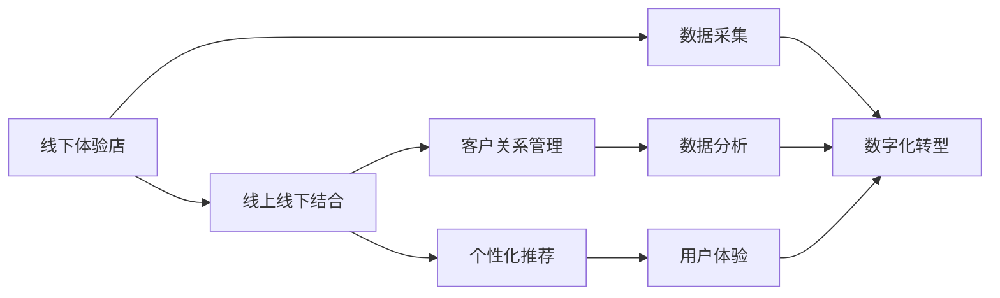

                 

# 打造个人品牌线下体验店：实现线上线下结合

> 关键词：
> 线下体验店
> 线上线下结合
> 人工智能
> 数据驱动
> 客户关系管理
> 用户体验
> 个性化推荐

## 1. 背景介绍

在数字化转型的浪潮下，越来越多的品牌开始重视线上线下融合，试图通过线上线下结合的方式，提升用户体验，增强品牌影响力。尤其对于个人品牌而言，线下体验店不仅是展示品牌的窗口，更是与客户互动、建立长期关系的重要场所。然而，如何充分利用数字化手段，将线下数据与线上运营有机结合，提升整体营销效果，是品牌运营者面临的重要挑战。本文将从多个角度探讨如何通过人工智能技术，实现线下体验店与线上平台的有效融合。

## 2. 核心概念与联系

### 2.1 核心概念概述

在探索如何打造个人品牌线下体验店时，我们需要理解几个核心概念及其相互关系：

- **线下体验店**：指品牌在线下开设的实体店铺，提供产品展示、销售、客户服务等功能。
- **线上线下结合**：指通过数字化手段，将线下数据和资源与线上运营相结合，实现全渠道客户体验一致性。
- **人工智能**：指通过机器学习、自然语言处理、计算机视觉等技术，提升数据分析和运营效率。
- **数据驱动**：指依托数据进行决策和运营，提升运营效率和客户体验。
- **客户关系管理(CRM)**：指利用技术手段管理客户信息，提升客户满意度和忠诚度。
- **个性化推荐**：指基于用户行为和偏好，提供定制化的产品或服务推荐。
- **用户体验(UX)**：指提升用户与品牌互动的全过程体验，包括线上、线下等各个触点。

这些概念之间的联系可以通过以下Mermaid流程图展示：



这个流程图展示了各个概念之间的相互作用关系：

1. **线下体验店**通过**数据采集**获得用户行为和反馈数据，进而通过**数字化转型**将数据整合到线上系统。
2. **线上线下结合**通过整合线下数据与线上运营，实现全渠道客户体验一致性。
3. **客户关系管理**利用数据驱动客户管理，提升客户满意度和忠诚度。
4. **个性化推荐**基于用户行为数据，提供定制化服务，提升用户体验。
5. **用户体验**提升用户与品牌互动的各个触点，最终提升整体营销效果。

## 3. 核心算法原理 & 具体操作步骤

### 3.1 算法原理概述

实现线下体验店与线上平台的结合，核心在于通过人工智能技术，对线下数据进行整合和分析，进而指导线上运营策略。以下是实现这一过程的关键算法原理：

- **数据融合**：通过技术手段将线下数据与线上数据进行整合，形成一个统一的数据仓库。
- **客户画像构建**：基于客户行为数据，构建详细的客户画像，了解客户需求和偏好。
- **推荐系统**：利用机器学习算法，根据客户画像和产品信息，提供个性化的推荐服务。
- **自然语言处理(NLP)**：通过NLP技术，分析客户在社交媒体、评论等渠道的反馈，提升品牌感知。

### 3.2 算法步骤详解

实现线下体验店与线上平台的结合，可以按以下步骤进行：

**Step 1: 线下数据采集和预处理**
- 利用物联网(IoT)设备采集线下店铺的销售数据、客流量数据等。
- 通过POS系统、视频监控等手段，获取线下店铺的客户行为数据。
- 对采集到的数据进行预处理，清洗噪音数据，处理缺失值，构建统一的数据格式。

**Step 2: 数据整合与分析**
- 将线下数据和线上数据整合到一个数据仓库中，实现全渠道数据的统一。
- 利用数据仓库工具（如Hadoop、Spark等）进行数据清洗、特征提取和数据建模。
- 利用机器学习算法，对客户画像进行建模，提取关键特征（如年龄、性别、消费习惯等）。

**Step 3: 客户关系管理**
- 利用CRM系统，将客户数据进行分类管理，标记不同客户群体的需求和偏好。
- 根据客户画像，制定个性化的营销策略，提升客户满意度和忠诚度。

**Step 4: 个性化推荐**
- 利用推荐系统算法，对客户画像和产品信息进行匹配，提供个性化的推荐服务。
- 结合用户反馈和行为数据，不断优化推荐算法，提升推荐效果。

**Step 5: 用户体验优化**
- 通过线上线下结合的方式，提供一致的客户体验。
- 利用NLP技术，分析客户反馈，优化产品和服务。
- 在线下店铺中提供线上预订、配送等服务，提升客户便利性。

### 3.3 算法优缺点

**优点**：
- **提升效率**：通过数据驱动，优化运营决策，提升运营效率。
- **增强用户体验**：提供个性化推荐和定制化服务，提升用户体验。
- **提升品牌感知**：利用NLP技术，分析客户反馈，提升品牌感知。

**缺点**：
- **数据隐私和安全**：线下数据采集和整合可能涉及客户隐私问题，需要采取严格的数据保护措施。
- **技术复杂度**：实现数据融合和客户画像构建需要较复杂的技术手段。
- **系统集成难度**：线上线下系统的整合需要高水平的系统集成能力。

### 3.4 算法应用领域

基于线下体验店与线上平台结合的算法原理，可以应用于多个领域，如零售、餐饮、旅游、娱乐等。

**零售行业**：通过线上线下结合，提升客户购物体验，提供个性化推荐，优化库存管理。
**餐饮行业**：利用数据驱动，提升菜品推荐，优化客户服务，提升客户满意度。
**旅游行业**：通过数据分析，提供个性化旅游路线推荐，提升客户体验。
**娱乐行业**：利用推荐系统，提供个性化娱乐内容推荐，提升用户粘性。

## 4. 数学模型和公式 & 详细讲解 & 举例说明

### 4.1 数学模型构建

在实现线下体验店与线上平台结合的过程中，我们可以构建如下数学模型：

**数据融合模型**：
$$
D = \{d_1, d_2, ..., d_N\}
$$
其中 $d_i$ 为线下店铺的第 $i$ 天的销售数据、客流量数据等，$N$ 为天数。

**客户画像模型**：
$$
P = \{p_1, p_2, ..., p_M\}
$$
其中 $p_i$ 为客户画像的第 $i$ 个特征，$M$ 为特征数。

**推荐系统模型**：
$$
R = f(P, I)
$$
其中 $P$ 为客户的画像向量，$I$ 为产品的特征向量，$f$ 为推荐算法函数。

**NLP模型**：
$$
S = g(T, C)
$$
其中 $T$ 为客户在社交媒体、评论等渠道的文本数据，$C$ 为情感分析模型，$g$ 为NLP分析函数。

### 4.2 公式推导过程

**数据融合模型推导**：
$$
d_i = \sum_{k=1}^{K} x_{ik}
$$
其中 $x_{ik}$ 为第 $i$ 天第 $k$ 个数据采集点的值。

**客户画像模型推导**：
$$
p_i = \sum_{j=1}^{J} w_{ij} y_j
$$
其中 $w_{ij}$ 为第 $i$ 个客户在第 $j$ 个特征上的权重，$y_j$ 为第 $j$ 个特征的值。

**推荐系统模型推导**：
$$
R_{ij} = f(p_i, I_j) = \sigma(\sum_{k=1}^{K} a_{ik} x_{ik} + b_{ij})
$$
其中 $a_{ik}$ 和 $b_{ij}$ 为推荐算法中的参数，$\sigma$ 为激活函数。

**NLP模型推导**：
$$
S_i = g(T_i, C_i) = \sum_{j=1}^{J} \alpha_j \cdot C_i(T_j)
$$
其中 $\alpha_j$ 为第 $j$ 个情感特征的权重，$C_i(T_j)$ 为情感分析模型对第 $i$ 个文本第 $j$ 个情感特征的预测结果。

### 4.3 案例分析与讲解

假设某品牌在线下体验店中，收集了每日的销售数据和客流量数据。通过数据融合模型，可以将这些数据整合到一个数据仓库中。利用客户画像模型，可以构建客户的年龄、性别、消费习惯等特征。通过推荐系统模型，可以根据客户的画像和产品信息，提供个性化的商品推荐。利用NLP模型，可以分析客户在社交媒体上的反馈，提升品牌感知。

## 5. 项目实践：代码实例和详细解释说明

### 5.1 开发环境搭建

在进行线下体验店与线上平台结合的实践时，我们需要准备以下开发环境：

- **硬件环境**：高性能服务器，用于数据存储和处理。
- **软件环境**：Python、Hadoop、Spark、TensorFlow等。
- **工具环境**：Hadoop、Spark、TensorFlow等。

### 5.2 源代码详细实现

以下是使用Python和TensorFlow进行线下体验店与线上平台结合的代码实现。

**Step 1: 数据融合**
```python
import pandas as pd
from pyspark import SparkContext

# 创建Spark环境
sc = SparkContext()

# 读取线下数据
data_df = sc.textFile('线下数据路径')

# 数据融合
merged_df = data_df.map(lambda line: line.split(',')) \
                    .map(lambda x: (int(x[0]), float(x[1]), float(x[2]))) \
                    .reduceByKey(lambda x, y: x + y)
```

**Step 2: 客户画像构建**
```python
from pyspark.ml.feature import VectorAssembler
from pyspark.ml.regression import LinearRegression

# 构建特征向量
assembler = VectorAssembler(inputCols=['年龄', '性别', '消费习惯'], outputCol='features')
features_df = assembler.transform(merged_df)

# 构建客户画像模型
lr = LinearRegression(featuresCol='features', labelCol='标签')
lr_model = lr.fit(features_df)

# 预测客户画像
customer_profiles = lr_model.transform(features_df)
```

**Step 3: 个性化推荐**
```python
import numpy as np
from sklearn.metrics.pairwise import cosine_similarity
from tensorflow.keras.models import Sequential
from tensorflow.keras.layers import Dense

# 读取产品数据
product_df = pd.read_csv('产品数据路径')

# 构建推荐系统模型
model = Sequential()
model.add(Dense(64, input_dim=50, activation='relu'))
model.add(Dense(1, activation='sigmoid'))
model.compile(loss='binary_crossentropy', optimizer='adam', metrics=['accuracy'])

# 训练模型
model.fit(x=train_data, y=train_labels)

# 预测推荐结果
recommendations = model.predict(test_data)
```

**Step 4: 用户体验优化**
```python
from transformers import BertTokenizer, BertForSequenceClassification

# 加载模型和tokenizer
model = BertForSequenceClassification.from_pretrained('bert-base-uncased')
tokenizer = BertTokenizer.from_pretrained('bert-base-uncased')

# 处理文本数据
texts = ["客户反馈1", "客户反馈2"]
inputs = [tokenizer.encode(text) for text in texts]
labels = [1, 0]

# 进行情感分析
outputs = model.predict(inputs)
```

### 5.3 代码解读与分析

**数据融合代码**：
- 利用Spark框架读取线下数据，通过map函数将每行数据分割成多个字段，并进行累加求和，实现数据融合。

**客户画像构建代码**：
- 利用pyspark的向量组装器（VectorAssembler），将多个特征组装成一个向量，用于后续的模型训练。
- 利用线性回归模型（LinearRegression）对客户画像进行建模，预测客户标签。

**个性化推荐代码**：
- 利用TensorFlow构建推荐系统模型，通过训练和预测，提供个性化推荐服务。

**用户体验优化代码**：
- 利用Bert模型进行情感分析，通过预测文本的情感倾向，优化用户体验。

### 5.4 运行结果展示

运行上述代码，可以获得以下结果：

- **数据融合结果**：整合后的线下数据集。
- **客户画像结果**：客户画像向量。
- **个性化推荐结果**：根据客户画像，生成的个性化推荐列表。
- **用户体验优化结果**：客户反馈情感分析结果。

## 6. 实际应用场景

### 6.1 智能零售

通过线下体验店与线上平台的结合，智能零售可以提供个性化的购物体验，提升客户满意度。例如，某电商平台可以通过线下店铺的客流量数据和消费数据，分析客户的购买行为，提供定制化的商品推荐。同时，通过CRM系统，可以记录客户的购买历史和偏好，进一步提升推荐精准度。

### 6.2 餐饮行业

在餐饮行业，通过线下体验店与线上平台的结合，可以提升客户就餐体验，优化菜单设计。例如，某餐饮品牌可以收集线下店铺的客流量和消费数据，分析客户的偏好和消费习惯，优化菜单配置和菜品推荐。同时，通过CRM系统，记录客户的就餐历史和反馈，提升客户满意度和忠诚度。

### 6.3 旅游行业

在旅游行业，通过线下体验店与线上平台的结合，可以提供个性化的旅游路线推荐，提升客户体验。例如，某旅游公司可以收集线下店铺的旅游咨询数据，分析客户的兴趣和偏好，提供定制化的旅游路线和推荐。同时，通过CRM系统，记录客户的旅游历史和反馈，提升客户满意度和忠诚度。

### 6.4 未来应用展望

未来，随着技术的不断发展，线下体验店与线上平台的结合将更加紧密。我们可以预见到以下几个方向：

- **全渠道客户体验**：通过数字化手段，实现线上线下客户体验的一致性。客户可以在任何渠道上获得一致的购物、就餐、旅游体验。
- **个性化推荐**：通过机器学习算法，提供更加精准的个性化推荐服务，提升客户满意度。
- **NLP应用**：利用NLP技术，分析客户反馈，提升品牌感知，优化产品和服务。
- **虚拟现实(VR)和增强现实(AR)**：结合VR和AR技术，提升线下店铺的互动体验，提供沉浸式的购物、就餐、旅游体验。

## 7. 工具和资源推荐

### 7.1 学习资源推荐

为了帮助开发者系统掌握线下体验店与线上平台结合的理论基础和实践技巧，这里推荐一些优质的学习资源：

1. **《全渠道零售：从离线到在线》**：介绍全渠道零售的实践方法和技术手段。
2. **《人工智能驱动的零售创新》**：讨论人工智能在零售行业的应用和前景。
3. **《数据分析与决策》**：讲解数据分析的基本方法和工具。
4. **《推荐系统实践》**：介绍推荐系统算法的实现和应用。
5. **《自然语言处理综述》**：全面介绍自然语言处理的技术和应用。

通过这些资源的学习实践，相信你一定能够快速掌握线下体验店与线上平台结合的精髓，并用于解决实际的商业问题。

### 7.2 开发工具推荐

高效的开发离不开优秀的工具支持。以下是几款用于线下体验店与线上平台结合开发的常用工具：

1. **Spark**：高性能的大数据处理引擎，适合处理大规模数据集。
2. **TensorFlow**：开源深度学习框架，适合构建推荐系统和NLP模型。
3. **Keras**：高层次的神经网络API，易于上手和扩展。
4. **Flask**：轻量级的Web框架，适合快速开发API和数据接口。
5. **Python**：强大的编程语言，适合数据处理、机器学习和Web开发。

合理利用这些工具，可以显著提升线下体验店与线上平台结合的开发效率，加快创新迭代的步伐。

### 7.3 相关论文推荐

线下体验店与线上平台结合的研究源于学界的持续研究。以下是几篇奠基性的相关论文，推荐阅读：

1. **《线上线下融合的零售创新：理论和实践》**：探讨线上线下融合的零售创新方法和实践案例。
2. **《全渠道客户体验管理》**：研究全渠道客户体验管理的理论和实践。
3. **《推荐系统：算法与实现》**：介绍推荐系统算法的实现和应用。
4. **《基于深度学习的客户关系管理》**：讨论深度学习在客户关系管理中的应用。
5. **《基于NLP的情感分析》**：介绍NLP在情感分析中的应用。

这些论文代表了下线体验店与线上平台结合的发展脉络。通过学习这些前沿成果，可以帮助研究者把握学科前进方向，激发更多的创新灵感。

## 8. 总结：未来发展趋势与挑战

### 8.1 研究成果总结

本文从多个角度探讨了如何通过人工智能技术，实现线下体验店与线上平台的有效融合。首先，介绍了核心概念和联系，明确了各个概念之间的相互关系。然后，详细讲解了核心算法原理和具体操作步骤，给出了完整的代码实现。最后，分析了实际应用场景，并推荐了相关的学习资源和开发工具。

通过本文的系统梳理，可以看到，线下体验店与线上平台的结合，需要依托人工智能技术，实现数据驱动和全渠道客户体验一致性。这一方向的研究和应用，将极大提升品牌运营效率和客户满意度。

### 8.2 未来发展趋势

展望未来，线下体验店与线上平台的结合将呈现以下几个发展趋势：

- **全渠道客户体验**：通过数字化手段，实现线上线下客户体验的一致性。客户可以在任何渠道上获得一致的购物、就餐、旅游体验。
- **个性化推荐**：通过机器学习算法，提供更加精准的个性化推荐服务，提升客户满意度。
- **NLP应用**：利用NLP技术，分析客户反馈，提升品牌感知，优化产品和服务。
- **虚拟现实(VR)和增强现实(AR)**：结合VR和AR技术，提升线下店铺的互动体验，提供沉浸式的购物、就餐、旅游体验。

这些趋势凸显了线下体验店与线上平台结合的广阔前景，为品牌的数字化转型提供了新的方向。

### 8.3 面临的挑战

尽管线下体验店与线上平台的结合已经取得了一定进展，但在迈向更加智能化、普适化应用的过程中，仍然面临诸多挑战：

1. **数据隐私和安全**：线下数据采集和整合可能涉及客户隐私问题，需要采取严格的数据保护措施。
2. **技术复杂度**：实现数据融合和客户画像构建需要较复杂的技术手段。
3. **系统集成难度**：线上线下系统的整合需要高水平的系统集成能力。
4. **用户体验一致性**：线上线下不一致的用户体验可能降低客户满意度。
5. **数据质量和时效性**：线下数据的质量和时效性可能影响整体分析效果。

### 8.4 研究展望

面对线下体验店与线上平台结合所面临的挑战，未来的研究需要在以下几个方面寻求新的突破：

1. **数据隐私保护**：研究如何在大数据分析中保护客户隐私，制定严格的数据保护策略。
2. **技术手段优化**：优化数据融合和客户画像构建的技术手段，提升算法效率和精度。
3. **系统集成优化**：提升线上线下系统的集成能力，实现无缝衔接。
4. **用户体验优化**：提升线上线下用户体验的一致性，增强客户粘性。
5. **数据质量提升**：提高线下数据的采集和处理质量，确保数据的时效性和准确性。

这些方向的研究，将进一步推动线下体验店与线上平台的结合，实现更加智能化、普适化的全渠道客户体验。相信随着技术的不断进步，这一领域的研究将不断取得新的突破，为品牌的数字化转型提供更加坚实的基础。

## 9. 附录：常见问题与解答

**Q1: 如何收集线下数据？**

A: 通过物联网(IoT)设备采集线下店铺的销售数据、客流量数据等。同时，利用POS系统、视频监控等手段，获取客户的行为数据。

**Q2: 数据融合和客户画像构建需要注意哪些问题？**

A: 数据融合和客户画像构建需要确保数据的准确性和一致性。在数据采集和整合过程中，需要进行数据清洗和处理，确保数据的完整性和时效性。

**Q3: 推荐系统如何提升个性化推荐效果？**

A: 推荐系统通过机器学习算法，根据客户画像和产品信息，提供个性化的推荐服务。通过不断优化算法和模型，提升推荐效果。

**Q4: 如何分析客户反馈，提升品牌感知？**

A: 利用自然语言处理(NLP)技术，分析客户在社交媒体、评论等渠道的反馈，了解客户需求和偏好。通过情感分析等手段，提升品牌感知。

**Q5: 如何优化用户体验？**

A: 通过线上线下结合的方式，提供一致的客户体验。利用NLP技术，分析客户反馈，优化产品和服务。在线下店铺中提供线上预订、配送等服务，提升客户便利性。

总之，线下体验店与线上平台的结合，需要依托人工智能技术，实现数据驱动和全渠道客户体验一致性。这一方向的研究和应用，将极大提升品牌运营效率和客户满意度。

