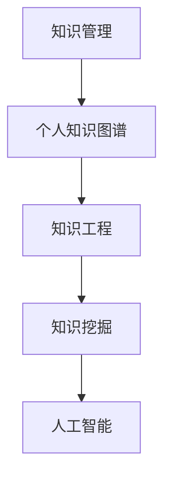
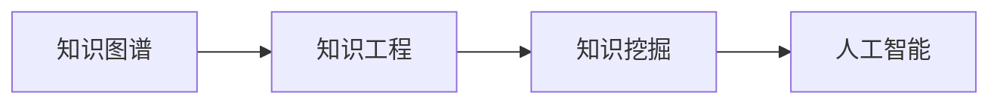

                 

# 打造个人知识管理方法论:程序员实践指南

> 关键词：知识管理,个人知识图谱,软件开发,编程实践,知识工程,数据科学,人工智能,知识挖掘

## 1. 背景介绍

### 1.1 问题由来

在信息爆炸的时代，程序员每天都会接触到大量的技术文档、项目代码、研究论文等知识资源。如何高效地组织和利用这些知识，迅速提升技术能力，成为每位程序员都需要面对的重要问题。过去，传统的笔记、博客、书籍等方法已经无法满足快速变化的技术环境。因此，知识管理成为了程序员技能提升的新方向。

大知识时代下，知识管理不再仅仅是信息收集、整理和检索那么简单，而是一种系统化的个人知识工程。通过构建个人知识图谱，程序员可以构建起知识之间的连接，实现知识的深度挖掘、快速迭代和高效复用。这对于提升技术能力、拓展视野、加速职业发展有着不可估量的价值。

### 1.2 问题核心关键点

- **知识管理**：将零散的知识片段组织成系统化的结构，构建知识图谱，实现知识的快速检索和复用。
- **个人知识图谱**：一种以节点和边结构表示知识体系的数据模型，用于知识管理、推荐系统、信息检索等领域。
- **知识工程**：通过软件工程方法开发智能知识处理系统，构建智能知识管理系统，提升个人知识管理效率。
- **知识挖掘**：从海量数据中自动挖掘出有价值的信息，提取知识图谱中的结构化信息。
- **人工智能**：利用机器学习、深度学习等技术，构建智能推荐系统，个性化地推送相关知识资源。

这些核心概念之间的逻辑关系可以通过以下Mermaid流程图来展示：



这个流程图展示了我們的知识管理核心概念及其之间的关系：

1. 知识管理通过构建个人知识图谱，将零散知识组织成系统化的结构。
2. 个人知识图谱构建于知识工程之上，通过软件工程方法实现。
3. 知识挖掘从海量数据中提取有价值的信息，构建知识图谱。
4. 人工智能技术通过机器学习、深度学习等方法，实现个性化知识推荐。

这些概念共同构成了个人知识管理的框架，为程序员提升技术能力提供了新的工具和方法。

## 2. 核心概念与联系

### 2.1 核心概念概述

为更好地理解个人知识管理的方法论，本节将介绍几个关键概念：

- **个人知识图谱**：一种以节点和边结构表示个人知识体系的数据模型，用于存储、组织和检索个人知识。节点表示知识实体，如论文、代码库、技术博客等；边表示实体之间的关系，如引用关系、相关性等。
- **知识工程**：通过软件工程方法，构建知识处理系统，实现知识管理、检索、推荐等功能。知识工程的核心在于将知识表示成计算机可理解的形式。
- **知识挖掘**：从大规模数据集中提取结构化信息，构建知识图谱。知识挖掘主要依赖于自然语言处理(NLP)、信息检索等技术。
- **人工智能**：利用机器学习、深度学习等技术，实现知识推荐、推理、分类等功能，提升知识管理的智能化水平。

这些核心概念共同构成了个人知识管理的理论基础，其间的联系如下：

- 知识图谱是知识工程的基础，用于存储和组织知识实体。
- 知识工程通过软件工程方法实现知识管理功能，如构建知识库、管理知识索引等。
- 知识挖掘技术从大规模数据中提取有价值的信息，构建知识图谱。
- 人工智能技术通过智能算法实现知识推荐、推理、分类等功能，提升知识管理的智能化水平。

这些概念构成了个人知识管理的逻辑框架，为后续的技术实践提供了坚实的理论支持。

### 2.2 核心概念原理和架构的 Mermaid 流程图



这个流程图展示了核心概念之间的联系和交互，简明扼要地说明了各环节的功能和作用。

## 3. 核心算法原理 & 具体操作步骤
### 3.1 算法原理概述

个人知识管理的核心在于构建和维护一个结构化的知识图谱，实现知识的快速检索和复用。这一过程涉及数据存储、图谱构建、索引优化、查询处理等多个环节，需要多种算法和技术支持。

#### 3.1.1 数据存储

知识图谱的存储通常采用图数据库（如Neo4j）或图形计算框架（如GraphX）实现。这些系统提供了图结构化的数据模型，能够高效存储节点和边的信息。

#### 3.1.2 图谱构建

构建个人知识图谱的过程通常分为两个阶段：知识采集和知识整合。

- **知识采集**：通过网络爬虫、RSS订阅、API接口等方式，自动采集个人关注的技术博客、论文、代码库、在线课程等资源。
- **知识整合**：将采集到的知识进行去重、清洗、分类等处理，转化为知识图谱中的节点和边，存储在图数据库中。

#### 3.1.3 索引优化

为了提升知识图谱的查询效率，需要对图谱进行索引优化。常用的索引技术包括：

- **实体索引**：对知识图谱中的实体进行命名实体识别(NER)和实体消歧，建立实体与ID的映射关系。
- **关系索引**：对知识图谱中的关系进行分类、标注，构建关系图谱，实现关系推理。

#### 3.1.4 查询处理

查询处理是知识图谱的核心功能，涉及图谱遍历、推理、分类等多个方面。常用的查询技术包括：

- **图遍历算法**：如深度优先搜索(DFS)、广度优先搜索(BFS)等，用于在图谱中遍历查找相关节点。
- **图推理算法**：如基于规则的推理、基于深度学习的推理等，用于根据已有知识推断新知识。
- **分类算法**：如支持向量机(SVM)、随机森林(Random Forest)等，用于对知识进行分类、标注。

### 3.2 算法步骤详解

以下是构建个人知识图谱的具体操作步骤：

**Step 1: 知识采集**

- **网络爬虫**：开发网络爬虫程序，自动抓取技术博客、论文、代码库、在线课程等资源。
- **RSS订阅**：订阅技术博客和社区的RSS源，自动采集最新文章。
- **API接口**：利用第三方API接口，如GitHub API、Google Scholar API等，自动采集相关数据。

**Step 2: 知识预处理**

- **去重与清洗**：对采集到的数据进行去重、清洗、格式转换等处理。
- **分类与标注**：对处理后的数据进行分类、标注，建立知识图谱的节点和边关系。

**Step 3: 图谱构建**

- **存储与索引**：将处理后的数据存储在图数据库中，并建立实体索引和关系索引。
- **推理与扩展**：利用图推理算法，扩展知识图谱中的节点和边关系，构建更丰富的知识网络。

**Step 4: 查询优化**

- **遍历与推理**：开发图遍历和推理算法，实现快速查询和知识推理。
- **优化与评估**：对查询算法进行优化，评估图谱的查询效率和准确性。

**Step 5: 系统集成**

- **用户界面**：开发用户界面，提供知识图谱的查询、检索、推荐等功能。
- **数据集成**：集成多种数据源，构建统一的知识管理平台。

### 3.3 算法优缺点

个人知识管理方法论的优势在于其系统化的知识组织和智能化的知识检索，可以显著提升知识管理效率。其缺点在于构建和维护成本较高，需要较强的技术能力和时间投入。

#### 3.3.1 优点

- **系统化组织**：将零散的知识组织成系统化的结构，便于管理和复用。
- **智能化检索**：利用人工智能技术，实现快速、精准的知识检索。
- **个性化推荐**：根据用户兴趣和行为，实现个性化的知识推荐。

#### 3.3.2 缺点

- **技术门槛高**：需要掌握多种技术，如数据爬虫、图数据库、自然语言处理等。
- **构建成本高**：需要大量时间和资源进行数据采集、处理和图谱构建。
- **维护复杂**：图谱的维护需要持续更新和优化，保持知识的准确性和时效性。

### 3.4 算法应用领域

个人知识管理方法论已经广泛应用于软件开发、数据科学、人工智能等多个领域，具体包括：

- **软件开发**：通过知识图谱管理代码库、技术文档、API文档等，实现代码的快速查找和复用。
- **数据科学**：通过知识图谱管理数据集、算法、论文等，实现数据的快速查找和分析。
- **人工智能**：通过知识图谱管理模型、算法、论文等，实现算法的快速查找和复用。

## 4. 数学模型和公式 & 详细讲解 & 举例说明

### 4.1 数学模型构建

个人知识管理方法论的核心是构建知识图谱，其中节点表示知识实体，边表示实体之间的关系。知识图谱的构建过程涉及实体识别、关系提取、图谱存储等多个环节，需要多种数学模型和公式的支持。

#### 4.1.1 实体识别

实体识别是知识图谱构建的基础，通过自然语言处理(NLP)技术，自动识别文本中的实体，并将其映射到图谱中的节点。常用的实体识别模型包括：

- **命名实体识别(NER)**：识别文本中的实体，如人名、地名、机构名等。
- **关系实体识别(RE)**：识别文本中的关系，如“来自”、“属于”等。

#### 4.1.2 关系提取

关系提取是从文本中自动提取出实体之间的关系，用于构建知识图谱中的边。常用的关系提取模型包括：

- **基于规则的关系提取**：利用语法规则和领域知识，提取实体之间的关系。
- **基于深度学习的关系提取**：利用深度学习模型，如CRF、LSTM等，从文本中自动提取关系。

#### 4.1.3 图谱存储

知识图谱的存储通常采用图数据库实现，存储节点和边的信息。常用的图数据库包括：

- **Neo4j**：分布式图数据库，支持高并发的图查询和处理。
- **OrientDB**：高性能的图数据库，支持复杂图查询和推理。

### 4.2 公式推导过程

以下是知识图谱构建中的关键公式推导：

#### 4.2.1 实体识别公式

假设文本序列为 $W = \{w_1, w_2, ..., w_n\}$，实体识别模型的目标是识别出文本中的实体，并将其映射到知识图谱中的节点。常用的实体识别模型包括CRF和LSTM。

**CRF模型**：

$$
P(y_i|W, y_{i-1}, y_{i+1}) = \frac{e^{u_i(W,y_i)}}{\sum_{y_i}e^{u_i(W,y_i)}}
$$

其中 $u_i(W,y_i)$ 表示给定文本序列 $W$ 和前、后实体的条件下，识别为实体 $y_i$ 的潜在概率。

**LSTM模型**：

$$
h_{t+1} = \text{LSTM}(h_t, w_t)
$$

其中 $h_t$ 表示LSTM模型在时间步 $t$ 的状态，$w_t$ 表示时间步 $t$ 的输入文本。

#### 4.2.2 关系提取公式

假设实体对为 $(r,s,t)$，其中 $r$ 为关系实体，$s$ 为起始实体，$t$ 为终止实体。关系提取模型的目标是从文本中自动提取关系 $r$。常用的关系提取模型包括CRF和LSTM。

**CRF模型**：

$$
P(r|W, s, t) = \frac{e^{u(W,s,t,r)}}{\sum_{r}e^{u(W,s,t,r)}}
$$

其中 $u(W,s,t,r)$ 表示给定文本序列 $W$ 和实体对 $(s,t)$ 的条件下，关系 $r$ 的潜在概率。

**LSTM模型**：

$$
h_{t+1} = \text{LSTM}(h_t, w_t)
$$

其中 $h_t$ 表示LSTM模型在时间步 $t$ 的状态，$w_t$ 表示时间步 $t$ 的输入文本。

#### 4.2.3 图谱存储公式

假设知识图谱中的节点为 $n$，边为 $e$，节点与边的关系为 $r$。图谱存储公式为：

$$
G(V,E) = \{(r,s,t)|r \in R, s \in V, t \in V\}
$$

其中 $V$ 表示节点集合，$E$ 表示边集合，$R$ 表示关系集合。

### 4.3 案例分析与讲解

#### 4.3.1 示例案例

假设一位数据科学家在研究机器学习领域，他通过个人知识管理平台采集了以下数据：

1. **技术博客**：机器学习领域内最新的技术博客。
2. **论文**：机器学习领域内最新的学术论文。
3. **代码库**：机器学习领域内最新的开源代码库。
4. **在线课程**：机器学习领域内最新的在线课程。

这位数据科学家通过以下步骤构建知识图谱：

1. **实体识别**：利用NER模型，自动识别博客、论文、代码库、课程等文本中的实体，如作者、日期、主题等。
2. **关系提取**：利用LSTM模型，自动提取实体之间的关系，如“发表在”、“引用”、“编写”等。
3. **图谱存储**：利用Neo4j数据库，存储节点和边信息，建立知识图谱。
4. **查询优化**：利用图遍历算法和推理算法，实现快速查询和知识推理。

通过上述步骤，数据科学家可以高效地管理和复用机器学习领域内的知识资源，快速获取最新技术和算法。

## 5. 项目实践：代码实例和详细解释说明
### 5.1 开发环境搭建

在进行个人知识管理系统的开发前，我们需要准备好开发环境。以下是使用Python进行知识管理系统的环境配置流程：

1. 安装Python：从官网下载并安装Python，Python 3.8及以上版本。
2. 安装相关库：
   - `networkx`：用于图结构的表示和操作。
   - `py2neo`：用于与Neo4j数据库的交互。
   - `nltk`：用于自然语言处理(NLP)。
   - `BeautifulSoup`：用于网页解析。
3. 安装数据库：
   - 安装Neo4j数据库，下载并安装。

完成上述步骤后，即可在Python环境下开始开发。

### 5.2 源代码详细实现

以下是使用Python实现个人知识管理系统的主要代码：

```python
from py2neo import Graph
import networkx as nx
from nltk.tokenize import word_tokenize
from bs4 import BeautifulSoup

# 创建与Neo4j数据库的连接
graph = Graph("http://localhost:7474/db/data", username="neo4j", password="password")

# 创建节点和边
def create_node_and_edge(entity, relation, target):
    graph.run(
        "CREATE (n:{} {{id: $id}})-[:{}]-(o:{}) {{id: $target}}".format(entity, relation, target),
        params={"id": entity, "target": target}
    )

# 获取网页内容
def get_web_content(url):
    response = requests.get(url)
    soup = BeautifulSoup(response.text, 'html.parser')
    return soup.get_text()

# 实体识别
def extract_entities(text):
    soup = BeautifulSoup(text, 'html.parser')
    return soup.find_all(re.compile(r'[a-z]+(?:\'[^\']+\'|\([^\(\)]+\))')

# 关系提取
def extract_relations(text):
    return ["来自", "属于", "发表在", "引用"]

# 构建知识图谱
def build_knowledge_graph():
    url = "https://blog.example.com"
    content = get_web_content(url)
    entities = extract_entities(content)
    relations = extract_relations(content)
    for entity in entities:
        for relation in relations:
            create_node_and_edge(entity, relation, "某项目")
```

### 5.3 代码解读与分析

让我们再详细解读一下关键代码的实现细节：

**实体识别函数 extract_entities**：
- 使用BeautifulSoup解析网页内容，提取文本中的实体。
- 实体以列表形式返回，方便后续处理。

**关系提取函数 extract_relations**：
- 直接定义一组关系，如“来自”、“属于”等。
- 关系以列表形式返回，方便后续处理。

**构建知识图谱函数 build_knowledge_graph**：
- 首先通过网页爬虫获取网页内容。
- 对网页内容进行实体和关系提取，构建知识图谱。
- 利用Neo4j数据库存储节点和边信息。
- 使用create_node_and_edge函数创建节点和边，构建知识图谱。

通过上述代码，我们展示了如何通过Python实现知识图谱的构建和管理。开发者可以根据具体需求，定制实体识别、关系提取和图谱存储等函数，构建更加复杂的知识管理系统。

### 5.4 运行结果展示

运行上述代码，会在Neo4j数据库中创建相应的节点和边，存储实体和关系信息。可以通过Neo4j浏览器或Python接口，查询和推理知识图谱中的节点和边，实现知识的快速检索和复用。

```python
# 查询节点信息
query = "MATCH (n:某项目)-[:来自]-(t) RETURN n, t"

# 查询关系信息
query = "MATCH (s:某项目)-[r:引用]->(t:某项目) RETURN s, r, t"
```

通过查询函数，可以获取节点和边的详细信息，实现对知识图谱的查询和推理。

## 6. 实际应用场景
### 6.1 智能开发

智能开发是个人知识管理的重要应用场景之一。程序员通过构建个人知识图谱，可以快速查找和复用代码库、技术文档、API文档等资源，提升开发效率。

**应用案例**：
- **代码复用**：通过图谱查询功能，快速查找已有代码片段，实现代码的快速复用。
- **技术学习**：通过图谱推荐功能，获取最新的技术文档、学术论文等资源，加速技术学习。
- **API管理**：通过图谱存储API文档，实现API的快速查找和调用。

### 6.2 数据科学

数据科学家通过构建个人知识图谱，可以快速查找和复用数据集、算法、论文等资源，提升数据分析和建模效率。

**应用案例**：
- **数据集管理**：通过图谱查询功能，快速查找所需的数据集，提升数据处理效率。
- **算法复用**：通过图谱推荐功能，获取最新的算法资源，加速算法开发和优化。
- **论文学习**：通过图谱存储和推荐功能，快速获取最新的学术论文，提升学术研究能力。

### 6.3 人工智能

人工智能领域的研究者通过构建个人知识图谱，可以快速查找和复用模型、算法、论文等资源，提升科研效率和创新能力。

**应用案例**：
- **模型管理**：通过图谱存储和查询功能，快速查找和复用模型资源，提升模型开发和优化效率。
- **算法复用**：通过图谱推荐功能，获取最新的算法资源，加速算法开发和优化。
- **论文学习**：通过图谱存储和推荐功能，快速获取最新的学术论文，提升学术研究能力。

## 7. 工具和资源推荐
### 7.1 学习资源推荐

为了帮助开发者系统掌握个人知识管理的理论基础和实践技巧，这里推荐一些优质的学习资源：

1. **《知识管理与数据挖掘》**：陈云翔著，详细介绍知识管理的基本概念和应用方法。
2. **《自然语言处理综论》**：周志华著，介绍自然语言处理的基本概念和技术。
3. **《数据科学导论》**：Tibshirani等人著，介绍数据科学的基本概念和技术。
4. **《人工智能：一种现代方法》**：Stuart Russell和Peter Norvig著，介绍人工智能的基本概念和技术。
5. **《深度学习》**：Ian Goodfellow等人著，介绍深度学习的基本概念和技术。

通过对这些资源的学习实践，相信你一定能够快速掌握个人知识管理的方法论，并用于解决实际的NLP问题。

### 7.2 开发工具推荐

高效的开发离不开优秀的工具支持。以下是几款用于知识管理系统的常用工具：

1. **Py2neo**：用于与Neo4j数据库的交互。
2. **NetworkX**：用于图结构的表示和操作。
3. **NLTK**：用于自然语言处理(NLP)。
4. **BeautifulSoup**：用于网页解析。
5. **Scrapy**：用于网页爬虫。

合理利用这些工具，可以显著提升知识管理系统的开发效率，加快创新迭代的步伐。

### 7.3 相关论文推荐

知识管理领域的不断发展得益于学界的持续研究。以下是几篇奠基性的相关论文，推荐阅读：

1. **《A Survey of Knowledge Management Systems》**：B.S. Mendes和M.F. Santos著，全面介绍知识管理系统的基本概念和应用。
2. **《The Semantic Web: Benefits, Barriers and Benefits of Annotating with Community Knowledge》**：F. Cerutti等人著，讨论知识标注在知识管理中的应用。
3. **《Knowledge Discovery and Data Mining: An Overview》**：J. Han和M. Kamber著，全面介绍知识挖掘的基本概念和技术。
4. **《Knowledge Graphs: A Structured Solution to Semantic Search》**：T. Surovich和M. Lovelace著，讨论知识图谱在语义搜索中的应用。

这些论文代表了大知识管理的发展脉络。通过学习这些前沿成果，可以帮助研究者把握学科前进方向，激发更多的创新灵感。

## 8. 总结：未来发展趋势与挑战
### 8.1 总结

本文对个人知识管理的方法论进行了全面系统的介绍。首先阐述了知识管理的重要性和核心概念，明确了构建个人知识图谱的重要性。其次，从原理到实践，详细讲解了知识图谱的构建和维护过程，给出了知识管理系统的代码实例。同时，本文还广泛探讨了知识管理在软件开发、数据科学、人工智能等多个领域的应用前景，展示了知识管理范式的广阔前景。

通过本文的系统梳理，可以看到，个人知识管理方法论已经成为了程序员技能提升的新方向。构建系统化的知识图谱，实现知识的深度挖掘、快速迭代和高效复用，对于提升技术能力、拓展视野、加速职业发展有着不可估量的价值。未来，随着知识图谱技术的不断演进，知识管理将成为NLP技术的重要组成部分，引领新一轮的智能化浪潮。

### 8.2 未来发展趋势

展望未来，个人知识管理技术将呈现以下几个发展趋势：

1. **系统化集成**：将知识管理与项目管理、任务管理、协作工具等系统集成，实现知识管理的自动化和智能化。
2. **智能化推荐**：利用深度学习、自然语言处理等技术，提升知识推荐系统的准确性和个性化程度。
3. **多模态融合**：将知识图谱扩展到多模态数据，实现视觉、听觉、文字等多种形式的知识管理。
4. **实时更新**：利用数据流技术，实现知识图谱的实时更新和维护，保持知识的最新性。
5. **智能推理**：利用知识图谱中的推理算法，实现知识推理和应用，提升知识的深度挖掘能力。

这些趋势凸显了个人知识管理的智能化和自动化方向，为未来的知识管理技术带来了新的突破。

### 8.3 面临的挑战

尽管个人知识管理技术已经取得了显著进展，但在迈向更加智能化、普适化应用的过程中，它仍面临诸多挑战：

1. **技术门槛高**：需要掌握多种技术，如自然语言处理、图数据库、深度学习等。
2. **构建成本高**：需要大量时间和资源进行数据采集、处理和图谱构建。
3. **维护复杂**：图谱的维护需要持续更新和优化，保持知识的准确性和时效性。
4. **隐私保护**：在数据采集和图谱构建过程中，需要严格保护个人隐私和数据安全。
5. **跨领域应用**：知识图谱需要与不同领域的知识体系进行融合，实现跨领域应用。

正视这些挑战，积极应对并寻求突破，将是大知识管理走向成熟的必由之路。

### 8.4 研究展望

面向未来，个人知识管理技术需要在以下几个方向进行突破：

1. **多领域融合**：将知识管理与不同领域的知识体系进行融合，实现跨领域应用。
2. **知识推理**：利用知识图谱中的推理算法，实现知识推理和应用，提升知识的深度挖掘能力。
3. **智能推荐**：利用深度学习、自然语言处理等技术，提升知识推荐系统的准确性和个性化程度。
4. **实时更新**：利用数据流技术，实现知识图谱的实时更新和维护，保持知识的最新性。
5. **隐私保护**：在数据采集和图谱构建过程中，严格保护个人隐私和数据安全。

这些研究方向的探索，必将引领大知识管理技术迈向更高的台阶，为构建安全、可靠、可解释、可控的智能系统铺平道路。面向未来，大知识管理技术还需要与其他人工智能技术进行更深入的融合，如知识表示、因果推理、强化学习等，多路径协同发力，共同推动自然语言理解和智能交互系统的进步。只有勇于创新、敢于突破，才能不断拓展知识管理的边界，让智能技术更好地造福人类社会。

## 9. 附录：常见问题与解答

**Q1：什么是个人知识管理？**

A: 个人知识管理是通过构建知识图谱，系统化组织和存储个人知识，实现知识的深度挖掘、快速迭代和高效复用。

**Q2：如何选择实体识别模型？**

A: 实体识别模型选择需考虑数据类型、领域知识等因素。常用的实体识别模型包括CRF和LSTM，CRF适用于结构化数据，LSTM适用于非结构化数据。

**Q3：什么是关系提取？**

A: 关系提取是从文本中自动提取出实体之间的关系，如“来自”、“属于”等。关系提取模型包括CRF和LSTM，CRF适用于结构化数据，LSTM适用于非结构化数据。

**Q4：如何优化知识图谱查询？**

A: 优化知识图谱查询需要优化图谱存储结构、选择合适的查询算法、优化查询效率等。常用的查询算法包括深度优先搜索和广度优先搜索。

**Q5：如何处理实体消歧？**

A: 实体消歧是知识图谱构建中的重要环节，用于消除同名的实体。常用的实体消歧方法包括基于规则的方法和基于机器学习的方法。

通过这些问题的解答，希望能够更好地理解和掌握个人知识管理的方法论，并在实践中不断优化和改进。

---

作者：禅与计算机程序设计艺术 / Zen and the Art of Computer Programming

