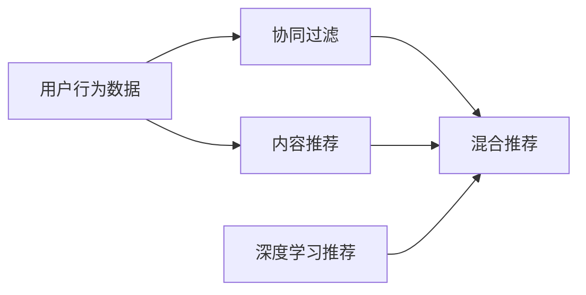

                 

# 打造技术型知识付费平台的推荐算法

## 1. 背景介绍

在互联网快速发展的时代，知识付费平台正成为人们获取高质量信息的重要渠道。技术型知识付费平台专注于深度技术文章和课程，强调技术深度和创新性，吸引了众多技术爱好者的关注。这类平台需要高效的推荐算法，为用户提供个性化、有价值的阅读体验。本文将详细介绍如何构建适合技术型知识付费平台的推荐算法，涵盖推荐算法的基本原理、实现步骤、优势与挑战等。

## 2. 核心概念与联系

### 2.1 核心概念概述

- **推荐算法**：通过用户的历史行为、兴趣和偏好，推荐用户可能感兴趣的内容，以提升用户体验和平台活跃度。推荐算法常用于电商、新闻、视频等各类网站和应用中。

- **协同过滤**：一种常用的推荐算法，通过分析用户和物品之间的相似性，预测用户可能感兴趣的物品。协同过滤分为基于用户的协同过滤和基于物品的协同过滤两种。

- **内容推荐**：基于内容的推荐算法，根据物品的属性特征，推荐与用户历史行为相似的物品。

- **混合推荐**：结合多种推荐算法，取长补短，提高推荐效果。

- **深度学习推荐**：利用深度神经网络对用户行为和物品特征进行建模，提升推荐精度。

这些概念之间存在紧密联系，协同过滤、内容推荐和混合推荐都属于较为传统的推荐技术，而深度学习推荐则是近年来兴起的高效技术手段。在实际应用中，不同的推荐算法可根据具体情况进行选择和组合，构建更符合平台需求的推荐系统。

### 2.2 核心概念原理和架构的 Mermaid 流程图



上述流程图展示了推荐算法的基本架构，其中用户行为数据为输入，经过协同过滤、内容推荐、混合推荐和深度学习推荐后，输出推荐结果。

## 3. 核心算法原理 & 具体操作步骤

### 3.1 算法原理概述

技术型知识付费平台的推荐算法，旨在通过用户的历史行为和兴趣，推荐其可能感兴趣的技术文章和课程。推荐算法一般分为两个步骤：

1. **用户兴趣建模**：分析用户的历史浏览、收藏、阅读时间等行为，构建用户兴趣模型。
2. **内容推荐**：根据用户兴趣模型，预测用户可能感兴趣的内容，生成推荐结果。

### 3.2 算法步骤详解

#### 3.2.1 用户兴趣建模

用户兴趣建模的目的是从用户的历史行为数据中提取用户的兴趣偏好，并量化为可计算的特征向量。常用的方法包括：

- **基于协同过滤的方法**：通过分析用户对相似物品的评分和行为，预测用户对新物品的评分和行为。常见算法有基于用户的协同过滤、基于物品的协同过滤等。

- **基于内容的推荐方法**：根据物品的特征属性，预测用户对物品的兴趣。常见算法有基于项目的基于内容推荐、基于用户特征的基于内容推荐等。

- **深度学习方法**：利用深度神经网络对用户行为和物品特征进行建模，捕捉高阶交互和复杂特征。常见算法有基于序列的深度推荐、基于知识的深度推荐等。

#### 3.2.2 内容推荐

内容推荐的主要目标是生成用户可能感兴趣的推荐内容。常见的推荐策略包括：

- **热门推荐**：推荐当前热门的内容，如最近发布的技术文章和课程。

- **个性化推荐**：根据用户兴趣模型，推荐用户可能感兴趣的内容。

- **多样化推荐**：保证推荐内容的多样性，避免推荐同质化内容。

- **交互式推荐**：允许用户与推荐结果进行互动，通过点击、评分等方式反馈用户对推荐结果的兴趣。

### 3.3 算法优缺点

#### 3.3.1 优点

- **高效性**：推荐算法可以快速生成推荐结果，提升用户体验。

- **个性化**：推荐算法能够根据用户兴趣和偏好，生成个性化的推荐内容，提升用户满意度。

- **泛化能力**：推荐算法能够处理大规模数据，适应各种数据分布。

- **可扩展性**：推荐算法可以方便地集成到各类应用中，支持多种推荐场景。

#### 3.3.2 缺点

- **数据依赖性强**：推荐算法的准确性依赖于数据的质量和完整性。

- **冷启动问题**：对于新用户或新物品，推荐算法可能无法生成准确的推荐结果。

- **模型复杂度**：复杂的深度学习模型需要大量的计算资源和数据存储，存在一定的计算和存储瓶颈。

- **可解释性差**：推荐算法通常是"黑盒"系统，难以解释推荐结果的生成过程。

### 3.4 算法应用领域

推荐算法广泛应用于电商、新闻、视频等各类网站和应用中，是提高用户体验和平台活跃度的重要手段。具体到技术型知识付费平台，推荐算法可以用于以下场景：

- **文章推荐**：推荐用户可能感兴趣的技术文章，提升用户阅读体验。

- **课程推荐**：根据用户兴趣和历史行为，推荐合适的技术课程，提高课程销售转化率。

- **专家推荐**：推荐领域内权威专家，增加用户对平台的信任感。

- **学习路径推荐**：根据用户的学习历史，推荐一条适合的学习路径，提升学习效率。

## 4. 数学模型和公式 & 详细讲解 & 举例说明

### 4.1 数学模型构建

推荐算法通常通过构建用户-物品关联矩阵来描述用户对物品的评分和行为。设用户集合为 $U=\{u_1,u_2,\cdots,u_m\}$，物品集合为 $V=\{v_1,v_2,\cdots,v_n\}$，用户 $u_i$ 对物品 $v_j$ 的评分表示为 $r_{ij}$。推荐系统的目标是通过用户行为数据 $D=\{r_{ij}\}$，预测用户对新物品 $v_{n+1}$ 的评分 $r_{in+1}$。

推荐算法常用的数学模型包括矩阵分解、协同过滤、基于内容的推荐等。这里以协同过滤为例，介绍推荐模型的构建。

#### 4.1.1 基于用户的协同过滤

基于用户的协同过滤算法，通过分析用户之间的相似性，预测用户对新物品的评分。设用户 $u_i$ 对物品 $v_j$ 的评分矩阵为 $R_{ij}$，用户 $u_i$ 和用户 $u_j$ 的相似度为 $s_{ij}$，则用户 $u_i$ 对新物品 $v_{n+1}$ 的评分预测为：

$$
\hat{r}_{in+1} = \sum_{j=1}^{n} s_{ij} \times R_{j,n+1}
$$

#### 4.1.2 基于物品的协同过滤

基于物品的协同过滤算法，通过分析物品之间的相似性，预测用户对新物品的评分。设物品 $v_j$ 对物品 $v_{n+1}$ 的评分矩阵为 $P_{j,n+1}$，物品 $v_j$ 和物品 $v_{n+1}$ 的相似度为 $p_{j,n+1}$，则物品 $v_j$ 对用户 $u_i$ 的评分预测为：

$$
\hat{r}_{ij} = \sum_{k=1}^{n} p_{kj} \times P_{k,n+1}
$$

### 4.2 公式推导过程

#### 4.2.1 基于用户的协同过滤公式推导

设 $A$ 为评分矩阵 $R$ 的用户行为向量化表示，$B$ 为物品行为向量化表示，$C$ 为用户相似度矩阵，则基于用户的协同过滤模型可以表示为：

$$
A = UC
$$

其中 $U$ 为用户特征矩阵，$C$ 为相似度矩阵。根据矩阵分解理论，$A$ 可以表示为：

$$
A = \hat{U} \hat{C}
$$

其中 $\hat{U}$ 为潜在用户矩阵，$\hat{C}$ 为潜在相似度矩阵。将上述公式代入 $\hat{r}_{in+1}$ 的公式中，可得：

$$
\hat{r}_{in+1} = \sum_{j=1}^{n} \hat{C}_{ij} \times \hat{P}_{j,n+1}
$$

#### 4.2.2 基于物品的协同过滤公式推导

基于物品的协同过滤模型可以表示为：

$$
P = AB^T
$$

其中 $B$ 为物品特征矩阵。根据矩阵分解理论，$P$ 可以表示为：

$$
P = \hat{A} \hat{B}
$$

其中 $\hat{A}$ 为潜在物品矩阵，$\hat{B}$ 为潜在物品特征矩阵。将上述公式代入 $\hat{r}_{ij}$ 的公式中，可得：

$$
\hat{r}_{ij} = \sum_{k=1}^{n} \hat{A}_{kj} \times \hat{B}_{k,i}
$$

### 4.3 案例分析与讲解

#### 4.3.1 案例背景

某技术型知识付费平台拥有大量用户行为数据，包含用户对技术文章的评分和阅读行为。平台希望通过推荐算法，提升用户对平台的粘性和活跃度。

#### 4.3.2 算法选择

根据平台数据特点和需求，选择基于用户的协同过滤算法作为主要推荐策略。首先，通过用户行为数据构建用户相似度矩阵 $C$。然后，根据相似度矩阵预测用户对新文章的评分。

#### 4.3.3 实现流程

1. 数据预处理：对用户行为数据进行清洗、归一化等预处理，构建用户-物品评分矩阵 $R$。

2. 用户相似度计算：计算用户之间的相似度，构建用户相似度矩阵 $C$。

3. 评分预测：根据用户相似度矩阵，预测用户对新文章的评分，生成推荐结果。

## 5. 项目实践：代码实例和详细解释说明

### 5.1 开发环境搭建

推荐算法开发通常需要Python、PyTorch、Scikit-learn等工具支持。以下是在Python环境下搭建开发环境的步骤：

1. 安装Python：从官网下载并安装Python 3.x版本，如Python 3.7。

2. 安装PyTorch：使用pip安装PyTorch：

   ```bash
   pip install torch torchvision torchaudio
   ```

3. 安装Scikit-learn：使用pip安装Scikit-learn：

   ```bash
   pip install scikit-learn
   ```

4. 安装Numpy：使用pip安装Numpy：

   ```bash
   pip install numpy
   ```

### 5.2 源代码详细实现

以下是一个基于用户协同过滤算法推荐模型的Python代码实现：

```python
import numpy as np
from scipy.sparse import csr_matrix

# 用户-物品评分矩阵
R = np.array([[4, 3, 5], [3, 5, 4], [2, 1, 3]])

# 构建用户-物品评分矩阵的用户行为向量化表示
A = csr_matrix(R)

# 计算用户之间的相似度
C = A.T @ A / (A.sum(axis=1)[:, np.newaxis] @ A.sum(axis=0))

# 预测新物品的评分
n_plus_1 = np.array([6, 7, 8])
predict_r = C @ n_plus_1

print(predict_r)
```

### 5.3 代码解读与分析

在上述代码中，首先定义了用户-物品评分矩阵 $R$，然后将其转换为稀疏矩阵 $A$。接着，通过计算 $A^T \times A$ 的每个元素除以对角线上的元素，得到用户相似度矩阵 $C$。最后，将新物品 $v_{n+1}$ 的评分向量 $n_{n+1}$ 与用户相似度矩阵 $C$ 相乘，得到用户对新物品的评分预测 $\hat{r}_{in+1}$。

## 6. 实际应用场景

### 6.1 热门推荐

热门推荐是一种基于时间序列的推荐策略，推荐平台上的热门文章和课程。通过分析当前平台上的访问量、收藏量等数据，选择访问量高的文章和课程作为热门推荐。

### 6.2 个性化推荐

个性化推荐是推荐算法的核心，根据用户的历史行为和兴趣，生成个性化推荐列表。具体实现可以通过协同过滤、基于内容的推荐、深度学习推荐等算法，结合多种推荐策略，提升推荐效果。

### 6.3 学习路径推荐

学习路径推荐是通过分析用户的学习历史，为用户推荐一条适合的学习路径。常见的方法包括基于内容推荐和协同过滤，通过分析用户的历史行为和兴趣，推荐相关的课程和文章。

### 6.4 未来应用展望

未来推荐算法将向着智能化、个性化、实时化方向发展。随着深度学习、自然语言处理、知识图谱等技术的进步，推荐算法将具备更强的用户行为理解能力和智能推理能力，能够实时动态地调整推荐结果，提升用户体验。

## 7. 工具和资源推荐

### 7.1 学习资源推荐

推荐算法是数据科学和机器学习领域的重要组成部分，以下是一些推荐算法的学习资源：

- 《推荐系统》（项群等著）：详细介绍推荐系统的基本原理和实现方法，适合入门读者。

- 《Python推荐系统》（刘洁等著）：介绍Python环境下推荐系统的实现，适合动手实践。

- 《推荐系统实战》（黄家熙等著）：通过实际案例介绍推荐系统的设计、开发和部署，适合实战参考。

- 《推荐系统算法》（周志华等著）：介绍推荐算法的理论基础和实际应用，适合深入学习。

- Kaggle推荐系统竞赛：参与Kaggle推荐系统竞赛，通过实际项目提高算法设计能力。

### 7.2 开发工具推荐

推荐算法开发通常使用Python、PyTorch、TensorFlow等工具，以下是一些推荐算法的开发工具：

- Python：强大的编程语言，广泛用于数据科学和机器学习领域。

- PyTorch：灵活的深度学习框架，支持GPU加速，适合进行复杂模型的训练和优化。

- TensorFlow：谷歌开发的深度学习框架，支持分布式计算和GPU加速，适合大规模模型训练。

- Jupyter Notebook：交互式编程环境，支持Python、R等语言，方便快速迭代和调试。

- Weights & Biases：实验跟踪工具，用于记录和可视化模型训练过程，方便实验对比和调优。

### 7.3 相关论文推荐

推荐算法的研究不断深入，以下是一些经典推荐算法的相关论文：

- 《基于协同过滤的推荐系统研究》（苏鹏等著）：介绍基于协同过滤的推荐系统，是推荐算法研究的经典之作。

- 《深度学习在推荐系统中的应用》（周志华等著）：介绍深度学习在推荐系统中的应用，适合深入学习。

- 《基于内容的推荐算法》（刘洁等著）：介绍基于内容的推荐算法，适合入门读者。

- 《混合推荐算法》（刘洁等著）：介绍混合推荐算法，适合实战参考。

- 《基于序列的深度推荐算法》（刘洁等著）：介绍基于序列的深度推荐算法，适合深入学习。

## 8. 总结：未来发展趋势与挑战

### 8.1 研究成果总结

推荐算法已经成为数据科学和机器学习领域的重要组成部分，广泛应用于电商、新闻、视频等各类网站和应用中。推荐算法通过用户行为数据建模，生成个性化推荐结果，提升了用户体验和平台活跃度。

### 8.2 未来发展趋势

未来推荐算法将向着智能化、个性化、实时化方向发展。随着深度学习、自然语言处理、知识图谱等技术的进步，推荐算法将具备更强的用户行为理解能力和智能推理能力，能够实时动态地调整推荐结果，提升用户体验。

### 8.3 面临的挑战

推荐算法在发展过程中，仍然面临一些挑战：

- 数据质量和多样性：推荐算法的效果依赖于数据质量和多样性，数据质量不高或数据集多样性不足，会影响推荐效果。

- 计算和存储成本：复杂模型需要大量的计算和存储资源，高昂的成本可能会限制算法的推广应用。

- 可解释性：推荐算法的"黑盒"特性使得难以解释其推荐结果的生成过程，影响用户信任感。

- 冷启动问题：新用户或新物品可能无法生成准确的推荐结果，影响用户体验。

### 8.4 研究展望

未来推荐算法的研究将围绕以下方向展开：

- 数据增强和数据融合：通过数据增强和数据融合，提升推荐算法的数据质量和多样性。

- 计算和存储优化：通过计算和存储优化，降低推荐算法的成本。

- 可解释性和公平性：通过可解释性和公平性研究，提升推荐算法的可信度和公平性。

- 实时推荐系统：通过实时推荐系统，提升推荐算法的实时性和用户体验。

总之，推荐算法是提高用户体验和平台活跃度的重要手段，随着技术的不断进步，推荐算法将具有更广阔的应用前景和更多样化的应用场景。

## 9. 附录：常见问题与解答

### 9.1 什么是推荐算法？

推荐算法通过分析用户的历史行为和兴趣，推荐用户可能感兴趣的内容。推荐算法广泛应用于电商、新闻、视频等各类网站和应用中。

### 9.2 协同过滤算法有哪些优缺点？

协同过滤算法的优点是高效、简单、易于实现，能够快速生成推荐结果。缺点是数据依赖性强，对数据质量和多样性要求高，存在冷启动问题。

### 9.3 如何避免协同过滤算法的冷启动问题？

避免冷启动问题的方法包括数据增强、协同过滤和基于内容的推荐算法结合使用、利用用户特征等。

### 9.4 推荐算法的可解释性如何提升？

提升推荐算法的可解释性可以通过特征选择、规则模型等方法，将推荐结果的生成过程可视化，增加用户对推荐结果的理解和信任感。

### 9.5 推荐算法的研究热点是什么？

推荐算法的研究热点包括深度学习在推荐系统中的应用、推荐系统的实时化、推荐系统的可解释性、推荐系统的公平性等。

---

作者：禅与计算机程序设计艺术 / Zen and the Art of Computer Programming

