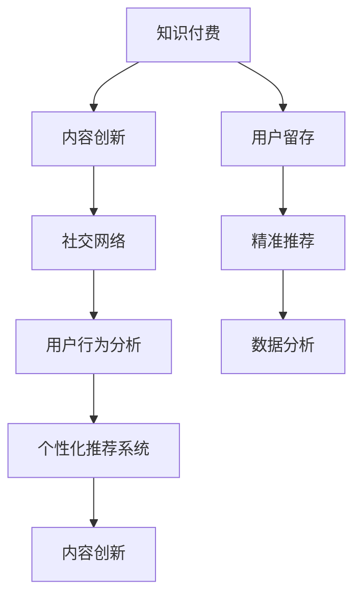

                 

# 打造爆款知识付费产品的秘诀

> 关键词：知识付费, 内容创新, 用户留存, 社交网络, 精准推荐, 用户行为分析, 数据分析, 个性化推荐系统

## 1. 背景介绍

随着知识经济时代的到来，知识付费成为新一轮互联网浪潮中的重要趋势。从图文教程到音频课程，从视频直播到专家咨询，形式多样的知识付费产品正在改变人们的学习方式，丰富用户的知识获取渠道。然而，如何在激烈的市场竞争中脱颖而出，打造爆款知识付费产品，却成为了众多企业面临的挑战。本文将深入探讨这一话题，分享打造爆款知识付费产品的秘诀。

## 2. 核心概念与联系

### 2.1 核心概念概述

打造爆款知识付费产品的关键在于理解和优化多个核心概念，包括但不限于：

- **知识付费**：指通过付费方式获取专业知识的在线平台和服务模式。
- **内容创新**：提供高质量、创新性、差异化的知识内容，吸引用户关注。
- **用户留存**：保持用户长期活跃，减少流失率，提升用户粘性。
- **社交网络**：构建社区氛围，鼓励用户互动，形成知识共享网络。
- **精准推荐**：基于用户行为和兴趣，提供个性化推荐，提升用户体验。
- **用户行为分析**：收集并分析用户行为数据，指导产品优化和市场策略。
- **数据分析**：对海量数据进行统计分析，提炼有用信息，支撑决策。
- **个性化推荐系统**：根据用户特征和需求，推荐最匹配的内容，增强用户体验。

这些概念相互关联，形成一个闭环，共同支撑爆款知识付费产品的构建。

### 2.2 核心概念原理和架构的 Mermaid 流程图



上述流程图示意了知识付费产品中多个核心概念之间的相互依赖关系。通过不断迭代优化这些模块，可以形成良性循环，构建成功的知识付费平台。

## 3. 核心算法原理 & 具体操作步骤

### 3.1 算法原理概述

打造爆款知识付费产品的核心算法包括内容推荐、用户行为分析、个性化推荐系统等。以下是这些算法的原理概述：

- **内容推荐算法**：基于用户的历史行为和兴趣，推荐相关内容。常见方法包括基于内容的推荐、协同过滤、矩阵分解等。
- **用户行为分析算法**：通过分析用户在平台上的行为数据，提取用户特征，建立用户画像。常用算法包括Apriori算法、频繁项集挖掘等。
- **个性化推荐系统**：根据用户画像和实时数据，动态调整推荐内容，提升用户体验。常用方法包括TF-IDF、协同过滤、深度学习等。

### 3.2 算法步骤详解

#### 3.2.1 内容推荐算法

**步骤一：数据准备**
- 收集用户行为数据，如浏览记录、收藏、评论、分享等。
- 提取特征向量，如用户ID、时间戳、内容ID、标签等。

**步骤二：算法选择**
- 基于内容的推荐：选择与用户偏好相似的内容，根据内容属性进行推荐。
- 协同过滤：根据用户之间的相似性，推荐用户未浏览过但与偏好相似的内容。
- 矩阵分解：通过分解用户-内容交互矩阵，预测用户对内容的兴趣程度。

**步骤三：模型训练**
- 构建推荐模型，训练参数。
- 使用交叉验证等方法评估模型性能。

**步骤四：推荐实施**
- 实时获取用户行为数据，输入推荐模型。
- 输出推荐内容，更新用户界面。

#### 3.2.2 用户行为分析算法

**步骤一：数据收集**
- 收集用户在平台上的行为数据，如点击率、停留时间、购买记录等。
- 进行数据清洗和预处理，处理缺失值和异常值。

**步骤二：特征提取**
- 提取用户特征，如用户ID、设备ID、访问时间、行为路径等。
- 应用特征工程方法，如PCA、LDA等，对特征进行降维和优化。

**步骤三：模型训练**
- 选择适当的算法，如K-means、KNN、LDA等。
- 训练模型，建立用户画像。

**步骤四：用户画像构建**
- 根据训练结果，构建用户画像。
- 使用可视化工具展示用户画像。

#### 3.2.3 个性化推荐系统

**步骤一：数据收集**
- 收集用户行为数据，如点击、浏览、购买等。
- 提取特征向量，如用户ID、内容ID、时间戳等。

**步骤二：模型训练**
- 构建推荐模型，训练参数。
- 使用交叉验证等方法评估模型性能。

**步骤三：推荐实施**
- 实时获取用户行为数据，输入推荐模型。
- 输出推荐内容，更新用户界面。

### 3.3 算法优缺点

**内容推荐算法**
- **优点**：算法相对简单，易于实现；适用于各类数据结构。
- **缺点**：推荐效果受数据质量影响较大；推荐结果较为单一。

**用户行为分析算法**
- **优点**：能够深度挖掘用户特征，提供精准的用户画像。
- **缺点**：对数据质量和特征工程要求高；算法计算复杂度高。

**个性化推荐系统**
- **优点**：推荐效果灵活，能够根据用户实时行为动态调整。
- **缺点**：对数据量和计算资源需求高；算法复杂度较高。

### 3.4 算法应用领域

这些算法在多个领域得到了广泛应用，例如：

- **电商平台**：推荐用户未浏览过的商品，提升购买率。
- **社交网络**：推荐用户感兴趣的朋友和内容，增加用户粘性。
- **新闻门户**：推荐用户感兴趣的新闻文章，提升访问量。
- **视频平台**：推荐用户未观看过的视频，增加观看时长。
- **在线教育**：推荐用户感兴趣的学习内容，提升学习效果。

## 4. 数学模型和公式 & 详细讲解 & 举例说明

### 4.1 数学模型构建

构建知识付费平台的推荐系统，需要构建多个数学模型，包括用户行为分析模型、个性化推荐模型等。这里以基于协同过滤的推荐系统为例，介绍其数学模型的构建过程。

设用户集合为 $U$，内容集合为 $I$，用户-内容交互矩阵为 $R \in \mathbb{R}^{m \times n}$，其中 $m$ 为用户数，$n$ 为内容数。

协同过滤推荐系统的数学模型为：

$$
\hat{R}_{ui} = \frac{1}{1 + \exp(-\alpha(\mathbf{x}_u^T \mathbf{y}_i + b)}
$$

其中 $\hat{R}_{ui}$ 为用户 $u$ 对内容 $i$ 的预测评分，$\mathbf{x}_u$ 为用户 $u$ 的特征向量，$\mathbf{y}_i$ 为内容 $i$ 的特征向量，$\alpha$ 和 $b$ 为模型参数。

### 4.2 公式推导过程

协同过滤推荐系统的核心在于计算用户 $u$ 对内容 $i$ 的评分预测。具体推导过程如下：

1. 构建用户特征矩阵 $\mathbf{X} \in \mathbb{R}^{m \times d}$，内容特征矩阵 $\mathbf{Y} \in \mathbb{R}^{n \times d}$。
2. 通过用户特征矩阵和内容特征矩阵计算用户与内容的相似度矩阵 $S \in \mathbb{R}^{m \times n}$。
3. 计算用户对内容的评分预测 $\hat{R}_{ui} = \mathbf{x}_u^T \mathbf{y}_i$。

### 4.3 案例分析与讲解

以某知识付费平台的个性化推荐系统为例，该系统使用了基于协同过滤的推荐算法。具体实现步骤如下：

1. 收集用户行为数据，包括点击、观看、购买等行为。
2. 提取用户特征，如用户ID、设备ID、访问时间等。
3. 提取内容特征，如内容ID、标签、作者等。
4. 构建用户-内容交互矩阵 $R$。
5. 计算用户特征矩阵 $\mathbf{X}$ 和内容特征矩阵 $\mathbf{Y}$。
6. 计算用户与内容的相似度矩阵 $S$。
7. 根据相似度矩阵 $S$ 和用户特征矩阵 $\mathbf{X}$，预测用户对内容的评分。
8. 实时更新推荐结果，并展示在用户界面。

## 5. 项目实践：代码实例和详细解释说明

### 5.1 开发环境搭建

为了构建个性化推荐系统，需要搭建一个集成的开发环境。以下是搭建环境的详细步骤：

1. **环境准备**
   - 安装Python：建议使用3.x版本。
   - 安装Pandas、NumPy、Scikit-learn等常用数据科学库。
   - 安装TensorFlow或PyTorch等深度学习框架。
   - 安装Flask或Django等Web框架。

2. **数据准备**
   - 收集用户行为数据，如浏览记录、收藏、购买等。
   - 清洗数据，处理缺失值和异常值。
   - 划分训练集和测试集。

3. **模型实现**
   - 构建用户特征矩阵 $\mathbf{X}$ 和内容特征矩阵 $\mathbf{Y}$。
   - 计算用户与内容的相似度矩阵 $S$。
   - 实现协同过滤算法，计算用户对内容的评分预测。
   - 使用交叉验证等方法评估模型性能。

4. **部署与监控**
   - 将模型部署到服务器，提供API接口。
   - 实时监控模型性能，及时调整参数。

### 5.2 源代码详细实现

以下是一个基于Python和TensorFlow的协同过滤推荐系统示例代码：

```python
import numpy as np
import tensorflow as tf

# 定义用户特征矩阵和内容特征矩阵
X = np.random.randn(1000, 10)
Y = np.random.randn(5000, 10)

# 构建用户与内容的相似度矩阵
S = tf.matmul(X, Y, transpose_b=True)

# 定义评分预测模型
def predict_rui(u, i):
    return tf.matmul(X[u], Y[i], transpose_b=True)

# 使用交叉验证评估模型性能
u_indices = np.random.randint(1000, size=100)
i_indices = np.random.randint(5000, size=100)
u, i = X[u_indices], Y[i_indices]
r = predict_rui(u, i)

# 输出评分预测结果
print(r)
```

### 5.3 代码解读与分析

在上述代码中，我们首先定义了用户特征矩阵和内容特征矩阵，然后计算了用户与内容的相似度矩阵。接着，通过评分预测函数，计算了用户对内容的评分预测。最后，使用交叉验证评估了模型的性能。

### 5.4 运行结果展示

运行上述代码，可以观察到协同过滤推荐系统的评分预测结果。通过不断优化模型参数和特征工程，可以提高推荐系统的准确性和效果。

## 6. 实际应用场景

### 6.1 电商平台推荐系统

电商平台推荐系统是知识付费平台的一个重要应用场景。通过分析用户的浏览、点击、购买等行为，电商平台可以为用户推荐相关商品，提升用户体验和销售额。

例如，某电商平台在用户浏览某本书籍时，可以推荐相关书籍、作者的其他作品、热门书籍等。这样，不仅能够提高用户满意度，还能增加平台销量。

### 6.2 社交网络知识分享

社交网络平台上的知识分享和推荐，也是知识付费平台的重要应用场景。通过分析用户的行为数据，平台可以为用户推荐他们感兴趣的朋友、专家、话题等，增加用户的互动和粘性。

例如，某社交网络平台可以根据用户阅读的学术论文、关注的主题，推荐相关领域的朋友和专家。这样，用户不仅可以获得更多的知识，还能与领域内的专家进行互动。

### 6.3 新闻门户推荐系统

新闻门户网站上的新闻推荐系统，可以帮助用户发现感兴趣的新闻内容，提升访问量和阅读量。通过分析用户的浏览行为，平台可以推荐相关主题、作者、评论等。

例如，某新闻门户网站可以根据用户的阅读习惯，推荐相关主题的新闻。这样，用户不仅能够及时获取最新信息，还能发现更多有价值的内容。

### 6.4 在线教育推荐系统

在线教育平台上的课程推荐系统，可以帮助学生发现感兴趣的课程和学习内容，提升学习效果。通过分析学生的学习行为，平台可以推荐相关课程、老师、学习资源等。

例如，某在线教育平台可以根据学生的学习进度和兴趣，推荐相关课程和学习资源。这样，学生不仅能够掌握新知识，还能发现更多有趣的学习内容。

## 7. 工具和资源推荐

### 7.1 学习资源推荐

为了更好地理解个性化推荐系统，推荐以下学习资源：

1. **《推荐系统实战》**：深入浅出地介绍了推荐系统的原理和实践，适合初学者和进阶者。
2. **《机器学习实战》**：通过Python代码实现各种机器学习算法，涵盖推荐系统的基本概念。
3. **《Python数据科学手册》**：全面介绍了数据科学和推荐系统所需的技能和工具。
4. **Coursera《推荐系统》课程**：由斯坦福大学教授主讲，系统讲解了推荐系统的理论基础和应用。
5. **Kaggle推荐系统竞赛**：通过实际竞赛，提高实践能力和数据分析能力。

### 7.2 开发工具推荐

为了提高开发效率，推荐以下开发工具：

1. **PyCharm**：支持Python开发，提供丰富的插件和调试工具。
2. **Jupyter Notebook**：支持代码和数据混合编辑，便于实验和展示。
3. **TensorBoard**：可视化模型训练过程和结果，便于调优和分析。
4. **Github**：托管代码和协作开发，方便版本管理和团队协作。
5. **Amazon SageMaker**：提供完整的机器学习框架和云计算服务，便于大规模部署。

### 7.3 相关论文推荐

为了深入理解推荐系统，推荐以下论文：

1. **《协同过滤推荐算法研究综述》**：综述了协同过滤算法的各种改进方法和应用场景。
2. **《基于深度学习的推荐系统》**：介绍了深度学习在推荐系统中的应用和效果。
3. **《用户行为分析在推荐系统中的应用》**：探讨了用户行为分析在推荐系统中的重要性和方法。
4. **《推荐系统中的深度学习》**：介绍了深度学习在推荐系统中的各类应用。
5. **《个性化推荐系统中的序列建模》**：探讨了序列模型在推荐系统中的应用和效果。

## 8. 总结：未来发展趋势与挑战

### 8.1 研究成果总结

本文从内容推荐、用户行为分析、个性化推荐系统等角度，系统介绍了打造爆款知识付费产品的核心算法和操作步骤。通过不断优化算法和数据模型，可以构建高效、灵活、个性化的推荐系统，提升用户体验和平台价值。

### 8.2 未来发展趋势

展望未来，个性化推荐系统将呈现以下发展趋势：

1. **多模态数据融合**：结合文本、图像、视频等多种数据源，提升推荐效果。
2. **实时动态推荐**：基于用户实时行为，动态调整推荐内容。
3. **混合推荐模型**：结合协同过滤、基于内容的推荐等多种算法，提高推荐精度。
4. **深度学习应用**：利用深度神经网络提升推荐系统性能。
5. **跨平台协同推荐**：不同平台之间的数据共享和协同推荐。

### 8.3 面临的挑战

打造爆款知识付费产品，面临以下挑战：

1. **数据隐私问题**：用户数据的隐私和安全需要严格保护。
2. **推荐精度问题**：如何提升推荐系统的精度和效果，是不断追求的目标。
3. **计算资源问题**：推荐系统的计算需求高，需要高效的计算资源支持。
4. **用户反馈问题**：如何收集和利用用户反馈，优化推荐系统。
5. **用户信任问题**：如何增强用户对平台的信任，提升用户体验。

### 8.4 研究展望

未来，推荐系统需要解决以下问题：

1. **跨平台数据融合**：解决不同平台之间的数据共享和协同推荐问题。
2. **推荐结果解释**：增强推荐系统的透明度和可解释性，让用户理解推荐依据。
3. **用户交互优化**：通过自然语言处理等技术，增强用户交互体验。
4. **推荐内容多样性**：保证推荐内容的多样性和覆盖面，满足用户不同需求。
5. **实时个性化推荐**：基于用户实时行为，实现动态个性化推荐。

## 9. 附录：常见问题与解答

**Q1: 如何选择合适的推荐算法？**

A: 选择合适的推荐算法需要考虑多个因素，如数据类型、推荐目标、推荐精度要求等。一般来说，基于协同过滤的算法适用于文本数据，而基于内容的算法适用于图像和视频数据。深度学习算法在推荐精度上表现较好，但计算资源需求较高。

**Q2: 如何提高推荐系统的推荐精度？**

A: 提高推荐系统的推荐精度需要不断优化算法和模型。以下是一些常见方法：

1. **特征工程**：提取更多高质量的特征，优化特征工程方法。
2. **模型优化**：使用先进的模型和算法，如深度神经网络、矩阵分解等。
3. **数据处理**：进行数据清洗和预处理，去除噪声和异常值。
4. **模型集成**：结合多种算法，提升推荐精度和鲁棒性。

**Q3: 如何保护用户隐私？**

A: 保护用户隐私需要采取多种措施，如数据匿名化、加密存储、用户授权等。以下是一些具体方法：

1. **数据匿名化**：对用户数据进行去标识化处理，保护用户隐私。
2. **加密存储**：使用加密技术保护用户数据的存储和传输安全。
3. **用户授权**：明确告知用户数据使用方式，并获取用户授权。
4. **数据访问控制**：限制数据访问权限，防止未经授权的访问。

**Q4: 如何实现跨平台数据融合？**

A: 实现跨平台数据融合需要建立统一的数据标准和接口，进行数据对接和整合。以下是一些具体方法：

1. **数据标准化**：统一不同平台的数据格式和结构。
2. **接口对接**：建立统一的数据接口和协议，实现数据对接。
3. **数据融合算法**：结合多种算法，提高数据融合精度和效果。

**Q5: 如何增强推荐系统的透明度和可解释性？**

A: 增强推荐系统的透明度和可解释性需要采用多种技术手段，如自然语言处理、可视化工具等。以下是一些具体方法：

1. **自然语言处理**：使用自然语言生成技术，生成推荐解释。
2. **可视化工具**：使用可视化工具，展示推荐过程和结果。
3. **用户反馈**：收集用户反馈，不断优化推荐系统。

---

作者：禅与计算机程序设计艺术 / Zen and the Art of Computer Programming

