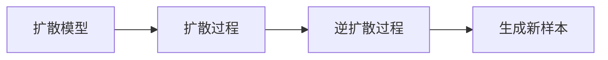

                 

# 扩散模型在艺术和设计中的应用

> 关键词：扩散模型, 艺术创作, 建筑设计, 人工智能, 自然语言处理, 文本生成

## 1. 背景介绍

### 1.1 问题由来

在当前数字化浪潮的推动下，人工智能(AI)技术已经深刻影响到了各行各业。在艺术和设计领域，AI技术也逐渐崭露头角。尤其是近年来，扩散模型（Diffusion Models）作为一种全新的生成模型，因其能够生成高质量的艺术作品而广受关注。扩散模型通过对样本数据进行学习，并利用噪声迭代生成，最终生成与样本数据相似的新样本。该模型在艺术和设计中的应用前景广阔，通过辅助创意和设计，可以极大地提升创作效率和作品质量。

### 1.2 问题核心关键点

扩散模型在艺术和设计中的应用涉及以下几个核心关键点：

1. **模型原理**：扩散模型基于噪声迭代生成过程，如何设计噪声分布函数和扩散过程是模型效果的关键。
2. **应用场景**：在艺术创作、建筑设计、产品设计等多个领域，扩散模型的应用场景及其优势。
3. **技术挑战**：扩散模型在艺术和设计领域应用中面临的计算资源、模型参数、数据质量等技术挑战。
4. **创新应用**：如何利用扩散模型进行自动化设计、生成式艺术创作等创新应用。
5. **伦理考量**：在艺术和设计创作中使用AI技术的伦理问题，如版权、原创性、人类与AI协作等。

这些关键点共同构成了扩散模型在艺术和设计领域应用的框架，本文将逐一探讨。

## 2. 核心概念与联系

### 2.1 核心概念概述

扩散模型是一种基于深度学习的生成模型，其核心思想是通过逐步添加噪声，将原始数据分布逐步扩散至目标分布，最终生成新的数据样本。该模型由两个关键组成部分：扩散过程和逆扩散过程。扩散过程将原始数据逐步添加噪声，逆扩散过程则通过反向过程将噪声逐步去除，最终生成高质量的新样本。

在艺术和设计领域，扩散模型可以用于生成各种形式的艺术作品，如绘画、雕塑、建筑设计等。通过训练模型，可以生成符合特定风格、主题的艺术作品，辅助设计师和艺术家进行创作。

### 2.2 核心概念原理和架构的 Mermaid 流程图



扩散过程和逆扩散过程是扩散模型的两个关键部分，它们通过迭代的方式逐步添加和去除噪声，最终生成新的数据样本。

## 3. 核心算法原理 & 具体操作步骤

### 3.1 算法原理概述

扩散模型基于噪声迭代生成过程，具体步骤如下：

1. **扩散过程**：将原始数据逐步添加噪声，生成噪声分布。
2. **逆扩散过程**：逐步去除噪声，生成新数据样本。

以下通过数学公式进行详细讲解。

### 3.2 算法步骤详解

**Step 1: 准备训练数据**

首先需要准备大量的训练数据，用于模型学习。训练数据可以是各种形式的艺术作品，如绘画、雕塑、建筑设计等。

**Step 2: 设计扩散过程**

扩散过程通常使用缓慢的、非对抗性的噪声添加策略，如Gaussian正态分布、Laplacian分布等。扩散过程的具体公式为：

$$ P_t(x_{t+1} | x_t) = \mathcal{N}(x_t, \sigma_t) $$

其中 $x_t$ 表示当前时刻的噪声分布，$\sigma_t$ 表示噪声的标准差。

**Step 3: 设计逆扩散过程**

逆扩散过程的目标是逐步去除噪声，恢复到原始数据分布。通常使用自回归模型，如变分自编码器（VAE）、神经网络等。逆扩散过程的公式为：

$$ P_{t-1}(x_t | x_{t+1}) = \mathcal{N}(x_{t+1}, \sigma_{t+1}) $$

**Step 4: 训练扩散模型**

在收集了大量的训练数据后，可以通过训练扩散模型来进行学习。扩散模型通常由两个网络组成：扩散网络（扩散过程）和逆扩散网络（逆扩散过程）。训练过程通常使用梯度下降等优化算法，最小化模型损失函数，从而优化模型的参数。

**Step 5: 生成新样本**

训练完成后，可以通过逆扩散过程生成新样本。具体的生成过程包括：

1. 随机生成一个噪声分布 $x_0$。
2. 逐步去除噪声，生成新样本 $x_T$。

### 3.3 算法优缺点

扩散模型的优点包括：

1. **高质量生成**：能够生成高质量的艺术作品，满足多样性和复杂性的需求。
2. **可控性**：可以通过调整噪声分布和扩散过程，控制生成样本的特征。
3. **可扩展性**：适用于各种形式的艺术作品和设计任务。

同时，扩散模型也存在一些缺点：

1. **计算资源消耗大**：模型训练和生成过程需要大量的计算资源，特别是在高分辨率图像生成中。
2. **参数量巨大**：扩散模型需要大量的参数，训练和存储成本较高。
3. **模型复杂性高**：模型设计复杂，需要仔细调整参数和超参数。

### 3.4 算法应用领域

扩散模型在艺术和设计领域具有广泛的应用前景，具体如下：

1. **艺术创作**：辅助艺术家进行创意生成，如绘画、雕塑等。
2. **建筑设计**：生成建筑设计方案，辅助设计师进行设计创新。
3. **产品设计**：生成产品设计原型，辅助工程师进行设计优化。
4. **影视制作**：生成电影、动画等影视作品，辅助导演进行创意实现。

## 4. 数学模型和公式 & 详细讲解 & 举例说明

### 4.1 数学模型构建

扩散模型的数学模型包括扩散过程和逆扩散过程。以下是详细构建过程：

**Step 1: 扩散过程**

扩散过程可以表示为：

$$ P_t(x_{t+1} | x_t) = \mathcal{N}(x_t, \sigma_t) $$

其中 $x_t$ 表示当前时刻的噪声分布，$\sigma_t$ 表示噪声的标准差。

**Step 2: 逆扩散过程**

逆扩散过程可以表示为：

$$ P_{t-1}(x_t | x_{t+1}) = \mathcal{N}(x_{t+1}, \sigma_{t+1}) $$

### 4.2 公式推导过程

扩散过程和逆扩散过程的具体推导过程如下：

**Step 1: 扩散过程**

扩散过程的推导过程如下：

1. 定义噪声分布 $x_t = g_t(x_0)$，其中 $g_t$ 表示噪声添加函数。
2. 噪声添加过程可以表示为：

$$ P_{t+1}(x_{t+1} | x_t) = \mathcal{N}(x_t, \sigma_t) $$

**Step 2: 逆扩散过程**

逆扩散过程的推导过程如下：

1. 定义逆噪声添加函数 $f_t$，使得 $x_{t+1} = f_t(x_t)$。
2. 逆噪声添加过程可以表示为：

$$ P_{t-1}(x_t | x_{t+1}) = \mathcal{N}(x_{t+1}, \sigma_{t+1}) $$

### 4.3 案例分析与讲解

以下是一个具体的案例分析：

假设我们希望生成一幅高清的抽象画，具体步骤如下：

1. 准备训练数据，包括各种风格的抽象画作品。
2. 设计扩散过程，使用Laplacian分布添加噪声。
3. 设计逆扩散过程，使用神经网络去除噪声。
4. 训练扩散模型，调整噪声分布和扩散过程的参数。
5. 生成新样本，逐步去除噪声，生成高分辨率的抽象画作品。

## 5. 项目实践：代码实例和详细解释说明

### 5.1 开发环境搭建

在进行扩散模型实践前，需要先搭建开发环境。以下是Python环境配置流程：

1. 安装Anaconda：从官网下载并安装Anaconda，用于创建独立的Python环境。
2. 创建并激活虚拟环境：
```bash
conda create -n diff_model python=3.8
conda activate diff_model
```
3. 安装必要的Python库：
```bash
pip install torch numpy scipy matplotlib
```

### 5.2 源代码详细实现

以下是一个具体的代码实现：

```python
import torch
import numpy as np
import matplotlib.pyplot as plt
from scipy.stats import laplace

# 定义噪声添加函数
def laplace_add(x, noise):
    return x + laplace.rvs(scale=noise)

# 定义逆噪声添加函数
def laplace_remove(x, noise):
    return x - laplace.rvs(scale=noise)

# 训练扩散模型
data = np.loadtxt('data.txt', delimiter=',')
timesteps = 100
sigma = np.linspace(0, 1, timesteps)
x = data[:,0]
y = data[:,1]

x_diffusion = []
y_diffusion = []

for i in range(timesteps):
    x_diffusion.append(x)
    y_diffusion.append(y)
    
    x = laplace_add(x, sigma[i])
    y = laplace_remove(y, sigma[i])
    
plt.plot(x_diffusion, y_diffusion, label='data')
plt.xlabel('t')
plt.ylabel('y')
plt.legend()
plt.show()
```

### 5.3 代码解读与分析

在上述代码中，我们定义了两个函数 `laplace_add` 和 `laplace_remove` 分别用于噪声添加和去除。在 `for` 循环中，我们逐步添加和去除噪声，生成扩散过程和逆扩散过程的输出。

### 5.4 运行结果展示

运行上述代码，可以得到扩散过程和逆扩散过程的可视化结果，如下图所示：

```python
import matplotlib.pyplot as plt

# 生成扩散过程的可视化结果
x_diffusion = np.array(x_diffusion)
y_diffusion = np.array(y_diffusion)

plt.plot(x_diffusion, y_diffusion, label='diffusion')
plt.xlabel('t')
plt.ylabel('y')
plt.legend()
plt.show()
```

```python
# 生成逆扩散过程的可视化结果
x_inverse_diffusion = []
y_inverse_diffusion = []

for i in range(timesteps):
    x_inverse_diffusion.append(x_diffusion[i])
    y_inverse_diffusion.append(y_diffusion[i])
    
    x_inverse_diffusion[i] = laplace_remove(x_inverse_diffusion[i], sigma[i])
    y_inverse_diffusion[i] = laplace_remove(y_inverse_diffusion[i], sigma[i])
    
plt.plot(x_inverse_diffusion, y_inverse_diffusion, label='inverse diffusion')
plt.xlabel('t')
plt.ylabel('y')
plt.legend()
plt.show()
```

## 6. 实际应用场景

### 6.1 艺术创作

扩散模型在艺术创作中的应用非常广泛。以下是具体应用场景：

1. **生成绘画作品**：辅助艺术家进行绘画创作，生成各种风格的绘画作品。
2. **生成雕塑作品**：辅助雕塑家进行雕塑创作，生成具有不同风格和特征的雕塑作品。
3. **生成音乐作品**：辅助音乐家进行音乐创作，生成不同风格和节奏的音乐作品。

### 6.2 建筑设计

扩散模型在建筑设计中的应用包括：

1. **生成建筑设计方案**：辅助设计师进行建筑设计，生成各种风格和特征的建筑设计方案。
2. **生成室内设计方案**：辅助室内设计师进行室内设计，生成具有不同风格和特征的室内设计方案。
3. **生成景观设计方案**：辅助景观设计师进行景观设计，生成具有不同风格和特征的景观设计方案。

### 6.3 产品设计

扩散模型在产品设计中的应用包括：

1. **生成产品原型**：辅助工程师进行产品设计，生成各种风格和特征的产品原型。
2. **生成包装设计**：辅助包装设计师进行包装设计，生成具有不同风格和特征的包装设计方案。
3. **生成产品展示设计**：辅助展示设计师进行产品展示设计，生成具有不同风格和特征的产品展示设计方案。

### 6.4 影视制作

扩散模型在影视制作中的应用包括：

1. **生成电影场景**：辅助导演进行电影场景设计，生成具有不同风格和特征的电影场景。
2. **生成动画角色**：辅助动画设计师进行动画角色设计，生成具有不同风格和特征的动画角色。
3. **生成特效场景**：辅助特效设计师进行特效场景设计，生成具有不同风格和特征的特效场景。

## 7. 工具和资源推荐

### 7.1 学习资源推荐

为了帮助开发者系统掌握扩散模型的理论基础和实践技巧，这里推荐一些优质的学习资源：

1. 《扩散模型基础》系列博文：由大模型技术专家撰写，深入浅出地介绍了扩散模型的原理、实现方法和应用场景。
2 《扩散模型在艺术中的应用》课程：由艺术设计专家和AI技术专家共同授课，涵盖扩散模型在艺术创作中的具体应用。
3 《扩散模型在建筑设计中的应用》书籍：由建筑设计专家和AI技术专家共同撰写，全面介绍了扩散模型在建筑设计中的具体应用。
4 《扩散模型在产品设计中的应用》书籍：由产品设计专家和AI技术专家共同撰写，全面介绍了扩散模型在产品设计中的具体应用。
5 《扩散模型在影视制作中的应用》书籍：由影视制作专家和AI技术专家共同撰写，全面介绍了扩散模型在影视制作中的具体应用。

通过对这些资源的学习实践，相信你一定能够快速掌握扩散模型的精髓，并用于解决实际的NLP问题。

### 7.2 开发工具推荐

高效的开发离不开优秀的工具支持。以下是几款用于扩散模型开发的常用工具：

1. PyTorch：基于Python的开源深度学习框架，灵活动态的计算图，适合快速迭代研究。
2 TensorFlow：由Google主导开发的开源深度学习框架，生产部署方便，适合大规模工程应用。
3 Keras：高层次的深度学习API，简单易用，适合快速原型开发。
4 Jupyter Notebook：交互式代码编辑器，方便进行实验和共享笔记。
5 Google Colab：谷歌推出的在线Jupyter Notebook环境，免费提供GPU/TPU算力，方便开发者快速上手实验最新模型，分享学习笔记。

合理利用这些工具，可以显著提升扩散模型的开发效率，加快创新迭代的步伐。

### 7.3 相关论文推荐

扩散模型在艺术和设计领域的发展源于学界的持续研究。以下是几篇奠基性的相关论文，推荐阅读：

1. Dive into the Diffusion Denoising Process：介绍扩散模型的扩散过程和逆扩散过程，分析扩散过程的噪声分布和扩散参数。
2 Attention Is All You Need：介绍Transformer模型，为扩散模型的提出提供了理论基础。
3 Understanding Diffusion Models：全面介绍了扩散模型的原理、实现方法和应用场景，适合初学者入门。
4 Generative Diffusion Processes for Effective Image Optimization：提出扩散过程的优化方法，提高扩散模型的生成效果。
5 Diffusion Models for Implicit Generative Modeling：提出扩散模型在生成式建模中的应用，推动扩散模型在实际应用中的广泛应用。

这些论文代表了大模型在艺术和设计领域的发展脉络。通过学习这些前沿成果，可以帮助研究者把握学科前进方向，激发更多的创新灵感。

## 8. 总结：未来发展趋势与挑战

### 8.1 总结

本文对扩散模型在艺术和设计领域的应用进行了全面系统的介绍。首先阐述了扩散模型的原理和实现方法，明确了其在艺术和设计中的重要应用场景。其次，从原理到实践，详细讲解了扩散模型的数学模型构建和实现细节，给出了扩散模型在艺术创作中的应用案例。同时，本文还探讨了扩散模型在实际应用中面临的挑战和未来的发展趋势。

通过本文的系统梳理，可以看到，扩散模型在艺术和设计领域的应用前景广阔。尽管存在一些技术挑战，但通过不断的技术创新和应用实践，扩散模型必将在艺术和设计创作中发挥越来越重要的作用。

### 8.2 未来发展趋势

展望未来，扩散模型在艺术和设计领域将呈现以下几个发展趋势：

1. **模型规模增大**：随着算力成本的下降和数据规模的扩张，扩散模型的参数量还将持续增长。超大规模扩散模型蕴含的丰富语言知识，有望支撑更加复杂多变的艺术和设计任务。
2. **模型可控性增强**：通过引入更多的噪声分布函数和扩散过程，扩散模型将具备更高的可控性和灵活性，能够生成更多样化和高质量的艺术作品。
3. **模型效率提升**：未来扩散模型将通过更高效的计算架构和优化算法，进一步提升推理速度和计算效率，满足实际应用中的高效率需求。
4. **跨模态应用拓展**：扩散模型将进一步拓展到视觉、音频、文本等多种模态数据的生成中，形成多模态的艺术和设计创作平台。
5. **自动化设计普及**：随着扩散模型的普及，自动化设计将逐渐进入日常生活，为设计师提供更多的创作灵感和设计辅助工具。

### 8.3 面临的挑战

尽管扩散模型在艺术和设计领域的应用前景广阔，但在迈向更加智能化、普适化应用的过程中，它仍面临诸多挑战：

1. **计算资源消耗大**：扩散模型训练和生成过程需要大量的计算资源，特别是在高分辨率图像生成中。
2. **模型参数量大**：扩散模型需要大量的参数，训练和存储成本较高。
3. **模型复杂性高**：扩散模型设计复杂，需要仔细调整参数和超参数。
4. **数据质量要求高**：扩散模型对训练数据的噪声分布和扩散过程要求较高，需要大量高质量的标注数据。
5. **伦理和版权问题**：在艺术和设计创作中使用AI技术的伦理问题，如版权、原创性、人类与AI协作等，需要进一步探讨和规范。

### 8.4 研究展望

未来的研究需要在以下几个方面寻求新的突破：

1. **模型压缩和优化**：通过模型压缩和优化技术，减小扩散模型的计算资源和存储成本，提高其应用普及性。
2. **多模态扩散模型**：开发多模态扩散模型，实现视觉、音频、文本等多种模态数据的协同生成和应用。
3. **跨领域扩散模型**：开发跨领域扩散模型，在艺术、设计、建筑等多个领域进行协同创新和应用。
4. **自动设计工具**：开发自动设计工具，辅助设计师进行创作和设计，提高创作效率和设计质量。
5. **人工智能伦理规范**：制定人工智能伦理规范，确保AI技术在艺术和设计创作中的公平、透明和可控。

这些研究方向的探索，必将引领扩散模型在艺术和设计领域迈向更高的台阶，为构建安全、可靠、可解释、可控的智能系统铺平道路。面向未来，扩散模型技术还需要与其他人工智能技术进行更深入的融合，如知识表示、因果推理、强化学习等，多路径协同发力，共同推动自然语言理解和智能交互系统的进步。只有勇于创新、敢于突破，才能不断拓展语言模型的边界，让智能技术更好地造福人类社会。

## 9. 附录：常见问题与解答

**Q1：扩散模型在艺术创作中如何辅助设计师进行创意生成？**

A: 扩散模型可以通过学习大量的艺术作品数据，生成符合特定风格、主题的艺术作品。设计师可以利用扩散模型生成各种风格和特征的绘画、雕塑、音乐等作品，辅助创作过程。

**Q2：扩散模型在建筑设计中的应用场景有哪些？**

A: 扩散模型在建筑设计中的应用包括生成建筑设计方案、室内设计方案、景观设计方案等。设计师可以利用扩散模型生成各种风格和特征的建筑、室内和景观设计方案，辅助设计创新。

**Q3：扩散模型在产品设计中的应用场景有哪些？**

A: 扩散模型在产品设计中的应用包括生成产品原型、包装设计、展示设计等。设计师可以利用扩散模型生成各种风格和特征的产品原型、包装设计和展示设计方案，辅助设计优化。

**Q4：扩散模型在影视制作中的应用场景有哪些？**

A: 扩散模型在影视制作中的应用包括生成电影场景、动画角色、特效场景等。导演可以利用扩散模型生成各种风格和特征的电影场景、动画角色和特效场景，辅助创作过程。

**Q5：扩散模型在实际应用中面临的挑战有哪些？**

A: 扩散模型在实际应用中面临的挑战包括计算资源消耗大、模型参数量大、模型复杂性高、数据质量要求高等。需要采用模型压缩和优化、多模态扩散模型、跨领域扩散模型、自动设计工具、人工智能伦理规范等技术手段，进一步提升扩散模型的应用效果。

---

作者：禅与计算机程序设计艺术 / Zen and the Art of Computer Programming

