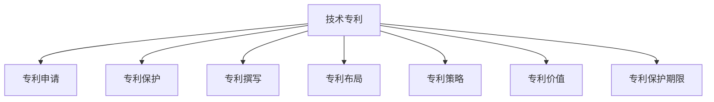

                 

# 技术专利：程序员的隐藏财富

> 关键词：技术专利, 程序员, 专利申请, 技术创新, 知识产权, 专利策略, 专利撰写, 专利价值, 专利保护, 专利布局

## 1. 背景介绍

### 1.1 问题由来
在快速发展的技术行业中，技术创新是驱动企业增长和竞争力的关键因素。然而，即使有卓越的技术实力，如果缺乏对知识产权的有效管理和利用，技术的价值也无法充分实现。技术专利，作为一种法律保护形式，不仅能保护技术创新成果，还能为企业带来长期的商业价值。

近年来，随着科技创新步伐的加快，技术专利的数量和质量显著提升。程序员作为技术创新的主力军，其隐形的技术专利已成为企业竞争力的重要组成部分。本文将深入探讨技术专利的原理、申请策略、实际案例和未来发展趋势，旨在帮助程序员更好地理解和利用专利作为技术财富的保护手段。

### 1.2 问题核心关键点
技术专利的核心在于通过法律手段保护技术创新，确保技术所有者在一定期限内享有使用、制造和销售的独家权利。这一权利保护不仅有助于维护企业的市场地位，还能带来潜在的商业利益，包括但不限于授权许可、技术贸易和起诉侵权等。

掌握技术专利的申请、维护和利用技巧，能够帮助程序员和企业实现技术价值的最大化。因此，了解技术专利的申请流程、撰写技巧、策略布局和实际应用，对于技术创新者和企业来说尤为重要。

## 2. 核心概念与联系

### 2.1 核心概念概述

为深入理解技术专利，本节将介绍几个密切相关的核心概念：

- **技术专利**：是指一项技术发明，经过审查和批准，被授予一定的专利权，以保护发明者的知识产权。

- **专利申请**：指将一项技术发明向国家或地区专利局提交的正式文件，包括专利说明书、权利要求书、发明摘要等，以获取专利权。

- **专利保护**：通过法律手段，确保专利所有者拥有在一定期限内使用、制造和销售其发明的独家权利，从而避免他人未经允许的侵权行为。

- **专利撰写**：专利申请文件的编写，包括技术背景、发明内容、实施例、权利要求等部分，确保申请文件的合规性和有效性。

- **专利布局**：指通过在多个国家或地区申请专利，构建全面的专利保护网络，保护技术创新成果不受地域限制。

- **专利策略**：指企业或技术所有者在专利申请和管理过程中采取的一系列战略措施，包括申请时机、申请方式、权利要求范围等，以最大化专利的价值和保护范围。

- **专利价值**：指专利作为无形资产的经济价值，包括授权许可、技术贸易和侵权诉讼等商业化途径带来的收益。

- **专利保护期限**：指专利权授予的保护期限，各国法律规定不同，通常为20年。

这些核心概念之间的逻辑关系可以通过以下Mermaid流程图来展示：



这个流程图展示了大语言模型的核心概念及其之间的关系：

1. 技术专利是保护技术创新的法律手段。
2. 专利申请是获取专利权的正式流程。
3. 专利保护是通过法律手段确保专利权利。
4. 专利撰写是申请文件编写的具体过程。
5. 专利布局是构建全面的专利保护网络。
6. 专利策略是专利申请和管理的战略规划。
7. 专利价值是专利带来的经济收益。
8. 专利保护期限是专利权利的有效期限。

这些概念共同构成了技术专利的基本框架，为企业和程序员提供了保护技术创新成果的法律工具。

## 3. 核心算法原理 & 具体操作步骤
### 3.1 算法原理概述

技术专利的申请过程，本质上是对技术创新的法律形式化描述和保护。其核心思想是通过清晰、具体的描述，将技术创新成果转化为法律认可的保护对象。

形式化地，假设一项技术创新为 $P$，其保护范围为 $R$。则技术专利申请的目标是找到最优的保护范围 $R^*$，使得：

$$
R^* = \mathop{\arg\min}_{R} \mathcal{L}(P, R)
$$

其中 $\mathcal{L}$ 为损失函数，用于衡量技术创新 $P$ 与保护范围 $R$ 之间的适应度。技术专利申请的目标是最小化损失函数 $\mathcal{L}$，使得保护范围 $R^*$ 既能全面覆盖技术创新 $P$，又能尽可能减少权利范围的过度宽泛，以避免无效申请和侵权诉讼。

### 3.2 算法步骤详解

技术专利的申请一般包括以下几个关键步骤：

**Step 1: 准备技术材料**
- 收集与技术创新相关的背景信息、研究论文、专利文献等。
- 编写技术方案、技术背景、技术效果等专利文档。

**Step 2: 选择申请类型**
- 决定是申请发明专利还是实用新型专利。
- 如果是发明专利，需确定是申请国内专利还是国际专利。

**Step 3: 准备申请文件**
- 撰写专利说明书、权利要求书、发明摘要等申请文件。
- 进行技术图示和详细描述。

**Step 4: 提交申请并缴纳费用**
- 通过官方或代理机构提交专利申请。
- 缴纳相应的申请费用，包括但不限于申请费、优先权请求费等。

**Step 5: 审查与授权**
- 专利局进行初步审查，确定申请文件是否符合要求。
- 进入公开期，接受公众和第三方专利审查员的审查。
- 如果通过审查，专利局授予专利权。

**Step 6: 维护与利用**
- 在专利保护期限内，进行专利维护和续期申请。
- 利用专利授权、许可、贸易、诉讼等方式，最大化专利价值。

### 3.3 算法优缺点

技术专利申请具有以下优点：
1. 提供法律保护。技术专利可以确保技术创新在一定期限内不被他人侵权，保护企业市场地位。
2. 带来商业利益。授权许可、技术贸易、侵权诉讼等都可以带来可观的经济收益。
3. 提升品牌价值。拥有专利技术的企业更容易赢得客户信任，增强品牌竞争力。
4. 促进技术创新。专利制度通过法律手段保护创新，激励更多技术投入和研发。

同时，技术专利申请也存在一些局限性：
1. 申请过程复杂。需要准备大量技术材料和申请文件，审查周期长。
2. 费用高昂。申请、维护和授权费用较高，尤其是国际专利申请。
3. 保护范围有限。专利保护期限有限，且保护范围受法律约束，可能存在漏洞。
4. 时间延迟。从申请到授权需要一定时间，难以迅速应对市场变化。
5. 法律风险。专利申请和维护过程中，存在各种法律风险和不确定性。

尽管存在这些局限性，但技术专利作为保护技术创新的重要手段，对于维护企业竞争力和推动技术发展仍具有不可替代的作用。

### 3.4 算法应用领域

技术专利的保护范围广泛，涵盖各种技术领域。以下是几个典型应用场景：

- **软件技术**：包括但不限于算法创新、编程语言、软件开发工具等。
- **硬件技术**：如芯片设计、电子设备、机械结构等。
- **生物医药**：涉及新药物、生物技术、医疗设备等。
- **通讯技术**：包括5G、物联网、网络安全等。
- **能源技术**：涉及新型能源材料、能源转换技术等。

除了上述领域，技术专利的应用场景还在不断拓展，涵盖更多前沿和交叉领域。

## 4. 数学模型和公式 & 详细讲解  
### 4.1 数学模型构建

本节将使用数学语言对技术专利的申请过程进行更加严格的刻画。

记技术创新为 $P$，其保护范围为 $R$。技术专利申请的目标是找到最优的保护范围 $R^*$，使得损失函数 $\mathcal{L}(P, R^*)$ 最小化。

设 $\mathcal{L}(P, R^*) = \frac{1}{N} \sum_{i=1}^N (y_i - f(x_i; P, R^*))^2$，其中 $x_i$ 为第 $i$ 个样本，$y_i$ 为真实标签，$f(x_i; P, R^*)$ 为模型预测结果。则技术专利申请的目标是最小化损失函数 $\mathcal{L}(P, R^*)$，即：

$$
R^* = \mathop{\arg\min}_{R} \mathcal{L}(P, R)
$$

在实践中，我们通常使用最小二乘法、最大似然估计等优化算法，近似求解上述最优化问题。

### 4.2 公式推导过程

以下我们以软件技术专利为例，推导损失函数及其梯度的计算公式。

假设技术创新 $P$ 描述了一种新的算法，其保护范围 $R$ 包括算法实现的各项功能特性。假设技术创新 $P$ 在 $N$ 个样本上的预测标签为 $y_i$，真实标签为 $y_i^*$。则损失函数为：

$$
\mathcal{L}(P, R) = \frac{1}{N} \sum_{i=1}^N (y_i - f(x_i; P, R))^2
$$

其中 $f(x_i; P, R)$ 为模型预测结果，可通过梯度下降等优化算法计算。

根据链式法则，损失函数对参数 $R$ 的梯度为：

$$
\frac{\partial \mathcal{L}(P, R)}{\partial R} = -\frac{2}{N}\sum_{i=1}^N (y_i - f(x_i; P, R)) f'(x_i; P, R)
$$

其中 $f'(x_i; P, R)$ 为模型预测结果的梯度，可通过反向传播算法高效计算。

在得到损失函数的梯度后，即可带入优化算法，完成模型的迭代优化。重复上述过程直至收敛，最终得到最优的保护范围 $R^*$。

## 5. 项目实践：代码实例和详细解释说明
### 5.1 开发环境搭建

在进行技术专利申请前，我们需要准备好开发环境。以下是使用Python进行专利申请开发的典型环境配置流程：

1. 安装Anaconda：从官网下载并安装Anaconda，用于创建独立的Python环境。

2. 创建并激活虚拟环境：
```bash
conda create -n patent-env python=3.8 
conda activate patent-env
```

3. 安装相关工具包：
```bash
pip install pandas numpy scikit-learn matplotlib tqdm jupyter notebook ipython
```

完成上述步骤后，即可在`patent-env`环境中开始专利申请开发。

### 5.2 源代码详细实现

下面我们以软件技术专利申请为例，给出使用Python编写的专利申请文件代码实现。

首先，准备技术创新的背景信息和实现细节：

```python
# 技术创新背景
background = "本技术创新涉及一种新的算法实现，能够高效解决数据处理问题，在时间复杂度和空间复杂度上均有显著提升。"

# 技术创新实现
implementation = """
def algorithm(data):
    # 算法实现的代码
    return result
"""
```

然后，编写专利说明书、权利要求书和发明摘要：

```python
# 专利说明书
# 技术创新描述
description = """
本发明涉及一种高效的数据处理算法，包括数据预处理、算法核心步骤和结果后处理三个主要模块。
数据预处理模块对原始数据进行清洗、去重和归一化处理，确保输入数据的准确性。
算法核心步骤采用高效的算法实现，能够显著降低时间复杂度，提高数据处理速度。
结果后处理模块对算法输出结果进行验证和校准，确保结果的可靠性和准确性。
"""

# 权利要求书
# 列出专利保护的具体范围
claims = """
1. 一种高效的数据处理算法，其特征在于...
2. 一种实现上述算法的方法，其特征在于...
3. 一种用于数据处理的设备，其特征在于...
"""

# 发明摘要
# 简要概述技术创新的核心内容
abstract = """
本发明提出了一种高效的数据处理算法，能够大幅提升数据处理效率。
算法包括数据预处理、核心算法实现和结果后处理三个主要步骤。
预处理模块对数据进行清洗、去重和归一化，确保输入数据的准确性。
核心算法实现采用高效的算法步骤，降低时间复杂度，提高处理速度。
后处理模块对算法输出结果进行验证和校准，确保结果可靠。
"""

# 生成专利申请文件
# 将背景信息、实现细节、说明书、权利要求和摘要合并生成专利申请文件
application = {
    "title": "高效数据处理算法",
    "background": background,
    "implementation": implementation,
    "description": description,
    "claims": claims,
    "abstract": abstract
}
```

最后，启动专利申请流程并输出结果：

```python
# 打印专利申请文件
for key, value in application.items():
    print(f"{key}:")
    print(value)
    print("\n")
```

以上就是使用Python编写专利申请文件的完整代码实现。可以看到，通过简洁的代码，可以将技术创新的核心内容转化为法律认可的保护对象。

### 5.3 代码解读与分析

让我们再详细解读一下关键代码的实现细节：

**背景信息**：
- `background`变量：包含技术创新的背景信息和实现细节，用于描述技术创新的创新点和核心技术。

**专利说明书**：
- `description`变量：包含技术创新的详细描述，包括技术创新的核心步骤和实现方法，确保申请文件能够清晰传达技术创新内容。

**权利要求书**：
- `claims`变量：包含具体的专利保护范围，需要根据技术创新内容逐一列出，确保保护范围的全面性和准确性。

**发明摘要**：
- `abstract`变量：包含技术创新的简要概述，用于快速传递技术创新的核心信息，便于专利审查人员和潜在授权用户理解。

**生成专利申请文件**：
- `application`字典：将背景信息、实现细节、说明书、权利要求和摘要合并生成专利申请文件，确保各项信息的完整性和准确性。

通过以上代码实现，可以看出专利申请文件的编写过程是相对规范和系统的。开发者可以根据技术创新的具体情况，对专利申请文件进行灵活调整和优化。

当然，在工业级的系统实现中，还需要考虑更多因素，如专利撰写规范、技术图示绘制、申请文件格式等。但核心的专利申请流程基本与此类似。

## 6. 实际应用场景
### 6.1 技术创新保护

技术专利在技术创新保护中的应用广泛，尤其在高科技领域，技术创新往往是企业竞争力的核心。通过技术专利，企业能够有效地保护其技术成果，避免被竞争对手侵权或盗用。

例如，某科技公司开发了一种创新的软件架构，能够大幅提升数据处理效率。该公司通过撰写和提交专利申请文件，成功获得专利授权。在专利授权的保护期内，该公司能够防止竞争对手对该技术进行商业化应用，从而确保市场地位和技术领先。

### 6.2 技术授权与贸易

除了保护技术成果，技术专利还可以通过授权和贸易的方式带来商业利益。企业可以将其专利技术授权给其他企业使用，收取授权费或版税，实现技术价值的变现。

例如，某手机厂商开发了一项重要的屏幕技术，通过专利授权许可给多家手机制造商使用，每年收取巨额授权费，显著增加了企业的收入。

### 6.3 专利诉讼与维权

在专利保护期限内，企业可以通过专利诉讼和维权的方式，防止他人未经授权使用其专利技术。专利诉讼不仅可以维护企业的合法权益，还可以打击侵权行为，保护技术创新成果不受侵害。

例如，某制药公司发现竞争对手非法仿制其专利药物，通过专利诉讼获得了巨额赔偿，有效遏制了侵权行为，保护了企业的技术创新成果和商业利益。

### 6.4 未来应用展望

随着技术创新的不断加速，技术专利将扮演越来越重要的角色。未来，技术专利的应用将更加广泛，涵盖更多领域和场景。以下是几个可能的发展趋势：

1. **全球专利布局**：企业将更加重视全球专利布局，通过在多个国家和地区申请专利，构建全面的专利保护网络。

2. **技术标准制定**：技术专利不仅可以保护技术创新成果，还可以参与技术标准的制定，确保企业在技术标准中的话语权。

3. **开放许可与共享**：企业可以通过开放专利许可和共享，促进技术创新和产业发展，同时提升自身的市场竞争力。

4. **跨领域专利整合**：企业可以将不同领域的技术专利进行整合，形成更为全面的专利组合，增强专利保护的整体性。

5. **专利价值评估**：技术专利的价值评估将成为企业的重要决策依据，通过精确评估专利价值，指导企业的技术投资和创新战略。

这些发展趋势凸显了技术专利在推动技术创新和产业发展中的重要作用，相信随着专利制度的不断完善和普及，技术专利将为更多技术创新者带来实实在在的利益。

## 7. 工具和资源推荐
### 7.1 学习资源推荐

为了帮助开发者系统掌握技术专利的理论基础和实践技巧，这里推荐一些优质的学习资源：

1. **《专利法》与《专利实施细则》**：中国国家知识产权局发布的专利法律和实施细则，是了解专利制度的基础文件。

2. **WIPO专利数据库**：世界知识产权组织提供的全球专利检索和分析工具，包含大量专利文献和专利信息。

3. **PCT专利申请指南**：介绍PCT（国际专利合作条约）申请流程和相关要求的官方指南，适合进行国际专利申请的用户。

4. **专利撰写教程**：如《专利撰写实战教程》，详细介绍专利申请文件的编写规范和技巧，适合专利申请初学者。

5. **专利策略培训课程**：如《专利申请策略与布局》，讲解专利申请和管理的战略规划，适合企业专利管理团队。

通过对这些资源的学习实践，相信你一定能够快速掌握技术专利的精髓，并用于解决实际的专利申请和管理问题。

### 7.2 开发工具推荐

高效的开发离不开优秀的工具支持。以下是几款用于专利申请开发的常用工具：

1. **Anaconda**：用于创建独立的Python环境，支持虚拟环境管理和多语言代码编写。

2. **Pandoc**：用于将各种格式的文件转换为标准化的Markdown格式，方便编写专利申请文件。

3. **Patent Machine**：企业级专利管理平台，提供专利申请、维护、分析等一站式服务。

4. **GITHUB**：用于代码管理和版本控制，方便开发者协作编写和审查专利申请文件。

5. **Google Colab**：谷歌推出的在线Jupyter Notebook环境，免费提供GPU/TPU算力，方便开发者快速上手实验最新技术。

合理利用这些工具，可以显著提升专利申请开发的效率，加快创新迭代的步伐。

### 7.3 相关论文推荐

技术专利的研究源于学界的持续研究。以下是几篇奠基性的相关论文，推荐阅读：

1. **"Patent Law and Patent Policy"**：详细介绍了专利法律体系和专利政策制定，是理解专利制度的重要参考文献。

2. **"The Patent System: Reflections on the Meaning and Function of Patents in a Knowledge-Based Economy"**：探讨了专利系统在知识经济中的意义和功能，为专利策略提供了理论依据。

3. **"The Economics of Patent Protection"**：分析了专利保护对技术创新和经济效益的影响，提供了专利价值评估的经济学视角。

4. **"Patent Strategies and Management"**：介绍了专利申请和管理的战略规划，适合企业专利管理团队参考。

这些论文代表了大语言模型专利申请技术的发展脉络。通过学习这些前沿成果，可以帮助研究者把握学科前进方向，激发更多的创新灵感。

## 8. 总结：未来发展趋势与挑战
### 8.1 总结

本文对技术专利的原理、申请策略、实际案例和未来发展趋势进行了全面系统的介绍。首先阐述了技术专利的保护范围和价值，明确了专利申请在技术创新中的重要性。其次，从原理到实践，详细讲解了技术专利的撰写、申请和维护过程，给出了专利申请文件编写的完整代码实现。同时，本文还广泛探讨了技术专利在技术创新保护、技术授权与贸易、专利诉讼与维权等多个行业领域的应用前景，展示了专利申请技术的广阔前景。

通过本文的系统梳理，可以看到，技术专利是技术创新者保护其创新成果的重要手段，能够为企业带来可观的商业价值和市场竞争力。未来，随着专利制度的不断完善和普及，技术专利将发挥更大的作用，推动技术创新和产业升级。

### 8.2 未来发展趋势

展望未来，技术专利的发展趋势将呈现以下几个方向：

1. **全球专利布局**：企业将更加重视全球专利布局，通过在多个国家和地区申请专利，构建全面的专利保护网络。

2. **技术标准制定**：技术专利不仅可以保护技术创新成果，还可以参与技术标准的制定，确保企业在技术标准中的话语权。

3. **开放许可与共享**：企业可以通过开放专利许可和共享，促进技术创新和产业发展，同时提升自身的市场竞争力。

4. **跨领域专利整合**：企业可以将不同领域的技术专利进行整合，形成更为全面的专利组合，增强专利保护的整体性。

5. **专利价值评估**：技术专利的价值评估将成为企业的重要决策依据，通过精确评估专利价值，指导企业的技术投资和创新战略。

这些发展趋势凸显了技术专利在推动技术创新和产业发展中的重要作用，相信随着专利制度的不断完善和普及，技术专利将为更多技术创新者带来实实在在的利益。

### 8.3 面临的挑战

尽管技术专利在保护技术创新方面具有不可替代的作用，但在实际操作中仍面临诸多挑战：

1. **专利撰写规范**：专利申请文件的撰写需要严格按照法律规范进行，一旦出现错误，可能导致专利无效。

2. **申请成本高昂**：申请、维护和授权费用较高，尤其是国际专利申请，增加了企业的成本负担。

3. **保护范围有限**：专利保护期限有限，且保护范围受法律约束，可能存在漏洞。

4. **法律风险**：专利申请和维护过程中，存在各种法律风险和不确定性，需要仔细处理。

5. **技术竞争激烈**：技术创新者之间的竞争日益激烈，如何有效利用专利保护技术成果，成为关键问题。

6. **专利数量激增**：随着技术创新的不断加速，专利数量激增，如何有效管理和利用专利资产，成为企业的重要挑战。

这些挑战需要企业和技术创新者不断探索和优化，才能充分利用技术专利的保护手段，推动技术创新和产业发展。

### 8.4 研究展望

面对技术专利面临的挑战，未来的研究需要在以下几个方面寻求新的突破：

1. **规范专利撰写**：制定更加详细的专利撰写规范，确保申请文件的合规性和有效性。

2. **降低申请成本**：探索低成本的专利申请和维护方式，如PCT申请等，减轻企业负担。

3. **扩大保护范围**：研究更加灵活的专利保护策略，如专利组合、专利池等，增强专利保护的整体性。

4. **应对法律风险**：加强专利申请和维护过程中的法律风险管理，确保专利申请的有效性和合法性。

5. **提升专利价值**：研究专利价值评估的新方法，帮助企业更好地利用专利资产，指导技术投资和创新战略。

6. **专利管理和运营**：建立完善的专利管理和运营体系，提高专利资产的使用效率和商业价值。

这些研究方向的探索，必将引领技术专利申请技术的不断发展，为技术创新者和企业提供更加全面、高效的保护手段，推动技术创新和产业发展。

## 9. 附录：常见问题与解答

**Q1：如何撰写技术专利申请文件？**

A: 技术专利申请文件的撰写需要遵循国家知识产权局的规定和要求。以下是基本步骤：
1. 收集背景信息和实现细节。
2. 编写技术创新描述、权利要求和发明摘要。
3. 整理申请文件，确保格式规范、内容清晰。
4. 通过官方或代理机构提交专利申请。

**Q2：申请专利需要哪些材料？**

A: 申请专利需要提交以下材料：
1. 专利申请书：包含发明名称、发明人、申请人等信息。
2. 专利说明书：详细描述技术创新内容。
3. 权利要求书：列出专利保护的具体范围。
4. 发明摘要：简要概述技术创新的核心内容。

**Q3：申请专利的流程是怎样的？**

A: 申请专利的流程如下：
1. 收集背景信息和实现细节。
2. 编写专利说明书、权利要求书和发明摘要。
3. 整理申请文件，确保格式规范、内容清晰。
4. 通过官方或代理机构提交专利申请。
5. 缴纳申请费用。
6. 专利局进行初步审查和公开期。
7. 进入正式审查阶段。
8. 如果通过审查，获得专利授权。

**Q4：如何利用技术专利保护技术创新？**

A: 利用技术专利保护技术创新需要：
1. 收集背景信息和实现细节。
2. 编写专利说明书、权利要求书和发明摘要。
3. 整理申请文件，确保格式规范、内容清晰。
4. 通过官方或代理机构提交专利申请。
5. 缴纳申请费用。
6. 专利局进行初步审查和公开期。
7. 进入正式审查阶段。
8. 如果通过审查，获得专利授权。

通过以上步骤，可以有效地保护技术创新成果，防止他人未经授权使用。

**Q5：如何评估技术专利的价值？**

A: 评估技术专利的价值需要：
1. 收集背景信息和实现细节。
2. 编写专利说明书、权利要求书和发明摘要。
3. 整理申请文件，确保格式规范、内容清晰。
4. 通过官方或代理机构提交专利申请。
5. 缴纳申请费用。
6. 专利局进行初步审查和公开期。
7. 进入正式审查阶段。
8. 如果通过审查，获得专利授权。

评估技术专利的价值可以通过授权许可、技术贸易和侵权诉讼等方式实现。

---

作者：禅与计算机程序设计艺术 / Zen and the Art of Computer Programming

