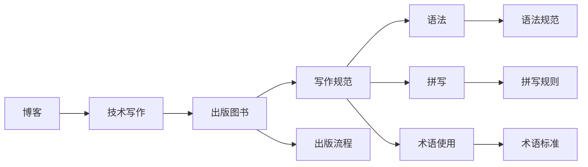

                 

# 技术写作：从博客到出版图书

> 关键词：技术写作,出版图书,博客,写作规范,出版流程,写作技巧,案例分析

## 1. 背景介绍

在信息技术飞速发展的今天，技术写作已成为连接科技与公众的重要桥梁。无论是软件工程师的文档，还是科学家的论文，高质量的技术写作不仅能提升读者对技术内容的理解，还能增强科技知识的传播效果。从博客到出版图书，这一过程不仅要求作者具备深厚的技术背景和写作能力，还需掌握出版的基本流程和规范，以确保内容的准确性与可读性。本文将详细探讨技术写作的基本原则与实践技巧，并分享从博客到出版图书的完整流程，为有志于出版技术书籍的作者提供实用的指导。

## 2. 核心概念与联系

### 2.1 核心概念概述

要理解技术写作，首先需了解以下几个核心概念：

- **技术写作（Technical Writing）**：指的是将复杂的技术信息转换为易于理解和掌握的文档形式，包括技术博客、技术手册、技术文档、技术论文等。
- **出版图书（Book Publishing）**：将技术写作作品转化为纸质或电子形式，经过编辑、校对、印刷等多道程序，最终面世的过程。
- **博客（Blog）**：一种个人或组织的在线日志形式，通常包含简短的技术文章、观点、新闻更新等，是最初的技术写作载体之一。
- **写作规范（Writing Standards）**：技术写作需遵循的行业标准和最佳实践，如语法、拼写、术语使用等，确保信息传达的准确性和一致性。
- **出版流程（Publishing Process）**：图书出版的各个阶段，包括策划、投稿、审稿、编辑、校对、排版、印刷等环节。

这些概念之间的联系通过以下Mermaid流程图来展示：



这个流程图展示了技术写作与出版图书之间的逻辑关系，以及写作规范和出版流程在其中的重要性。

## 3. 核心算法原理 & 具体操作步骤

### 3.1 算法原理概述

技术写作的原理主要包括两个方面：首先是将复杂的科技内容转化为易于理解的形式，其次是确保信息的准确性和一致性。其核心算法原理可以概括为：

- **内容转化（Content Transformation）**：将原始的技术信息通过逻辑结构化、语言简洁化等手段转化为易读的文本。
- **信息核对（Information Verification）**：在写作过程中，对技术内容进行核查，确保信息的准确性。

### 3.2 算法步骤详解

技术写作的具体步骤包括以下几个环节：

**Step 1: 确定写作目标**
- 明确写作内容的主题、目的和受众。例如，是技术博客还是学术论文？目标受众是技术爱好者、工程师还是研究人员？

**Step 2: 搜集和整理资料**
- 收集相关的技术文献、数据和案例。整理资料，筛选出最有价值的信息。

**Step 3: 制定写作大纲**
- 根据资料和目标受众，制定文章结构，包括引言、正文、结论等部分。

**Step 4: 撰写初稿**
- 按照大纲撰写初稿，注意语言表达的清晰性和准确性。

**Step 5: 修改和润色**
- 对初稿进行多次修改，检查语法、拼写错误，优化表达方式。

**Step 6: 校对与审核**
- 校对文章，确保内容的准确性和一致性。可以请同行或专家进行审核，确保信息的可靠性。

**Step 7: 发布与推广**
- 选择合适的出版平台或博客，发布技术文章。推广文章，吸引读者关注和反馈。

**Step 8: 维护与更新**
- 根据读者的反馈和最新的技术进展，更新和维护文章内容。

### 3.3 算法优缺点

技术写作的优势在于其具有高度的专业性和实用性，能够帮助读者快速理解复杂的技术概念。但同时也存在一些缺点：

- **写作门槛高**：需要作者具备丰富的技术背景和写作能力，普通读者难以掌握。
- **出版周期长**：从初稿到出版图书，过程复杂，周期较长。
- **成本高**：出版图书需要较高的印刷和发行成本，难以大规模推广。

### 3.4 算法应用领域

技术写作广泛应用于软件开发、硬件工程、网络安全、数据分析等技术领域，以及科学论文、技术报告、企业手册、用户手册等出版物中。无论是学术界还是工业界，高质量的技术写作都是不可或缺的一部分。

## 4. 数学模型和公式 & 详细讲解 & 举例说明

### 4.1 数学模型构建

技术写作的数学模型主要涉及内容的逻辑结构和表达方式。以下是一个简单的数学模型示例：

$$
\text{内容转化} = f(\text{原始信息}, \text{受众}, \text{写作目标})
$$

其中，$f$ 表示将原始信息转换为目标受众易于理解的形式的函数。

### 4.2 公式推导过程

假设我们要将一个算法 $\text{algorithm}$ 的伪代码 $\text{pseudocode}$ 转换为技术文档，可以按照以下步骤推导：

1. 确定算法的作用和步骤。
2. 将伪代码中的关键字（如 $\text{for}$、$\text{if}$ 等）转化为文本描述。
3. 解释每一步的含义和作用，确保信息的完整性。

### 4.3 案例分析与讲解

以算法 $\text{SortArray}$ 为例，其伪代码如下：

```
function SortArray(array):
    for i = 1 to length(array) - 1:
        for j = i+1 to length(array):
            if array[i] > array[j]:
                swap(array[i], array[j])
```

可以将伪代码转化为技术文档：

```
算法作用：对数组进行排序
步骤 1: 从数组的第一个元素开始，依次与后面的元素进行比较。
步骤 2: 如果发现当前元素大于后面的元素，则交换它们的位置。
步骤 3: 重复上述过程，直到整个数组排序完成。
```

## 5. 项目实践：代码实例和详细解释说明

### 5.1 开发环境搭建

要实现技术写作，首先需要搭建一个适合的技术写作环境。以下是使用Microsoft Word的环境配置流程：

1. 安装Microsoft Word：从Microsoft官网下载并安装Microsoft Word。
2. 安装Microsoft Teams：从Microsoft官网下载并安装Microsoft Teams，以便在线协作和反馈。
3. 安装GitHub Desktop：从GitHub官网下载并安装GitHub Desktop，方便代码管理和版本控制。

完成上述步骤后，即可在Microsoft Word中开始撰写技术文章。

### 5.2 源代码详细实现

以下是一个简单的技术博客示例，以介绍Python的列表推导式为例：

```
# 列表推导式示例
# 生成一个包含1到10的平方数的列表

squares = [x**2 for x in range(1, 11)]

print(squares)
```

### 5.3 代码解读与分析

这段代码实现了列表推导式的基本功能。首先，使用 `range(1, 11)` 生成1到10的整数序列。然后，使用列表推导式 `[x**2 for x in range(1, 11)]` 计算每个整数的平方，最终生成包含这些平方数的列表。最后，使用 `print` 函数输出列表内容。

### 5.4 运行结果展示

执行上述代码，输出结果为：

```
[1, 4, 9, 16, 25, 36, 49, 64, 81, 100]
```

这表明，列表推导式可以简洁高效地生成指定范围内的平方数列表。

## 6. 实际应用场景

### 6.1 企业内部文档

技术写作在企业内部文档管理中有着广泛应用。企业内部文档包括员工手册、技术规范、项目管理文档等，这些文档对于提高员工工作效率、确保项目顺利进行至关重要。通过高质量的技术写作，企业可以更好地传递技术信息，增强团队协作。

### 6.2 开源项目文档

开源项目的成功依赖于高质量的文档，包括项目描述、API文档、使用指南等。技术写作在开源项目中同样重要，能够帮助开发者理解项目的整体结构和使用方法，减少项目使用的复杂度。

### 6.3 学术研究

在学术研究中，高质量的技术写作也是必要的。学术论文、会议论文等都需要严格遵循写作规范，确保信息的准确性和一致性。技术写作能够帮助研究人员更好地传达研究成果，提高论文的影响力和可信度。

### 6.4 未来应用展望

随着技术的不断进步，技术写作也将迎来更多机遇和挑战。未来的技术写作将更加注重多模态信息的融合，如文本、视频、音频等，提升内容的表现力和互动性。同时，人工智能和大数据技术的应用也将促进技术写作的自动化和智能化，提高写作效率和质量。

## 7. 工具和资源推荐

### 7.1 学习资源推荐

为了帮助作者提升技术写作能力，以下是一些优质的学习资源：

1. **《技术写作基础》（Technical Writing Essentials）**：一本介绍技术写作基础理论和方法的书籍，适合初学者学习。
2. **《科技写作之道》（The Science of Technical Writing）**：一本深入探讨科技写作技巧和实践的书籍，包含大量案例分析。
3. **Microsoft Teams**：在线协作工具，方便与同行和编辑进行沟通和反馈。
4. **GitHub**：代码管理和版本控制系统，便于代码存储和版本控制。
5. **Google Scholar**：学术搜索工具，方便查阅最新的学术文献。

### 7.2 开发工具推荐

高效的工具能够提升技术写作的效率和质量，以下是几款推荐的工具：

1. **Microsoft Word**：功能丰富的文本编辑器，适合撰写各种技术文档。
2. **GitHub Desktop**：代码管理和版本控制工具，方便协作和版本控制。
3. **Overleaf**：在线文档编辑器，支持多种格式和语言。
4. **Markdown**：轻量级标记语言，适合编写技术博客和文档。
5. **Visual Studio Code**：轻量级代码编辑器，支持多种编程语言。

### 7.3 相关论文推荐

技术写作的最新研究和技术进步值得关注，以下是一些推荐论文：

1. **《技术写作的进化：从纸质到数字》（The Evolution of Technical Writing: From Print to Digital）**：探讨技术写作在数字化时代的发展趋势和变化。
2. **《多模态技术写作：结合图像和视频的挑战与机遇》（Multimodal Technical Writing: Challenges and Opportunities）**：研究多模态技术写作的实践与效果。
3. **《技术写作的自动化与智能化》（Automation and AI in Technical Writing）**：探讨技术写作自动化和智能化的最新进展。
4. **《高质量技术写作的评估指标》（Metrics for Quality in Technical Writing）**：研究如何评估和提升技术写作的质量。

## 8. 总结：未来发展趋势与挑战

### 8.1 研究成果总结

本文详细探讨了技术写作从博客到出版图书的全过程，并提供了实用的操作步骤和建议。技术写作的实践证明，高质量的写作对于科技传播和知识共享至关重要。

### 8.2 未来发展趋势

未来的技术写作将更加注重多模态信息的融合、自动化的应用和智能化技术的融合。技术写作的实践也将更多地与人工智能、大数据等前沿技术结合，提升写作效率和质量。

### 8.3 面临的挑战

尽管技术写作在数字化时代具备广泛应用前景，但仍然面临一些挑战：

- **标准化问题**：不同领域和行业的技术写作标准各异，如何统一和规范化是一个重要问题。
- **技术复杂性**：技术内容通常较为复杂，如何将其转换为易读的形式是一个难题。
- **版权问题**：技术写作涉及大量技术信息和代码，版权保护是一个重要挑战。

### 8.4 研究展望

未来的技术写作研究将更多地关注如何利用AI和大数据技术提升写作效率和质量。同时，也需要建立更加统一和标准化的技术写作体系，确保内容的准确性和一致性。

## 9. 附录：常见问题与解答

**Q1: 如何提高技术写作的质量？**

A: 提高技术写作质量的关键在于理解和掌握写作规范，多阅读和学习高质量的文档。同时，注重写作结构、语言表达和逻辑性，不断修改和润色。

**Q2: 技术写作中的常用术语如何处理？**

A: 在技术写作中，应确保术语的一致性和准确性。可以参考权威的术语词典和文档，并在文中第一次使用时进行解释。

**Q3: 如何平衡技术深度和可读性？**

A: 在写作过程中，应根据受众的特点选择合适的深度和难度。对于技术爱好者和专业人士，可以深入介绍技术细节；对于普通读者，应尽量简化表达，提高可读性。

**Q4: 技术写作如何利用人工智能？**

A: 人工智能技术可以用于自动化文档生成、文本校对和摘要生成等，提升写作效率和质量。同时，也可以利用AI进行需求分析和内容推荐，帮助作者找到合适的写作素材和参考资料。

---

作者：禅与计算机程序设计艺术 / Zen and the Art of Computer Programming

