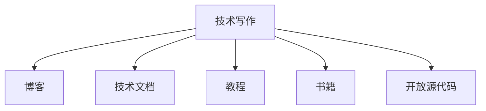

                 

# 技术写作：建立额外收入来源

## 1. 背景介绍

### 1.1 问题由来
随着技术日新月异，越来越多的专业人士发现，他们可以通过技术写作来分享知识和经验，建立额外的收入来源。无论是软件开发工程师、数据科学家还是网络安全专家，任何具备专业技能的人都可以通过写作来展示自己的专业能力，并得到相应的回报。技术写作不仅仅是一种交流方式，更是一种获取额外收入的有效途径。

### 1.2 问题核心关键点
技术写作的核心在于将复杂的知识以清晰、易懂的语言表达出来，让非专业人士也能理解。技术写作通常包括博客、技术文档、教程、书籍等多种形式。技术写作的难点在于需要准确、严谨地传达技术细节，同时保证内容的可读性和吸引性。

### 1.3 问题研究意义
技术写作不仅有助于知识的传播和分享，还能提升作者的知名度和影响力，为作者带来商业机会，如产品推广、咨询服务等。此外，技术写作还能帮助作者梳理思路，深入理解技术原理，提升自己的技术水平。因此，掌握技术写作技能对专业技术人员来说具有重要意义。

## 2. 核心概念与联系

### 2.1 核心概念概述

为更好地理解技术写作，本节将介绍几个密切相关的核心概念：

- 技术写作（Technical Writing）：一种将复杂技术问题以易懂的语言和格式表达出来的写作形式，旨在帮助非专业人士理解技术内容。
- 博客（Blog）：一种在线出版形式，通过定期发布文章来分享知识和经验。
- 技术文档（Technical Documentation）：详细描述技术产品或系统的文档，通常包括用户手册、安装指南、API文档等。
- 教程（Tutorial）：指导用户如何使用特定工具或技术的步骤指南。
- 书籍（Book）：系统、深入地介绍某个领域知识或技术的书面作品。
- 开放源代码（Open Source）：指源代码开放供公众使用的软件开发模式，通常伴随着详细的技术文档和示例代码。

这些核心概念之间的逻辑关系可以通过以下Mermaid流程图来展示：



这个流程图展示了她文章的核心概念及其之间的关系：

1. 技术写作是基础，通过写作产生多种形式的输出。
2. 博客是最常见的形式，可以快速发布和更新内容。
3. 技术文档和教程是更正式、详细的写作形式，适合深度解析技术和产品。
4. 书籍是最全面、系统的形式，适合深入介绍复杂知识。
5. 开放源代码是将技术文档和示例代码结合起来，提供给公众自由使用的模式。

## 3. 核心算法原理 & 具体操作步骤
### 3.1 算法原理概述

技术写作的算法原理本质上是一种信息传递和知识表达的过程。其核心思想是通过清晰、准确的语言和结构化的内容，将复杂的技术知识传递给读者。

形式化地，假设要传递的知识为 $K$，读者的理解能力为 $C$，技术写作的目的是找到最优的传递方式 $W$，使得 $K$ 被 $C$ 准确理解：

$$
W = \mathop{\arg\min}_{W} \| K - W \cdot C \|
$$

其中 $\cdot$ 表示传递效果，$\| \cdot \|$ 表示传递误差。

### 3.2 算法步骤详解

技术写作的算法步骤包括：

**Step 1: 确定写作目标**
- 明确写作的目的，是为了教学、推广产品、解释原理还是记录研究进展。
- 确定目标受众，包括技术水平、知识背景、兴趣偏好等。

**Step 2: 收集和整理资料**
- 收集与主题相关的资料，如官方文档、学术论文、用户反馈等。
- 对资料进行筛选和整理，剔除冗余和不相关内容。

**Step 3: 设计内容结构**
- 根据写作目标和受众需求，设计文章的结构和布局。
- 确定文章的引入、主体和结尾部分，保证内容的连贯性和逻辑性。

**Step 4: 撰写和修订**
- 根据设计的内容结构，开始撰写初稿。
- 逐步修订和完善初稿，包括修改语句、增加示例、调整布局等。

**Step 5: 发布和反馈**
- 选择合适的发布平台，如博客、GitHub、技术论坛等。
- 在发布后收集读者的反馈，根据反馈进行进一步修订。

**Step 6: 维护和更新**
- 定期维护和更新文章内容，确保信息的时效性和准确性。
- 在技术或产品更新后，及时更新相关文章。

### 3.3 算法优缺点

技术写作的算法具有以下优点：
1. 系统传播知识。通过结构化的内容，将复杂的知识传递给广泛受众。
2. 提高作者知名度。技术写作是展示专业知识的好方式，可以吸引更多关注和机会。
3. 推动技术普及。好的技术写作可以简化技术复杂性，促进技术的普及应用。
4. 促进自我提升。写作过程中需要对知识进行梳理和重构，有助于提升作者的技术水平。

同时，该算法也存在一定的局限性：
1. 技术难度高。要求作者具有较强的技术背景和写作能力。
2. 投入时间多。高质量的技术写作需要大量的前期研究和撰写时间。
3. 内容易过时。技术更新快，文章内容需要定期更新以保持时效性。
4. 受众差异大。技术写作需要根据受众的不同，调整内容难度和表述方式，对作者要求高。

尽管存在这些局限性，但就目前而言，技术写作仍然是最为主流的知识传播方式之一，能够有效地将专业知识转化为可操作的资源，提升个人和团队的影响力。

### 3.4 算法应用领域

技术写作的应用领域非常广泛，涵盖了技术、产品、教育、咨询等多个领域：

- 软件开发：通过技术博客、API文档、教程等形式，分享开发经验和技术细节。
- 数据科学：撰写数据分析报告、机器学习案例研究、数据可视化教程等，推广数据分析技能。
- 网络安全：发布安全漏洞报告、防护指南、攻防案例分析等，提升安全意识。
- 教育培训：编写技术教材、编程示例、学习指南等，帮助学生和开发者学习新技术。
- 产品推广：制作产品文档、用户手册、演示视频等，提升产品市场竞争力。
- 咨询服务：撰写技术分析报告、商业案例研究、技术咨询文档等，提供专业意见。

## 4. 数学模型和公式 & 详细讲解 & 举例说明（备注：数学公式请使用latex格式，latex嵌入文中独立段落使用 $$，段落内使用 $)
### 4.1 数学模型构建

为了更好地描述技术写作的效果，这里引入信息熵的概念。假设一篇技术文章的信息熵 $H$ 表示读者理解文章所需的信息量，可以定义为：

$$
H = -\sum_{i} P_i \log P_i
$$

其中 $P_i$ 表示读者理解不同知识点的概率。信息熵越小，表示读者理解难度越低。

### 4.2 公式推导过程

技术写作的目标是最小化信息熵，即读者理解文章的难度。因此，技术写作的优化目标可以表示为：

$$
\mathop{\min}_{W} H = -\sum_{i} P_i \log P_i
$$

### 4.3 案例分析与讲解

假设有一篇关于TensorFlow的数据科学教程，其包含的概念包括数据预处理、模型构建、训练和评估等。通过分析读者的反馈，我们发现读者在模型构建部分理解较为困难，容易混淆层之间的连接方式。此时，作者可以：

- 增加模型构建部分的篇幅，详细解释每个步骤的逻辑。
- 添加示例代码和图表，帮助读者直观理解。
- 设计交互式教程，让读者通过实践来巩固理解。

通过这些措施，可以有效降低文章的信息熵，提升读者的理解效果。

## 5. 项目实践：代码实例和详细解释说明
### 5.1 开发环境搭建

要进行技术写作，首先需要搭建一个合适的开发环境。以下是使用Python进行技术写作的基本环境配置：

1. 安装Python：从官网下载并安装Python，确保版本支持后续安装所需的库。

2. 创建虚拟环境：
```bash
python -m venv venv
source venv/bin/activate
```

3. 安装必要的库：
```bash
pip install matplotlib numpy pandas jupyter notebook
```

4. 配置Jupyter Notebook：
```bash
jupyter notebook --NotebookApp.password=''
```

完成上述步骤后，即可在虚拟环境中开始技术写作。

### 5.2 源代码详细实现

这里以撰写一篇技术博客为例，展示使用Python进行技术写作的完整流程。

首先，创建一个目录结构：

```bash
mkdir blog
cd blog
```

接着，创建一个Markdown文件作为博客主体：

```bash
touch blog.md
```

使用文本编辑器打开博客文件，开始撰写博客内容：

```markdown
# TensorFlow入门教程

TensorFlow是Google开发的一个开源机器学习框架，广泛用于深度学习和人工智能领域。本文将详细介绍TensorFlow的基本概念、安装步骤以及一个简单的数据分类案例。

## 1. TensorFlow简介

TensorFlow是一个端到端的机器学习框架，支持构建各种类型的机器学习模型。它提供了高效的计算图和分布式训练功能，适用于大型深度学习任务。

## 2. 安装TensorFlow

TensorFlow支持多种操作系统和编程语言，包括Python、Java、C++等。这里以Python为例，介绍安装步骤：

```bash
pip install tensorflow
```

## 3. 数据分类案例

本节将介绍如何使用TensorFlow实现一个简单的数据分类案例。数据集可以使用MNIST手写数字数据集。

```python
import tensorflow as tf

mnist = tf.keras.datasets.mnist
(x_train, y_train), (x_test, y_test) = mnist.load_data()
x_train, x_test = x_train / 255.0, x_test / 255.0

model = tf.keras.models.Sequential([
  tf.keras.layers.Flatten(input_shape=(28, 28)),
  tf.keras.layers.Dense(128, activation='relu'),
  tf.keras.layers.Dropout(0.2),
  tf.keras.layers.Dense(10, activation='softmax')
])

model.compile(optimizer='adam',
              loss='sparse_categorical_crossentropy',
              metrics=['accuracy'])

model.fit(x_train, y_train, epochs=5)
```

## 4. 运行结果展示

在训练完成后，可以评估模型性能：

```python
model.evaluate(x_test, y_test)
```

以上就是使用Python进行技术写作的完整流程。通过简单的代码和清晰的讲解，读者可以轻松理解TensorFlow的基本使用方法。

### 5.3 代码解读与分析

以下是博客代码的详细解读：

**目录结构**：
- `blog`：存放博客文件和其他相关资源。
- `main.py`：博客主文件，用于管理博客内容和发布。
- `notebooks`：存放Jupyter Notebook文件，用于展示代码运行结果。

**博客内容**：
- `blog.md`：博客主体文件，使用Markdown格式编写。
- `blog.html`：生成的HTML文件，支持Web预览和分享。

**代码示例**：
- `main.py`：博客主文件，负责管理博客内容和发布。
- `notebooks`：存放Jupyter Notebook文件，展示代码运行结果。

通过上述代码，可以看出，技术写作不仅仅是文字描述，还可以结合代码示例和运行结果，使内容更加生动和易于理解。

## 6. 实际应用场景
### 6.1 在线课程

技术写作在在线教育中扮演着重要角色。许多在线教育平台，如Coursera、Udemy等，都依靠专业技术人员编写高质量的课程内容，吸引大量学生学习。

通过撰写课程讲义、视频脚本、案例分析等内容，技术人员可以将专业知识转化为易于理解的教学材料，帮助学生掌握新技术。同时，技术写作还能提升课程的互动性和趣味性，提高学生的学习兴趣和效果。

### 6.2 企业培训

企业内部培训也需要大量的技术写作资源。技术博客、技术手册、培训视频等形式，可以帮助员工快速掌握新技能，提升工作效率。

通过编写企业内部培训材料，技术人员可以分享最新技术动态，帮助企业保持技术领先优势。同时，技术写作还能帮助企业建立知识库，方便员工查阅和参考。

### 6.3 开源社区

开源社区是技术交流的重要平台，技术写作在其中起到了至关重要的作用。许多开源项目和工具都依靠技术文档和教程来推广和普及。

通过撰写技术博客、API文档、用户手册等内容，技术人员可以展示项目的详细信息，吸引开发者加入项目，提升项目的知名度和影响力。同时，技术写作还能帮助开发者快速上手，提高项目的活跃度和贡献率。

### 6.4 未来应用展望

未来，技术写作的应用领域还将进一步扩展：

1. 技术咨询服务：随着企业数字化转型的加速，技术咨询服务市场将蓬勃发展。技术写作可以帮助咨询公司提供高质量的解决方案报告，提升客户满意度。

2. 技术竞赛和挑战：技术竞赛和挑战活动需要大量的技术写作资源来制作题目、解法说明、评测标准等内容。技术人员可以通过撰写竞赛材料，展示自己的技术实力，同时吸引更多的技术爱好者参与。

3. 技术书籍和著作：优质的技术书籍是技术传播的重要载体。技术人员可以撰写技术书籍，系统介绍某个领域的技术原理和应用，帮助读者深入理解技术内容。

总之，技术写作在技术传播、教育培训、企业培训、开源社区等众多领域都具有广泛的应用前景。通过不断提升技术写作能力，技术人员可以更好地传播知识，提升自身影响力，拓展职业发展空间。

## 7. 工具和资源推荐
### 7.1 学习资源推荐

为了帮助技术人员提升技术写作能力，这里推荐一些优质的学习资源：

1. **《技术写作：从入门到精通》**：一本系统介绍技术写作的理论和实践的书籍，适合新手入门和进阶。

2. **Coursera《技术写作与交流》课程**：由斯坦福大学开设，提供系统的技术写作知识和实践指导。

3. **GitHub技术文档模板**：GitHub提供的官方技术文档模板，可以帮助技术人员快速构建高质量的技术文档。

4. **Markdown指南**：Markdown是一种轻量级标记语言，适合撰写技术博客和文档，具有易读性高、支持多人协作等优点。

5. **CodePen**：一个在线代码编辑器，支持实时预览和共享代码，适合展示技术代码和运行结果。

通过学习这些资源，技术人员可以掌握技术写作的基本技能，提升写作质量和效率。

### 7.2 开发工具推荐

技术写作过程中需要使用多种工具，以下是一些常用的开发工具：

1. **Jupyter Notebook**：一个交互式编程环境，支持实时预览和分享代码，适合撰写技术博客和展示代码运行结果。

2. **GitHub**：一个版本控制平台，适合管理技术博客和代码库，支持协作和版本控制。

3. **Markdown**：一种轻量级标记语言，支持撰写技术博客和文档，具有易读性高、支持多人协作等优点。

4. **Emacs**：一个强大的文本编辑器，支持代码高亮、语法检查等功能，适合撰写技术文档和代码。

5. **Visual Studio Code**：一个轻量级代码编辑器，支持多种编程语言和扩展，适合撰写技术博客和代码。

通过合理利用这些工具，技术人员可以高效地进行技术写作，提升写作质量和效率。

### 7.3 相关论文推荐

技术写作领域也有许多经典的研究论文，以下是一些推荐的论文：

1. **《技术写作的心理学基础》**：探讨技术写作中受众心理和写作策略，提供系统化的写作指导。

2. **《技术写作与可读性》**：研究如何提高技术写作的可读性和易理解性，提升读者对技术内容的理解和吸收。

3. **《技术写作的情感因素》**：探讨情感在技术写作中的作用，提供情感化的写作指导。

4. **《技术写作的多样性》**：研究技术写作形式的多样性，提供丰富的写作资源和参考。

这些论文代表了技术写作领域的最新研究进展，值得技术人员深入学习和借鉴。

## 8. 总结：未来发展趋势与挑战
### 8.1 研究成果总结

技术写作作为一种知识传播的重要方式，具有广泛的应用前景和深远的社会影响。通过技术写作，技术人员可以将复杂的知识传递给更广泛的受众，提升社会的整体技术水平。

### 8.2 未来发展趋势

未来，技术写作将在以下几个方向发展：

1. **技术写作的自动化**：随着AI技术的发展，未来的技术写作将更加自动化和智能化，自动生成高质量的技术文档和博客内容。

2. **技术写作的多媒体化**：技术写作将更多地结合视频、音频等多媒体内容，提升技术传播的互动性和趣味性。

3. **技术写作的全球化**：随着互联网的发展，技术写作将不再局限于单一语言和地区，全球化的技术传播将成为趋势。

4. **技术写作的个性化**：未来的技术写作将更多地考虑受众的个性化需求，提供定制化的内容和服务。

5. **技术写作的实时化**：技术更新速度快，未来的技术写作将更加注重实时性和动态性，及时更新内容，满足用户需求。

6. **技术写作的交互化**：通过交互式内容、在线问答等方式，提升技术传播的互动性和参与度。

### 8.3 面临的挑战

尽管技术写作具有广阔的发展前景，但在实际应用中也面临诸多挑战：

1. **质量控制**：高质量的技术写作需要大量的时间和精力，如何保证写作质量是一个重要问题。

2. **受众多样性**：技术写作需要根据不同受众的需求，调整内容难度和表述方式，对作者要求高。

3. **技术更新快**：技术更新速度快，需要持续更新技术文档和博客，保持内容的时效性。

4. **市场竞争激烈**：技术写作市场竞争激烈，需要不断提升写作质量和服务水平，才能脱颖而出。

5. **版权问题**：技术写作中涉及大量的技术资料和代码，如何处理版权问题，保护知识产权，是一个需要解决的重要问题。

### 8.4 研究展望

未来，技术写作的研究方向将集中在以下几个方面：

1. **自动化写作技术**：研究如何利用AI技术，自动生成高质量的技术文档和博客内容，提高写作效率和质量。

2. **智能写作辅助**：开发智能写作工具，提供写作建议、语法检查、格式调整等功能，提升写作体验。

3. **写作规范和标准**：制定统一的技术写作规范和标准，提升技术写作的一致性和可读性。

4. **多语言支持**：研究如何实现多语言支持的技术写作工具和内容，拓展全球化技术传播。

5. **知识图谱与技术写作结合**：将知识图谱与技术写作结合，提升技术文档的全面性和准确性。

6. **隐私保护与伦理考虑**：在技术写作中，如何保护用户隐私和数据安全，是一个需要解决的重要问题。

通过不断探索和创新，技术写作技术将在技术传播、教育培训、企业培训、开源社区等领域发挥更大的作用，推动社会的整体技术水平提升。

## 9. 附录：常见问题与解答

**Q1：技术写作需要多长时间？**

A: 技术写作的时间和质量高度相关。简单的博客可能需要几个小时，而复杂的书籍可能需要数月甚至数年的时间。一般来说，高质量的技术写作需要充分准备和研究，时间跨度较大。

**Q2：技术写作需要具备哪些技能？**

A: 技术写作需要具备以下几个关键技能：
1. 技术背景：具备深入的技术知识和实践经验。
2. 写作能力：具备清晰、准确、易懂的写作能力。
3. 沟通技巧：能够与读者进行有效的沟通和互动。
4. 编辑技能：具备良好的编辑和校对能力，确保内容的准确性和可读性。

**Q3：技术写作的收益如何？**

A: 技术写作的收益主要来自以下几个方面：
1. 平台广告：通过在技术博客上发布广告，获取广告收入。
2. 付费内容：发布高质量的付费内容，如电子书、课程等，获取收益。
3. 合作项目：与其他公司或机构合作，参与技术项目，获取项目收益。
4. 咨询和培训：通过技术写作提升知名度和影响力，参与技术咨询和培训，获取收入。

**Q4：如何提升技术写作能力？**

A: 提升技术写作能力需要持续学习和实践：
1. 阅读经典技术书籍和文章，学习优秀的技术写作范式。
2. 编写技术博客和文档，实践写作技能。
3. 参与技术社区和论坛，获取反馈和建议。
4. 学习相关课程和培训，提升写作能力和技巧。

**Q5：技术写作是否有版权问题？**

A: 技术写作中涉及的技术资料和代码可能存在版权问题。使用他人作品时，需要遵守版权规定，取得授权或使用开放许可。同时，也可以创作原创内容，并采用CC协议等开放许可，鼓励他人使用和分享。

---

作者：禅与计算机程序设计艺术 / Zen and the Art of Computer Programming

