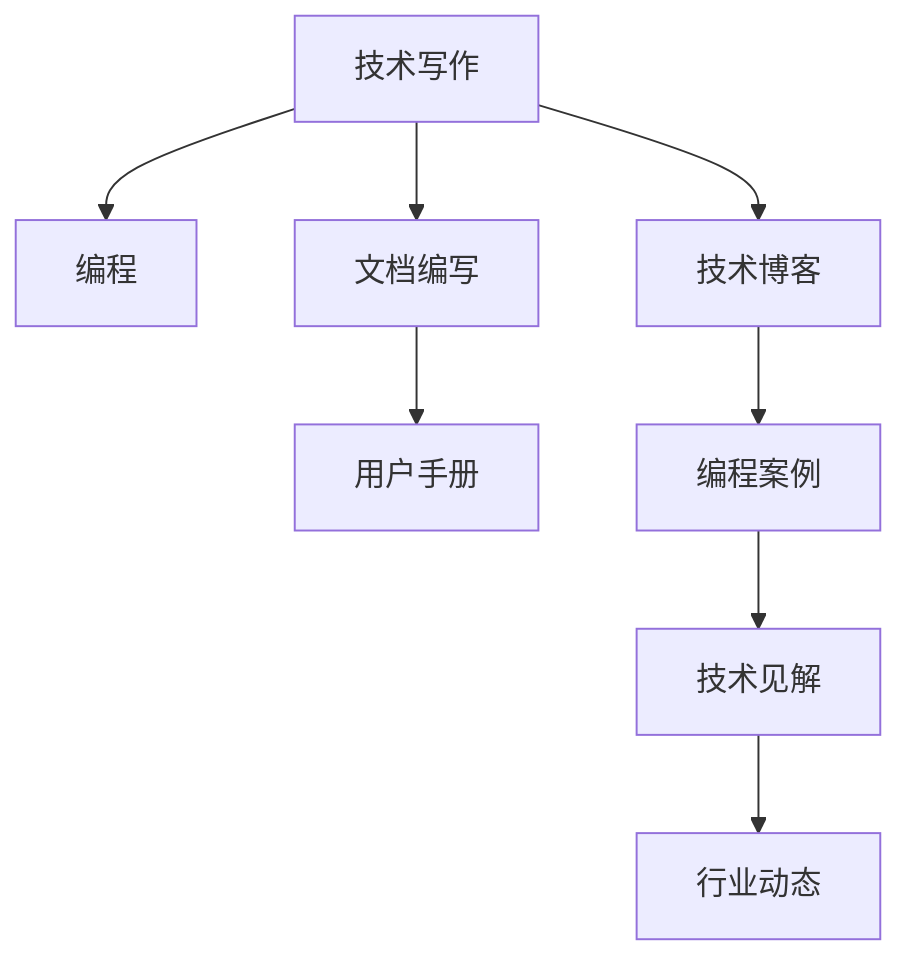

                 

# 技术写作：程序员的副业选择

> 关键词：技术写作, 程序员副业, 编程, 文档编写, 技术博客

## 1. 背景介绍

### 1.1 问题由来

在现代技术密集型企业中，程序员不再只是专注于代码编写和系统开发，还要应对越来越多的技术沟通和知识传播的需求。除了日常的编码工作，如何将自己的技术经验和思考整理成清晰、易于理解的技术文档，已经成为程序员不可或缺的技能之一。

### 1.2 问题核心关键点

技术写作，尤其是面向程序员的副业选择，可以从以下几个核心关键点进行探讨：

- **技术知识的传达**：如何有效地将技术知识传达给非技术背景的读者，确保他们能够理解和应用所学内容。
- **文档的可读性和实用性**：文档应注重内容的可读性和实用性，使读者能够迅速上手。
- **多渠道传播**：利用博客、社交媒体、技术社区等多种渠道传播技术文档，最大化其影响力。
- **持续更新与维护**：技术不断迭代，文档也需持续更新以保持最新状态。

### 1.3 问题研究意义

技术写作对于程序员来说，不仅是提升自身技能和影响力的重要途径，也是帮助他人理解技术、促进知识共享的重要手段。通过技术写作，程序员可以将自己的思考、实验和实践经验进行记录和分享，不仅能够帮助其他技术从业者更快地上手新技术，还能在技术社区中建立个人品牌，拓展职业发展道路。

## 2. 核心概念与联系

### 2.1 核心概念概述

- **技术写作（Technical Writing）**：将技术知识和信息转化为易于理解和应用的形式，包括但不限于编程手册、技术博客、用户手册等。
- **程序员副业（Side Hustles for Programmers）**：指程序员在主要工作之外，利用技术专长开展的第二职业或副业，如技术写作、技术咨询、技术培训等。
- **编程（Programming）**：编写计算机程序，实现特定功能或解决实际问题的过程。
- **文档编写（Documentation Writing）**：创建和维护软件或系统相关的文档，帮助用户理解和应用产品。
- **技术博客（Tech Blogging）**：通过撰写博客文章，分享编程经验、技术见解、行业动态等内容，构建专业品牌。

### 2.2 核心概念原理和架构的 Mermaid 流程图



这个流程图展示了技术写作与编程、文档编写、技术博客等核心概念之间的联系：

- **技术写作**：基于编程技能，通过文档编写和技术博客等方式，将技术知识传达给非技术背景的读者。
- **文档编写**：技术写作的重要组成部分，侧重于创建用户手册、API文档等实用文档。
- **技术博客**：通过撰写博客文章，分享编程经验和行业动态，展示技术专长。

## 3. 核心算法原理 & 具体操作步骤

### 3.1 算法原理概述

技术写作和编程技能之间有很强的交叉性和互补性。技术写作不仅仅是文字的编排，更是将复杂的编程逻辑和算法思想以易于理解的形式呈现出来的过程。因此，有效的技术写作需要以下算法原理的支撑：

1. **清晰的逻辑结构**：确保文档的逻辑结构清晰，内容层次分明，读者可以迅速找到所需信息。
2. **精确的语言表达**：使用精确的语言和术语，避免模糊和歧义，确保信息的准确传达。
3. **示例和实践**：通过具体的示例和实践，帮助读者更好地理解技术概念和操作步骤。
4. **交互式元素**：利用代码片段、图表等交互式元素，增强文档的互动性和可读性。

### 3.2 算法步骤详解

以下是技术写作和程序员副业选择的具体操作步骤：

**Step 1: 确定写作目标和受众**
- 明确写作的目的，如解释某个技术概念、分享编程经验、教授某个技术栈。
- 确定目标受众，如新手、中级开发者、架构师等，以便定制内容。

**Step 2: 收集和整理资料**
- 搜集相关资料，包括技术文档、案例分析、最新研究等。
- 整理资料，将其结构化，确保逻辑清晰。

**Step 3: 撰写和编辑文档**
- 根据目标受众和资料内容，撰写文档初稿。
- 进行编辑和校对，确保内容的准确性和可读性。

**Step 4: 选择传播渠道**
- 选择合适的传播渠道，如个人博客、技术社区、社交媒体等。
- 利用SEO等工具优化文档的可发现性。

**Step 5: 发布和维护**
- 发布文档，并定期更新以反映最新的技术进展。
- 收集反馈，持续改进文档内容和传播方式。

### 3.3 算法优缺点

技术写作和程序员副业选择的优点：

- **知识共享**：通过文档编写和博客文章，将自己的技术知识分享给更广泛的读者。
- **提升个人品牌**：技术写作有助于在技术社区中建立个人品牌，提升职业影响力。
- **副业收入**：通过技术写作可以获得额外的收入，如技术咨询、书籍出版等。

其缺点包括：

- **时间和精力投入**：撰写高质量的文档和文章需要大量时间和精力。
- **持续更新需求**：技术不断更新，文档也需持续维护，工作量较大。
- **竞争激烈**：技术写作领域竞争激烈，需要不断创新和改进。

### 3.4 算法应用领域

技术写作和程序员副业选择的应用领域广泛，包括但不限于：

- **软件开发文档**：编写API文档、用户手册、开发指南等。
- **技术博客**：分享编程经验、技术见解、项目案例等。
- **技术培训**：撰写培训教材、制作视频教程等。
- **技术咨询**：提供技术方案、指导项目实施等。
- **开源项目文档**：维护开源项目的文档，如README、贡献指南等。

## 4. 数学模型和公式 & 详细讲解 & 举例说明

### 4.1 数学模型构建

技术写作涉及的内容复杂多样，无法简单用数学模型描述。但可以通过以下模型框架理解技术写作的基本结构和流程：

**写作模型**：
\[ W = I \times S \times E \]

其中，$W$ 表示写作成果，$I$ 为信息收集和整理，$S$ 为撰写和编辑，$E$ 为发布和维护。

### 4.2 公式推导过程

技术写作的公式推导过程较为复杂，涉及信息收集、内容组织、语言表达等多个方面。但可以简要推导：

1. **信息收集**：
\[ I = \sum_{i=1}^n P_i \]

其中，$P_i$ 表示第 $i$ 个信息的权重，可根据其重要性和相关性确定。

2. **内容组织**：
\[ S = \sum_{j=1}^m C_j \]

其中，$C_j$ 表示第 $j$ 个内容的深度和广度，需确保内容的全面性和条理性。

3. **语言表达**：
\[ E = \sum_{k=1}^K F_k \]

其中，$F_k$ 表示第 $k$ 个语言表达技巧的效果，如清晰性、准确性、互动性等。

### 4.3 案例分析与讲解

假设我们要编写一篇关于如何使用 Python 进行数据可视化的教程：

1. **信息收集**：
   - 收集Python官方文档、第三方库文档、社区讨论等。
   - 确定信息权重，如Python文档50%，第三方库文档30%，社区讨论20%。

2. **内容组织**：
   - 将内容分为基本概念、实用技巧、高级应用三部分。
   - 对每部分内容进行深入讲解和案例分析。

3. **语言表达**：
   - 使用清晰的语言和示例代码，避免歧义。
   - 插入图表和代码片段，增强互动性。

## 5. 项目实践：代码实例和详细解释说明

### 5.1 开发环境搭建

要开始技术写作和文档编写，需要以下开发环境：

1. **编程环境**：如Python、Java等，用于撰写和编辑文档。
2. **文本编辑器**：如Visual Studio Code、Atom等，用于写作和编辑。
3. **版本控制系统**：如Git，用于版本管理和协作。
4. **文档编辑器**：如Markdown编辑器，用于编写文档。
5. **发布平台**：如GitHub Pages、CSDN等，用于发布和维护文档。

### 5.2 源代码详细实现

以下是一个简单的技术写作流程示例，包括使用Markdown编写文档和使用Git进行版本管理：

**Markdown文档示例**：

```markdown
# 使用Python进行数据可视化

## 基本概念

数据可视化是将数据转化为图形或图表的过程。Python提供了多种数据可视化库，如Matplotlib、Seaborn等。

## 安装库

```python
pip install matplotlib seaborn
```

## 示例代码

```python
import matplotlib.pyplot as plt
import seaborn as sns

# 绘制折线图
x = [1, 2, 3, 4, 5]
y = [2, 4, 6, 8, 10]
plt.plot(x, y)
plt.show()
```

## 高级应用

```python
import pandas as pd
import matplotlib.pyplot as plt

# 读取数据
data = pd.read_csv('data.csv')

# 绘制柱状图
sns.barplot(x='category', y='value', data=data)
plt.show()
```

## 总结

数据可视化是数据分析的重要环节，Python提供了强大的工具支持。通过学习如何使用Python进行数据可视化，可以更好地理解和展示数据。
```

**Git版本管理示例**：

1. **创建仓库**：
   ```bash
   git init
   ```

2. **添加文件**：
   ```bash
   git add README.md
   git add data.csv
   ```

3. **提交更改**：
   ```bash
   git commit -m "Initial commit"
   ```

4. **推送到远程仓库**：
   ```bash
   git remote add origin https://github.com/yourusername/your-repo.git
   git push -u origin master
   ```

### 5.3 代码解读与分析

技术写作的代码实现主要涉及文档的撰写和发布。通过Markdown语法编写文档，并利用Git进行版本管理，可以确保文档的清晰性和可维护性。

Markdown语言简单易学，适合撰写技术文档。通过使用Markdown，可以将技术内容组织成清晰、易于理解的结构。Git则提供了强大的版本控制功能，方便团队协作和文档迭代。

## 6. 实际应用场景

### 6.1 软件开发文档

在软件开发中，技术写作用于编写API文档、用户手册、开发指南等。例如，可以使用Swagger生成API文档，使用Javadoc编写Java代码文档。

### 6.2 技术博客

技术博客是技术写作的重要应用之一。通过撰写技术博客，分享编程经验、技术见解、项目案例等，不仅能提升个人品牌，还能帮助其他开发者学习和应用新技术。

### 6.3 技术培训

技术培训需要详细的培训教材和视频教程。通过技术写作，可以创建高质量的培训材料，帮助学员更好地掌握技术知识。

### 6.4 开源项目文档

开源项目的成功依赖于良好的文档支持。通过技术写作，维护开源项目的README、贡献指南等文档，可以吸引更多开发者参与项目。

## 7. 工具和资源推荐

### 7.1 学习资源推荐

要掌握技术写作，可以参加以下课程和阅读相关书籍：

1. **Coursera《技术写作与沟通》**：介绍技术写作的基本原则和实践技巧。
2. **Udemy《编程博客写作与SEO优化》**：通过实际案例讲解编程博客的撰写和SEO优化。
3. **《技术写作的艺术》**：一本系统介绍技术写作方法和技巧的书籍。
4. **《Git和GitHub入门》**：了解版本控制和代码托管平台的基础知识。

### 7.2 开发工具推荐

以下是一些常用的技术写作和文档管理的工具：

1. **Visual Studio Code**：功能强大的文本编辑器，支持Markdown和其他编程语言。
2. **GitHub Pages**：托管静态网站的平台，适合发布技术博客和文档。
3. **Git**：版本控制系统，支持代码和文档的版本管理。
4. **Markdown编辑器**：如Typora、MdNote等，用于编写Markdown文档。
5. **Notion**：全能型的笔记和文档管理工具，适合整理技术资料和撰写文档。

### 7.3 相关论文推荐

以下是几篇经典的技术写作和程序员副业选择的论文：

1. **《技术写作的标准与实践》**：介绍了技术写作的标准和实践指南，适合初学者入门。
2. **《程序员副业的选择与实现》**：探讨了程序员副业的多样性及其实现方法，提供了丰富的案例分析。
3. **《开源项目的文档管理》**：详细介绍了开源项目文档管理的最佳实践，包括README、贡献指南等文档的编写。

## 8. 总结：未来发展趋势与挑战

### 8.1 研究成果总结

技术写作和程序员副业选择已经成为技术从业者必备的技能之一。通过技术写作，程序员可以分享知识、建立品牌、获得副业收入。

### 8.2 未来发展趋势

1. **技术写作工具的智能化**：未来的技术写作工具将更加智能化，提供更强大的写作辅助和内容推荐功能。
2. **程序员副业的多样化**：除了传统技术写作，程序员还将探索更多副业，如技术咨询、技术培训等。
3. **内容传播的全球化**：技术写作和程序员副业选择将打破地域限制，覆盖全球用户。

### 8.3 面临的挑战

尽管技术写作和程序员副业选择有广阔前景，但仍面临以下挑战：

1. **时间和精力管理**：在主要工作之外，平衡副业需求和精力投入是一大难题。
2. **技术更新快速**：技术不断更新，文档和博客需持续更新，工作量较大。
3. **受众多样性**：面向不同受众的技术写作需有不同的表达方式和内容结构。

### 8.4 研究展望

未来，技术写作和程序员副业选择将更加注重以下几个方面：

1. **跨领域融合**：技术写作需结合多领域知识，提升内容的深度和广度。
2. **内容创意和质量**：通过创意和高质量的内容吸引更多读者和用户。
3. **技术社区的活跃参与**：通过与技术社区的互动，提升内容的影响力和传播效果。

## 9. 附录：常见问题与解答

**Q1: 技术写作和程序员副业选择是否适合所有人？**

A: 技术写作和程序员副业选择适合有一定编程基础和技术写作基础的人。初学者可以通过学习相关课程和书籍逐步掌握。

**Q2: 如何平衡主要工作和副业？**

A: 建议设置固定的时间段，如周末或晚上，专注于副业任务。同时，合理安排任务优先级，确保重要任务优先完成。

**Q3: 如何提升技术写作的质量？**

A: 通过多读优秀文档和博客，学习其写作技巧和表达方式。同时，多写多练，不断改进写作能力。

**Q4: 技术写作如何盈利？**

A: 技术写作可以通过博客广告、书籍出版、技术咨询等方式盈利。建立个人品牌后，还可以通过讲座、培训等获得收入。

---

作者：禅与计算机程序设计艺术 / Zen and the Art of Computer Programming

