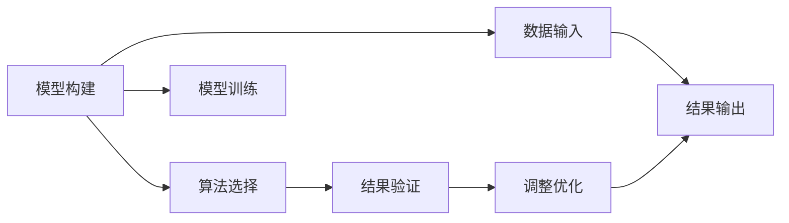

                 

# 技术咨询：知识变现的另一种方式

在数字化转型的大潮下，知识变现不再是传统的出版、培训等形式，而是呈现出越来越多的新兴模式。本文将从技术咨询的角度出发，探讨如何将知识以更有价值的方式传递给需要的人，以及在此过程中可以应用的一些技术手段和工具。

## 1. 背景介绍

### 1.1 问题由来

随着信息技术的快速发展，知识的获取和传播变得更加容易。互联网的普及使得人人都可以成为知识输出者，同时也让人们更加渴望获得有深度、有价值的信息。传统基于书籍、文章、课程等形式的知识输出，虽然仍然重要，但已不能满足越来越多人的个性化需求。技术咨询，作为一种新兴的知识变现方式，正在成为越来越受关注的选择。

### 1.2 问题核心关键点

技术咨询的核心在于利用专业知识和经验，为企业和个人提供定制化的解决方案。其关键点包括：

- **专业知识**：咨询师需具备深厚的专业知识背景，能够应对复杂的问题和挑战。
- **经验积累**：长期的工作经验和对行业的深入理解，使咨询师能够提供更实用的建议。
- **沟通能力**：良好的沟通能力是理解客户需求和传递信息的关键。
- **问题解决能力**：能够快速分析问题，并提出切实可行的解决方案。

## 2. 核心概念与联系

### 2.1 核心概念概述

技术咨询涉及到多个领域，包括但不限于软件架构、数据分析、项目管理、系统集成等。其中，基于模型的技术咨询尤为突出，通过构建复杂模型来模拟问题，并提出解决方案。

- **模型构建**：使用数据和算法构建模型，以模拟实际问题，找出关键因素和影响因素。
- **问题解决**：基于模型提出解决方案，优化决策过程。
- **实时仿真**：通过模拟和仿真，预测解决方案的实际效果。

### 2.2 核心概念原理和架构的 Mermaid 流程图



在这个流程图中，数据输入和模型构建是基础，模型训练是核心，结果验证和调整优化是保证结果准确性的关键。

## 3. 核心算法原理 & 具体操作步骤

### 3.1 算法原理概述

技术咨询中的模型构建和训练，可以借鉴机器学习和深度学习中的算法原理。具体步骤如下：

1. **数据收集与预处理**：从多个数据源收集相关数据，并进行清洗和预处理。
2. **模型选择与构建**：选择合适的算法和模型架构，构建模型。
3. **模型训练与验证**：使用训练数据集训练模型，并通过验证数据集评估模型性能。
4. **模型优化与调整**：根据验证结果，调整模型参数和结构，提升模型性能。
5. **模型应用与评估**：将模型应用于实际问题，并评估其效果。

### 3.2 算法步骤详解

以软件架构咨询为例，具体步骤如下：

1. **需求调研**：与客户进行深入的交流，了解其业务需求和痛点。
2. **系统分析**：分析现有系统的架构和功能，找出瓶颈和优化点。
3. **模型构建**：根据业务需求和系统分析结果，构建软件架构模型。
4. **模型训练与验证**：使用历史数据和假设场景，训练模型，并通过模拟测试验证其有效性。
5. **方案优化**：根据模型结果和实际反馈，优化架构方案。
6. **实施部署**：指导客户实施架构方案，并持续监控效果。

### 3.3 算法优缺点

**优点**：
- **模型化思维**：将问题转化为可量化的模型，使得问题解决更系统化和可预测。
- **数据驱动**：依赖数据和算法，使得决策更加客观和科学。
- **可复用性**：模型和算法可以被应用于多个类似场景，提高效率。

**缺点**：
- **复杂度高**：模型构建和训练需要较高的技术门槛。
- **数据质量要求高**：模型效果依赖于数据质量，低质量数据可能导致错误结果。
- **过度依赖算法**：算法选择和参数调整不当，可能导致模型失效。

### 3.4 算法应用领域

技术咨询在多个领域都有广泛应用，包括但不限于：

- **软件开发**：构建软件架构模型，优化系统设计。
- **数据分析**：构建数据模型，进行数据分析和预测。
- **项目管理**：构建项目管理模型，优化项目管理和决策。
- **系统集成**：构建系统集成模型，优化系统集成和部署。

## 4. 数学模型和公式 & 详细讲解

### 4.1 数学模型构建

技术咨询中的数学模型构建，通常包括线性回归、逻辑回归、决策树、随机森林等算法。以下以线性回归为例，给出模型的数学表达和构建步骤：

1. **模型定义**：
   $$
   y = \beta_0 + \beta_1x_1 + \beta_2x_2 + \cdots + \beta_nx_n + \epsilon
   $$
   其中，$y$ 为因变量，$x_i$ 为自变量，$\beta_i$ 为系数，$\epsilon$ 为误差项。

2. **数据准备**：
   $$
   \begin{bmatrix}
   x_{11} & x_{12} & \cdots & x_{1n} \\
   x_{21} & x_{22} & \cdots & x_{2n} \\
   \vdots & \vdots & \ddots & \vdots \\
   x_{m1} & x_{m2} & \cdots & x_{mn}
   \end{bmatrix}
   \begin{bmatrix}
   \beta_0 \\
   \beta_1 \\
   \vdots \\
   \beta_n
   \end{bmatrix}
   =
   \begin{bmatrix}
   y_1 \\
   y_2 \\
   \vdots \\
   y_m
   \end{bmatrix}
   $$

3. **模型训练**：
   使用最小二乘法求解系数 $\beta_i$：
   $$
   \hat{\beta} = (X^TX)^{-1}X^Ty
   $$
   其中，$X$ 为自变量矩阵，$y$ 为因变量向量，$\hat{\beta}$ 为求解的系数向量。

4. **模型验证**：
   使用验证集评估模型性能，常用的指标包括均方误差(MSE)、均方根误差(RMSE)、R²等。

### 4.2 公式推导过程

以线性回归为例，推导模型系数的求解公式：

$$
\begin{bmatrix}
x_{11} & x_{12} & \cdots & x_{1n} \\
x_{21} & x_{22} & \cdots & x_{2n} \\
\vdots & \vdots & \ddots & \vdots \\
x_{m1} & x_{m2} & \cdots & x_{mn}
\end{bmatrix}
\begin{bmatrix}
\beta_0 \\
\beta_1 \\
\vdots \\
\beta_n
\end{bmatrix}
=
\begin{bmatrix}
y_1 \\
y_2 \\
\vdots \\
y_m
\end{bmatrix}
$$

通过矩阵乘法和矩阵求逆，可以求解系数向量 $\hat{\beta}$：

$$
\hat{\beta} = (X^TX)^{-1}X^Ty
$$

### 4.3 案例分析与讲解

以某电商平台的数据分析为例，分析用户购买行为的影响因素。

1. **数据收集**：收集用户基本信息、购买历史、评价等信息。
2. **模型构建**：构建线性回归模型，自变量包括用户年龄、性别、历史购买金额等。
3. **模型训练**：使用训练数据训练模型，求解系数。
4. **模型验证**：使用验证数据评估模型效果，发现性别对购买行为有显著影响。
5. **方案优化**：根据模型结果，优化营销策略，提升用户购买率。

## 5. 项目实践：代码实例和详细解释说明

### 5.1 开发环境搭建

技术咨询项目通常需要具备以下开发环境：

1. **编程语言**：Python、R等。
2. **数据分析库**：Pandas、NumPy等。
3. **机器学习库**：Scikit-Learn、TensorFlow、PyTorch等。
4. **数据可视化库**：Matplotlib、Seaborn等。
5. **项目管理工具**：JIRA、Trello等。

### 5.2 源代码详细实现

以线性回归为例，给出Python代码实现：

```python
import pandas as pd
import numpy as np
from sklearn.linear_model import LinearRegression
from sklearn.model_selection import train_test_split
from sklearn.metrics import mean_squared_error, r2_score

# 数据准备
data = pd.read_csv('data.csv')
X = data[['age', 'gender', 'purchase_amount']]
y = data['purchase_frequency']

# 模型训练
X_train, X_test, y_train, y_test = train_test_split(X, y, test_size=0.2, random_state=42)
model = LinearRegression()
model.fit(X_train, y_train)

# 模型验证
y_pred = model.predict(X_test)
mse = mean_squared_error(y_test, y_pred)
rmse = np.sqrt(mse)
r2 = r2_score(y_test, y_pred)

print(f"MSE: {mse:.2f}, RMSE: {rmse:.2f}, R²: {r2:.2f}")
```

### 5.3 代码解读与分析

上述代码中，首先使用Pandas库加载数据，然后使用Scikit-Learn库的LinearRegression模型进行训练和验证。通过均方误差(MSE)、均方根误差(RMSE)和R²系数评估模型性能。

## 6. 实际应用场景

### 6.1 智能制造

技术咨询在智能制造领域有广泛应用，通过构建优化模型，帮助企业优化生产流程，提升生产效率。

1. **需求调研**：了解企业生产流程和设备状况。
2. **系统分析**：分析现有流程和设备的瓶颈。
3. **模型构建**：构建优化模型，模拟生产流程和设备运行。
4. **模型训练与验证**：使用历史数据训练模型，验证其效果。
5. **方案优化**：优化生产流程和设备配置，提升生产效率。

### 6.2 智慧城市

技术咨询在智慧城市建设中也有重要应用，通过构建智能模型，帮助城市管理更加高效、智能。

1. **需求调研**：了解城市管理需求和痛点。
2. **系统分析**：分析城市数据和运行状况。
3. **模型构建**：构建智能模型，模拟城市运行和资源分配。
4. **模型训练与验证**：使用历史数据训练模型，验证其效果。
5. **方案优化**：优化城市管理方案，提升城市运行效率。

### 6.3 金融风控

技术咨询在金融风控中也有重要应用，通过构建风险模型，帮助金融机构评估风险，制定风控策略。

1. **需求调研**：了解金融机构业务需求和风险点。
2. **系统分析**：分析金融数据和业务流程。
3. **模型构建**：构建风险模型，模拟金融风险。
4. **模型训练与验证**：使用历史数据训练模型，验证其效果。
5. **方案优化**：优化风控策略，提升金融机构风险管理能力。

## 7. 工具和资源推荐

### 7.1 学习资源推荐

为了帮助开发者系统掌握技术咨询的理论基础和实践技巧，这里推荐一些优质的学习资源：

1. **在线课程**：Coursera、edX等平台上有许多优秀的数据科学和机器学习课程，如Coursera的《Machine Learning》课程。
2. **书籍**：《Python数据科学手册》、《深度学习》、《机器学习实战》等。
3. **社区**：Kaggle、Stack Overflow等平台，可以获取最新的数据集和算法实现，与社区成员交流学习。

### 7.2 开发工具推荐

以下是几款用于技术咨询开发的常用工具：

1. **编程语言**：Python、R等。
2. **数据分析库**：Pandas、NumPy等。
3. **机器学习库**：Scikit-Learn、TensorFlow、PyTorch等。
4. **数据可视化库**：Matplotlib、Seaborn等。
5. **项目管理工具**：JIRA、Trello等。

### 7.3 相关论文推荐

技术咨询相关的研究也在不断深入，以下是几篇奠基性的相关论文，推荐阅读：

1. **《线性回归的数学基础》**：介绍了线性回归模型的构建和求解方法。
2. **《机器学习实战》**：提供了丰富的机器学习实践案例，包括数据预处理、模型训练和评估等。
3. **《智慧城市的数据驱动管理》**：探讨了智慧城市建设中数据驱动管理的实践方法。

## 8. 总结：未来发展趋势与挑战

### 8.1 研究成果总结

技术咨询作为一种新兴的知识变现方式，其理论基础和实践方法还在不断发展和完善。通过结合数据科学和机器学习，技术咨询正在逐渐成为解决复杂问题的重要手段。

### 8.2 未来发展趋势

未来技术咨询将呈现以下几个发展趋势：

1. **数据驱动**：随着数据量的增加和质量提升，技术咨询将更加依赖数据驱动，提高问题解决的准确性和效率。
2. **模型化思维**：复杂问题将更多地转化为可量化的模型，使得问题解决更具系统性和可预测性。
3. **跨领域融合**：技术咨询将更多地与AI、大数据、物联网等技术融合，拓展应用范围和深度。
4. **实时性**：技术咨询将更多地注重实时性，提升决策和管理的及时性。

### 8.3 面临的挑战

尽管技术咨询已经取得了一定的进展，但在实现大规模应用的过程中，仍面临以下挑战：

1. **数据质量**：高质量的数据是技术咨询的基础，但获取和清洗数据仍需大量时间和资源。
2. **技术门槛**：技术咨询需要较强的技术背景，门槛较高，需要培养更多专业人才。
3. **模型可解释性**：模型结果的解释性不足，难以获得客户和管理层的信任。
4. **跨领域应用**：跨领域的模型构建和应用需要更多的研究和实践。

### 8.4 研究展望

未来的研究需要在以下几个方面寻求新的突破：

1. **数据获取与处理**：探索更多高效的数据获取和清洗方法，提高数据质量。
2. **模型构建与优化**：开发更高效、更智能的模型构建和优化方法。
3. **可解释性与透明性**：提高模型的可解释性和透明性，增强客户信任。
4. **跨领域应用**：加强跨领域的知识整合和应用，拓展技术咨询的边界。

## 9. 附录：常见问题与解答

**Q1：如何提高数据质量？**

A: 提高数据质量需要从数据收集、清洗、标注等多个环节入手，具体方法包括：

- **数据清洗**：去除重复、缺失、异常值等数据，确保数据的一致性和完整性。
- **数据标注**：使用人工标注和自动标注相结合的方法，提高数据标注的准确性和效率。
- **数据验证**：使用多种验证方法，如交叉验证、验证集验证等，确保数据的质量和一致性。

**Q2：如何提高模型的可解释性？**

A: 提高模型的可解释性可以从以下几个方面入手：

- **特征解释**：通过可视化特征权重和贡献度，解释模型决策过程。
- **模型简化**：使用简化模型，如决策树、逻辑回归等，提高模型的可解释性。
- **可视化工具**：使用可视化工具，如SHAP、LIME等，生成特征重要性图和局部解释。

**Q3：如何降低技术门槛？**

A: 降低技术门槛需要从多个环节入手，具体方法包括：

- **简化模型**：使用简化模型和算法，降低技术难度。
- **自动化工具**：使用自动化工具和框架，减少手工操作的复杂度。
- **文档与教程**：编写详细的文档和教程，帮助用户快速上手。

总之，技术咨询作为一种新兴的知识变现方式，通过结合数据科学和机器学习，能够提供系统、可预测的解决方案。未来的发展将更多地依赖数据驱动和模型化思维，同时也要注意提高模型的可解释性和降低技术门槛，才能更好地服务于各行各业。相信在技术咨询领域，更多的创新和突破将会带来新的可能性，为各行各业带来更加智能和高效的管理和服务。

---

作者：禅与计算机程序设计艺术 / Zen and the Art of Computer Programming

