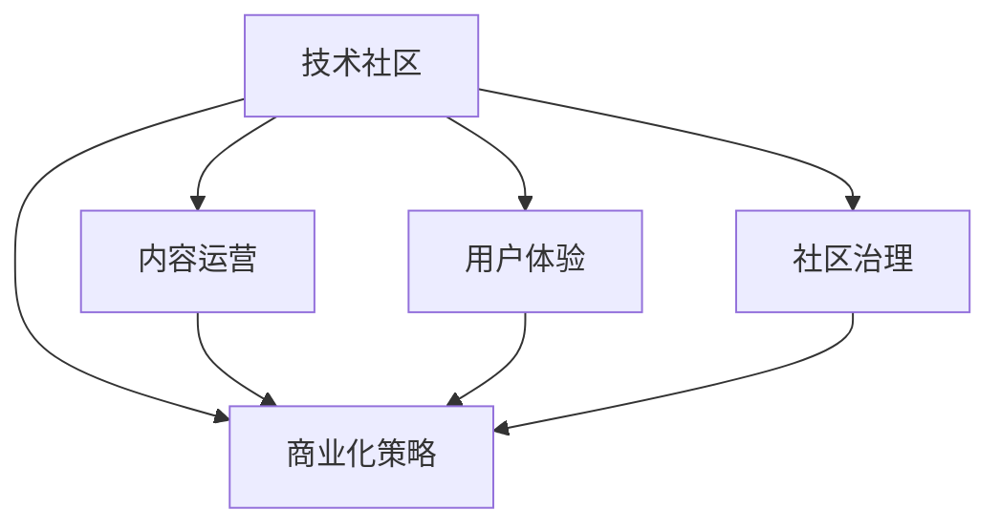

                 

# 技术社区运营：从0到100万用户的增长秘诀

## 1. 背景介绍

### 1.1 问题由来
在互联网快速发展的今天，技术社区成为程序员、开发者以及技术爱好者交流、学习和分享知识的重要平台。但是，很多技术社区在初创阶段会面临用户增长瓶颈，用户留存率低，难以形成大规模的用户生态。如何高效、可持续地扩展技术社区用户规模，成为了社区运营者最关心的问题。

### 1.2 问题核心关键点
技术社区用户增长的关键在于社区内容的吸引力、用户体验的优化以及社区氛围的建设。社区运营者需要综合考虑内容质量、用户互动、社区治理、商业化策略等多方面因素，才能实现用户规模的快速增长。

### 1.3 问题研究意义
实现技术社区用户从0到100万的突破，不仅有助于社区品牌的提升和影响力的扩大，还能够带动社区商业化进程，提升社区价值和盈利能力。这将直接促进社区运营模式的创新和技术生态系统的成熟。

## 2. 核心概念与联系

### 2.1 核心概念概述

为更好地理解技术社区运营中的用户增长策略，本节将介绍几个关键概念及其之间的联系：

- **技术社区**：以技术交流、分享、学习为核心的在线平台，聚集了大量的开发者、技术爱好者和专家。
- **用户增长**：通过各种策略和方法，增加社区注册用户数、活跃用户数等，形成稳定增长的用户规模。
- **内容运营**：通过精心策划、组织和发布高质量的技术文章、教程、代码案例等，吸引和留存用户。
- **用户体验**：通过优化产品功能、界面设计、交互方式等，提升用户使用体验，提高用户黏性。
- **社区治理**：通过制定和执行社区规则、管理用户行为等，维护社区秩序，提升社区氛围。
- **商业化策略**：通过广告、赞助、会员制度等手段，实现社区的盈利。

这些概念之间的关系通过以下Mermaid流程图来展示：



这个流程图展示了一系列关键运营策略与技术社区用户增长之间的关系：

1. **内容运营**：社区的核心驱动力，吸引和留存用户的关键。
2. **用户体验**：通过不断优化产品，提升用户满意度，从而提高用户留存率和活跃度。
3. **社区治理**：通过良好的社区规则和用户管理，保持社区的秩序和活跃度。
4. **商业化策略**：实现社区盈利的关键，需要通过精准的商业化手段，提升社区的经济价值。

这些概念共同构成了技术社区运营的核心框架，是实现用户快速增长的重要基础。

## 3. 核心算法原理 & 具体操作步骤

### 3.1 算法原理概述

技术社区用户增长的核心算法原理，可以总结为以下几个关键点：

1. **内容驱动增长**：高质量的内容是吸引用户的关键，社区运营者需要持续不断地输出优质内容，形成社区的核心竞争力。
2. **互动增强用户黏性**：通过用户互动，如评论、点赞、分享等，增强用户之间的联系，提升用户参与度。
3. **优化用户体验**：优化社区界面和功能，提升用户的使用体验，使用户更愿意长时间留在社区。
4. **有效用户治理**：制定并执行社区规则，有效管理用户行为，维护社区的健康发展。
5. **商业化策略**：通过合理的商业模式和广告策略，实现社区的可持续发展。

这些原理相互支撑，共同构成了一个系统化的用户增长模型。

### 3.2 算法步骤详解

基于上述原理，技术社区用户增长的具体操作步骤可以总结如下：

**Step 1: 内容策略制定**
- 确定社区的核心内容领域，如编程语言、框架、工具等。
- 制定内容发布计划，包括内容类型、发布频率、发布渠道等。
- 组建内容团队，确保内容的质量和专业性。

**Step 2: 用户体验优化**
- 进行用户需求调研，了解用户痛点和需求。
- 优化产品功能，提升用户界面和操作体验。
- 引入新技术和工具，提升社区的响应速度和稳定性。

**Step 3: 社区治理**
- 制定社区规则，明确用户行为规范。
- 引入社区管理工具，如用户画像、用户行为分析等。
- 对违规用户进行管理和惩罚，维护社区秩序。

**Step 4: 用户互动增强**
- 设计互动机制，如评论、点赞、分享等。
- 举办社区活动，如技术研讨会、编程比赛等，增加用户参与度。
- 利用社交媒体和邮件等渠道，进行用户互动和推广。

**Step 5: 商业化策略实施**
- 确定社区的商业模式，如广告、赞助、会员制度等。
- 根据用户行为数据，精准投放广告，提升转化率。
- 推出会员制度，提供专属内容和服务，提升用户付费意愿。

**Step 6: 持续改进**
- 定期收集用户反馈，改进社区运营策略。
- 跟踪竞争对手动态，调整社区运营策略。
- 引入新技术和工具，提升社区运营效率。

以上是技术社区用户增长的一般操作步骤。在实际应用中，还需要根据社区的实际情况，对各项策略进行细化和优化。

### 3.3 算法优缺点

技术社区用户增长的算法具有以下优点：

1. **策略多样**：内容运营、用户体验、社区治理和商业化策略的多样化，为社区用户增长提供了多种可能性。
2. **效果显著**：通过综合运用各种策略，能够在短时间内显著提升社区用户规模和活跃度。
3. **可量化**：各项策略的效果可以通过数据进行量化分析，便于持续优化和改进。
4. **可复制性**：成功的运营策略可以在多个社区中复制和推广，提升运营效率。

同时，该算法也存在一定的局限性：

1. **资源投入大**：内容运营和用户体验优化需要大量的资源投入，包括人力、时间和资金。
2. **用户需求复杂**：用户需求千差万别，社区运营者需要不断调整策略，以适应不同的用户群体。
3. **策略执行难度**：社区治理和商业化策略需要精准执行，任何偏差都可能影响社区的健康发展。
4. **用户留存挑战**：即便初步实现了用户增长，如何长期留存用户，也是一大难题。

尽管存在这些局限性，但就目前而言，技术社区用户增长的算法仍是最主流的方法。未来相关研究的重点在于如何进一步降低运营成本，提高策略执行的精准性，同时兼顾用户长期留存。

### 3.4 算法应用领域

技术社区用户增长的算法已经在多个领域得到了应用，包括编程社区、技术博客、开发者问答等，为技术社区的发展提供了强有力的支持。

- **编程社区**：如Stack Overflow、GitHub等，通过高质量的技术问答和代码分享，吸引了大量的开发者。
- **技术博客**：如Medium、CSDN等，通过持续发布技术文章和教程，吸引了大量的技术爱好者。
- **开发者问答**：如Quora、知乎等，通过用户互动和专业回答，提升了用户参与度。

除了这些经典场景外，技术社区用户增长的算法也被创新性地应用于更多领域，如可控内容生成、用户行为分析、智能推荐等，为技术社区的发展提供了新的思路。随着社区运营模式的不断演进，相信该算法将在更多场景下发挥更大的作用。

## 4. 数学模型和公式 & 详细讲解 & 举例说明

### 4.1 数学模型构建

本节将使用数学语言对技术社区用户增长的模型进行更加严格的刻画。

记社区用户数为 $N(t)$，其中 $t$ 表示时间。社区用户在时间 $t$ 的增长率为 $g(t)$，则社区用户在时间 $t$ 的用户数可以表示为：

$$
N(t) = N_0 e^{\int_{0}^{t} g(t) dt}
$$

其中 $N_0$ 为初始用户数。社区用户增长模型可以通过优化 $g(t)$ 来提升用户规模。

### 4.2 公式推导过程

假设社区用户在时间 $t$ 的用户增长率 $g(t)$ 为线性增长，即：

$$
g(t) = g_0 + g_1t
$$

其中 $g_0$ 为初始增长率，$g_1$ 为增长速率。则社区用户在时间 $t$ 的用户数为：

$$
N(t) = N_0 e^{(g_0 + g_1t)t}
$$

当 $t$ 趋近于无穷大时，社区用户数趋近于：

$$
\lim_{t \to \infty} N(t) = N_0 e^{g_0t}
$$

这表明，在初始增长率一定的情况下，社区用户数的增长取决于社区的持续增长策略和执行效果。

### 4.3 案例分析与讲解

以下以Stack Overflow社区为例，分析其用户增长模型。

假设Stack Overflow在时间 $t=0$ 的初始用户数为 $N_0=1000$，初始增长率为 $g_0=0.01$，增长速率为 $g_1=0.02$。根据上述公式，计算社区用户在时间 $t=1$ 和 $t=10$ 的用户数：

$$
N(1) = 1000 e^{(0.01 + 0.02 \times 1) \times 1} = 1147
$$

$$
N(10) = 1000 e^{(0.01 + 0.02 \times 10) \times 10} = 12542
$$

可以看出，社区用户数在 $t=10$ 时比 $t=1$ 时增长了十倍以上，这表明增长策略对社区用户数的影响非常大。

## 5. 项目实践：代码实例和详细解释说明

### 5.1 开发环境搭建

在进行社区用户增长分析的实践前，我们需要准备好开发环境。以下是使用Python进行数据分析的环境配置流程：

1. 安装Anaconda：从官网下载并安装Anaconda，用于创建独立的Python环境。

2. 创建并激活虚拟环境：
```bash
conda create -n user-growth-env python=3.8 
conda activate user-growth-env
```

3. 安装Python科学计算库：
```bash
conda install numpy pandas scikit-learn matplotlib tqdm jupyter notebook ipython
```

4. 安装社区分析工具：
```bash
pip install requests beautifulsoup4
```

完成上述步骤后，即可在`user-growth-env`环境中开始数据分析实践。

### 5.2 源代码详细实现

下面我们以Stack Overflow社区为例，使用Python对用户增长数据进行分析。

首先，编写爬虫代码获取Stack Overflow的用户数据：

```python
import requests
from bs4 import BeautifulSoup

url = 'https://stackoverflow.com/users'
response = requests.get(url)
soup = BeautifulSoup(response.text, 'html.parser')

# 获取所有用户的用户名和注册日期
users = soup.find_all('tr', class_='user-tab-stats')
for user in users:
    username = user.find('a', class_='user-link').text.strip()
    registration_date = user.find('span', class_='user-tab-created').text.strip()
    print(f'{username}, {registration_date}')
```

然后，导入必要的分析库，对数据进行分析：

```python
import pandas as pd
import matplotlib.pyplot as plt
from datetime import datetime

# 将数据转换为Pandas DataFrame
users_df = pd.DataFrame(data)

# 计算每个用户的注册时间与当前时间的差值
users_df['registration_age'] = (pd.to_datetime(datetime.now()) - pd.to_datetime(users_df['registration_date'])) / pd.Timedelta(days=1)

# 计算用户注册年龄的中位数和均值
median_age = users_df['registration_age'].median()
mean_age = users_df['registration_age'].mean()

# 绘制用户注册年龄的直方图
plt.hist(users_df['registration_age'], bins=50, color='c')
plt.xlabel('Registration Age')
plt.ylabel('Number of Users')
plt.title('User Registration Age Distribution')
plt.show()

# 输出中位数和均值
print(f'Median Registration Age: {median_age:.2f} days')
print(f'Mean Registration Age: {mean_age:.2f} days')
```

### 5.3 代码解读与分析

让我们再详细解读一下关键代码的实现细节：

**爬虫代码**：
- 使用requests库获取Stack Overflow用户数据页面。
- 使用BeautifulSoup解析HTML页面，提取每个用户的用户名和注册日期。

**数据分析代码**：
- 将提取的用户数据导入Pandas DataFrame。
- 计算每个用户的注册时间与当前时间的差值，得到注册年龄。
- 使用Pandas的统计函数计算注册年龄的中位数和均值。
- 使用Matplotlib绘制注册年龄的直方图，直观展示用户注册年龄分布。

**输出结果**：
- 通过计算中位数和均值，可以了解社区用户的平均注册年龄，判断用户增长是否健康。
- 通过绘制直方图，可以直观看到用户注册年龄的分布情况，发现是否存在异常值或波动。

可以看到，通过爬虫和数据分析，我们可以对社区的用户增长数据进行全面分析和可视化，帮助社区运营者了解用户分布情况，优化用户增长策略。

## 6. 实际应用场景

### 6.1 智慧城市治理

智慧城市治理中，技术社区可以发挥重要的作用。通过建立城市管理技术社区，可以汇集大量城市管理专家和技术爱好者，共享城市管理经验，推动城市管理的智能化和自动化。

具体而言，可以收集城市管理领域的专家和技术博客，将相关文章作为社区的初始内容。通过持续发布高质量的城市管理文章和技术教程，吸引更多城市管理相关人员加入社区，并参与到城市管理的技术讨论和实践中去。同时，通过举办城市管理技术研讨会、编程比赛等活动，进一步提升社区的活跃度，推动城市管理的创新和进步。

### 6.2 电子商务平台

电子商务平台需要大量的技术支持，以提升用户体验和平台运营效率。通过建立技术社区，可以汇集大量的技术开发人员和用户，共享和解决平台技术问题，推动平台的持续创新和优化。

具体而言，可以建立电商平台的技术支持社区，定期发布平台的技术问题和解决方案，吸引开发者参与讨论和贡献代码。同时，通过社区内部的代码审查机制，提升平台代码的质量和稳定性，保障平台的运行安全。此外，还可以组织技术分享和培训活动，提升平台开发人员的整体技术水平。

### 6.3 教育领域

教育领域需要大量的技术支持和资源共享，通过建立教育技术社区，可以汇聚大量的教育专家和技术爱好者，推动教育技术的创新和应用。

具体而言，可以建立教育技术社区，邀请教育专家和技术爱好者发布教育技术相关的文章和资源，吸引更多的教育工作者和学生加入社区，参与到教育技术的讨论和实践中去。通过持续发布高质量的教育技术文章和技术教程，提升社区的整体技术水平和影响力。同时，通过社区内部的技术讨论和问题解答，解决教育技术应用中的难题，推动教育技术的普及和应用。

### 6.4 未来应用展望

随着技术社区的发展，其在更多领域的应用前景将会更加广阔。未来，技术社区的用户增长模型将会在更多的领域得到应用，为各行各业的发展提供强有力的支持。

在医疗健康领域，通过建立医疗技术社区，可以汇聚大量的医疗专家和技术人员，共享医疗技术资源，推动医疗技术的创新和应用。在金融领域，通过建立金融技术社区，可以汇集大量的金融专家和技术爱好者，共享金融技术知识，推动金融技术的创新和应用。在环保领域，通过建立环保技术社区，可以汇聚大量的环保专家和技术爱好者，共享环保技术资源，推动环保技术的创新和应用。

## 7. 工具和资源推荐

### 7.1 学习资源推荐

为了帮助开发者系统掌握技术社区运营的理论基础和实践技巧，这里推荐一些优质的学习资源：

1. **《社区运营的艺术》系列博文**：由社区运营专家撰写，深入浅出地介绍了社区运营的核心策略和实践技巧。
2. **《用户增长手册》**：Google的产品增长团队编写，全面介绍了用户增长的理论和实践方法。
3. **《社区建设与管理》课程**：各大在线教育平台开设的社区建设与管理课程，涵盖社区运营的各个方面。
4. **《社区运营策略与实战》书籍**：社区运营领域的经典书籍，系统介绍了社区运营的各个环节和实践技巧。
5. **社区运营相关的Hacker News文章和Stack Overflow回答**：社区运营者的经验分享和问题解答，可以提供丰富的学习资源。

通过对这些资源的学习实践，相信你一定能够快速掌握技术社区运营的精髓，并用于解决实际的社区运营问题。

### 7.2 开发工具推荐

高效的开发离不开优秀的工具支持。以下是几款用于技术社区运营开发的常用工具：

1. **Jupyter Notebook**：免费的开源Jupyter Notebook环境，适合数据分析和可视化工作。
2. **GitHub**：Git版本控制系统，适合代码管理和协作。
3. **Google Colab**：谷歌推出的在线Jupyter Notebook环境，免费提供GPU/TPU算力，适合进行高性能计算。
4. **Trello**：项目管理工具，适合社区活动和任务的管理。
5. **Slack**：团队沟通工具，适合社区内部的沟通和协作。
6. **Zoom**：视频会议工具，适合社区内部的线上活动和培训。

合理利用这些工具，可以显著提升技术社区运营的效率，加快创新迭代的步伐。

### 7.3 相关论文推荐

技术社区用户增长的研究源于学界的持续研究。以下是几篇奠基性的相关论文，推荐阅读：

1. **《社区建设与管理》**：社区运营领域的经典论文，系统介绍了社区建设与管理的各个环节。
2. **《用户增长策略》**：Google的产品增长团队编写的论文，介绍了用户增长的理论和实践方法。
3. **《社区参与度分析》**：通过数据分析的方法，研究社区参与度的影响因素和提升策略。
4. **《社区情感分析》**：通过自然语言处理技术，分析社区用户的情感状态，指导社区运营策略的调整。
5. **《社区推荐系统》**：通过推荐系统技术，提升社区内容的推荐效果，吸引更多用户参与。

这些论文代表了大社区运营研究的发展脉络。通过学习这些前沿成果，可以帮助研究者把握学科前进方向，激发更多的创新灵感。

## 8. 总结：未来发展趋势与挑战

### 8.1 总结

本文对技术社区用户增长的算法进行了全面系统的介绍。首先阐述了技术社区用户增长的背景和意义，明确了社区运营的核心策略和步骤。其次，从原理到实践，详细讲解了用户增长的数学模型和操作步骤，给出了社区运营的完整代码实例。同时，本文还广泛探讨了技术社区用户增长在智慧城市治理、电子商务平台、教育领域等的应用前景，展示了技术社区运营的巨大潜力。最后，本文精选了技术社区运营的相关学习资源，力求为读者提供全方位的技术指引。

通过本文的系统梳理，可以看到，技术社区用户增长的算法正在成为社区运营的重要范式，极大地拓展了社区的运营模式，催生了更多的落地场景。未来，伴随社区运营模式的不断演进，相信技术社区用户增长必将在更多领域大放异彩，深刻影响人类的生产生活方式。

### 8.2 未来发展趋势

展望未来，技术社区用户增长的算法将呈现以下几个发展趋势：

1. **数据驱动的增长策略**：通过数据分析，优化社区运营策略，提高用户增长效果。
2. **个性化推荐系统**：通过推荐系统技术，提升社区内容的质量和相关性，吸引更多用户参与。
3. **自动化运营工具**：引入自动化运营工具，提升社区运营效率，降低运营成本。
4. **跨平台协作**：通过跨平台协作，提升社区的用户覆盖面和活跃度。
5. **社区文化和价值**：通过社区文化和价值的建设，提升用户黏性和社区的稳定性。
6. **可持续的商业模式**：通过多样化的商业化策略，实现社区的可持续发展和盈利。

以上趋势凸显了技术社区用户增长算法的广阔前景。这些方向的探索发展，必将进一步提升社区运营的效率和效果，推动社区运营模式的创新。

### 8.3 面临的挑战

尽管技术社区用户增长算法已经取得了瞩目成就，但在迈向更加智能化、普适化应用的过程中，它仍面临着诸多挑战：

1. **数据质量问题**：社区运营的数据质量参差不齐，数据缺失、噪音等问题常见，需要更加高效的数据清洗和处理技术。
2. **用户需求多样**：社区用户需求复杂，如何针对不同用户群体制定个性化的运营策略，是一大难题。
3. **策略执行难度**：社区运营策略的精准执行需要高度的组织和管理能力，任何偏差都可能影响社区的稳定发展。
4. **用户留存挑战**：即便初步实现了用户增长，如何长期留存用户，也是一大难题。
5. **商业化压力**：社区商业化策略的实施需要平衡社区健康和商业利益，避免过度商业化带来的负面影响。

尽管存在这些挑战，但就目前而言，技术社区用户增长的算法仍是最主流的方法。未来相关研究的重点在于如何进一步降低运营成本，提高策略执行的精准性，同时兼顾用户长期留存。

### 8.4 研究展望

面对技术社区用户增长所面临的种种挑战，未来的研究需要在以下几个方面寻求新的突破：

1. **无监督和半监督学习**：摆脱对大规模标注数据的依赖，利用无监督和半监督学习范式，提高数据利用率。
2. **模型优化**：引入机器学习模型优化算法，提升运营策略的精准性和效果。
3. **用户行为分析**：通过用户行为分析，深入了解用户需求，制定更加个性化的运营策略。
4. **自动化运营工具**：引入自动化运营工具，提升社区运营效率，降低运营成本。
5. **社区治理机制**：通过社区治理机制，提升社区的秩序和稳定性，推动社区的健康发展。
6. **跨平台协作**：通过跨平台协作，提升社区的用户覆盖面和活跃度。

这些研究方向的探索，必将引领技术社区用户增长算法迈向更高的台阶，为社区运营模式的创新和技术生态系统的成熟提供新的思路。面向未来，技术社区用户增长算法还需要与其他人工智能技术进行更深入的融合，如知识表示、因果推理、强化学习等，多路径协同发力，共同推动技术社区用户增长算法的进步。

## 9. 附录：常见问题与解答

**Q1: 技术社区用户增长是否适用于所有类型的社区？**

A: 技术社区用户增长算法适用于以技术交流、分享、学习为核心的社区。对于以娱乐、社交为主要功能的社区，用户增长的策略需要有所调整。

**Q2: 用户增长模型如何衡量社区运营的效果？**

A: 社区运营的效果可以通过用户增长率、活跃用户数、留存率等多个指标进行衡量。用户增长模型可以帮助社区运营者分析这些指标的趋势和波动，指导运营策略的调整。

**Q3: 用户增长模型如何应对社区的衰退期？**

A: 社区的衰退期通常伴随着用户活跃度的下降和用户流失。可以通过引入新内容、举办活动、调整策略等手段，提升社区的吸引力和用户黏性，避免社区衰退。

**Q4: 用户增长模型在社区运营中如何处理数据噪音？**

A: 数据噪音是社区运营中常见的问题。可以通过数据清洗、数据增强、数据去重等手段，提高数据质量，确保模型训练的效果。

**Q5: 用户增长模型在社区运营中如何平衡社区健康和商业利益？**

A: 社区商业化策略的实施需要平衡社区健康和商业利益，避免过度商业化带来的负面影响。可以通过合理的商业化手段，如广告、赞助、会员制度等，提升社区的经济价值，同时维护社区的健康发展。

这些回答可以帮助社区运营者更好地理解用户增长模型的应用和实践，提升社区运营的效果和效率。

---

作者：禅与计算机程序设计艺术 / Zen and the Art of Computer Programming

