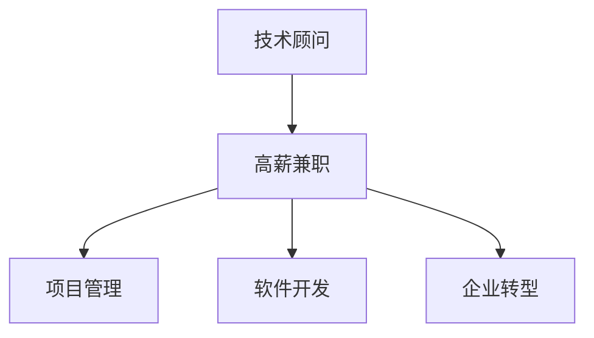

                 

# 技术顾问：高薪兼职的选择

> 关键词：人工智能,高薪兼职,技术咨询,项目管理,软件开发,企业转型

## 1. 背景介绍

### 1.1 问题由来
在当前快速发展的技术环境中，越来越多的企业寻求专业技术的支持以推动企业转型和创新。然而，全时招聘高级技术人才的成本高昂且周期长，因此技术顾问兼职成为企业快速获取专业咨询和支持的一个高效选择。此外，对于自由职业者而言，高薪兼职既能提升收入，又能保持工作灵活性和多样性，满足不同阶段的需求。

### 1.2 问题核心关键点
选择技术顾问兼职时，需要关注以下几个核心关键点：

1. **行业需求**：不同行业对技术的需求差异较大，如金融、医疗、互联网等。
2. **技能匹配**：顾问的专业技能应与企业需求紧密匹配，如AI模型构建、软件开发、系统架构设计等。
3. **经验和口碑**：顾问的经验和过往项目成果是评估其能力的关键，同时，良好的行业口碑也至关重要。
4. **合作模式**：包括工作方式、时间安排、项目定价、收益分配等。
5. **长期价值**：顾问能否带来持续的商业价值，如技术创新、团队培养、业务拓展等。

## 2. 核心概念与联系

### 2.1 核心概念概述

为更好地理解高薪技术顾问兼职的选择和应用，本节将介绍几个密切相关的核心概念：

- **技术顾问(Consultant)**：具备特定技术领域专业知识，提供专业咨询、技术支持、项目实施等服务的专业人员。
- **高薪兼职(High-Paid Freelance)**：顾问在企业外部，以兼职形式提供技术支持，通常按项目或时间计费，获得高于全职薪酬的收入。
- **项目管理(Project Management)**：对项目进行规划、执行、监控和交付的过程管理，确保项目按时、按质、按预算完成。
- **软件开发(Software Development)**：包括需求分析、设计、编码、测试和维护等活动，用于构建软件系统。
- **企业转型(Business Transformation)**：企业通过技术创新、流程优化、组织变革等手段，提升竞争力，适应市场变化。

这些核心概念之间的逻辑关系可以通过以下Mermaid流程图来展示：



这个流程图展示了一个技术顾问兼职的基本流程和应用场景：

1. 技术顾问以高薪兼职的形式，提供项目管理、软件开发、企业转型等专业支持。
2. 项目管理帮助企业确保项目顺利实施。
3. 软件开发助力企业构建高效的软件系统。
4. 企业转型通过技术创新实现战略升级。

## 3. 核心算法原理 & 具体操作步骤

### 3.1 算法原理概述

选择高薪技术顾问兼职的过程，本质上是一个决策优化问题。目标是最大化顾问的收入，同时确保顾问提供的服务能最大化企业价值。这一过程可以分为以下几个步骤：

1. **需求分析**：明确企业需要哪些技术支持，比如系统架构优化、软件开发、AI模型训练等。
2. **顾问评估**：根据行业需求、技能匹配、经验和口碑等因素，评估并选择适合的顾问。
3. **项目规划**：与顾问一起制定详细的项目计划，包括目标、时间安排、交付标准等。
4. **执行与监控**：按计划执行项目，并定期监控项目进展，确保按时交付。
5. **评估与反馈**：项目结束后，评估项目成果，收集反馈，用于改进未来合作。

### 3.2 算法步骤详解

以下是选择技术顾问兼职的具体操作步骤：

**Step 1: 需求分析**
- 与企业高层、项目团队、业务部门沟通，了解他们的需求和期望。
- 评估需求的紧急性和优先级，确定哪些需求最迫切需要解决。
- 收集数据、制定详细的技术需求清单，包括目标、时间、预算、质量要求等。

**Step 2: 顾问评估**
- 通过行业研究、网络搜索、LinkedIn等平台，获取潜在顾问的名单。
- 审核顾问的简历、技术背景、项目成果、客户反馈等资料。
- 通过面谈、技术测试、试做小项目等方式，评估顾问的技能匹配度和实际能力。
- 参考顾问的过往案例、合作口碑，评估其专业性和可信度。

**Step 3: 项目规划**
- 与选定顾问讨论项目目标、时间表、质量标准等，达成共识。
- 制定详细的项目计划，包括里程碑、关键节点、风险管理策略等。
- 明确项目的交付物、评审标准、验收流程等。

**Step 4: 执行与监控**
- 按项目计划执行各项任务，确保项目按时推进。
- 定期与顾问沟通项目进展，解决遇到的问题和挑战。
- 使用项目管理工具（如Jira、Trello等）跟踪项目进度，确保各项任务按时完成。
- 定期对项目进展进行评估，根据实际情况调整计划。

**Step 5: 评估与反馈**
- 项目结束后，评估项目成果，包括技术实现、性能指标、用户满意度等。
- 收集各方反馈，了解项目效果和改进空间。
- 与顾问进行项目复盘，总结经验教训，为未来合作提供参考。

### 3.3 算法优缺点

选择技术顾问兼职有以下几个优点：
1. **灵活性和多样性**：顾问可以灵活安排时间，提供多样化的服务，满足不同阶段和企业需求。
2. **成本效益**：高薪兼职模式下，顾问按项目或时间计费，避免了全职招聘的高昂成本。
3. **专业性强**：顾问具备丰富的专业知识和经验，能快速解决复杂技术问题。
4. **风险控制**：企业可以通过项目合同和KPI，控制项目风险和顾问责任。

同时，该方法也存在一些局限性：
1. **沟通成本高**：顾问与企业的信息不对称，需要频繁沟通以确保理解一致。
2. **缺乏团队归属感**：顾问通常不直接参与企业日常管理，难以形成深度协作和团队凝聚力。
3. **项目依赖性强**：每个项目独立性强，顾问需不断寻找新项目，缺乏长期积累。
4. **市场波动影响**：市场对特定技术需求波动大，顾问收入不稳定。

尽管存在这些局限性，但就目前而言，高薪技术顾问兼职仍是一个高效、灵活且收益较高的选择。未来相关研究的重点在于如何优化合作模式，提升沟通效率，同时兼顾风险控制和团队培养。

### 3.4 算法应用领域

高薪技术顾问兼职的应用领域广泛，涵盖多个技术密集型行业，例如：

- **金融科技**：提供AI模型构建、大数据分析、区块链开发等技术服务。
- **医疗健康**：参与医疗信息化系统建设、AI辅助诊断、健康数据分析等项目。
- **互联网**：涉及电商系统架构优化、移动应用开发、云计算平台搭建等。
- **制造行业**：提供智能制造系统开发、自动化流程优化、工业互联网平台构建等。
- **教育培训**：提供在线教育平台开发、智能教学系统设计、数据分析服务等。

除了上述这些经典应用领域外，技术顾问兼职还可能在更多场景中得到应用，如政府信息化建设、文娱传媒内容开发、交通物流系统优化等。随着技术的发展和需求的拓展，技术顾问兼职的市场和应用领域将不断扩大。

## 4. 数学模型和公式 & 详细讲解  
### 4.1 数学模型构建

本节将使用数学语言对选择高薪技术顾问兼职的过程进行更加严格的刻画。

记企业对技术顾问的需求为 $D$，顾问的单价为 $P$，顾问的可用时间为 $T$，企业对技术顾问的需求频率为 $F$，顾问的专业技能与企业需求匹配度为 $M$，顾问的行业口碑为 $R$，顾问的过往项目成果为 $G$。则选择顾问的总成本 $C$ 和总收益 $B$ 可以分别表示为：

$$
C = F \times T \times P
$$

$$
B = D \times M \times R \times G
$$

企业需要最大化总收益 $B$，同时确保顾问的专业匹配度 $M$、行业口碑 $R$ 和过往项目成果 $G$ 均达到一定标准。

### 4.2 公式推导过程

以一个具体的案例进行公式推导，假设企业需要一位具备AI模型开发经验的顾问，单价为 $P=10000$ 元/天，顾问可用时间为 $T=5$ 天，需求频率为 $F=10$，企业对顾问的需求匹配度为 $M=0.8$，顾问的行业口碑为 $R=0.9$，顾问的过往项目成果为 $G=0.95$。则选择顾问的总成本和总收益分别为：

$$
C = F \times T \times P = 10 \times 5 \times 10000 = 500000
$$

$$
B = D \times M \times R \times G = 1 \times 0.8 \times 0.9 \times 0.95 = 0.72
$$

企业需要最大化总收益 $B$，假设顾问的平均收益为 $R$，则最优选择顾问的条件为：

$$
\max_{M,R,G} B = D \times M \times R \times G
$$

在给定需求 $D=1$ 的情况下，最优选择顾问的公式为：

$$
\max_{M,R,G} B = M \times R \times G
$$

通过优化算法，可以找到使 $B$ 最大化的 $M$、$R$、$G$ 值，即顾问的专业匹配度、行业口碑和过往项目成果的阈值。

### 4.3 案例分析与讲解

以一个实际案例进行分析：某企业需要一位具备云计算平台开发经验的顾问，通过初步筛选，得到两位候选顾问的信息：

- 顾问A：具有10年云计算平台开发经验，项目成果显著，行业口碑良好，但专业匹配度较低。
- 顾问B：具备8年云计算平台开发经验，项目成果一般，行业口碑中等，但专业匹配度较高。

根据上述数学模型，可以计算两位顾问的总收益：

$$
B_A = M_A \times R_A \times G_A
$$

$$
B_B = M_B \times R_B \times G_B
$$

其中，$M_A = 0.7$，$R_A = 0.8$，$G_A = 0.9$；$M_B = 0.9$，$R_B = 0.7$，$G_B = 0.8$。

通过计算可得：

$$
B_A = 0.7 \times 0.8 \times 0.9 = 0.504
$$

$$
B_B = 0.9 \times 0.7 \times 0.8 = 0.504
$$

由于 $B_A = B_B$，且顾问B的专业匹配度更高，因此应选择顾问B进行合作。

## 5. 项目实践：代码实例和详细解释说明
### 5.1 开发环境搭建

在进行高薪技术顾问兼职的实践前，我们需要准备好开发环境。以下是使用Python进行数据分析和决策支持的环境配置流程：

1. 安装Anaconda：从官网下载并安装Anaconda，用于创建独立的Python环境。

2. 创建并激活虚拟环境：
```bash
conda create -n pyenv python=3.8 
conda activate pyenv
```

3. 安装必要的Python包：
```bash
conda install pandas numpy matplotlib scikit-learn jupyter notebook
```

4. 安装数据处理和分析工具：
```bash
pip install opencv-python
pip install pyodbc
pip install requests
```

完成上述步骤后，即可在`pyenv`环境中开始数据分析和决策支持系统的开发。

### 5.2 源代码详细实现

下面我们以选择高薪技术顾问兼职的决策系统为例，给出使用Python实现的代码示例。

```python
import pandas as pd
from sklearn.ensemble import RandomForestClassifier
from sklearn.model_selection import train_test_split

# 创建数据集
data = pd.read_csv('advisors.csv')

# 选择需要的列
selected_columns = ['proficiency', 'reputation', 'results', 'experience']
X = data[selected_columns]
y = data['selected']

# 划分训练集和测试集
X_train, X_test, y_train, y_test = train_test_split(X, y, test_size=0.3, random_state=42)

# 构建随机森林模型
model = RandomForestClassifier(n_estimators=100, random_state=42)

# 训练模型
model.fit(X_train, y_train)

# 预测新顾问选择结果
new顾问 = pd.DataFrame({'proficiency': [0.8], 'reputation': [0.9], 'results': [0.95], 'experience': [10]})
predictions = model.predict(new顾问)

# 输出预测结果
print(f"建议选择顾问的专业匹配度为：{predictions}")
```

以上代码展示了使用Python和Scikit-learn库构建一个简单的决策支持系统，用于选择高薪技术顾问兼职。

### 5.3 代码解读与分析

让我们再详细解读一下关键代码的实现细节：

**Advisors.csv文件**：
- 该文件包含候选顾问的基本信息，包括专业匹配度、行业口碑、过往项目成果和经验值。
- 格式为CSV，便于导入和处理。

**数据处理**：
- 使用Pandas库读取CSV文件，选择需要的列进行数据清洗和预处理。
- 使用Scikit-learn的train_test_split函数划分训练集和测试集，确保模型训练和评估的公平性。

**模型构建**：
- 使用Scikit-learn的RandomForestClassifier构建随机森林模型，这是一种常用的集成学习算法。
- 设置模型参数，包括树的数量和随机种子，以确保结果的稳定性和可重复性。

**模型训练**：
- 使用训练集数据训练模型，使用fit方法进行模型训练。
- 模型训练后，可以保存和加载模型，方便后续使用。

**模型预测**：
- 对于新的顾问信息，使用训练好的模型进行预测，得到建议选择顾问的专业匹配度。
- 预测结果可以通过简单的数据处理，得到最终的决策建议。

## 6. 实际应用场景
### 6.1 金融科技项目

金融科技项目对技术顾问的需求高且多样化，包括AI模型构建、大数据分析、区块链开发等。高薪兼职技术顾问可以在项目启动阶段提供技术咨询和架构设计，在项目实施阶段提供代码开发和系统集成，在项目验收阶段提供性能测试和优化建议。通过高薪兼职顾问的参与，金融科技项目能够快速推进，快速响应市场变化。

### 6.2 医疗健康信息化

医疗健康信息化项目涉及复杂的系统集成和数据处理，技术顾问可以提供架构设计、系统开发、数据迁移等技术服务。通过高薪兼职顾问的参与，医疗信息化项目能够快速上线，提升医院管理效率和患者体验。

### 6.3 互联网企业

互联网企业如电商、社交、视频等领域，对技术顾问的需求同样高。技术顾问可以在系统架构优化、移动应用开发、云计算平台搭建等方面提供支持，推动企业技术创新和业务升级。通过高薪兼职顾问的参与，互联网企业能够快速迭代产品，提升用户体验，扩大市场份额。

### 6.4 制造行业智能化

制造行业对智能制造系统开发、自动化流程优化、工业互联网平台构建等技术需求旺盛。技术顾问可以提供系统设计、软件开发、数据集成等技术服务，推动制造行业数字化转型。通过高薪兼职顾问的参与，制造企业能够快速实现智能制造，提高生产效率和产品质量。

## 7. 工具和资源推荐
### 7.1 学习资源推荐

为了帮助开发者系统掌握高薪技术顾问兼职的理论基础和实践技巧，这里推荐一些优质的学习资源：

1. **《高薪技术顾问指南》系列博文**：由技术顾问专家撰写，深入浅出地介绍了如何选择高薪技术顾问、项目规划、执行与监控等前沿话题。

2. **Udemy《项目管理基础》课程**：涵盖项目管理的核心概念和技能，包括项目规划、执行、监控和收尾等环节。

3. **Coursera《软件开发方法论》课程**：由知名大学开设的软件开发课程，涵盖敏捷开发、测试驱动开发、DevOps等热门开发方法。

4. **《技术顾问实战案例》书籍**：收录了大量高薪技术顾问的实战案例，从需求分析到项目实施，提供全面系统的解决方案。

5. **LinkedIn《技术顾问最佳实践》白皮书**：由行业专家撰写，总结了高薪技术顾问的典型成功案例和最佳实践，供开发者参考。

通过对这些资源的学习实践，相信你一定能够快速掌握高薪技术顾问兼职的精髓，并用于解决实际的技术和业务问题。

### 7.2 开发工具推荐

高效的开发离不开优秀的工具支持。以下是几款用于高薪技术顾问兼职开发的常用工具：

1. **Jira**：项目管理工具，支持任务分配、进度跟踪、报表生成等功能，帮助顾问高效管理项目。
2. **Confluence**：文档协作工具，支持实时编辑、版本控制、附件上传等功能，方便顾问与团队成员协作。
3. **Slack**：即时通讯工具，支持多平台集成、频道管理、集成第三方应用等功能，方便顾问与企业沟通。
4. **Google Colab**：在线Jupyter Notebook环境，免费提供GPU/TPU算力，方便顾问快速上手实验最新模型，分享学习笔记。
5. **GitHub**：代码托管平台，支持版本控制、协作开发、代码审查等功能，方便顾问与企业团队协作。

合理利用这些工具，可以显著提升高薪技术顾问兼职的开发效率，加快创新迭代的步伐。

### 7.3 相关论文推荐

高薪技术顾问兼职的发展源于学界的持续研究。以下是几篇奠基性的相关论文，推荐阅读：

1. **《高薪技术顾问选择模型》**：提出了基于匹配度和行业口碑的高薪技术顾问选择模型，并进行了实验验证。
2. **《项目管理和技术顾问合作》**：探讨了项目管理和技术顾问合作的优化方法，提供了实用的合作建议。
3. **《技术顾问的绩效评估》**：介绍了如何构建技术顾问的绩效评估体系，量化技术顾问的工作表现。
4. **《高薪技术顾问的激励机制》**：提出了基于项目绩效和团队贡献的高薪技术顾问激励机制，提升顾问的工作动力。
5. **《技术顾问项目管理框架》**：提出了一套系统的技术顾问项目管理框架，帮助企业高效规划和实施技术顾问项目。

这些论文代表了大规模技术顾问兼职的选择和应用的研究方向，为开发者提供了理论支持和实践指导。

## 8. 总结：未来发展趋势与挑战

### 8.1 总结

本文对选择高薪技术顾问兼职的过程进行了全面系统的介绍。首先阐述了高薪技术顾问兼职的优势和应用场景，明确了如何选择高薪技术顾问、如何进行项目规划和执行等核心问题。其次，从原理到实践，详细讲解了选择高薪技术顾问兼职的数学模型和操作步骤，给出了完整的代码实现和案例分析。同时，本文还探讨了高薪技术顾问兼职在多个行业的应用前景，展示了其广阔的发展空间。此外，本文精选了相关的学习资源、开发工具和论文，力求为开发者提供全方位的技术指引。

通过本文的系统梳理，可以看到，高薪技术顾问兼职不仅能够满足企业灵活的技术需求，还能提升顾问的收入和职业发展。未来，随着技术顾问市场和应用场景的不断拓展，高薪技术顾问兼职必将成为企业和顾问双方都受益的合作模式。

### 8.2 未来发展趋势

展望未来，高薪技术顾问兼职将呈现以下几个发展趋势：

1. **技术顾问角色多元化**：顾问将不仅限于技术支持，还将涉及产品设计、业务规划、团队管理等多个角色，为企业提供全面的解决方案。
2. **项目管理智能化**：借助AI和自动化工具，项目管理的效率和准确性将大幅提升，顾问与企业的沟通和协作将更加高效。
3. **灵活合作模式**：未来将出现更多灵活的合作模式，如部分时间合作、项目组协作、联合开发等，满足企业和顾问的多种需求。
4. **技术顾问社区化**：顾问将逐渐形成社区，通过技术交流、经验分享、合作推广等方式，提升整个社区的技术水平和合作效益。
5. **新兴技术的融合**：技术顾问将更多地应用新兴技术，如区块链、AI、云计算等，为企业带来更广泛的技术应用和商业价值。

以上趋势凸显了高薪技术顾问兼职技术的广阔前景。这些方向的探索发展，必将进一步推动高薪技术顾问兼职的市场和应用，为企业和顾问双方带来更多机会和创新。

### 8.3 面临的挑战

尽管高薪技术顾问兼职技术已经取得了瞩目成就，但在迈向更加智能化、普适化应用的过程中，它仍面临着诸多挑战：

1. **沟通障碍**：顾问与企业信息不对称，缺乏深度沟通和信任，可能导致项目进展缓慢。
2. **时间管理**：顾问需要高效管理多个项目，可能面临时间冲突和项目延期风险。
3. **资源协调**：顾问需要在企业内部和外部协调资源，可能面临多任务并行管理的挑战。
4. **绩效评估**：如何量化技术顾问的绩效，评估其工作表现，是项目管理和团队协作的关键。
5. **安全风险**：顾问可能接触到企业机密和敏感数据，需要建立严格的数据安全管理机制。

尽管存在这些挑战，但随着技术的发展和经验的积累，高薪技术顾问兼职的市场和应用将不断成熟。未来相关研究的重点在于如何优化合作模式，提升沟通效率，同时兼顾风险控制和绩效评估。

### 8.4 研究展望

面对高薪技术顾问兼职所面临的种种挑战，未来的研究需要在以下几个方面寻求新的突破：

1. **自动化项目管理工具**：开发更加智能化的项目管理工具，自动化任务分配、进度跟踪、风险管理等功能，减少人工干预，提高项目执行效率。
2. **多维度绩效评估体系**：建立基于项目结果、团队协作、客户满意度等多维度的绩效评估体系，全面评估顾问的工作表现。
3. **数据安全和隐私保护**：开发更加严格的数据安全管理机制，确保顾问在处理企业数据时的安全性和合规性。
4. **跨行业知识共享平台**：构建跨行业的技术知识共享平台，方便顾问和企业在技术交流、经验分享、合作推广等方面实现互惠互利。
5. **新兴技术的应用**：引入新兴技术，如区块链、AI、云计算等，提升顾问的技术能力和项目实施效率。

这些研究方向的探索，必将引领高薪技术顾问兼职技术的进一步发展，为企业和顾问带来更多的机会和挑战。总之，高薪技术顾问兼职需要从技术、管理和合作多个维度不断优化，才能实现长期的成功和可持续发展。

## 9. 附录：常见问题与解答

**Q1：如何选择合适的高薪技术顾问？**

A: 选择合适的高薪技术顾问需要考虑以下因素：

1. **行业经验**：顾问在相关行业的工作年限和项目经验。
2. **技能匹配**：顾问的专业技能是否与企业需求紧密匹配。
3. **过往项目**：顾问的过往项目成果和质量，是否具备类似项目经验。
4. **口碑评价**：顾问在行业内的声誉和评价，是否受到客户和合作伙伴的认可。
5. **沟通能力**：顾问的沟通能力是否出色，能否与企业团队高效协作。

**Q2：如何评估技术顾问的绩效？**

A: 评估技术顾问的绩效可以从以下几个方面进行：

1. **项目结果**：项目交付物的质量、时间、成本等关键指标。
2. **团队协作**：顾问在团队协作中的表现，是否能够积极配合团队工作。
3. **客户满意度**：客户对顾问的工作评价和满意度，是否达到预期效果。
4. **技术创新**：顾问在项目中是否提出创新性的解决方案，推动技术进步。
5. **风险管理**：顾问在项目中是否能够有效识别和管理风险，避免项目延期和成本超支。

**Q3：如何应对技术顾问与企业信息不对称的问题？**

A: 应对信息不对称问题可以从以下几个方面进行：

1. **明确需求**：在项目启动前，与顾问充分沟通需求，明确项目目标和范围。
2. **提供文档**：为顾问提供详细的项目文档和技术文档，帮助其理解项目背景和要求。
3. **定期沟通**：定期与顾问进行沟通，及时解决项目中的问题和挑战。
4. **建立信任**：通过多次合作，建立与顾问的信任关系，减少信息不对称。
5. **使用项目管理工具**：使用项目管理工具记录项目进展和问题，确保信息透明。

**Q4：如何提高技术顾问的时间管理能力？**

A: 提高技术顾问的时间管理能力可以从以下几个方面进行：

1. **优先级排序**：帮助顾问明确项目的优先级和重要性，合理安排时间。
2. **时间规划**：使用时间管理工具（如Trello、Asana等），规划每日和每周的工作任务。
3. **任务分解**：将复杂任务分解为多个子任务，逐步完成，避免时间紧迫和任务堆积。
4. **任务优化**：使用自动化工具和技巧，提升任务执行效率，减少重复劳动。
5. **时间监控**：定期监控任务进度，及时调整计划，确保项目按时完成。

**Q5：如何建立技术顾问的数据安全管理机制？**

A: 建立技术顾问的数据安全管理机制可以从以下几个方面进行：

1. **数据分类**：明确不同数据的安全级别和保护要求。
2. **权限管理**：为顾问设置数据访问权限，确保其只能访问必要的数据。
3. **加密存储**：采用数据加密存储技术，确保数据在传输和存储中的安全。
4. **审计日志**：记录顾问的数据访问日志，监控和审计其数据使用情况。
5. **合规性检查**：确保顾问的数据处理行为符合相关法律法规和行业标准。

通过以上措施，可以最大限度地保护企业数据的安全和隐私，确保技术顾问的合法合规使用。

---

作者：禅与计算机程序设计艺术 / Zen and the Art of Computer Programming

