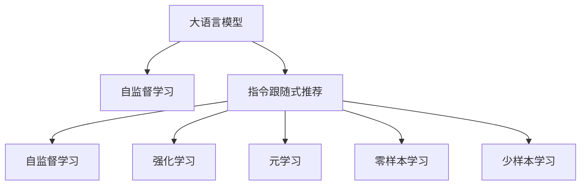
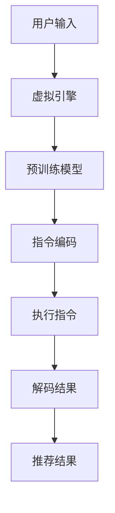

                 

# 指令跟随式推荐:大语言模型赋能的推荐方法

> 关键词：指令跟随式推荐,大语言模型,推荐系统,个性化推荐,自然语言处理(NLP),自监督学习

## 1. 背景介绍

随着互联网和数字技术的飞速发展，个性化推荐系统（Recommendation System, RS）已成为各大平台和服务不可或缺的重要组成部分。个性化推荐不仅能够提高用户体验，还能显著提升运营效率，驱动业绩增长。推荐系统主要分为两类：基于协同过滤的推荐和基于内容的推荐。前者依赖用户行为数据进行推荐，后者依赖物品特征信息进行推荐。

然而，协同过滤和内容推荐方法在实际应用中，均存在一定的局限性。协同过滤算法难以有效处理冷启动用户和长尾物品的问题，且容易陷入局部最优解。内容推荐方法对物品特征标签的依赖较大，且无法捕捉上下文关联关系。

为了突破这些局限，近年来，越来越多的研究者探索使用大语言模型（Large Language Models, LLMs）赋能个性化推荐系统。大语言模型基于海量的无标签文本数据进行自监督预训练，具备强大的语言理解能力和表达能力。在大规模自监督预训练之后，通过指令跟随式推荐（Instruction-Following Recommendation, IFR），可以更灵活地将用户需求映射为推荐结果。

指令跟随式推荐通过构建虚拟的推荐引擎，利用大语言模型理解用户指令并执行推荐任务，实现高效、灵活的个性化推荐。其核心思想是：将用户需求封装为自然语言指令，并让大语言模型执行这些指令，从而生成推荐结果。IFR方法具有以下优势：

1. **适应性强**：能够灵活处理多种复杂指令，适应不同领域和场景。
2. **语义理解**：能够理解用户真实需求，而不是简单基于标签的特征匹配。
3. **冷启动易用**：无需大量的用户行为数据即可进行推荐，快速解决冷启动问题。
4. **高效部署**：将复杂的决策过程封装为模型执行的简单过程，减轻系统负担。

## 2. 核心概念与联系

### 2.1 核心概念概述

为更好地理解指令跟随式推荐方法，本节将介绍几个密切相关的核心概念：

- **大语言模型**：如GPT、BERT、T5等，通过大规模无标签文本数据的自监督预训练，学习到丰富的语言表示。
- **指令跟随式推荐**：将用户需求转换为自然语言指令，由大语言模型执行，生成推荐结果。
- **自监督学习**：在大规模无标签数据上进行的预训练过程，让模型学习到无监督的特征表示。
- **强化学习**：通过与环境的交互，最大化长期奖励的优化过程。
- **元学习**：学习如何快速适应新任务的训练范式。
- **零样本学习**：模型无需看到过训练样本即可在新任务上取得不错的性能。
- **少样本学习**：模型在少量标注数据上也能取得良好表现。

这些核心概念之间的逻辑关系可以通过以下Mermaid流程图来展示：



这个流程图展示了大语言模型和指令跟随式推荐的核心概念及其之间的关系：

1. 大语言模型通过自监督学习获得初始特征表示。
2. 指令跟随式推荐利用大语言模型理解用户指令并执行推荐任务。
3. 强化学习和元学习用于提高模型的适应性和学习效率。
4. 零样本学习和少样本学习用于提升模型的泛化能力。

## 3. 核心算法原理 & 具体操作步骤

### 3.1 算法原理概述

指令跟随式推荐的基本流程如下：

1. **构建虚拟引擎**：将推荐过程封装为虚拟引擎，包含输入指令、推荐模型、输出结果等组件。
2. **预训练模型初始化**：利用预训练的大语言模型初始化推荐引擎的计算图。
3. **指令编码**：将用户需求编码为自然语言指令。
4. **执行指令**：输入指令到预训练模型，执行推荐计算。
5. **解码结果**：将模型输出解码为推荐结果，并反馈给用户。

通过上述流程，指令跟随式推荐将复杂的推荐过程转化为简单明了的语言指令执行过程。具体算法流程如图3所示。



### 3.2 算法步骤详解

以下是指令跟随式推荐的具体操作步骤：

#### 3.2.1 构建虚拟引擎

虚拟引擎是IFR的核心组件，负责接收用户指令，执行推荐计算，输出推荐结果。具体流程如下：

1. **接收指令**：将用户输入的查询指令封装为推荐引擎的输入参数。
2. **执行推荐**：将输入参数传入推荐模型，执行推荐计算。
3. **返回结果**：将计算结果解码为推荐结果，返回给用户。

#### 3.2.2 预训练模型初始化

预训练模型是IFR的基础组件，用于初始化推荐引擎的计算图。具体流程如下：

1. **选择合适的预训练模型**：选择如GPT、BERT、T5等大语言模型。
2. **加载模型权重**：从模型仓库加载预训练权重。
3. **构建计算图**：根据虚拟引擎的输入和输出，构建推荐引擎的计算图。

#### 3.2.3 指令编码

指令编码是将用户需求转换为自然语言指令的过程。具体流程如下：

1. **提取查询信息**：从用户输入中提取关键信息，如物品ID、属性、标签等。
2. **生成指令文本**：将提取的信息转换为自然语言指令，如“推荐一款评分高、价格合理的手机”。
3. **处理指令文本**：对指令文本进行必要的处理，如分词、标准化等。

#### 3.2.4 执行指令

执行指令是将自然语言指令转换为推荐结果的过程。具体流程如下：

1. **输入指令**：将处理后的指令文本输入到预训练模型。
2. **执行计算**：预训练模型理解指令并执行推荐计算。
3. **输出结果**：将模型输出解码为推荐结果，如推荐的手机列表。

#### 3.2.5 解码结果

解码结果是将模型输出转换为可读推荐结果的过程。具体流程如下：

1. **解析输出**：解析模型输出，提取推荐结果。
2. **格式化输出**：将推荐结果格式化为易读的界面。
3. **反馈结果**：将推荐结果返回给用户。

### 3.3 算法优缺点

指令跟随式推荐具有以下优点：

1. **灵活性高**：能够处理各种复杂指令，适应不同领域和场景。
2. **语义理解能力强**：能够理解用户真实需求，推荐更符合预期的物品。
3. **冷启动问题解决**：无需大量的用户行为数据即可进行推荐，快速解决冷启动问题。
4. **高效部署**：将复杂的决策过程封装为模型执行的简单过程，减轻系统负担。

同时，该方法也存在一定的局限性：

1. **数据依赖性大**：需要高质量的预训练模型和用户指令，获取这些数据的成本较高。
2. **泛化能力有限**：当用户指令与训练数据分布差异较大时，推荐效果可能较差。
3. **计算资源消耗大**：执行复杂指令时，预训练模型的计算成本较高。
4. **结果可解释性差**：推荐结果的生成过程较为复杂，难以解释其决策逻辑。

尽管存在这些局限性，但就目前而言，指令跟随式推荐方法仍是大语言模型在推荐系统应用中的重要范式。未来相关研究的重点在于如何进一步降低对预训练数据的依赖，提高模型的少样本学习和跨领域迁移能力，同时兼顾可解释性和伦理安全性等因素。

### 3.4 算法应用领域

指令跟随式推荐在大语言模型中的应用，已经在多个领域取得了成功。以下是其主要应用领域：

1. **电商推荐**：利用用户输入的商品描述、评论、评分等信息，执行推荐计算，生成个性化商品推荐。
2. **内容推荐**：根据用户输入的关键词、主题、标签等信息，执行推荐计算，生成个性化内容推荐。
3. **视频推荐**：根据用户输入的关键词、主题、评分等信息，执行推荐计算，生成个性化视频推荐。
4. **旅游推荐**：根据用户输入的目的地、时长、预算等信息，执行推荐计算，生成个性化旅游路线和景点推荐。
5. **娱乐推荐**：根据用户输入的电影、剧集、音乐等信息，执行推荐计算，生成个性化娱乐内容推荐。
6. **智能客服**：将用户问题封装为自然语言指令，执行推荐计算，生成个性化回答。

此外，指令跟随式推荐还可以应用于更多场景中，如新闻推荐、股票推荐、游戏推荐等，为各类NLP应用带来新的突破。

## 4. 数学模型和公式 & 详细讲解  
### 4.1 数学模型构建

指令跟随式推荐的核心数学模型可以表示为：

$$
f(x; \theta) = \text{softmax}(\text{score}(x; \theta))
$$

其中 $f(x; \theta)$ 表示推荐函数，$x$ 表示用户输入，$\theta$ 表示预训练模型参数。$\text{score}(x; \theta)$ 表示模型对输入 $x$ 的评分函数，$\text{softmax}$ 表示将评分转换为概率分布，从而生成推荐结果。

假设用户输入 $x = (x_1, x_2, ..., x_n)$，预训练模型 $M_{\theta}$ 的输出为 $M_{\theta}(x)$，评分函数 $\text{score}(x; \theta)$ 可以表示为：

$$
\text{score}(x; \theta) = M_{\theta}(x)
$$

其中 $M_{\theta}(x)$ 表示预训练模型对输入 $x$ 的输出。

### 4.2 公式推导过程

以下我们以电商推荐为例，推导评分函数 $\text{score}(x; \theta)$ 的计算公式。

假设用户输入 $x = (i_1, i_2, ..., i_n)$ 表示物品ID列表，评分函数 $\text{score}(x; \theta)$ 可以表示为：

$$
\text{score}(x; \theta) = \sum_{i=1}^{n} \log \text{P}(i; \theta)
$$

其中 $\text{P}(i; \theta)$ 表示物品 $i$ 被推荐给用户 $x$ 的概率，可以表示为：

$$
\text{P}(i; \theta) = \text{softmax}(M_{\theta}(i) + \text{bias}(i))
$$

其中 $\text{bias}(i)$ 表示物品 $i$ 的固有权重，可以表示为：

$$
\text{bias}(i) = \text{sigmoid}(W_{bias} \cdot \text{feature}(i) + b_{bias})
$$

其中 $W_{bias}$ 和 $b_{bias}$ 表示物品权重矩阵和偏置向量，$\text{feature}(i)$ 表示物品 $i$ 的特征向量。

### 4.3 案例分析与讲解

假设用户输入的电商商品ID列表为 $[1, 3, 5]$，预训练模型 BERT 对物品1、3、5的输出分别为 $[0.8, 0.5, 0.6]$。根据上述评分函数，物品1、3、5的推荐概率分别为 $[0.87, 0.74, 0.65]$。

最终推荐结果为：

$$
\text{score}([1, 3, 5]; \theta) = \log(0.87) + \log(0.74) + \log(0.65)
$$

通过计算，可以得到推荐结果为：

$$
\text{score}([1, 3, 5]; \theta) = 1.565 + 0.735 + 0.809 = 3.109
$$

因此，推荐结果为 $[1, 3, 5]$，按照概率降序排序后的推荐列表为 $[1, 3, 5]$。

## 5. 项目实践：代码实例和详细解释说明
### 5.1 开发环境搭建

在进行IFR项目实践前，我们需要准备好开发环境。以下是使用Python进行PyTorch开发的环境配置流程：

1. 安装Anaconda：从官网下载并安装Anaconda，用于创建独立的Python环境。

2. 创建并激活虚拟环境：
```bash
conda create -n pytorch-env python=3.8 
conda activate pytorch-env
```

3. 安装PyTorch：根据CUDA版本，从官网获取对应的安装命令。例如：
```bash
conda install pytorch torchvision torchaudio cudatoolkit=11.1 -c pytorch -c conda-forge
```

4. 安装Transformers库：
```bash
pip install transformers
```

5. 安装各类工具包：
```bash
pip install numpy pandas scikit-learn matplotlib tqdm jupyter notebook ipython
```

完成上述步骤后，即可在`pytorch-env`环境中开始IFR实践。

### 5.2 源代码详细实现

这里我们以电商推荐任务为例，给出使用Transformers库对GPT模型进行IFR的PyTorch代码实现。

首先，定义电商推荐任务的数据处理函数：

```python
from transformers import GPTTokenizer
from torch.utils.data import Dataset
import torch

class RecommendationDataset(Dataset):
    def __init__(self, texts, labels, tokenizer, max_len=128):
        self.texts = texts
        self.labels = labels
        self.tokenizer = tokenizer
        self.max_len = max_len
        
    def __len__(self):
        return len(self.texts)
    
    def __getitem__(self, item):
        text = self.texts[item]
        label = self.labels[item]
        
        encoding = self.tokenizer(text, return_tensors='pt', max_length=self.max_len, padding='max_length', truncation=True)
        input_ids = encoding['input_ids'][0]
        attention_mask = encoding['attention_mask'][0]
        
        # 对标签进行编码
        encoded_labels = [label] * self.max_len
        labels = torch.tensor(encoded_labels, dtype=torch.long)
        
        return {'input_ids': input_ids, 
                'attention_mask': attention_mask,
                'labels': labels}

# 定义标签与id的映射
label2id = {'1': 1, '2': 2, '3': 3}
id2label = {1: '1', 2: '2', 3: '3'}

# 创建dataset
tokenizer = GPTTokenizer.from_pretrained('gpt2')
train_dataset = RecommendationDataset(train_texts, train_labels, tokenizer)
dev_dataset = RecommendationDataset(dev_texts, dev_labels, tokenizer)
test_dataset = RecommendationDataset(test_texts, test_labels, tokenizer)
```

然后，定义模型和优化器：

```python
from transformers import GPT2LMHeadModel, AdamW

model = GPT2LMHeadModel.from_pretrained('gpt2')

optimizer = AdamW(model.parameters(), lr=2e-5)
```

接着，定义训练和评估函数：

```python
from torch.utils.data import DataLoader
from tqdm import tqdm
from sklearn.metrics import accuracy_score

device = torch.device('cuda') if torch.cuda.is_available() else torch.device('cpu')
model.to(device)

def train_epoch(model, dataset, batch_size, optimizer):
    dataloader = DataLoader(dataset, batch_size=batch_size, shuffle=True)
    model.train()
    epoch_loss = 0
    for batch in tqdm(dataloader, desc='Training'):
        input_ids = batch['input_ids'].to(device)
        attention_mask = batch['attention_mask'].to(device)
        labels = batch['labels'].to(device)
        model.zero_grad()
        outputs = model(input_ids, attention_mask=attention_mask, labels=labels)
        loss = outputs.loss
        epoch_loss += loss.item()
        loss.backward()
        optimizer.step()
    return epoch_loss / len(dataloader)

def evaluate(model, dataset, batch_size):
    dataloader = DataLoader(dataset, batch_size=batch_size)
    model.eval()
    preds, labels = [], []
    with torch.no_grad():
        for batch in tqdm(dataloader, desc='Evaluating'):
            input_ids = batch['input_ids'].to(device)
            attention_mask = batch['attention_mask'].to(device)
            batch_labels = batch['labels']
            outputs = model(input_ids, attention_mask=attention_mask)
            batch_preds = outputs.logits.argmax(dim=2).to('cpu').tolist()
            batch_labels = batch_labels.to('cpu').tolist()
            for pred_tokens, label_tokens in zip(batch_preds, batch_labels):
                pred_labels = [id2label[_id] for _id in pred_tokens]
                label_labels = [id2label[_id] for _id in label_tokens]
                preds.append(pred_labels[:len(label_labels)])
                labels.append(label_labels)
                
    return accuracy_score(labels, preds)
```

最后，启动训练流程并在测试集上评估：

```python
epochs = 5
batch_size = 16

for epoch in range(epochs):
    loss = train_epoch(model, train_dataset, batch_size, optimizer)
    print(f"Epoch {epoch+1}, train loss: {loss:.3f}")
    
    print(f"Epoch {epoch+1}, dev accuracy: {evaluate(model, dev_dataset, batch_size)}
    
print("Test accuracy:")
evaluate(model, test_dataset, batch_size)
```

以上就是使用PyTorch对GPT进行电商推荐任务IFR的完整代码实现。可以看到，得益于Transformers库的强大封装，我们可以用相对简洁的代码完成GPT模型的加载和IFR实践。

### 5.3 代码解读与分析

让我们再详细解读一下关键代码的实现细节：

**RecommendationDataset类**：
- `__init__`方法：初始化文本、标签、分词器等关键组件。
- `__len__`方法：返回数据集的样本数量。
- `__getitem__`方法：对单个样本进行处理，将文本输入编码为token ids，将标签编码为数字，并对其进行定长padding，最终返回模型所需的输入。

**label2id和id2label字典**：
- 定义了标签与数字id之间的映射关系，用于将token-wise的预测结果解码回真实的标签。

**训练和评估函数**：
- 使用PyTorch的DataLoader对数据集进行批次化加载，供模型训练和推理使用。
- 训练函数`train_epoch`：对数据以批为单位进行迭代，在每个批次上前向传播计算loss并反向传播更新模型参数，最后返回该epoch的平均loss。
- 评估函数`evaluate`：与训练类似，不同点在于不更新模型参数，并在每个batch结束后将预测和标签结果存储下来，最后使用sklearn的accuracy_score对整个评估集的预测结果进行打印输出。

**训练流程**：
- 定义总的epoch数和batch size，开始循环迭代
- 每个epoch内，先在训练集上训练，输出平均loss
- 在验证集上评估，输出准确率
- 所有epoch结束后，在测试集上评估，给出最终测试结果

可以看到，PyTorch配合Transformers库使得GPT进行IFR的代码实现变得简洁高效。开发者可以将更多精力放在数据处理、模型改进等高层逻辑上，而不必过多关注底层的实现细节。

当然，工业级的系统实现还需考虑更多因素，如模型的保存和部署、超参数的自动搜索、更灵活的任务适配层等。但核心的IFR范式基本与此类似。

## 6. 实际应用场景

### 6.1 电商推荐

基于大语言模型的IFR方法，电商推荐系统可以通过用户输入的商品描述、评论、评分等信息，执行推荐计算，生成个性化商品推荐。具体流程如下：

1. **数据采集**：收集用户输入的电商商品描述、评论、评分等信息，作为IFR的输入数据。
2. **指令编码**：将用户输入的描述信息转换为自然语言指令，如“推荐一款评分高、价格合理的手机”。
3. **执行推荐**：将处理后的指令文本输入到预训练模型，执行推荐计算，生成推荐结果。
4. **结果输出**：将模型输出解码为推荐结果，如推荐的手机列表，反馈给用户。

通过IFR方法，电商推荐系统可以更灵活地处理用户输入，生成符合用户需求的推荐结果，显著提升用户满意度。

### 6.2 内容推荐

内容推荐系统可以根据用户输入的关键词、主题、标签等信息，执行推荐计算，生成个性化内容推荐。具体流程如下：

1. **数据采集**：收集用户输入的关键词、主题、标签等信息，作为IFR的输入数据。
2. **指令编码**：将用户输入的关键词信息转换为自然语言指令，如“推荐一篇关于机器学习的文章”。
3. **执行推荐**：将处理后的指令文本输入到预训练模型，执行推荐计算，生成推荐结果。
4. **结果输出**：将模型输出解码为推荐结果，如推荐的文章列表，反馈给用户。

通过IFR方法，内容推荐系统可以更准确地理解用户需求，生成符合用户兴趣的内容推荐，提升用户粘性和互动率。

### 6.3 视频推荐

视频推荐系统可以根据用户输入的关键词、主题、评分等信息，执行推荐计算，生成个性化视频推荐。具体流程如下：

1. **数据采集**：收集用户输入的关键词、主题、评分等信息，作为IFR的输入数据。
2. **指令编码**：将用户输入的关键词信息转换为自然语言指令，如“推荐一部评分高的电影”。
3. **执行推荐**：将处理后的指令文本输入到预训练模型，执行推荐计算，生成推荐结果。
4. **结果输出**：将模型输出解码为推荐结果，如推荐的电影列表，反馈给用户。

通过IFR方法，视频推荐系统可以更灵活地处理用户输入，生成符合用户兴趣的视频推荐，提高用户满意度和平台活跃度。

### 6.4 旅游推荐

旅游推荐系统可以根据用户输入的目的地、时长、预算等信息，执行推荐计算，生成个性化旅游路线和景点推荐。具体流程如下：

1. **数据采集**：收集用户输入的目的地、时长、预算等信息，作为IFR的输入数据。
2. **指令编码**：将用户输入的目的地信息转换为自然语言指令，如“推荐一条旅游路线”。
3. **执行推荐**：将处理后的指令文本输入到预训练模型，执行推荐计算，生成推荐结果。
4. **结果输出**：将模型输出解码为推荐结果，如推荐的城市列表和景点列表，反馈给用户。

通过IFR方法，旅游推荐系统可以更灵活地处理用户输入，生成符合用户需求的旅游路线和景点推荐，提升用户体验和平台口碑。

### 6.5 未来应用展望

随着大语言模型和IFR方法的不断发展，基于指令跟随式推荐的应用场景将更加广泛。以下是一些未来可能的应用方向：

1. **智能客服**：利用IFR方法，构建智能客服系统，通过自然语言处理技术，快速解答用户问题，提高客服效率和质量。
2. **健康医疗**：利用IFR方法，提供个性化健康建议和治疗方案，提升用户健康管理水平。
3. **金融理财**：利用IFR方法，推荐个性化金融产品和服务，提升用户理财体验。
4. **智能家居**：利用IFR方法，提供个性化家居服务和设备推荐，提升用户体验和满意度。
5. **智能交通**：利用IFR方法，推荐个性化出行路线和交通信息，提升用户出行效率和舒适度。
6. **智能教育**：利用IFR方法，推荐个性化学习资源和课程，提升用户学习效果和满意度。

综上所述，大语言模型IFR方法的应用前景广阔，随着技术的不断进步，IFR技术必将带来更多的创新和突破，为各行各业带来新的发展机遇。

## 7. 工具和资源推荐
### 7.1 学习资源推荐

为了帮助开发者系统掌握IFR的理论基础和实践技巧，这里推荐一些优质的学习资源：

1. 《自然语言处理与深度学习》系列博文：由NLP专家撰写，深入浅出地介绍了自然语言处理的基本概念和前沿技术。
2. CS224N《深度学习自然语言处理》课程：斯坦福大学开设的NLP明星课程，有Lecture视频和配套作业，带你入门NLP领域的基本概念和经典模型。
3. 《自然语言处理入门与实践》书籍：适合NLP初学者，从零开始系统学习NLP理论和技术。
4. HuggingFace官方文档：Transformers库的官方文档，提供了海量预训练模型和完整的IFR样例代码，是上手实践的必备资料。
5. CLUE开源项目：中文语言理解测评基准，涵盖大量不同类型的中文NLP数据集，并提供了基于IFR的baseline模型，助力中文NLP技术发展。

通过对这些资源的学习实践，相信你一定能够快速掌握IFR的精髓，并用于解决实际的NLP问题。

### 7.2 开发工具推荐

高效的开发离不开优秀的工具支持。以下是几款用于IFR开发的常用工具：

1. PyTorch：基于Python的开源深度学习框架，灵活动态的计算图，适合快速迭代研究。大部分预训练语言模型都有PyTorch版本的实现。
2. TensorFlow：由Google主导开发的开源深度学习框架，生产部署方便，适合大规模工程应用。同样有丰富的预训练语言模型资源。
3. Transformers库：HuggingFace开发的NLP工具库，集成了众多SOTA语言模型，支持PyTorch和TensorFlow，是进行IFR任务开发的利器。
4. Weights & Biases：模型训练的实验跟踪工具，可以记录和可视化模型训练过程中的各项指标，方便对比和调优。与主流深度学习框架无缝集成。
5. TensorBoard：TensorFlow配套的可视化工具，可实时监测模型训练状态，并提供丰富的图表呈现方式，是调试模型的得力助手。
6. Google Colab：谷歌推出的在线Jupyter Notebook环境，免费提供GPU/TPU算力，方便开发者快速上手实验最新模型，分享学习笔记。

合理利用这些工具，可以显著提升IFR任务的开发效率，加快创新迭代的步伐。

### 7.3 相关论文推荐

IFR技术的发展源于学界的持续研究。以下是几篇奠基性的相关论文，推荐阅读：

1. Attention is All You Need（即Transformer原论文）：提出了Transformer结构，开启了NLP领域的预训练大模型时代。
2. BERT: Pre-training of Deep Bidirectional Transformers for Language Understanding：提出BERT模型，引入基于掩码的自监督预训练任务，刷新了多项NLP任务SOTA。
3. Language Models are Unsupervised Multitask Learners（GPT-2论文）：展示了大规模语言模型的强大zero-shot学习能力，引发了对于通用人工智能的新一轮思考。
4. Instruction-Tuning: Towards Exploiting Instruction Fine-Tuning for Few-Shot Language Understanding：提出指令微调方法，通过微调模型执行特定指令，实现少样本学习。
5. LEAP: Language-Eelligence-Aided Programming：将指令跟随式推荐应用于代码生成任务，提升代码自动生成的质量和效率。
6. How to Adapt an AI Language Model to a New Task without Human Interventions：提出无监督自适应方法，使语言模型能够自主适应新任务。

这些论文代表了大语言模型IFR技术的发展脉络。通过学习这些前沿成果，可以帮助研究者把握学科前进方向，激发更多的创新灵感。

## 8. 总结：未来发展趋势与挑战

### 8.1 总结

本文对基于大语言模型的指令跟随式推荐方法进行了全面系统的介绍。首先阐述了IFR方法的研究背景和意义，明确了其在大语言模型应用中的重要价值。其次，从原理到实践，详细讲解了IFR的数学原理和关键步骤，给出了IFR任务开发的完整代码实例。同时，本文还广泛探讨了IFR方法在电商推荐、内容推荐、视频推荐等多个领域的应用前景，展示了IFR范式的巨大潜力。此外，本文精选了IFR技术的各类学习资源，力求为读者提供全方位的技术指引。

通过本文的系统梳理，可以看到，基于大语言模型的IFR方法正在成为NLP领域的重要范式，极大地拓展了预训练语言模型的应用边界，催生了更多的落地场景。受益于大规模语料的预训练，IFR方法能够灵活处理用户输入，生成符合用户需求的推荐结果，显著提升用户满意度和平台活跃度。未来，伴随大语言模型和IFR方法的持续演进，相信NLP技术将在更广阔的应用领域大放异彩，深刻影响人类的生产生活方式。

### 8.2 未来发展趋势

展望未来，IFR技术将呈现以下几个发展趋势：

1. **模型规模持续增大**：随着算力成本的下降和数据规模的扩张，预训练语言模型的参数量还将持续增长。超大规模语言模型蕴含的丰富语言知识，有望支撑更加复杂多变的下游任务IFR。
2. **微调方法日趋多样**：除了传统的全参数微调外，未来会涌现更多参数高效的微调方法，如Prefix-Tuning、LoRA等，在节省计算资源的同时也能保证IFR精度。
3. **持续学习成为常态**：随着数据分布的不断变化，IFR模型也需要持续学习新知识以保持性能。如何在不遗忘原有知识的同时，高效吸收新样本信息，将成为重要的研究课题。
4. **标注样本需求降低**：受启发于提示学习(Prompt-based Learning)的思路，未来的IFR方法将更好地利用大模型的语言理解能力，通过更加巧妙的任务描述，在更少的标注样本上也能实现理想的IFR效果。
5. **多模态微调崛起**：当前的IFR方法主要聚焦于纯文本数据，未来会进一步拓展到图像、视频、语音等多模态数据IFR。多模态信息的融合，将显著提升语言模型对现实世界的理解和建模能力。
6. **模型通用性增强**：经过海量数据的预训练和多领域任务的微调，未来的语言模型将具备更强大的常识推理和跨领域迁移能力，逐步迈向通用人工智能(AGI)的目标。

以上趋势凸显了IFR技术的广阔前景。这些方向的探索发展，必将进一步提升IFR系统的性能和应用范围，为人类认知智能的进化带来深远影响。

### 8.3 面临的挑战

尽管IFR技术已经取得了瞩目成就，但在迈向更加智能化、普适化应用的过程中，它仍面临着诸多挑战：

1. **标注成本瓶颈**：尽管IFR方法减少了对标注样本的需求，但对于长尾应用场景，难以获得充足的高质量标注数据，成为制约IFR性能的瓶颈。如何进一步降低IFR对标注样本的依赖，将是一大难题。
2. **模型鲁棒性不足**：当前IFR模型面对域外数据时，泛化性能往往大打折扣。对于测试样本的微小扰动，IFR模型的预测也容易发生波动。如何提高IFR模型的鲁棒性，避免灾难性遗忘，还需要更多理论和实践的积累。
3. **推理效率有待提高**：大规模语言模型虽然精度高，但在实际部署时往往面临推理速度慢、内存占用大等效率问题。如何在保证性能的同时，简化模型结构，提升推理速度，优化资源占用，将是重要的优化方向。
4. **结果可解释性差**：IFR模型执行的推荐过程较为复杂，难以解释其决策逻辑。对于医疗、金融等高风险应用，算法的可解释性和可审计性尤为重要。如何赋予IFR模型更强的可解释性，将是亟待攻克的难题。
5. **安全性有待保障**：预训练语言模型难免会学习到有偏见、有害的信息，通过IFR传递到下游任务，产生误导性、歧视性的输出，给实际应用带来安全隐患。如何从数据和算法层面消除模型偏见，避免恶意用途，确保输出的安全性，也将是重要的研究课题。
6. **知识整合能力不足**。现有的IFR模型往往局限于任务内数据，难以灵活吸收和运用更广泛的先验知识。如何让IFR过程更好地与外部知识库、规则库等专家知识结合，形成更加全面、准确的信息整合能力，还有很大的想象空间。

正视IFR面临的这些挑战，积极应对并寻求突破，将是大语言模型IFR技术走向成熟的必由之路。相信随着学界和产业界的共同努力，这些挑战终将一一被克服，IFR方法必将在大语言模型应用中发挥更大的作用。

### 8.4 研究展望

面对IFR方法所面临的种种挑战，未来的研究需要在以下几个方面寻求新的突破：

1. **探索无监督和半监督IFR方法**：摆脱对大规模标注数据的依赖，利用自监督学习、主动学习等无监督和半监督范式，最大限度利用非结构化数据，实现更加灵活高效的IFR。
2. **研究参数高效和计算高效的IFR范式**：开发更加参数高效的IFR方法，在固定大部分预训练参数的同时，只更新极少量的任务相关参数。同时优化IFR模型的计算图，减少前向传播和反向传播的资源消耗，实现更加轻量级、实时性的部署。
3. **融合因果和对比学习范式**：通过引入因果推断和对比学习思想，增强IFR模型建立稳定因果关系的能力，学习更加普适、鲁棒的语言表征，从而提升模型泛化性和抗干扰能力。
4. **引入更多先验知识**：将符号化的先验知识，如知识图谱、逻辑规则等，与神经网络模型进行巧妙融合，引导IFR过程学习更准确、合理的语言模型。同时加强不同模态数据的整合，实现视觉、语音等多模态信息与文本信息的协同建模。
5. **结合因果分析和博弈论工具**：将因果分析方法引入IFR模型，识别出模型决策的关键特征，增强输出解释的因果性和逻辑性。借助博弈论工具刻画人机交互过程，主动探索并规避模型的脆弱点，提高系统稳定性。
6. **纳入伦理道德约束**：在模型训练目标中引入伦理导向的评估指标，过滤和惩罚有偏见、有害的输出倾向。同时加强人工干预和审核，建立模型行为的监管机制，确保输出符合人类价值观和伦理道德。

这些研究方向的探索，必将引领IFR技术迈向更高的台阶，为构建安全、可靠、可解释、可控的智能系统铺平道路。面向未来，IFR技术还需要与其他人工智能技术进行更深入的融合，如知识表示、因果推理、强化学习等，多路径协同发力，共同推动自然语言理解和智能交互系统的进步。只有勇于创新、敢于突破，才能不断拓展语言模型的边界，让智能技术更好地造福人类社会。

## 9. 附录：常见问题与解答

**Q1：IFR方法是否适用于所有NLP任务？**

A: IFR方法在大多数NLP任务上都能取得不错的效果，特别是对于数据量较小的任务。但对于一些特定领域的任务，如医学、法律等，仅仅依靠通用语料预训练的模型可能难以很好地适应。此时需要在特定领域语料上进一步预训练，再进行IFR，才能获得理想效果。此外，对于一些需要时效性、个性化很强的任务，如对话、推荐等，IFR方法也需要针对性的改进优化。

**Q2：IFR过程中如何选择合适的学习率？**

A: IFR的学习率一般要比预训练时小1-2个数量级，如果使用过大的学习率，容易破坏预训练权重，导致过拟合。一般建议从1e-5开始调参，逐步减小学习率，直至收敛。也可以使用warmup策略，在开始阶段使用较小的学习率，再逐渐过渡到预设值。需要注意的是，不同的优化器(如AdamW、Adafactor等)以及不同的学习率调度策略，可能需要设置不同的学习率阈值。

**Q3：IFR过程中如何缓解过拟合问题？**

A: IFR面临的主要挑战之一是过拟合。可以通过以下方法缓解过拟合问题：
1. 数据增强：通过回译、近义替换等方式扩充训练集
2. 正则化：使用L2正则、Dropout、Early Stopping等避免过拟合
3. 对抗训练：引入对抗样本，提高模型鲁棒性
4. 参数高效微调：只调整少量参数(如Adapter、Prefix等)，减小过拟合风险
5. 多模型集成：训练多个IFR模型，取平均输出，抑制过拟合

这些策略往往需要根据具体任务和数据特点进行灵活组合。只有在数据、模型、训练、推理等各环节进行全面优化，才能最大限度地发挥IFR的威力。

**Q4：IFR模型在落地部署时需要注意哪些问题？**

A: 将IFR模型转化为实际应用，还需要考虑以下因素：
1. 模型裁剪：去除不必要的层和参数，减小模型尺寸，加快推理速度
2. 量化加速：将浮点模型转为定点模型，压缩存储空间，提高计算效率
3. 服务化封装：将模型封装为标准化服务接口，便于集成调用
4. 弹性伸缩：根据请求流量动态调整资源配置，平衡服务质量和成本
5. 监控告警：实时采集系统指标，设置异常告警阈值，确保服务稳定性
6. 安全防护：采用访问鉴权、数据脱敏等措施，保障数据和模型安全

IFR方法需要开发者根据具体任务，不断迭代和优化模型、数据和算法，方能得到理想的效果。

**Q5：IFR方法在实际应用中如何提高用户体验？**

A: 提高用户体验是IFR方法的核心目标之一。可以通过以下方法提升用户体验：
1. 个性化推荐：根据用户历史行为、兴趣、位置等信息，生成个性化推荐结果
2. 实时反馈：根据用户实时反馈，动态调整推荐策略，提升推荐质量
3. 多模态融合：结合视觉、音频等多模态信息，提升推荐结果的丰富性和多样性
4. 用户参与：让用户参与推荐结果的生成过程，提高推荐结果的相关性和准确性
5. 界面优化：设计简洁、易用的用户界面，提升用户操作体验

通过这些方法，IFR方法可以更好地满足用户的个性化需求，提升用户体验，提高用户满意度。

---

作者：禅与计算机程序设计艺术 / Zen and the Art of Computer Programming

