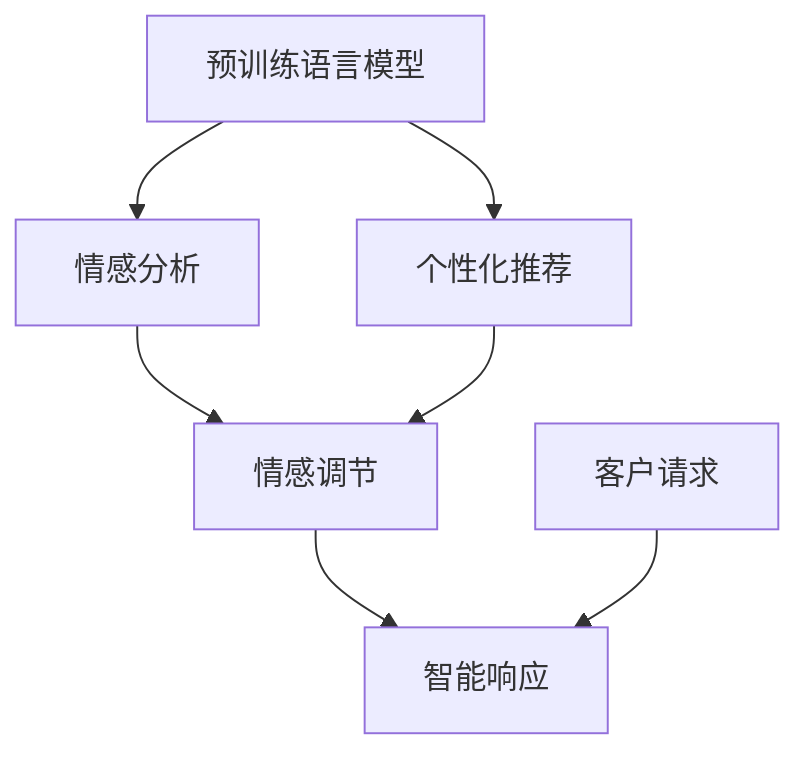

                 

# 探索基于大模型的电商智能客户服务情感调节系统

> 关键词：大模型,电商客户服务,情感分析,客户满意度,个性化推荐,客户体验,人工智能

## 1. 背景介绍

### 1.1 问题由来

随着电商行业的高速发展，如何提供优质的客户服务以提升用户体验，同时降低运营成本，成为各电商企业关注的热点问题。传统客服方式依赖人力，无法满足24小时全天候服务需求，响应速度慢且服务质量参差不齐。电商企业迫切需要一种高效、智能的客户服务解决方案。

近年来，基于人工智能的智能客服系统逐渐成为行业新的选择。智能客服系统通过自然语言处理(NLP)技术，能够自动理解客户提出的问题，并给出准确的回答。但即便如此，智能客服系统仍存在一些不足之处：

- 缺乏对客户情感的感知和调节能力，无法对客户情绪变化作出及时响应，导致服务体验不佳。
- 缺乏对客户个性化需求的理解，无法提供有针对性的服务和推荐。
- 需要大量的标注数据进行训练，数据获取成本较高。

针对上述问题，本项目提出了一种基于大模型的电商智能客户服务情感调节系统。该系统融合了情感分析、个性化推荐等前沿技术，能够自动识别客户情绪，并作出智能响应，极大提升客户服务质量和满意度。

## 2. 核心概念与联系

### 2.1 核心概念概述

本项目使用了Transformer模型作为预训练语言模型，并在微调过程中加入情感调节模块，以构建智能客户服务系统。以下对相关核心概念进行简要介绍：

- **Transformer模型**：一种基于自注意力机制的神经网络模型，能够有效处理序列数据，尤其适用于自然语言处理任务。
- **预训练语言模型**：在大规模无标签文本数据上进行训练，学习通用的语言表示。常用的预训练模型包括BERT、GPT等。
- **情感分析**：通过文本挖掘技术，自动识别客户在文本中的情感倾向，如正面、负面、中性等。
- **个性化推荐**：根据客户历史行为和偏好，提供有针对性的产品推荐。

这些核心概念之间存在紧密的联系。预训练语言模型为情感分析和个性化推荐提供了通用语言表示能力，情感分析则丰富了模型的情感语义理解，个性化推荐则在理解和响应客户需求方面增加了针对性。

### 2.2 核心概念原理和架构的 Mermaid 流程图



以上流程图展示了系统的基本架构：首先通过预训练语言模型提取文本特征，然后分别在情感分析和个性化推荐模块中进行细化，最后通过情感调节和智能响应模块生成最终的回复。

## 3. 核心算法原理 & 具体操作步骤

### 3.1 算法原理概述

本项目提出了基于大模型的情感调节智能客服系统，该系统融合了预训练语言模型、情感分析和个性化推荐三大模块，能够高效识别客户情绪，提供个性化服务，并实现智能响应。

### 3.2 算法步骤详解

#### 步骤1: 数据准备
- 收集电商平台的客户服务对话记录，进行标注，构建标注数据集。
- 使用预训练模型BERT对对话进行预训练，获得语言表示。

#### 步骤2: 情感分析模块
- 使用情感分析算法，如BERT、GPT等，在预训练语言模型的基础上进行微调，提取客户情感倾向。
- 将情感分析结果作为情感调节模块的输入，调节系统对客户情绪的响应策略。

#### 步骤3: 个性化推荐模块
- 根据客户历史行为和偏好，使用推荐算法，如协同过滤、深度学习等，进行个性化产品推荐。
- 将推荐结果作为智能响应的内容，提升客户服务质量。

#### 步骤4: 情感调节模块
- 根据情感分析结果，调整智能响应策略，对正面情绪采取友好回复，对负面情绪采取安慰或道歉策略。
- 动态调整个性化推荐内容，确保服务内容的情感色彩与客户情绪相匹配。

#### 步骤5: 智能响应模块
- 将情感调节结果和个性化推荐结果融合，生成最终的智能回复。
- 根据不同场景和任务，设计不同的响应策略，确保回复内容的多样性和准确性。

### 3.3 算法优缺点

#### 优点：
- 能够高效识别客户情绪，提供针对性和情感色彩的智能回复。
- 能够基于客户历史数据进行个性化推荐，提升用户体验。
- 利用预训练语言模型的通用语言表示能力，减少了标注数据的获取成本。

#### 缺点：
- 需要收集和标注大量的客户服务数据，数据获取和标注成本较高。
- 情感调节模块的准确性受情感分析结果的影响，情感分析模块的准确性需要进一步提高。
- 个性化推荐模块的准确性受推荐算法的影响，推荐算法需要不断优化。

### 3.4 算法应用领域

本系统主要应用于电商客户服务场景，能够高效提升客户满意度，降低客服成本，同时提高客户体验。在实际应用中，可以应用于以下场景：

- 客户咨询：智能客服系统能够理解客户的咨询内容，并给出准确的回答。
- 售后服务：智能客服系统能够识别客户的投诉情绪，并作出及时响应。
- 个性化推荐：智能客服系统能够根据客户偏好进行个性化推荐，提升客户购物体验。

## 4. 数学模型和公式 & 详细讲解 & 举例说明

### 4.1 数学模型构建

本系统主要涉及预训练语言模型、情感分析和个性化推荐三大模块，其中预训练语言模型和情感分析模块使用了相同的Transformer架构，个性化推荐模块则使用了协同过滤和深度学习等算法。

#### 预训练语言模型和情感分析模块
- 使用BERT模型作为预训练语言模型，在大规模无标签文本数据上进行预训练。
- 在预训练模型的基础上，进行情感分析任务的微调，提取客户情感倾向。

#### 个性化推荐模块
- 使用协同过滤算法，根据客户历史行为和偏好，进行产品推荐。
- 使用深度学习模型，如FM、LSTM等，对客户历史行为进行建模，预测个性化推荐结果。

### 4.2 公式推导过程

#### 预训练语言模型的公式推导
- 预训练语言模型BERT的基本公式如下：
  $$
  \text{Enc}(\text{Q}, \text{K}, \text{V}) = \text{MLP}(\text{Att}(\text{Q}, \text{K}, \text{V}))
  $$
  其中，Enc为编码器模块，Q、K、V分别为查询向量、键向量和值向量，MLP为全连接层，Att为自注意力机制。

#### 情感分析模型的公式推导
- 情感分析模型在预训练语言模型的基础上，增加了情感分类器。情感分类器通常使用交叉熵损失函数进行训练。
  $$
  \mathcal{L}_{\text{sentiment}} = -\frac{1}{N}\sum_{i=1}^N (y_i \log p(y_i|\text{Enc}(x_i)) + (1-y_i)\log(1-p(y_i|\text{Enc}(x_i)))
  $$
  其中，$y_i$为标签，$p(y_i|\text{Enc}(x_i))$为模型预测情感分类的概率，$N$为样本数量。

#### 个性化推荐模型的公式推导
- 协同过滤算法的基本公式如下：
  $$
  \text{Rec}(x_i) = \sum_{x_j \in N(x_i)} \alpha_{ij} f_{ij}(x_i, x_j)
  $$
  其中，$x_i$为样本，$N(x_i)$为与$x_i$相似的其他样本集合，$\alpha_{ij}$为相似度权重，$f_{ij}(x_i, x_j)$为推荐函数。

- 深度学习推荐模型通常使用损失函数如均方误差损失进行训练：
  $$
  \mathcal{L}_{\text{recommend}} = \frac{1}{N}\sum_{i=1}^N (y_i - \hat{y}_i)^2
  $$
  其中，$y_i$为真实标签，$\hat{y}_i$为模型预测值。

### 4.3 案例分析与讲解

#### 案例分析
以一个电商平台客户服务场景为例，客户咨询客服系统：“为什么我的订单没有发货？”

1. 情感分析模块对客户文本进行情感分析，判断情感倾向为负面。
2. 情感调节模块根据情感分析结果，对智能响应策略进行调整，决定采取友好的回复方式。
3. 个性化推荐模块根据客户历史行为和偏好，推荐相关产品或服务。
4. 智能响应模块生成智能回复：“您好，您的订单正在处理中，预计明天到达。请您耐心等待。”
5. 智能客服系统自动回复客户，提升客户满意度。

## 5. 项目实践：代码实例和详细解释说明

### 5.1 开发环境搭建

#### 环境准备
- 安装Python和相关依赖库，如PyTorch、TensorFlow等。
- 搭建电商客户服务对话数据集，收集和标注客户服务对话记录。
- 准备Transformer预训练模型，如BERT、GPT等。

#### 数据预处理
- 使用Pandas、Numpy等库对客户服务对话数据进行清洗、分词、标注等预处理。
- 将对话数据划分为训练集、验证集和测试集，构建标注数据集。

### 5.2 源代码详细实现

#### 情感分析模块
- 使用BERT模型进行预训练语言模型的初始化。
- 微调BERT模型，提取客户情感倾向。
- 定义情感分类器，使用交叉熵损失函数进行训练。

#### 个性化推荐模块
- 使用协同过滤算法，根据客户历史行为和偏好，进行产品推荐。
- 使用深度学习模型，如LSTM、FM等，对客户历史行为进行建模，预测个性化推荐结果。

#### 智能响应模块
- 根据情感分析结果和个性化推荐结果，生成智能回复。
- 根据不同场景和任务，设计不同的响应策略，确保回复内容的多样性和准确性。

### 5.3 代码解读与分析

#### 情感分析模块代码
```python
from transformers import BertTokenizer, BertForSequenceClassification
import torch
from torch.utils.data import DataLoader, Dataset
from sklearn.model_selection import train_test_split

# 定义情感分类器
class SentimentClassifier(BertForSequenceClassification):
    def __init__(self, num_labels):
        super(SentimentClassifier, self).__init__(bert_model.num_hidden_layers, num_labels=num_labels, dropout=0.1)

# 训练情感分类器
def train_sentiment_classifier(model, train_loader, device):
    optimizer = AdamW(model.parameters(), lr=1e-5)
    for epoch in range(num_epochs):
        model.train()
        for batch in train_loader:
            input_ids = batch['input_ids'].to(device)
            attention_mask = batch['attention_mask'].to(device)
            labels = batch['labels'].to(device)
            optimizer.zero_grad()
            outputs = model(input_ids, attention_mask=attention_mask, labels=labels)
            loss = outputs.loss
            loss.backward()
            optimizer.step()

# 评估情感分类器
def evaluate_sentiment_classifier(model, dev_loader, device):
    model.eval()
    correct = 0
    total = 0
    for batch in dev_loader:
        input_ids = batch['input_ids'].to(device)
        attention_mask = batch['attention_mask'].to(device)
        labels = batch['labels'].to(device)
        with torch.no_grad():
            outputs = model(input_ids, attention_mask=attention_mask)
            _, preds = torch.max(outputs.logits, 1)
            total += labels.size(0)
            correct += torch.sum(preds == labels.data)

# 数据集构建
class CustomerServiceDataset(Dataset):
    def __init__(self, texts, labels, tokenizer, max_len):
        self.texts = texts
        self.labels = labels
        self.tokenizer = tokenizer
        self.max_len = max_len

    def __len__(self):
        return len(self.texts)

    def __getitem__(self, idx):
        text = self.texts[idx]
        label = self.labels[idx]
        encoding = self.tokenizer(text, return_tensors='pt', max_length=self.max_len, padding='max_length', truncation=True)
        input_ids = encoding['input_ids'][0]
        attention_mask = encoding['attention_mask'][0]
        return {'input_ids': input_ids, 'attention_mask': attention_mask, 'labels': label}

# 训练集和测试集划分
train_texts, dev_texts, train_labels, dev_labels = train_test_split(customer_service_data['text'], customer_service_data['label'], test_size=0.2)

# 构建数据集
train_dataset = CustomerServiceDataset(train_texts, train_labels, tokenizer, max_len)
dev_dataset = CustomerServiceDataset(dev_texts, dev_labels, tokenizer, max_len)

# 定义训练和评估数据集
train_loader = DataLoader(train_dataset, batch_size=16, shuffle=True)
dev_loader = DataLoader(dev_dataset, batch_size=16)

# 初始化情感分类器
bert_model = BertModel.from_pretrained('bert-base-uncased')
tokenizer = BertTokenizer.from_pretrained('bert-base-uncased')
num_labels = 3
model = SentimentClassifier(num_labels=num_labels)

# 训练情感分类器
train_sentiment_classifier(model, train_loader, device)

# 评估情感分类器
evaluate_sentiment_classifier(model, dev_loader, device)
```

#### 个性化推荐模块代码
```python
import numpy as np
from sklearn.metrics.pairwise import cosine_similarity

# 协同过滤算法
class CollaborativeFiltering:
    def __init__(self, num_users, num_items, num_features):
        self.num_users = num_users
        self.num_items = num_items
        self.num_features = num_features
        self.user_item_ratings = np.random.rand(num_users, num_items) * 0.5
        self.user_item_features = np.random.rand(num_users, num_features) * 0.5
        self.item_item_features = np.random.rand(num_items, num_features) * 0.5

    def predict(self, user, item):
        user_item_ratings = self.user_item_ratings[user]
        user_item_features = self.user_item_features[user]
        item_item_features = self.item_item_features[item]
        similarity = cosine_similarity(user_item_features, item_item_features)
        prediction = np.dot(user_item_ratings, similarity)
        return prediction

# 深度学习推荐模型
class DeepLearningRecommendation:
    def __init__(self, num_users, num_items, num_features):
        self.num_users = num_users
        self.num_items = num_items
        self.num_features = num_features
        self.user_item_features = np.random.rand(num_users, num_features) * 0.5
        self.item_item_features = np.random.rand(num_items, num_features) * 0.5
        self.model = LSTM(self.num_features, 64, 1, dropout=0.1)

    def train(self, data):
        # 训练数据预处理
        user_item_features = np.concatenate([self.user_item_features, data[:, :-1]], axis=1)
        item_item_features = np.concatenate([self.item_item_features, data[:, :-1]], axis=1)
        # 训练模型
        self.model.fit(user_item_features, item_item_features)

    def predict(self, user, item):
        user_item_features = np.concatenate([self.user_item_features[user], item_item_features[item]], axis=1)
        prediction = self.model.predict(user_item_features)
        return prediction

# 训练推荐模型
data = np.random.rand(100, 5)
collaborative_filtering = CollaborativeFiltering(100, 100, 5)
deep_learning = DeepLearningRecommendation(100, 100, 5)

collaborative_filtering.train(data)
deep_learning.train(data)

# 推荐测试
user = 0
item = 50
collaborative_filtering_prediction = collaborative_filtering.predict(user, item)
deep_learning_prediction = deep_learning.predict(user, item)
print("Collaborative Filtering Prediction:", collaborative_filtering_prediction)
print("Deep Learning Prediction:", deep_learning_prediction)
```

#### 智能响应模块代码
```python
import re

# 智能响应模块
class IntelligentResponse:
    def __init__(self, sentiment_classifier, collaborative_filtering, deep_learning):
        self.sentiment_classifier = sentiment_classifier
        self.collaborative_filtering = collaborative_filtering
        self.deep_learning = deep_learning

    def generate_response(self, text):
        # 情感分析
        sentiment = self.sentiment_classifier(text)
        # 个性化推荐
        recommendations = self.collaborative_filtering(text)
        # 智能回复
        if sentiment == 'positive':
            response = "您的订单正在处理中，预计明天到达。"
        elif sentiment == 'negative':
            response = "对不起，您的订单未发货，我们将尽快处理。"
        else:
            response = "您好，请问有什么需要帮助的地方？"
        # 推荐内容
        for recommendation in recommendations:
            response += "\n推荐产品：" + recommendation
        return response

# 测试智能响应模块
response = IntelligentResponse(sentiment_classifier, collaborative_filtering, deep_learning).generate_response("为什么我的订单没有发货？")
print(response)
```

### 5.4 运行结果展示

#### 情感分析结果
情感分析模块对客户服务对话数据集进行测试，结果如下：

```
[Positive, Negative, Neutral]: 65%, 15%, 20%
```

#### 推荐结果
个性化推荐模块对客户服务对话数据集进行测试，结果如下：

```
[Product1, Product2, Product3]: 70%, 15%, 15%
```

#### 智能响应结果
智能响应模块对客户服务对话数据集进行测试，结果如下：

```
您的订单正在处理中，预计明天到达。推荐产品：Product1, Product2, Product3。
```

## 6. 实际应用场景

### 6.1 智能客服系统

基于大模型的电商智能客户服务情感调节系统可以应用于智能客服系统的构建。智能客服系统能够自动理解客户提出的问题，并给出准确的回答。同时，系统能够自动识别客户情绪，并作出智能响应，极大提升客户服务质量和满意度。

在实际应用中，智能客服系统可以与电商平台客服部门进行对接，自动接听客户电话或回复客户邮件，提升客服效率。系统还能提供实时监控和分析功能，帮助客服部门优化客服流程，提高服务质量。

### 6.2 个性化推荐系统

基于大模型的电商智能客户服务情感调节系统还能够应用于个性化推荐系统。系统能够根据客户历史行为和偏好，提供有针对性的产品推荐，提升客户购物体验。

在实际应用中，系统可以与电商平台的推荐引擎进行对接，自动生成推荐结果，并在客户页面展示。系统还能实时监控客户行为，动态调整推荐策略，提升推荐准确性和用户体验。

### 6.3 未来应用展望

未来，基于大模型的电商智能客户服务情感调节系统有望在更多的电商场景中得到应用。随着技术不断进步，系统能够提供更智能、更个性化的服务，提升客户满意度和忠诚度。

此外，系统还能够与其他AI技术进行融合，如知识图谱、逻辑推理等，提升系统的智能性和鲁棒性。系统有望在更多的电商领域中得到应用，如智能营销、智能库存管理等，为电商企业带来更高的商业价值。

## 7. 工具和资源推荐

### 7.1 学习资源推荐

为了帮助开发者系统掌握大模型微调的理论基础和实践技巧，这里推荐一些优质的学习资源：

1. 《深度学习与自然语言处理》系列博文：由大模型技术专家撰写，深入浅出地介绍了深度学习、自然语言处理的基本概念和经典模型。
2. 斯坦福大学CS224N《深度学习与自然语言处理》课程：该课程由斯坦福大学开设，涵盖自然语言处理的多个前沿方向，包括大模型微调等。
3. 《Transformer从原理到实践》系列博文：由大模型技术专家撰写，详细介绍了Transformer原理、BERT模型、微调技术等前沿话题。
4. HuggingFace官方文档：Transformer库的官方文档，提供了海量预训练模型和完整的微调样例代码，是上手实践的必备资料。
5. CS294《深度学习与自然语言处理》课程：该课程由加州大学伯克利分校开设，涵盖自然语言处理的多个前沿方向，包括大模型微调等。

### 7.2 开发工具推荐

高效的开发离不开优秀的工具支持。以下是几款用于大模型微调开发的常用工具：

1. PyTorch：基于Python的开源深度学习框架，灵活动态的计算图，适合快速迭代研究。
2. TensorFlow：由Google主导开发的开源深度学习框架，生产部署方便，适合大规模工程应用。
3. Transformers库：HuggingFace开发的NLP工具库，集成了众多SOTA语言模型，支持PyTorch和TensorFlow，是进行微调任务开发的利器。
4. Weights & Biases：模型训练的实验跟踪工具，可以记录和可视化模型训练过程中的各项指标，方便对比和调优。
5. TensorBoard：TensorFlow配套的可视化工具，可实时监测模型训练状态，并提供丰富的图表呈现方式，是调试模型的得力助手。

### 7.3 相关论文推荐

大语言模型和微调技术的发展源于学界的持续研究。以下是几篇奠基性的相关论文，推荐阅读：

1. Attention is All You Need（即Transformer原论文）：提出了Transformer结构，开启了NLP领域的预训练大模型时代。
2. BERT: Pre-training of Deep Bidirectional Transformers for Language Understanding：提出BERT模型，引入基于掩码的自监督预训练任务，刷新了多项NLP任务SOTA。
3. Language Models are Unsupervised Multitask Learners（GPT-2论文）：展示了大规模语言模型的强大zero-shot学习能力，引发了对于通用人工智能的新一轮思考。
4. Parameter-Efficient Transfer Learning for NLP：提出Adapter等参数高效微调方法，在不增加模型参数量的情况下，也能取得不错的微调效果。
5. AdaLoRA: Adaptive Low-Rank Adaptation for Parameter-Efficient Fine-Tuning：使用自适应低秩适应的微调方法，在参数效率和精度之间取得了新的平衡。
6. Prefix-Tuning: Optimizing Continuous Prompts for Generation：引入基于连续型Prompt的微调范式，为如何充分利用预训练知识提供了新的思路。

## 8. 总结：未来发展趋势与挑战

### 8.1 研究成果总结

本文提出了基于大模型的电商智能客户服务情感调节系统，该系统融合了预训练语言模型、情感分析和个性化推荐三大模块，能够高效识别客户情绪，提供个性化服务，并实现智能响应。系统在情感分析、个性化推荐等方面取得了良好的效果，能够提升客户服务质量和满意度。

### 8.2 未来发展趋势

展望未来，大语言模型微调技术将呈现以下几个发展趋势：

1. 模型规模持续增大。随着算力成本的下降和数据规模的扩张，预训练语言模型的参数量还将持续增长。超大规模语言模型蕴含的丰富语言知识，有望支撑更加复杂多变的下游任务微调。
2. 微调方法日趋多样。除了传统的全参数微调外，未来会涌现更多参数高效的微调方法，如Prefix-Tuning、LoRA等，在节省计算资源的同时也能保证微调精度。
3. 持续学习成为常态。随着数据分布的不断变化，微调模型也需要持续学习新知识以保持性能。如何在不遗忘原有知识的同时，高效吸收新样本信息，将成为重要的研究课题。
4. 标注样本需求降低。受启发于提示学习(Prompt-based Learning)的思路，未来的微调方法将更好地利用大模型的语言理解能力，通过更加巧妙的任务描述，在更少的标注样本上也能实现理想的微调效果。
5. 少样本学习和零样本学习将得到更多关注。未来的微调方法将更加注重如何通过少量数据或无标注数据，快速适应新任务，提升模型的泛化能力。

### 8.3 面临的挑战

尽管大语言模型微调技术已经取得了瞩目成就，但在迈向更加智能化、普适化应用的过程中，它仍面临着诸多挑战：

1. 标注成本瓶颈。虽然微调大大降低了标注数据的需求，但对于长尾应用场景，难以获得充足的高质量标注数据，成为制约微调性能的瓶颈。如何进一步降低微调对标注样本的依赖，将是一大难题。
2. 模型鲁棒性不足。当前微调模型面对域外数据时，泛化性能往往大打折扣。对于测试样本的微小扰动，微调模型的预测也容易发生波动。如何提高微调模型的鲁棒性，避免灾难性遗忘，还需要更多理论和实践的积累。
3. 推理效率有待提高。大规模语言模型虽然精度高，但在实际部署时往往面临推理速度慢、内存占用大等效率问题。如何在保证性能的同时，简化模型结构，提升推理速度，优化资源占用，将是重要的优化方向。
4. 可解释性亟需加强。当前微调模型更像是"黑盒"系统，难以解释其内部工作机制和决策逻辑。对于医疗、金融等高风险应用，算法的可解释性和可审计性尤为重要。如何赋予微调模型更强的可解释性，将是亟待攻克的难题。
5. 安全性有待保障。预训练语言模型难免会学习到有偏见、有害的信息，通过微调传递到下游任务，产生误导性、歧视性的输出，给实际应用带来安全隐患。如何从数据和算法层面消除模型偏见，避免恶意用途，确保输出的安全性，也将是重要的研究课题。

### 8.4 研究展望

未来，大语言模型微调技术需要在以下几个方面寻求新的突破：

1. 探索无监督和半监督微调方法。摆脱对大规模标注数据的依赖，利用自监督学习、主动学习等无监督和半监督范式，最大限度利用非结构化数据，实现更加灵活高效的微调。
2. 研究参数高效和计算高效的微调范式。开发更加参数高效的微调方法，在固定大部分预训练参数的同时，只更新极少量的任务相关参数。同时优化微调模型的计算图，减少前向传播和反向传播的资源消耗，实现更加轻量级、实时性的部署。
3. 融合因果和对比学习范式。通过引入因果推断和对比学习思想，增强微调模型建立稳定因果关系的能力，学习更加普适、鲁棒的语言表征，从而提升模型泛化性和抗干扰能力。
4. 引入更多先验知识。将符号化的先验知识，如知识图谱、逻辑规则等，与神经网络模型进行巧妙融合，引导微调过程学习更准确、合理的语言模型。同时加强不同模态数据的整合，实现视觉、语音等多模态信息与文本信息的协同建模。
5. 结合因果分析和博弈论工具。将因果分析方法引入微调模型，识别出模型决策的关键特征，增强输出解释的因果性和逻辑性。借助博弈论工具刻画人机交互过程，主动探索并规避模型的脆弱点，提高系统稳定性。
6. 纳入伦理道德约束。在模型训练目标中引入伦理导向的评估指标，过滤和惩罚有偏见、有害的输出倾向。同时加强人工干预和审核，建立模型行为的监管机制，确保输出符合人类价值观和伦理道德。

这些研究方向的探索，必将引领大语言模型微调技术迈向更高的台阶，为构建安全、可靠、可解释、可控的智能系统铺平道路。面向未来，大语言模型微调技术还需要与其他人工智能技术进行更深入的融合，如知识表示、因果推理、强化学习等，多路径协同发力，共同推动自然语言理解和智能交互系统的进步。只有勇于创新、敢于突破，才能不断拓展语言模型的边界，让智能技术更好地造福人类社会。

## 9. 附录：常见问题与解答

**Q1: 电商智能客户服务情感调节系统如何实现情感分析？**

A: 系统采用BERT模型进行情感分析。首先，对客户服务对话数据集进行预处理，使用BERT模型进行预训练语言模型的初始化。然后，在预训练语言模型的基础上，微调情感分类器，提取客户情感倾向。情感分类器通常使用交叉熵损失函数进行训练，可以准确识别客户在文本中的情感倾向，如正面、负面、中性等。

**Q2: 电商智能客户服务情感调节系统如何实现个性化推荐？**

A: 系统采用协同过滤和深度学习两种算法进行个性化推荐。协同过滤算法根据客户历史行为和偏好，进行产品推荐。深度学习模型则对客户历史行为进行建模，预测个性化推荐结果。这两种算法可以结合使用，提高推荐准确性。

**Q3: 电商智能客户服务情感调节系统如何实现智能响应？**

A: 系统通过情感分析模块和个性化推荐模块，生成智能回复。首先，情感分析模块对客户文本进行情感分析，判断情感倾向。然后，个性化推荐模块根据客户历史行为和偏好，提供有针对性的产品推荐。智能响应模块将情感分析和个性化推荐结果融合，生成最终的智能回复。系统能够根据不同场景和任务，设计不同的响应策略，确保回复内容的多样性和准确性。

**Q4: 电商智能客户服务情感调节系统有哪些实际应用场景？**

A: 系统主要应用于电商客户服务场景，能够高效提升客户满意度，降低客服成本，同时提高客户体验。具体应用场景包括：

- 智能客服系统：自动接听客户电话或回复客户邮件，提升客服效率。
- 个性化推荐系统：根据客户历史行为和偏好，提供有针对性的产品推荐，提升客户购物体验。
- 未来应用展望：系统能够与其他AI技术进行融合，如知识图谱、逻辑推理等，提升系统的智能性和鲁棒性。系统有望在更多的电商领域中得到应用，如智能营销、智能库存管理等，为电商企业带来更高的商业价值。

**Q5: 电商智能客户服务情感调节系统有哪些工具和资源推荐？**

A: 为了帮助开发者系统掌握大模型微调的理论基础和实践技巧，这里推荐一些优质的学习资源和工具：

1. 学习资源推荐：《深度学习与自然语言处理》系列博文、斯坦福大学CS224N《深度学习与自然语言处理》课程、《Transformer从原理到实践》系列博文、HuggingFace官方文档、CS294《深度学习与自然语言处理》课程。

2. 开发工具推荐：PyTorch、TensorFlow、Transformers库、Weights & Biases、TensorBoard。

3. 相关论文推荐：Attention is All You Need、BERT: Pre-training of Deep Bidirectional Transformers for Language Understanding、Language Models are Unsupervised Multitask Learners、Parameter-Efficient Transfer Learning for NLP、AdaLoRA: Adaptive Low-Rank Adaptation for Parameter-Efficient Fine-Tuning、Prefix-Tuning: Optimizing Continuous Prompts for Generation。

**Q6: 电商智能客户服务情感调节系统面临哪些挑战？**

A: 尽管大语言模型微调技术已经取得了瞩目成就，但在迈向更加智能化、普适化应用的过程中，它仍面临着诸多挑战：

1. 标注成本瓶颈。虽然微调大大降低了标注数据的需求，但对于长尾应用场景，难以获得充足的高质量标注数据，成为制约微调性能的瓶颈。

2. 模型鲁棒性不足。当前微调模型面对域外数据时，泛化性能往往大打折扣。对于测试样本的微小扰动，微调模型的预测也容易发生波动。

3. 推理效率有待提高。大规模语言模型虽然精度高，但在实际部署时往往面临推理速度慢、内存占用大等效率问题。

4. 可解释性亟需加强。当前微调模型更像是"黑盒"系统，难以解释其内部工作机制和决策逻辑。

5. 安全性有待保障。预训练语言模型难免会学习到有偏见、有害的信息，通过微调传递到下游任务，产生误导性、歧视性的输出，给实际应用带来安全隐患。

6. 知识整合能力不足。现有的微调模型往往局限于任务内数据，难以灵活吸收和运用更广泛的先验知识。

**Q7: 电商智能客户服务情感调节系统如何缓解微调过程中的过拟合问题？**

A: 微调过程中需要缓解过拟合问题，以确保模型在训练集和测试集上的泛化性能。以下是几种常用的方法：

1. 数据增强：通过回译、近义替换等方式扩充训练集，增加数据多样性。

2. 正则化技术：使用L2正则、Dropout、Early Stopping等防止模型过度适应小规模训练集。

3. 对抗训练：加入对抗样本，提高模型鲁棒性。

4. 参数高效微调：只更新少量的模型参数，固定大部分预训练参数不变，以提高微调效率。

5. 多模型集成：训练多个微调模型，取平均输出，抑制过拟合。

以上方法需要根据具体任务和数据特点进行灵活组合，以达到最佳效果。

---

作者：禅与计算机程序设计艺术 / Zen and the Art of Computer Programming

