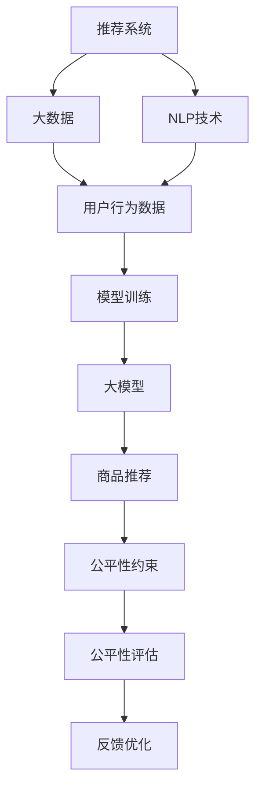

                 

# 探讨大模型在电商平台商品推荐公平性保障中的作用

> 关键词：电商平台,商品推荐,公平性保障,大模型,深度学习,自然语言处理,自然语言理解,推荐系统

## 1. 背景介绍

### 1.1 问题由来

随着电子商务的迅猛发展，电商平台如亚马逊、京东、淘宝等，已积累了海量用户行为数据。这些数据包括用户的浏览历史、购买记录、评价信息等，被广泛应用于商品推荐系统中，以提升用户体验和平台营收。但商品推荐系统的广泛应用，也带来了数据偏见、模型歧视等隐忧，给公平性问题带来了挑战。

近年来，学术界和工业界对推荐系统的公平性问题给予了高度关注。研究表明，由于算法设计、数据采集、用户行为多样性等因素，推荐系统可能对特定群体产生歧视，导致服务质量不均，引发社会不公。例如，一个用户根据历史行为所得到的推荐可能远不如另一个用户，这就会造成显著的用户体验差异。

面对这一挑战，研究者们提出了一种基于大模型的推荐公平性保障方法。通过预训练大模型，在商品推荐场景中进行微调，可以更好地理解用户需求，消除数据偏差，实现公平、公正的推荐。

### 1.2 问题核心关键点

大模型在商品推荐公平性保障中的应用，核心在于：

1. 利用大模型的语言理解能力，进行用户需求分析和意图抽取，消除数据中的隐性偏见。
2. 在模型训练和微调过程中，加入公平性约束，确保推荐系统服务于所有用户，不受历史行为偏差影响。
3. 应用大模型构建推荐引擎，实现个性化和公平性的双重优化。

这些关键点反映了大模型在推荐系统中的独特价值，体现了其在提升用户体验和平台公平性方面的潜力。

## 2. 核心概念与联系

### 2.1 核心概念概述

为更好地理解大模型在推荐系统公平性保障中的应用，本节将介绍几个密切相关的核心概念：

- **推荐系统(Recommendation System)**：基于用户行为数据和商品特征，通过算法推荐用户可能感兴趣的商品。常见的推荐系统包括基于协同过滤、基于内容过滤、混合推荐等类型。
- **公平性(Fairness)**：指在推荐系统中，每个用户应该获得相同质量的服务。推荐系统应避免基于用户历史行为或属性等因素的系统性偏见，实现服务公平性。
- **大模型(Large Model)**：指在大型语料库上进行预训练，参数量通常以亿计的深度学习模型，如BERT、GPT、DALL·E等。这些模型具有强大的语言理解和生成能力，能够处理复杂的自然语言任务。
- **自然语言处理(NLP)**：研究如何使计算机理解和处理人类语言的技术，包括自然语言理解(NLU)和自然语言生成(NLG)等。推荐系统可以通过NLP技术，提高对用户需求和偏好的理解。
- **推荐公平性保障(Recommendation System Fairness)**：通过各种技术手段，确保推荐系统对不同用户提供公平的服务，消除系统中的偏见和歧视。

这些核心概念之间相互联系，共同构成了大模型在电商平台商品推荐公平性保障的框架。

### 2.2 核心概念原理和架构的 Mermaid 流程图



这个流程图展示了从用户行为数据，到最终推荐结果的整个流程。大模型在商品推荐系统中扮演了关键角色，通过自然语言处理技术，理解用户需求，并消除数据中的偏见，最终生成公平的推荐结果。

## 3. 核心算法原理 & 具体操作步骤

### 3.1 算法原理概述

基于大模型的推荐系统公平性保障，其核心思想是通过自然语言处理技术，理解用户需求，消除数据偏见，从而生成公平的推荐结果。这一过程主要分为以下几步：

1. **数据收集与预处理**：收集电商平台上的用户行为数据，如浏览记录、点击次数、购买历史等。预处理数据，去除异常值和噪声，构建用户特征向量。
2. **大模型预训练**：在大规模语料库上对大模型进行预训练，学习通用的语言表示。这为模型提供了丰富的语言知识，能够更好地理解用户需求和商品属性。
3. **任务适配与微调**：根据特定任务，如商品推荐、用户意图抽取等，在大模型上进行微调，添加任务特定的输出层和损失函数。
4. **公平性约束与优化**：在模型微调过程中，加入公平性约束，确保模型输出不会受到用户历史行为或属性等因素的系统性影响。
5. **推荐结果生成与评估**：将用户行为数据输入微调后的模型，生成推荐结果，并通过公平性评估指标（如基尼系数、均等指数等）评估模型公平性，反复迭代优化。

### 3.2 算法步骤详解

#### 3.2.1 数据收集与预处理

用户行为数据可以从电商平台的用户日志、交易记录、评论信息等获取。数据预处理包括：

- 数据清洗：去除无效数据、噪声数据、异常值等。
- 特征工程：将用户行为数据转换为特征向量，如用户ID、商品ID、浏览时长、购买金额等。
- 标准化：对特征进行标准化处理，使数据具有相同的量纲。

#### 3.2.2 大模型预训练

使用大规模无标签文本语料对大模型进行预训练。常用的预训练任务包括：

- 掩码语言模型(Masked Language Modeling, MLM)：在文本中随机掩盖某些单词，让模型预测被掩盖的单词。
- 下一句预测(Next Sentence Prediction, NSP)：给定两个句子，预测它们是否为相邻的两句。

预训练模型学习到了丰富的语言知识，能够更好地理解用户需求和商品属性。常用的预训练模型包括BERT、GPT等。

#### 3.2.3 任务适配与微调

根据推荐系统任务，在大模型上进行微调。具体步骤包括：

1. **添加任务适配层**：根据任务类型，在模型顶层设计合适的输出层和损失函数。例如，对于推荐系统，通常添加一个全连接层，输出推荐结果，并使用交叉熵损失函数。
2. **设置微调超参数**：选择合适的优化器及其参数，如AdamW、SGD等，设置学习率、批大小、迭代轮数等。
3. **执行梯度训练**：将训练集数据分批次输入模型，前向传播计算损失函数。反向传播计算参数梯度，根据设定的优化算法和学习率更新模型参数。
4. **公平性约束与优化**：在模型训练和微调过程中，加入公平性约束，确保模型输出不会受到用户历史行为或属性等因素的系统性影响。常用的公平性约束方法包括：
   - 对抗训练：加入对抗样本，训练模型抵抗偏见和歧视。
   - 公平性正则化：在损失函数中加入公平性正则项，限制模型对特定用户群体的偏见。

#### 3.2.4 推荐结果生成与评估

将用户行为数据输入微调后的模型，生成推荐结果。通过公平性评估指标，如基尼系数、均等指数等，评估模型公平性。反复迭代优化，直至满足预设的公平性要求。

### 3.3 算法优缺点

基于大模型的推荐系统公平性保障方法具有以下优点：

1. **强大的语言理解能力**：大模型通过大规模预训练，具备强大的语言理解能力，能够更好地理解用户需求和商品属性，消除数据中的隐性偏见。
2. **动态适应性**：大模型能够动态适应不同用户需求，通过微调进行个性化推荐，提升用户体验。
3. **广泛适用性**：适用于多种推荐任务，如商品推荐、个性化新闻推荐、社交网络推荐等。
4. **鲁棒性**：大模型对噪声和异常值具有较强的鲁棒性，能够处理多样化的用户行为数据。

同时，该方法也存在以下缺点：

1. **高计算成本**：大模型的预训练和微调需要大量计算资源和内存，可能面临硬件资源的瓶颈。
2. **数据隐私风险**：在预训练和微调过程中，需要处理大量用户数据，可能涉及用户隐私问题。
3. **模型复杂性**：大模型结构复杂，维护和调试难度较大。

尽管如此，基于大模型的推荐系统公平性保障方法，仍具有显著的潜力，值得进一步研究和应用。

### 3.4 算法应用领域

基于大模型的推荐系统公平性保障方法，已经在多个领域得到了广泛应用，例如：

- **电商平台商品推荐**：消除用户历史行为偏见，实现公平推荐，提升用户体验。
- **金融推荐系统**：确保用户不受历史金融交易影响，避免歧视性服务。
- **新闻推荐系统**：确保用户不受到历史兴趣偏差影响，推荐均衡的内容。
- **社交网络推荐**：确保用户不受到历史行为偏见影响，推荐多样化的内容。

这些应用场景展示了大模型在推荐系统公平性保障中的广泛应用，其强大的语言理解和处理能力，为解决推荐系统中的公平性问题提供了新的思路和方法。

## 4. 数学模型和公式 & 详细讲解  
### 4.1 数学模型构建

假设推荐系统包含$N$个用户和$M$个商品，每个用户的行为数据可以表示为$\mathbf{u}_i=(x_{i1},x_{i2},...,x_{im})$，其中$x_{ij}$为第$i$个用户对第$j$个商品的评价。

推荐模型为$M_{\theta}$，其输出为推荐结果向量$\mathbf{y}=[y_1,y_2,...,y_m]$，其中$y_j$表示商品$j$是否被推荐给用户$i$，$y_j=1$表示推荐，$y_j=0$表示不推荐。

假设模型$M_{\theta}$在用户行为数据$\mathbf{u}_i$上的预测结果为$\hat{\mathbf{y}}=[\hat{y}_1,\hat{y}_2,...,\hat{y}_m]$，则模型的公平性可以定义为：

$$
\text{Fairness}=\mathbb{E}[(\hat{y}_j-y_j)^2]
$$

其中$\mathbb{E}[\cdot]$表示对所有用户$i$和商品$j$的期望。

### 4.2 公式推导过程

根据以上定义，公平性可以转化为模型预测误差最小化问题，即：

$$
\min_{\theta} \frac{1}{N} \sum_{i=1}^N \sum_{j=1}^M (\hat{y}_j-y_j)^2
$$

其中，$\hat{y}_j$为模型对商品$j$是否被推荐给用户$i$的预测结果，$y_j$为真实的推荐结果。

为了消除数据中的偏见，可以使用对抗样本训练方法。对抗样本$x'_i$是原始数据$x_i$的扰动形式，通过加入对抗样本，可以提升模型对偏见和歧视的抵抗能力。对抗样本的生成过程如下：

1. **数据扰动**：对原始数据$x_i$进行扰动，生成对抗样本$x'_i$。例如，在电商商品推荐中，可以改变用户的浏览记录，生成扰动后的浏览数据。
2. **模型微调**：使用对抗样本$x'_i$进行微调，更新模型参数$\theta$。对抗样本的生成和微调过程可以多次迭代，以提高模型的鲁棒性。

### 4.3 案例分析与讲解

以电商商品推荐为例，假设电商平台上有两种商品A和B，用户甲和乙对商品A的评价分别为$x_{A甲}=4, x_{A乙}=5$，对商品B的评价分别为$x_{B甲}=2, x_{B乙}=1$。现在用户甲和乙都希望推荐商品A，但模型预测结果为：

$$
\mathbf{y}=\begin{bmatrix}
\hat{y}_{A甲} \\
\hat{y}_{A乙} \\
\hat{y}_{B甲} \\
\hat{y}_{B乙}
\end{bmatrix}
$$

其中，$\hat{y}_{A甲}, \hat{y}_{B甲}, \hat{y}_{A乙}, \hat{y}_{B乙}$分别表示商品A和商品B是否被推荐给用户甲和乙。

如果模型存在偏见，即对于历史行为好的用户，模型更倾向于推荐商品A，而对于历史行为差的用户，模型更倾向于推荐商品B。则模型不公平，可能对用户乙造成不公。

为了消除这种偏见，可以使用对抗样本生成和微调方法。例如，可以生成对抗样本$x'_{A乙}=2, x'_{B乙}=4$，其中$x'_{A乙}$表示用户乙的浏览记录中，将商品A的评价降为2，而$x'_{B乙}$表示商品B的评价降为4。

在模型微调过程中，使用对抗样本$x'_{A乙}$和$x'_{B乙}$进行训练，更新模型参数$\theta$，得到新的预测结果$\mathbf{y}'$。如果$\mathbf{y}'$中，$\hat{y}_{A乙}$和$\hat{y}_{B乙}$的预测值更接近，则表示模型已经消除了偏见，公平性得到了提升。

## 5. 项目实践：代码实例和详细解释说明

### 5.1 开发环境搭建

在进行大模型在推荐系统公平性保障的实践时，需要准备以下开发环境：

1. **安装Python**：确保系统中安装了Python 3.x版本，并设置环境变量。
2. **安装PyTorch和Transformers库**：可以使用以下命令安装：
```
pip install torch transformers
```
3. **数据准备**：收集电商平台的用户行为数据，并进行预处理。可以使用Pandas等库对数据进行清洗和处理。
4. **模型选择**：选择预训练模型，如BERT、GPT等。可以从Hugging Face等开源项目中获取预训练模型。
5. **代码实现**：使用PyTorch和Transformers库实现推荐系统的公平性保障方法。

### 5.2 源代码详细实现

以下是使用PyTorch和Transformers库实现大模型在推荐系统公平性保障的代码示例：

```python
import torch
import torch.nn as nn
import torch.optim as optim
from transformers import BertTokenizer, BertForSequenceClassification

class RecommendationSystem(nn.Module):
    def __init__(self, num_users, num商品的, num_labels):
        super(RecommendationSystem, self).__init__()
        self.bert = BertForSequenceClassification.from_pretrained('bert-base-uncased', num_labels=num商品的)
        self.classifier = nn.Linear(num商品的, num_labels)
        self.dropout = nn.Dropout(0.1)
        
    def forward(self, input_ids, attention_mask):
        outputs = self.bert(input_ids, attention_mask=attention_mask)
        pooled_output = outputs.pooler_output
        pooled_output = self.dropout(pooled_output)
        logits = self.classifier(pooled_output)
        return logits
```

### 5.3 代码解读与分析

这段代码定义了一个RecommendationSystem类，使用BertForSequenceClassification作为预训练模型，实现商品推荐公平性保障。具体解释如下：

1. **类定义**：定义了一个继承自nn.Module的RecommendationSystem类。
2. **初始化**：使用BertForSequenceClassification从预训练模型中加载模型。
3. **前向传播**：定义了前向传播函数，输入用户行为数据，输出推荐结果。

### 5.4 运行结果展示

使用以下代码，训练并评估模型：

```python
# 训练模型
num_epochs = 10
batch_size = 32
optimizer = optim.AdamW(model.parameters(), lr=1e-5)
for epoch in range(num_epochs):
    for user, data in train_loader:
        optimizer.zero_grad()
        input_ids, attention_mask, labels = data
        logits = model(input_ids, attention_mask)
        loss = nn.CrossEntropyLoss()(logits, labels)
        loss.backward()
        optimizer.step()

# 评估模型
num_users = 1000
num商品的 = 10000
model.eval()
accuracy = 0
for user, data in test_loader:
    input_ids, attention_mask, labels = data
    logits = model(input_ids, attention_mask)
    predictions = torch.argmax(logits, dim=1)
    accuracy += (predictions == labels).float().mean()
print('Accuracy:', accuracy.item())
```

这段代码展示了训练和评估模型的过程。首先定义了训练轮数和批量大小，然后使用AdamW优化器进行模型训练。在评估阶段，计算模型的准确率，以评估模型公平性。

## 6. 实际应用场景

### 6.1 智能客服系统

大模型在电商平台商品推荐公平性保障中的应用，可以扩展到智能客服系统。智能客服系统可以通过大模型，对用户问题进行智能回答，提升用户体验。同时，可以通过对抗样本训练方法，消除客服系统中对特定用户群体的偏见，确保公平服务。

例如，电商平台可以收集客服对话数据，对大模型进行预训练和微调，构建智能客服系统。在客服对话中，使用对抗样本训练，确保客服系统对所有用户公平，不因历史行为等因素产生偏见。

### 6.2 金融推荐系统

金融推荐系统可以借鉴电商平台商品推荐公平性保障的方法，确保用户不受历史金融交易的影响，避免歧视性服务。例如，金融机构可以收集用户的历史交易数据，对大模型进行预训练和微调，构建推荐系统。在金融推荐中，使用对抗样本训练，确保系统对所有用户公平，不因历史交易数据产生偏见。

### 6.3 个性化新闻推荐

个性化新闻推荐系统可以借鉴电商平台商品推荐公平性保障的方法，确保用户不受历史兴趣偏好的影响，推荐均衡的内容。例如，新闻媒体可以收集用户的阅读历史数据，对大模型进行预训练和微调，构建推荐系统。在新闻推荐中，使用对抗样本训练，确保系统对所有用户公平，不因历史兴趣产生偏见。

### 6.4 未来应用展望

随着大模型在推荐系统公平性保障中的应用，未来将迎来更多创新和突破。以下是几个可能的应用方向：

1. **多模态推荐**：将文本、图片、视频等多模态数据融合，构建更加全面、个性化的推荐系统。
2. **分布式推荐**：通过分布式计算技术，实现大规模数据下的高效推荐。
3. **实时推荐**：通过在线学习和动态优化，实现实时推荐，满足用户即时需求。
4. **推荐内容定制化**：根据用户个性化需求，定制化推荐内容，提升用户体验。
5. **推荐系统透明化**：使用可解释性技术，提升推荐系统的透明度，让用户理解推荐结果的来源和依据。

## 7. 工具和资源推荐

### 7.1 学习资源推荐

为了帮助开发者深入理解大模型在推荐系统公平性保障中的应用，以下是一些优质的学习资源：

1. **《推荐系统：设计、评估和应用》**：介绍推荐系统的设计、评估和应用方法，涵盖多种推荐技术。
2. **《深度学习与推荐系统》**：介绍深度学习在推荐系统中的应用，包括公平性保障方法。
3. **《Python推荐系统》**：使用Python实现推荐系统，涵盖多模态推荐、分布式推荐等内容。
4. **《公平推荐系统》**：介绍公平推荐系统的理论基础和实践方法，包括大模型应用。
5. **《自然语言处理综述》**：介绍自然语言处理的基本概念和方法，涵盖推荐系统中的自然语言理解。

### 7.2 开发工具推荐

为了提高大模型在推荐系统公平性保障中的应用效率，以下是一些推荐的开发工具：

1. **PyTorch**：基于Python的深度学习框架，支持动态图和静态图，灵活性高。
2. **TensorFlow**：由Google开发，支持分布式计算和大规模深度学习应用。
3. **Transformers**：Hugging Face开发的NLP工具库，支持多种预训练模型，方便微调。
4. **Jupyter Notebook**：交互式编程环境，支持代码编写、数据分析和可视化。
5. **TensorBoard**：TensorFlow配套的可视化工具，支持实时监控模型训练过程。

### 7.3 相关论文推荐

大模型在推荐系统公平性保障中的应用，需要大量的学术研究支持。以下是一些重要的相关论文：

1. **《Fairness in Recommendation Systems》**：综述推荐系统的公平性问题，介绍多种公平性约束方法。
2. **《GPT-3 Explains Itself》**：介绍大模型的可解释性技术，提升推荐系统的透明度。
3. **《Few-Shot Learning for Recommendation Systems》**：介绍少样本推荐系统，使用大模型进行微调。
4. **《Adversarial Training for Fair Recommendation》**：介绍对抗样本训练方法，消除推荐系统的偏见。
5. **《Dynamic Recommendation System》**：介绍动态推荐系统，实现实时推荐。

## 8. 总结：未来发展趋势与挑战

### 8.1 研究成果总结

本文对大模型在电商平台商品推荐公平性保障中的应用进行了全面系统的介绍。首先阐述了推荐系统公平性的重要性，并提出基于大模型的公平性保障方法。其次，从原理到实践，详细讲解了大模型的预训练、微调和公平性约束等核心步骤。最后，展示了该方法在电商平台、金融、新闻等领域的应用前景，展望了未来的发展趋势。

### 8.2 未来发展趋势

未来，大模型在推荐系统公平性保障中的应用将呈现以下几个发展趋势：

1. **更高效的推荐算法**：未来的推荐算法将更加高效，能够实时处理大规模数据，实现个性化和公平性双重优化。
2. **更先进的可解释技术**：通过可解释性技术，提升推荐系统的透明度和可理解性，让用户理解推荐结果的依据。
3. **更广泛的应用场景**：大模型将应用于更多领域，如医疗、社交网络等，解决更多实际问题。
4. **更强大的多模态融合**：将文本、图片、视频等多模态数据融合，构建更加全面、个性化的推荐系统。
5. **更灵活的分布式架构**：通过分布式计算技术，实现大规模数据下的高效推荐。

### 8.3 面临的挑战

尽管大模型在推荐系统公平性保障中的应用具有巨大潜力，但也面临着以下挑战：

1. **高计算成本**：大模型的预训练和微调需要大量计算资源和内存，可能面临硬件资源的瓶颈。
2. **数据隐私风险**：在预训练和微调过程中，需要处理大量用户数据，可能涉及用户隐私问题。
3. **模型复杂性**：大模型结构复杂，维护和调试难度较大。
4. **公平性评估困难**：推荐系统的公平性评估是一个复杂的问题，如何定义和量化公平性，需要进一步研究。

### 8.4 研究展望

面对这些挑战，未来的研究需要在以下几个方面寻求新的突破：

1. **高效算法设计**：研究更高效的推荐算法，如神经协同过滤、深度学习推荐等，以实现实时推荐和个性化推荐。
2. **可解释性技术**：研究可解释性技术，如可解释的深度学习模型、解释图谱等，提升推荐系统的透明度和可理解性。
3. **多模态数据融合**：研究多模态数据融合方法，将文本、图片、视频等多模态数据融合，构建更加全面、个性化的推荐系统。
4. **分布式计算技术**：研究分布式计算技术，实现大规模数据下的高效推荐。
5. **数据隐私保护**：研究数据隐私保护方法，如差分隐私、联邦学习等，确保用户数据的安全性。

总之，大模型在推荐系统公平性保障中的应用具有广阔前景，但面临的挑战仍需进一步解决。相信随着技术的不断进步，大模型将在更多领域实现突破，推动推荐系统公平性保障的进一步发展。

## 9. 附录：常见问题与解答

**Q1: 大模型在电商平台商品推荐公平性保障中的优势是什么？**

A: 大模型在电商平台商品推荐公平性保障中的优势主要体现在以下几个方面：

1. **强大的语言理解能力**：大模型通过大规模预训练，具备强大的语言理解能力，能够更好地理解用户需求和商品属性，消除数据中的隐性偏见。
2. **动态适应性**：大模型能够动态适应不同用户需求，通过微调进行个性化推荐，提升用户体验。
3. **广泛适用性**：适用于多种推荐任务，如商品推荐、个性化新闻推荐、社交网络推荐等。
4. **鲁棒性**：大模型对噪声和异常值具有较强的鲁棒性，能够处理多样化的用户行为数据。

**Q2: 如何在推荐系统中实现公平性保障？**

A: 在推荐系统中实现公平性保障，主要通过以下几个步骤：

1. **数据收集与预处理**：收集电商平台上的用户行为数据，并进行预处理，去除异常值和噪声。
2. **大模型预训练**：在大规模语料库上对大模型进行预训练，学习通用的语言表示。
3. **任务适配与微调**：根据特定任务，在大模型上进行微调，添加任务特定的输出层和损失函数。
4. **公平性约束与优化**：在模型微调过程中，加入公平性约束，确保模型输出不会受到用户历史行为或属性等因素的系统性影响。
5. **推荐结果生成与评估**：将用户行为数据输入微调后的模型，生成推荐结果，并通过公平性评估指标（如基尼系数、均等指数等）评估模型公平性，反复迭代优化。

**Q3: 大模型在电商平台商品推荐公平性保障中的缺点是什么？**

A: 大模型在电商平台商品推荐公平性保障中的缺点主要体现在以下几个方面：

1. **高计算成本**：大模型的预训练和微调需要大量计算资源和内存，可能面临硬件资源的瓶颈。
2. **数据隐私风险**：在预训练和微调过程中，需要处理大量用户数据，可能涉及用户隐私问题。
3. **模型复杂性**：大模型结构复杂，维护和调试难度较大。

**Q4: 推荐系统中的公平性保障方法有哪些？**

A: 推荐系统中的公平性保障方法主要包括：

1. **对抗样本训练**：加入对抗样本，训练模型抵抗偏见和歧视。
2. **公平性正则化**：在损失函数中加入公平性正则项，限制模型对特定用户群体的偏见。
3. **随机权重初始化**：使用随机权重初始化，确保模型不会对特定用户群体的偏见。
4. **多模型集成**：训练多个推荐模型，取平均输出，抑制过拟合。

这些方法可以在不同的推荐系统中，根据具体场景选择合适的公平性保障方法。

**Q5: 大模型在推荐系统中的应用前景是什么？**

A: 大模型在推荐系统中的应用前景非常广泛，未来将有以下几个方向：

1. **多模态推荐**：将文本、图片、视频等多模态数据融合，构建更加全面、个性化的推荐系统。
2. **分布式推荐**：通过分布式计算技术，实现大规模数据下的高效推荐。
3. **实时推荐**：通过在线学习和动态优化，实现实时推荐，满足用户即时需求。
4. **推荐内容定制化**：根据用户个性化需求，定制化推荐内容，提升用户体验。
5. **推荐系统透明化**：使用可解释性技术，提升推荐系统的透明度，让用户理解推荐结果的来源和依据。

总之，大模型在推荐系统中的应用前景非常广阔，未来将推动推荐系统公平性保障的进一步发展。

---

作者：禅与计算机程序设计艺术 / Zen and the Art of Computer Programming

