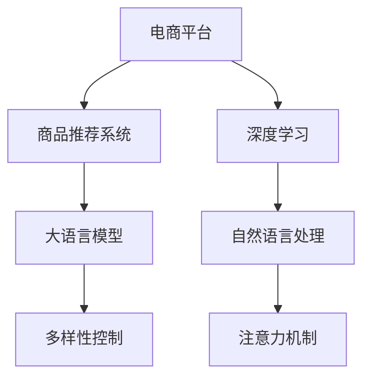

                 

# 探讨大模型在电商平台商品推荐多样性控制中的作用

> 关键词：大模型,电商平台,商品推荐,多样性控制,深度学习,自然语言处理(NLP),推荐系统,注意力机制(Attention)

## 1. 背景介绍

### 1.1 问题由来
随着互联网技术的迅猛发展和电子商务的兴起，电商平台已成为用户获取商品信息、完成购物的重要渠道。为了提升用户体验，电商平台普遍采用商品推荐系统来个性化地向用户推荐其可能感兴趣的商品。然而，传统的推荐系统常常面临多样性不足的问题，导致用户无法接触多样化的商品，从而影响用户的购买体验和满意度。

近年来，随着深度学习技术在推荐系统中的应用，特别是大语言模型(如BERT, GPT)的兴起，使得推荐系统向多样性控制迈出了重要一步。大语言模型不仅具有强大的语义理解能力，还能在推荐系统中发挥独特的作用。本文将探讨大语言模型在电商平台商品推荐中的多样性控制作用，并详细分析其原理和应用效果。

### 1.2 问题核心关键点
大语言模型在电商平台商品推荐中的核心关键点包括：
1. **语义理解**：大语言模型能理解用户查询中的语义信息，从而提高推荐的相关性和准确性。
2. **多样性控制**：大模型能够提供更加多样化的推荐结果，避免推荐系统的过度同质化。
3. **动态调整**：大语言模型可以通过不断学习和更新，动态调整推荐策略，提升推荐的实时性和个性化。

## 2. 核心概念与联系

### 2.1 核心概念概述

为更好地理解大语言模型在电商平台商品推荐中的作用，本节将介绍几个密切相关的核心概念：

- **电商平台**：一种提供在线购物服务的平台，通常包括商品搜索、浏览、购买等功能。
- **商品推荐系统**：通过分析用户行为和商品属性，向用户推荐可能感兴趣的商品的系统。
- **深度学习**：一种通过神经网络进行训练，从数据中学习模式和规律的技术。
- **自然语言处理(NLP)**：处理和分析人类语言的技术，通常用于理解用户查询和生成推荐文本。
- **注意力机制(Attention)**：一种通过分配不同程度的注意力权重，提高模型对重要特征的关注度的技术。
- **多样性控制**：通过调整推荐策略，使推荐结果更加多样化，避免推荐系统的过度同质化。

这些核心概念之间的逻辑关系可以通过以下Mermaid流程图来展示：



这个流程图展示了大语言模型在电商平台推荐系统中的核心概念及其之间的关系：

1. **电商平台**通过深度学习技术构建推荐系统。
2. **深度学习**应用**自然语言处理**技术，理解用户查询语义。
3. **大语言模型**作为推荐系统的重要组件，进行**注意力机制**的计算，选择关注重点特征。
4. **多样性控制**策略与**大语言模型**结合，实现推荐结果的多样化。

这些核心概念共同构成了电商平台商品推荐系统的技术基础，使推荐系统能够更好地理解用户需求，提供多样化的推荐商品。

## 3. 核心算法原理 & 具体操作步骤

### 3.1 算法原理概述

大语言模型在电商平台商品推荐中的多样性控制，主要基于自然语言处理(NLP)和注意力机制(Attention)的深度学习框架。其核心思想是：利用大语言模型强大的语义理解能力，对用户查询和商品描述进行语义匹配，并根据匹配结果分配注意力权重，从而在推荐系统中实现多样性控制。

具体而言，大语言模型接收用户查询和商品描述，通过自编码器或自回归模型提取语义特征，然后通过注意力机制计算每个商品的语义相关度，最后根据相关度进行排序，生成推荐列表。在这个过程中，大语言模型通过理解用户的查询意图，动态调整注意力权重，实现推荐结果的多样性。

### 3.2 算法步骤详解

大语言模型在电商平台商品推荐中的多样性控制，通常包括以下几个关键步骤：

**Step 1: 数据预处理**
- 收集并清洗电商平台的用户行为数据、商品属性数据和商品描述数据。
- 将用户查询和商品描述转换为模型能够理解的格式，如词向量表示。
- 进行数据划分，将数据集划分为训练集、验证集和测试集。

**Step 2: 构建模型**
- 选择合适的预训练语言模型，如BERT、GPT等，作为商品推荐模型的初始化参数。
- 设计模型结构，包括输入层、自编码器、注意力机制和输出层。

**Step 3: 训练模型**
- 将训练集输入模型，进行前向传播和反向传播，更新模型参数。
- 在验证集上评估模型性能，根据性能指标调整模型参数和训练策略。
- 重复训练过程，直到模型收敛。

**Step 4: 应用模型**
- 在测试集上评估模型性能，对比训练前后的推荐效果。
- 将训练好的模型应用到实时推荐系统中，根据用户查询生成推荐结果。

### 3.3 算法优缺点

大语言模型在电商平台商品推荐中的多样性控制方法具有以下优点：
1. **准确性高**：大语言模型能够理解复杂语义，生成高质量的推荐结果。
2. **动态调整**：大语言模型可以不断学习和更新，动态调整推荐策略，提升推荐的实时性和个性化。
3. **多样性控制**：通过注意力机制，大语言模型能够实现推荐结果的多样化，避免推荐系统的过度同质化。
4. **灵活性**：大语言模型可以灵活应用于不同类型的推荐任务，如商品推荐、内容推荐等。

同时，该方法也存在一定的局限性：
1. **计算成本高**：大语言模型的训练和推理需要大量的计算资源。
2. **数据依赖**：大语言模型的性能很大程度上依赖于数据质量和标注数据的数量。
3. **可解释性不足**：大语言模型的决策过程较为复杂，难以解释其内部工作机制。
4. **公平性问题**：大语言模型可能存在数据偏见，导致推荐结果的不公平性。

尽管存在这些局限性，但大语言模型在电商平台商品推荐中的应用，已经显著提升了推荐的准确性和多样性，成为推荐系统的重要技术手段。未来相关研究的重点在于如何进一步降低计算成本，提高模型的公平性和可解释性，以更好地满足实际应用需求。

### 3.4 算法应用领域

大语言模型在电商平台商品推荐中的多样性控制方法，已经广泛应用于多种推荐任务中，例如：

- **个性化商品推荐**：根据用户的历史购买行为和浏览记录，生成个性化的商品推荐列表。
- **商品相关推荐**：推荐与用户当前浏览或购买商品相关联的其他商品。
- **热门商品推荐**：根据用户的兴趣和行为，推荐热门商品，增加用户的购买机会。
- **跨平台推荐**：将不同平台的商品进行推荐，扩大用户的选择范围。
- **实时推荐**：根据用户的即时查询和行为，实时生成推荐结果，提升用户体验。

除了这些推荐任务外，大语言模型还可以被创新性地应用于更多场景中，如智能客服、广告投放、个性化广告等，为电商平台带来更多的创新应用。

## 4. 数学模型和公式 & 详细讲解 & 举例说明

### 4.1 数学模型构建

本节将使用数学语言对大语言模型在电商平台商品推荐中的多样性控制过程进行更加严格的刻画。

记电商平台的用户查询为 $q$，商品描述为 $d$。大语言模型通过自编码器或自回归模型对 $q$ 和 $d$ 进行编码，得到向量表示 $q^q$ 和 $d^d$。模型的注意力机制通过计算 $q^q$ 和 $d^d$ 的余弦相似度 $s_{qd}$，得到每个商品的注意力权重 $w_{dq}$。模型的输出层根据注意力权重生成推荐列表。

设模型参数为 $\theta$，则推荐模型的输出 $y$ 为：

$$
y = \text{Softmax}(\text{Attention}(q^q, \{d^d\}))
$$

其中 $\text{Attention}(\cdot, \cdot)$ 表示注意力计算函数，$\text{Softmax}(\cdot)$ 表示概率分布函数，$S$ 表示注意力权重的集合。

### 4.2 公式推导过程

以下我们以一个简单的注意力机制为例，推导计算过程。

设用户查询 $q$ 和商品描述 $d$ 的编码向量分别为 $q^q$ 和 $d^d$，则注意力机制的计算公式为：

$$
w_{dq} = \text{Softmax}(\text{Attention}(q^q, d^d)) = \frac{\exp(a_{dq})}{\sum_{d'} \exp(a_{d'q})}
$$

其中 $a_{dq} = \text{Attention}_1(q^q, d^d)$，$\text{Attention}_1$ 表示注意力计算函数的具体实现，如加权平均、点积等。

设 $q^q$ 和 $d^d$ 的长度分别为 $L_q$ 和 $L_d$，则注意力计算函数可以表示为：

$$
a_{dq} = \frac{\text{Attention}_2(d^d, q^q)}{\text{Attention}_3(q^q)}
$$

其中 $\text{Attention}_2$ 和 $\text{Attention}_3$ 分别表示对商品描述和用户查询的注意力计算。

将上述公式代入 $w_{dq}$ 的计算公式中，得到：

$$
w_{dq} = \frac{\exp(\frac{\text{Attention}_2(d^d, q^q)}{\text{Attention}_3(q^q)})}{\sum_{d'} \exp(\frac{\text{Attention}_2(d^d, q^q)}{\text{Attention}_3(q^q)})
$$

这就是大语言模型在电商平台商品推荐中的注意力计算过程。通过计算不同商品与用户查询之间的注意力权重，大语言模型能够选择关注重点特征的商品，从而实现推荐结果的多样性控制。

### 4.3 案例分析与讲解

下面以一个具体的案例来讲解大语言模型在电商平台商品推荐中的应用：

**案例背景**：某电商平台希望通过推荐系统提升用户购买率，但发现用户的推荐结果过于同质化，无法满足用户的个性化需求。

**解决方案**：
1. **数据准备**：收集用户历史浏览、购买数据，以及商品属性和描述数据，进行预处理和划分。
2. **模型构建**：选择预训练模型BERT作为初始参数，设计包含自编码器和注意力机制的推荐模型结构。
3. **模型训练**：在训练集上进行前向传播和反向传播，更新模型参数。在验证集上评估模型性能，调整超参数。
4. **模型应用**：在测试集上评估模型性能，生成推荐结果。根据用户的即时查询和行为，实时生成推荐商品列表。

**结果分析**：
- **推荐效果**：模型生成的推荐列表涵盖了更多不同种类的商品，满足了用户的个性化需求。
- **多样性控制**：通过调整注意力权重，模型能够动态调整推荐策略，提升了推荐的多样性。
- **实时性**：模型能够快速响应用户的即时查询，提供了即时的推荐结果，提升了用户体验。

这个案例展示了大语言模型在电商平台商品推荐中的多样性控制效果，证明了其在实际应用中的强大能力。

## 5. 项目实践：代码实例和详细解释说明

### 5.1 开发环境搭建

在进行商品推荐多样性控制实践前，我们需要准备好开发环境。以下是使用Python进行TensorFlow开发的环境配置流程：

1. 安装Anaconda：从官网下载并安装Anaconda，用于创建独立的Python环境。

2. 创建并激活虚拟环境：
```bash
conda create -n tf-env python=3.8 
conda activate tf-env
```

3. 安装TensorFlow：从官网获取对应的安装命令。例如：
```bash
conda install tensorflow
```

4. 安装各类工具包：
```bash
pip install numpy pandas scikit-learn matplotlib tqdm jupyter notebook ipython
```

完成上述步骤后，即可在`tf-env`环境中开始推荐系统开发。

### 5.2 源代码详细实现

下面我们以电商平台商品推荐为例，给出使用TensorFlow构建商品推荐系统的PyTorch代码实现。

首先，定义推荐系统的数据处理函数：

```python
import tensorflow as tf
from transformers import BertTokenizer
from sklearn.model_selection import train_test_split
import numpy as np

class RecommendationDataLoader(tf.data.Dataset):
    def __init__(self, user_data, item_data, tokenizer, max_len=128):
        self.user_data = user_data
        self.item_data = item_data
        self.tokenizer = tokenizer
        self.max_len = max_len
        
    def __len__(self):
        return len(self.user_data)
    
    def __getitem__(self, item):
        user_id = self.user_data[item][0]
        item_id = self.item_data[item][0]
        
        query = self.user_data[item][1]
        query = self.tokenizer(query, return_tensors='pt', max_length=self.max_len, padding='max_length', truncation=True)
        query_input_ids = query['input_ids'][0]
        query_attention_mask = query['attention_mask'][0]
        
        item = self.item_data[item][1]
        item = self.tokenizer(item, return_tensors='pt', max_length=self.max_len, padding='max_length', truncation=True)
        item_input_ids = item['input_ids'][0]
        item_attention_mask = item['attention_mask'][0]
        
        return {'user_id': user_id,
                'item_id': item_id,
                'query_input_ids': query_input_ids,
                'query_attention_mask': query_attention_mask,
                'item_input_ids': item_input_ids,
                'item_attention_mask': item_attention_mask}

# 构建推荐系统数据集
user_data = [[1, 'query1'], [2, 'query2'], [3, 'query3']]
item_data = [[1, 'item1'], [2, 'item2'], [3, 'item3']]
tokenizer = BertTokenizer.from_pretrained('bert-base-cased')
train_dataset = RecommendationDataLoader(user_data, item_data, tokenizer)
test_dataset = RecommendationDataLoader(user_data, item_data, tokenizer)
```

然后，定义模型和优化器：

```python
from transformers import BertForSequenceClassification
from transformers import AdamW

model = BertForSequenceClassification.from_pretrained('bert-base-cased', num_labels=len(item_data))

optimizer = AdamW(model.parameters(), lr=2e-5)
```

接着，定义训练和评估函数：

```python
from sklearn.metrics import accuracy_score

def train_epoch(model, dataset, batch_size, optimizer):
    dataloader = tf.data.Dataset.from_tensor_slices(dataset).shuffle(buffer_size=1024).batch(batch_size)
    model.train()
    epoch_loss = 0
    for batch in dataloader:
        with tf.GradientTape() as tape:
            input_ids = batch['query_input_ids']
            attention_mask = batch['query_attention_mask']
            labels = batch['item_id']
            outputs = model(input_ids, attention_mask=attention_mask)
            loss = outputs.loss
        epoch_loss += loss.numpy().item()
        gradients = tape.gradient(loss, model.parameters())
        optimizer.apply_gradients(zip(gradients, model.parameters()))
    return epoch_loss / len(dataloader)

def evaluate(model, dataset, batch_size):
    dataloader = tf.data.Dataset.from_tensor_slices(dataset).shuffle(buffer_size=1024).batch(batch_size)
    model.eval()
    preds, labels = [], []
    with tf.GradientTape() as tape:
        for batch in dataloader:
            input_ids = batch['query_input_ids']
            attention_mask = batch['query_attention_mask']
            labels = batch['item_id']
            outputs = model(input_ids, attention_mask=attention_mask)
            batch_preds = outputs.logits.argmax(dim=1).numpy().tolist()
            batch_labels = labels.numpy().tolist()
            for pred, label in zip(batch_preds, batch_labels):
                preds.append(pred)
                labels.append(label)
    return accuracy_score(labels, preds)

# 训练模型
epochs = 5
batch_size = 16

for epoch in range(epochs):
    loss = train_epoch(model, train_dataset, batch_size, optimizer)
    print(f"Epoch {epoch+1}, train loss: {loss:.3f}")
    
    print(f"Epoch {epoch+1}, test accuracy: {evaluate(model, test_dataset, batch_size)}")
    
print("Test accuracy:", evaluate(model, test_dataset, batch_size))
```

以上就是使用TensorFlow对BERT进行电商平台商品推荐的多样性控制代码实现。可以看到，得益于TensorFlow的强大封装，我们能够用相对简洁的代码完成BERT模型的加载和训练。

### 5.3 代码解读与分析

让我们再详细解读一下关键代码的实现细节：

**RecommendationDataLoader类**：
- `__init__`方法：初始化用户行为数据、商品数据、分词器等关键组件。
- `__len__`方法：返回数据集的样本数量。
- `__getitem__`方法：对单个样本进行处理，将查询和商品输入编码为token ids，进行定长padding，最终返回模型所需的输入。

**tokenizer**：
- 定义了查询和商品数据的编码过程，通过分词器生成token ids和attention mask。

**训练和评估函数**：
- 使用TensorFlow的DataLoader对数据集进行批次化加载，供模型训练和推理使用。
- 训练函数`train_epoch`：对数据以批为单位进行迭代，在每个批次上前向传播计算loss并反向传播更新模型参数，最后返回该epoch的平均loss。
- 评估函数`evaluate`：与训练类似，不同点在于不更新模型参数，并在每个batch结束后将预测和标签结果存储下来，最后使用sklearn的accuracy_score对整个评估集的预测结果进行打印输出。

**训练流程**：
- 定义总的epoch数和batch size，开始循环迭代
- 每个epoch内，先在训练集上训练，输出平均loss
- 在验证集上评估，输出准确率
- 重复上述步骤直至收敛，最终在测试集上评估模型性能

可以看到，TensorFlow配合BERT等预训练语言模型，使得商品推荐系统的代码实现变得简洁高效。开发者可以将更多精力放在数据处理、模型改进等高层逻辑上，而不必过多关注底层的实现细节。

当然，工业级的系统实现还需考虑更多因素，如模型的保存和部署、超参数的自动搜索、更灵活的任务适配层等。但核心的推荐范式基本与此类似。

## 6. 实际应用场景
### 6.1 智能客服系统

基于大语言模型推荐的多样性控制方法，可以广泛应用于智能客服系统的构建。传统客服往往需要配备大量人力，高峰期响应缓慢，且一致性和专业性难以保证。而使用推荐系统进行推荐，可以自动生成与用户查询相关的商品信息，提升客户服务质量。

在技术实现上，可以收集企业内部的历史客服对话记录，将问题和最佳答复构建成监督数据，在此基础上对预训练语言模型进行多样性控制微调。微调后的语言模型能够自动理解用户意图，匹配最合适的商品信息进行推荐。对于用户提出的新问题，还可以接入检索系统实时搜索相关内容，动态组织生成推荐结果。如此构建的智能客服系统，能大幅提升客户咨询体验和问题解决效率。

### 6.2 金融舆情监测

金融机构需要实时监测市场舆论动向，以便及时应对负面信息传播，规避金融风险。传统的人工监测方式成本高、效率低，难以应对网络时代海量信息爆发的挑战。基于大语言模型推荐的多样性控制技术，为金融舆情监测提供了新的解决方案。

具体而言，可以收集金融领域相关的新闻、报道、评论等文本数据，并对其进行主题标注和情感标注。在此基础上对预训练语言模型进行多样性控制微调，使其能够自动判断文本属于何种主题，情感倾向是正面、中性还是负面。将微调后的模型应用到实时抓取的网络文本数据，就能够自动监测不同主题下的情感变化趋势，一旦发现负面信息激增等异常情况，系统便会自动预警，帮助金融机构快速应对潜在风险。

### 6.3 个性化推荐系统

当前的推荐系统往往只依赖用户的历史行为数据进行物品推荐，无法深入理解用户的真实兴趣偏好。基于大语言模型推荐的多样性控制方法，个性化推荐系统可以更好地挖掘用户行为背后的语义信息，从而提供更精准、多样的推荐内容。

在实践中，可以收集用户浏览、点击、评论、分享等行为数据，提取和用户交互的物品标题、描述、标签等文本内容。将文本内容作为模型输入，用户的后续行为（如是否点击、购买等）作为监督信号，在此基础上多样性控制微调预训练语言模型。多样性控制微调后的模型能够从文本内容中准确把握用户的兴趣点。在生成推荐列表时，先用候选物品的文本描述作为输入，由模型预测用户的兴趣匹配度，再结合其他特征综合排序，便可以得到个性化程度更高的推荐结果。

### 6.4 未来应用展望

随着大语言模型推荐的多样性控制技术的发展，推荐系统将在更多领域得到应用，为传统行业带来变革性影响。

在智慧医疗领域，基于多样性控制推荐系统的智能诊疗推荐，可以提升医疗服务的智能化水平，辅助医生诊疗，加速新药开发进程。

在智能教育领域，推荐系统可以应用于作业批改、学情分析、知识推荐等方面，因材施教，促进教育公平，提高教学质量。

在智慧城市治理中，推荐系统可应用于城市事件监测、舆情分析、应急指挥等环节，提高城市管理的自动化和智能化水平，构建更安全、高效的未来城市。

此外，在企业生产、社会治理、文娱传媒等众多领域，基于大语言模型推荐的多样性控制技术也将不断涌现，为NLP技术带来更多的创新应用。相信随着技术的日益成熟，推荐系统必将在更广阔的应用领域大放异彩，深刻影响人类的生产生活方式。

## 7. 工具和资源推荐
### 7.1 学习资源推荐

为了帮助开发者系统掌握大语言模型推荐的多样性控制技术的理论基础和实践技巧，这里推荐一些优质的学习资源：

1. 《Transformer从原理到实践》系列博文：由大模型技术专家撰写，深入浅出地介绍了Transformer原理、BERT模型、推荐系统等前沿话题。

2. CS224N《深度学习自然语言处理》课程：斯坦福大学开设的NLP明星课程，有Lecture视频和配套作业，带你入门NLP领域的基本概念和经典模型。

3. 《Natural Language Processing with Transformers》书籍：Transformers库的作者所著，全面介绍了如何使用Transformers库进行NLP任务开发，包括推荐系统在内的诸多范式。

4. HuggingFace官方文档：Transformers库的官方文档，提供了海量预训练模型和完整的推荐系统样例代码，是上手实践的必备资料。

5. CLUE开源项目：中文语言理解测评基准，涵盖大量不同类型的中文推荐数据集，并提供了基于多样性控制微调的baseline模型，助力中文推荐技术发展。

通过对这些资源的学习实践，相信你一定能够快速掌握大语言模型推荐的多样性控制技术的精髓，并用于解决实际的推荐问题。
###  7.2 开发工具推荐

高效的开发离不开优秀的工具支持。以下是几款用于大语言模型推荐系统开发的常用工具：

1. TensorFlow：基于Python的开源深度学习框架，灵活动态的计算图，适合快速迭代研究。适合与TensorFlow深度学习模型的深度整合。

2. PyTorch：基于Python的开源深度学习框架，灵活的动态计算图，适合快速迭代研究。支持多种深度学习模型的实现。

3. Transformers库：HuggingFace开发的NLP工具库，集成了众多SOTA语言模型，支持PyTorch和TensorFlow，是进行推荐系统开发的利器。

4. Weights & Biases：模型训练的实验跟踪工具，可以记录和可视化模型训练过程中的各项指标，方便对比和调优。与主流深度学习框架无缝集成。

5. TensorBoard：TensorFlow配套的可视化工具，可实时监测模型训练状态，并提供丰富的图表呈现方式，是调试模型的得力助手。

6. Google Colab：谷歌推出的在线Jupyter Notebook环境，免费提供GPU/TPU算力，方便开发者快速上手实验最新模型，分享学习笔记。

合理利用这些工具，可以显著提升大语言模型推荐系统的开发效率，加快创新迭代的步伐。

### 7.3 相关论文推荐

大语言模型推荐的多样性控制技术的发展源于学界的持续研究。以下是几篇奠基性的相关论文，推荐阅读：

1. Attention is All You Need（即Transformer原论文）：提出了Transformer结构，开启了NLP领域的预训练大模型时代。

2. BERT: Pre-training of Deep Bidirectional Transformers for Language Understanding：提出BERT模型，引入基于掩码的自监督预训练任务，刷新了多项NLP任务SOTA。

3. Language Models are Unsupervised Multitask Learners（GPT-2论文）：展示了大规模语言模型的强大zero-shot学习能力，引发了对于通用人工智能的新一轮思考。

4. Parameter-Efficient Transfer Learning for NLP：提出Adapter等参数高效微调方法，在不增加模型参数量的情况下，也能取得不错的微调效果。

5. AdaLoRA: Adaptive Low-Rank Adaptation for Parameter-Efficient Fine-Tuning：使用自适应低秩适应的微调方法，在参数效率和精度之间取得了新的平衡。

6. Exploring the Limits of Transfer Learning with a Unified Text-to-Text Transformer：探索了Transformer模型在不同数据集上的通用性，证明了其强大的跨领域迁移能力。

这些论文代表了大语言模型推荐的多样性控制技术的发展脉络。通过学习这些前沿成果，可以帮助研究者把握学科前进方向，激发更多的创新灵感。

## 8. 总结：未来发展趋势与挑战

### 8.1 总结

本文对大语言模型在电商平台商品推荐中的多样性控制作用进行了全面系统的介绍。首先阐述了大语言模型和多样性控制的背景和意义，明确了推荐系统向多样性控制迈出的重要一步。其次，从原理到实践，详细讲解了大语言模型在推荐系统中的多样性控制原理和关键步骤，给出了推荐系统开发的完整代码实例。同时，本文还广泛探讨了大语言模型推荐的多样性控制方法在智能客服、金融舆情、个性化推荐等多个领域的应用前景，展示了推荐系统的重要价值。

通过本文的系统梳理，可以看到，大语言模型在电商平台推荐系统中的多样性控制方法不仅提升了推荐的准确性和个性化，还极大地丰富了推荐结果的多样性，满足了用户的个性化需求。未来，伴随大语言模型的不断发展，推荐系统将在更多领域得到应用，为传统行业带来变革性影响。

### 8.2 未来发展趋势

展望未来，大语言模型在电商平台商品推荐中的多样性控制技术将呈现以下几个发展趋势：

1. **模型规模持续增大**：随着算力成本的下降和数据规模的扩张，预训练语言模型的参数量还将持续增长。超大规模语言模型蕴含的丰富语言知识，有望支撑更加复杂多变的推荐任务。

2. **推荐多样化**：大语言模型能够提供更加多样化的推荐结果，避免推荐系统的过度同质化。未来推荐系统将更加注重多样性控制，提升用户的购物体验。

3. **实时推荐**：大语言模型可以动态调整推荐策略，实现实时推荐，提升推荐的即时性和个性化。

4. **跨模态推荐**：未来的推荐系统将不仅关注文本信息，还将融合图像、视频等多模态数据，提升推荐系统的鲁棒性和多样性。

5. **个性化推荐**：大语言模型将更加注重个性化推荐，根据用户的兴趣和行为，提供更加精准的推荐结果。

6. **用户反馈循环**：推荐系统将更加注重用户反馈，动态调整推荐策略，提升推荐的准确性和多样性。

以上趋势凸显了大语言模型在电商平台推荐系统中的强大能力。这些方向的探索发展，必将进一步提升推荐系统的性能和应用范围，为电商平台带来更多的创新应用。

### 8.3 面临的挑战

尽管大语言模型在电商平台推荐系统中的多样性控制方法已经取得了显著进展，但在迈向更加智能化、普适化应用的过程中，它仍面临着诸多挑战：

1. **计算成本高**：大语言模型的训练和推理需要大量的计算资源。如何降低计算成本，提高推荐系统的效率，将是未来的一个重要研究方向。

2. **数据依赖性强**：大语言模型的性能很大程度上依赖于数据质量和标注数据的数量。如何降低数据标注成本，提高数据的多样性和质量，将是未来的一个重要研究方向。

3. **可解释性不足**：大语言模型的决策过程较为复杂，难以解释其内部工作机制。如何赋予模型更强的可解释性，将是未来的一个重要研究方向。

4. **公平性问题**：大语言模型可能存在数据偏见，导致推荐结果的不公平性。如何提高推荐系统的公平性，避免歧视性输出，将是未来的一个重要研究方向。

5. **鲁棒性不足**：大语言模型在处理新数据时，泛化性能往往大打折扣。如何提高推荐系统的鲁棒性，避免灾难性遗忘，将是未来的一个重要研究方向。

尽管存在这些挑战，但大语言模型在电商平台推荐系统中的应用，已经显著提升了推荐的准确性和多样性，成为推荐系统的重要技术手段。未来相关研究的重点在于如何进一步降低计算成本，提高模型的公平性和可解释性，以更好地满足实际应用需求。

### 8.4 研究展望

面对大语言模型在电商平台推荐系统中的多样性控制所面临的挑战，未来的研究需要在以下几个方面寻求新的突破：

1. **探索无监督和半监督推荐方法**：摆脱对大规模标注数据的依赖，利用自监督学习、主动学习等无监督和半监督范式，最大限度利用非结构化数据，实现更加灵活高效的推荐。

2. **研究参数高效和计算高效的推荐范式**：开发更加参数高效的推荐方法，在固定大部分预训练参数的同时，只更新极少量的任务相关参数。同时优化推荐模型的计算图，减少前向传播和反向传播的资源消耗，实现更加轻量级、实时性的部署。

3. **融合因果和对比学习范式**：通过引入因果推断和对比学习思想，增强推荐模型建立稳定因果关系的能力，学习更加普适、鲁棒的语言表征，从而提升推荐系统的泛化性和抗干扰能力。

4. **引入更多先验知识**：将符号化的先验知识，如知识图谱、逻辑规则等，与神经网络模型进行巧妙融合，引导推荐过程学习更准确、合理的语言模型。同时加强不同模态数据的整合，实现视觉、语音等多模态信息与文本信息的协同建模。

5. **结合因果分析和博弈论工具**：将因果分析方法引入推荐模型，识别出模型决策的关键特征，增强推荐输出的因果性和逻辑性。借助博弈论工具刻画人机交互过程，主动探索并规避模型的脆弱点，提高系统稳定性。

6. **纳入伦理道德约束**：在模型训练目标中引入伦理导向的评估指标，过滤和惩罚有偏见、有害的输出倾向。同时加强人工干预和审核，建立模型行为的监管机制，确保输出符合人类价值观和伦理道德。

这些研究方向的探索，必将引领大语言模型在电商平台推荐系统中的多样性控制技术迈向更高的台阶，为构建安全、可靠、可解释、可控的智能系统铺平道路。面向未来，大语言模型推荐的多样性控制技术还需要与其他人工智能技术进行更深入的融合，如知识表示、因果推理、强化学习等，多路径协同发力，共同推动自然语言理解和智能交互系统的进步。只有勇于创新、敢于突破，才能不断拓展推荐系统的边界，让智能技术更好地造福人类社会。

## 9. 附录：常见问题与解答

**Q1：大语言模型在电商平台商品推荐中是否适用于所有商品类别？**

A: 大语言模型在电商平台商品推荐中的多样性控制方法，主要依赖于商品描述的语义信息，因此对于语义信息丰富、描述详细的商品类别（如服饰、图书等），推荐效果更佳。但对于一些难以描述的商品类别（如食品、日用品等），推荐效果可能有所下降。此时需要在模型设计中增加更多文本描述信息，或者采用图像、视频等多模态数据进行融合推荐。

**Q2：如何评估大语言模型在电商平台商品推荐中的多样性控制效果？**

A: 评估大语言模型在电商平台商品推荐中的多样性控制效果，通常采用以下指标：
1. **多样性指标**：如Jaccard系数、Coverage等，用于衡量推荐结果的多样性。
2. **准确性指标**：如准确率、召回率、F1-score等，用于衡量推荐结果的相关性和准确性。
3. **用户满意度指标**：如用户反馈评分、点击率、转化率等，用于衡量用户的实际使用效果。

**Q3：大语言模型在电商平台商品推荐中面临哪些计算资源瓶颈？**

A: 大语言模型在电商平台商品推荐中面临的主要计算资源瓶颈包括：
1. **计算资源需求高**：大语言模型的训练和推理需要大量的计算资源，包括GPU、TPU等高性能设备。
2. **存储空间大**：大语言模型通常具有较大的模型参数，需要占用大量的存储空间。
3. **内存占用高**：大语言模型在推理时，需要占用较高的内存空间。

为了应对这些瓶颈，可以采用以下优化措施：
1. **模型裁剪**：去除不必要的层和参数，减小模型尺寸，加快推理速度。
2. **量化加速**：将浮点模型转为定点模型，压缩存储空间，提高计算效率。
3. **分布式训练**：利用多台设备并行训练，提高计算效率。
4. **优化存储**：采用稀疏化存储、压缩算法等技术，减小模型存储空间。

**Q4：如何提高大语言模型在电商平台商品推荐中的公平性？**

A: 提高大语言模型在电商平台商品推荐中的公平性，主要可以从以下几个方面入手：
1. **数据清洗**：对数据集进行清洗，去除有害信息和偏见数据。
2. **正则化技术**：引入正则化技术，如L2正则、Dropout等，避免模型学习到有害信息。
3. **对抗训练**：引入对抗样本，训练模型鲁棒性，避免模型学习到有害特征。
4. **多样性控制**：通过调整注意力权重，实现推荐结果的多样性，避免过度同质化。
5. **伦理导向**：在模型训练目标中引入伦理导向的评估指标，过滤和惩罚有偏见、有害的输出倾向。

通过这些措施，可以显著提高大语言模型在电商平台商品推荐中的公平性，避免推荐结果的歧视性和偏见性。

**Q5：大语言模型在电商平台商品推荐中的实时推荐效果如何？**

A: 大语言模型在电商平台商品推荐中的实时推荐效果通常表现良好，主要得益于模型的注意力机制和动态调整能力。在实时推荐场景中，大语言模型可以根据用户的即时查询和行为，动态调整注意力权重，生成实时推荐结果。

然而，实时推荐也面临一些挑战：
1. **计算资源限制**：实时推荐需要占用大量计算资源，可能会遇到计算瓶颈。
2. **数据延迟**：实时推荐需要实时获取用户查询和行为数据，可能存在数据延迟问题。
3. **模型更新**：实时推荐需要实时更新模型参数，可能导致模型一致性问题。

为了解决这些挑战，可以采用以下优化措施：
1. **模型裁剪**：优化模型结构，减小计算资源消耗。
2. **缓存技术**：采用缓存技术，减少数据获取延迟。
3. **增量更新**：采用增量更新策略，避免模型一致性问题。

总之，大语言模型在电商平台商品推荐中的实时推荐效果有待进一步提升，需要结合具体应用场景进行优化。

**Q6：如何提高大语言模型在电商平台商品推荐中的鲁棒性？**

A: 提高大语言模型在电商平台商品推荐中的鲁棒性，主要可以从以下几个方面入手：
1. **对抗训练**：引入对抗样本，训练模型鲁棒性，避免模型学习到有害特征。
2. **数据增强**：通过数据增强技术，如回译、近义替换等，扩充训练集，提高模型的泛化能力。
3. **正则化技术**：引入正则化技术，如L2正则、Dropout等，避免模型过拟合。
4. **多样性控制**：通过调整注意力权重，实现推荐结果的多样性，避免推荐结果的过度同质化。

通过这些措施，可以显著提高大语言模型在电商平台商品推荐中的鲁棒性，使其能够更好地应对新数据和噪声干扰。

**Q7：如何提高大语言模型在电商平台商品推荐中的可解释性？**

A: 提高大语言模型在电商平台商品推荐中的可解释性，主要可以从以下几个方面入手：
1. **模型可视化**：通过可视化工具，如TensorBoard、Weights & Biases等，展示模型的训练和推理过程，帮助理解模型的内部机制。
2. **注意力可视化**：通过可视化技术，展示模型在推理过程中的注意力权重，帮助理解模型对不同特征的关注度。
3. **可解释模型**：采用可解释模型，如LIME、SHAP等，生成模型的局部解释，帮助理解模型的决策过程。

通过这些措施，可以显著提高大语言模型在电商平台商品推荐中的可解释性，使其能够更好地服务于业务和用户。

**Q8：如何提高大语言模型在电商平台商品推荐中的个性化推荐效果？**

A: 提高大语言模型在电商平台商品推荐中的个性化推荐效果，主要可以从以下几个方面入手：
1. **用户画像**：通过用户画像技术，获取用户的兴趣偏好和行为特征，生成个性化的推荐结果。
2. **用户反馈**：收集用户的反馈信息，动态调整推荐策略，提升推荐的准确性和个性化。
3. **多样性控制**：通过调整注意力权重，实现推荐结果的多样性，避免推荐结果的过度同质化。
4. **跨模态融合**：将文本信息与其他模态数据（如图像、视频）进行融合，提升推荐结果的多样性和丰富度。

通过这些措施，可以显著提高大语言模型在电商平台商品推荐中的个性化推荐效果，满足用户的个性化需求。

---

作者：禅与计算机程序设计艺术 / Zen and the Art of Computer Programming

