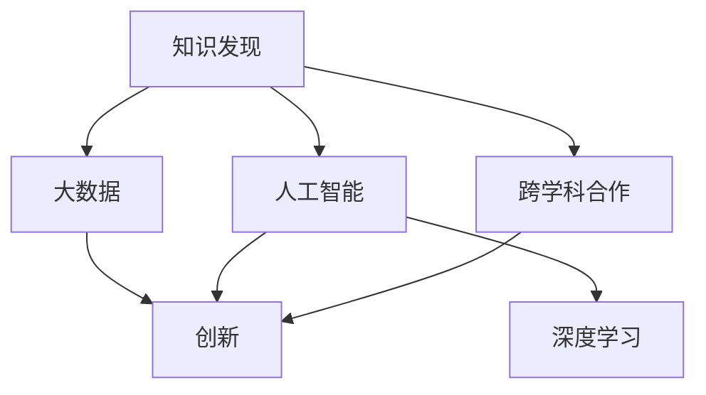

                 

# 推动知识发现与创新：人类计算的智力贡献

> 关键词：知识发现,创新,人类计算,大数据,深度学习,人工智能,应用落地,跨学科合作

## 1. 背景介绍

### 1.1 问题由来
在信息爆炸的数字化时代，知识的海量增长带来了前所未有的机会与挑战。如何高效地挖掘、存储、管理和利用知识，驱动科学发现和社会进步，成为了当代社会的热点话题。人类的计算能力在逐步提升，其智力贡献在不断增强，然而，面对纷繁复杂的世界，仅靠人工难以应对。因此，基于人类计算与人工智能的融合，推动知识发现与创新，成为了当前信息社会的重要课题。

### 1.2 问题核心关键点
知识发现与创新是一个复杂的过程，涉及到数据的收集、整理、分析和应用等环节。通过算法、模型和计算技术，能够对海量数据进行深入分析，发现潜在规律和关系，形成新的理论和方法。人工智能，特别是深度学习和大数据技术，为知识发现与创新提供了强有力的工具，但人类在其中的作用仍然不可或缺。

人工智能本身是依赖人类设计的，无论算法如何先进，其创新源泉仍来自于人类。因此，人类计算与人工智能的深度融合，不仅能提升数据处理的效率，更能赋予知识发现以更强的创新性和可解释性。

### 1.3 问题研究意义
研究人类计算在知识发现与创新中的作用，对于推动科学发现和社会进步，提升人类生活质量，具有重要的理论价值和实际意义：

1. 加速科学发现。通过人类计算与人工智能的结合，能够快速分析实验数据，验证科学假设，形成新的理论。
2. 推动经济增长。在生产、金融、教育等多个领域，通过高效的知识发现，实现资源优化和效率提升。
3. 促进社会治理。通过大数据分析，提升公共政策制定和执行的精准性，保障社会公平正义。
4. 增强文化传承。利用计算技术分析文化遗产数据，推动文化遗产的数字化和智能化保护。

## 2. 核心概念与联系

### 2.1 核心概念概述

为了更好地理解人类计算在知识发现与创新中的作用，本节将介绍几个密切相关的核心概念：

- **知识发现（Knowledge Discovery）**：从大量数据中自动地发现有用、新颖、可理解的模式或结构的过程。
- **创新（Innovation）**：通过知识的发现、分析与应用，形成新理论、新方法或新产品的过程。
- **人工智能（Artificial Intelligence, AI）**：通过计算机模拟人类智能的科学和技术，包括感知、学习、推理、决策等。
- **深度学习（Deep Learning）**：一种基于神经网络的机器学习技术，能够自动从数据中学习特征和模式。
- **大数据（Big Data）**：规模庞大、结构复杂、类型多样的数据集合，其处理分析涉及多学科交叉。
- **跨学科合作（Interdisciplinary Collaboration）**：不同学科的专家共同参与知识发现与创新项目，形成综合性解决方案。

这些概念之间的逻辑关系可以通过以下Mermaid流程图来展示：



这个流程图展示了一组核心概念之间的逻辑关系：

1. 知识发现通常基于大数据，借助人工智能和深度学习技术进行自动分析。
2. 人工智能，特别是深度学习，为知识发现提供了强大的计算工具。
3. 大数据和人工智能结合，形成了创新的基础。
4. 跨学科合作促进了知识发现和创新的协同发展。

这些概念共同构成了知识发现与创新的基础，通过科学的方法和技术手段，人类在知识海洋中不断探索未知领域。

## 3. 核心算法原理 & 具体操作步骤
### 3.1 算法原理概述

基于人类计算与人工智能的知识发现与创新过程，主要依赖于算法和模型。本节将详细介绍其原理和操作步骤。

### 3.2 算法步骤详解

知识发现与创新的基本步骤包括：数据准备、数据探索、数据建模、模型评估和结果应用。

**Step 1: 数据准备**
- 收集数据：根据研究目标，确定需要收集的数据类型和来源。
- 数据清洗：去除冗余、噪声和异常值，确保数据质量。
- 数据预处理：包括归一化、降维、特征工程等，为后续分析做准备。

**Step 2: 数据探索**
- 可视化：使用图表、热力图等工具，直观展示数据特征。
- 统计分析：计算均值、方差、相关性等统计指标，初步了解数据分布和关系。

**Step 3: 数据建模**
- 选择模型：根据数据特点和研究问题，选择合适的模型（如回归模型、分类模型、聚类模型等）。
- 训练模型：使用算法对数据进行训练，调整模型参数，优化模型性能。
- 验证模型：在验证集上进行测试，评估模型泛化能力。

**Step 4: 模型评估**
- 性能指标：使用准确率、召回率、F1分数等指标评估模型效果。
- 模型调试：根据评估结果，调整模型参数或选择新的模型。

**Step 5: 结果应用**
- 结果解释：通过可视化和文本报告，解释模型发现和分析结果。
- 应用落地：将知识应用于实际问题解决，形成新的解决方案和产品。

### 3.3 算法优缺点

基于人类计算与人工智能的知识发现与创新方法具有以下优点：

1. **高效性**：能够自动处理大规模数据，发现隐含规律和关系，节省大量人工时间。
2. **客观性**：避免人为偏见，提供基于数据事实的客观结论。
3. **可扩展性**：可以处理不同类型和规模的数据，具有广泛的应用场景。
4. **灵活性**：可以通过多种算法和模型进行综合分析，形成综合性解决方案。

同时，也存在以下局限性：

1. **数据依赖性**：依赖于高质量、高数量数据，数据缺失或错误会导致模型失效。
2. **模型复杂性**：复杂的模型需要大量计算资源和时间，难以解释和调试。
3. **泛化能力有限**：模型可能对新数据和新场景适应性不足，泛化能力有限。
4. **伦理和法律问题**：涉及隐私保护和数据安全，需要严格的法规约束。

尽管存在这些局限性，但就目前而言，基于人类计算与人工智能的知识发现与创新方法仍是最主流范式。未来相关研究的重点在于如何进一步降低数据依赖，提高模型的泛化能力和可解释性，同时兼顾伦理和安全等因素。

### 3.4 算法应用领域

基于知识发现与创新的算法，在各个领域都有广泛应用，例如：

- **科学研究**：通过分析实验数据，形成新的科学理论和假说。
- **金融领域**：通过大数据分析，发现市场规律，指导投资决策。
- **医疗健康**：通过分析病历和基因数据，辅助诊断和治疗。
- **电子商务**：通过用户行为分析，优化推荐算法，提升用户体验。
- **社会治理**：通过公共数据挖掘，改进政策制定和执行。
- **文化创意**：通过文化数据分析，推动文化遗产的数字化和智能化保护。

除了上述这些经典领域，人工智能在知识发现与创新中的作用还在不断拓展，如自动驾驶、智能制造、智能交通等，为社会的智能化进程注入新的动力。

## 4. 数学模型和公式 & 详细讲解 & 举例说明

### 4.1 数学模型构建

本节将使用数学语言对知识发现与创新的过程进行更加严格的刻画。

记数据集为 $D=\{(x_i,y_i)\}_{i=1}^N$，其中 $x_i$ 为特征向量，$y_i$ 为目标变量。知识发现与创新的目标是从数据中学习规律和关系，构建模型进行预测或分类。

定义模型 $M_{\theta}$ 为参数化的函数，其中 $\theta$ 为模型参数。模型的训练目标为最小化预测误差 $L(M_{\theta},D)$，即：

$$
\theta^* = \mathop{\arg\min}_{\theta} L(M_{\theta},D)
$$

常见的损失函数包括均方误差（MSE）、交叉熵（CE）、对数损失（LogLoss）等。

### 4.2 公式推导过程

以线性回归为例，推导最小二乘法的损失函数及其梯度：

假设模型 $M_{\theta}$ 为线性回归模型，形式如下：

$$
M_{\theta}(x) = \theta^Tx + b
$$

其中 $b$ 为截距，$x$ 为特征向量，$\theta$ 为模型参数。

根据均方误差损失函数 $L_{\text{MSE}}$：

$$
L_{\text{MSE}}(\theta) = \frac{1}{N} \sum_{i=1}^N (y_i - M_{\theta}(x_i))^2
$$

求导得到梯度：

$$
\nabla_{\theta}L_{\text{MSE}}(\theta) = \frac{2}{N} \sum_{i=1}^N (y_i - M_{\theta}(x_i))x_i
$$

通过梯度下降等优化算法更新参数 $\theta$，不断减小预测误差，直至收敛。

### 4.3 案例分析与讲解

以金融风控为例，分析如何利用知识发现与创新方法构建信用评分模型。

假设某金融公司需要构建一个基于历史贷款数据的信用评分模型，预测用户的信用风险。可以通过以下步骤：

1. **数据准备**：收集历史贷款数据，包括用户的个人信息、信用记录、还款情况等。
2. **数据探索**：使用可视化工具分析数据分布和相关性，识别关键特征和异常值。
3. **数据建模**：选择逻辑回归模型，构建信用评分模型。
4. **模型评估**：在验证集上评估模型性能，调整模型参数。
5. **结果应用**：将模型应用于新用户的信用评估，形成决策依据。

在具体实现时，可以利用Python和Scikit-learn库，编写如下代码：

```python
from sklearn.linear_model import LogisticRegression
from sklearn.model_selection import train_test_split
import pandas as pd

# 加载数据
data = pd.read_csv('loan_data.csv')

# 数据预处理
X = data.drop(['label'], axis=1)
y = data['label']

# 数据分割
X_train, X_val, y_train, y_val = train_test_split(X, y, test_size=0.2)

# 构建模型
model = LogisticRegression()

# 训练模型
model.fit(X_train, y_train)

# 评估模型
y_pred = model.predict(X_val)
print(classification_report(y_val, y_pred))

# 结果应用
new_data = pd.read_csv('new_loan_data.csv')
scores = model.score(new_data)
print("信用评分结果：", scores)
```

通过上述代码，我们可以看到，基于人类计算与人工智能的知识发现与创新方法，能够高效地构建信用评分模型，帮助金融公司评估新用户的信用风险，提升风险管理能力。

## 5. 项目实践：代码实例和详细解释说明
### 5.1 开发环境搭建

在进行知识发现与创新的实践前，我们需要准备好开发环境。以下是使用Python进行Scikit-learn开发的环境配置流程：

1. 安装Anaconda：从官网下载并安装Anaconda，用于创建独立的Python环境。

2. 创建并激活虚拟环境：
```bash
conda create -n scikit-env python=3.8 
conda activate scikit-env
```

3. 安装Scikit-learn：
```bash
conda install scikit-learn
```

4. 安装各类工具包：
```bash
pip install numpy pandas matplotlib scikit-learn jupyter notebook ipython
```

完成上述步骤后，即可在`scikit-env`环境中开始知识发现与创新的实践。

### 5.2 源代码详细实现

这里以信用评分模型为例，给出使用Scikit-learn库进行知识发现与创新的Python代码实现。

首先，定义数据处理函数：

```python
import pandas as pd

def load_data(file_path):
    data = pd.read_csv(file_path)
    return data
```

然后，定义模型训练和评估函数：

```python
from sklearn.linear_model import LogisticRegression
from sklearn.model_selection import train_test_split
from sklearn.metrics import classification_report

def train_model(model, X_train, y_train, X_val, y_val):
    model.fit(X_train, y_train)
    y_pred = model.predict(X_val)
    return classification_report(y_val, y_pred)
```

接着，定义数据预处理和模型训练流程：

```python
# 加载数据
data = load_data('loan_data.csv')

# 数据预处理
X = data.drop(['label'], axis=1)
y = data['label']

# 数据分割
X_train, X_val, y_train, y_val = train_test_split(X, y, test_size=0.2)

# 构建模型
model = LogisticRegression()

# 训练模型
train_report = train_model(model, X_train, y_train, X_val, y_val)

# 结果应用
new_data = pd.read_csv('new_loan_data.csv')
new_scores = model.score(new_data)
print("信用评分结果：", new_scores)
```

在上述代码中，我们首先定义了数据加载函数和模型训练函数，然后加载数据、分割数据集、构建模型、训练模型、评估模型性能，最后使用训练好的模型对新数据进行评分。

### 5.3 代码解读与分析

让我们再详细解读一下关键代码的实现细节：

**load_data函数**：
- 定义了数据加载函数，从CSV文件中读取数据。

**train_model函数**：
- 定义了模型训练函数，使用训练数据训练模型，在验证集上评估模型性能，并返回评估报告。

**数据预处理**：
- 使用`drop`方法去除无关特征，`read_csv`方法读取数据文件。

**模型训练**：
- 使用`train_test_split`方法将数据集分割为训练集和验证集。
- 使用`LogisticRegression`模型构建线性回归模型。
- 调用`train_model`函数训练模型，并打印评估报告。

**结果应用**：
- 加载新数据，使用训练好的模型对新数据进行评分。

通过上述代码，我们可以看到，知识发现与创新的过程可以通过Python和Scikit-learn库轻松实现。代码简洁高效，易于理解和调试。

## 6. 实际应用场景

### 6.1 金融风控

金融行业需要实时评估贷款和信用卡申请者的信用风险，防止违约和欺诈。传统的金融风控依赖于专家经验和规则，往往效率低下且不够精准。利用知识发现与创新方法，可以在海量数据中自动挖掘规律，构建精确的信用评分模型，提升金融风控能力。

在技术实现上，可以收集历史贷款和信用卡申请数据，构建特征向量，使用回归模型或决策树模型进行训练和评估，形成精准的信用评分系统。

### 6.2 医疗诊断

医疗诊断是一个典型的知识发现问题，需要从患者的病历数据中挖掘出有用的信息，辅助医生进行诊断和治疗。传统的医疗诊断依赖于医生的经验和直觉，容易受到个体差异和主观偏见的影响。利用知识发现与创新方法，可以自动分析病历数据，形成精确的诊断模型，提升医疗服务的质量和效率。

在技术实现上，可以收集患者的病历数据，构建特征向量，使用机器学习模型进行训练和评估，形成精准的诊断模型。

### 6.3 推荐系统

推荐系统是电商、视频、音乐等多个领域的核心功能，通过分析用户的行为数据，推荐用户感兴趣的商品或内容。传统的推荐系统依赖于简单的统计方法，难以满足个性化和多样化的需求。利用知识发现与创新方法，可以自动分析用户数据，构建精准的推荐模型，提升用户体验。

在技术实现上，可以收集用户的历史行为数据，构建特征向量，使用协同过滤、基于内容的推荐算法或深度学习模型进行训练和评估，形成精准的推荐系统。

### 6.4 未来应用展望

随着知识发现与创新方法的不断进步，其在各个领域的应用前景将更加广阔。

在智慧城市治理中，通过数据分析可以提升公共政策的制定和执行效率，优化资源配置，提升城市管理水平。

在环境保护中，利用数据分析可以监测环境污染，预测气候变化，推动可持续发展。

在教育领域，通过数据分析可以优化教学内容，提升教学效果，推动教育公平。

此外，在科研、农业、交通等多个领域，知识发现与创新方法都将发挥重要作用，推动社会的智能化和信息化进程。

## 7. 工具和资源推荐
### 7.1 学习资源推荐

为了帮助开发者系统掌握知识发现与创新的方法和实践，这里推荐一些优质的学习资源：

1. **《Python数据科学手册》**：本书全面介绍了Python在数据分析和机器学习中的应用，包括数据处理、模型训练和结果应用等。

2. **Coursera《机器学习》课程**：斯坦福大学开设的机器学习经典课程，内容涵盖算法、模型和应用等，是入门数据科学的必备资源。

3. **Kaggle**：全球最大的数据科学竞赛平台，提供丰富的数据集和实战案例，帮助开发者锻炼数据分析和模型构建能力。

4. **Scikit-learn官方文档**：Scikit-learn库的官方文档，提供了完整的API参考和案例代码，是实践知识发现与创新的重要工具。

5. **DeepLearning.AI官方课程**：由Andrew Ng教授领导的深度学习课程，涵盖深度学习的基本概念和应用，适合深入学习。

通过对这些资源的学习实践，相信你一定能够快速掌握知识发现与创新的方法，并用于解决实际的业务问题。

### 7.2 开发工具推荐

高效的开发离不开优秀的工具支持。以下是几款用于知识发现与创新开发的常用工具：

1. **Python**：灵活的编程语言，具有丰富的数据处理和机器学习库。

2. **Scikit-learn**：Python的数据分析和机器学习库，提供了丰富的模型和算法支持。

3. **TensorFlow**：谷歌开发的深度学习框架，支持大规模分布式训练。

4. **Keras**：高级深度学习框架，易于上手，适合快速原型开发。

5. **Jupyter Notebook**：交互式编程环境，适合数据探索和模型训练。

6. **PyTorch**：灵活的深度学习框架，支持动态图和静态图计算。

合理利用这些工具，可以显著提升知识发现与创新的开发效率，加速创新迭代的步伐。

### 7.3 相关论文推荐

知识发现与创新技术的发展源于学界的持续研究。以下是几篇奠基性的相关论文，推荐阅读：

1. **《PAC-Bayesian Online Learning and the Explore/Exploit Dilemma》**：提出PAC-Bayesian框架，通过在线学习解决探索/利用困境。

2. **《Deep Learning》**：深度学习领域的经典书籍，全面介绍了深度学习的基本概念和应用。

3. **《Graph Neural Networks》**：介绍图神经网络在知识图谱构建和关系推理中的应用。

4. **《Knowledge Discovery in Databases》**：国际顶级会议KDD的年度综述，涵盖最新的知识发现和数据挖掘研究成果。

5. **《The Surprising Usefulness of Transfer Learning》**：探讨了迁移学习在知识发现中的作用，展示了其在多个任务上的应用效果。

这些论文代表了大数据与人工智能结合的方向，为知识发现与创新的发展提供了理论指导和实践案例。

## 8. 总结：未来发展趋势与挑战
### 8.1 研究成果总结

本文对知识发现与创新的过程进行了全面系统的介绍。首先阐述了知识发现与创新的研究背景和意义，明确了其在推动科学发现和社会进步中的重要性。其次，从原理到实践，详细讲解了知识发现与创新的数学模型和操作步骤，给出了知识发现与创新的完整代码实例。同时，本文还广泛探讨了知识发现与创新方法在金融风控、医疗诊断、推荐系统等多个领域的应用前景，展示了其在各个行业的广泛应用。此外，本文精选了知识发现与创新技术的各类学习资源，力求为读者提供全方位的技术指引。

通过本文的系统梳理，可以看到，基于人类计算与人工智能的知识发现与创新方法正在成为数据处理和科学发现的强大工具，极大地提升了数据处理的效率和科学研究的创新性。未来，伴随人工智能技术的不断进步，知识发现与创新方法将在更多领域得到应用，为社会的智能化和信息化进程带来新的动力。

### 8.2 未来发展趋势

展望未来，知识发现与创新技术将呈现以下几个发展趋势：

1. **深度学习与跨学科融合**：深度学习与计算机科学、数学、统计学等学科的融合将更加深入，推动知识发现与创新方法的发展。

2. **分布式计算与云计算**：分布式计算和云计算将为大规模数据处理提供更强的计算能力和存储能力，支持大规模知识发现与创新。

3. **自适应学习与元学习**：自适应学习与元学习技术将使知识发现与创新方法能够根据数据特点和任务需求进行动态调整和优化。

4. **跨模态数据融合**：多模态数据的融合将使知识发现与创新方法能够更好地理解复杂现实世界，提升模型表现。

5. **知识图谱与语义网络**：知识图谱和语义网络技术将使知识发现与创新方法具备更强的语义理解和推理能力。

6. **智能决策支持**：知识发现与创新方法将与智能决策系统结合，提升决策的精准性和智能性。

以上趋势凸显了知识发现与创新技术的广阔前景。这些方向的探索发展，必将进一步提升数据处理的效率和科学研究的创新性，为社会的智能化和信息化进程注入新的动力。

### 8.3 面临的挑战

尽管知识发现与创新技术已经取得了瞩目成就，但在迈向更加智能化、普适化应用的过程中，仍面临诸多挑战：

1. **数据质量与完整性**：高质量、完整的数据是知识发现与创新的基础，数据缺失或不准确将影响模型的性能。

2. **模型复杂性与可解释性**：复杂的模型难以解释，难以保证模型的透明性和可理解性。

3. **泛化能力与迁移能力**：模型在新数据和新场景下的泛化能力有限，跨领域的迁移能力有待提升。

4. **计算资源与成本**：大规模数据处理需要强大的计算资源和成本投入，数据存储和传输也面临挑战。

5. **隐私与安全**：大规模数据处理涉及隐私保护和数据安全问题，需要严格的数据保护法规和措施。

6. **伦理与法律**：知识发现与创新涉及伦理与法律问题，需要考虑数据使用的合法性和公平性。

正视知识发现与创新技术面临的这些挑战，积极应对并寻求突破，将使知识发现与创新方法在更多领域得到应用，推动社会的智能化和信息化进程。

### 8.4 研究展望

面对知识发现与创新技术面临的挑战，未来的研究需要在以下几个方面寻求新的突破：

1. **数据融合与数据增强**：开发数据融合与数据增强技术，提升数据质量和完整性，优化数据预处理流程。

2. **模型简化与解释**：简化模型结构，增强模型的可解释性，提升模型的透明性和可信度。

3. **知识图谱与语义网络**：发展知识图谱和语义网络技术，提升模型的语义理解和推理能力，提升模型的泛化能力和迁移能力。

4. **分布式计算与云计算**：开发分布式计算与云计算技术，支持大规模数据处理和存储，提升知识发现与创新的计算效率。

5. **自适应学习与元学习**：开发自适应学习与元学习技术，使知识发现与创新方法能够根据数据特点和任务需求进行动态调整和优化。

6. **跨学科合作与协同创新**：加强跨学科合作，推动知识发现与创新方法的协同发展，形成综合性解决方案。

这些研究方向的探索，必将引领知识发现与创新技术迈向更高的台阶，为社会的智能化和信息化进程提供更加强大、可靠的技术支撑。

## 9. 附录：常见问题与解答

**Q1：知识发现与创新是否适用于所有领域？**

A: 知识发现与创新技术在各个领域都有广泛应用，特别是对于数据密集型和知识密集型领域，如金融、医疗、科研等，能够显著提升数据处理和科学研究的效率。但对于一些特定领域，如社会治理、文化创意等，其应用可能存在一定的局限性。

**Q2：知识发现与创新过程中如何选择合适的算法？**

A: 选择算法需要根据数据特点和任务需求进行综合考虑。常见的算法包括回归算法、分类算法、聚类算法、关联规则算法等。一般建议先进行数据探索和可视化，根据数据分布和任务需求选择合适的算法。

**Q3：知识发现与创新过程中如何评估模型性能？**

A: 模型评估需要结合具体任务和应用场景，使用准确率、召回率、F1分数等指标评估模型效果。同时，可以使用混淆矩阵、ROC曲线等工具可视化模型性能。

**Q4：知识发现与创新过程中如何处理数据缺失和噪声？**

A: 处理数据缺失和噪声是知识发现与创新的重要步骤。可以使用插值方法、均值填补等方法处理数据缺失，使用滤波器、平滑算法等方法处理数据噪声。

**Q5：知识发现与创新过程中如何提高模型的泛化能力？**

A: 提高模型泛化能力需要从数据准备、模型选择、参数调优等多个方面进行综合考虑。可以使用数据增强、正则化、集成学习等方法提高模型的泛化能力。

这些常见问题及其解答，可以帮助开发者更好地理解知识发现与创新的过程，并应用于实际的业务问题中。

