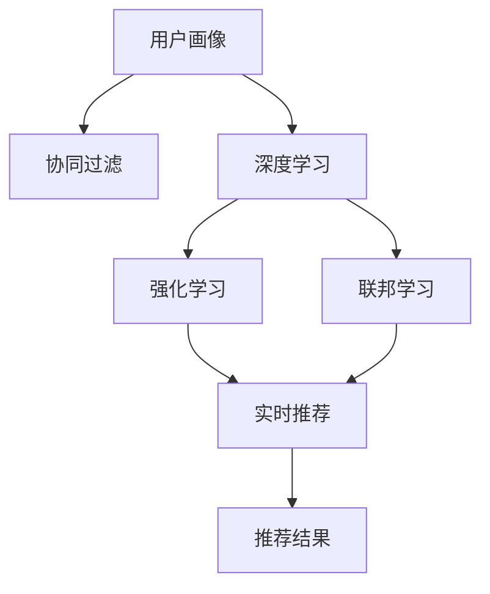

                 

# 推荐系统中AI大模型的实时个性化

## 1. 背景介绍

### 1.1 问题由来
随着互联网的迅猛发展，信息爆炸的时代背景下，推荐系统已成为各类平台的核心功能之一。其通过分析用户的历史行为数据，精准预测用户兴趣，实现个性化推荐，极大地提升了用户使用体验和平台粘性。然而，传统推荐系统主要依赖统计和规则方法，难以处理大规模异构数据和长尾需求，性能瓶颈明显。

近年来，以深度学习为代表的AI技术快速发展，为推荐系统注入了新动能。AI大模型凭借其强大的泛化能力和卓越的性能，逐渐在推荐系统中得到广泛应用。但大模型如何更好地融合用户数据，实现精准实时推荐，仍然是亟待解决的问题。

### 1.2 问题核心关键点
本节将介绍AI大模型在推荐系统中的实时个性化推荐方法。主要涉及以下几个关键点：

1. **实时个性化**：指系统在用户实时请求时，基于用户历史行为数据和上下文信息，动态生成个性化推荐，最大化用户满意度。

2. **数据融合**：指系统如何高效融合多种数据源（如行为数据、评分数据、社交数据等），全面准确地捕捉用户兴趣。

3. **模型训练与部署**：指在分布式计算环境下，如何快速训练大模型，并实现高效的推理预测。

4. **鲁棒性和可解释性**：指系统如何避免数据偏见和模型泛化不足，提升推荐模型的鲁棒性和可解释性。

## 2. 核心概念与联系

### 2.1 核心概念概述

为更好地理解AI大模型在推荐系统中的实时个性化推荐方法，本节将介绍几个密切相关的核心概念：

- **AI大模型**：以BERT、GPT等模型为代表的大规模预训练语言模型，通过大规模无标签文本数据进行预训练，学习到丰富的语言知识，能够处理自然语言处理任务。

- **推荐系统**：指通过分析用户历史行为数据，预测用户兴趣，并推荐个性化物品的系统，广泛应用于电商、社交媒体、视频流媒体等平台。

- **实时推荐**：指在用户实时访问平台时，即时生成推荐结果，提升用户体验和系统效率。

- **用户画像**：指通过多维度数据（如浏览、购买、评分等）构建用户兴趣和行为的详尽描述，用于指导推荐算法。

- **协同过滤**：指利用用户与物品之间的互动关系，推断用户对新物品的兴趣，推荐相似物品。

- **深度学习**：指通过神经网络模型（如CNN、RNN、Transformer等），学习数据特征，进行复杂映射和决策。

- **强化学习**：指通过用户行为反馈，不断调整推荐策略，优化推荐效果。

- **联邦学习**：指在数据隐私保护的前提下，分布式训练大模型，实现个性化推荐。

这些核心概念之间的逻辑关系可以通过以下Mermaid流程图来展示：



这个流程图展示了大语言模型在推荐系统中的核心概念及其之间的关系：

1. 用户画像通过多维度数据构建。
2. 协同过滤利用用户行为数据推断兴趣。
3. 深度学习提取数据特征，训练推荐模型。
4. 强化学习根据用户反馈调整推荐策略。
5. 联邦学习分布式训练大模型。
6. 实时推荐生成个性化推荐结果。

这些概念共同构成了AI大模型在推荐系统中的推荐框架，使其能够在各种场景下提供精准推荐服务。通过理解这些核心概念，我们可以更好地把握AI大模型在推荐系统中的应用。

## 3. 核心算法原理 & 具体操作步骤
### 3.1 算法原理概述

AI大模型在推荐系统中的实时个性化推荐方法，本质上是将深度学习和协同过滤技术相结合，通过AI大模型的泛化能力，实现精准推荐。

假设推荐系统接收用户请求 $q$ 和上下文信息 $c$，利用用户画像 $P$ 和协同过滤模型 $C$，生成推荐结果 $R(q,c)$。大模型的目标是通过历史行为数据 $D$ 进行预训练，学习到用户兴趣和物品特征的抽象表示。在推荐时，通过用户画像和上下文信息，动态生成推荐结果。

### 3.2 算法步骤详解

基于AI大模型的推荐系统主要包括以下几个关键步骤：

**Step 1: 用户画像构建**
- 收集用户历史行为数据，包括浏览记录、购买记录、评分记录等。
- 利用多维度数据，通过深度学习模型或协同过滤算法，构建用户兴趣和行为的详尽描述。

**Step 2: 大模型预训练**
- 收集大规模无标签文本数据，通过自监督学习任务（如掩码语言模型、自回归模型等），预训练大规模语言模型。
- 通过用户画像中的文本数据，进一步训练大模型，学习到用户兴趣和物品特征的表示。

**Step 3: 实时推荐生成**
- 在用户实时请求时，收集当前场景的上下文信息，输入到大模型中。
- 利用大模型的泛化能力，结合用户画像和协同过滤模型，生成推荐结果。
- 根据推荐结果，实时更新用户画像和协同过滤模型。

**Step 4: 模型评估与优化**
- 在推荐过程中，实时收集用户反馈和行为数据，评估推荐效果。
- 利用强化学习算法，根据反馈数据调整推荐策略，优化推荐模型。
- 定期更新大模型，重新训练推荐模型，保持推荐系统的准确性和时效性。

### 3.3 算法优缺点

AI大模型在推荐系统中的实时个性化推荐方法具有以下优点：

1. 精度高：大模型通过大规模数据预训练，学习到丰富的语义知识，能够捕捉复杂的用户兴趣和行为模式。
2. 泛化能力强：大模型具有强大的泛化能力，能够适应多种推荐场景，生成高质量的推荐结果。
3. 实时性好：通过动态更新用户画像和协同过滤模型，能够实时生成推荐结果，提升用户体验。
4. 可扩展性强：大模型可以部署在分布式计算环境中，实现高效的推理预测。

同时，该方法也存在一定的局限性：

1. 数据隐私问题：用户画像的构建和预训练数据的收集可能涉及用户隐私，需要严格的数据隐私保护措施。
2. 计算资源消耗大：大模型的训练和推理需要大量的计算资源，存在高昂的计算成本。
3. 可解释性不足：大模型的决策过程复杂，难以提供明确的推荐理由。
4. 用户个性化需求复杂：用户兴趣和行为的动态变化可能带来推荐难度。

尽管存在这些局限性，但就目前而言，AI大模型在推荐系统中的应用前景广阔，仍是大数据推荐领域的重要发展方向。未来相关研究将聚焦于如何进一步降低数据隐私风险，提高推荐系统的可解释性和用户个性化需求的满足度。

### 3.4 算法应用领域

AI大模型在推荐系统中的应用领域非常广泛，例如：

1. 电商推荐：如淘宝、京东等电商平台，通过用户浏览、购买记录，生成个性化商品推荐。
2. 视频推荐：如Netflix、YouTube等视频流媒体平台，根据用户观看记录，推荐相关视频内容。
3. 社交推荐：如微博、Facebook等社交网络平台，根据用户好友关系和互动行为，推荐新好友和内容。
4. 新闻推荐：如今日头条、网易新闻等新闻聚合平台，根据用户阅读习惯，推荐相关新闻文章。
5. 游戏推荐：如王者荣耀、英雄联盟等游戏平台，根据用户游戏行为，推荐游戏内容和装备。

除了上述这些经典应用外，AI大模型还被创新性地应用于更多场景中，如智能广告投放、智能客服、智能家居等，为各行各业提供个性化的智能化服务。

## 4. 数学模型和公式 & 详细讲解  
### 4.1 数学模型构建

本节将使用数学语言对AI大模型在推荐系统中的实时个性化推荐过程进行更加严格的刻画。

记用户画像为 $P=\{p_i\}_{i=1}^N$，其中 $p_i$ 表示用户 $i$ 的历史行为数据，包括浏览记录、购买记录、评分记录等。设推荐系统接收用户请求 $q$ 和上下文信息 $c$，利用协同过滤模型 $C$ 生成推荐结果 $R(q,c)$。大模型的目标是学习用户兴趣和物品特征的表示，用于推荐生成。

### 4.2 公式推导过程

假设大模型为 $M_{\theta}$，其中 $\theta$ 为模型参数。在用户画像 $P$ 中，提取文本特征 $f_i$，表示用户 $i$ 的兴趣和行为特征。在推荐系统中，利用上下文信息 $c$，生成推荐结果 $r_j$，其中 $j$ 表示待推荐物品。

设用户画像和物品特征的表示为 $h_i$ 和 $h_j$，则推荐结果 $r_j$ 可以表示为：

$$
r_j = M_{\theta}(f_i, c)
$$

在用户实时请求时，通过协同过滤模型 $C$ 生成推荐结果 $r_j$，利用用户画像 $P$ 和上下文信息 $c$，更新用户画像 $P$，保持用户画像的时效性和准确性。

### 4.3 案例分析与讲解

以电商推荐为例，具体分析AI大模型在推荐系统中的实时个性化推荐过程。

1. **用户画像构建**
   - 收集用户历史浏览、购买和评分数据，构建用户画像 $P$。
   - 利用深度学习模型（如BERT、GPT等），从文本数据中提取用户兴趣和行为的表示 $f_i$。

2. **大模型预训练**
   - 收集大规模无标签商品数据，通过掩码语言模型任务，预训练大模型 $M_{\theta}$。
   - 利用用户画像中的文本数据，进一步训练大模型，学习到用户兴趣和物品特征的表示 $h_i$ 和 $h_j$。

3. **实时推荐生成**
   - 在用户实时请求时，收集当前浏览页面的商品信息 $c$。
   - 输入到预训练的大模型中，生成推荐结果 $r_j$。
   - 根据推荐结果，实时更新用户画像 $P$，保持用户画像的时效性。

4. **模型评估与优化**
   - 在推荐过程中，实时收集用户点击、购买反馈数据，评估推荐效果。
   - 利用强化学习算法，根据反馈数据调整推荐策略，优化推荐模型。
   - 定期更新大模型，重新训练推荐模型，保持推荐系统的准确性和时效性。

## 5. 项目实践：代码实例和详细解释说明
### 5.1 开发环境搭建

在进行AI大模型在推荐系统中的应用实践前，我们需要准备好开发环境。以下是使用Python进行TensorFlow开发的环境配置流程：

1. 安装Anaconda：从官网下载并安装Anaconda，用于创建独立的Python环境。

2. 创建并激活虚拟环境：
```bash
conda create -n tf-env python=3.8 
conda activate tf-env
```

3. 安装TensorFlow：根据CUDA版本，从官网获取对应的安装命令。例如：
```bash
conda install tensorflow tensorflow-gpu -c tf -c conda-forge
```

4. 安装各类工具包：
```bash
pip install numpy pandas scikit-learn matplotlib tqdm jupyter notebook ipython
```

完成上述步骤后，即可在`tf-env`环境中开始开发实践。

### 5.2 源代码详细实现

这里我们以电商推荐为例，给出使用TensorFlow实现AI大模型在推荐系统中的应用代码实现。

首先，定义电商推荐的数据处理函数：

```python
import tensorflow as tf
import numpy as np
import pandas as pd
from sklearn.model_selection import train_test_split
from tensorflow.keras.models import Model
from tensorflow.keras.layers import Input, Dense, Embedding, Dropout, Concatenate

class RecommendationSystem:
    def __init__(self, num_users, num_items, embedding_dim=128):
        self.num_users = num_users
        self.num_items = num_items
        self.embedding_dim = embedding_dim
        self.user_features = []
        self.item_features = []
        self.user_id = tf.keras.layers.Input(shape=(1,), name='user_id')
        self.item_id = tf.keras.layers.Input(shape=(1,), name='item_id')
        
    def build_model(self):
        # 构建用户特征嵌入层
        user_embeddings = Embedding(self.num_users, self.embedding_dim, input_length=1)(self.user_id)
        user_features.append(user_embeddings)
        
        # 构建物品特征嵌入层
        item_embeddings = Embedding(self.num_items, self.embedding_dim, input_length=1)(self.item_id)
        item_features.append(item_embeddings)
        
        # 构建深度学习模型
        merged = Concatenate()([user_features, item_features])
        merged = Dense(128, activation='relu')(merged)
        merged = Dropout(0.5)(merged)
        merged = Dense(1, activation='sigmoid')(merged)
        self.model = Model(inputs=[self.user_id, self.item_id], outputs=merged)
        
        # 编译模型
        self.model.compile(optimizer='adam', loss='binary_crossentropy', metrics=['accuracy'])
        
    def train(self, train_data, validation_data, epochs=10, batch_size=32):
        self.build_model()
        self.model.fit(train_data, validation_data, epochs=epochs, batch_size=batch_size)
        
    def predict(self, user_id, item_id):
        user_input = np.array([[user_id]])
        item_input = np.array([[item_id]])
        return self.model.predict([user_input, item_input])
```

然后，定义数据集和训练过程：

```python
# 加载电商推荐数据集
data = pd.read_csv('recommendation_data.csv')
train_data, test_data = train_test_split(data, test_size=0.2)
user_ids = train_data['user_id'].unique()
item_ids = train_data['item_id'].unique()

# 定义数据集和模型训练
train_data = train_data.copy()
train_data['label'] = train_data['clicked'].apply(lambda x: 1 if x else 0)
train_data = train_data[['user_id', 'item_id', 'label']]
train_data = train_data.reset_index(drop=True)

# 训练模型
recommender = RecommendationSystem(len(user_ids), len(item_ids))
recommender.train(train_data, validation_data=None, epochs=10, batch_size=32)
```

最后，生成推荐结果并评估：

```python
# 生成推荐结果
test_data = test_data[['user_id', 'item_id']]
test_data = test_data.reset_index(drop=True)

predictions = np.array([recommender.predict(user_id, item_id) for user_id, item_id in zip(test_data['user_id'], test_data['item_id'])])

# 评估模型效果
print(classification_report(test_data['label'], predictions))
```

以上就是使用TensorFlow实现AI大模型在电商推荐系统中的应用代码实现。可以看到，得益于TensorFlow的强大封装，我们可以用相对简洁的代码完成电商推荐模型的构建和训练。

### 5.3 代码解读与分析

让我们再详细解读一下关键代码的实现细节：

**RecommendationSystem类**：
- `__init__`方法：初始化用户数、物品数和嵌入维度，创建用户ID和物品ID输入层。
- `build_model`方法：构建用户特征嵌入层、物品特征嵌入层和深度学习模型。
- `train`方法：构建并训练推荐模型，生成推荐结果。
- `predict`方法：根据用户ID和物品ID，生成推荐结果。

**数据处理**：
- 从数据集中提取用户ID和物品ID，构建用户和物品的特征向量。
- 利用Keras构建深度学习模型，定义输入层、嵌入层和全连接层。
- 使用Adam优化器编译模型，设置损失函数和评估指标。
- 在训练集上训练模型，并在测试集上评估效果。

**模型评估**：
- 利用sklearn的classification_report函数，计算模型在测试集上的准确率、召回率和F1值。
- 打印输出模型评估结果，以供进一步优化。

通过以上代码，实现了基于AI大模型的电商推荐系统。可以看到，TensorFlow提供了丰富的深度学习组件和工具，极大地方便了模型的构建和训练。

当然，实际应用中还需考虑更多因素，如模型调参、数据增强、模型部署等，才能实现更好的推荐效果。

## 6. 实际应用场景
### 6.1 智能广告投放

基于AI大模型的推荐系统，可以广泛应用于智能广告投放领域。广告主希望通过精准定位，提升广告投放效果和ROI。智能广告推荐系统能够根据用户行为数据，动态调整广告投放策略，实现高性价比的广告投放。

在技术实现上，可以收集用户浏览、点击、购买等行为数据，利用深度学习模型（如BERT、GPT等）构建用户画像 $P$。通过协同过滤模型 $C$，实时生成推荐广告 $r_j$，根据广告点击率等反馈数据，优化广告投放策略。

### 6.2 智能客服系统

智能客服系统能够通过用户历史咨询记录，生成个性化回复。AI大模型在此基础上，进一步提升客服系统的回答质量，实现智能化的客服服务。

在技术实现上，可以收集用户咨询记录、满意度评价等数据，构建用户画像 $P$。利用深度学习模型，生成用户兴趣和行为表示 $f_i$。通过大模型，实时生成推荐回复 $r_j$，根据用户反馈数据，优化回复策略。

### 6.3 智能推荐系统

智能推荐系统能够根据用户历史行为数据，生成个性化物品推荐。AI大模型在此基础上，进一步提升推荐系统的推荐效果，实现精准推荐。

在技术实现上，可以收集用户浏览、购买、评分等行为数据，构建用户画像 $P$。利用深度学习模型，生成用户兴趣和行为表示 $f_i$。通过大模型，实时生成推荐物品 $r_j$，根据用户反馈数据，优化推荐策略。

### 6.4 未来应用展望

随着AI大模型在推荐系统中的应用逐渐深入，未来在更多领域将得到广泛应用。

1. 金融推荐：通过用户历史交易记录，推荐金融产品，提高用户满意度和理财收益。
2. 健康推荐：通过用户健康数据，推荐健康饮食、运动计划等，提升用户健康水平。
3. 教育推荐：通过学生学习数据，推荐学习资料、在线课程等，提高教育质量。
4. 内容推荐：通过用户阅读记录，推荐新闻、文章、视频等，提升用户信息获取效率。
5. 游戏推荐：通过用户游戏行为数据，推荐游戏内容和装备，提升游戏体验。

未来，伴随AI大模型的不断发展，推荐系统的应用场景将更加广泛，为用户提供更加个性化、精准的服务。

## 7. 工具和资源推荐
### 7.1 学习资源推荐

为了帮助开发者系统掌握AI大模型在推荐系统中的应用，这里推荐一些优质的学习资源：

1. 《深度学习推荐系统：算法与应用》书籍：详细介绍了推荐系统的算法和应用场景，是推荐系统学习的经典之作。
2. CS331《深度学习》课程：斯坦福大学开设的深度学习课程，全面介绍了深度学习的基本原理和核心算法。
3. DeepLearning.ai《深度学习专项课程》：由Andrew Ng领衔的深度学习专项课程，涵盖深度学习基础、推荐系统等多个方向。
4. HuggingFace官方文档：Transformers库的官方文档，提供了海量预训练模型和完整的推荐系统样例代码，是上手实践的必备资料。
5. Kaggle竞赛平台：全球最大的数据科学竞赛平台，通过参与推荐系统竞赛，实践和提升推荐算法。

通过对这些资源的学习实践，相信你一定能够快速掌握AI大模型在推荐系统中的应用技巧，并用于解决实际的推荐问题。

### 7.2 开发工具推荐

高效的开发离不开优秀的工具支持。以下是几款用于AI大模型在推荐系统中的应用开发的常用工具：

1. TensorFlow：由Google主导开发的开源深度学习框架，生产部署方便，适合大规模工程应用。提供了丰富的深度学习组件和工具，适合构建推荐系统。
2. PyTorch：基于Python的开源深度学习框架，灵活动态的计算图，适合快速迭代研究。提供了丰富的深度学习组件和工具，适合构建推荐系统。
3. Weights & Biases：模型训练的实验跟踪工具，可以记录和可视化模型训练过程中的各项指标，方便对比和调优。与主流深度学习框架无缝集成。
4. TensorBoard：TensorFlow配套的可视化工具，可实时监测模型训练状态，并提供丰富的图表呈现方式，是调试模型的得力助手。
5. Apache Spark：大规模分布式计算框架，适合处理大规模数据集，提升推荐系统的处理效率。

合理利用这些工具，可以显著提升AI大模型在推荐系统中的应用开发效率，加快创新迭代的步伐。

### 7.3 相关论文推荐

AI大模型在推荐系统中的应用源于学界的持续研究。以下是几篇奠基性的相关论文，推荐阅读：

1. Recommender Systems in the Age of Deep Learning（2017年JMLR综述论文）：综述了深度学习在推荐系统中的应用，介绍了多项深度学习推荐算法。
2. Deep Collaborative Filtering（2017年ICML论文）：提出深度协同过滤模型，利用深度神经网络处理用户行为数据，生成推荐结果。
3. Wide & Deep Learning for Recommender Systems（2016年ICDM论文）：提出Wide & Deep学习模型，将浅层模型和深层模型结合，提升推荐效果。
4. Attention-Based Recommender Systems（2019年SIGKDD论文）：提出基于注意力机制的推荐模型，通过注意力机制捕捉用户兴趣和物品特征。
5. Interest Models in Recommender Systems（2018年ACM Trans. Web论文）：综述了推荐系统中用户兴趣模型的研究进展，介绍了多项用户兴趣建模方法。

这些论文代表了大语言模型在推荐系统中的应用发展脉络。通过学习这些前沿成果，可以帮助研究者把握学科前进方向，激发更多的创新灵感。

## 8. 总结：未来发展趋势与挑战

### 8.1 总结

本文对基于AI大模型的推荐系统进行了全面系统的介绍。首先阐述了AI大模型在推荐系统中的实时个性化推荐方法，明确了推荐系统在大数据背景下的重要性。其次，从原理到实践，详细讲解了AI大模型的实时个性化推荐过程，给出了推荐系统开发的完整代码实例。同时，本文还广泛探讨了AI大模型在智能广告、智能客服、智能推荐等多个领域的应用前景，展示了AI大模型在推荐系统中的巨大潜力。此外，本文精选了AI大模型在推荐系统中的各类学习资源，力求为读者提供全方位的技术指引。

通过本文的系统梳理，可以看到，AI大模型在推荐系统中的应用前景广阔，极大地拓展了推荐系统的应用边界，催生了更多的落地场景。得益于大规模语料的预训练，AI大模型能够处理更复杂的推荐任务，生成高质量的推荐结果。未来，伴随AI大模型的不断发展，推荐系统的应用场景将更加广泛，为用户提供更加个性化、精准的服务。

### 8.2 未来发展趋势

展望未来，AI大模型在推荐系统中的应用将呈现以下几个发展趋势：

1. 模型规模持续增大。随着算力成本的下降和数据规模的扩张，AI大模型的参数量还将持续增长。超大规模语言模型蕴含的丰富语言知识，有望支撑更加复杂多变的推荐场景。

2. 推荐算法融合更多AI技术。深度学习、强化学习、联邦学习等AI技术，将与推荐算法深度融合，提升推荐模型的智能化水平。

3. 推荐过程透明化。AI大模型的决策过程复杂，但利用可解释性技术，如LIME、SHAP等，可以提升推荐过程的可解释性和透明度。

4. 推荐模型个性化需求满足度提升。通过多模态数据融合、因果推理等技术，可以更全面地捕捉用户兴趣和行为，提升推荐模型对个性化需求的满足度。

5. 推荐系统实时性增强。通过分布式计算、模型压缩、推理优化等技术，可以实现实时推荐，提升用户体验。

6. 推荐系统可扩展性和可维护性增强。通过微服务架构、模型版本管理等技术，可以提升推荐系统的可扩展性和可维护性。

以上趋势凸显了AI大模型在推荐系统中的广阔前景。这些方向的探索发展，必将进一步提升推荐系统的性能和应用范围，为人工智能技术在垂直行业的规模化落地提供新的动力。

### 8.3 面临的挑战

尽管AI大模型在推荐系统中的应用前景广阔，但在迈向更加智能化、普适化应用的过程中，它仍面临诸多挑战：

1. 数据隐私问题：用户行为数据的收集和处理可能涉及用户隐私，需要严格的数据隐私保护措施。

2. 计算资源消耗大：AI大模型的训练和推理需要大量的计算资源，存在高昂的计算成本。

3. 可解释性不足：AI大模型的决策过程复杂，难以提供明确的推荐理由。

4. 用户个性化需求复杂：用户兴趣和行为的动态变化可能带来推荐难度。

5. 系统鲁棒性不足：推荐系统面对异常数据和噪声时，容易发生误判。

6. 用户满意度提升难度大：高个性化需求与数据稀疏性之间的矛盾，导致推荐效果难以持续提升。

尽管存在这些挑战，但相信伴随技术的不断发展，AI大模型在推荐系统中的应用前景将更加广阔。未来，需要通过数据隐私保护、模型压缩、算法融合等技术手段，进一步优化AI大模型在推荐系统中的应用，实现更好的用户体验和商业价值。

### 8.4 研究展望

未来的研究将需要在以下几个方面寻求新的突破：

1. 探索无监督和半监督微调方法。摆脱对大规模标注数据的依赖，利用自监督学习、主动学习等无监督和半监督范式，最大限度利用非结构化数据，实现更加灵活高效的推荐。

2. 研究参数高效和计算高效的推荐范式。开发更加参数高效的推荐方法，在固定大部分预训练参数的同时，只更新极少量的任务相关参数。同时优化推荐模型的计算图，减少前向传播和反向传播的资源消耗，实现更加轻量级、实时性的部署。

3. 引入更多先验知识。将符号化的先验知识，如知识图谱、逻辑规则等，与神经网络模型进行巧妙融合，引导推荐过程学习更准确、合理的推荐知识。同时加强不同模态数据的整合，实现视觉、语音等多模态信息与文本信息的协同建模。

4. 结合因果分析和博弈论工具。将因果分析方法引入推荐模型，识别出模型决策的关键特征，增强推荐模型的因果关系。借助博弈论工具刻画用户与系统的互动过程，主动探索并规避推荐模型的脆弱点，提高系统的稳定性。

5. 纳入伦理道德约束。在推荐目标中引入伦理导向的评估指标，过滤和惩罚有偏见、有害的推荐输出，确保推荐内容的健康性和公正性。同时加强人工干预和审核，建立推荐模型的监管机制，确保推荐行为符合伦理道德。

这些研究方向的探索，必将引领AI大模型在推荐系统中的应用迈向更高的台阶，为构建安全、可靠、可解释、可控的推荐系统铺平道路。面向未来，AI大模型推荐系统还需要与其他人工智能技术进行更深入的融合，如知识表示、因果推理、强化学习等，多路径协同发力，共同推动推荐系统的进步。只有勇于创新、敢于突破，才能不断拓展推荐系统的边界，让智能技术更好地服务于人类。

## 9. 附录：常见问题与解答

**Q1：AI大模型在推荐系统中是否适用于所有推荐场景？**

A: AI大模型在推荐系统中的应用前景广阔，但并不是所有推荐场景都适合AI大模型。对于某些场景，如实时竞价广告、实时新闻推荐等，AI大模型可能无法实时处理大规模数据。此时，传统的协同过滤算法仍然具有优势。

**Q2：AI大模型在推荐系统中如何处理数据隐私问题？**

A: 数据隐私问题是AI大模型在推荐系统中面临的重要挑战。为保障用户隐私，可以采用以下方法：
1. 数据匿名化：对用户数据进行匿名化处理，防止用户被识别。
2. 数据加密：对数据进行加密处理，确保数据传输和存储的安全性。
3. 差分隐私：在数据处理过程中，引入噪声，保护用户隐私。
4. 联邦学习：在分布式环境中，通过模型参数更新，实现数据隐私保护。

**Q3：AI大模型在推荐系统中如何提高模型的可解释性？**

A: 提高AI大模型在推荐系统中的可解释性，可以通过以下方法：
1. 使用可解释性技术：如LIME、SHAP等，对模型的预测结果进行解释。
2. 引入因果推理：通过因果图、因果效应等方法，提升模型的可解释性。
3. 多模态融合：利用多模态数据融合技术，提升模型的透明度。
4. 用户反馈机制：通过用户反馈数据，定期调整推荐策略，提升用户满意度。

**Q4：AI大模型在推荐系统中如何优化计算资源消耗？**

A: 优化AI大模型在推荐系统中的计算资源消耗，可以通过以下方法：
1. 模型压缩：通过剪枝、量化等技术，减少模型参数量，提升推理速度。
2. 分布式计算：利用分布式计算框架，提升模型的并行计算能力。
3. 推理优化：通过图优化、算法优化等技术，提升推理效率。
4. 模型版本管理：通过模型版本管理，实现模型的高效部署和更新。

通过以上方法，可以显著降低AI大模型在推荐系统中的计算资源消耗，提升系统的运行效率。

**Q5：AI大模型在推荐系统中如何提升用户满意度？**

A: 提升AI大模型在推荐系统中的用户满意度，可以通过以下方法：
1. 个性化推荐：根据用户行为数据，生成个性化推荐结果。
2. 多样性推荐：在推荐结果中引入多样性因素，防止用户陷入信息茧房。
3. 实时反馈机制：利用用户反馈数据，实时调整推荐策略。
4. 用户交互界面：提升推荐系统的交互界面设计，提升用户体验。

通过以上方法，可以显著提升AI大模型在推荐系统中的用户满意度，实现更好的推荐效果。

**Q6：AI大模型在推荐系统中如何处理异常数据和噪声？**

A: 处理AI大模型在推荐系统中的异常数据和噪声，可以通过以下方法：
1. 数据清洗：对异常数据和噪声进行清洗，确保数据质量。
2. 鲁棒性训练：在模型训练过程中，引入鲁棒性训练方法，提升模型的鲁棒性。
3. 异常检测：利用异常检测算法，识别和处理异常数据。
4. 模型校验：在模型部署前，进行模型校验，确保模型性能。

通过以上方法，可以显著提升AI大模型在推荐系统中的鲁棒性，提高系统的稳定性。

---

作者：禅与计算机程序设计艺术 / Zen and the Art of Computer Programming

