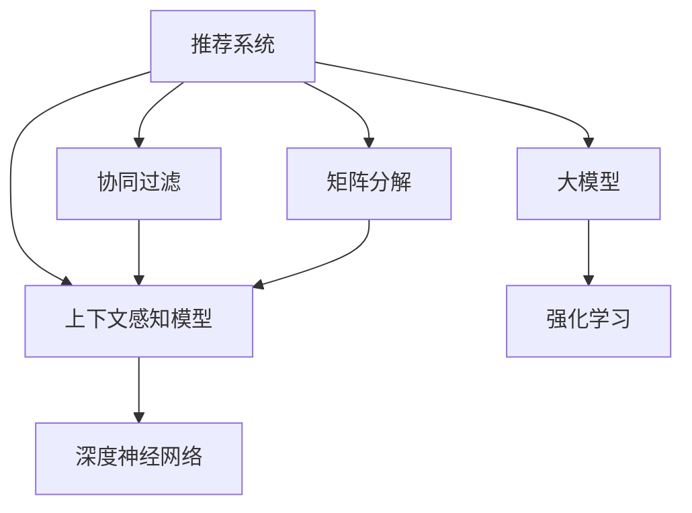

                 

# 推荐系统中的上下文感知模型：大模型技术

> 关键词：推荐系统,上下文感知模型,大模型,强化学习,深度学习,协同过滤,深度神经网络

## 1. 背景介绍

在数字经济的浪潮下，推荐系统已逐渐成为各行各业的核心竞争力之一。从电商到内容平台，从社交网络到在线媒体，推荐系统无处不在。而随着数据规模的不断增长，传统的协同过滤、矩阵分解等推荐算法在面对大规模、高维度的用户行为数据时，存在计算复杂度高、冷启动问题等挑战。

为应对这些问题，近年来推荐系统逐渐引入了深度学习、强化学习等技术。其中，基于大模型的推荐系统更是在诸多任务上取得了突破性的进展。大模型结合了深度神经网络的表达能力和数据的丰富信息，具有强大的上下文感知能力，能够自然处理复杂的用户行为数据，并从中挖掘出有效的推荐规则。

本文将系统介绍基于大模型的上下文感知推荐模型，梳理其核心概念和关键技术，并探讨其在推荐系统中的实践应用和未来发展方向。

## 2. 核心概念与联系

### 2.1 核心概念概述

为更好地理解基于大模型的上下文感知推荐系统，本节将介绍几个关键概念：

- 推荐系统：通过分析用户行为数据，预测用户可能感兴趣的物品，并将其推荐给用户。推荐系统广泛应用于电商、社交、视频、新闻等多个领域。

- 上下文感知模型：基于用户的多维度上下文信息（如位置、时间、设备等），进行个性化的推荐。这类模型能更准确地理解用户的实时需求，提升推荐效果。

- 大模型：以深度神经网络为代表的超大规模预训练语言模型，具有强大的数据建模能力和泛化能力，通过自监督学习任务在大量无标签数据上训练而成。

- 强化学习：通过奖励机制和策略学习，不断优化推荐模型，使推荐系统能动态调整推荐策略，提升用户体验。

- 协同过滤：基于用户和物品的历史交互数据，推断用户和物品之间的关系，进行推荐。

- 矩阵分解：将用户-物品交互矩阵分解为低秩矩阵，通过矩阵乘积计算推荐结果。

这些核心概念之间的逻辑关系可以通过以下Mermaid流程图来展示：



这个流程图展示了大模型在推荐系统中的关键作用，以及协同过滤、矩阵分解等传统推荐算法的补充作用。

## 3. 核心算法原理 & 具体操作步骤
### 3.1 算法原理概述

基于大模型的上下文感知推荐系统，其核心思想是利用深度神经网络强大的特征表示能力，通过自监督预训练得到通用的上下文表示，然后在推荐任务上进行微调，以适应特定的推荐场景。

具体而言，该模型由两个部分组成：预训练部分和微调部分。在预训练阶段，模型通过大量无标签的文本数据进行自监督学习，学习到通用的语言表示能力。在微调阶段，模型再利用标注数据，通过有监督学习优化推荐结果，使推荐模型具备上下文感知能力，能够根据用户的实时行为进行动态推荐。

### 3.2 算法步骤详解

基于大模型的上下文感知推荐系统一般包括以下几个关键步骤：

**Step 1: 准备预训练模型和数据集**
- 选择合适的预训练语言模型，如BERT、GPT-3等，作为推荐模型的基础。
- 准备推荐任务的数据集，包括用户行为数据和物品信息数据，划分为训练集、验证集和测试集。

**Step 2: 添加任务适配层**
- 根据推荐任务的类型，在预训练模型的基础上添加任务适配层，如用户表示嵌入层、物品表示嵌入层、交叉层等。
- 设计合适的损失函数，用于衡量推荐结果与真实标签之间的差异。常见的损失函数包括交叉熵损失、均方误差损失等。

**Step 3: 设置微调超参数**
- 选择合适的优化算法及其参数，如AdamW、SGD等，设置学习率、批大小、迭代轮数等。
- 设置正则化技术及强度，包括权重衰减、Dropout、Early Stopping等。
- 确定冻结预训练参数的策略，如仅微调顶层，或全部参数都参与微调。

**Step 4: 执行梯度训练**
- 将训练集数据分批次输入模型，前向传播计算损失函数。
- 反向传播计算参数梯度，根据设定的优化算法和学习率更新模型参数。
- 周期性在验证集上评估模型性能，根据性能指标决定是否触发Early Stopping。
- 重复上述步骤直到满足预设的迭代轮数或Early Stopping条件。

**Step 5: 测试和部署**
- 在测试集上评估微调后模型，对比微调前后的推荐效果。
- 使用微调后的模型对新用户和新物品进行推荐，集成到实际的应用系统中。
- 持续收集新的数据，定期重新微调模型，以适应数据分布的变化。

### 3.3 算法优缺点

基于大模型的上下文感知推荐系统具有以下优点：

1. 高效利用数据。利用深度神经网络强大的数据建模能力，可以处理高维度的用户行为数据，并从中挖掘出有效的推荐规则。
2. 模型鲁棒性高。得益于大模型的广泛预训练，推荐模型具备较强的泛化能力和抗干扰能力。
3. 可解释性强。深度神经网络可以提供推荐结果的特征表示，有助于理解推荐逻辑。
4. 动态适应性强。通过强化学习等动态调整策略，推荐模型能够及时响应用户需求的变化，提升用户体验。

同时，该方法也存在一定的局限性：

1. 计算资源需求大。超大规模的预训练模型和深度神经网络，需要高性能的计算设备和大量的时间训练，资源需求较高。
2. 冷启动问题严重。由于依赖用户的历史行为数据，新用户和物品难以得到有效的推荐。
3. 模型复杂度高。深度神经网络的结构复杂，模型训练和推理的计算成本较高。
4. 缺乏公平性。模型可能会对某些用户或物品群体产生偏见，导致不公平的推荐结果。

尽管存在这些局限性，但基于大模型的上下文感知推荐系统仍是目前推荐系统研究和应用的主流范式。未来相关研究的重点在于如何进一步降低模型复杂度，提高推荐效率，同时兼顾公平性和可解释性等因素。

### 3.4 算法应用领域

基于大模型的上下文感知推荐系统已经在电商、内容平台、社交网络等多个领域得到了广泛的应用，取得了显著的推荐效果。例如：

- 电商推荐系统：通过分析用户的浏览、购买、评价等行为数据，推荐用户可能感兴趣的商品。
- 视频推荐系统：根据用户的观看历史和评分，推荐相关视频内容。
- 音乐推荐系统：根据用户的听歌历史和喜好，推荐相似的音乐和歌单。
- 新闻推荐系统：根据用户的阅读历史和兴趣，推荐相关新闻和文章。

除了上述这些经典任务外，大模型的上下文感知推荐系统还被创新性地应用到更多场景中，如社交网络中的朋友推荐、信息流内容推荐、广告定向推荐等，为推荐系统带来了新的突破。

## 4. 数学模型和公式 & 详细讲解
### 4.1 数学模型构建

本节将使用数学语言对基于大模型的上下文感知推荐模型进行更加严格的刻画。

记推荐任务的数据集为 $D=\{(x_i,y_i)\}_{i=1}^N$，其中 $x_i$ 为用户行为数据， $y_i$ 为推荐结果。推荐模型为 $M_{\theta}$，其中 $\theta$ 为模型参数。

定义模型 $M_{\theta}$ 在数据样本 $(x,y)$ 上的损失函数为 $\ell(M_{\theta}(x),y)$，则在数据集 $D$ 上的经验风险为：

$$
\mathcal{L}(\theta) = \frac{1}{N} \sum_{i=1}^N \ell(M_{\theta}(x_i),y_i)
$$

其中 $\ell(M_{\theta}(x_i),y_i)$ 为推荐任务损失函数，用于衡量推荐结果与真实标签之间的差异。常见的损失函数包括交叉熵损失、均方误差损失等。

在微调过程中，我们使用梯度下降等优化算法来最小化损失函数 $\mathcal{L}(\theta)$，使得推荐模型能够逼近最优推荐策略。

### 4.2 公式推导过程

以下我们以协同过滤推荐任务为例，推导交叉熵损失函数及其梯度的计算公式。

假设推荐模型 $M_{\theta}$ 在用户行为数据 $x_i$ 上的推荐结果为 $\hat{y}=M_{\theta}(x_i) \in [0,1]$，表示用户对物品 $y_i$ 的兴趣概率。真实标签 $y \in \{0,1\}$。则二分类交叉熵损失函数定义为：

$$
\ell(M_{\theta}(x_i),y) = -[y\log \hat{y} + (1-y)\log (1-\hat{y})]
$$

将其代入经验风险公式，得：

$$
\mathcal{L}(\theta) = -\frac{1}{N}\sum_{i=1}^N [y_i\log M_{\theta}(x_i)+(1-y_i)\log(1-M_{\theta}(x_i))]
$$

根据链式法则，损失函数对参数 $\theta_k$ 的梯度为：

$$
\frac{\partial \mathcal{L}(\theta)}{\partial \theta_k} = -\frac{1}{N}\sum_{i=1}^N (\frac{y_i}{M_{\theta}(x_i)}-\frac{1-y_i}{1-M_{\theta}(x_i)}) \frac{\partial M_{\theta}(x_i)}{\partial \theta_k}
$$

其中 $\frac{\partial M_{\theta}(x_i)}{\partial \theta_k}$ 可进一步递归展开，利用自动微分技术完成计算。

在得到损失函数的梯度后，即可带入参数更新公式，完成模型的迭代优化。重复上述过程直至收敛，最终得到适应推荐任务的最优模型参数 $\theta^*$。

### 4.3 案例分析与讲解

我们以电影推荐为例，说明如何使用大模型构建上下文感知推荐模型。

假设我们要训练一个电影推荐系统，数据集 $D$ 包含用户 $u$ 对电影 $m$ 的评分 $r$。我们的目标是预测用户 $u$ 对新电影 $m'$ 的评分 $r'$。

首先，我们将用户和电影表示为低维嵌入向量 $x_u, x_m \in \mathbb{R}^d$，其中 $d$ 为嵌入维度。然后，将用户和电影向量输入到一个深度神经网络中，通过前向传播得到推荐结果 $y_{m'}$。推荐结果与真实评分之间的差异由交叉熵损失函数来衡量。

假设我们的模型是两个全连接层 $M_{\theta}$，其中 $\theta$ 为模型参数。则前向传播的过程可以表示为：

$$
h_1 = \sigma(W_1x_u + b_1)
$$

$$
h_2 = \sigma(W_2x_m + b_2)
$$

$$
y_{m'} = \sigma(W_3x_u + b_3)
$$

其中 $\sigma$ 为激活函数，$W_i$ 和 $b_i$ 为权重和偏置。

最终，我们将推荐结果 $y_{m'}$ 与真实评分 $r'$ 的差异作为损失函数，通过梯度下降等优化算法进行微调，不断优化模型参数 $\theta$，使得推荐模型能够准确预测用户对电影的评分。

## 5. 项目实践：代码实例和详细解释说明
### 5.1 开发环境搭建

在进行推荐系统微调实践前，我们需要准备好开发环境。以下是使用Python进行TensorFlow开发的环境配置流程：

1. 安装Anaconda：从官网下载并安装Anaconda，用于创建独立的Python环境。

2. 创建并激活虚拟环境：
```bash
conda create -n tf-env python=3.8 
conda activate tf-env
```

3. 安装TensorFlow：根据CUDA版本，从官网获取对应的安装命令。例如：
```bash
conda install tensorflow -c tensorflow -c conda-forge
```

4. 安装各类工具包：
```bash
pip install numpy pandas scikit-learn matplotlib tqdm jupyter notebook ipython
```

完成上述步骤后，即可在`tf-env`环境中开始推荐系统微调实践。

### 5.2 源代码详细实现

下面我们以协同过滤推荐系统为例，给出使用TensorFlow进行推荐系统微调的PyTorch代码实现。

首先，定义协同过滤推荐系统的数据处理函数：

```python
import tensorflow as tf
from tensorflow.keras.layers import Input, Dense, Embedding, Flatten, Concatenate
from tensorflow.keras.models import Model
from tensorflow.keras.optimizers import Adam

# 定义输入层
user_input = Input(shape=(1,), name='user_input')
movie_input = Input(shape=(1,), name='movie_input')

# 定义嵌入层
user_embedding = Embedding(input_dim=num_users, output_dim=embedding_dim)(user_input)
movie_embedding = Embedding(input_dim=num_movies, output_dim=embedding_dim)(movie_input)

# 定义全连接层
user_vector = Dense(100, activation='relu')(user_embedding)
movie_vector = Dense(100, activation='relu')(movie_embedding)

# 定义交叉层
concat_layer = Concatenate()([user_vector, movie_vector])
cross_layer = Dense(100, activation='relu')(concat_layer)

# 定义输出层
rating = Dense(1, activation='sigmoid')(cross_layer)

# 定义模型
model = Model(inputs=[user_input, movie_input], outputs=[rating])

# 定义优化器和损失函数
optimizer = Adam(learning_rate=0.001)
loss_fn = tf.keras.losses.BinaryCrossentropy()

# 定义编译模型
model.compile(optimizer=optimizer, loss=loss_fn)
```

然后，定义训练和评估函数：

```python
# 定义训练函数
def train_epoch(model, train_data, batch_size):
    dataloader = tf.data.Dataset.from_tensor_slices(train_data)
    dataloader = dataloader.shuffle(buffer_size=len(train_data)).batch(batch_size)
    model.train_on_batch(train_data)
    
# 定义评估函数
def evaluate(model, test_data):
    dataloader = tf.data.Dataset.from_tensor_slices(test_data)
    model.evaluate(dataloader)
```

最后，启动训练流程并在测试集上评估：

```python
epochs = 5
batch_size = 32

for epoch in range(epochs):
    train_epoch(model, train_data, batch_size)
    evaluate(model, test_data)
```

以上就是使用TensorFlow对协同过滤推荐系统进行微调的完整代码实现。可以看到，得益于TensorFlow的强大框架和丰富工具，推荐系统的微调代码实现变得简洁高效。

### 5.3 代码解读与分析

让我们再详细解读一下关键代码的实现细节：

**协同过滤推荐系统模型定义**：
- 定义用户输入和电影输入的输入层，通过Embedding层将用户和电影分别映射为低维嵌入向量。
- 定义全连接层和交叉层，用于捕捉用户和电影之间的交互信息。
- 定义输出层，将交叉层的结果映射为预测评分，使用二元交叉熵损失函数进行训练。
- 最后通过编译模型，指定优化器和损失函数，开始训练。

**训练和评估函数**：
- 使用TensorFlow的DataLoader对数据集进行批处理，方便模型训练和推理。
- 定义训练函数，在每个epoch上对模型进行前向传播和反向传播，更新模型参数。
- 定义评估函数，使用测试集对模型进行评估，输出评估结果。

**训练流程**：
- 定义总的epoch数和batch size，开始循环迭代
- 每个epoch内，先对训练集进行训练，然后对测试集进行评估
- 所有epoch结束后，给出最终测试结果

可以看到，TensorFlow提供了一系列的高级API，使得推荐系统的微调代码实现变得非常简便。通过简化模型结构，合理使用自动微分和编译器，大大减少了代码量，提高了开发效率。

当然，工业级的系统实现还需考虑更多因素，如模型的保存和部署、超参数的自动搜索、更灵活的任务适配层等。但核心的微调范式基本与此类似。

## 6. 实际应用场景
### 6.1 电商推荐系统

基于大模型的上下文感知推荐系统，可以广泛应用于电商平台的商品推荐。电商推荐系统不仅需要根据用户的历史行为数据推荐相似商品，还需要实时响应用户的实时需求，提供个性化的推荐。

在技术实现上，我们可以收集用户浏览、点击、购买、评价等行为数据，将其表示为低维向量，输入到微调后的上下文感知推荐模型中。模型通过前向传播计算推荐结果，然后与真实评分进行对比，使用交叉熵损失函数进行反向传播，不断更新模型参数，提升推荐效果。

### 6.2 内容平台推荐系统

内容平台推荐系统主要解决用户发现新内容的问题，如视频平台推荐系统、音乐平台推荐系统等。这类推荐系统通常需要同时考虑用户历史行为和内容特征，进行多维度推荐。

通过将用户行为数据和内容特征表示为低维向量，输入到微调后的上下文感知推荐模型中，模型能够学习用户对不同内容的兴趣，根据内容的特征（如分类、时长、用户评分等）进行推荐。通过不断微调模型，可以提升推荐的准确性和多样性，提高用户对平台的黏性。

### 6.3 广告定向推荐

广告定向推荐主要解决如何向用户精准投放广告的问题。通过收集用户行为数据和广告特征数据，输入到微调后的上下文感知推荐模型中，模型能够根据用户特征和广告内容，预测用户对不同广告的兴趣程度，从而进行精准投放。

在微调过程中，我们通常会将用户行为数据和广告特征数据进行组合，作为模型的输入，使用二元交叉熵损失函数进行训练，最终得到推荐模型。通过不断微调模型，可以优化广告定向策略，提高广告的点击率和转化率。

### 6.4 未来应用展望

随着大模型和微调技术的不断发展，基于上下文感知推荐系统将在更多领域得到应用，为各行各业带来变革性影响。

在智慧医疗领域，推荐系统可以辅助医生推荐药物、诊疗方案等，帮助医生快速做出决策，提升诊疗效率。

在智能教育领域，推荐系统可以推荐个性化的学习资源，帮助学生找到适合自己的学习材料，提升学习效果。

在智能交通领域，推荐系统可以推荐最优的行车路线、停车场等，提高出行的便利性和效率。

除了上述这些经典领域外，大模型的上下文感知推荐系统还被创新性地应用到更多场景中，如智能家居、智能物流、智能金融等，为各行业带来新的发展机遇。

## 7. 工具和资源推荐
### 7.1 学习资源推荐

为了帮助开发者系统掌握大模型推荐系统的理论基础和实践技巧，这里推荐一些优质的学习资源：

1. 《深度学习推荐系统：原理与实践》系列书籍：深入浅出地介绍了推荐系统的原理和实践技巧，适合初学者和进阶开发者阅读。
2. Coursera《深度学习专项课程》：由斯坦福大学开设的深度学习课程，涵盖深度神经网络、自监督学习、强化学习等前沿话题，适合希望系统学习深度学习算法的开发者。
3. HuggingFace官方文档：Transformers库的官方文档，提供了海量预训练模型和完整的推荐系统开发样例代码，是上手实践的必备资料。
4. TensorFlow推荐系统教程：TensorFlow提供的官方教程，包含多种推荐系统算法和模型，适合希望深入学习推荐系统算法的开发者。
5. Kaggle推荐系统竞赛：Kaggle平台上的推荐系统竞赛，涵盖多种推荐算法，提供丰富的竞赛数据和优秀解决方案，适合实战练习。

通过对这些资源的学习实践，相信你一定能够快速掌握大模型推荐系统的精髓，并用于解决实际的推荐问题。

### 7.2 开发工具推荐

高效的开发离不开优秀的工具支持。以下是几款用于大模型推荐系统开发的常用工具：

1. TensorFlow：由Google主导开发的开源深度学习框架，生产部署方便，适合大规模工程应用。
2. PyTorch：基于Python的开源深度学习框架，灵活动态的计算图，适合快速迭代研究。
3. Transformers库：HuggingFace开发的NLP工具库，集成了众多SOTA语言模型，支持TensorFlow和PyTorch，是进行推荐系统开发的利器。
4. Weights & Biases：模型训练的实验跟踪工具，可以记录和可视化模型训练过程中的各项指标，方便对比和调优。
5. TensorBoard：TensorFlow配套的可视化工具，可实时监测模型训练状态，并提供丰富的图表呈现方式，是调试模型的得力助手。

合理利用这些工具，可以显著提升大模型推荐系统的开发效率，加快创新迭代的步伐。

### 7.3 相关论文推荐

大模型和推荐系统的发展源于学界的持续研究。以下是几篇奠基性的相关论文，推荐阅读：

1. Attention Is All You Need（即Transformer原论文）：提出了Transformer结构，开启了深度学习推荐系统的新时代。
2. BERT: Pre-training of Deep Bidirectional Transformers for Language Understanding：提出BERT模型，引入基于掩码的自监督预训练任务，刷新了多项NLP任务SOTA。
3. Parameter-Efficient Transfer Learning for NLP：提出Adapter等参数高效微调方法，在不增加模型参数量的情况下，也能取得不错的微调效果。
4. Scalable Deep Matrix Factorization for Personalized Recommendations：提出TensorFlow推荐系统框架，利用深度神经网络进行推荐系统开发。
5. Deep Collaborative Filtering via Tensor Network Decomposition：提出TensorNetwork推荐系统算法，将深度神经网络与协同过滤结合，提升推荐效果。

这些论文代表了大模型推荐系统的发展脉络。通过学习这些前沿成果，可以帮助研究者把握学科前进方向，激发更多的创新灵感。

## 8. 总结：未来发展趋势与挑战

### 8.1 总结

本文对基于大模型的上下文感知推荐系统进行了全面系统的介绍。首先阐述了推荐系统的发展背景和趋势，明确了上下文感知推荐系统在提升推荐效果、优化用户体验方面的独特价值。其次，从原理到实践，详细讲解了上下文感知模型的数学原理和关键步骤，给出了推荐系统开发的完整代码实例。同时，本文还广泛探讨了上下文感知推荐系统在电商、内容平台、广告等多个行业领域的应用前景，展示了上下文感知模型的巨大潜力。此外，本文精选了推荐系统的各类学习资源，力求为读者提供全方位的技术指引。

通过本文的系统梳理，可以看到，基于大模型的上下文感知推荐系统已经成为推荐系统研究和应用的主流范式，极大地拓展了推荐系统的应用边界，催生了更多的落地场景。得益于深度神经网络的强大表达能力，上下文感知推荐模型能够处理高维度的用户行为数据，并从中挖掘出有效的推荐规则。未来，伴随深度学习、强化学习等技术的不断进步，基于上下文感知推荐系统必将在推荐系统领域迎来更广阔的发展空间。

### 8.2 未来发展趋势

展望未来，上下文感知推荐系统将呈现以下几个发展趋势：

1. 模型规模持续增大。随着算力成本的下降和数据规模的扩张，深度神经网络的参数量还将持续增长。超大规模推荐模型蕴含的丰富上下文表示能力，有望支撑更加复杂多变的推荐场景。
2. 推荐效果进一步提升。深度神经网络的表达能力和上下文感知能力，将使推荐模型具备更强的泛化能力和抗干扰能力，推荐效果将不断提升。
3. 推荐模型自动化。推荐模型的训练和部署将逐渐自动化，模型训练过程将更加灵活、高效，推荐系统将更易于维护和升级。
4. 多模态推荐兴起。推荐模型将逐渐从单一模态的推荐转向多模态推荐，综合利用文本、图片、视频等多种模态信息，提升推荐效果。
5. 用户个性化推荐。推荐模型将更加注重个性化推荐，结合用户行为数据和上下文信息，进行精准推荐，提升用户满意度。
6. 推荐系统公平性。推荐模型将更加注重公平性，避免对某些用户或物品群体产生偏见，提升推荐系统的公平性和透明度。

以上趋势凸显了上下文感知推荐系统的广阔前景。这些方向的探索发展，必将进一步提升推荐系统的性能和应用范围，为推荐系统带来新的突破。

### 8.3 面临的挑战

尽管上下文感知推荐系统已经取得了瞩目成就，但在迈向更加智能化、普适化应用的过程中，它仍面临着诸多挑战：

1. 数据隐私问题。推荐系统需要收集大量的用户行为数据，如何保护用户隐私，避免数据泄露，是一个重要问题。
2. 冷启动问题。对于新用户和新物品，推荐模型难以获得有效的推荐结果。如何克服冷启动问题，仍然是一个挑战。
3. 模型复杂度高。深度神经网络的结构复杂，模型训练和推理的计算成本较高。如何降低模型复杂度，提高推荐效率，仍需进一步研究。
4. 模型公平性问题。推荐模型可能会对某些用户或物品群体产生偏见，导致不公平的推荐结果。如何提高推荐系统的公平性，需要更多研究和实践。
5. 多模态数据融合。推荐模型需要同时处理多种模态数据，如何高效融合不同模态的信息，需要更多的算法创新。

尽管存在这些挑战，但基于上下文感知推荐系统的推荐模型仍然在不断进步，未来的研究将在保证推荐效果的同时，更加注重用户隐私、公平性和模型复杂度等关键问题。相信通过学界和产业界的共同努力，这些挑战终将一一被克服，上下文感知推荐系统必将在推荐系统领域发挥更大的作用。

### 8.4 研究展望

面对上下文感知推荐系统所面临的种种挑战，未来的研究需要在以下几个方面寻求新的突破：

1. 探索基于无监督学习的推荐方法。摆脱对大量标注数据的依赖，利用无监督学习范式，最大限度利用非结构化数据，实现更加灵活高效的推荐。
2. 研究基于强化学习的推荐策略。通过引入强化学习，不断优化推荐模型，使推荐系统能动态调整推荐策略，提升用户体验。
3. 融合因果推断和深度神经网络。通过引入因果推断方法，增强推荐模型的决策可信度，提升推荐效果。
4. 引入外部知识库。将外部知识库中的先验知识，与神经网络模型进行巧妙融合，引导推荐模型学习更准确、合理的上下文表示。
5. 改进推荐模型的训练和部署。通过优化推荐模型的结构，提高推荐效率，降低计算成本，使推荐系统更加高效、灵活。

这些研究方向的探索，必将引领上下文感知推荐系统迈向更高的台阶，为构建安全、可靠、高效的推荐系统铺平道路。面向未来，上下文感知推荐系统还需要与其他人工智能技术进行更深入的融合，如知识表示、因果推理、强化学习等，多路径协同发力，共同推动推荐系统技术的进步。只有勇于创新、敢于突破，才能不断拓展推荐系统的边界，让推荐系统更好地服务于人类的生产和生活。

## 9. 附录：常见问题与解答

**Q1：上下文感知推荐系统是否适用于所有推荐任务？**

A: 上下文感知推荐系统在大多数推荐任务上都能取得不错的效果，特别是对于数据量较小的任务。但对于一些特定领域的任务，如医疗、法律等，仅仅依靠通用语料预训练的模型可能难以很好地适应。此时需要在特定领域语料上进一步预训练，再进行微调，才能获得理想效果。此外，对于一些需要时效性、个性化很强的任务，如广告定向推荐等，微调方法也需要针对性的改进优化。

**Q2：在微调过程中如何选择合适的学习率？**

A: 微调的学习率一般要比预训练时小1-2个数量级，如果使用过大的学习率，容易破坏预训练权重，导致过拟合。一般建议从1e-5开始调参，逐步减小学习率，直至收敛。也可以使用warmup策略，在开始阶段使用较小的学习率，再逐渐过渡到预设值。需要注意的是，不同的优化器(如AdamW、Adafactor等)以及不同的学习率调度策略，可能需要设置不同的学习率阈值。

**Q3：采用大模型微调时会面临哪些资源瓶颈？**

A: 目前主流的预训练大模型动辄以亿计的参数规模，对算力、内存、存储都提出了很高的要求。GPU/TPU等高性能设备是必不可少的，但即便如此，超大批次的训练和推理也可能遇到显存不足的问题。因此需要采用一些资源优化技术，如梯度积累、混合精度训练、模型并行等，来突破硬件瓶颈。同时，模型的存储和读取也可能占用大量时间和空间，需要采用模型压缩、稀疏化存储等方法进行优化。

**Q4：如何缓解微调过程中的过拟合问题？**

A: 过拟合是微调面临的主要挑战，尤其是在标注数据不足的情况下。常见的缓解策略包括：
1. 数据增强：通过回译、近义替换等方式扩充训练集
2. 正则化：使用L2正则、Dropout、Early Stopping等避免过拟合
3. 对抗训练：引入对抗样本，提高模型鲁棒性
4. 参数高效微调：只调整少量参数(如Adapter、Prefix等)，减小过拟合风险
5. 多模型集成：训练多个微调模型，取平均输出，抑制过拟合

这些策略往往需要根据具体任务和数据特点进行灵活组合。只有在数据、模型、训练、推理等各环节进行全面优化，才能最大限度地发挥大模型微调的威力。

**Q5：微调模型在落地部署时需要注意哪些问题？**

A: 将微调模型转化为实际应用，还需要考虑以下因素：
1. 模型裁剪：去除不必要的层和参数，减小模型尺寸，加快推理速度
2. 量化加速：将浮点模型转为定点模型，压缩存储空间，提高计算效率
3. 服务化封装：将模型封装为标准化服务接口，便于集成调用
4. 弹性伸缩：根据请求流量动态调整资源配置，平衡服务质量和成本
5. 监控告警：实时采集系统指标，设置异常告警阈值，确保服务稳定性
6. 安全防护：采用访问鉴权、数据脱敏等措施，保障数据和模型安全

大模型微调为推荐系统带来了广阔的想象空间，但如何将强大的性能转化为稳定、高效、安全的业务价值，还需要工程实践的不断打磨。唯有从数据、算法、工程、业务等多个维度协同发力，才能真正实现人工智能技术在垂直行业的规模化落地。总之，微调需要开发者根据具体任务，不断迭代和优化模型、数据和算法，方能得到理想的效果。

---

作者：禅与计算机程序设计艺术 / Zen and the Art of Computer Programming

