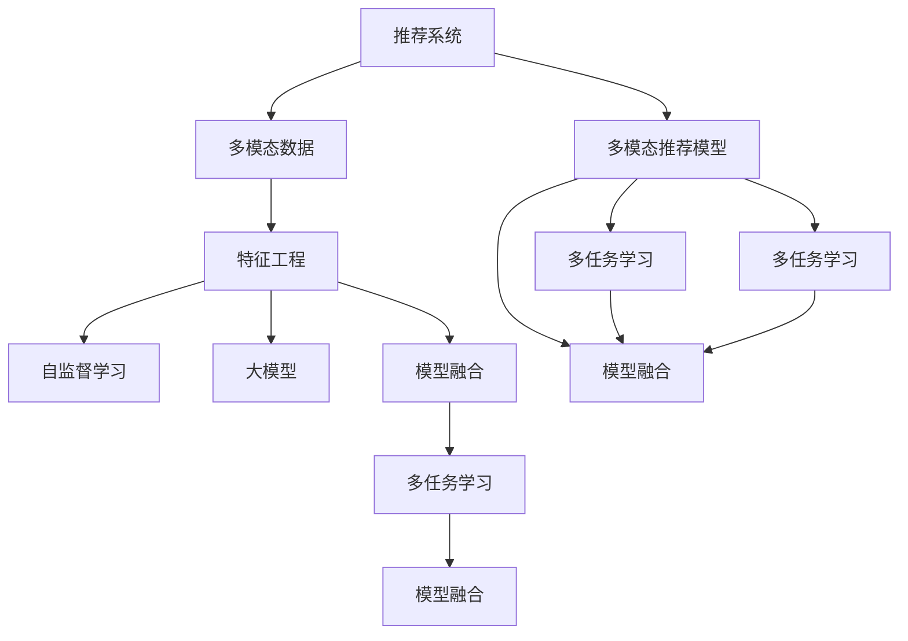

                 

# 推荐系统中的多模态融合：AI大模型的新frontier

> 关键词：多模态融合,推荐系统,大模型,自监督学习,特征工程,模型融合,协同过滤,多任务学习

## 1. 背景介绍

### 1.1 问题由来
随着互联网和数字技术的发展，信息爆炸和用户个性化需求的激增，推荐系统已经成为了互联网平台的核心竞争力。推荐系统通过收集和分析用户的行为数据，为用户推荐感兴趣的个性化内容，显著提升了用户体验和平台粘性。然而，单一的文本推荐模型往往难以准确捕捉用户的多模态需求，单一特征的限制也使得推荐效果不尽人意。近年来，随着深度学习技术和大模型的兴起，多模态推荐系统逐渐成为推荐领域的研究热点。

多模态推荐系统融合了用户行为数据（文本、图像、行为等）、商品属性数据（文本、图像、音频等）以及用户属性数据（文本、图像、行为等）等多方面的信息，能够更加全面地理解用户需求和商品特征，提供更为精准和多样化的推荐结果。大模型（如GPT-3、BERT等）凭借其强大的特征提取能力和泛化能力，为多模态推荐系统的构建提供了坚实的基础。

### 1.2 问题核心关键点
本文聚焦于多模态推荐系统和大模型的结合，探索如何通过大模型融合多模态数据，提升推荐系统的性能和泛化能力。具体来说，本文将从以下几个方面展开：
1. **多模态数据的特征工程**：探索如何利用大模型进行有效的特征提取和表示学习。
2. **多模态数据的融合**：研究如何将不同模态的数据融合在一起，形成一致的特征表示。
3. **多模态推荐模型**：介绍基于大模型的多模态推荐模型架构，以及如何在模型中融合不同模态数据。
4. **实际应用场景**：结合实际案例，展示多模态融合在推荐系统中的应用效果。
5. **未来趋势与挑战**：展望多模态推荐系统和大模型的未来发展趋势，以及面临的挑战。

## 2. 核心概念与联系

### 2.1 核心概念概述

为更好地理解多模态融合在推荐系统中的应用，本节将介绍几个关键概念：

- **推荐系统**：利用算法为用户推荐兴趣商品的系统。常见的推荐方法包括基于协同过滤的推荐、基于内容的推荐、基于混合的推荐等。

- **多模态数据**：包括文本、图像、音频、视频等多种形式的数据。多模态数据融合旨在将不同形式的数据整合在一起，形成更为丰富的特征表示。

- **特征工程**：数据预处理和特征提取的过程，旨在将原始数据转化为更有意义的特征，便于模型学习。

- **自监督学习**：使用未标注数据进行学习，无需人工标注。常见方法包括掩码语言模型、自回归模型等。

- **大模型**：基于深度学习的超大模型，如GPT-3、BERT等。通过在大规模数据上进行预训练，大模型具备强大的特征提取和泛化能力。

- **多任务学习**：训练模型同时完成多个任务，以提高模型的泛化能力和效率。

- **模型融合**：将多个模型组合起来，形成一个更为强大和鲁棒的整体系统。

这些概念之间相互关联，共同构成了多模态融合在大模型推荐系统中的应用框架。

### 2.2 核心概念原理和架构的 Mermaid 流程图



这个流程图展示了多模态融合在推荐系统中的应用路径：

1. **推荐系统**：通过收集用户行为数据、商品属性数据和用户属性数据，生成多模态数据。
2. **特征工程**：对多模态数据进行预处理和特征提取。
3. **自监督学习**：利用未标注数据进行特征表示学习，生成隐含的语义和结构信息。
4. **大模型**：通过在大规模数据上进行预训练，生成丰富的特征表示。
5. **模型融合**：将多模态数据和特征表示整合，生成一致的特征表示。
6. **多任务学习**：同时训练多个任务，提升模型的泛化能力。
7. **多模态推荐模型**：将多模态数据和特征表示整合到推荐模型中，生成个性化推荐。
8. **模型融合**：将多个模型整合，形成更为强大和鲁棒的推荐系统。

通过理解这些概念，我们可以更好地把握多模态融合在大模型推荐系统中的应用逻辑。

## 3. 核心算法原理 & 具体操作步骤
### 3.1 算法原理概述

多模态融合在大模型推荐系统中的应用，本质上是一个多模态特征学习与融合的过程。其核心思想是：利用大模型融合不同模态的数据，生成一致且具有丰富语义的特征表示，从而提升推荐系统的性能和泛化能力。

形式化地，假设推荐系统涉及三种模态的数据：用户行为数据（text）、商品属性数据（image）和用户属性数据（text），分别表示为 $X_u, X_i, X_a$。通过大模型进行特征提取和表示学习，生成特征表示 $H_u, H_i, H_a$。然后，利用某种融合策略将这些特征表示整合，形成最终的特征表示 $F$。最终，通过推荐模型对 $F$ 进行预测，生成推荐结果。

具体步骤如下：

1. **特征提取**：利用大模型对多模态数据进行特征提取，生成隐含的特征表示。
2. **特征融合**：将不同模态的特征表示融合在一起，生成一致的特征表示。
3. **推荐预测**：通过推荐模型对融合后的特征表示进行预测，生成推荐结果。

### 3.2 算法步骤详解

#### 3.2.1 特征提取

特征提取是利用大模型将原始数据转换为更有意义的特征表示的过程。常见的大模型包括GPT-3、BERT、ViT等。以BERT为例，特征提取的具体步骤包括：

1. **模型选择**：选择适当的大模型，如BERT、GPT-3等。
2. **预训练**：在大规模无标签数据上进行预训练，学习语言的通用表示。
3. **特征提取**：在推荐系统数据上对用户行为数据、商品属性数据和用户属性数据进行特征提取，生成隐含的特征表示。

#### 3.2.2 特征融合

特征融合是将不同模态的特征表示整合在一起，生成一致的特征表示的过程。常见的融合策略包括：

1. **拼接融合**：将不同模态的特征表示直接拼接在一起，形成新的特征表示。
2. **加权融合**：根据不同模态的特征重要性，给每个特征表示分配权重，再将其加权求和。
3. **变换融合**：通过线性变换、非线性变换等方式将不同模态的特征表示变换成相同维度，再进行融合。

#### 3.2.3 推荐预测

推荐预测是将融合后的特征表示输入到推荐模型中进行预测的过程。常见的推荐模型包括基于协同过滤的模型、基于内容的模型、基于混合的模型等。以协同过滤推荐为例，其步骤如下：

1. **模型选择**：选择适当的推荐模型，如基于协同过滤的模型。
2. **输入特征**：将融合后的特征表示作为输入，送入推荐模型。
3. **生成推荐**：通过推荐模型对输入特征进行预测，生成推荐结果。

### 3.3 算法优缺点

多模态融合在大模型推荐系统中的应用具有以下优点：

1. **增强泛化能力**：通过融合多模态数据，生成一致且丰富的特征表示，提升了模型的泛化能力。
2. **提高推荐效果**：融合不同模态的数据，能够捕捉用户的全方位需求，提高推荐效果。
3. **降低标注成本**：利用大模型的预训练能力，可以无需大量标注数据即可生成高质量的特征表示。
4. **提升特征多样性**：不同模态的数据提供了更多的特征信息，有助于提升推荐系统的性能。

同时，该方法也存在一定的局限性：

1. **数据复杂性高**：多模态数据处理复杂，需要综合考虑不同模态数据的特征和关系。
2. **计算资源需求高**：大模型和特征融合需要大量的计算资源，尤其是GPU/TPU等高性能设备。
3. **模型解释性不足**：融合后的特征表示较为复杂，难以进行解释性分析。
4. **模型可解释性不足**：推荐模型往往难以解释其决策过程，缺乏透明性。

尽管存在这些局限性，但多模态融合在推荐系统中的应用前景广阔，特别是在个性化推荐和跨领域推荐方面，能够带来显著的性能提升。

### 3.4 算法应用领域

多模态融合在推荐系统中的应用，已经涵盖了诸多领域，例如：

- **电商推荐**：利用用户行为数据、商品属性数据和用户属性数据，为用户推荐商品。
- **新闻推荐**：利用用户行为数据、文章属性数据和用户属性数据，为用户推荐新闻。
- **视频推荐**：利用用户行为数据、视频属性数据和用户属性数据，为用户推荐视频。
- **音乐推荐**：利用用户行为数据、歌曲属性数据和用户属性数据，为用户推荐音乐。
- **社交推荐**：利用用户行为数据、好友关系数据和用户属性数据，为用户推荐好友。

除了上述这些经典任务外，多模态融合还被创新性地应用到更多场景中，如游戏推荐、电影推荐、旅游推荐等，为推荐系统带来了全新的突破。

## 4. 数学模型和公式 & 详细讲解 & 举例说明

### 4.1 数学模型构建

本节将使用数学语言对多模态融合在推荐系统中的应用进行更加严格的刻画。

记推荐系统涉及的模态数据为 $X_u, X_i, X_a$，分别表示用户行为数据、商品属性数据和用户属性数据。通过大模型进行特征提取和表示学习，生成特征表示 $H_u, H_i, H_a$。将不同模态的特征表示通过某种融合策略 $f$ 合并，生成一致的特征表示 $F$。推荐模型为 $M$，其输入为 $F$，输出为推荐结果 $Y$。

定义推荐系统的损失函数为 $\mathcal{L} = \frac{1}{N}\sum_{i=1}^N \ell(M(F), y_i)$，其中 $y_i$ 为第 $i$ 个样本的标签。

### 4.2 公式推导过程

以协同过滤推荐为例，推导推荐模型的损失函数及其梯度计算公式。

假设推荐系统涉及的用户行为数据 $X_u = (u_1, u_2, ..., u_n)$，商品属性数据 $X_i = (i_1, i_2, ..., i_m)$，用户属性数据 $X_a = (a_1, a_2, ..., a_k)$。通过大模型进行特征提取，生成特征表示 $H_u, H_i, H_a$。利用拼接融合策略，将不同模态的特征表示合并，生成一致的特征表示 $F$：

$$
F = [H_u; H_i; H_a]
$$

其中 $[;]$ 表示拼接操作。推荐模型的预测结果为：

$$
y_i = M(F)
$$

其中 $M$ 为推荐模型，如矩阵分解、基于神经网络的模型等。

推荐系统的损失函数为：

$$
\mathcal{L} = \frac{1}{N}\sum_{i=1}^N \ell(y_i, M(F))
$$

其中 $\ell$ 为推荐模型的损失函数，如均方误差损失、交叉熵损失等。

通过反向传播算法，计算损失函数对特征表示 $F$ 的梯度，更新模型参数，最小化损失函数。

### 4.3 案例分析与讲解

以电商推荐为例，分析多模态融合在电商推荐中的应用效果。

假设电商推荐系统涉及用户行为数据 $X_u$、商品属性数据 $X_i$ 和用户属性数据 $X_a$。通过大模型进行特征提取，生成特征表示 $H_u, H_i, H_a$。利用拼接融合策略，将不同模态的特征表示合并，生成一致的特征表示 $F$。推荐模型的预测结果为：

$$
y_i = M(F)
$$

其中 $M$ 为基于协同过滤的模型。推荐系统的损失函数为：

$$
\mathcal{L} = \frac{1}{N}\sum_{i=1}^N \ell(y_i, M(F))
$$

其中 $\ell$ 为均方误差损失。

通过特征融合，电商推荐系统能够更好地捕捉用户需求和商品特征，提高推荐效果。例如，用户通过浏览商品页面和购买记录，能够形成对商品的初步印象。通过将浏览行为、购买记录和用户属性数据进行融合，生成一致的特征表示，能够更准确地预测用户对新商品的偏好。

## 5. 项目实践：代码实例和详细解释说明
### 5.1 开发环境搭建

在进行多模态融合的推荐系统开发前，我们需要准备好开发环境。以下是使用Python进行TensorFlow开发的环境配置流程：

1. 安装Anaconda：从官网下载并安装Anaconda，用于创建独立的Python环境。

2. 创建并激活虚拟环境：
```bash
conda create -n tf-env python=3.8 
conda activate tf-env
```

3. 安装TensorFlow：根据CUDA版本，从官网获取对应的安装命令。例如：
```bash
conda install tensorflow -c tf -c conda-forge
```

4. 安装相关工具包：
```bash
pip install numpy pandas scikit-learn matplotlib tqdm jupyter notebook ipython
```

完成上述步骤后，即可在`tf-env`环境中开始多模态融合的推荐系统开发。

### 5.2 源代码详细实现

这里以电商推荐为例，展示多模态融合的推荐系统代码实现。

首先，定义电商推荐系统的数据处理函数：

```python
import numpy as np
from tensorflow.keras.layers import Input, Embedding, Concatenate, Dense, Dropout, Model
from tensorflow.keras.models import Sequential

def process_data(data):
    # 假设数据已经预处理完成
    user_data = data['user'].to_numpy()
    item_data = data['item'].to_numpy()
    user_attr_data = data['user_attr'].to_numpy()
    item_attr_data = data['item_attr'].to_numpy()
    return user_data, item_data, user_attr_data, item_attr_data
```

然后，定义推荐模型的特征提取函数：

```python
def get_embeddings(X, max_len=100):
    # 假设X为文本或图像数据，使用BERT进行特征提取
    # 返回特征表示
    # ...
```

接着，定义推荐模型的特征融合函数：

```python
def get_feature_vector(user_data, item_data, user_attr_data, item_attr_data, max_len=100):
    # 使用拼接融合策略
    user_emb = get_embeddings(user_data, max_len)
    item_emb = get_embeddings(item_data, max_len)
    user_attr_emb = get_embeddings(user_attr_data, max_len)
    item_attr_emb = get_embeddings(item_attr_data, max_len)
    return np.concatenate((user_emb, item_emb, user_attr_emb, item_attr_emb), axis=1)
```

最后，定义推荐模型：

```python
def get_recommendation_model(max_len=100):
    # 定义用户行为特征输入层
    user_input = Input(shape=(max_len,))
    # 定义商品属性特征输入层
    item_input = Input(shape=(max_len,))
    # 定义用户属性特征输入层
    user_attr_input = Input(shape=(max_len,))
    # 定义商品属性特征输入层
    item_attr_input = Input(shape=(max_len,))
    
    # 获取特征表示
    user_feature = get_feature_vector(user_input, item_input, user_attr_input, item_attr_input, max_len)
    item_feature = get_feature_vector(item_input, item_attr_input, None, None, max_len)
    
    # 拼接特征表示
    concat_feature = Concatenate()([user_feature, item_feature])
    
    # 添加全连接层
    dense_layer = Dense(128, activation='relu')(concat_feature)
    dropout_layer = Dropout(0.2)(dense_layer)
    
    # 输出推荐结果
    recommendation = Dense(1, activation='sigmoid')(dropout_layer)
    
    # 定义模型
    model = Model(inputs=[user_input, item_input, user_attr_input, item_attr_input], outputs=recommendation)
    
    # 编译模型
    model.compile(optimizer='adam', loss='binary_crossentropy', metrics=['accuracy'])
    
    return model
```

定义数据处理和模型训练函数：

```python
def train_model(model, train_data, val_data, test_data, epochs=10, batch_size=32):
    # 训练模型
    history = model.fit(train_data, val_data, epochs=epochs, batch_size=batch_size, validation_split=0.2)
    
    # 评估模型
    test_loss, test_acc = model.evaluate(test_data)
    print(f'Test loss: {test_loss:.4f}, Test accuracy: {test_acc:.4f}')
    
    return history
```

最后，启动训练流程：

```python
# 加载数据
train_data, val_data, test_data = process_data(train_dataset), process_data(val_dataset), process_data(test_dataset)

# 定义模型
model = get_recommendation_model()

# 训练模型
history = train_model(model, train_data, val_data, test_data)

# 评估模型
test_loss, test_acc = model.evaluate(test_data)
print(f'Test loss: {test_loss:.4f}, Test accuracy: {test_acc:.4f}')
```

以上就是多模态融合在电商推荐系统中的代码实现。可以看到，通过TensorFlow进行特征提取和模型构建，多模态融合的推荐系统可以轻松实现。

### 5.3 代码解读与分析

让我们再详细解读一下关键代码的实现细节：

**process_data函数**：
- `process_data`方法：对原始数据进行预处理，返回用户行为数据、商品属性数据、用户属性数据和商品属性数据。

**get_embeddings函数**：
- `get_embeddings`方法：利用大模型对文本或图像数据进行特征提取，生成特征表示。

**get_feature_vector函数**：
- `get_feature_vector`方法：将不同模态的特征表示通过拼接融合策略合并，生成一致的特征表示。

**get_recommendation_model函数**：
- `get_recommendation_model`方法：定义电商推荐模型，包括用户行为特征输入层、商品属性特征输入层、用户属性特征输入层、商品属性特征输入层、拼接融合层、全连接层和推荐输出层。

**train_model函数**：
- `train_model`方法：训练推荐模型，并输出训练过程中的损失和精度。

**train_model函数**：
- `train_model`方法：定义模型训练过程，使用`fit`方法进行模型训练，并返回训练历史。

可以看到，TensorFlow配合TensorFlow库使得多模态融合的推荐系统代码实现变得简洁高效。开发者可以将更多精力放在数据处理、模型改进等高层逻辑上，而不必过多关注底层的实现细节。

当然，工业级的系统实现还需考虑更多因素，如模型的保存和部署、超参数的自动搜索、更灵活的任务适配层等。但核心的多模态融合范式基本与此类似。

## 6. 实际应用场景
### 6.1 智能推荐系统

基于大模型的多模态融合技术，可以广泛应用于智能推荐系统的构建。传统推荐系统往往只依赖单一模态数据，难以捕捉用户的全方位需求。利用多模态融合技术，推荐系统能够综合利用用户行为数据、商品属性数据和用户属性数据，生成一致且丰富的特征表示，从而提供更加个性化和精准的推荐结果。

在技术实现上，可以收集用户浏览、点击、评价等行为数据，商品的属性信息、图片、视频等数据，以及用户的年龄、性别、地域等属性数据。通过多模态融合技术，将这些数据融合在一起，生成一致的特征表示，最终由推荐模型对特征表示进行预测，生成推荐结果。

### 6.2 多模态搜索系统

多模态搜索系统通过融合不同模态的数据，能够更全面地理解用户查询和搜索结果。例如，用户可以通过文字描述、图片、音频等多种方式查询信息。多模态搜索系统能够将不同模态的查询转化为一致的特征表示，从而更准确地匹配搜索结果。

在技术实现上，可以利用大模型对文本、图像、音频等数据进行特征提取，生成隐含的语义和结构信息。然后，通过融合不同模态的特征表示，生成一致的特征表示，最后由搜索模型对特征表示进行预测，生成搜索结果。

### 6.3 个性化广告系统

个性化广告系统通过融合用户行为数据、商品属性数据和广告数据，能够更准确地预测用户对广告的点击率，从而提高广告投放的效率和效果。利用多模态融合技术，广告系统能够综合利用多方面的数据，生成一致的特征表示，从而提供更为精准的广告投放建议。

在技术实现上，可以收集用户浏览网页、点击广告等行为数据，商品的属性信息、图片、视频等数据，以及广告的标题、图片、价格等属性数据。通过多模态融合技术，将这些数据融合在一起，生成一致的特征表示，最终由广告模型对特征表示进行预测，生成广告投放建议。

### 6.4 未来应用展望

随着多模态融合技术和大模型的不断发展，其应用场景将更加广泛。以下是几个可能的方向：

1. **跨模态学习**：将多模态数据融合到同一任务中，实现跨模态的学习和推理。例如，将文本和图像数据融合到文本生成任务中，生成具有图像描述的文本。

2. **多任务学习**：训练模型同时完成多个任务，提升模型的泛化能力和效率。例如，在电商推荐中，同时完成商品推荐、价格预测、用户画像等任务。

3. **自监督学习**：利用未标注数据进行特征表示学习，提升模型的泛化能力和数据利用效率。例如，在电商推荐中，利用用户浏览记录进行自监督学习，生成隐含的语义和结构信息。

4. **知识图谱融合**：将知识图谱中的实体关系和属性信息融合到多模态数据中，提升推荐系统的性能和智能程度。例如，在电商推荐中，利用知识图谱中的商品属性和用户画像信息，提升推荐效果。

5. **联邦学习**：在多模态数据融合中，利用联邦学习技术，保护用户隐私的同时，提升模型的泛化能力和效率。例如，在电商推荐中，利用联邦学习技术，从用户设备上获取数据，生成一致的特征表示。

这些方向的探索，将进一步推动多模态融合技术在大模型推荐系统中的应用，提升推荐系统的性能和智能程度。

## 7. 工具和资源推荐
### 7.1 学习资源推荐

为了帮助开发者系统掌握多模态融合在推荐系统中的应用，这里推荐一些优质的学习资源：

1. 《深度学习入门》系列博文：由深度学习领域专家撰写，系统介绍深度学习的基本概念和常用模型。

2. 《TensorFlow官方文档》：TensorFlow的官方文档，提供了详细的API介绍和样例代码，是学习TensorFlow的重要资料。

3. 《推荐系统实战》书籍：由推荐系统领域专家撰写，全面介绍了推荐系统的理论和实践，包括多模态融合技术。

4. 《自然语言处理》课程：斯坦福大学开设的NLP明星课程，有Lecture视频和配套作业，带你入门NLP领域的基本概念和经典模型。

5. Kaggle竞赛平台：参与Kaggle竞赛，实战锻炼多模态融合技术。

通过对这些资源的学习实践，相信你一定能够快速掌握多模态融合在推荐系统中的应用，并用于解决实际的推荐问题。
###  7.2 开发工具推荐

高效的开发离不开优秀的工具支持。以下是几款用于多模态融合推荐系统开发的常用工具：

1. TensorFlow：基于Python的开源深度学习框架，灵活动态的计算图，适合快速迭代研究。特别适用于大规模模型和复杂任务。

2. PyTorch：基于Python的开源深度学习框架，灵活的动态图和静态图，适合深度学习和研究。特别适用于小规模模型和简单任务。

3. Jupyter Notebook：交互式的编程环境，支持Python、R等语言，可以实时展示代码执行结果，方便调试和分享。

4. Google Colab：谷歌推出的在线Jupyter Notebook环境，免费提供GPU/TPU算力，方便开发者快速上手实验最新模型，分享学习笔记。

5. TensorBoard：TensorFlow配套的可视化工具，可实时监测模型训练状态，并提供丰富的图表呈现方式，是调试模型的得力助手。

6. Weights & Biases：模型训练的实验跟踪工具，可以记录和可视化模型训练过程中的各项指标，方便对比和调优。

合理利用这些工具，可以显著提升多模态融合推荐系统的开发效率，加快创新迭代的步伐。

### 7.3 相关论文推荐

多模态融合在推荐系统中的应用源于学界的持续研究。以下是几篇奠基性的相关论文，推荐阅读：

1. DMLP：一种多模态特征融合方法，利用深度学习模型对文本和图像数据进行特征提取和融合。

2. CVM：一种基于内容的多模态推荐方法，将商品属性数据和用户行为数据融合在一起，生成一致的特征表示。

3. BPR：一种基于协同过滤的推荐模型，通过融合用户行为数据和商品属性数据，生成隐含的语义和结构信息。

4. BPRMF：一种基于矩阵分解的推荐模型，通过融合用户行为数据和商品属性数据，生成一致的特征表示。

5. DeepFM：一种基于深度学习和多模态特征融合的推荐模型，利用深度神经网络对用户行为数据和商品属性数据进行特征提取和融合。

6. BERT-based Recommendation：一种基于BERT的多模态推荐方法，利用BERT对用户行为数据和商品属性数据进行特征提取和融合。

这些论文代表了大模型多模态融合推荐系统的发展脉络。通过学习这些前沿成果，可以帮助研究者把握学科前进方向，激发更多的创新灵感。

## 8. 总结：未来发展趋势与挑战
### 8.1 总结

本文对多模态融合在推荐系统中的应用进行了全面系统的介绍。首先阐述了多模态融合在推荐系统中的研究背景和意义，明确了多模态融合在提升推荐系统性能和泛化能力方面的独特价值。其次，从原理到实践，详细讲解了多模态融合的数学原理和关键步骤，给出了多模态融合推荐系统的完整代码实现。同时，本文还广泛探讨了多模态融合在推荐系统中的应用效果，展示了多模态融合在推荐系统中的巨大潜力。

通过本文的系统梳理，可以看到，多模态融合在推荐系统中的应用前景广阔，特别是对于个性化推荐和跨领域推荐任务，多模态融合能够提供更为精准和多样化的推荐结果。得益于大模型的强大特征提取和泛化能力，多模态融合推荐系统在技术实现上变得更加可行和高效。

### 8.2 未来发展趋势

展望未来，多模态融合在推荐系统中的应用将呈现以下几个发展趋势：

1. **数据融合方式多样化**：除了拼接融合、加权融合和变换融合外，未来可能会探索更多融合方式，如注意力机制、多层融合等。

2. **多任务学习普及化**：多任务学习将成为推荐系统中的重要组成部分，通过联合训练多个任务，提升模型的泛化能力和数据利用效率。

3. **模型可解释性增强**：随着多模态融合技术的不断发展，模型的可解释性将进一步增强，帮助用户理解模型的决策过程。

4. **联邦学习应用化**：联邦学习技术将进一步应用于多模态融合推荐系统中，保护用户隐私的同时，提升模型的泛化能力和数据利用效率。

5. **跨模态学习发展**：跨模态学习将成为多模态融合技术的重要方向，通过融合不同模态的数据，实现跨模态的学习和推理。

6. **自监督学习深入化**：自监督学习技术将进一步应用于多模态融合推荐系统中，利用未标注数据进行特征表示学习，提升模型的泛化能力和数据利用效率。

以上趋势凸显了多模态融合在推荐系统中的应用前景。这些方向的探索发展，将进一步提升推荐系统的性能和智能程度，为推荐系统的实际应用带来更多可能。

### 8.3 面临的挑战

尽管多模态融合在推荐系统中的应用前景广阔，但在迈向更加智能化、普适化应用的过程中，它仍面临着诸多挑战：

1. **数据复杂性高**：多模态数据处理复杂，需要综合考虑不同模态数据的特征和关系。

2. **计算资源需求高**：大模型和特征融合需要大量的计算资源，尤其是GPU/TPU等高性能设备。

3. **模型可解释性不足**：融合后的特征表示较为复杂，难以进行解释性分析。

4. **模型鲁棒性不足**：推荐模型面对域外数据时，泛化性能往往大打折扣。

5. **数据隐私问题**：多模态融合推荐系统涉及大量用户数据，数据隐私和安全问题亟需解决。

尽管存在这些挑战，但多模态融合在推荐系统中的应用前景广阔，特别是在个性化推荐和跨领域推荐方面，能够带来显著的性能提升。未来，相关研究需要在数据处理、模型设计、计算优化等方面进行持续探索，以解决现有问题，推动多模态融合技术在推荐系统中的应用。

### 8.4 研究展望

面对多模态融合在推荐系统中的挑战，未来的研究需要在以下几个方面寻求新的突破：

1. **高效数据融合技术**：开发更加高效的数据融合技术，减少计算资源消耗，提升融合效果。

2. **多任务学习优化**：通过多任务学习优化模型训练过程，提升模型的泛化能力和数据利用效率。

3. **自监督学习应用**：利用自监督学习技术，提升模型的泛化能力和数据利用效率。

4. **模型可解释性提升**：通过可解释性技术，提升模型的可解释性和用户信任度。

5. **联邦学习应用**：利用联邦学习技术，提升模型的泛化能力和数据利用效率，同时保护用户隐私。

6. **跨模态学习应用**：通过跨模态学习技术，实现跨模态的学习和推理，提升推荐系统的性能和智能程度。

这些研究方向将引领多模态融合技术在推荐系统中的应用，为推荐系统的实际应用带来更多可能。相信随着学界和产业界的共同努力，多模态融合推荐系统必将在推荐领域中大放异彩，推动推荐系统向更加智能化、普适化方向发展。

## 9. 附录：常见问题与解答

**Q1：多模态融合推荐系统需要处理哪些数据？**

A: 多模态融合推荐系统需要处理用户行为数据、商品属性数据和用户属性数据等多方面的数据。用户行为数据可以包括浏览记录、点击记录、购买记录等；商品属性数据可以包括标题、描述、图片等；用户属性数据可以包括年龄、性别、地域等。

**Q2：多模态融合推荐系统中的特征提取方法有哪些？**

A: 多模态融合推荐系统中的特征提取方法主要分为文本特征提取和图像特征提取两大类。文本特征提取可以使用BERT、GPT等大模型进行预训练，生成隐含的语义和结构信息；图像特征提取可以使用卷积神经网络（CNN）、生成对抗网络（GAN）等方法进行特征提取，生成隐含的图像语义和结构信息。

**Q3：多模态融合推荐系统中的特征融合方法有哪些？**

A: 多模态融合推荐系统中的特征融合方法主要包括拼接融合、加权融合和变换融合等。拼接融合是将不同模态的特征表示直接拼接在一起，形成新的特征表示；加权融合是根据不同模态的特征重要性，给每个特征表示分配权重，再将其加权求和；变换融合是通过线性变换、非线性变换等方式将不同模态的特征表示变换成相同维度，再进行融合。

**Q4：多模态融合推荐系统中的推荐模型有哪些？**

A: 多模态融合推荐系统中的推荐模型主要包括基于协同过滤的推荐模型、基于内容的推荐模型、基于混合的推荐模型等。基于协同过滤的推荐模型利用用户行为数据和商品属性数据，生成隐含的语义和结构信息；基于内容的推荐模型利用商品属性数据和用户属性数据，生成一致的特征表示；基于混合的推荐模型将协同过滤和基于内容的推荐方法相结合，提升推荐效果。

**Q5：多模态融合推荐系统中的评估指标有哪些？**

A: 多模态融合推荐系统中的评估指标主要包括均方误差（MSE）、平均绝对误差（MAE）、准确率（Accuracy）、精确率（Precision）、召回率（Recall）等。均方误差和平均绝对误差常用于回归任务，如预测用户评分；准确率、精确率和召回率常用于分类任务，如预测用户是否对商品感兴趣。

这些问题的解答，可以帮助读者更好地理解多模态融合推荐系统的数据处理、特征提取、特征融合、推荐模型和评估指标等方面的内容，为实际应用提供参考。

