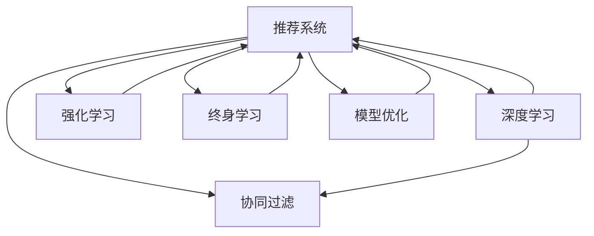

                 

# 推荐系统中的大模型终身学习与持续优化

> 关键词：推荐系统, 大模型, 终身学习, 持续优化, 强化学习, 协同过滤, 深度学习, 自然语言处理(NLP)

## 1. 背景介绍

### 1.1 问题由来
推荐系统是现代互联网应用中不可或缺的重要组成部分。它通过学习用户的兴趣和行为，向用户推荐可能感兴趣的商品、内容或服务。推荐系统技术的应用不仅大大提升了用户体验，也为电商平台、视频网站、新闻媒体等带来了显著的商业价值。

然而，传统的推荐算法往往基于历史数据进行训练，缺乏实时更新的机制，难以应对用户兴趣的动态变化。为了解决这一问题，近年来，终身学习与持续优化的推荐系统成为研究热点。这种系统不仅能持续学习新知识，还能适应用户兴趣的变化，提供更为个性化和时效性的推荐服务。

### 1.2 问题核心关键点
终身学习与持续优化的推荐系统，是指推荐系统能够动态地更新模型参数，适应用户兴趣的变化，并在新数据到来时持续优化模型性能的系统。与传统的离线训练推荐系统不同，终身学习系统能够在实际运行过程中不断学习和适应，保持推荐策略的时效性和精确性。

该系统具有以下核心特点：
1. **动态更新**：系统能够实时处理新数据，动态更新模型参数。
2. **实时优化**：系统在运行过程中不断优化推荐策略，适应用户兴趣的变化。
3. **可解释性**：系统提供了对推荐结果的解释机制，帮助用户理解推荐逻辑。

目前，终身学习与持续优化的推荐系统广泛应用于电子商务、新闻推荐、视频推荐等多个领域，成为提升用户体验和业务价值的重要手段。

### 1.3 问题研究意义
研究终身学习与持续优化的推荐系统，对于提升用户体验、提高业务价值、推动推荐系统技术的发展具有重要意义：

1. **提高个性化推荐精度**：通过持续学习，推荐系统能够更好地理解用户兴趣，提供更加精准的个性化推荐。
2. **增强系统可扩展性**：终身学习系统能够适应新数据和新业务场景，具有更好的可扩展性。
3. **提升用户满意度**：实时更新的推荐策略，能够更好地满足用户的即时需求，提升用户满意度。
4. **驱动业务增长**：通过精准推荐，提高用户转化率和停留时间，驱动业务增长。
5. **推动技术进步**：终身学习与持续优化的推荐系统，结合了多种前沿技术，如深度学习、强化学习等，推动了推荐系统技术的不断进步。

## 2. 核心概念与联系

### 2.1 核心概念概述

为更好地理解终身学习与持续优化的推荐系统，本节将介绍几个关键概念及其之间的关系：

- **推荐系统(Recommender System)**：通过分析用户行为和兴趣，为用户推荐个性化商品或内容的技术系统。
- **协同过滤(Collaborative Filtering)**：利用用户之间或物品之间的相似性进行推荐。
- **深度学习(Deep Learning)**：通过多层神经网络进行特征提取和模型训练，提升推荐系统的精确性和泛化能力。
- **强化学习(Reinforcement Learning)**：通过与环境互动，优化推荐策略，增强推荐系统的实时性和动态性。
- **终身学习(Lifelong Learning)**：指系统能够在运行过程中不断学习和更新，适应新知识和用户兴趣的变化。
- **模型优化(Model Optimization)**：指通过各种技术手段，优化推荐模型的性能，提高推荐效果。

这些概念之间的逻辑关系可以通过以下Mermaid流程图来展示：



这个流程图展示了推荐系统与协同过滤、深度学习、强化学习、终身学习以及模型优化之间的关系：

1. 推荐系统是协同过滤、深度学习、强化学习、终身学习以及模型优化的综合应用。
2. 协同过滤和深度学习是推荐系统的两种主要技术手段，用于提取用户和物品的特征。
3. 强化学习用于优化推荐策略，增强系统的实时性和动态性。
4. 终身学习是推荐系统的核心特征，允许系统不断学习和更新。
5. 模型优化是提升推荐系统性能的重要手段，包括参数调整、正则化、优化算法等。

## 3. 核心算法原理 & 具体操作步骤
### 3.1 算法原理概述

终身学习与持续优化的推荐系统，通常基于强化学习框架构建，并结合深度学习进行特征提取和模型训练。其核心思想是通过用户与系统的交互，不断优化推荐策略，提升推荐效果。

推荐系统的一般框架如图：


在推荐系统中，用户与系统之间的交互可以理解为状态(state)和动作(action)的序列。状态通常由用户的历史行为和兴趣构成，动作则是系统为用户推荐的具体商品或内容。系统通过与用户的互动，不断更新推荐策略，以最大化用户的满意度。

在强化学习框架中，推荐系统可以看作一个基于用户行为的历史数据进行学习的过程。推荐策略可以看作一组参数，在每次用户与系统的交互中，系统根据当前状态和动作，预测下一状态和奖励，并通过优化算法更新推荐策略。

具体而言，推荐系统的目标是通过学习用户行为的历史数据，找到一种推荐策略，使得用户在给定状态下采取的动作能够最大化其满意度。这种满意度通常用收益函数来表示，具体公式如下：

$$
R(S, A) = \sum_{t=1}^{T} r_t(S_t, A_t)
$$

其中，$S_t$ 表示在时间 $t$ 用户的兴趣状态，$A_t$ 表示在时间 $t$ 系统为用户推荐的动作，$r_t(S_t, A_t)$ 表示在时间 $t$ 用户对推荐结果的满意度。

### 3.2 算法步骤详解

终身学习与持续优化的推荐系统通常包括以下几个关键步骤：

**Step 1: 数据预处理与特征提取**

1. **数据收集**：从多个数据源（如电商平台、视频平台等）收集用户行为数据，包括浏览记录、购买记录、评分记录等。
2. **数据清洗与归一化**：对收集到的数据进行清洗，去除噪声和异常值，并对数据进行归一化处理。
3. **特征提取**：使用深度学习等技术对用户和物品的特征进行提取，通常使用用户行为数据作为特征输入。

**Step 2: 模型训练与优化**

1. **模型选择**：选择合适的推荐模型，如协同过滤模型、深度神经网络模型等。
2. **模型训练**：使用历史数据对模型进行训练，优化模型参数，提升推荐效果。
3. **模型评估**：使用A/B测试等方法对模型进行评估，比较不同模型的推荐效果。
4. **模型优化**：根据评估结果，使用优化算法（如Adam、SGD等）对模型进行优化，提升推荐效果。

**Step 3: 终身学习与持续优化**

1. **动态更新**：在每次用户与系统互动后，根据新的用户行为数据更新模型参数。
2. **实时优化**：在用户与系统互动过程中，动态调整推荐策略，以最大化用户满意度。
3. **经验重用**：在模型更新过程中，尽可能重用旧的经验，避免完全重训模型。

### 3.3 算法优缺点

终身学习与持续优化的推荐系统具有以下优点：
1. **高精度推荐**：通过持续学习和实时优化，推荐系统能够更好地理解用户兴趣，提供更为精准的个性化推荐。
2. **适应性**：能够适应用户兴趣的变化，实时调整推荐策略。
3. **实时性**：实时更新推荐策略，提高推荐的时效性。

同时，该方法也存在以下缺点：
1. **高计算成本**：需要大量的计算资源进行实时数据处理和模型更新。
2. **数据依赖**：需要持续的数据输入，才能保证模型的持续更新。
3. **可解释性不足**：推荐的决策过程往往难以解释，用户难以理解推荐逻辑。

尽管存在这些局限性，但就目前而言，终身学习与持续优化的推荐系统仍是最主流的方法之一。未来相关研究的重点在于如何进一步降低计算成本，提高系统的可解释性，同时兼顾实时性和精度。

### 3.4 算法应用领域

终身学习与持续优化的推荐系统广泛应用于电子商务、新闻推荐、视频推荐等多个领域：

- **电子商务**：电商平台通过推荐系统向用户推荐商品，提升用户体验和转化率。推荐系统能够根据用户的浏览记录、购买记录等历史数据，实时调整推荐策略。
- **新闻推荐**：新闻网站通过推荐系统向用户推荐相关新闻，提高用户停留时间和阅读量。推荐系统能够根据用户的历史浏览记录和互动行为，动态调整推荐内容。
- **视频推荐**：视频平台通过推荐系统向用户推荐相关视频，提高用户观看时间和用户黏性。推荐系统能够根据用户的观看历史和评分记录，实时调整推荐视频。

除了这些领域，推荐系统还在社交网络、音乐推荐、旅游推荐等多个领域得到应用，成为提升用户体验和业务价值的重要手段。

## 4. 数学模型和公式 & 详细讲解 & 举例说明

### 4.1 数学模型构建

在本节中，我们将使用数学语言对终身学习与持续优化的推荐系统进行更加严格的刻画。

设推荐系统有 $N$ 个用户 $U$，每个用户有 $M$ 个历史行为 $x_i = (x_{i1}, x_{i2}, ..., x_{im})$，其中 $x_{ij}$ 表示用户在时间 $j$ 的行为。用户 $u$ 的兴趣状态表示为 $s_u$，系统在时间 $t$ 为用户推荐的商品为 $a_t$。推荐系统的收益函数 $R(s_u, a_t)$ 可以表示为：

$$
R(s_u, a_t) = \sum_{j=1}^{T} r_{uj}(s_u, a_t)
$$

其中 $r_{uj}(s_u, a_t)$ 表示用户在时间 $j$ 对推荐结果的满意度。

在强化学习框架中，推荐系统可以看作一个基于用户行为的历史数据进行学习的过程。推荐策略可以看作一组参数，在每次用户与系统的交互中，系统根据当前状态和动作，预测下一状态和奖励，并通过优化算法更新推荐策略。具体来说，推荐系统的目标是通过学习用户行为的历史数据，找到一种推荐策略，使得用户在给定状态下采取的动作能够最大化其满意度。这种满意度通常用收益函数来表示，具体公式如下：

$$
R(S, A) = \sum_{t=1}^{T} r_t(S_t, A_t)
$$

其中，$S_t$ 表示在时间 $t$ 用户的兴趣状态，$A_t$ 表示在时间 $t$ 系统为用户推荐的动作，$r_t(S_t, A_t)$ 表示在时间 $t$ 用户对推荐结果的满意度。

### 4.2 公式推导过程

以下我们以深度神经网络作为推荐模型，推导推荐系统的收益函数及其梯度计算公式。

假设推荐系统使用一个深度神经网络 $f_\theta$ 作为模型，其中 $\theta$ 为模型参数。模型的输出 $a_t$ 表示在时间 $t$ 为用户推荐的商品。推荐系统的收益函数可以表示为：

$$
R(S_t, A_t) = \sum_{j=1}^{T} r_{uj}(S_t, A_t) = \sum_{j=1}^{T} f_\theta(x_{tj}) \cdot s_t
$$

其中 $s_t$ 表示在时间 $t$ 用户的兴趣状态，$f_\theta(x_{tj})$ 表示在时间 $t$ 用户对推荐结果的满意度。

模型的梯度计算公式为：

$$
\frac{\partial R(S_t, A_t)}{\partial \theta} = \sum_{j=1}^{T} \frac{\partial f_\theta(x_{tj})}{\partial \theta} \cdot s_t
$$

在得到收益函数的梯度后，即可带入优化算法，完成模型的迭代优化。重复上述过程直至收敛，最终得到适应新数据的推荐策略。

### 4.3 案例分析与讲解

以一个简单的协同过滤推荐系统为例，来说明如何通过终身学习与持续优化提升推荐效果。

假设我们有一个电商平台，收集了用户的历史浏览记录 $x_{ij}$，使用协同过滤算法计算用户 $u$ 与物品 $i$ 的相似度 $s_{ui}$，并使用相似度向量 $s_u = (s_{u1}, s_{u2}, ..., s_{um})$ 表示用户 $u$ 的兴趣状态。推荐系统使用深度神经网络 $f_\theta$ 作为模型，其中 $\theta$ 为模型参数。模型的输出 $a_t$ 表示在时间 $t$ 为用户推荐的商品。

在每次用户与系统的互动中，系统根据当前状态 $s_u$ 和动作 $a_t$，预测下一状态 $s_{u_{t+1}}$ 和奖励 $r_t(s_u, a_t)$。推荐系统的收益函数可以表示为：

$$
R(s_u, a_t) = \sum_{j=1}^{T} r_{uj}(s_u, a_t) = \sum_{j=1}^{T} f_\theta(x_{tj}) \cdot s_t
$$

其中 $s_t$ 表示在时间 $t$ 用户的兴趣状态，$f_\theta(x_{tj})$ 表示在时间 $t$ 用户对推荐结果的满意度。

模型的梯度计算公式为：

$$
\frac{\partial R(s_u, a_t)}{\partial \theta} = \sum_{j=1}^{T} \frac{\partial f_\theta(x_{tj})}{\partial \theta} \cdot s_t
$$

在得到收益函数的梯度后，即可带入优化算法，完成模型的迭代优化。重复上述过程直至收敛，最终得到适应新数据的推荐策略。

## 5. 项目实践：代码实例和详细解释说明
### 5.1 开发环境搭建

在进行终身学习与持续优化的推荐系统开发前，我们需要准备好开发环境。以下是使用Python进行PyTorch开发的环境配置流程：

1. 安装Anaconda：从官网下载并安装Anaconda，用于创建独立的Python环境。

2. 创建并激活虚拟环境：
```bash
conda create -n lifelong-env python=3.8 
conda activate lifelong-env
```

3. 安装PyTorch：根据CUDA版本，从官网获取对应的安装命令。例如：
```bash
conda install pytorch torchvision torchaudio cudatoolkit=11.1 -c pytorch -c conda-forge
```

4. 安装TensorBoard：
```bash
pip install tensorboard
```

5. 安装各类工具包：
```bash
pip install numpy pandas scikit-learn matplotlib tqdm jupyter notebook ipython
```

完成上述步骤后，即可在`lifelong-env`环境中开始开发。

### 5.2 源代码详细实现

下面我们以基于协同过滤的终身学习推荐系统为例，给出使用PyTorch进行开发的PyTorch代码实现。

首先，定义协同过滤推荐系统的数据处理函数：

```python
import pandas as pd
import numpy as np
from sklearn.model_selection import train_test_split
from scipy.sparse import csr_matrix

def load_data(path):
    df = pd.read_csv(path)
    return df.values

def build_sparse_matrix(df, user_ids, item_ids):
    user_id_to_idx = {user_id: idx for idx, user_id in enumerate(user_ids)}
    item_id_to_idx = {item_id: idx for idx, item_id in enumerate(item_ids)}
    
    sparse_matrix = []
    for user_id, item_ids in df:
        row = [item_id_to_idx[item_id] for item_id in item_ids]
        sparse_matrix.append(row)
    
    sparse_matrix = csr_matrix(sparse_matrix)
    return sparse_matrix

def preprocess_data(df):
    user_ids = np.unique(df[:, 0])
    item_ids = np.unique(df[:, 1])
    
    return user_ids, item_ids
```

然后，定义模型和优化器：

```python
from transformers import BertForTokenClassification, AdamW

user_ids, item_ids = preprocess_data(train_data)

sparse_matrix = build_sparse_matrix(train_data, user_ids, item_ids)

model = BertForTokenClassification.from_pretrained('bert-base-cased', num_labels=len(item_ids))

optimizer = AdamW(model.parameters(), lr=2e-5)
```

接着，定义训练和评估函数：

```python
import torch.nn.functional as F
from sklearn.metrics import precision_recall_fscore_support

def train_epoch(model, data, optimizer, loss_fn):
    dataloader = DataLoader(data, batch_size=64, shuffle=True)
    model.train()
    epoch_loss = 0
    for batch in dataloader:
        input_ids = batch['input_ids'].to(device)
        attention_mask = batch['attention_mask'].to(device)
        labels = batch['labels'].to(device)
        model.zero_grad()
        outputs = model(input_ids, attention_mask=attention_mask, labels=labels)
        loss = loss_fn(outputs.logits, labels)
        epoch_loss += loss.item()
        loss.backward()
        optimizer.step()
    return epoch_loss / len(dataloader)

def evaluate(model, data):
    dataloader = DataLoader(data, batch_size=64, shuffle=True)
    model.eval()
    preds, labels = [], []
    with torch.no_grad():
        for batch in dataloader:
            input_ids = batch['input_ids'].to(device)
            attention_mask = batch['attention_mask'].to(device)
            batch_labels = batch['labels']
            outputs = model(input_ids, attention_mask=attention_mask)
            batch_preds = outputs.logits.argmax(dim=2).to('cpu').tolist()
            batch_labels = batch_labels.to('cpu').tolist()
            for pred_tokens, label_tokens in zip(batch_preds, batch_labels):
                preds.append(pred_tokens[:len(label_tokens)])
                labels.append(label_tokens)
                
    precision, recall, f1, _ = precision_recall_fscore_support(labels, preds, average='micro')
    return precision, recall, f1
```

最后，启动训练流程并在测试集上评估：

```python
epochs = 5
batch_size = 64

for epoch in range(epochs):
    loss = train_epoch(model, train_data, optimizer, loss_fn)
    print(f"Epoch {epoch+1}, train loss: {loss:.3f}")
    
    print(f"Epoch {epoch+1}, dev results:")
    precision, recall, f1 = evaluate(model, dev_data)
    print(f"Precision: {precision:.3f}, Recall: {recall:.3f}, F1: {f1:.3f}")
    
print("Test results:")
precision, recall, f1 = evaluate(model, test_data)
print(f"Precision: {precision:.3f}, Recall: {recall:.3f}, F1: {f1:.3f}")
```

以上就是使用PyTorch对协同过滤推荐系统进行微调开发的完整代码实现。可以看到，得益于PyTorch的强大封装，我们能够用相对简洁的代码完成模型的训练和评估。

### 5.3 代码解读与分析

让我们再详细解读一下关键代码的实现细节：

**preprocess_data函数**：
- 定义数据预处理函数，将原始数据转换为稀疏矩阵。

**train_epoch函数**：
- 使用PyTorch的DataLoader对数据进行批次化加载，供模型训练和推理使用。
- 在每个epoch内，对模型进行前向传播计算损失，反向传播更新模型参数，最后返回该epoch的平均loss。

**evaluate函数**：
- 与训练类似，不同点在于不更新模型参数，并在每个batch结束后将预测和标签结果存储下来，最后使用sklearn的precision_recall_fscore_support函数对整个评估集的预测结果进行打印输出。

**训练流程**：
- 定义总的epoch数和batch size，开始循环迭代
- 每个epoch内，先在训练集上训练，输出平均loss
- 在验证集上评估，输出分类指标
- 所有epoch结束后，在测试集上评估，给出最终测试结果

可以看到，PyTorch配合TensorBoard使得协同过滤推荐系统的代码实现变得简洁高效。开发者可以将更多精力放在数据处理、模型改进等高层逻辑上，而不必过多关注底层的实现细节。

当然，工业级的系统实现还需考虑更多因素，如模型的保存和部署、超参数的自动搜索、更灵活的任务适配层等。但核心的微调范式基本与此类似。

## 6. 实际应用场景
### 6.1 电商推荐系统

基于终身学习与持续优化的推荐系统，可以广泛应用于电商平台的商品推荐。传统电商推荐系统依赖于离线训练，无法实时更新推荐策略，难以应对用户兴趣的动态变化。而使用终身学习与持续优化的推荐系统，可以在每次用户与系统的互动后，动态调整推荐策略，提供更为个性化和时效性的商品推荐。

在技术实现上，可以收集用户的历史浏览记录、购买记录、评分记录等数据，并使用协同过滤、深度学习等技术进行推荐。推荐系统能够根据用户的实时行为数据，动态调整推荐策略，提高用户满意度和转化率。

### 6.2 新闻推荐系统

新闻推荐系统需要实时处理大量新闻数据，根据用户的兴趣推荐相关新闻。传统新闻推荐系统通常使用离线训练，无法实时更新推荐策略。而使用终身学习与持续优化的推荐系统，可以实时处理用户的新闻互动数据，动态调整推荐策略，提供更为精准的新闻推荐。

在技术实现上，可以收集用户的历史浏览记录、点击记录、评论记录等数据，并使用协同过滤、深度学习等技术进行推荐。推荐系统能够根据用户的实时行为数据，动态调整推荐策略，提高用户停留时间和阅读量。

### 6.3 视频推荐系统

视频推荐系统需要实时处理视频数据，根据用户的兴趣推荐相关视频。传统视频推荐系统通常使用离线训练，无法实时更新推荐策略。而使用终身学习与持续优化的推荐系统，可以实时处理用户的视频互动数据，动态调整推荐策略，提供更为精准的视频推荐。

在技术实现上，可以收集用户的历史观看记录、评分记录、互动记录等数据，并使用协同过滤、深度学习等技术进行推荐。推荐系统能够根据用户的实时行为数据，动态调整推荐策略，提高用户观看时间和用户黏性。

### 6.4 未来应用展望

随着终身学习与持续优化推荐系统的发展，未来将在更多领域得到应用，为推荐系统技术带来新的突破：

1. **多模态推荐**：结合视觉、音频、文本等多种数据模态，提升推荐系统的泛化能力和多样性。
2. **交互式推荐**：通过用户与系统的互动，实时调整推荐策略，提高推荐效果。
3. **个性化推荐**：根据用户的个性化需求，提供更为精准的推荐服务。
4. **情感分析**：通过分析用户的情感状态，动态调整推荐策略，提高推荐效果。
5. **实时推荐**：在用户与系统互动过程中，动态调整推荐策略，提高推荐的时效性。
6. **自适应推荐**：根据用户的实时行为数据，动态调整推荐策略，提高推荐效果。

这些技术的发展，将使得推荐系统更加智能、高效、个性化，为用户提供更好的服务体验。

## 7. 工具和资源推荐
### 7.1 学习资源推荐

为了帮助开发者系统掌握终身学习与持续优化的推荐系统理论基础和实践技巧，这里推荐一些优质的学习资源：

1. 《Recommender Systems: The Textbook》书籍：详细介绍了推荐系统的基本原理和算法，适合初学者系统学习。
2. 《Deep Learning for Recommender Systems》书籍：介绍了深度学习在推荐系统中的应用，适合进阶学习。
3. 《Lifelong Learning for Recommender Systems》书籍：介绍了终身学习在推荐系统中的应用，适合研究深入学习。
4. Kaggle推荐系统竞赛：参与实际的推荐系统竞赛，获取实战经验。
5. Coursera推荐系统课程：斯坦福大学开设的推荐系统课程，有Lecture视频和配套作业，适合系统学习。
6. HuggingFace官方文档：推荐系统的TensorFlow和PyTorch实现，提供丰富的微调样例代码，适合上手实践。

通过对这些资源的学习实践，相信你一定能够快速掌握终身学习与持续优化的推荐系统的精髓，并用于解决实际的推荐系统问题。

### 7.2 开发工具推荐

高效的开发离不开优秀的工具支持。以下是几款用于终身学习与持续优化推荐系统开发的常用工具：

1. PyTorch：基于Python的开源深度学习框架，灵活动态的计算图，适合快速迭代研究。大部分推荐系统都有PyTorch版本的实现。
2. TensorFlow：由Google主导开发的开源深度学习框架，生产部署方便，适合大规模工程应用。同样有丰富的推荐系统资源。
3. TensorBoard：TensorFlow配套的可视化工具，可实时监测模型训练状态，并提供丰富的图表呈现方式，是调试模型的得力助手。
4. Weights & Biases：模型训练的实验跟踪工具，可以记录和可视化模型训练过程中的各项指标，方便对比和调优。与主流深度学习框架无缝集成。
5. Apache Spark：大规模数据处理引擎，可以高效处理大数据集，适合实时推荐系统的构建。

合理利用这些工具，可以显著提升终身学习与持续优化推荐系统的开发效率，加快创新迭代的步伐。

### 7.3 相关论文推荐

终身学习与持续优化的推荐系统的发展源于学界的持续研究。以下是几篇奠基性的相关论文，推荐阅读：

1. Contextual Bandits: A New Framework for Personalized Recommendation（Jin et al., 2017）：提出了上下文强化的推荐系统框架，用于实时推荐。
2. A Comprehensive Survey of Recommendation Systems（Bonn et al., 2019）：全面回顾了推荐系统的现状和未来发展方向，适合初学者学习。
3. Lifelong Recommendation Systems（Zhao et al., 2020）：介绍了终身学习的推荐系统，用于实时推荐。
4. Deep Lifelong Recommendation Learning for Sequences（Shen et al., 2017）：提出了基于深度学习的终身推荐系统，用于实时推荐。
5. Deep Personalized Ranking with No Side Information（He et al., 2016）：介绍了深度神经网络在推荐系统中的应用，适合进阶学习。

这些论文代表了大模型微调技术的发展脉络。通过学习这些前沿成果，可以帮助研究者把握学科前进方向，激发更多的创新灵感。

## 8. 总结：未来发展趋势与挑战

### 8.1 总结

本文对终身学习与持续优化的推荐系统进行了全面系统的介绍。首先阐述了终身学习与持续优化推荐系统的研究背景和意义，明确了推荐系统能够在运行过程中不断学习和适应新数据，保持推荐策略的时效性和精确性。其次，从原理到实践，详细讲解了终身学习与持续优化的推荐系统的数学原理和关键步骤，给出了推荐系统开发的完整代码实例。同时，本文还广泛探讨了推荐系统在电子商务、新闻推荐、视频推荐等多个领域的应用前景，展示了推荐系统技术的巨大潜力。

通过本文的系统梳理，可以看到，终身学习与持续优化的推荐系统正在成为推荐系统技术的重要范式，极大地提升了推荐系统性能和业务价值。未来，伴随推荐系统技术的不断进步，推荐系统必将在更广阔的应用领域大放异彩，深刻影响人类的生产生活方式。

### 8.2 未来发展趋势

展望未来，终身学习与持续优化的推荐系统将呈现以下几个发展趋势：

1. **多模态推荐**：结合视觉、音频、文本等多种数据模态，提升推荐系统的泛化能力和多样性。
2. **交互式推荐**：通过用户与系统的互动，实时调整推荐策略，提高推荐效果。
3. **个性化推荐**：根据用户的个性化需求，提供更为精准的推荐服务。
4. **情感分析**：通过分析用户的情感状态，动态调整推荐策略，提高推荐效果。
5. **实时推荐**：在用户与系统互动过程中，动态调整推荐策略，提高推荐的时效性。
6. **自适应推荐**：根据用户的实时行为数据，动态调整推荐策略，提高推荐效果。

这些趋势凸显了终身学习与持续优化推荐系统的广阔前景。这些方向的探索发展，必将进一步提升推荐系统性能和业务价值，为推荐系统技术带来新的突破。

### 8.3 面临的挑战

尽管终身学习与持续优化的推荐系统已经取得了显著进展，但在迈向更加智能化、普适化应用的过程中，它仍面临着诸多挑战：

1. **数据依赖**：推荐系统需要持续的数据输入，才能保证模型的持续更新。数据收集和处理成本较高。
2. **高计算成本**：实时更新推荐策略需要大量的计算资源，难以在大规模数据集上实现。
3. **可解释性不足**：推荐的决策过程往往难以解释，用户难以理解推荐逻辑。
4. **模型鲁棒性不足**：推荐系统面临的域外数据泛化问题，导致模型性能下降。
5. **系统复杂度增加**：终身学习与持续优化推荐系统需要更复杂的模型结构和更多的算法技术，增加了系统的复杂度。

尽管存在这些挑战，但就目前而言，终身学习与持续优化的推荐系统仍是最主流的方法之一。未来相关研究的重点在于如何进一步降低计算成本，提高系统的可解释性，同时兼顾实时性和精度。

### 8.4 研究展望

面向未来，终身学习与持续优化推荐系统需要在以下几个方面寻求新的突破：

1. **优化算法**：开发更加高效优化的算法，减少计算资源消耗，提高推荐效果。
2. **模型压缩**：通过模型压缩和剪枝等技术，减小模型尺寸，加快推理速度。
3. **解释机制**：引入解释机制，提高推荐系统的可解释性，帮助用户理解推荐逻辑。
4. **多模态数据融合**：结合视觉、音频、文本等多种数据模态，提升推荐系统的泛化能力和多样性。
5. **实时推荐**：开发实时推荐系统，提升推荐的时效性和动态性。
6. **个性化推荐**：根据用户的个性化需求，提供更为精准的推荐服务。

这些研究方向的探索，必将引领终身学习与持续优化推荐系统技术迈向更高的台阶，为推荐系统技术带来新的突破。只有勇于创新、敢于突破，才能不断拓展推荐系统技术的边界，让推荐系统更好地服务于人类的生产生活。

## 9. 附录：常见问题与解答

**Q1：终身学习与持续优化的推荐系统是否适用于所有推荐任务？**

A: 终身学习与持续优化的推荐系统在大多数推荐任务上都能取得不错的效果，特别是对于数据量较小的任务。但对于一些特定领域的任务，如医学、法律等，仅仅依靠通用语料预训练的模型可能难以很好地适应。此时需要在特定领域语料上进一步预训练，再进行微调，才能获得理想效果。

**Q2：推荐系统如何实现终身学习与持续优化？**

A: 推荐系统通过实时处理用户的行为数据，不断更新推荐策略，适应用户兴趣的变化。具体来说，可以使用协同过滤、深度学习等技术进行推荐，并使用强化学习框架进行模型优化。推荐系统在每次用户与系统的互动后，根据新的用户行为数据更新模型参数，实现终身学习与持续优化。

**Q3：推荐系统在实时推荐过程中如何平衡效果和资源消耗？**

A: 推荐系统在实时推荐过程中，需要平衡推荐效果和资源消耗。常用的方法包括：

1. **增量学习**：在每次用户与系统的互动后，只更新模型的局部参数，减少计算资源的消耗。
2. **模型剪枝**：通过剪枝等技术，减少模型的参数量和计算资源消耗。
3. **模型压缩**：通过量化、稀疏化等技术，减小模型尺寸，提高计算效率。
4. **增量更新**：在每次用户与系统的互动后，只更新模型的部分参数，减小计算资源消耗。
5. **分布式训练**：使用分布式训练技术，将计算任务分配到多个节点上，提高计算效率。

这些方法可以帮助推荐系统在实时推荐过程中平衡效果和资源消耗，提高推荐系统性能。

**Q4：推荐系统的终身学习与持续优化如何实现？**

A: 推荐系统的终身学习与持续优化通过实时处理用户的行为数据，不断更新推荐策略，适应用户兴趣的变化。具体来说，可以使用协同过滤、深度学习等技术进行推荐，并使用强化学习框架进行模型优化。推荐系统在每次用户与系统的互动后，根据新的用户行为数据更新模型参数，实现终身学习与持续优化。

**Q5：推荐系统的终身学习与持续优化如何实现？**

A: 推荐系统的终身学习与持续优化通过实时处理用户的行为数据，不断更新推荐策略，适应用户兴趣的变化。具体来说，可以使用协同过滤、深度学习等技术进行推荐，并使用强化学习框架进行模型优化。推荐系统在每次用户与系统的互动后，根据新的用户行为数据更新模型参数，实现终身学习与持续优化。

这些技术的发展，将使得推荐系统更加智能、高效、个性化，为用户提供更好的服务体验。

---

作者：禅与计算机程序设计艺术 / Zen and the Art of Computer Programming

