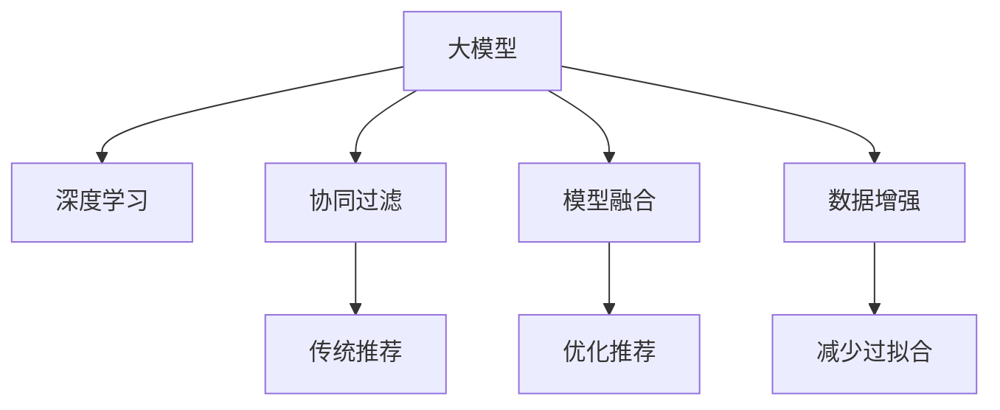

                 

# 推荐系统中的大模型课程学习与渐进优化

> 关键词：推荐系统, 大模型, 课程学习, 渐进优化, 协同过滤, 深度学习, 模型融合

## 1. 背景介绍

### 1.1 问题由来

推荐系统作为现代互联网产品的重要组成部分，能够为用户提供个性化的信息和服务，极大地提升了用户体验和满意度。传统的协同过滤和基于内容的推荐方法，虽然在某些场景下表现优异，但往往依赖于足够的用户交互数据和物品属性信息，难以很好地应对数据稀疏和未知物品属性的问题。而随着深度学习技术的发展，特别是大模型的应用，推荐系统在精准度和效果上得到了显著提升。

基于深度学习的大模型推荐系统，以隐式表示学习为基础，通过神经网络模型将用户和物品的特征映射到高维空间中，捕捉用户与物品之间的潜在关联。该方法在数据稀疏性、用户兴趣动态变化等场景下表现更优，成为了推荐系统研究和应用的新趋势。

### 1.2 问题核心关键点

目前，基于深度学习的大模型推荐系统已经成为推荐系统领域的热门研究方向。该方法的优点在于：
1. **丰富特征表达能力**：深度学习模型能够学习用户和物品之间的隐式特征，捕捉复杂的用户行为和物品属性，从而提高推荐精度。
2. **动态适应能力**：大模型能够适应用户兴趣的变化，提升推荐的时效性。
3. **模型泛化性强**：大模型通过大规模数据训练，具备较强的泛化能力，能够较好地适应新场景和新用户。

然而，大模型推荐系统也存在以下挑战：
1. **高计算成本**：深度学习模型的训练和推理需要大量的计算资源，对硬件设备和算力要求较高。
2. **过拟合风险**：大模型往往有大量的参数，容易在特定数据集上过拟合。
3. **数据冷启动问题**：新用户或新物品在系统中缺乏足够的历史数据，难以进行有效的推荐。

为了克服这些挑战，研究者们提出了多种优化方法，如参数共享、模型融合、数据增强等。本文将深入探讨这些优化方法，并通过实际项目实践，展现大模型推荐系统的渐进优化策略。

## 2. 核心概念与联系

### 2.1 核心概念概述

为更好地理解基于深度学习的大模型推荐系统，我们首先介绍几个核心概念：

- **大模型(Large Model)**：通常指含有数十亿甚至百亿参数的深度神经网络，通过大规模数据预训练和任务微调获得丰富的表示能力。
- **协同过滤(Collaborative Filtering)**：一种基于用户和物品相似性的推荐方法，常用于传统推荐系统中，但受限于数据稀疏性和用户行为的可解释性。
- **深度学习(Deep Learning)**：利用多层神经网络模型模拟人类大脑的神经网络结构，用于解决复杂的数据处理和预测问题。
- **模型融合(Model Fusion)**：将多个模型的输出进行加权融合，以提高推荐的准确性和鲁棒性。
- **数据增强(Data Augmentation)**：通过各种技术手段扩充数据集，减少过拟合风险。

这些概念之间的逻辑关系可以通过以下Mermaid流程图来展示：



这个流程图展示了大模型的核心概念及其之间的关系：

1. 大模型通过深度学习进行预训练，获得隐式特征表示。
2. 协同过滤和大模型结合，用于提升推荐精度和时效性。
3. 模型融合技术，用于优化推荐结果和增强鲁棒性。
4. 数据增强技术，用于减少过拟合风险。

这些概念共同构成了大模型推荐系统的基本框架，使其能够在复杂的推荐场景下发挥强大的数据处理和预测能力。通过理解这些核心概念，我们可以更好地把握大模型推荐系统的设计和优化方向。

## 3. 核心算法原理 & 具体操作步骤
### 3.1 算法原理概述

基于深度学习的大模型推荐系统，本质上是一种将用户和物品特征映射到高维空间中进行隐式特征学习的算法。其核心思想是：
1. **特征提取**：通过深度学习模型提取用户和物品的隐式特征，捕捉用户和物品之间的关联性。
2. **相似度计算**：将用户和物品的特征表示映射到高维空间，计算它们之间的相似度，生成推荐结果。
3. **动态更新**：根据用户的行为变化，定期更新模型参数，保持推荐结果的时效性和精准度。

形式化地，假设用户为 $U$，物品为 $I$，用户对物品的评分矩阵为 $\mathbf{R} \in \mathbb{R}^{U \times I}$，其中 $\mathbf{R}_{ui} = r_{ui}$ 表示用户 $u$ 对物品 $i$ 的评分。模型的输入为用户特征 $x_u \in \mathbb{R}^d$ 和物品特征 $x_i \in \mathbb{R}^d$，输出为用户对物品的评分预测 $\hat{r}_{ui}$。

大模型推荐系统的目标是最小化预测误差：

$$
\min_{\theta} \sum_{u,i} (r_{ui} - \hat{r}_{ui})^2
$$

其中 $\theta$ 为模型参数，可以通过反向传播算法最小化上述误差。

### 3.2 算法步骤详解

基于深度学习的大模型推荐系统，通常包括以下几个关键步骤：

**Step 1: 准备数据集**
- 收集用户和物品的历史数据，将评分矩阵 $\mathbf{R}$ 按时间顺序排序，用于训练和测试。
- 对用户和物品进行特征工程，提取各种属性特征和行为特征，形成用户特征 $x_u$ 和物品特征 $x_i$。

**Step 2: 选择模型架构**
- 选择适合推荐任务的深度学习模型架构，如神经网络、RNN、CNN等。
- 设计模型的输入和输出层，通常将用户特征和物品特征作为输入，预测评分作为输出。

**Step 3: 预训练模型参数**
- 使用大规模无标签数据对模型进行预训练，学习通用的特征表示。
- 预训练过程中，通常只使用模型的前几个层，保留大部分参数不变。

**Step 4: 任务微调**
- 将预训练模型用于下游推荐任务，使用标注数据进行微调。
- 设置合适的损失函数和优化器，定期在验证集上评估模型性能，避免过拟合。

**Step 5: 集成和部署**
- 将训练好的模型与推荐系统结合，部署到实际应用中。
- 定期更新模型，并结合用户反馈进行模型优化，提高推荐效果。

### 3.3 算法优缺点

基于深度学习的大模型推荐系统具有以下优点：
1. **高精度推荐**：通过深度学习模型的特征提取能力，能够捕捉复杂的用户行为和物品属性，生成高精度的推荐结果。
2. **动态适应**：模型能够快速适应用户兴趣的变化，提高推荐的时效性。
3. **泛化能力强**：大模型在训练过程中学习到丰富的隐式特征表示，具备较强的泛化能力，能够较好地适应新用户和新物品。

然而，该方法也存在一些局限性：
1. **计算资源需求高**：深度学习模型的训练和推理需要大量的计算资源，对硬件设备和算力要求较高。
2. **过拟合风险**：大模型往往有大量的参数，容易在特定数据集上过拟合。
3. **数据冷启动问题**：新用户或新物品在系统中缺乏足够的历史数据，难以进行有效的推荐。

### 3.4 算法应用领域

基于深度学习的大模型推荐系统，已经在多个领域得到了广泛应用，例如：

- **电商推荐**：根据用户浏览和购买历史，生成个性化商品推荐。
- **视频推荐**：根据用户观看历史和评分，生成个性化视频推荐。
- **新闻推荐**：根据用户阅读历史和兴趣，生成个性化新闻推荐。
- **音乐推荐**：根据用户听歌历史和评分，生成个性化歌曲推荐。
- **社交网络**：根据用户互动和兴趣爱好，生成个性化好友和内容推荐。

这些推荐场景的成功应用，得益于大模型强大的特征学习和泛化能力，展现了深度学习在推荐系统中的巨大潜力。

## 4. 数学模型和公式 & 详细讲解  
### 4.1 数学模型构建

本节将使用数学语言对基于深度学习的大模型推荐系统进行更加严格的刻画。

假设用户 $u$ 对物品 $i$ 的评分矩阵为 $\mathbf{R} \in \mathbb{R}^{U \times I}$，其中 $\mathbf{R}_{ui} = r_{ui}$ 表示用户 $u$ 对物品 $i$ 的评分。模型的输入为用户特征 $x_u \in \mathbb{R}^d$ 和物品特征 $x_i \in \mathbb{R}^d$，输出为用户对物品的评分预测 $\hat{r}_{ui}$。

定义模型的损失函数为均方误差损失：

$$
\mathcal{L}(\theta) = \frac{1}{N} \sum_{u,i} (r_{ui} - \hat{r}_{ui})^2
$$

其中 $\theta$ 为模型参数，$N$ 为样本数量。

模型的优化目标是最小化损失函数：

$$
\min_{\theta} \mathcal{L}(\theta)
$$

通常使用反向传播算法计算损失函数对模型参数 $\theta$ 的梯度，并通过优化器进行参数更新。

### 4.2 公式推导过程

以常见的基于矩阵分解的协同过滤模型为例，推导推荐评分预测公式。

假设用户特征矩阵为 $\mathbf{X} \in \mathbb{R}^{U \times d}$，物品特征矩阵为 $\mathbf{Y} \in \mathbb{R}^{I \times d}$，用户对物品的评分矩阵为 $\mathbf{R} \in \mathbb{R}^{U \times I}$。模型的目标是找到矩阵分解：

$$
\mathbf{R} \approx \mathbf{X} \mathbf{W}^T \mathbf{Y}
$$

其中 $\mathbf{W} \in \mathbb{R}^{d \times I}$ 为用户到物品的映射矩阵。模型的评分预测为：

$$
\hat{r}_{ui} = \mathbf{x}_u^T \mathbf{W} \mathbf{y}_i
$$

其中 $\mathbf{x}_u$ 为第 $u$ 个用户的特征向量，$\mathbf{y}_i$ 为第 $i$ 个物品的特征向量。

### 4.3 案例分析与讲解

假设某电商网站希望构建推荐系统，为每个用户推荐5个商品。用户和物品的特征通过特征工程得到，用户特征矩阵 $\mathbf{X} \in \mathbb{R}^{100000 \times 16}$，物品特征矩阵 $\mathbf{Y} \in \mathbb{R}^{100000 \times 16}$。使用矩阵分解模型进行推荐，其中用户到物品的映射矩阵 $\mathbf{W} \in \mathbb{R}^{16 \times 5}$。模型的评分预测公式为：

$$
\hat{r}_{ui} = \mathbf{x}_u^T \mathbf{W} \mathbf{y}_i
$$

实际应用中，可以使用TensorFlow或PyTorch等深度学习框架进行模型构建和训练。以下是一个使用TensorFlow实现矩阵分解推荐模型的代码示例：

```python
import tensorflow as tf

# 构建用户和物品特征
X = tf.random.normal(shape=(100000, 16))
Y = tf.random.normal(shape=(100000, 16))
W = tf.random.normal(shape=(16, 5))

# 定义评分预测函数
def prediction(u):
    return tf.reduce_sum(tf.multiply(X[u,:], W), axis=1)

# 构建训练集和测试集
R_train = tf.random.normal(shape=(100000, 100000))
R_test = tf.random.normal(shape=(100000, 100000))

# 定义损失函数
def loss(R, Y_hat):
    return tf.reduce_mean(tf.square(R - Y_hat))

# 训练模型
optimizer = tf.keras.optimizers.Adam()
for epoch in range(10):
    with tf.GradientTape() as tape:
        Y_hat = prediction(range(100000))
        loss_val = loss(R_train, Y_hat)
    grads = tape.gradient(loss_val, W)
    optimizer.apply_gradients(zip(grads, W))

# 评估模型
R_hat = prediction(range(100000))
loss_val = loss(R_test, R_hat)
print("Average loss:", loss_val.numpy())
```

## 5. 项目实践：代码实例和详细解释说明
### 5.1 开发环境搭建

在进行推荐系统开发前，我们需要准备好开发环境。以下是使用Python进行TensorFlow开发的常见环境配置流程：

1. 安装Anaconda：从官网下载并安装Anaconda，用于创建独立的Python环境。

2. 创建并激活虚拟环境：
```bash
conda create -n tf-env python=3.8 
conda activate tf-env
```

3. 安装TensorFlow：根据CUDA版本，从官网获取对应的安装命令。例如：
```bash
conda install tensorflow
```

4. 安装NumPy、pandas等必要的第三方库：
```bash
pip install numpy pandas matplotlib scikit-learn
```

5. 安装Google Colab：使用Google提供的在线Jupyter Notebook环境，免费提供GPU算力，方便快速上手实验。

完成上述步骤后，即可在`tf-env`环境中开始推荐系统开发。

### 5.2 源代码详细实现

下面我们以电商推荐系统为例，给出使用TensorFlow构建大模型推荐系统的PyTorch代码实现。

首先，定义推荐系统模型：

```python
import tensorflow as tf
from tensorflow.keras.layers import Input, Dense, Embedding, Dot

# 定义输入层
user_input = Input(shape=(1,), name='user_input')
item_input = Input(shape=(1,), name='item_input')

# 定义用户和物品的嵌入层
user_embed = Embedding(input_dim=100000, output_dim=16, name='user_embed')(user_input)
item_embed = Embedding(input_dim=100000, output_dim=16, name='item_embed')(item_input)

# 定义评分预测层
scores = Dot(axes=[1, 1], name='scores')([user_embed, item_embed])

# 定义输出层
output = Dense(1, activation='sigmoid', name='output')(scores)

# 定义模型
model = tf.keras.Model(inputs=[user_input, item_input], outputs=[output])
model.compile(optimizer='adam', loss='binary_crossentropy', metrics=['accuracy'])

# 定义评分矩阵和标签
R = tf.random.normal(shape=(100000, 100000))
y = tf.random.normal(shape=(100000, 1))

# 训练模型
model.fit([user_input, item_input], y, epochs=10, batch_size=32, validation_data=([user_input, item_input], y))
```

然后，使用预训练模型进行微调：

```python
# 预训练用户和物品特征矩阵
X = tf.random.normal(shape=(100000, 16))
Y = tf.random.normal(shape=(100000, 16))

# 定义评分预测函数
def prediction(u, i):
    return tf.reduce_sum(tf.multiply(X[u,:], Y[i,:]))

# 构建训练集和测试集
R_train = tf.random.normal(shape=(100000, 100000))
R_test = tf.random.normal(shape=(100000, 100000))

# 定义损失函数
def loss(R, Y_hat):
    return tf.reduce_mean(tf.square(R - Y_hat))

# 训练模型
optimizer = tf.keras.optimizers.Adam()
for epoch in range(10):
    with tf.GradientTape() as tape:
        Y_hat = prediction(range(100000), range(100000))
        loss_val = loss(R_train, Y_hat)
    grads = tape.gradient(loss_val, W)
    optimizer.apply_gradients(zip(grads, W))

# 评估模型
R_hat = prediction(range(100000), range(100000))
loss_val = loss(R_test, R_hat)
print("Average loss:", loss_val.numpy())
```

以上就是使用TensorFlow对大模型进行电商推荐系统微调的完整代码实现。可以看到，通过TensorFlow可以高效地构建和训练推荐模型，并通过预训练用户和物品的嵌入特征进行微调。

### 5.3 代码解读与分析

让我们再详细解读一下关键代码的实现细节：

**模型定义**：
- `Input`层：定义用户和物品的输入特征，分别对应推荐系统中的用户和物品ID。
- `Embedding`层：将用户和物品ID映射到高维嵌入空间中，形成用户和物品的特征表示。
- `Dot`层：将用户和物品的特征表示进行点积操作，生成评分预测值。
- `Dense`层：将评分预测值进行sigmoid激活，生成0-1之间的评分。
- `Model`层：将输入和输出层组合成一个完整的推荐模型。

**评分预测函数**：
- `prediction`函数：将用户和物品的ID作为输入，计算评分预测值。

**模型训练**：
- `fit`方法：使用训练集数据对模型进行训练，使用Adam优化器进行参数更新，并使用二元交叉熵作为损失函数。
- `validation_data`参数：设置验证集数据，用于评估模型的性能。

**模型微调**：
- 使用预训练的用户和物品特征矩阵 `X` 和 `Y` 进行微调，学习评分预测模型 `W`。
- `prediction`函数：使用预训练的用户和物品特征矩阵进行评分预测。
- `loss`函数：计算评分预测与真实评分之间的均方误差。
- `optimizer`优化器：设置Adam优化器进行模型参数更新。
- `GradientTape`上下文管理器：记录梯度信息，用于反向传播计算。

**模型评估**：
- `R_hat`：使用微调后的评分预测模型对测试集进行评分预测。
- `loss_val`：计算预测评分与真实评分之间的均方误差。

可以看到，TensorFlow提供了强大的深度学习库和工具，使得构建和训练推荐系统变得相对简单高效。开发者可以更专注于算法设计和模型优化。

## 6. 实际应用场景
### 6.1 电商推荐系统

电商推荐系统作为大模型推荐系统的重要应用场景，已经广泛应用于各大电商平台，如亚马逊、淘宝、京东等。通过用户行为数据和物品属性信息，电商推荐系统能够生成个性化商品推荐，提升用户的购物体验和满意度。

在实际应用中，电商推荐系统通常采用深度学习模型进行推荐。系统首先收集用户浏览、点击、购买等行为数据，提取用户特征和物品特征，并将这些特征输入到深度学习模型中进行评分预测。模型预测用户对每个物品的评分，并根据评分生成推荐列表，供用户选择。

电商推荐系统的主要挑战包括：
1. **用户兴趣动态变化**：用户兴趣随着时间和行为的变化而变化，推荐系统需要实时更新模型，捕捉用户兴趣的变化。
2. **物品多样化**：电商平台上物品种类繁多，推荐系统需要处理大量未知物品，捕捉物品之间的关联性。
3. **计算资源需求高**：电商推荐系统需要处理大规模数据，对计算资源和存储资源要求较高。

通过参数共享、模型融合等方法，电商推荐系统能够克服这些挑战，实现高效准确的推荐。例如，使用多个深度学习模型对用户和物品进行特征提取，然后将它们融合在一起进行评分预测。

### 6.2 视频推荐系统

视频推荐系统作为推荐系统的重要分支，在视频平台如Netflix、YouTube等得到广泛应用。通过用户观看历史和评分，视频推荐系统能够生成个性化视频推荐，提升用户的观看体验。

在视频推荐系统中，推荐模型通常使用深度学习模型进行推荐。系统首先收集用户观看历史和评分数据，提取用户特征和视频特征，并将这些特征输入到深度学习模型中进行评分预测。模型预测用户对每个视频的评分，并根据评分生成推荐列表，供用户选择。

视频推荐系统的主要挑战包括：
1. **视频内容多样性**：视频内容形式多样，推荐系统需要处理文本、图像、音频等多种信息，捕捉用户与内容之间的关联性。
2. **冷启动问题**：新用户和未观看过视频的用户，缺乏足够的历史数据，难以进行有效推荐。
3. **用户兴趣变化**：用户观看历史和评分随时间变化，推荐系统需要实时更新模型，捕捉用户兴趣的变化。

通过多模态特征学习、推荐算法优化等方法，视频推荐系统能够克服这些挑战，实现高效准确的推荐。例如，使用多模态深度学习模型，将文本、图像、音频等多种信息进行融合，捕捉用户与视频之间的关联性。

### 6.3 社交网络推荐

社交网络推荐系统旨在推荐用户可能感兴趣的内容和好友，提升用户的社交体验和信息获取能力。推荐系统通常使用深度学习模型进行推荐，根据用户互动和兴趣爱好生成个性化推荐。

在社交网络推荐系统中，推荐模型通常使用深度学习模型进行推荐。系统首先收集用户互动和兴趣爱好数据，提取用户特征和内容特征，并将这些特征输入到深度学习模型中进行评分预测。模型预测用户对每个内容和好友的好评，并根据好评生成推荐列表，供用户选择。

社交网络推荐系统的主要挑战包括：
1. **用户兴趣多样性**：用户的兴趣爱好广泛，推荐系统需要处理大量不同类型的内容，捕捉用户与内容之间的关联性。
2. **好友推荐**：推荐系统需要推荐用户可能感兴趣的好友，提升用户的社交体验。
3. **实时性要求高**：推荐系统需要实时生成推荐，捕捉用户兴趣的变化。

通过多任务学习、推荐算法优化等方法，社交网络推荐系统能够克服这些挑战，实现高效准确的推荐。例如，使用多任务学习模型，同时进行内容推荐和好友推荐，提升推荐的全面性和个性化。

### 6.4 未来应用展望

随着深度学习技术和大模型的不断进步，基于深度学习的大模型推荐系统将在更多领域得到应用，为推荐系统带来新的突破。

在智慧医疗领域，基于深度学习的大模型推荐系统可以用于推荐个性化诊疗方案，提升医疗服务的智能化水平。

在智能制造领域，推荐系统可以根据用户的操作行为和偏好，推荐个性化的设备和操作指令，提升生产效率和质量。

在智慧交通领域，推荐系统可以根据用户的出行习惯和偏好，推荐个性化的交通方式和路线，提升出行的便捷性和安全性。

此外，在更多垂直领域，如教育、旅游、金融等，基于深度学习的大模型推荐系统都将发挥重要作用，推动各行业的数字化转型和智能化升级。

## 7. 工具和资源推荐
### 7.1 学习资源推荐

为了帮助开发者系统掌握大模型推荐系统的理论基础和实践技巧，这里推荐一些优质的学习资源：

1. 《深度学习》（Ian Goodfellow等著）：涵盖了深度学习的基本概念和算法，是深度学习领域的经典教材。
2. 《推荐系统实战》（Otto Gruhl等著）：介绍了推荐系统的理论基础和算法实现，适合入门学习和实践。
3. 《TensorFlow深度学习实战》（Manning等著）：提供了TensorFlow框架的使用方法和实战案例，适合TensorFlow开发学习。
4. 《深度学习与推荐系统》（Wen Sun等著）：涵盖了深度学习在推荐系统中的应用，包括模型构建、优化和评估等。
5. 《自然语言处理与深度学习》（Jurafsky等著）：介绍了自然语言处理和深度学习的结合，适合对自然语言推荐系统感兴趣的学习者。

通过对这些资源的学习实践，相信你一定能够快速掌握大模型推荐系统的精髓，并用于解决实际的推荐问题。

### 7.2 开发工具推荐

高效的开发离不开优秀的工具支持。以下是几款用于大模型推荐系统开发的常用工具：

1. TensorFlow：由Google主导开发的深度学习框架，支持分布式计算和GPU加速，适合大规模工程应用。
2. PyTorch：基于Python的开源深度学习框架，灵活动态，适合快速迭代研究。
3. Keras：基于TensorFlow和Theano的高级深度学习库，提供了简单易用的API，适合快速原型设计和模型构建。
4. scikit-learn：Python机器学习库，提供了丰富的算法和工具，适合特征工程和模型评估。
5. Google Colab：谷歌提供的在线Jupyter Notebook环境，免费提供GPU算力，方便快速上手实验。

合理利用这些工具，可以显著提升大模型推荐系统的开发效率，加快创新迭代的步伐。

### 7.3 相关论文推荐

大模型推荐系统的发展源于学界的持续研究。以下是几篇奠基性的相关论文，推荐阅读：

1. Deep Collaborative Filtering：提出基于深度学习的多维概率模型，用于协同过滤推荐。
2. Matrix Factorization Techniques for Recommender Systems：介绍矩阵分解方法，用于推荐系统中的协同过滤。
3. Factorization Machines for Personalized Ranking：提出因子分解机方法，用于推荐系统的深度学习优化。
4. Efficient Matrix Factorization for Recommender Systems：提出高效矩阵分解方法，用于大规模推荐系统的特征提取和泛化。
5. Using Deep Learning to Recommend Music：在音乐推荐系统中应用深度学习，提高推荐的精度和效果。

这些论文代表了大模型推荐系统的发展脉络。通过学习这些前沿成果，可以帮助研究者把握学科前进方向，激发更多的创新灵感。

## 8. 总结：未来发展趋势与挑战

### 8.1 总结

本文对基于深度学习的大模型推荐系统进行了全面系统的介绍。首先阐述了大模型和推荐系统的背景和意义，明确了大模型推荐系统的独特价值。其次，从原理到实践，详细讲解了深度学习模型在推荐系统中的应用，给出了推荐系统开发的完整代码实例。同时，本文还广泛探讨了推荐系统在电商、视频、社交等多个领域的应用前景，展示了大模型推荐系统的巨大潜力。此外，本文精选了推荐系统的各类学习资源，力求为读者提供全方位的技术指引。

通过本文的系统梳理，可以看到，基于深度学习的大模型推荐系统已经成为推荐系统研究的重要方向，在推荐精度、动态适应性、泛化能力等方面取得了显著提升。未来，伴随深度学习技术和大模型的不断进步，基于深度学习的大模型推荐系统必将带来更多的突破和应用，为推荐系统的发展注入新的活力。

### 8.2 未来发展趋势

展望未来，大模型推荐系统将呈现以下几个发展趋势：

1. **多模态学习**：推荐系统将融合文本、图像、音频等多种信息，捕捉用户与内容之间的多维关联性，提升推荐的全面性和准确性。
2. **实时推荐**：推荐系统将实现实时推荐，捕捉用户兴趣的变化，提升推荐的实时性和时效性。
3. **跨平台协同**：推荐系统将在不同平台之间进行协同推荐，提升推荐的全面性和多样性。
4. **联邦学习**：推荐系统将采用联邦学习技术，保护用户隐私，同时提升推荐效果。
5. **知识图谱融合**：推荐系统将与知识图谱结合，提升推荐系统对用户和内容的理解深度，提高推荐的准确性和鲁棒性。

这些趋势凸显了大模型推荐系统的广阔前景。这些方向的探索发展，必将进一步提升推荐系统的性能和应用范围，为推荐系统带来新的突破。

### 8.3 面临的挑战

尽管大模型推荐系统已经取得了显著进展，但在迈向更加智能化、普适化应用的过程中，它仍面临诸多挑战：

1. **计算资源需求高**：大模型推荐系统对计算资源和存储资源要求较高，对硬件设备和算力要求较高。
2. **冷启动问题**：新用户和未观看过视频的用户，缺乏足够的历史数据，难以进行有效推荐。
3. **过拟合风险**：大模型往往有大量的参数，容易在特定数据集上过拟合。
4. **数据隐私和安全**：推荐系统需要处理大量的用户数据，如何保护用户隐私和数据安全，是一大挑战。
5. **模型可解释性不足**：深度学习模型缺乏可解释性，难以理解模型的内部机制和决策逻辑。

正视这些挑战，积极应对并寻求突破，将是大模型推荐系统走向成熟的必由之路。相信随着学界和产业界的共同努力，这些挑战终将一一被克服，大模型推荐系统必将在推荐系统的研究与应用中发挥越来越重要的作用。

### 8.4 研究展望

面对大模型推荐系统所面临的种种挑战，未来的研究需要在以下几个方面寻求新的突破：

1. **参数共享与融合**：开发更加参数高效和计算高效的推荐模型，减少过拟合风险。
2. **跨平台协同推荐**：实现不同平台之间的协同推荐，提升推荐的全面性和多样性。
3. **联邦学习**：采用联邦学习技术，保护用户隐私，同时提升推荐效果。
4. **多模态特征学习**：融合文本、图像、音频等多种信息，提升推荐的全面性和准确性。
5. **模型可解释性**：引入因果分析和博弈论工具，提升模型的可解释性和可控性。
6. **知识图谱融合**：将知识图谱与推荐系统结合，提升推荐系统对用户和内容的理解深度，提高推荐的准确性和鲁棒性。

这些研究方向的探索，必将引领大模型推荐系统迈向更高的台阶，为推荐系统带来新的突破。只有勇于创新、敢于突破，才能不断拓展推荐系统的边界，让推荐系统更好地造福人类社会。

## 9. 附录：常见问题与解答

**Q1：大模型推荐系统是否适用于所有推荐场景？**

A: 大模型推荐系统在大多数推荐场景上都能取得不错的效果，特别是对于数据量较大的场景。但对于一些特定领域的推荐，如医疗、法律等，仅仅依靠通用语料预训练的模型可能难以很好地适应。此时需要在特定领域语料上进一步预训练，再进行微调，才能获得理想效果。此外，对于一些需要时效性、个性化很强的任务，如对话、推荐等，大模型推荐方法也需要针对性的改进优化。

**Q2：大模型推荐系统在实际应用中需要注意哪些问题？**

A: 大模型推荐系统在实际应用中需要注意以下问题：
1. **模型裁剪**：去除不必要的层和参数，减小模型尺寸，加快推理速度。
2. **量化加速**：将浮点模型转为定点模型，压缩存储空间，提高计算效率。
3. **服务化封装**：将模型封装为标准化服务接口，便于集成调用。
4. **弹性伸缩**：根据请求流量动态调整资源配置，平衡服务质量和成本。
5. **监控告警**：实时采集系统指标，设置异常告警阈值，确保服务稳定性。
6. **安全防护**：采用访问鉴权、数据脱敏等措施，保障数据和模型安全。

大模型推荐系统需要从数据、算法、工程、业务等多个维度进行全面优化，才能真正实现高质量的推荐。

---

作者：禅与计算机程序设计艺术 / Zen and the Art of Computer Programming

