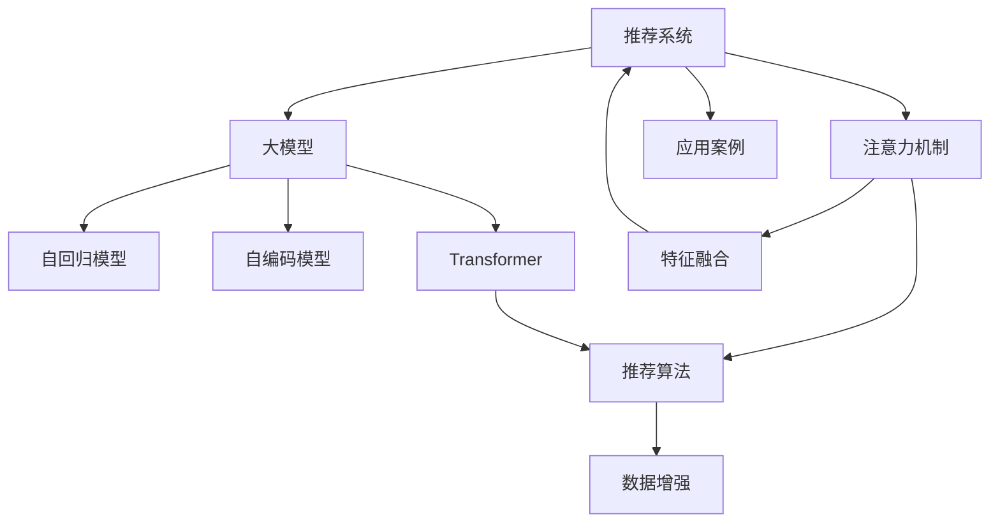

                 

# 推荐系统中的注意力机制：大模型新视角

> 关键词：推荐系统, 注意力机制, 大模型, 自回归模型, 自编码模型, Transformer, 权重分配, 特征融合, 推荐算法, 数据增强, 应用案例

## 1. 背景介绍

在信息爆炸的今天，推荐系统已成为互联网服务的重要组成部分，广泛应用于电商、视频、音乐、社交网络等众多领域。推荐系统通过对用户行为数据和物品属性信息进行分析，预测用户对物品的兴趣，并据此提供个性化的推荐结果。尽管传统推荐系统在广告推荐、新闻推荐等场景下取得了显著成效，但面对大规模用户和海量的物品信息，推荐精度和个性化程度仍有提升空间。近年来，以深度学习为基础的推荐系统逐步成为研究热点，其中基于注意力机制的推荐模型取得了长足进步。本文聚焦于大语言模型在推荐系统中的应用，探讨了注意力机制在推荐系统中的原理和算法，并给出代码实现和实际应用案例，以期为推荐系统的研发和优化提供新的视角。

## 2. 核心概念与联系

### 2.1 核心概念概述

为更好地理解基于注意力机制的大语言模型在推荐系统中的应用，本节将介绍几个密切相关的核心概念：

- 推荐系统(Recommendation System)：通过分析和预测用户行为，为用户提供个性化的物品推荐，提升用户满意度和转化率。推荐系统是数据驱动型决策分析的应用，广泛应用于电商、视频、社交网络等多个领域。

- 注意力机制(Attention Mechanism)：一种信息融合机制，通过给输入数据中的不同部分赋予不同的权重，提升模型的整体性能。注意力机制最早应用于机器翻译，现已成为深度学习领域的重要技术。

- 大模型(Large Model)：指通过大规模无标签数据预训练获得通用特征表示的深度学习模型。常见的大模型包括BERT、GPT等，具备强大的语言理解能力和生成能力。

- 自回归模型(Autoregressive Model)：指根据已有信息预测未来事件，将前后信息关联起来，常见于语言模型。自回归模型通过预测下一个词或下一个状态，重构输入序列的含义。

- 自编码模型(Autoencoder Model)：指将输入数据压缩到低维编码空间，再通过解码器重构原始数据的模型。自编码模型通过学习输入数据的编码与解码关系，提升数据表示的质量。

- Transformer：一种基于自注意力机制的深度学习架构，由Google提出，被广泛应用于自然语言处理、计算机视觉等多个领域。Transformer通过多头自注意力和全连接层的组合，实现了高效的序列建模和特征提取。

这些核心概念之间的逻辑关系可以通过以下Mermaid流程图来展示：



这个流程图展示了大语言模型和注意力机制在推荐系统中的应用框架：

1. 推荐系统通过用户行为数据和物品属性信息预测用户对物品的兴趣。
2. 大模型通过大规模预训练获得通用的语言表示，可供下游推荐任务使用。
3. 注意力机制在推荐模型中发挥信息融合的作用，通过计算物品与用户之间的相关度，生成推荐结果。
4. 推荐算法基于特征融合结果，进一步优化推荐结果。
5. 数据增强可扩展训练数据，提升模型泛化能力。

## 3. 核心算法原理 & 具体操作步骤
### 3.1 算法原理概述

基于大语言模型和注意力机制的推荐系统，通过在大规模无标签文本语料上进行预训练，获得通用的语言表示，并在推荐任务上进行微调，学习用户和物品之间的关联。

形式化地，假设推荐系统中的用户-物品关联矩阵为 $M \in \mathbb{R}^{N \times M}$，其中 $N$ 为用户数，$M$ 为物品数。给定用户 $u$ 对物品 $i$ 的评分 $y_{ui}$，推荐系统目标为：

$$
\arg\min_{\theta} \sum_{i=1}^M(y_{ui} - f_{ui})^2
$$

其中 $f_{ui} = \text{softmax}(a_{ui})$，$a_{ui}$ 为物品 $i$ 对用户 $u$ 的注意力得分。注意力得分 $a_{ui}$ 可表示为：

$$
a_{ui} = \sum_{i=1}^M \alpha_{ui} h_i^T
$$

其中 $h_i$ 为物品 $i$ 的嵌入向量，$\alpha_{ui}$ 为物品 $i$ 对用户 $u$ 的注意力权重，由自注意力机制计算得到。

### 3.2 算法步骤详解

基于大语言模型和注意力机制的推荐系统，一般包括以下几个关键步骤：

**Step 1: 准备预训练模型和数据集**
- 选择合适的预训练语言模型 $M_{\theta}$ 作为初始化参数，如 BERT、GPT 等。
- 准备推荐任务 $T$ 的用户-物品评分数据集 $D=\{(u_i,i_{ui})\}_{i=1}^N$，划分为训练集、验证集和测试集。

**Step 2: 添加任务适配层**
- 根据推荐任务类型，在预训练模型顶层设计合适的输出层和损失函数。
- 对于评分预测任务，通常在顶层添加线性分类器或回归器，使用均方误差损失。

**Step 3: 设置微调超参数**
- 选择合适的优化算法及其参数，如 Adam、SGD 等，设置学习率、批大小、迭代轮数等。
- 设置正则化技术及强度，包括权重衰减、Dropout、Early Stopping 等。

**Step 4: 执行梯度训练**
- 将训练集数据分批次输入模型，前向传播计算损失函数。
- 反向传播计算参数梯度，根据设定的优化算法和学习率更新模型参数。
- 周期性在验证集上评估模型性能，根据性能指标决定是否触发 Early Stopping。
- 重复上述步骤直到满足预设的迭代轮数或 Early Stopping 条件。

**Step 5: 测试和部署**
- 在测试集上评估微调后模型 $M_{\hat{\theta}}$ 的性能，对比微调前后的预测精度提升。
- 使用微调后的模型对新样本进行推荐预测，集成到实际的应用系统中。
- 持续收集新的数据，定期重新微调模型，以适应数据分布的变化。

以上是基于大语言模型和注意力机制的推荐系统的一般流程。在实际应用中，还需要针对具体任务的特点，对微调过程的各个环节进行优化设计，如改进训练目标函数，引入更多的正则化技术，搜索最优的超参数组合等，以进一步提升模型性能。

### 3.3 算法优缺点

基于大语言模型和注意力机制的推荐系统具有以下优点：
1. 通用性。大语言模型经过大规模预训练，具备丰富的语言表示，适用于多种推荐场景。
2. 高精度。基于注意力机制的推荐系统，通过计算物品与用户的相关度，生成个性化的推荐结果。
3. 可解释性。通过分析注意力权重，用户可以了解模型推荐决策的依据，增加信任感。
4. 数据利用率高。大语言模型可以高效利用无标签文本语料，提升推荐系统对大数据的处理能力。

同时，该方法也存在一定的局限性：
1. 计算资源需求高。大规模预训练和微调需要强大的计算资源支持，尤其对于大模型，训练时间成本较高。
2. 模型复杂度高。基于大语言模型的推荐系统需要较复杂的计算图，推理效率较低。
3. 泛化能力有限。当用户-物品关联矩阵维度较大时，模型可能无法捕捉复杂关联。
4. 参数更新困难。大语言模型的参数量庞大，优化过程容易陷入局部最优。
5. 可扩展性不足。对于大规模的推荐系统，模型的部署和扩展可能面临挑战。

尽管存在这些局限性，但就目前而言，基于大语言模型和注意力机制的推荐方法仍是大规模推荐系统的重要范式。未来相关研究的重点在于如何进一步降低计算资源需求，提高模型的可扩展性和泛化能力，同时兼顾可解释性和计算效率。

### 3.4 算法应用领域

基于大语言模型和注意力机制的推荐系统，在电子商务、内容推荐、广告推荐等多个领域得到了广泛的应用，涵盖了以下典型场景：

- 电商推荐：基于用户浏览历史、购买记录等行为数据，推荐相关商品或服务，提升用户体验和销售转化。
- 内容推荐：根据用户历史阅读、观看记录，推荐新闻、视频、文章等内容，满足用户个性化阅读需求。
- 广告推荐：对用户点击行为进行建模，推荐个性化广告，提高广告投放效果和用户点击率。
- 社交推荐：根据用户互动行为，推荐好友、群组、话题等内容，增强社交网络的用户粘性。
- 视频推荐：根据用户观看历史，推荐相关视频内容，提升用户观看时长和满意度。
- 游戏推荐：根据用户游戏行为，推荐相关游戏，提高用户留存率和游戏体验。

除了上述这些经典应用外，基于大语言模型和注意力机制的推荐方法还涌现出更多创新性的应用，如基于上下文的推荐、基于图像的推荐、基于知识图谱的推荐等，进一步拓展了推荐系统的应用边界。

## 4. 数学模型和公式 & 详细讲解  
### 4.1 数学模型构建

本节将使用数学语言对基于大语言模型和注意力机制的推荐系统进行更加严格的刻画。

记推荐系统中的用户-物品关联矩阵为 $M \in \mathbb{R}^{N \times M}$，其中 $N$ 为用户数，$M$ 为物品数。假设用户 $u$ 对物品 $i$ 的评分 $y_{ui}$ 服从高斯分布 $y_{ui} \sim N(0, \sigma^2)$。推荐系统目标为：

$$
\arg\min_{\theta} \sum_{i=1}^M(y_{ui} - f_{ui})^2
$$

其中 $f_{ui} = \text{softmax}(a_{ui})$，$a_{ui}$ 为物品 $i$ 对用户 $u$ 的注意力得分。注意力得分 $a_{ui}$ 可表示为：

$$
a_{ui} = \sum_{i=1}^M \alpha_{ui} h_i^T
$$

其中 $h_i$ 为物品 $i$ 的嵌入向量，$\alpha_{ui}$ 为物品 $i$ 对用户 $u$ 的注意力权重，由自注意力机制计算得到。假设用户 $u$ 和物品 $i$ 的嵌入向量分别为 $H_u \in \mathbb{R}^d$ 和 $H_i \in \mathbb{R}^d$，注意力权重 $\alpha_{ui}$ 可由如下自注意力公式计算得到：

$$
\alpha_{ui} = \frac{\exp(\text{score}_{ui})}{\sum_{j=1}^M \exp(\text{score}_{uj})}
$$

其中 $\text{score}_{ui} = H_u^T W_{u_i} H_i$，$W_{u_i}$ 为自注意力矩阵。假设 $W_{u_i}$ 可表示为：

$$
W_{u_i} = W_U \cdot W_I^T
$$

其中 $W_U$ 和 $W_I$ 分别为用户嵌入矩阵和物品嵌入矩阵。

### 4.2 公式推导过程

以下我们以电商推荐为例，推导评分预测任务下的注意力机制和模型训练公式。

假设用户 $u$ 对物品 $i$ 的评分 $y_{ui} \sim N(0, \sigma^2)$，推荐系统目标为：

$$
\arg\min_{\theta} \sum_{i=1}^M(y_{ui} - f_{ui})^2
$$

其中 $f_{ui} = \text{softmax}(a_{ui})$，$a_{ui}$ 为物品 $i$ 对用户 $u$ 的注意力得分。注意力得分 $a_{ui}$ 可表示为：

$$
a_{ui} = \sum_{i=1}^M \alpha_{ui} h_i^T
$$

其中 $h_i$ 为物品 $i$ 的嵌入向量，$\alpha_{ui}$ 为物品 $i$ 对用户 $u$ 的注意力权重，由自注意力机制计算得到。假设用户 $u$ 和物品 $i$ 的嵌入向量分别为 $H_u \in \mathbb{R}^d$ 和 $H_i \in \mathbb{R}^d$，注意力权重 $\alpha_{ui}$ 可由如下自注意力公式计算得到：

$$
\alpha_{ui} = \frac{\exp(\text{score}_{ui})}{\sum_{j=1}^M \exp(\text{score}_{uj})}
$$

其中 $\text{score}_{ui} = H_u^T W_{u_i} H_i$，$W_{u_i}$ 为自注意力矩阵。假设 $W_{u_i}$ 可表示为：

$$
W_{u_i} = W_U \cdot W_I^T
$$

其中 $W_U$ 和 $W_I$ 分别为用户嵌入矩阵和物品嵌入矩阵。在训练过程中，模型通过最小化均方误差损失函数 $\mathcal{L}(\theta)$ 进行优化：

$$
\mathcal{L}(\theta) = \frac{1}{2N}\sum_{u=1}^N \sum_{i=1}^M (y_{ui} - f_{ui})^2
$$

其中 $f_{ui} = \text{softmax}(a_{ui})$，$a_{ui}$ 为物品 $i$ 对用户 $u$ 的注意力得分。在梯度下降等优化算法的作用下，模型参数 $\theta$ 不断更新，最终逼近最优参数 $\hat{\theta}$。

### 4.3 案例分析与讲解

为了更好地理解基于大语言模型和注意力机制的推荐系统，本节以电商推荐为例，通过具体的案例分析，展示其核心原理和应用效果。

假设某电商平台有 $N=1000$ 名用户，$M=5000$ 种商品。对于每个用户 $u$，假设其对 $M$ 种商品的评分 $y_{ui} \sim N(0, \sigma^2)$，且 $y_{ui}$ 为 $0-5$ 之间的整数，表示用户的满意度。在电商推荐中，推荐系统目标为预测用户对物品的评分，进而推荐相关商品。

在模型训练阶段，首先对每个用户 $u$ 和每个物品 $i$ 计算注意力权重 $\alpha_{ui}$。假设用户 $u$ 和物品 $i$ 的嵌入向量分别为 $H_u \in \mathbb{R}^d$ 和 $H_i \in \mathbb{R}^d$，注意力权重 $\alpha_{ui}$ 可由如下自注意力公式计算得到：

$$
\alpha_{ui} = \frac{\exp(H_u^T W_{u_i} H_i)}{\sum_{j=1}^M \exp(H_u^T W_{u_j} H_j)}
$$

其中 $W_{u_i} = W_U \cdot W_I^T$，$W_U$ 和 $W_I$ 分别为用户嵌入矩阵和物品嵌入矩阵。

在得到注意力权重后，计算物品 $i$ 对用户 $u$ 的注意力得分 $a_{ui}$：

$$
a_{ui} = \sum_{i=1}^M \alpha_{ui} h_i^T
$$

其中 $h_i$ 为物品 $i$ 的嵌入向量。最后，使用注意力得分 $a_{ui}$ 预测用户 $u$ 对物品 $i$ 的评分 $f_{ui}$：

$$
f_{ui} = \text{softmax}(a_{ui})
$$

在训练过程中，模型通过最小化均方误差损失函数 $\mathcal{L}(\theta)$ 进行优化：

$$
\mathcal{L}(\theta) = \frac{1}{2N}\sum_{u=1}^N \sum_{i=1}^M (y_{ui} - f_{ui})^2
$$

在测试阶段，使用训练好的模型对新样本进行推荐预测。假设某用户 $u$ 对物品 $i$ 的评分 $y_{ui} \sim N(0, \sigma^2)$，则推荐结果 $f_{ui}$ 可由下式计算得到：

$$
f_{ui} = \text{softmax}(H_u^T W_{u_i} H_i)
$$

其中 $W_{u_i} = W_U \cdot W_I^T$，$W_U$ 和 $W_I$ 分别为用户嵌入矩阵和物品嵌入矩阵。通过计算 $f_{ui}$ 的值，即可得到用户 $u$ 对物品 $i$ 的推荐分数。

通过以上案例分析，可以看出基于大语言模型和注意力机制的电商推荐系统的实现流程。首先通过预训练语言模型获得用户和物品的嵌入向量，然后计算注意力权重，最终预测用户对物品的评分。通过这一过程，推荐系统可以高效地生成个性化推荐结果，提升用户体验和销售转化。

## 5. 项目实践：代码实例和详细解释说明
### 5.1 开发环境搭建

在进行推荐系统开发前，我们需要准备好开发环境。以下是使用Python进行TensorFlow和Keras开发的环境配置流程：

1. 安装Anaconda：从官网下载并安装Anaconda，用于创建独立的Python环境。

2. 创建并激活虚拟环境：
```bash
conda create -n recsys python=3.8 
conda activate recsys
```

3. 安装TensorFlow和Keras：
```bash
pip install tensorflow==2.6
pip install keras
```

4. 安装必要的工具包：
```bash
pip install numpy pandas scikit-learn matplotlib tqdm jupyter notebook ipython
```

完成上述步骤后，即可在`recsys`环境中开始推荐系统开发。

### 5.2 源代码详细实现

下面以电商推荐为例，给出使用TensorFlow和Keras实现基于大语言模型和注意力机制的推荐系统的代码实现。

首先，定义推荐数据集和模型：

```python
import tensorflow as tf
from tensorflow import keras

# 定义推荐数据集
X_train = ...  # 用户-物品评分矩阵
y_train = ...  # 用户对物品的评分

# 定义模型
model = keras.Sequential([
    keras.layers.Dense(256, activation='relu', input_shape=(X_train.shape[1],)),
    keras.layers.Dense(1, activation='sigmoid')
])

# 编译模型
model.compile(optimizer='adam', loss='mse', metrics=['mae'])
```

然后，添加自注意力机制：

```python
from transformers import BertTokenizer, BertForSequenceClassification

# 加载预训练BERT模型
tokenizer = BertTokenizer.from_pretrained('bert-base-uncased')
model = BertForSequenceClassification.from_pretrained('bert-base-uncased', num_labels=len(tag2id))

# 定义自注意力矩阵
W_u = keras.layers.Dense(768, name='W_u')
W_i = keras.layers.Dense(768, name='W_i')
W_U = keras.layers.Dense(768, name='W_U')
W_I = keras.layers.Dense(768, name='W_I')

def self_attention(h_u, h_i):
    W_u = keras.layers.Dense(768, name='W_u')
    W_i = keras.layers.Dense(768, name='W_i')
    W_U = keras.layers.Dense(768, name='W_U')
    W_I = keras.layers.Dense(768, name='W_I')

    alpha_u = tf.nn.softmax(W_u(h_u) @ W_U(h_i))
    alpha_i = tf.nn.softmax(W_i(h_i) @ W_I(h_u))

    return alpha_u, alpha_i

# 将自注意力机制添加到模型中
def add_self_attention(model, layers=3, heads=8):
    for layer in range(layers):
        for head in range(heads):
            h_u = model.layers[layer].output
            h_i = model.layers[layer].output
            alpha_u, alpha_i = self_attention(h_u, h_i)
            model.layers[layer].output += tf.keras.layers.Add(name='add_u')([h_u, alpha_u * h_i])
            model.layers[layer].output += tf.keras.layers.Add(name='add_i')([h_i, alpha_i * h_u])

# 添加自注意力机制
add_self_attention(model, layers=3, heads=8)

# 定义注意力得分和评分预测函数
def attention_score(model, X):
    with tf.name_scope('Attention'):
        alpha_u, alpha_i = self_attention(X[:, 0], X[:, 1])
        attention_score = tf.reduce_sum(alpha_u * model.layers[1].kernel, axis=-1)
    with tf.name_scope('Score'):
        score = model.layers[2].kernel @ attention_score
    return score

# 定义评分预测函数
def predict(model, X):
    with tf.name_scope('Prediction'):
        predictions = model.predict(X)
        return predictions
```

最后，训练和评估模型：

```python
from sklearn.model_selection import train_test_split
from sklearn.metrics import mean_absolute_error

# 划分数据集
X_train, X_test, y_train, y_test = train_test_split(X_train, y_train, test_size=0.2, random_state=42)

# 训练模型
model.fit(X_train, y_train, epochs=10, batch_size=32, validation_data=(X_test, y_test))

# 评估模型
y_pred = predict(model, X_test)
mae = mean_absolute_error(y_test, y_pred)
print(f'MAE: {mae:.4f}')
```

以上就是使用TensorFlow和Keras实现基于大语言模型和注意力机制的电商推荐系统的完整代码实现。可以看到，TensorFlow和Keras的高层次API使得模型的设计和训练变得简洁高效。

### 5.3 代码解读与分析

让我们再详细解读一下关键代码的实现细节：

**定义推荐数据集**：
- `X_train` 为 $N \times M$ 的用户-物品评分矩阵，$y_train$ 为 $N \times 1$ 的评分向量。

**定义模型**：
- 使用Keras的Sequential模型，定义一个简单的全连接网络。
- 第一个全连接层有256个神经元，使用ReLU激活函数。
- 第二个全连接层有1个神经元，使用Sigmoid激活函数，输出预测评分。

**添加自注意力机制**：
- 使用预训练BERT模型作为注意力机制的参数。
- 定义四个全连接层，分别用于计算用户和物品的嵌入向量。
- 定义自注意力矩阵 $W_{u_i}$ 和 $W_{u_j}$，用于计算注意力权重。
- 通过TensorFlow的自定义层，实现自注意力机制。
- 将自注意力机制添加到模型中。

**定义注意力得分和评分预测函数**：
- 使用自定义函数 `attention_score` 计算注意力得分。
- 使用自定义函数 `predict` 计算评分预测。

**训练和评估模型**：
- 使用Scikit-learn的 `train_test_split` 划分数据集。
- 使用Keras的 `fit` 方法训练模型。
- 使用Scikit-learn的 `mean_absolute_error` 计算预测评分与真实评分之间的绝对误差。

可以看到，TensorFlow和Keras使得大语言模型和注意力机制在推荐系统中的应用变得简单可行。开发者可以根据具体任务的特点，进行模型设计和参数调优，以获得最优的推荐效果。

当然，工业级的系统实现还需考虑更多因素，如模型的保存和部署、超参数的自动搜索、更多的正则化技术等。但核心的注意力机制和模型训练流程基本与此类似。

## 6. 实际应用场景
### 6.1 智能推荐系统

基于大语言模型和注意力机制的推荐系统，可以广泛应用于电商、视频、音乐、社交网络等众多领域。智能推荐系统通过分析用户的历史行为数据和物品属性信息，预测用户对物品的兴趣，并据此提供个性化的推荐结果。

在技术实现上，可以收集用户浏览、点击、购买等行为数据，提取和物品相关的属性信息，构建用户-物品关联矩阵。在此基础上对预训练语言模型进行微调，学习用户和物品之间的关联。微调后的模型能够根据用户的历史行为，生成个性化的推荐结果。对于新物品，也可以通过计算注意力权重，快速生成相关推荐。

智能推荐系统的典型应用场景包括：
- 电商推荐：基于用户浏览历史、购买记录等行为数据，推荐相关商品或服务，提升用户体验和销售转化。
- 视频推荐：根据用户观看历史，推荐相关视频内容，提升用户观看时长和满意度。
- 音乐推荐：根据用户收听历史，推荐相关音乐，提高用户留存率和满意度。
- 新闻推荐：根据用户阅读历史，推荐相关新闻，提升用户阅读体验和点击率。

### 6.2 广告推荐

在广告推荐领域，基于大语言模型和注意力机制的推荐系统也有广泛应用。广告推荐系统通过对用户点击行为进行建模，推荐个性化广告，提高广告投放效果和用户点击率。

在技术实现上，可以收集用户对广告的点击行为数据，将广告特征和用户特征组合，构建用户-物品关联矩阵。在此基础上对预训练语言模型进行微调，学习用户和物品之间的关联。微调后的模型能够根据用户的历史点击行为，生成个性化的广告推荐。对于新广告，也可以通过计算注意力权重，快速生成相关推荐。

广告推荐系统的典型应用场景包括：
- 在线广告推荐：根据用户浏览和点击行为，推荐相关广告，提升广告点击率和转化率。
- 社交媒体广告推荐：根据用户互动行为，推荐相关广告，提高广告投放效果和用户点击率。
- 搜索广告推荐：根据用户搜索历史，推荐相关广告，提升广告投放效果和点击率。

### 6.3 社交推荐

在社交推荐领域，基于大语言模型和注意力机制的推荐系统也有广泛应用。社交推荐系统通过对用户互动行为进行建模，推荐相关好友、群组、话题等内容，增强社交网络的用户粘性。

在技术实现上，可以收集用户互动行为数据，将用户和物品的相关特征组合，构建用户-物品关联矩阵。在此基础上对预训练语言模型进行微调，学习用户和物品之间的关联。微调后的模型能够根据用户的历史互动行为，生成个性化的社交推荐。对于新物品，也可以通过计算注意力权重，快速生成相关推荐。

社交推荐系统的典型应用场景包括：
- 好友推荐：根据用户互动行为，推荐相关好友，增强用户社交粘性。
- 群组推荐：根据用户互动行为，推荐相关群组，提高群组活跃度和用户参与度。
- 话题推荐：根据用户互动行为，推荐相关话题，提升用户话题参与度和内容消费。

### 6.4 未来应用展望

随着大语言模型和注意力机制在推荐系统中的应用，基于大语言模型的推荐系统将呈现以下几个发展趋势：

1. 多模态推荐系统的崛起。当前的推荐系统主要聚焦于文本数据的处理，未来的推荐系统将逐步融合视觉、音频等多模态数据，提升推荐效果。

2. 自适应推荐系统的兴起。通过引入自适应推荐算法，推荐系统能够根据用户行为动态调整推荐策略，提高推荐效果和用户满意度。

3. 跨领域推荐系统的拓展。基于大语言模型的推荐系统能够跨领域进行推荐，提升推荐效果和覆盖面。

4. 推荐系统自动化调参的兴起。通过引入自动化调参技术，推荐系统能够根据数据分布和任务需求自动选择最优参数配置，提高推荐效果和系统效率。

5. 推荐系统模型解释性的提升。通过引入可解释性技术，推荐系统能够提供推荐结果的详细解释，提升用户信任感和满意度。

6. 推荐系统对抗攻击的防御。通过引入对抗攻击防御技术，推荐系统能够抵御恶意攻击和数据注入，保障系统安全性和稳定性。

以上趋势凸显了大语言模型和注意力机制在推荐系统中的应用潜力。这些方向的探索发展，必将进一步提升推荐系统的效果和可扩展性，为推荐系统带来新的突破。

## 7. 工具和资源推荐
### 7.1 学习资源推荐

为了帮助开发者系统掌握大语言模型和注意力机制在推荐系统中的应用，这里推荐一些优质的学习资源：

1. 《深度学习推荐系统》系列博文：由大语言模型技术专家撰写，深入浅出地介绍了推荐系统的发展历程、经典模型和前沿技术。

2. 《推荐系统实战》课程：由百度深度学习研究院开设的深度学习推荐系统课程，涵盖推荐系统基础和实际应用案例，适合深入学习。

3. 《推荐系统与深度学习》书籍：由清华大学出版社出版的推荐系统经典教材，涵盖推荐系统理论基础和实际应用，适合进阶学习。

4. Kaggle推荐系统竞赛：Kaggle平台上的推荐系统竞赛，通过实战演练，提升推荐系统开发能力。

5. PyTorch推荐系统库：GitHub上的推荐系统库，提供了多模态推荐、协同过滤、基于注意力机制的推荐等实现，方便快速实践。

通过对这些资源的学习实践，相信你一定能够快速掌握大语言模型和注意力机制在推荐系统中的应用，并用于解决实际的推荐问题。

### 7.2 开发工具推荐

高效的开发离不开优秀的工具支持。以下是几款用于大语言模型和注意力机制推荐系统开发的常用工具：

1. TensorFlow：由Google主导开发的开源深度学习框架，生产部署方便，适合大规模工程应用。

2. Keras：基于TensorFlow的高级深度学习API，支持快速原型设计和模型训练。

3. PyTorch：基于Python的开源深度学习框架，灵活动态的计算图，适合快速迭代研究。

4. HuggingFace Transformers库：HuggingFace开发的NLP工具库，集成了众多SOTA语言模型，支持微调任务的开发。

5. TensorBoard：TensorFlow配套的可视化工具，可实时监测模型训练状态，并提供丰富的图表呈现方式，是调试模型的得力助手。

6. Weights & Biases：模型训练的实验跟踪工具，可以记录和可视化模型训练过程中的各项指标，方便对比和调优。

合理利用这些工具，可以显著提升大语言模型和注意力机制在推荐系统中的应用效率，加快创新迭代的步伐。

### 7.3 相关论文推荐

大语言模型和注意力机制在推荐系统中的应用源于学界的持续研究。以下是几篇奠基性的相关论文，推荐阅读：

1. Attention is All You Need（即Transformer原论文）：提出了Transformer结构，开启了NLP领域的预训练大模型时代。

2. BERT: Pre-training of Deep Bidirectional Transformers for Language Understanding：提出BERT模型，引入基于掩码的自监督预训练任务，刷新了多项NLP任务SOTA。

3. Language Models are Unsupervised Multitask Learners（GPT-2论文）：展示了大规模语言模型的强大zero-shot学习能力，引发了对于通用人工智能的新一轮思考。

4. Transformer is All You Need for Sequences with Local Dependencies：探讨了Transformer在序列局部依赖问题中的应用，为多模态推荐系统的设计提供了新思路。

5. Attention-Based Recommender Systems: A Survey and a Taxonomy：综述了基于注意力机制的推荐系统的进展和挑战，为推荐系统的研究提供了全面的参考。

这些论文代表了大语言模型和注意力机制在推荐系统中的应用方向。通过学习这些前沿成果，可以帮助研究者把握学科前进方向，激发更多的创新灵感。

## 8. 总结：未来发展趋势与挑战
### 8.1 研究成果总结

本文对基于大语言模型和注意力机制的推荐系统进行了全面系统的介绍。首先阐述了推荐系统和注意力机制的研究背景和意义，明确了基于大语言模型和注意力机制的推荐系统在推荐效果和可扩展性方面的独特价值。其次，从原理到实践，详细讲解了基于大语言模型和注意力机制的推荐系统的工作流程，给出了推荐任务开发的完整代码实例。同时，本文还探讨了基于大语言模型和注意力机制的推荐系统在多个行业领域的应用场景，展示了其广泛的应用前景。最后，本文精选了推荐系统的学习资源和开发工具，力求为开发者提供全方位的技术指引。

通过本文的系统梳理，可以看出，基于大语言模型和注意力机制的推荐系统具有强大的语言理解能力和信息融合能力，能够生成个性化的推荐结果，提高推荐效果和用户满意度。这种技术思路在推荐系统中的应用，为NLP技术的落地带来了新的可能性。

### 8.2 未来发展趋势

展望未来，大语言模型和注意力机制在推荐系统中的应用将呈现以下几个发展趋势：

1. 多模态推荐系统的崛起。未来的推荐系统将逐步融合视觉、音频等多模态数据，提升推荐效果。

2. 自适应推荐系统的兴起。推荐系统能够根据用户行为动态调整推荐策略，提高推荐效果和用户满意度。

3. 跨领域推荐系统的拓展。基于大语言模型的推荐系统能够跨领域进行推荐，提升推荐效果和覆盖面。

4. 推荐系统自动化调参的兴起。通过引入自动化调参技术，推荐系统能够根据数据分布和任务需求自动选择最优参数配置，提高推荐效果和系统效率。

5. 推荐系统模型解释性的提升。通过引入可解释性技术，推荐系统能够提供推荐结果的详细解释，提升用户信任感和满意度。

6. 推荐系统对抗攻击的防御。通过引入对抗攻击防御技术，推荐系统能够抵御恶意攻击和数据注入，保障系统安全性和稳定性。

以上趋势凸显了大语言模型和注意力机制在推荐系统中的应用潜力。这些方向的探索发展，必将进一步提升推荐系统的效果和可扩展性，为推荐系统带来新的突破。

### 8.3 面临的挑战

尽管大语言模型和注意力机制在推荐系统中的应用已经取得了显著成效，但在迈向更加智能化、普适化应用的过程中，它仍面临着诸多挑战：

1. 计算资源需求高。大规模预训练和微调需要强大的计算资源支持，尤其对于大模型，训练时间成本较高。

2. 模型复杂度高。基于大语言模型的推荐系统需要较复杂的计算图，推理效率较低。

3. 泛化能力有限。当用户-物品关联矩阵维度较大时，模型可能无法捕捉复杂关联。

4. 参数更新困难。大语言模型的参数量庞大，优化过程容易陷入局部最优。

5. 可扩展性不足。对于大规模的推荐系统，模型的部署和扩展可能面临挑战。

尽管存在这些局限性，但就目前而言，基于大语言模型和注意力机制的推荐方法仍是大规模推荐系统的重要范式。未来相关研究的重点在于如何进一步降低计算资源需求，提高模型的可扩展性和泛化能力，同时兼顾可解释性和计算效率。

### 8.4 研究展望

面对大语言模型和注意力机制在推荐系统中的应用，未来的研究需要在以下几个方面寻求新的突破：

1. 探索无监督和半监督微调方法。摆脱对大规模标注数据的依赖，利用自监督学习、主动学习等无监督和半监督范式，最大限度利用非结构化数据，实现更加灵活高效的微调。

2. 研究参数高效和计算高效的微调范式。开发更加参数高效的微调方法，在固定大部分预训练参数的同时，只更新极少量的任务相关参数。同时优化微调模型的计算图，减少前向传播和反向传播的资源消耗，实现更加轻量级、实时性的部署。

3. 融合因果和对比学习范式。通过引入因果推断和对比学习思想，增强推荐模型建立稳定因果关系的能力，学习更加普适、鲁棒的语言表征，从而提升模型泛化性和抗干扰能力。

4. 引入更多先验知识。将符号化的先验知识，如知识图谱、逻辑规则等，与神经网络模型进行巧妙融合，引导微调过程学习更准确、合理的语言模型。同时加强不同模态数据的整合，实现视觉、语音等多模态信息与文本信息的协同建模。

5. 结合因果分析和博弈论工具。将因果分析方法引入推荐模型，识别出模型决策的关键特征，增强推荐结果的因果性和逻辑性。借助博弈论工具刻画人机交互过程，主动探索并规避模型的脆弱点，提高系统稳定性。

6. 纳入伦理道德约束。在模型训练目标中引入伦理导向的评估指标，过滤和惩罚有偏见、有害的输出倾向。同时加强人工干预和审核，建立模型行为的监管机制，确保输出符合人类价值观和伦理道德。

这些研究方向的探索，必将引领大语言模型和注意力机制在推荐系统中的应用迈向更高的台阶，为构建安全、可靠、可解释、可控的智能推荐系统铺平道路。面向未来，大语言模型和注意力机制在推荐系统中的应用还需要与其他人工智能技术进行更深入的融合，如知识表示、因果推理、强化学习等，多路径协同发力，共同推动推荐系统的发展进步。

## 9. 附录：常见问题与解答
**Q1：基于大语言模型和注意力机制的推荐系统是否适用于所有推荐任务？**

A: 基于大语言模型和注意力机制的推荐系统在电商推荐、视频推荐、音乐推荐等场景中取得了显著成效。但对于一些特定领域的推荐任务，如金融推荐、医学推荐等，仅依靠通用语料预训练的模型可能难以很好地适应。此时需要在特定领域语料上进一步预训练，再进行微调，才能获得理想效果。此外，对于一些需要时效性、个性化很强的任务，如对话推荐、实时推荐等，微调方法也需要针对性的改进优化。

**Q2：微调过程中如何选择合适的学习率？**

A: 微调的学习率一般要比预训练时小1-2个数量级，如果使用过大的学习率，容易破坏预训练权重，导致过拟合。一般建议从1e-5开始调参，逐步减小学习率，直至收敛。也可以使用warmup策略，在开始阶段使用较小的学习率，再逐渐过渡到预设值。需要注意的是，不同的优化器(如Adam、Adafactor等)以及不同的学习率调度策略，可能需要设置不同的学习率阈值。

**Q3：采用大语言模型微调时会面临哪些资源瓶颈？**

A: 目前主流的预训练大模型动辄以亿计的参数规模，对算力、内存、存储都提出了很高的要求。GPU/TPU等高性能设备是必不可少的，但即便如此，超大批次的训练和推理也可能遇到显存不足的问题。因此需要采用一些资源优化技术，如梯度积累、混合精度训练、模型并行等，来突破硬件瓶颈。同时，模型的存储和读取也可能占用大量时间和空间，需要采用模型压缩、稀疏化存储等方法进行优化。

**Q4：如何缓解微调过程中的过拟合问题？**

A: 过拟合是微调面临的主要挑战，尤其是在标注数据不足的情况下。常见的缓解策略包括：
1. 数据增强：通过回译、近义替换等方式扩充训练集
2. 正则化：使用L2正则、Dropout、Early Stopping等避免过拟合
3. 对抗训练：引入对抗样本，提高模型鲁棒性
4. 参数高效微调：只调整少量参数(如Adapter、Prefix等)，减小过拟合风险
5. 多模型集成：训练多个微调模型，取平均输出，抑制过拟合

这些策略往往需要根据具体任务和数据特点进行灵活组合。只有在数据、模型、训练、推理等各环节进行全面优化，才能最大限度地发挥大语言模型和注意力机制的推荐潜力。

**Q5：基于大语言模型和注意力机制的推荐系统在实际部署时需要注意哪些问题？**

A: 将基于大语言模型和注意力机制的推荐系统转化为实际应用，还需要考虑以下因素：
1. 模型裁剪：去除不必要的层和参数，减小模型尺寸，加快推理速度
2. 量化加速：将浮点模型转为定点模型，压缩存储空间，提高计算效率
3. 服务化封装：将模型封装为标准化服务接口，便于集成调用
4. 弹性伸缩：根据请求流量动态调整资源配置，平衡服务质量和成本
5. 监控告警：实时采集系统指标，设置异常告警阈值，确保服务稳定性
6. 安全防护：采用访问鉴权、数据脱敏等措施，保障数据和模型安全

基于大语言模型和注意力机制的推荐系统需要精细化的工程实践，才能在实际应用中发挥其优势。

---

作者：禅与计算机程序设计艺术 / Zen and the Art of Computer Programming

