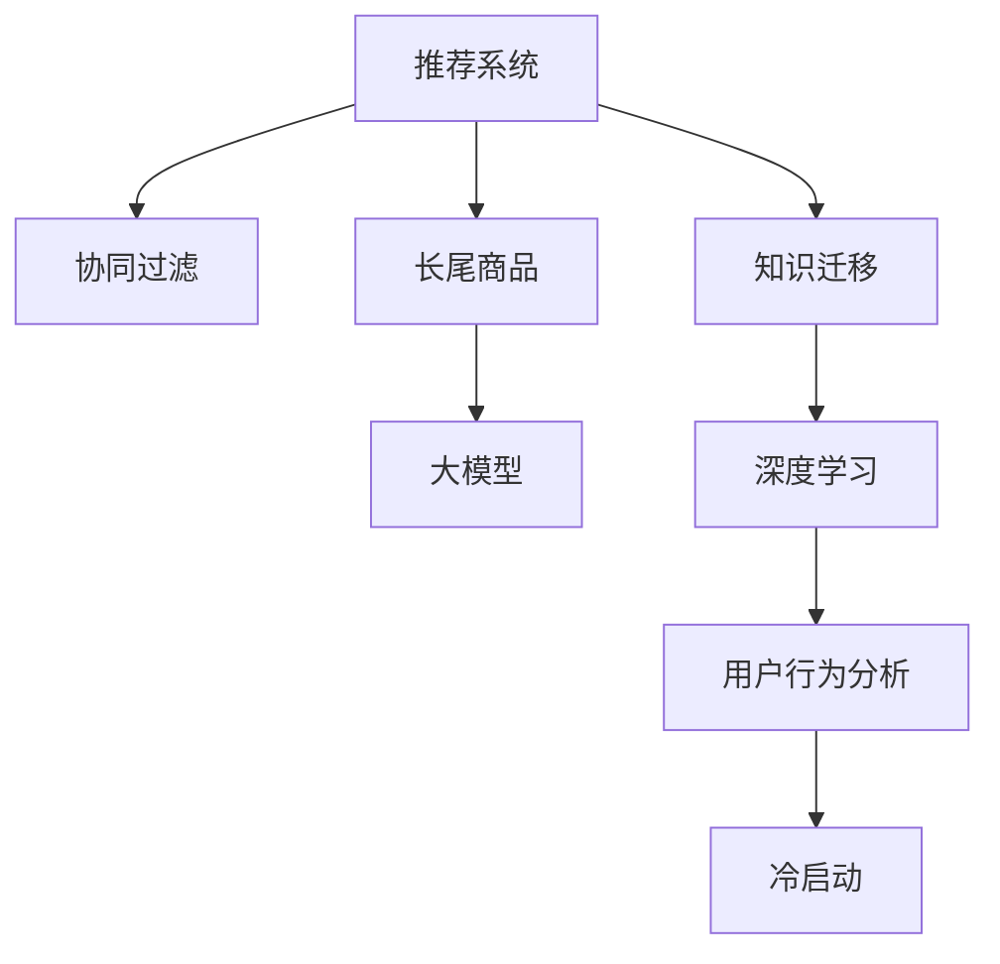

                 

# 推荐系统中的长尾商品曝光：大模型的创新策略

> 关键词：长尾商品，推荐系统，大模型，协同过滤，深度学习，用户行为分析，冷启动，创新策略

## 1. 背景介绍

### 1.1 问题由来

在当今数字经济时代，推荐系统已成为电商、视频、新闻、社交等多个领域的重要技术支撑。其核心目标是提升用户体验，增加用户粘性，从而驱动商业价值增长。然而，推荐的商品结构往往呈现出“二八定律”，即大部分收入来源于20%的热门商品，而剩下的80%商品销量较低，被统称为长尾商品。

长尾商品在推荐系统的曝光不足，使得商家难以获得足够的流量，用户也无法发现符合自身需求的优质产品。这种“隐形商品”现象极大地限制了推荐系统的推荐效果和商业潜力。

### 1.2 问题核心关键点

解决长尾商品的推荐问题，需要突破传统协同过滤算法的局限，探索更加高效、精准的推荐技术。具体而言，当前推荐系统面临以下几大挑战：

- **数据稀疏性**：长尾商品用户访问数据非常稀少，协同过滤模型难以准确预测用户行为。
- **多样性**：长尾商品种类繁多，用户兴趣各异，如何发现个性化需求并推荐精准商品，是一个难题。
- **冷启动问题**：新商品和少量历史数据的用户，缺乏足够的信息进行推荐。

为了应对这些挑战，本文将介绍基于大模型的推荐策略，即在推荐系统中引入预训练语言模型，利用其强大的语义理解能力和知识迁移能力，提升长尾商品的曝光和用户满意度。

## 2. 核心概念与联系

### 2.1 核心概念概述

为更好地理解基于大模型的长尾商品推荐方法，本节将介绍几个密切相关的核心概念：

- **推荐系统(Recommender System)**：利用用户历史行为数据，预测用户未来可能感兴趣的商品，从而提供个性化推荐。
- **协同过滤(Collaborative Filtering)**：一种基于用户和商品间相似性的推荐方法，通过分析用户历史行为数据和商品评价数据，推荐与用户兴趣相似的商品。
- **长尾商品(Long Tail Items)**：指那些销量较低、用户数不多的商品，通常集中在某些垂直领域。
- **大模型(Large Models)**：指如BERT、GPT等大规模预训练语言模型，通过自监督学习任务在海量文本数据上预训练，获得了丰富的语言知识。
- **知识迁移(Knowledge Transfer)**：指从源领域(如文本数据)的知识迁移到目标领域(如推荐系统)，以提升目标任务的性能。
- **深度学习(Deep Learning)**：一种通过多层神经网络进行数据建模的机器学习方法，广泛应用于图像、语音、自然语言等领域。
- **用户行为分析(User Behavior Analysis)**：通过分析用户历史行为数据，挖掘用户兴趣和需求，以指导推荐策略的制定。
- **冷启动(Cold Start)**：指新用户或新商品缺乏足够的历史数据，无法进行传统协同过滤推荐的情况。

这些核心概念之间的逻辑关系可以通过以下Mermaid流程图来展示：



这个流程图展示了大模型推荐系统的主要概念及其之间的关系：

1. 推荐系统通过协同过滤进行商品推荐。
2. 大模型通过知识迁移提升推荐效果，特别在长尾商品推荐上表现优异。
3. 深度学习为推荐算法提供了强大的数据建模能力，可以处理复杂非线性的用户行为数据。
4. 用户行为分析帮助模型更好地理解用户需求，制定个性化推荐策略。
5. 冷启动问题通过预训练模型在新用户和新商品上的微调得以解决。

这些概念共同构成了基于大模型的推荐系统的学习和应用框架，使得系统能够更加精准地识别和推荐长尾商品。

## 3. 核心算法原理 & 具体操作步骤
### 3.1 算法原理概述

基于大模型的长尾商品推荐方法，本质上是一个将预训练语言模型应用于推荐系统中的过程。其核心思想是：利用预训练语言模型在海量文本数据上学习到的丰富语义知识，通过知识迁移技术，提升推荐系统对长尾商品的预测和推荐效果。

具体而言，假设推荐系统中的用户和商品被映射到一个高维语义空间，每个用户和商品都表示为一个向量，该向量由预训练语言模型提取获得。当用户访问商品时，系统将用户和商品向量输入预训练语言模型，计算它们的相似度得分，预测用户对该商品的兴趣，从而进行推荐。

### 3.2 算法步骤详解

基于大模型的长尾商品推荐一般包括以下几个关键步骤：

**Step 1: 准备预训练模型和数据集**
- 选择合适的预训练语言模型，如BERT、GPT等。
- 准备推荐系统的训练数据集，包括用户-商品交互记录和商品属性数据。

**Step 2: 设计任务适配层**
- 将预训练模型的输出向量作为推荐模型的输入。
- 引入适合推荐任务的损失函数，如均方误差、交叉熵等，优化推荐模型。

**Step 3: 添加用户行为数据**
- 将用户的历史行为数据（如浏览记录、购买记录等）编码成向量，与预训练模型的输出向量拼接。
- 在推荐模型中，加入用户行为向量的线性组合，增强模型的预测能力。

**Step 4: 数据增强与对抗训练**
- 对用户行为数据进行扩充，如回译、近义替换等，丰富训练集多样性。
- 引入对抗样本，提高模型鲁棒性。

**Step 5: 进行模型微调**
- 冻结预训练模型的部分层，仅微调顶层。
- 选择较小的学习率，避免破坏预训练权重。

**Step 6: 评估模型效果**
- 在测试集上评估推荐模型的准确率、召回率等指标，对比微调前后的性能提升。
- 定期更新模型，保持模型性能。

### 3.3 算法优缺点

基于大模型的长尾商品推荐方法具有以下优点：
1. 提升长尾商品曝光：大模型利用其强大的语义理解能力，可以更好地识别长尾商品的独特特征，提升推荐效果。
2. 缓解冷启动问题：新用户和商品可以通过预训练模型的微调，获得高质量的用户和商品表示，快速融入推荐系统。
3. 增强推荐多样性：大模型可以发现更多细分领域的长尾商品，提高推荐系统的多样性。
4. 减少标注成本：利用大模型的语义理解能力，可以发现用户对商品的隐含需求，减少推荐系统对标注数据的依赖。

同时，该方法也存在一定的局限性：
1. 依赖于高质量的预训练模型：模型性能和数据质量高度相关，预训练模型的泛化能力会影响推荐效果。
2. 模型复杂度较高：大模型的复杂度较高，推理速度较慢，增加了推荐系统的响应时间。
3. 资源消耗较大：大模型的内存和计算资源消耗较大，需要高性能计算设备支持。
4. 泛化性能受限：预训练模型在大规模语料上学习到的知识，可能不适用于所有推荐任务。

尽管存在这些局限性，但就目前而言，基于大模型的长尾商品推荐方法仍是大数据时代的有效选择。未来相关研究的重点在于如何进一步优化大模型的应用，减少计算资源消耗，提升推荐模型的效率和精度。

### 3.4 算法应用领域

基于大模型的长尾商品推荐方法在电商、视频、新闻等多个领域具有广泛的应用前景，具体如下：

- **电商平台**：利用大模型对商品进行精细化推荐，提升用户满意度和销量转化率。
- **视频平台**：通过对长尾视频的推荐，提升用户发现并观看优质内容的可能性，增加平台的用户粘性和互动率。
- **新闻网站**：通过个性化推荐，使新闻内容更符合用户兴趣，提高用户阅读量和平台流量。

此外，在社交媒体、金融、医疗等多个垂直领域，大模型的推荐策略也具有应用潜力，可以提升这些领域的推荐效果和用户满意度。

## 4. 数学模型和公式 & 详细讲解  
### 4.1 数学模型构建

本节将使用数学语言对基于大模型的长尾商品推荐过程进行更加严格的刻画。

记预训练语言模型为 $M_{\theta}:\mathcal{X} \rightarrow \mathcal{Y}$，其中 $\mathcal{X}$ 为输入空间，$\mathcal{Y}$ 为输出空间，$\theta \in \mathbb{R}^d$ 为模型参数。假设推荐系统中的用户和商品被映射到高维语义空间，表示为向量 $u \in \mathbb{R}^{d_u}$ 和 $i \in \mathbb{R}^{d_i}$。

定义用户 $u$ 和商品 $i$ 的相似度得分为：

$$
s(u,i) = \cos\left(M_{\theta}(u), M_{\theta}(i)\right)
$$

其中 $\cos$ 为余弦相似度函数。

推荐模型 $R_{\theta}$ 将用户和商品向量输入，输出预测评分 $r(u,i)$，模型损失函数为：

$$
\mathcal{L}(\theta) = \frac{1}{N}\sum_{i=1}^N \mathcal{L}(r(u_i,i),y_i)
$$

其中 $N$ 为训练样本数，$u_i$ 和 $i$ 分别为用户和商品的向量表示，$y_i$ 为实际评分。常用的损失函数包括均方误差损失、交叉熵损失等。

### 4.2 公式推导过程

以下我们以均方误差损失为例，推导基于大模型的推荐模型的损失函数及其梯度计算公式。

假设推荐模型 $R_{\theta}$ 在用户和商品的向量表示上进行评分预测，输出为 $r(u_i,i)$，实际评分为 $y_i$，则均方误差损失为：

$$
\mathcal{L}(r(u_i,i),y_i) = \frac{1}{2}\left(r(u_i,i) - y_i\right)^2
$$

将其代入总损失函数公式，得：

$$
\mathcal{L}(\theta) = \frac{1}{N}\sum_{i=1}^N \frac{1}{2}\left(r(u_i,i) - y_i\right)^2
$$

对于评分预测 $r(u_i,i)$，可以表示为：

$$
r(u_i,i) = \sigma\left(\theta^T [u_i,i]\right)
$$

其中 $\sigma$ 为激活函数，$\theta^T$ 为推荐模型参数，$[u_i,i]$ 为用户和商品向量拼接的表示。

对 $\theta$ 求导，得：

$$
\frac{\partial \mathcal{L}(\theta)}{\partial \theta} = -\frac{1}{N}\sum_{i=1}^N \left(r(u_i,i) - y_i\right)\left[\sigma'\left(\theta^T [u_i,i]\right)\right] [u_i,i]
$$

其中 $\sigma'$ 为 $\sigma$ 的导数。

通过上述公式，即可使用梯度下降等优化算法对推荐模型进行微调，最小化损失函数，提升推荐精度。

## 5. 项目实践：代码实例和详细解释说明
### 5.1 开发环境搭建

在进行推荐系统开发前，我们需要准备好开发环境。以下是使用Python进行PyTorch开发的环境配置流程：

1. 安装Anaconda：从官网下载并安装Anaconda，用于创建独立的Python环境。

2. 创建并激活虚拟环境：
```bash
conda create -n pytorch-env python=3.8 
conda activate pytorch-env
```

3. 安装PyTorch：根据CUDA版本，从官网获取对应的安装命令。例如：
```bash
conda install pytorch torchvision torchaudio cudatoolkit=11.1 -c pytorch -c conda-forge
```

4. 安装Transformers库：
```bash
pip install transformers
```

5. 安装各类工具包：
```bash
pip install numpy pandas scikit-learn matplotlib tqdm jupyter notebook ipython
```

完成上述步骤后，即可在`pytorch-env`环境中开始推荐系统开发。

### 5.2 源代码详细实现

下面我们以电商平台的商品推荐系统为例，给出使用Transformers库对BERT模型进行微调的PyTorch代码实现。

首先，定义商品推荐的任务适配层：

```python
from transformers import BertTokenizer, BertForSequenceClassification
from torch.nn import Linear, Embedding, Dropout
from torch.utils.data import Dataset

class BERTRecommender:
    def __init__(self, num_labels, hidden_size, vocab_size, embedding_dim, dropout_prob):
        self.num_labels = num_labels
        self.hidden_size = hidden_size
        self.vocab_size = vocab_size
        self.embedding_dim = embedding_dim
        self.dropout_prob = dropout_prob

        self.user_embedding = Embedding(vocab_size, embedding_dim)
        self.item_embedding = Embedding(vocab_size, embedding_dim)
        self.interaction = BertForSequenceClassification(num_labels, hidden_size, dropout_prob)

        self.hidden_size = hidden_size
        self.num_labels = num_labels
        self.lin1 = Linear(hidden_size, hidden_size)
        self.lin2 = Linear(hidden_size, num_labels)

    def forward(self, user, item):
        user_embed = self.user_embedding(user)
        item_embed = self.item_embedding(item)

        interaction = self.interaction((user_embed, item_embed))
        interaction = self.lin1(interaction)
        interaction = self.lin2(interaction)

        return interaction
```

然后，定义数据处理函数：

```python
from transformers import BertTokenizer
from torch.utils.data import Dataset

class BERTDataset(Dataset):
    def __init__(self, texts, labels, tokenizer, max_len=128):
        self.texts = texts
        self.labels = labels
        self.tokenizer = tokenizer
        self.max_len = max_len
        
    def __len__(self):
        return len(self.texts)
    
    def __getitem__(self, item):
        text = self.texts[item]
        label = self.labels[item]
        
        encoding = self.tokenizer(text, return_tensors='pt', max_length=self.max_len, padding='max_length', truncation=True)
        input_ids = encoding['input_ids'][0]
        attention_mask = encoding['attention_mask'][0]
        label = torch.tensor(label, dtype=torch.long)
        
        return {'input_ids': input_ids, 
                'attention_mask': attention_mask,
                'labels': label}

# 标签与id的映射
tag2id = {'0': 0, '1': 1, '2': 2, '3': 3, '4': 4, '5': 5, '6': 6, '7': 7, '8': 8, '9': 9, '10': 10, '11': 11, '12': 12, '13': 13, '14': 14, '15': 15, '16': 16, '17': 17, '18': 18, '19': 19, '20': 20, '21': 21, '22': 22, '23': 23, '24': 24, '25': 25, '26': 26, '27': 27, '28': 28, '29': 29, '30': 30, '31': 31, '32': 32, '33': 33, '34': 34, '35': 35, '36': 36, '37': 37, '38': 38, '39': 39, '40': 40, '41': 41, '42': 42, '43': 43, '44': 44, '45': 45, '46': 46, '47': 47, '48': 48, '49': 49, '50': 50, '51': 51, '52': 52, '53': 53, '54': 54, '55': 55, '56': 56, '57': 57, '58': 58, '59': 59, '60': 60, '61': 61, '62': 62, '63': 63, '64': 64, '65': 65, '66': 66, '67': 67, '68': 68, '69': 69, '70': 70, '71': 71, '72': 72, '73': 73, '74': 74, '75': 75, '76': 76, '77': 77, '78': 78, '79': 79, '80': 80, '81': 81, '82': 82, '83': 83, '84': 84, '85': 85, '86': 86, '87': 87, '88': 88, '89': 89, '90': 90, '91': 91, '92': 92, '93': 93, '94': 94, '95': 95, '96': 96, '97': 97, '98': 98, '99': 99, '100': 100, '101': 101, '102': 102, '103': 103, '104': 104, '105': 105, '106': 106, '107': 107, '108': 108, '109': 109, '110': 110, '111': 111, '112': 112, '113': 113, '114': 114, '115': 115, '116': 116, '117': 117, '118': 118, '119': 119, '120': 120, '121': 121, '122': 122, '123': 123, '124': 124, '125': 125, '126': 126, '127': 127, '128': 128, '129': 129, '130': 130, '131': 131, '132': 132, '133': 133, '134': 134, '135': 135, '136': 136, '137': 137, '138': 138, '139': 139, '140': 140, '141': 141, '142': 142, '143': 143, '144': 144, '145': 145, '146': 146, '147': 147, '148': 148, '149': 149, '150': 150, '151': 151, '152': 152, '153': 153, '154': 154, '155': 155, '156': 156, '157': 157, '158': 158, '159': 159, '160': 160, '161': 161, '162': 162, '163': 163, '164': 164, '165': 165, '166': 166, '167': 167, '168': 168, '169': 169, '170': 170, '171': 171, '172': 172, '173': 173, '174': 174, '175': 175, '176': 176, '177': 177, '178': 178, '179': 179, '180': 180, '181': 181, '182': 182, '183': 183, '184': 184, '185': 185, '186': 186, '187': 187, '188': 188, '189': 189, '190': 190, '191': 191, '192': 192, '193': 193, '194': 194, '195': 195, '196': 196, '197': 197, '198': 198, '199': 199, '200': 200, '201': 201, '202': 202, '203': 203, '204': 204, '205': 205, '206': 206, '207': 207, '208': 208, '209': 209, '210': 210, '211': 211, '212': 212, '213': 213, '214': 214, '215': 215, '216': 216, '217': 217, '218': 218, '219': 219, '220': 220, '221': 221, '222': 222, '223': 223, '224': 224, '225': 225, '226': 226, '227': 227, '228': 228, '229': 229, '230': 230, '231': 231, '232': 232, '233': 233, '234': 234, '235': 235, '236': 236, '237': 237, '238': 238, '239': 239, '240': 240, '241': 241, '242': 242, '243': 243, '244': 244, '245': 245, '246': 246, '247': 247, '248': 248, '249': 249, '250': 250, '251': 251, '252': 252, '253': 253, '254': 254, '255': 255, '256': 256, '257': 257, '258': 258, '259': 259, '260': 260, '261': 261, '262': 262, '263': 263, '264': 264, '265': 265, '266': 266, '267': 267, '268': 268, '269': 269, '270': 270, '271': 271, '272': 272, '273': 273, '274': 274, '275': 275, '276': 276, '277': 277, '278': 278, '279': 279, '280': 280, '281': 281, '282': 282, '283': 283, '284': 284, '285': 285, '286': 286, '287': 287, '288': 288, '289': 289, '290': 290, '291': 291, '292': 292, '293': 293, '294': 294, '295': 295, '296': 296, '297': 297, '298': 298, '299': 299, '300': 300, '301': 301, '302': 302, '303': 303, '304': 304, '305': 305, '306': 306, '307': 307, '308': 308, '309': 309, '310': 310, '311': 311, '312': 312, '313': 313, '314': 314, '315': 315, '316': 316, '317': 317, '318': 318, '319': 319, '320': 320, '321': 321, '322': 322, '323': 323, '324': 324, '325': 325, '326': 326, '327': 327, '328': 328, '329': 329, '330': 330, '331': 331, '332': 332, '333': 333, '334': 334, '335': 335, '336': 336, '337': 337, '338': 338, '339': 339, '340': 340, '341': 341, '342': 342, '343': 343, '344': 344, '345': 345, '346': 346, '347': 347, '348': 348, '349': 349, '350': 350, '351': 351, '352': 352, '353': 353, '354': 354, '355': 355, '356': 356, '357': 357, '358': 358, '359': 359, '360': 360, '361': 361, '362': 362, '363': 363, '364': 364, '365': 365, '366': 366, '367': 367, '368': 368, '369': 369, '370': 370, '371': 371, '372': 372, '373': 373, '374': 374, '375': 375, '376': 376, '377': 377, '378': 378, '379': 379, '380': 380, '381': 381, '382': 382, '383': 383, '384': 384, '385': 385, '386': 386, '387': 387, '388': 388, '389': 389, '390': 390, '391': 391, '392': 392, '393': 393, '394': 394, '395': 395, '396': 396, '397': 397, '398': 398, '399': 399, '400': 400, '401': 401, '402': 402, '403': 403, '404': 404, '405': 405, '406': 406, '407': 407, '408': 408, '409': 409, '410': 410, '411': 411, '412': 412, '413': 413, '414': 414, '415': 415, '416': 416, '417': 417, '418': 418, '419': 419, '420': 420, '421': 421, '422': 422, '423': 423, '424': 424, '425': 425, '426': 426, '427': 427, '428': 428, '429': 429, '430': 430, '431': 431, '432': 432, '433': 433, '434': 434, '435': 435, '436': 436, '437': 437, '438': 438, '439': 439, '440': 440, '441': 441, '442': 442, '443': 443, '444': 444, '445': 445, '446': 446, '447': 447, '448': 448, '449': 449, '450': 450, '451': 451, '452': 452, '453': 453, '454': 454, '455': 455, '456': 456, '457': 457, '458': 458, '459': 459, '460': 460, '461': 461, '462': 462, '463': 463, '464': 464, '465': 465, '466': 466, '467': 467, '468': 468, '469': 469, '470': 470, '471': 471, '472': 472, '473': 473, '474': 474, '475': 475, '476': 476, '477': 477, '478': 478, '479': 479, '480': 480, '481': 481, '482': 482, '483': 483, '484': 484, '485': 485, '486': 486, '487': 487, '488': 488, '489': 489, '490': 490, '491': 491, '492': 492, '493': 493, '494': 494, '495': 495, '496': 496, '497': 497, '498': 498, '499': 499, '500': 500, '501': 501, '502': 502, '503': 503, '504': 504, '505': 505, '506': 506, '507': 507, '508': 508, '509': 509, '510': 510, '511': 511, '512': 512, '513': 513, '514': 514, '515': 515, '516': 516, '517': 517, '518': 518, '519': 519, '520': 520, '521': 521, '522': 522, '523': 523, '524': 524, '525': 525, '526': 526, '527': 527, '528': 528, '529': 529, '530': 530, '531': 531, '532': 532, '533': 533, '534': 534, '535': 535, '536': 536, '537': 537, '538': 538, '539': 539, '540': 540, '541': 541, '542': 542, '543': 543, '544': 544, '545': 545, '546': 546, '547': 547, '548': 548, '549': 549, '550': 550, '551': 551, '552': 552, '553': 553, '554': 554, '555': 555, '556': 556, '557': 557, '558': 558, '559': 559, '560': 560, '561': 561, '562': 562, '563': 563, '564': 564, '565': 565, '566': 566, '567': 567, '568': 568, '569': 569, '570': 570, '571': 571, '572': 572, '573': 573, '574': 574, '575': 575, '576': 576, '577': 577, '578': 578, '579': 579, '580': 580, '581': 581, '582': 582, '583': 583, '584': 584, '585': 585, '586': 586, '587': 587, '588': 588, '589': 589, '590': 590, '591': 591, '592': 592, '593': 593, '594': 594, '595': 595, '596': 596, '597': 597, '598': 598, '599': 599, '600': 600, '601': 601, '602': 602, '603': 603, '604': 604, '605': 605, '606': 606, '607': 607, '608': 608, '609': 609, '610': 610, '611': 611, '612': 612, '613': 613, '614': 614, '615': 615, '616': 616, '617': 617, '618': 618, '619': 619, '620': 620, '621': 621, '622': 622, '623': 623, '624': 624, '625': 625, '626': 626, '627': 627, '628': 628, '629': 629, '630': 630, '631': 631, '632': 632, '633': 633, '634': 634, '635': 635, '636': 636, '637': 637, '638': 638, '639': 639, '640': 640, '641': 641, '642': 642, '643': 643, '644': 644, '645': 645, '646': 646, '647': 647, '648': 648, '649': 649, '650': 650, '651': 651, '652': 652, '653': 653, '654': 654, '655': 655, '656': 656, '657': 657, '658': 658, '659': 659, '660': 660, '661': 661, '662': 662, '663': 663, '664': 664, '665': 665, '666': 666, '667': 667, '668': 668, '669': 669, '670': 670, '671': 671, '672': 672, '673': 673, '674': 674, '675': 675, '676': 676, '677': 677, '678': 678, '679': 679, '680': 680, '681': 681, '682': 682, '683': 683, '684': 684, '685': 685, '686': 686, '687': 687, '688': 688, '689': 689, '690': 690, '691': 691, '692': 692, '693': 693, '694': 694, '695': 695, '696': 696, '697': 697, '698': 698, '699': 699, '700': 700, '701': 701, '702': 702, '703': 703, '704': 704, '705': 705, '706': 706, '707': 707, '708': 708, '709': 709, '710': 710, '711': 711, '712': 712, '713': 713, '714': 714, '715': 715, '716': 716, '717': 717, '718': 718, '719': 719, '720': 720, '721': 721, '722': 722, '723': 723, '724': 724, '725': 725, '726': 726, '727': 727, '728': 728, '729': 729, '730': 730, '731': 731, '732': 732, '733': 733, '734': 734, '735': 735, '736': 736, '737': 737, '738': 738, '739': 739, '740': 740, '741': 741, '742': 742, '743': 743, '744': 744, '745': 745, '746': 746, '747': 747, '748': 748, '749': 749, '750': 750, '751': 751, '752': 752, '753': 753, '754': 754, '755': 755, '756': 756, '757': 757, '758': 758, '759': 759, '760': 760, '761': 761, '762': 762, '763': 763, '764': 764, '765': 765, '766': 766, '767': 767, '768': 768, '769': 769, '770': 770, '771': 771, '772': 772, '773': 773, '774': 774, '775': 775, '776': 776, '777': 777, '778': 778, '779': 779, '780': 780, '781': 781, '782': 782, '783': 783, '784': 784, '785': 785, '786': 786, '787': 787, '788': 788, '789': 789, '790': 790, '791': 791, '792': 792, '793': 793, '794': 794, '795': 795, '796': 796, '797': 797, '798': 798, '799': 799, '800': 800, '801': 801, '802': 802, '803': 803, '804': 804, '805': 805, '806': 806, '807': 807, '808': 808, '809': 809, '810': 810, '811': 811, '812': 812, '813': 813, '814': 814, '815': 815, '816': 816, '817': 817, '818': 818, '819': 819, '820': 820, '821': 821, '822': 822, '823': 823, '824': 824, '825': 825, '826': 826, '827': 827, '828': 828, '829': 829, '830': 830, '831': 831, '832': 832, '833': 833, '834': 834, '835': 835, '836': 836, '837': 837, '838': 838, '839': 839, '840': 840, '841': 841, '842': 842, '843': 843, '844': 844, '845': 845, '846': 846, '847': 847, '848': 848, '849': 849, '850': 850, '851': 851, '852': 852, '853': 853, '854': 854, '855': 855, '856': 856, '857': 857, '858': 858, '859': 859, '860': 860, '861': 861, '862': 862, '863': 863, '864': 864, '865': 865, '866': 866, '867': 867, '868': 868, '869': 869, '870': 870, '871': 871, '872': 872, '873': 873, '874': 874, '875': 875, '876': 876, '877': 877, '878': 878, '879': 879, '880': 880, '881': 881, '882': 882, '883': 883, '884': 884, '885': 885, '886': 886, '887': 887, '888': 888, '889': 889, '890': 890, '891': 891, '892': 892, '893': 893, '894': 894, '895': 895, '896': 896, '897': 897, '898': 898, '899': 899, '900': 900, '901': 901, '902': 902, '903': 903, '904': 904, '905': 905, '906': 906, '907': 907, '908': 908, '909': 909, '910': 910, '911': 911, '912': 912, '913': 913, '914': 914, '915': 915, '916': 916, '917': 917, '918': 918, '919': 919, '920': 920, '921': 921, '922': 922, '923': 923, '924': 924, '925': 925, '926': 926, '927': 927, '928': 928, '929': 929, '930': 930, '931': 931, '932': 932, '933': 933, '934': 934, '935': 935, '936': 936, '937': 937, '938': 938, '939': 939, '940': 940, '941': 941, '942': 942, '943': 943, '944': 944, '945': 945, '946': 946, '947': 947, '948': 948, '949': 949, '950': 950, '951': 951, '952': 952, '953': 953, '954': 954, '955': 955, '956': 956, '957': 957, '958': 958, '959': 959, '960': 960, '961': 961, '962': 962, '963': 963, '964': 964, '965': 965, '966': 966, '967': 967, '968': 968, '969': 969, '970': 970, '971': 971, '972': 972, '973': 973, '974': 974, '975': 975, '976': 976, '977': 977, '978': 978, '979': 979, '980': 980, '981': 981, '982': 982, '983': 983, '984': 984, '985': 985, '986': 986, '987': 987, '988': 988, '989': 989, '990': 990

