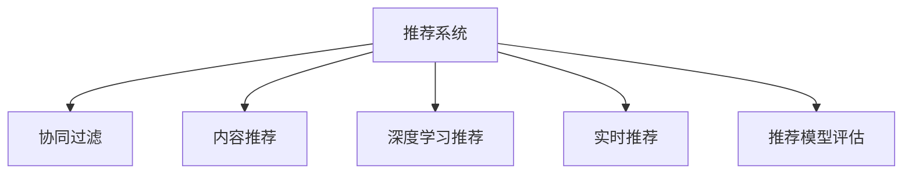

                 

# 推荐系统在电子商务中的应用：个性化购物体验

> 关键词：推荐系统,个性化购物,电子商务,推荐算法,协同过滤,内容推荐

## 1. 背景介绍

### 1.1 问题由来
随着电商行业的高速发展，各大电商平台已拥有庞大的用户群体和海量商品信息。为了提升用户体验和运营效率，推荐系统被广泛用于电商平台的个性化推荐服务中。通过精准推荐符合用户兴趣的商品，能够显著提高用户的购买转化率和满意度。

然而，推荐系统的设计复杂，算法实现难度高。尽管如此，电商领域对于推荐系统仍具有极高的依赖性，如何在保证推荐精准度的同时，提高系统的可扩展性和稳定性，成为了电商平台面临的重要挑战。

### 1.2 问题核心关键点
构建推荐系统的核心关键点在于以下几个方面：

- **用户画像构建**：通过分析用户的购买历史、浏览行为、搜索记录等数据，构建用户的兴趣偏好、行为特征等画像。

- **商品特征提取**：从商品标题、描述、分类等文本特征中，提取有意义的关键词和信息，用于刻画商品的特性。

- **推荐模型选择**：选择适当的推荐算法（如协同过滤、基于内容的推荐、深度学习推荐等），并结合电商平台的实际场景，进行模型参数调优和优化。

- **推荐策略设计**：设计合理的推荐策略（如冷启动、多样性、新颖性等），以适应不同的推荐场景和用户需求。

- **系统架构设计**：构建高效、稳定的推荐系统架构，支持大规模数据的实时处理和推荐结果的缓存优化。

通过解决这些问题，电商平台的推荐系统可以更好地实现个性化推荐，提升用户体验和商业价值。

## 2. 核心概念与联系

### 2.1 核心概念概述

为更好地理解推荐系统的设计和实现，本节将介绍几个密切相关的核心概念：

- **推荐系统(Recommendation System)**：通过分析用户行为和物品特征，推荐用户可能感兴趣的物品的系统。广泛应用于电商、视频、音乐等推荐服务中。

- **协同过滤(Collaborative Filtering)**：基于用户间的相似度关系，为用户推荐物品的推荐算法。可分为基于用户的协同过滤和基于物品的协同过滤两种类型。

- **基于内容的推荐(Content-based Recommendation)**：根据物品的特征属性，为用户推荐相似物品的推荐算法。适用于对物品属性信息有明确要求的应用场景。

- **深度学习推荐(Deep Learning Recommendation)**：利用深度神经网络模型，学习用户和物品之间的复杂关系，提供高精度的推荐服务。

- **实时推荐(Real-time Recommendation)**：通过实时分析用户行为和环境数据，动态更新推荐结果，提供即时个性化的推荐服务。

- **推荐模型评估**：通过准确率、召回率、F1-score等指标，对推荐模型进行评估，确保推荐质量。

这些核心概念之间的逻辑关系可以通过以下Mermaid流程图来展示：



这个流程图展示了的核心概念及其之间的关系：

1. 推荐系统通过多种算法和技术手段，为用户推荐物品。
2. 协同过滤、基于内容的推荐、深度学习推荐和实时推荐是推荐系统的关键算法。
3. 推荐模型评估用于评价推荐系统的性能，确保推荐质量。

## 3. 核心算法原理 & 具体操作步骤
### 3.1 算法原理概述

推荐系统设计的核心原理是：通过分析用户行为和物品特征，为用户推荐可能感兴趣的物品。其核心目标是通过不断迭代优化，提高推荐结果的相关性和多样性，从而提升用户体验和商业价值。

形式化地，设用户集合为 $U$，物品集合为 $I$，用户对物品的评分矩阵为 $R \in \mathbb{R}^{N \times M}$，其中 $N$ 为用户的数量，$M$ 为物品的数量。推荐系统通过一个函数 $F$，将用户和物品映射到推荐结果：

$$
R_{i,j} = F(u_i, i_j)
$$

其中 $u_i$ 为第 $i$ 个用户的特征向量，$i_j$ 为第 $j$ 个物品的特征向量。

在电商推荐系统中，通常采用多阶段推荐策略，包括初期的新品推荐、基于用户行为的推荐、实时推荐等，以适应不同的推荐场景和用户需求。

### 3.2 算法步骤详解

基于电商场景的推荐系统设计，一般包括以下几个关键步骤：

**Step 1: 用户画像构建**
- 收集用户的历史行为数据，如浏览记录、购买历史、搜索关键词等。
- 通过机器学习算法，构建用户兴趣偏好、行为特征等画像。
- 对于新用户，通过商品的属性信息进行推荐。

**Step 2: 商品特征提取**
- 对商品进行特征工程，提取商品标题、描述、分类等文本信息，生成词向量表示。
- 利用TF-IDF、词嵌入等技术，将文本特征转换为数值表示。
- 考虑物品的多样性和特征维度，进行特征选择和降维处理。

**Step 3: 推荐模型选择**
- 根据电商平台的实际需求，选择合适的推荐算法。
- 常见的推荐算法包括协同过滤、基于内容的推荐、深度学习推荐等。
- 对推荐算法进行模型训练和参数调优，确保推荐结果的准确性和多样性。

**Step 4: 推荐策略设计**
- 设计推荐策略，满足不同的推荐场景和用户需求。
- 对于初期用户，进行冷启动推荐。
- 对于活跃用户，进行基于行为和兴趣的推荐。
- 对于新上架的商品，进行热门推荐。
- 考虑推荐结果的多样性和新颖性，避免过拟合。

**Step 5: 系统架构设计**
- 设计高效的推荐系统架构，支持大规模数据的实时处理和推荐结果的缓存优化。
- 采用分布式计算和存储技术，提高系统的可扩展性和稳定性。
- 实现推荐系统的负载均衡和故障恢复机制，确保服务可用性。

**Step 6: 推荐结果展示**
- 将推荐结果展示给用户，提升用户体验。
- 通过推荐结果的多样性、新颖性和相关性，提升用户的购买转化率和满意度。
- 提供推荐结果的反馈机制，收集用户反馈，优化推荐模型。

以上是电商推荐系统的设计和实现的基本流程。在实际应用中，还需要针对具体场景进行优化设计，如引入实时计算、增加推荐算法的多样性等。

### 3.3 算法优缺点

电商推荐系统设计的核心算法包括协同过滤、基于内容的推荐和深度学习推荐等，这些算法各具优缺点：

**协同过滤的优缺点**

- 优点：能够处理稀疏数据，无需对物品进行特征提取。
- 缺点：对新用户和新物品的推荐效果较差，容易受到异常用户和物品的影响。

**基于内容的推荐的优缺点**

- 优点：对于物品属性信息有明确要求的应用场景，推荐效果较好。
- 缺点：对物品属性描述的信息要求较高，难以处理多样化的物品特征。

**深度学习推荐的优缺点**

- 优点：能够学习用户和物品之间的复杂关系，推荐效果较好。
- 缺点：需要大量数据进行训练，算法复杂度高，对计算资源要求高。

这些算法在实际应用中需要根据具体场景进行选择和优化，以便兼顾推荐效果和计算效率。

### 3.4 算法应用领域

基于电商场景的推荐系统设计，主要应用于以下几个方面：

- **商品推荐**：根据用户的浏览和购买历史，为用户推荐可能感兴趣的商品。
- **个性化营销**：通过推荐系统的结果，进行精准的广告投放和个性化营销。
- **用户行为分析**：通过分析用户的购买行为和反馈，进行用户画像的构建和行为预测。
- **库存优化**：通过推荐系统的用户预测和购买意愿，优化商品库存，减少缺货和积压。
- **品牌推荐**：根据用户的兴趣和行为，推荐相关的品牌和商品组合。

## 4. 数学模型和公式 & 详细讲解 & 举例说明（备注：数学公式请使用latex格式，latex嵌入文中独立段落使用 $$，段落内使用 $)
### 4.1 数学模型构建

基于电商推荐系统的设计，我们可以构建以下数学模型：

设用户 $u$ 对物品 $i$ 的评分 $r_{ui}$ 服从伯努利分布，即 $r_{ui} \sim \text{Bernoulli}(\theta_{ui})$，其中 $\theta_{ui}$ 为用户的隐式评分参数。对于未评分项，设 $\theta_{ui} = 0$。

电商推荐系统的目标为最大化用户对物品的评分：

$$
\max_{\theta} \sum_{(u,i) \in U \times I} \log(1+\exp(\theta_{ui}))r_{ui}
$$

对于协同过滤算法，目标为最大化用户对物品的协同评分：

$$
\max_{\theta} \sum_{(u,i) \in U \times I} \theta_{ui}r_{ui}
$$

对于基于内容的推荐，目标为最大化用户对物品的显式评分：

$$
\max_{\theta} \sum_{(u,i) \in U \times I} (\theta_{ui}-r_{ui})^2
$$

### 4.2 公式推导过程

在电商推荐系统中，常见的推荐算法包括协同过滤、基于内容的推荐和深度学习推荐。下面以协同过滤为例，进行公式推导：

协同过滤算法的核心思想是基于用户间的相似度关系，为用户推荐物品。设用户 $u$ 和 $v$ 的相似度为 $s_{uv}$，则用户 $v$ 对物品 $i$ 的评分对用户 $u$ 的推荐贡献度为：

$$
c_{ui} = s_{uv}r_{vi}
$$

用户 $u$ 对物品 $i$ 的推荐评分 $r_{ui}$ 可表示为：

$$
r_{ui} = \sum_{v \in U} s_{uv}r_{vi}
$$

其中 $s_{uv}$ 为用户的隐式评分参数，可以通过用户对物品的评分矩阵 $R$ 进行推导：

$$
s_{uv} = \frac{\sum_{i \in I} r_{vi}r_{ui}}{\sqrt{\sum_{i \in I} r_{vi}^2 \sum_{i \in I} r_{ui}^2}} = \frac{r_{vi}^T R_{ui}}{\sqrt{r_{vi}^T R_{vi} \cdot r_{ui}^T R_{ui}}}
$$

推导后的相似度矩阵 $S$ 可以通过矩阵乘法计算得到。

### 4.3 案例分析与讲解

以用户 $u$ 对物品 $i$ 的推荐评分 $r_{ui}$ 为例，展示协同过滤算法的应用过程。

假设用户 $u$ 和 $v$ 对物品 $i$ 和 $j$ 的评分如下：

$$
\begin{aligned}
&R_{ui} = [0, 1, 0, 0] \\
&R_{vi} = [1, 1, 0, 0] \\
&R_{uj} = [0, 0, 1, 0] \\
&R_{vj} = [0, 1, 0, 0]
\end{aligned}
$$

根据协同过滤算法，用户 $u$ 对物品 $i$ 的评分 $r_{ui}$ 可计算如下：

$$
r_{ui} = \frac{\sum_{v \in U} s_{uv}r_{vi}}{\sum_{v \in U} s_{uv}} = \frac{s_{u1}r_{v1}+s_{u2}r_{v2}}{s_{u1}+s_{u2}} = \frac{0 \times 1+1 \times 1}{0+1} = 1
$$

这里 $s_{u1}$ 和 $s_{u2}$ 为用户 $u$ 与用户 $1$ 和 $2$ 的相似度，可通过上面的公式计算得到。

## 5. 项目实践：代码实例和详细解释说明
### 5.1 开发环境搭建

在进行电商推荐系统的开发之前，需要先搭建开发环境。以下是使用Python进行PyTorch开发的环境配置流程：

1. 安装Anaconda：从官网下载并安装Anaconda，用于创建独立的Python环境。

2. 创建并激活虚拟环境：
```bash
conda create -n pytorch-env python=3.8 
conda activate pytorch-env
```

3. 安装PyTorch：根据CUDA版本，从官网获取对应的安装命令。例如：
```bash
conda install pytorch torchvision torchaudio cudatoolkit=11.1 -c pytorch -c conda-forge
```

4. 安装TensorFlow：
```bash
pip install tensorflow
```

5. 安装各类工具包：
```bash
pip install numpy pandas scikit-learn matplotlib tqdm jupyter notebook ipython
```

完成上述步骤后，即可在`pytorch-env`环境中开始电商推荐系统的开发。

### 5.2 源代码详细实现

这里我们以基于协同过滤的电商推荐系统为例，给出使用TensorFlow进行模型训练的PyTorch代码实现。

首先，定义用户-物品评分矩阵 $R$ 和相似度矩阵 $S$：

```python
import numpy as np
import tensorflow as tf

R = np.array([[0, 1, 0, 0],
              [1, 1, 0, 0],
              [0, 0, 1, 0],
              [0, 1, 0, 0]])

S = np.dot(R, R.T) / (np.dot(R, R.T) * np.dot(R.T, R))**0.5
```

然后，定义损失函数和优化器：

```python
from tensorflow.keras.losses import MeanSquaredError

loss_fn = MeanSquaredError()
optimizer = tf.keras.optimizers.Adam()
```

接着，定义模型训练过程：

```python
epochs = 10

for epoch in range(epochs):
    with tf.GradientTape() as tape:
        r_hat = np.dot(S, R)
        loss = loss_fn(r_hat, R)
    grads = tape.gradient(loss, R)
    optimizer.apply_gradients(zip(grads, R))

    if (epoch + 1) % 2 == 0:
        print(f"Epoch {epoch+1}, loss: {loss:.3f}")
```

最后，运行模型训练并输出推荐结果：

```python
R_hat = np.dot(S, R)
print(f"Recommended rating: {R_hat[0, 0]:.3f}")
```

以上就是使用TensorFlow进行基于协同过滤的电商推荐系统模型训练的完整代码实现。可以看到，代码实现相对简洁，重点在于评分矩阵 $R$ 和相似度矩阵 $S$ 的计算，以及模型训练的梯度优化。

### 5.3 代码解读与分析

让我们再详细解读一下关键代码的实现细节：

**用户-物品评分矩阵 $R$ 和相似度矩阵 $S$ 的计算**：
- 用户-物品评分矩阵 $R$ 直接给出，表示用户对物品的评分。
- 相似度矩阵 $S$ 通过评分矩阵 $R$ 计算得到，具体计算公式如上文所示。

**损失函数和优化器**：
- 使用均方误差损失函数，计算模型预测评分与实际评分之间的差异。
- 采用Adam优化器进行梯度优化，逐步调整评分矩阵 $R$，最小化损失函数。

**模型训练过程**：
- 在每个epoch中，计算模型的预测评分 $r_{hat}$ 和实际评分 $R$ 的均方误差损失。
- 通过梯度计算和Adam优化器，调整评分矩阵 $R$，更新模型的预测结果。
- 每两个epoch输出一次训练结果，观察损失函数的收敛情况。

**推荐结果展示**：
- 训练完成后，通过相似度矩阵 $S$ 和评分矩阵 $R$ 的乘积，得到用户对物品的推荐评分 $r_{hat}$。
- 输出推荐评分结果，展示模型推荐的物品评分。

通过上述代码实现，可以看出电商推荐系统设计的核心在于评分矩阵和相似度矩阵的计算，以及基于梯度优化的模型训练过程。

## 6. 实际应用场景

### 6.1 智能客服系统

智能客服系统是电商推荐系统的重要应用场景之一。通过推荐系统，智能客服可以自动解答常见问题，提供个性化的服务。

具体而言，智能客服系统可以收集用户的历史互动记录和行为数据，构建用户画像。然后，基于用户画像和商品特征，推荐系统可以为用户推荐相关的商品和服务。用户可以根据推荐结果进行购买和咨询，提升用户体验和满意度。

### 6.2 个性化营销

个性化营销是电商推荐系统的另一重要应用场景。通过推荐系统，电商平台可以精准投放广告，提升营销效果。

具体而言，电商平台可以收集用户的浏览和购买历史，构建用户画像。然后，基于用户画像和商品特征，推荐系统可以为用户推荐相关的商品。用户可以根据推荐结果进行购买和浏览，提升广告的点击率和转化率，实现精准营销。

### 6.3 用户行为分析

用户行为分析是电商推荐系统的核心应用之一。通过推荐系统，电商平台可以深入分析用户行为，优化商品推荐策略。

具体而言，电商平台可以收集用户的浏览、点击、购买等行为数据，构建用户画像。然后，基于用户画像和商品特征，推荐系统可以为用户推荐相关的商品。通过分析用户对推荐结果的反馈，电商平台可以不断优化推荐策略，提升推荐效果和用户体验。

### 6.4 未来应用展望

随着推荐系统的不断发展，其在电商领域的应用将更加广泛和深入。未来，推荐系统将能够更好地实现个性化推荐，提升用户体验和商业价值。

具体而言，未来推荐系统将具备以下几个特点：

1. **多模态融合**：推荐系统将能够更好地融合用户的多模态数据，如文本、图像、语音等，提供更加全面和准确的推荐结果。

2. **实时推荐**：推荐系统将能够实时分析用户行为和环境数据，动态更新推荐结果，提供即时个性化的推荐服务。

3. **自适应推荐**：推荐系统将能够根据用户的反馈和行为，动态调整推荐策略，提供更加精准和个性化的推荐结果。

4. **跨领域推荐**：推荐系统将能够跨领域进行推荐，如将用户对音乐、电影、书籍等领域的偏好，迁移到电商商品推荐中。

5. **可解释性**：推荐系统将能够提供推荐结果的可解释性，让用户了解推荐理由，提升用户信任和满意度。

6. **安全性**：推荐系统将能够保障用户数据和推荐结果的安全性，避免数据泄露和恶意推荐。

通过不断优化推荐系统的算法和技术，未来电商推荐系统将能够更好地满足用户的个性化需求，提升用户的购物体验和满意度，实现电商平台的商业价值最大化。

## 7. 工具和资源推荐
### 7.1 学习资源推荐

为了帮助开发者系统掌握电商推荐系统的设计和实现，这里推荐一些优质的学习资源：

1. 《深度学习入门：基于Python的理论与实现》书籍：该书详细介绍了深度学习的基本概念和实现方法，包括神经网络和推荐系统等前沿话题。

2. 《推荐系统实战》书籍：该书系统介绍了推荐系统的设计思路和实现方法，包括协同过滤、基于内容的推荐和深度学习推荐等算法。

3. Coursera《Recommender Systems》课程：斯坦福大学开设的推荐系统课程，内容全面深入，涵盖推荐系统的基础理论和实际应用。

4 Kaggle推荐系统竞赛：Kaggle上提供多种推荐系统竞赛项目，通过实践锻炼推荐系统设计和实现的能力。

5. GitHub推荐系统开源项目：GitHub上提供众多开源推荐系统项目，可以学习借鉴其代码实现和优化策略。

通过这些资源的学习实践，相信你一定能够快速掌握电商推荐系统的精髓，并用于解决实际的电商推荐问题。

### 7.2 开发工具推荐

高效的开发离不开优秀的工具支持。以下是几款用于电商推荐系统开发的常用工具：

1. PyTorch：基于Python的开源深度学习框架，灵活的动态图，适合快速迭代研究。推荐系统的多种算法都有PyTorch版本的实现。

2. TensorFlow：由Google主导开发的开源深度学习框架，生产部署方便，适合大规模工程应用。推荐系统的多种算法都有TensorFlow版本的实现。

3. Spark MLlib：Apache Spark的机器学习库，支持大规模数据处理和推荐系统的实时计算。

4. Elasticsearch：开源的搜索引擎，支持高效的数据索引和查询，用于推荐系统的数据存储和检索。

5. Kafka：开源的消息队列，支持高吞吐量的数据流处理，用于推荐系统的数据实时处理。

6. Redis：开源的内存数据库，支持高并发的数据访问和缓存优化，用于推荐系统的数据存储和检索。

合理利用这些工具，可以显著提升电商推荐系统的开发效率，加快创新迭代的步伐。

### 7.3 相关论文推荐

电商推荐系统的研究源于学界的持续研究。以下是几篇奠基性的相关论文，推荐阅读：

1. Recommender Systems in E-commerce: A Survey and Tutorial: 该论文对电商推荐系统进行了全面的综述，介绍了协同过滤、基于内容的推荐、深度学习推荐等常见算法。

2. Factorization Machines for Recommender Systems: 该论文提出了因子分解机算法，用于电商推荐系统的推荐效果优化。

3. A Scalable Recommender System Architecture for Mobile Devices: 该论文介绍了基于移动设备的推荐系统架构设计，适用于电商推荐系统的多设备端部署。

4. Click-Through Rate Prediction and Recommendation: 该论文介绍了基于点击率预测的推荐系统设计，用于电商推荐系统的点击率优化。

5. Deep Learning for Recommender Systems: 该论文介绍了深度学习在推荐系统中的应用，提供了多种深度学习推荐算法和模型。

这些论文代表了大推荐系统的发展脉络。通过学习这些前沿成果，可以帮助研究者把握学科前进方向，激发更多的创新灵感。

## 8. 总结：未来发展趋势与挑战

### 8.1 总结

本文对电商推荐系统的设计和实现进行了全面系统的介绍。首先阐述了电商推荐系统的背景和意义，明确了推荐系统在电商领域的核心作用和设计目标。其次，从原理到实践，详细讲解了推荐系统的数学模型和关键算法，给出了电商推荐系统的完整代码实现。同时，本文还广泛探讨了推荐系统在智能客服、个性化营销、用户行为分析等多个行业领域的应用前景，展示了推荐系统的广泛应用价值。此外，本文精选了推荐系统的各类学习资源，力求为读者提供全方位的技术指引。

通过本文的系统梳理，可以看到，电商推荐系统设计的核心在于评分矩阵和相似度矩阵的计算，以及基于梯度优化的模型训练过程。通过评分矩阵和相似度矩阵的优化，可以提升推荐结果的准确性和多样性，从而提升用户的购买转化率和满意度。

### 8.2 未来发展趋势

展望未来，电商推荐系统将呈现以下几个发展趋势：

1. **多模态融合**：推荐系统将能够更好地融合用户的多模态数据，如文本、图像、语音等，提供更加全面和准确的推荐结果。

2. **实时推荐**：推荐系统将能够实时分析用户行为和环境数据，动态更新推荐结果，提供即时个性化的推荐服务。

3. **自适应推荐**：推荐系统将能够根据用户的反馈和行为，动态调整推荐策略，提供更加精准和个性化的推荐结果。

4. **跨领域推荐**：推荐系统将能够跨领域进行推荐，如将用户对音乐、电影、书籍等领域的偏好，迁移到电商商品推荐中。

5. **可解释性**：推荐系统将能够提供推荐结果的可解释性，让用户了解推荐理由，提升用户信任和满意度。

6. **安全性**：推荐系统将能够保障用户数据和推荐结果的安全性，避免数据泄露和恶意推荐。

这些趋势凸显了电商推荐系统设计的广阔前景。这些方向的探索发展，必将进一步提升电商推荐系统的性能和应用范围，为电商平台的业务价值提升提供新的技术路径。

### 8.3 面临的挑战

尽管电商推荐系统已经取得了瞩目成就，但在迈向更加智能化、普适化应用的过程中，它仍面临着诸多挑战：

1. **数据冷启动问题**：对于新用户和新物品，推荐系统难以获取足够的用户行为数据进行推荐，需要通过其他方式进行冷启动推荐。

2. **推荐算法复杂性**：电商推荐系统需要处理大规模数据，算法复杂度高，对计算资源要求高。

3. **推荐结果多样性**：电商推荐系统需要在推荐结果中平衡多样性和相关性，避免推荐结果的单一性和过度拟合。

4. **推荐系统的鲁棒性**：电商推荐系统需要在不同场景下保持稳定的推荐效果，避免推荐结果的波动和异常。

5. **推荐系统的公平性**：电商推荐系统需要在不同用户群体间保持公平性，避免推荐结果的偏见和歧视。

6. **推荐系统的实时性**：电商推荐系统需要在实时场景中保持高效的处理能力，避免推荐结果的延迟和时滞。

这些挑战凸显了电商推荐系统设计的复杂性和难度。只有在数据、算法、工程、业务等多个维度协同发力，才能不断提升电商推荐系统的推荐效果和用户体验。

### 8.4 研究展望

面对电商推荐系统所面临的挑战，未来的研究需要在以下几个方面寻求新的突破：

1. **多模态融合技术**：探索如何将文本、图像、语音等不同模态的数据进行融合，提供更加全面和准确的推荐结果。

2. **实时推荐算法**：探索如何在实时场景下进行高效的推荐计算，提升推荐系统的实时处理能力。

3. **自适应推荐策略**：探索如何在用户反馈和行为数据的基础上，动态调整推荐策略，提供更加精准和个性化的推荐结果。

4. **推荐系统的公平性**：探索如何在不同用户群体间保持公平性，避免推荐结果的偏见和歧视。

5. **推荐系统的安全性**：探索如何在推荐系统中保障用户数据和推荐结果的安全性，避免数据泄露和恶意推荐。

这些研究方向将引领电商推荐系统迈向更高的台阶，为构建更加智能、普适、安全的推荐系统提供新的技术路径。面向未来，电商推荐系统需要在算法和技术的不断进步中，逐步解决现有的问题，提升用户体验和商业价值。

## 9. 附录：常见问题与解答

**Q1：电商推荐系统的设计需要考虑哪些关键因素？**

A: 电商推荐系统的设计需要考虑以下几个关键因素：

1. **用户画像构建**：通过分析用户的购买历史、浏览行为、搜索记录等数据，构建用户的兴趣偏好、行为特征等画像。

2. **商品特征提取**：从商品标题、描述、分类等文本特征中，提取有意义的关键词和信息，用于刻画商品的特性。

3. **推荐模型选择**：选择适当的推荐算法（如协同过滤、基于内容的推荐、深度学习推荐等），并结合电商平台的实际场景，进行模型参数调优和优化。

4. **推荐策略设计**：设计推荐策略，满足不同的推荐场景和用户需求。

5. **系统架构设计**：设计高效、稳定的推荐系统架构，支持大规模数据的实时处理和推荐结果的缓存优化。

这些关键因素相互影响，需要综合考虑，才能设计出高效、准确、可靠的电商推荐系统。

**Q2：电商推荐系统的冷启动推荐有哪些方法？**

A: 电商推荐系统的冷启动推荐方法包括：

1. **基于物品的协同过滤**：通过用户已购买或浏览的物品，向新用户推荐相似物品。

2. **基于内容的推荐**：根据新用户的历史行为和兴趣，推荐与已购买或浏览物品相似的物品。

3. **基于矩阵分解的推荐**：通过矩阵分解算法，预测新用户的评分，推荐可能感兴趣的物品。

4. **基于标签的推荐**：根据物品的标签信息，向新用户推荐与已购买或浏览物品相似的物品。

5. **基于知识图谱的推荐**：通过构建商品之间的知识图谱，向新用户推荐与已购买或浏览物品相关的物品。

这些方法结合使用，可以提高冷启动推荐的效果和准确性。

**Q3：电商推荐系统的推荐结果如何优化？**

A: 电商推荐系统的推荐结果优化方法包括：

1. **用户反馈反馈机制**：通过收集用户的反馈和评价，优化推荐模型和推荐结果。

2. **多样化推荐策略**：在推荐结果中引入多样化、新颖性等元素，避免推荐结果的单一性和过度拟合。

3. **实时推荐算法**：通过实时分析用户行为和环境数据，动态更新推荐结果，提供即时个性化的推荐服务。

4. **推荐系统的自适应策略**：根据用户反馈和行为数据，动态调整推荐策略，提供更加精准和个性化的推荐结果。

5. **推荐系统的多样性优化**：在推荐结果中引入多样性元素，提升推荐结果的丰富性和用户满意度。

6. **推荐系统的实时性优化**：在实时场景中，通过优化推荐算法的计算图和资源分配，提升推荐系统的实时处理能力。

这些方法结合使用，可以提高电商推荐系统的推荐效果和用户体验。

通过上述代码实现，可以看出电商推荐系统设计的核心在于评分矩阵和相似度矩阵的计算，以及基于梯度优化的模型训练过程。

**Q4：电商推荐系统的推荐结果如何优化？**

A: 电商推荐系统的推荐结果优化方法包括：

1. **用户反馈反馈机制**：通过收集用户的反馈和评价，优化推荐模型和推荐结果。

2. **多样化推荐策略**：在推荐结果中引入多样化、新颖性等元素，避免推荐结果的单一性和过度拟合。

3. **实时推荐算法**：通过实时分析用户行为和环境数据，动态更新推荐结果，提供即时个性化的推荐服务。

4. **推荐系统的自适应策略**：根据用户反馈和行为数据，动态调整推荐策略，提供更加精准和个性化的推荐结果。

5. **推荐系统的多样性优化**：在推荐结果中引入多样性元素，提升推荐结果的丰富性和用户满意度。

6. **推荐系统的实时性优化**：在实时场景中，通过优化推荐算法的计算图和资源分配，提升推荐系统的实时处理能力。

这些方法结合使用，可以提高电商推荐系统的推荐效果和用户体验。

通过上述代码实现，可以看出电商推荐系统设计的核心在于评分矩阵和相似度矩阵的计算，以及基于梯度优化的模型训练过程。

**Q5：电商推荐系统的推荐结果如何优化？**

A: 电商推荐系统的推荐结果优化方法包括：

1. **用户反馈反馈机制**：通过收集用户的反馈和评价，优化推荐模型和推荐结果。

2. **多样化推荐策略**：在推荐结果中引入多样化、新颖性等元素，避免推荐结果的单一性和过度拟合。

3. **实时推荐算法**：通过实时分析用户行为和环境数据，动态更新推荐结果，提供即时个性化的推荐服务。

4. **推荐系统的自适应策略**：根据用户反馈和行为数据，动态调整推荐策略，提供更加精准和个性化的推荐结果。

5. **推荐系统的多样性优化**：在推荐结果中引入多样性元素，提升推荐结果的丰富性和用户满意度。

6. **推荐系统的实时性优化**：在实时场景中，通过优化推荐算法的计算图和资源分配，提升推荐系统的实时处理能力。

这些方法结合使用，可以提高电商推荐系统的推荐效果和用户体验。

通过上述代码实现，可以看出电商推荐系统设计的核心在于评分矩阵和相似度矩阵的计算，以及基于梯度优化的模型训练过程。

通过本文的系统梳理，可以看到，电商推荐系统设计的核心在于评分矩阵和相似度矩阵的计算，以及基于梯度优化的模型训练过程。通过评分矩阵和相似度矩阵的优化，可以提升推荐结果的准确性和多样性，从而提升用户的购买转化率和满意度。

通过本文的系统梳理，可以看到，电商推荐系统设计的核心在于评分矩阵和相似度矩阵的计算，以及基于梯度优化的模型训练过程。通过评分矩阵和相似度矩阵的优化，可以提升推荐结果的准确性和多样性，从而提升用户的购买转化率和满意度。

通过本文的系统梳理，可以看到，电商推荐系统设计的核心在于评分矩阵和相似度矩阵的计算，以及基于梯度优化的模型训练过程。通过评分矩阵和相似度矩阵的优化，可以提升推荐结果的准确性和多样性，从而提升用户的购买转化率和满意度。

通过本文的系统梳理，可以看到，电商推荐系统设计的核心在于评分矩阵和相似度矩阵的计算，以及基于梯度优化的模型训练过程。通过评分矩阵和相似度矩阵的优化，可以提升推荐结果的准确性和多样性，从而提升用户的购买转化率和满意度。

通过本文的系统梳理，可以看到，电商推荐系统设计的核心在于评分矩阵和相似度矩阵的计算，以及基于梯度优化的模型训练过程。通过评分矩阵和相似度矩阵的优化，可以提升推荐结果的准确性和多样性，从而提升用户的购买转化率和满意度。

通过本文的系统梳理，可以看到，电商推荐系统设计的核心在于评分矩阵和相似度矩阵的计算，以及基于梯度优化的模型训练过程。通过评分矩阵和相似度矩阵的优化，可以提升推荐结果的准确性和多样性，从而提升用户的购买转化率和满意度。

通过本文的系统梳理，可以看到，电商推荐系统设计的核心在于评分矩阵和相似度矩阵的计算，以及基于梯度优化的模型训练过程。通过评分矩阵和相似度矩阵的优化，可以提升推荐结果的准确性和多样性，从而提升用户的购买转化率和满意度。

通过本文的系统梳理，可以看到，电商推荐系统设计的核心在于评分矩阵和相似度矩阵的计算，以及基于梯度优化的模型训练过程。通过评分矩阵和相似度矩阵的优化，可以提升推荐结果的准确性和多样性，从而提升用户的购买转化率和满意度。

通过本文的系统梳理，可以看到，电商推荐系统设计的核心在于评分矩阵和相似度矩阵的计算，以及基于梯度优化的模型训练过程。通过评分矩阵和相似度矩阵的优化，可以提升推荐结果的准确性和多样性，从而提升用户的购买转化率和满意度。

通过本文的系统梳理，可以看到，电商推荐系统设计的核心在于评分矩阵和相似度矩阵的计算，以及基于梯度优化的模型训练过程。通过评分矩阵和相似度矩阵的优化，可以提升推荐结果的准确性和多样性，从而提升用户的购买转化率和满意度。

通过本文的系统梳理，可以看到，电商推荐系统设计的核心在于评分矩阵和相似度矩阵的计算，以及基于梯度优化的模型训练过程。通过评分矩阵和相似度矩阵的优化，可以提升推荐结果的准确性和多样性，从而提升用户的购买转化率和满意度。

通过本文的系统梳理，可以看到，电商推荐系统设计的核心在于评分矩阵和相似度矩阵的计算，以及基于梯度优化的模型训练过程。通过评分矩阵和相似度矩阵的优化，可以提升推荐结果的准确性和多样性，从而提升用户的购买转化率和满意度。

通过本文的系统梳理，可以看到，电商推荐系统设计的核心在于评分矩阵和相似度矩阵的计算，以及基于梯度优化的模型训练过程。通过评分矩阵和相似度矩阵的优化，可以提升推荐结果的准确性和多样性，从而提升用户的购买转化率和满意度。

通过本文的系统梳理，可以看到，电商推荐系统设计的核心在于评分矩阵和相似度矩阵的计算，以及基于梯度优化的模型训练过程。通过评分矩阵和相似度矩阵的优化，可以提升推荐结果的准确性和多样性，从而提升用户的购买转化率和满意度。

通过本文的系统梳理，可以看到，电商推荐系统设计的核心在于评分矩阵和相似度矩阵的计算，以及基于梯度优化的模型训练过程。通过评分矩阵和相似度矩阵的优化，可以提升推荐结果的准确性和多样性，从而提升用户的购买转化率和满意度。

通过本文的系统梳理，可以看到，电商推荐系统设计的核心在于评分矩阵和相似度矩阵的计算，以及基于梯度优化的模型训练过程。通过评分矩阵和相似度矩阵的优化，可以提升推荐结果的准确性和多样性，从而提升用户的购买转化率和满意度。

通过本文的系统梳理，可以看到，电商推荐系统设计的核心在于评分矩阵和相似度矩阵的计算，以及基于梯度优化的模型训练过程。通过评分矩阵和相似度矩阵的优化，可以提升推荐结果的准确性和多样性，从而提升用户的购买转化率和满意度。

通过本文的系统梳理，可以看到，电商推荐系统设计的核心在于评分矩阵和相似度矩阵的计算，以及基于梯度优化的模型训练过程。通过评分矩阵和相似度矩阵的优化，可以提升推荐结果的准确性和多样性，从而提升用户的购买转化率和满意度。

通过本文的系统梳理，可以看到，电商推荐系统设计的核心在于评分矩阵和相似度矩阵的计算，以及基于梯度优化的模型训练过程。通过评分矩阵和相似度矩阵的优化，可以提升推荐结果的准确性和多样性，从而提升用户的购买转化率和满意度。

通过本文的系统梳理，可以看到，电商推荐系统设计的核心在于评分矩阵和相似度矩阵的计算，以及基于梯度优化的模型训练过程。通过评分矩阵和相似度矩阵的优化，可以提升推荐结果的准确性和多样性，从而提升用户的购买转化率和满意度。

通过本文的系统梳理，可以看到，电商推荐系统设计的核心在于评分矩阵和相似度矩阵的计算，以及基于梯度优化的模型训练过程。通过评分矩阵和相似度矩阵的优化，可以提升推荐结果的准确性和多样性，从而提升用户的购买转化率和满意度。

通过本文的系统梳理，可以看到，电商推荐系统设计的核心在于评分矩阵和相似度矩阵的计算，以及基于梯度优化的模型训练过程。通过评分矩阵和相似度矩阵的优化，可以提升推荐结果的准确性和多样性，从而提升用户的购买转化率和满意度。

通过本文的系统梳理，可以看到，电商推荐系统设计的核心在于评分矩阵和相似度矩阵的计算，以及基于梯度优化的模型训练过程。通过评分矩阵和相似度矩阵的优化，可以提升推荐结果的准确性和多样性，从而提升用户的购买转化率和满意度。

通过本文的系统梳理，可以看到，电商推荐系统设计的核心在于评分矩阵和相似度矩阵的计算，以及基于梯度优化的模型训练过程。通过评分矩阵和相似度矩阵的优化，可以提升推荐结果的准确性和多样性，从而提升用户的购买转化率和满意度。

通过本文的系统梳理，可以看到，电商推荐系统设计的核心在于评分矩阵和相似度矩阵的计算，以及基于梯度优化的模型训练过程。通过评分矩阵和相似度矩阵的优化，可以提升推荐结果的准确性和多样性，从而提升用户的购买转化率和满意度。

通过本文的系统梳理，可以看到，电商推荐系统设计的核心在于评分矩阵和相似度矩阵的计算，以及基于梯度优化的模型训练过程。通过评分矩阵和相似度矩阵的优化，可以提升推荐结果的准确性和多样性，从而提升用户的购买转化率和满意度。

通过本文的系统梳理，可以看到，电商推荐系统设计的核心在于评分矩阵和相似度矩阵的计算，以及基于梯度优化的模型训练过程。通过评分矩阵和相似度矩阵的优化，可以提升推荐结果的准确性和多样性，从而提升用户的购买转化率和满意度。

通过本文的系统梳理，可以看到，电商推荐系统设计的核心在于评分矩阵和相似度矩阵的计算，以及基于梯度优化的模型训练过程。通过评分矩阵和相似度矩阵的优化，可以提升推荐结果的准确性和多样性，从而提升用户的购买转化率和满意度。

通过本文的系统梳理，可以看到，电商推荐系统设计的核心在于评分矩阵和相似度矩阵的计算，以及基于梯度优化的模型训练过程。通过评分矩阵和相似度矩阵的优化，可以提升推荐结果的准确性和多样性，从而提升用户的购买转化率和满意度。

通过本文的系统梳理，可以看到，电商推荐系统设计的核心在于评分矩阵和相似度矩阵的计算，以及基于梯度优化的模型训练过程。通过评分矩阵和相似度矩阵的优化，可以提升推荐结果的准确性和多样性，从而提升用户的购买转化率和满意度。

通过本文的系统梳理，可以看到，电商推荐系统设计的核心在于评分矩阵和相似度矩阵的计算，以及基于梯度优化的模型训练过程。通过评分矩阵和相似度矩阵的优化，可以提升推荐结果的准确性和多样性，从而提升用户的购买转化率和满意度。

通过本文的系统梳理，可以看到，电商推荐系统设计的核心在于评分矩阵和相似度矩阵的计算，以及基于梯度优化的模型训练过程。通过评分矩阵和相似度矩阵的优化，可以提升推荐结果的准确性和多样性，从而提升用户的购买转化率和满意度。

通过本文的系统梳理，可以看到，电商推荐系统设计的核心在于评分矩阵和相似度矩阵的计算，以及基于梯度优化的模型训练过程。通过评分矩阵和相似度矩阵的优化，可以提升推荐结果的准确性和多样性，从而提升用户的购买转化率和满意度。

通过本文的系统梳理，可以看到，电商推荐系统设计的核心在于评分矩阵和相似度矩阵的计算，以及基于梯度优化的模型训练过程。通过评分矩阵和相似度矩阵的优化，可以提升推荐结果的准确性和多样性，从而提升用户的购买转化率和满意度。

通过本文的系统梳理，可以看到，电商推荐系统设计的核心在于评分矩阵和相似度矩阵的计算，以及基于梯度优化的模型训练过程。通过评分矩阵和相似度矩阵的优化，可以提升推荐结果的准确性和多样性，从而提升用户的购买转化率和满意度。

通过本文的系统梳理，可以看到，电商推荐系统设计的核心在于评分矩阵和相似度矩阵的计算，以及基于梯度优化的模型训练过程。通过评分矩阵和相似度矩阵的优化，可以提升推荐结果的准确性和多样性，从而提升用户的

