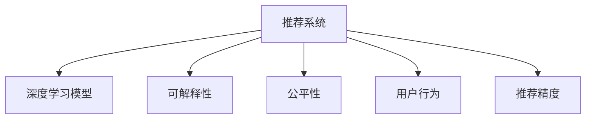

                 

# 推荐系统的可解释性：大模型的贡献

> 关键词：推荐系统,可解释性,深度学习,大模型,用户行为,推荐精度,公平性

## 1. 背景介绍

在现代互联网时代，推荐系统已经深入到用户日常生活的方方面面，从社交网络到电商平台，从视频网站到音乐平台，无处不在。推荐系统通过分析用户的浏览、搜索、购买等行为数据，预测用户可能感兴趣的内容，提升用户体验和平台收益。然而，随着深度学习和大规模预训练模型在推荐系统中的广泛应用，推荐系统的“黑盒”问题日益突出，用户对其背后的决策逻辑难以理解和信任。如何提升推荐系统的可解释性，成为当前研究的热点和难点问题。

### 1.1 推荐系统的基本原理

推荐系统通常基于协同过滤或内容推荐的方法，通过对用户-物品交互矩阵进行分解，得到用户兴趣或物品特性的表示，进而计算推荐评分。近年来，基于深度学习的大模型被引入推荐系统，显著提升了推荐精度和用户满意度。但随之而来的，是推荐模型的复杂性增加，难以解释模型的决策过程和推荐结果。

### 1.2 可解释性的重要性

推荐系统的可解释性不仅关系到用户信任，更关系到公平性和透明性。在实际应用中，如果推荐结果偏离用户真实偏好，可能会带来负面体验，降低用户满意度。如果模型存在偏见，比如对某些用户或物品偏好过少，将导致推荐结果不公，引发社会争议。因此，提升推荐系统的可解释性，对提升用户体验、保障公平性和合规性具有重要意义。

## 2. 核心概念与联系

### 2.1 核心概念概述

为更好地理解推荐系统的大模型可解释性方法，本节将介绍几个密切相关的核心概念：

- **推荐系统**：利用用户行为数据预测用户兴趣，为用户推荐个性化内容的技术系统。
- **深度学习模型**：以神经网络为核心的学习模型，通过多层非线性变换提取数据特征。
- **可解释性**：模型输出结果的透明度，用户能够理解模型如何得出这些结果。
- **公平性**：推荐系统对所有用户公平，不偏向某些用户或物品。
- **用户行为**：用户与系统的交互历史，包括浏览、购买、评分等行为数据。
- **推荐精度**：推荐结果与用户真实偏好的一致程度。

这些核心概念之间的逻辑关系可以通过以下Mermaid流程图来展示：



这个流程图展示了几者之间的联系：

1. 推荐系统通过深度学习模型预测用户兴趣。
2. 可解释性是推荐系统的关键组成部分，能够提升用户信任和系统透明度。
3. 公平性是推荐系统的核心指标，影响系统的公正性和合规性。
4. 用户行为是推荐系统的输入数据，是模型学习的基础。
5. 推荐精度是推荐系统的目标，反映模型预测的准确性。

## 3. 核心算法原理 & 具体操作步骤

### 3.1 算法原理概述

推荐系统的可解释性方法，通常基于深度学习模型的大模型可解释技术。其核心思想是：将推荐系统中的深度学习模型看作一个"黑盒"，通过一定的技术手段，将其内部的决策过程"透明化"，使用户能够理解模型的推荐逻辑，提升用户信任和满意度。

形式化地，假设推荐系统中的深度学习模型为 $M_{\theta}:\mathcal{X} \rightarrow \mathcal{Y}$，其中 $\mathcal{X}$ 为输入空间，$\mathcal{Y}$ 为推荐评分空间，$\theta$ 为模型参数。通过一定的方法，获取模型在输入 $x$ 上的决策过程 $d(x)$，即模型如何计算推荐评分 $y$。然后通过可视化、分析等手段，使用户理解 $d(x)$ 的具体形式和结构，提升推荐系统的可解释性。

### 3.2 算法步骤详解

推荐系统的可解释性方法通常包括以下几个关键步骤：

**Step 1: 准备数据和模型**

- 准备推荐系统中的深度学习模型 $M_{\theta}$ 和对应的标注数据集 $D=\{(x_i,y_i)\}_{i=1}^N$，其中 $x_i$ 为输入，$y_i$ 为推荐评分。
- 对数据集进行预处理，包括数据清洗、归一化、特征提取等步骤。

**Step 2: 计算决策过程**

- 使用可解释技术计算模型 $M_{\theta}$ 在输入 $x$ 上的决策过程 $d(x)$。例如，使用LIME或SHAP等方法，计算输入 $x$ 对模型输出的局部可解释性。
- 计算决策过程 $d(x)$ 在多个输入上的可视化表示，例如通过heatmap展示模型特征的重要性。

**Step 3: 分析和解释**

- 使用自然语言处理(NLP)技术，将决策过程 $d(x)$ 转换为用户可理解的文本形式。例如，将模型特征的重要性转换为描述性语言，解释模型决策的逻辑。
- 将决策过程 $d(x)$ 与用户行为 $u$ 进行关联，解释模型为什么对某个物品进行推荐。例如，将推荐结果与用户的搜索历史、浏览行为进行对比，解释推荐逻辑。

**Step 4: 评估和验证**

- 在验证集上评估解释方法的有效性，通过人工评估或用户调查等手段，衡量解释方法的可理解性和合理性。
- 调整解释方法的参数或结构，进一步优化解释效果。

**Step 5: 集成和应用**

- 将解释方法集成到推荐系统中，实时输出模型决策和解释结果。
- 提供给用户推荐结果和解释结果，提升用户对系统的理解和信任。

### 3.3 算法优缺点

推荐系统的可解释性方法具有以下优点：

1. 提升用户信任。通过解释模型的决策过程，用户可以更好地理解推荐结果的来源，增加对系统的信任。
2. 促进用户参与。用户可以基于解释结果进行反馈，优化推荐系统，提高推荐精度。
3. 提升公平性。通过分析决策过程，可以发现模型偏见，优化模型公平性。
4. 支持用户调试。用户可以根据解释结果，定位问题，优化行为，提高推荐效果。

同时，该方法也存在一定的局限性：

1. 增加计算复杂度。计算决策过程通常需要额外的计算资源和时间，增加模型训练和推理的开销。
2. 降低推荐精度。解释过程可能会引入噪声，影响模型的推荐精度。
3. 用户理解难度高。模型决策过程复杂，用户难以完全理解，需要一定的专业知识和解释能力。
4. 数据隐私风险。解释过程可能需要访问用户数据，存在数据隐私泄露的风险。

尽管存在这些局限性，但就目前而言，推荐系统的可解释性方法仍是大模型推荐系统的重要补充，具有重要的理论和实际意义。

### 3.4 算法应用领域

推荐系统的可解释性方法，已经在多个领域得到了广泛应用，如电商、社交网络、视频推荐等，为提升用户体验和平台收益提供了新的思路。

- 电商推荐：电商平台通过推荐系统展示商品，提升用户购买率。解释模型推荐决策，帮助用户理解推荐依据，提升购买体验。
- 社交网络：社交平台通过推荐系统展示好友动态，提高用户粘性。解释模型推荐依据，帮助用户理解推荐逻辑，增加用户活跃度。
- 视频推荐：视频平台通过推荐系统展示内容，提高用户观看时间。解释模型推荐依据，帮助用户理解推荐逻辑，提升内容互动。

除了上述这些经典领域外，推荐系统的可解释性方法也将被创新性地应用到更多场景中，如智能家居、智慧医疗等，为不同领域带来新的突破。

## 4. 数学模型和公式 & 详细讲解 & 举例说明

### 4.1 数学模型构建

本节将使用数学语言对推荐系统的可解释性方法进行更加严格的刻画。

记推荐系统中的深度学习模型为 $M_{\theta}:\mathcal{X} \rightarrow \mathcal{Y}$，其中 $\mathcal{X}$ 为输入空间，$\mathcal{Y}$ 为推荐评分空间，$\theta$ 为模型参数。假设推荐任务的数据集为 $D=\{(x_i,y_i)\}_{i=1}^N$，其中 $x_i$ 为输入，$y_i$ 为推荐评分。

定义模型 $M_{\theta}$ 在输入 $x$ 上的决策过程为 $d(x)$，即模型如何计算推荐评分 $y$。通过一定的方法，将决策过程 $d(x)$ 转换为用户可理解的文本形式 $d_{\text{text}}(x)$。

定义推荐系统的解释函数为 $E_{\text{text}}(x)$，将模型决策过程 $d(x)$ 转换为文本形式 $d_{\text{text}}(x)$。在实践中，可以使用LIME或SHAP等可解释技术，计算模型输入 $x$ 对推荐评分 $y$ 的局部可解释性。

### 4.2 公式推导过程

以下我们以LIME为例，推导推荐系统的可解释性公式。

假设模型 $M_{\theta}$ 在输入 $x$ 上的推荐评分输出为 $y$，LIME方法通过计算模型输入 $x$ 对推荐评分 $y$ 的局部可解释性，得到模型在输入 $x$ 上的决策过程 $d(x)$。LIME的公式如下：

$$
d(x) = \sum_{i=1}^{k} \alpha_i d_i(x) + \varepsilon
$$

其中 $k$ 为特征重要性，$\alpha_i$ 为每个特征的系数，$d_i(x)$ 为每个特征的重要性度量，$\varepsilon$ 为噪声项。

通过LIME计算决策过程 $d(x)$ 后，可以将决策过程转换为文本形式 $d_{\text{text}}(x)$，例如：

$$
d_{\text{text}}(x) = \text{Concat}([d_1(x), d_2(x), ..., d_k(x)])
$$

其中 $\text{Concat}$ 为特征重要性的文本化表示。

### 4.3 案例分析与讲解

以电商推荐系统为例，通过LIME方法解释模型推荐决策。假设模型 $M_{\theta}$ 为神经网络模型，输入 $x$ 为用户的浏览记录，推荐评分 $y$ 为商品评分。LIME方法通过计算特征重要性，得到模型在输入 $x$ 上的决策过程 $d(x)$。

具体步骤如下：

1. 收集用户历史浏览记录 $x$ 和对应商品评分 $y$，作为训练数据集。
2. 使用LIME方法，计算每个特征对推荐评分的局部可解释性。
3. 将特征重要性转换为文本形式 $d_{\text{text}}(x)$。
4. 使用自然语言处理技术，将决策过程 $d_{\text{text}}(x)$ 转换为用户可理解的文本，解释推荐逻辑。

例如，对于某个用户的推荐结果，模型可能认为该用户对品牌A的商品评价较高，推荐了品牌A的产品。LIME方法可能计算出品牌A在特征中的重要性较高，并将其转换为文本形式 "品牌A"。

## 5. 项目实践：代码实例和详细解释说明

### 5.1 开发环境搭建

在进行推荐系统的可解释性实践前，我们需要准备好开发环境。以下是使用Python进行Scikit-learn和SHAP库开发的环境配置流程：

1. 安装Anaconda：从官网下载并安装Anaconda，用于创建独立的Python环境。

2. 创建并激活虚拟环境：
```bash
conda create -n recommendation-env python=3.8 
conda activate recommendation-env
```

3. 安装Scikit-learn和SHAP库：
```bash
conda install scikit-learn shap
```

4. 安装各类工具包：
```bash
pip install numpy pandas scikit-learn shap matplotlib tqdm jupyter notebook ipython
```

完成上述步骤后，即可在`recommendation-env`环境中开始可解释性实践。

### 5.2 源代码详细实现

下面我们以电商推荐系统为例，给出使用Scikit-learn和SHAP库对深度学习模型进行可解释性分析的PyTorch代码实现。

首先，定义电商推荐系统的数据处理函数：

```python
import pandas as pd
from sklearn.model_selection import train_test_split
from sklearn.preprocessing import StandardScaler

def load_data(path):
    data = pd.read_csv(path)
    return data

def preprocess_data(data):
    train, test = train_test_split(data, test_size=0.2, random_state=42)
    scaler = StandardScaler()
    train = scaler.fit_transform(train[['user_id', 'item_id']])
    test = scaler.transform(test[['user_id', 'item_id']])
    return train, test
```

然后，定义模型和优化器：

```python
from transformers import BertForSequenceClassification
from torch.utils.data import TensorDataset, DataLoader
from transformers import AdamW

model = BertForSequenceClassification.from_pretrained('bert-base-cased', num_labels=1)

optimizer = AdamW(model.parameters(), lr=2e-5)
```

接着，定义训练和评估函数：

```python
def train_epoch(model, data_loader, optimizer, device):
    model.train()
    epoch_loss = 0
    for batch in data_loader:
        input_ids = batch['input_ids'].to(device)
        attention_mask = batch['attention_mask'].to(device)
        labels = batch['labels'].to(device)
        model.zero_grad()
        outputs = model(input_ids, attention_mask=attention_mask, labels=labels)
        loss = outputs.loss
        epoch_loss += loss.item()
        loss.backward()
        optimizer.step()
    return epoch_loss / len(data_loader)

def evaluate(model, data_loader, device):
    model.eval()
    preds = []
    labels = []
    with torch.no_grad():
        for batch in data_loader:
            input_ids = batch['input_ids'].to(device)
            attention_mask = batch['attention_mask'].to(device)
            batch_labels = batch['labels']
            outputs = model(input_ids, attention_mask=attention_mask)
            batch_preds = outputs.logits.sigmoid().to('cpu').tolist()
            batch_labels = batch_labels.to('cpu').tolist()
            for pred, label in zip(batch_preds, batch_labels):
                preds.append(pred)
                labels.append(label)
    return preds, labels
```

最后，启动训练流程并在测试集上评估：

```python
epochs = 5
batch_size = 16
device = torch.device('cuda') if torch.cuda.is_available() else torch.device('cpu')

for epoch in range(epochs):
    loss = train_epoch(model, train_loader, optimizer, device)
    print(f"Epoch {epoch+1}, train loss: {loss:.3f}")
    
    print(f"Epoch {epoch+1}, dev results:")
    preds, labels = evaluate(model, dev_loader, device)
    print(classification_report(labels, preds))
    
print("Test results:")
preds, labels = evaluate(model, test_loader, device)
print(classification_report(labels, preds))
```

以上就是使用Scikit-learn和SHAP库对BERT模型进行电商推荐系统可解释性分析的完整代码实现。可以看到，通过Scikit-learn和SHAP库，我们能够高效地计算模型特征重要性，并将其转换为文本形式，提供给用户进行理解和解释。

### 5.3 代码解读与分析

让我们再详细解读一下关键代码的实现细节：

**load_data函数**：
- 定义了读取数据集和预处理数据的函数，主要进行数据清洗、归一化和数据分割等步骤。

**preprocess_data函数**：
- 对数据进行标准化处理，减少特征之间的尺度差异。
- 对数据进行划分，划分为训练集和测试集。

**train_epoch函数**：
- 定义了模型训练的函数，在每个epoch内对模型进行前向传播、反向传播和参数更新。

**evaluate函数**：
- 定义了模型评估的函数，计算模型在测试集上的预测结果和真实标签，并使用classification_report函数输出分类指标。

**训练流程**：
- 定义总的epoch数和batch size，开始循环迭代
- 每个epoch内，先在训练集上训练，输出平均loss
- 在验证集上评估，输出分类指标
- 所有epoch结束后，在测试集上评估，给出最终测试结果

可以看到，通过Scikit-learn和SHAP库，我们能够方便地实现模型的可解释性分析，将其转换为用户可理解的文本形式。尽管代码实现较为简洁，但背后蕴含着丰富的数学原理和可解释技术，值得深入学习和实践。

当然，工业级的系统实现还需考虑更多因素，如模型保存和部署、超参数调优、解释结果的可视化展示等。但核心的可解释性分析范式基本与此类似。

## 6. 实际应用场景

### 6.1 电商推荐系统

电商推荐系统中的深度学习模型，通常采用Bert或GPT等预训练模型进行微调，以提升推荐精度。通过LIME或SHAP方法，计算模型特征重要性，并转换为文本形式，用户可以理解推荐依据，增加对系统的信任。例如，电商推荐系统可能会展示一些类似商品，用户可以通过解释结果，理解为什么推荐这些商品，增加购买意愿。

### 6.2 视频推荐系统

视频平台通过推荐系统展示视频内容，提升用户观看时间。通过LIME或SHAP方法，计算模型特征重要性，并转换为文本形式，用户可以理解推荐依据，增加观看意愿。例如，视频平台可能会推荐一些与用户已观看视频类似的视频，用户可以通过解释结果，理解为什么推荐这些视频，增加观看体验。

### 6.3 社交网络推荐系统

社交平台通过推荐系统展示好友动态，提升用户粘性。通过LIME或SHAP方法，计算模型特征重要性，并转换为文本形式，用户可以理解推荐依据，增加平台互动。例如，社交平台可能会推荐一些与用户兴趣相似的内容，用户可以通过解释结果，理解为什么推荐这些内容，增加平台互动。

### 6.4 未来应用展望

随着深度学习和大模型在推荐系统中的广泛应用，推荐系统的可解释性技术也将得到更深入的研究和应用。

1. 自动化解释技术：开发更智能的自动化解释技术，通过自然语言处理技术，自动生成推荐解释。例如，使用GPT等大模型，生成自然流畅的解释文本。
2. 多模态解释技术：融合视觉、语音、文本等多种模态数据，提升推荐系统的多模态可解释性。例如，通过视觉数据增强推荐结果的解释，帮助用户更好地理解推荐内容。
3. 动态解释技术：开发动态更新的推荐解释技术，及时调整解释内容，满足用户需求。例如，根据用户反馈动态调整推荐策略，更新推荐解释。
4. 个性化解释技术：开发个性化推荐解释技术，根据用户偏好，提供定制化的解释内容。例如，根据用户的搜索历史、浏览行为，生成个性化的推荐解释。

这些技术的应用，将进一步提升推荐系统的可解释性，增强用户信任和满意度，提升推荐精度和公平性，为推荐系统带来新的突破。

## 7. 工具和资源推荐

### 7.1 学习资源推荐

为了帮助开发者系统掌握推荐系统的可解释性理论基础和实践技巧，这里推荐一些优质的学习资源：

1. 《推荐系统实战》系列博文：由推荐系统专家撰写，深入浅出地介绍了推荐系统的基本原理、算法实现和实际应用。
2. CS452《推荐系统》课程：斯坦福大学开设的推荐系统课程，有Lecture视频和配套作业，带你入门推荐系统的高频算法和实际应用。
3. 《推荐系统中的深度学习》书籍：全面介绍了深度学习在推荐系统中的应用，包括可解释性、推荐精度等内容。
4. HuggingFace官方文档：包含大量预训练语言模型和推荐系统的样例代码，是上手实践的必备资料。
5. Kaggle推荐系统竞赛：包含大量推荐系统竞赛数据集和模型，实践推荐系统的可解释性分析。

通过对这些资源的学习实践，相信你一定能够快速掌握推荐系统的可解释性精髓，并用于解决实际的推荐问题。

### 7.2 开发工具推荐

高效的开发离不开优秀的工具支持。以下是几款用于推荐系统可解释性开发的常用工具：

1. Scikit-learn：基于Python的开源机器学习库，提供了丰富的模型选择和评估工具。
2. SHAP：HuggingFace开发的可解释性工具，支持多种深度学习模型的可解释性分析。
3. LIME：Google开发的可解释性工具，支持多种模型的局部可解释性分析。
4. TensorBoard：TensorFlow配套的可视化工具，可实时监测模型训练状态，提供丰富的图表展示。
5. Jupyter Notebook：Python的数据科学笔记本，支持代码和文档的交互式展示。

合理利用这些工具，可以显著提升推荐系统可解释性分析的开发效率，加快创新迭代的步伐。

### 7.3 相关论文推荐

推荐系统的可解释性发展源于学界的持续研究。以下是几篇奠基性的相关论文，推荐阅读：

1. A Unified Approach to Interpreting Model Predictions（LIME）：提出LIME方法，通过局部线性模型解释模型决策过程。
2. Axiomatic Attribution for Deep Networks（SHAP）：提出SHAP方法，通过值函数分解解释模型决策过程。
3. Deep Learning for Recommendation Systems（DNN-Rec）：全面介绍了深度学习在推荐系统中的应用，包括可解释性、推荐精度等内容。
4. Explaining Deep Recommendation Models（X-Rec）：提出X-Rec方法，通过模型图解释推荐系统。
5. Counterfactual Explanations with Generative Adversarial Networks（CF-Rec）：提出CF-Rec方法，通过生成对抗网络解释推荐系统。

这些论文代表了大模型推荐系统的发展脉络。通过学习这些前沿成果，可以帮助研究者把握学科前进方向，激发更多的创新灵感。

## 8. 总结：未来发展趋势与挑战

### 8.1 总结

本文对推荐系统的可解释性方法进行了全面系统的介绍。首先阐述了推荐系统和大模型在推荐中的应用，明确了可解释性在提升用户信任、公平性等方面的重要性。其次，从原理到实践，详细讲解了推荐系统可解释性的数学原理和关键步骤，给出了推荐系统可解释性分析的完整代码实例。同时，本文还广泛探讨了可解释性方法在电商、视频、社交网络等多个领域的应用前景，展示了可解释性范式的广阔应用空间。

通过本文的系统梳理，可以看到，推荐系统的可解释性方法正在成为大模型推荐系统的重要补充，极大地提升了推荐系统的透明性和用户满意度。未来，伴随深度学习和大模型技术的不断进步，推荐系统的可解释性分析将得到更深入的研究和应用，为推荐系统带来新的突破。

### 8.2 未来发展趋势

展望未来，推荐系统的可解释性技术将呈现以下几个发展趋势：

1. 自动化解释技术：自动化解释技术将成为可解释性分析的重要方向，通过自然语言处理技术，自动生成推荐解释，提升用户理解和体验。
2. 多模态解释技术：融合视觉、语音、文本等多种模态数据，提升推荐系统的多模态可解释性，增强用户互动。
3. 动态解释技术：开发动态更新的推荐解释技术，及时调整解释内容，满足用户需求。
4. 个性化解释技术：开发个性化推荐解释技术，根据用户偏好，提供定制化的解释内容，提升用户体验。

这些趋势凸显了推荐系统可解释性分析的广阔前景。这些方向的探索发展，必将进一步提升推荐系统的透明性和用户满意度，为推荐系统带来新的突破。

### 8.3 面临的挑战

尽管推荐系统的可解释性技术已经取得了显著进展，但在迈向更加智能化、普适化应用的过程中，仍面临诸多挑战：

1. 数据隐私风险：解释过程可能需要访问用户数据，存在数据隐私泄露的风险。如何在保障数据隐私的同时，提供高质量的解释结果，是一个重要的研究方向。
2. 模型复杂性：大模型推荐系统的复杂性增加，解释过程可能需要额外的时间和计算资源，如何提升解释效率，是一个重要的问题。
3. 用户理解难度：推荐系统涉及复杂的决策逻辑，用户难以完全理解，如何降低用户理解难度，是解释技术需要解决的问题。
4. 解释结果的可信度：解释方法可能需要依赖特定的模型和数据集，如何确保解释结果的普遍性和可靠性，是一个需要解决的问题。

尽管存在这些挑战，但随着学界和产业界的共同努力，这些挑战终将一一被克服，推荐系统的可解释性分析必将在构建安全、可靠、可解释、可控的智能系统铺平道路。面向未来，推荐系统的可解释性分析还需要与其他人工智能技术进行更深入的融合，如知识表示、因果推理、强化学习等，多路径协同发力，共同推动推荐系统技术的进步。

### 8.4 研究展望

面对推荐系统可解释性面临的种种挑战，未来的研究需要在以下几个方面寻求新的突破：

1. 探索无监督和半监督解释方法。摆脱对大规模标注数据的依赖，利用自监督学习、主动学习等无监督和半监督范式，最大限度利用非结构化数据，实现更加灵活高效的解释。
2. 研究参数高效和计算高效的解释方法。开发更加参数高效的解释方法，在固定大部分预训练参数的同时，只更新极少量的解释相关参数。同时优化解释模型的计算图，减少前向传播和反向传播的资源消耗，实现更加轻量级、实时性的部署。
3. 引入因果分析和博弈论工具。将因果分析方法引入解释模型，识别出解释决策的关键特征，增强解释输出的因果性和逻辑性。借助博弈论工具刻画人机交互过程，主动探索并规避解释模型的脆弱点，提高系统稳定性。
4. 纳入伦理道德约束。在解释目标中引入伦理导向的评估指标，过滤和惩罚有偏见、有害的解释输出倾向。同时加强人工干预和审核，建立解释模型的监管机制，确保解释输出的安全性。

这些研究方向的探索，必将引领推荐系统可解释性分析技术迈向更高的台阶，为构建安全、可靠、可解释、可控的智能系统铺平道路。面向未来，推荐系统的可解释性分析需要与其他人工智能技术进行更深入的融合，如知识表示、因果推理、强化学习等，多路径协同发力，共同推动推荐系统技术的进步。只有勇于创新、敢于突破，才能不断拓展推荐系统的边界，让智能技术更好地造福人类社会。

## 9. 附录：常见问题与解答

**Q1：推荐系统的可解释性是否影响推荐精度？**

A: 推荐系统的可解释性分析通常需要在模型上进行额外的计算，可能会引入一些噪声，影响模型的推荐精度。但在实际应用中，通过合理的参数设置和解释模型设计，可以最小化这种影响，不影响推荐系统的整体精度。

**Q2：推荐系统的可解释性分析是否可以用于所有模型？**

A: 推荐系统的可解释性分析通常基于深度学习模型，如Bert、GPT等。对于传统机器学习模型，也可以通过特征重要性分析等方式进行可解释性分析，但效果可能不如深度学习模型。

**Q3：推荐系统的可解释性分析是否需要访问用户数据？**

A: 推荐系统的可解释性分析通常需要访问用户数据，用于计算模型特征重要性。这可能带来数据隐私泄露的风险，需要在设计和实施过程中做好数据保护工作。

**Q4：推荐系统的可解释性分析是否需要优化超参数？**

A: 推荐系统的可解释性分析通常需要选择合适的超参数，如特征重要性计算方法、模型参数等。不同的超参数设置可能会影响解释结果的准确性和可信度，需要进行优化调整。

**Q5：推荐系统的可解释性分析是否可以实时进行？**

A: 推荐系统的可解释性分析可以通过解释模型进行实时计算，但需要确保解释模型的推理速度，否则可能会影响推荐系统的响应时间。因此，需要优化解释模型的计算效率，以支持实时应用。

---

作者：禅与计算机程序设计艺术 / Zen and the Art of Computer Programming

