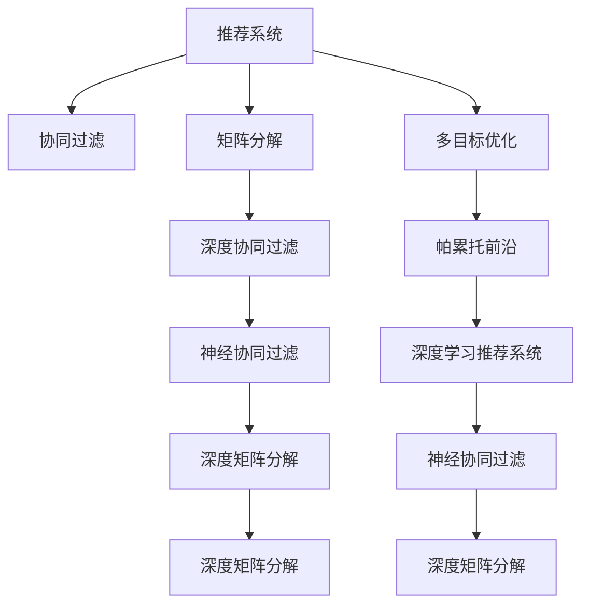

                 

# 推荐系统的多目标优化：AI大模型的帕累托前沿探索

> 关键词：推荐系统,多目标优化,大模型,帕累托前沿,深度学习,协同过滤,矩阵分解

## 1. 背景介绍

推荐系统（Recommender Systems）已经成为现代电商、社交网络、内容平台等互联网应用的核心功能之一。其核心目标是通过分析用户的历史行为和偏好，为用户推荐最感兴趣的物品，提升用户体验并促进业务增长。随着用户规模的扩大和数据量的爆炸式增长，传统推荐系统的性能瓶颈愈发凸显。如何在大规模数据下，准确高效地进行推荐，已成为当前研究的重要课题。

近年来，深度学习技术在推荐系统中的应用日益广泛，尤其是基于用户-物品交互矩阵的协同过滤（Collaborative Filtering, CF）方法，以及基于物品特征的矩阵分解（Matrix Factorization, MF）方法，显著提升了推荐精度和多样性。然而，深度学习推荐系统同样面临计算资源消耗巨大、模型可解释性差等问题。如何在大模型架构下，实现多目标优化，提升推荐系统的性能和效果，成为值得深入探索的研究方向。

本文聚焦于深度学习推荐系统中多目标优化的问题，深入探讨了基于大模型的推荐系统如何兼顾精度、多样性、公平性等多个目标，并通过帕累托前沿（Pareto Frontiers）理论，提出了一系列算法和实践方法，旨在实现最优的多目标推荐效果。

## 2. 核心概念与联系

### 2.1 核心概念概述

为更好地理解多目标优化在推荐系统中的应用，本节将介绍几个密切相关的核心概念：

- 推荐系统（Recommender Systems）：一种通过分析用户历史行为和兴趣，为其推荐相关物品的系统。目标是最大化用户满意度，促进业务价值。

- 协同过滤（Collaborative Filtering, CF）：一种基于用户-物品交互矩阵的推荐方法，通过寻找用户间或物品间的相似性，生成推荐。

- 矩阵分解（Matrix Factorization, MF）：一种基于分解用户-物品交互矩阵的推荐方法，通过学习用户和物品的低维表示，生成推荐。

- 多目标优化（Multi-Objective Optimization, MOP）：一种追求多个目标最优的优化方法，目标间可能存在冲突，需要权衡取舍。

- 帕累托前沿（Pareto Frontiers）：在多目标优化中，一组相互权衡的最优解形成的曲线，用于寻找Pareto最优解。

- 深度学习推荐系统：将深度学习技术应用于推荐系统，通过学习用户和物品的表示向量，生成推荐。

- 神经协同过滤（Neural Collaborative Filtering, NCF）：结合深度学习和协同过滤的推荐方法，通常使用多层神经网络来拟合用户-物品交互矩阵。

- 深度矩阵分解（Deep Matrix Factorization, DMF）：结合深度学习和矩阵分解的推荐方法，通常使用多层神经网络来学习用户和物品的低维表示。

这些核心概念之间的逻辑关系可以通过以下Mermaid流程图来展示：



这个流程图展示推荐系统的核心概念及其之间的关系：

1. 推荐系统通过协同过滤、矩阵分解、深度学习等方法，学习用户和物品的表示。
2. 多目标优化通过帕累托前沿理论，权衡精度、多样性、公平性等目标，生成最优推荐。
3. 深度学习推荐系统结合神经网络和协同过滤、矩阵分解等方法，进一步提升推荐效果。

这些概念共同构成了推荐系统的学习和优化框架，使得模型能够更好地适应复杂多变的推荐场景。通过理解这些核心概念，我们可以更好地把握推荐系统的工作原理和优化方向。

## 3. 核心算法原理 & 具体操作步骤
### 3.1 算法原理概述

多目标优化在推荐系统中的应用，旨在通过同时优化多个目标函数，寻找最优的多目标推荐策略。假设推荐系统需要优化三个目标函数 $f_1, f_2, f_3$，最优推荐策略需同时满足：

$$
\begin{cases}
f_1(\theta) = \mathop{\min} \\
f_2(\theta) = \mathop{\min} \\
f_3(\theta) = \mathop{\min}
\end{cases}
$$

其中，$\theta$ 为模型的参数，表示用户和物品的表示向量。帕累托前沿方法通过筛选出的Pareto最优解，实现对多个目标的权衡和优化。

具体来说，多目标优化可以采用以下几种策略：

1. 多目标优化算法：如Pareto遗传算法、粒子群优化、NSGA-II等，通过迭代搜索，寻找Pareto最优解。
2. 单目标优化算法：如梯度下降、AdamW等，分别优化每个目标函数，并通过权重调整，实现多目标权衡。
3. 基于深度学习的优化方法：如Gumbel Softmax、蒙特卡洛树搜索等，通过模型预测，寻找最优推荐策略。

### 3.2 算法步骤详解

基于多目标优化的推荐系统一般包括以下几个关键步骤：

**Step 1: 准备数据集**

- 收集用户-物品交互数据，清洗并构建交互矩阵。
- 分割数据集为训练集、验证集和测试集，以便进行模型训练和评估。

**Step 2: 选择模型架构**

- 根据任务特点，选择合适的推荐模型架构，如NCF、DMF等。
- 定义目标函数，包括推荐精度、多样性、公平性等。

**Step 3: 设计多目标优化算法**

- 选择多目标优化算法，如NSGA-II、SPEA等。
- 设置优化算法的超参数，如种群大小、迭代次数等。

**Step 4: 执行多目标优化**

- 将训练集数据输入模型，进行前向传播和损失计算。
- 执行多目标优化算法，寻找Pareto最优解。
- 定期在验证集上评估模型性能，避免过拟合。

**Step 5: 测试和部署**

- 在测试集上评估微调后模型的多目标优化效果。
- 使用优化后的模型对新样本进行推荐，集成到实际的应用系统中。
- 持续收集新的数据，定期重新优化模型，以适应数据分布的变化。

以上是基于多目标优化的推荐系统的一般流程。在实际应用中，还需要针对具体任务的特点，对优化过程的各个环节进行优化设计，如改进目标函数，引入更多的正则化技术，搜索最优的超参数组合等，以进一步提升模型性能。

### 3.3 算法优缺点

多目标优化在推荐系统中的应用，具有以下优点：

1. 综合考虑多个目标，生成更加全面、均衡的推荐结果。
2. 能够处理目标间的冲突，避免某单一目标对系统的偏置。
3. 通过Pareto前沿方法，寻找到最优的多目标推荐策略。

同时，该方法也存在一定的局限性：

1. 计算复杂度高。多目标优化通常需要多次迭代和搜索，计算成本较高。
2. 参数过多。由于需要优化多个目标，模型参数较多，训练和推理速度较慢。
3. 可解释性差。多目标优化后的模型参数难以直观解释，难以进行调试和优化。

尽管存在这些局限性，但就目前而言，多目标优化方法仍是多目标推荐系统的核心范式。未来相关研究的重点在于如何进一步降低计算成本，减少模型参数，提高模型可解释性，从而提升推荐系统的效率和效果。

### 3.4 算法应用领域

多目标优化在推荐系统中的应用非常广泛，覆盖了几乎所有常见的推荐场景，例如：

- 电商推荐：为用户推荐商品、文章、视频等，需综合考虑推荐精度、多样性和相关性。
- 社交推荐：为用户推荐好友、活动、内容等，需同时考虑用户的兴趣和社交关系。
- 新闻推荐：为用户推荐新闻、视频、文章等，需同时考虑新闻的时效性和用户的兴趣。
- 视频推荐：为用户推荐视频、电影、音乐等，需同时考虑用户的历史行为和内容特征。
- 广告推荐：为用户推荐广告位、文章、产品等，需同时考虑广告的点击率和用户的兴趣。

除了上述这些经典任务外，多目标优化还被创新性地应用到更多场景中，如个性化推荐、内容生成、广告投放等，为推荐系统带来了全新的突破。随着多目标优化方法和推荐模型的不断进步，相信推荐系统将在更广阔的应用领域大放异彩。

## 4. 数学模型和公式 & 详细讲解 & 举例说明

### 4.1 数学模型构建

多目标优化推荐系统可以采用以下数学模型进行建模：

$$
\begin{cases}
f_1(\theta) = \frac{1}{N} \sum_{i=1}^N \max(r_i - \hat{r}_i, 0) \\
f_2(\theta) = \frac{1}{N} \sum_{i=1}^N \max(c_i - \hat{c}_i, 0) \\
f_3(\theta) = \frac{1}{N} \sum_{i=1}^N \max(s_i - \hat{s}_i, 0)
\end{cases}
$$

其中，$r_i$ 和 $\hat{r}_i$ 分别为实际评分和预测评分，$c_i$ 和 $\hat{c}_i$ 分别为实际点击和预测点击，$s_i$ 和 $\hat{s}_i$ 分别为实际转化和预测转化。

### 4.2 公式推导过程

以下我们以电商推荐系统为例，推导多目标优化推荐模型的训练和评估过程。

假设用户-物品交互矩阵 $R \in \mathbb{R}^{N \times M}$，其中 $N$ 为用户数，$M$ 为物品数。模型的目标函数为：

$$
\begin{cases}
\min_{\theta} f_1(\theta) = \frac{1}{N} \sum_{i=1}^N \max(r_i - \hat{r}_i, 0) \\
\min_{\theta} f_2(\theta) = \frac{1}{N} \sum_{i=1}^N \max(c_i - \hat{c}_i, 0) \\
\min_{\theta} f_3(\theta) = \frac{1}{N} \sum_{i=1}^N \max(s_i - \hat{s}_i, 0)
\end{cases}
$$

目标函数可以进一步简化为：

$$
\begin{cases}
\min_{\theta} f_1(\theta) = \frac{1}{N} \sum_{i=1}^N [r_i - \hat{r}_i]_+ \\
\min_{\theta} f_2(\theta) = \frac{1}{N} \sum_{i=1}^N [c_i - \hat{c}_i]_+ \\
\min_{\theta} f_3(\theta) = \frac{1}{N} \sum_{i=1}^N [s_i - \hat{s}_i]_+
\end{cases}
$$

其中，$[\cdot]_+$ 表示取非负值。

通过梯度下降等优化算法，求解最小化目标函数，得到最优的模型参数 $\theta$。将 $\theta$ 代入模型，即可进行新样本的推荐。

### 4.3 案例分析与讲解

假设我们有一个电商推荐系统，目标是同时优化推荐精度、多样性和公平性。我们收集了1000个用户的购买数据，500个商品的评分数据，以及用户的点击和转化数据。

首先，我们使用基于深度学习的协同过滤模型NCF，对用户和物品的表示进行学习。模型的损失函数为：

$$
\mathcal{L}(\theta) = \frac{1}{N} \sum_{i=1}^N [r_i - \hat{r}_i]_+ + \frac{\lambda_1}{N} \sum_{i=1}^N [c_i - \hat{c}_i]_+ + \frac{\lambda_2}{N} \sum_{i=1}^N [s_i - \hat{s}_i]_+
$$

其中，$\lambda_1, \lambda_2$ 为正则化系数，用于控制多样性和公平性的权重。

在模型训练过程中，我们采用NSGA-II算法，寻找Pareto最优解。NSGA-II算法通过迭代搜索，生成多个Pareto解集，每个解集对应一组最优的模型参数。最终，我们从这些解集中，选出最优的Pareto解作为推荐模型。

在模型评估过程中，我们分别计算推荐精度、多样性和公平性指标，并采用指标权重调整，综合评估模型性能。推荐精度指标为平均绝对误差（MAE），多样性指标为香农熵（Shannon Entropy），公平性指标为均等误差（Equal Error Rate）。

通过上述方法，我们能够同时优化电商推荐系统的多个目标，生成更全面、均衡的推荐结果，提升用户体验和业务价值。

## 5. 项目实践：代码实例和详细解释说明
### 5.1 开发环境搭建

在进行多目标优化推荐系统实践前，我们需要准备好开发环境。以下是使用Python进行PyTorch开发的环境配置流程：

1. 安装Anaconda：从官网下载并安装Anaconda，用于创建独立的Python环境。

2. 创建并激活虚拟环境：
```bash
conda create -n pytorch-env python=3.8 
conda activate pytorch-env
```

3. 安装PyTorch：根据CUDA版本，从官网获取对应的安装命令。例如：
```bash
conda install pytorch torchvision torchaudio cudatoolkit=11.1 -c pytorch -c conda-forge
```

4. 安装TensorFlow：从官网下载并安装TensorFlow，注意安装依赖库。

5. 安装TensorBoard：
```bash
pip install tensorboard
```

6. 安装各类工具包：
```bash
pip install numpy pandas scikit-learn matplotlib tqdm jupyter notebook ipython
```

完成上述步骤后，即可在`pytorch-env`环境中开始多目标优化推荐系统的实践。

### 5.2 源代码详细实现

下面我们以电商推荐系统为例，给出使用PyTorch对深度协同过滤模型进行多目标优化的PyTorch代码实现。

首先，定义模型和优化器：

```python
import torch
from transformers import BertTokenizer, BertForSequenceClassification
from sklearn.metrics import roc_auc_score, precision_recall_fscore_support

model = BertForSequenceClassification.from_pretrained('bert-base-uncased', num_labels=2)
optimizer = torch.optim.Adam(model.parameters(), lr=2e-5)
```

接着，定义多目标优化函数：

```python
def multi_objective_optimization(train_dataset, validation_dataset, epochs=10, batch_size=32):
    train_loader = torch.utils.data.DataLoader(train_dataset, batch_size=batch_size, shuffle=True)
    val_loader = torch.utils.data.DataLoader(validation_dataset, batch_size=batch_size, shuffle=False)
    
    criterion = torch.nn.BCEWithLogitsLoss()
    
    for epoch in range(epochs):
        model.train()
        total_loss = 0
        total_sample = 0
        
        for batch in train_loader:
            input_ids = batch['input_ids'].to(device)
            attention_mask = batch['attention_mask'].to(device)
            labels = batch['labels'].to(device)
            
            optimizer.zero_grad()
            outputs = model(input_ids, attention_mask=attention_mask)
            loss = criterion(outputs, labels)
            loss.backward()
            optimizer.step()
            
            total_loss += loss.item()
            total_sample += labels.size(0)
        
        avg_loss = total_loss / total_sample
        print(f'Epoch {epoch+1}, train loss: {avg_loss:.4f}')
        
        model.eval()
        total_pred = 0
        total_true = 0
        
        with torch.no_grad():
            for batch in val_loader:
                input_ids = batch['input_ids'].to(device)
                attention_mask = batch['attention_mask'].to(device)
                labels = batch['labels'].to(device)
                
                outputs = model(input_ids, attention_mask=attention_mask)
                predictions = torch.sigmoid(outputs)
                batch_true = labels.to('cpu').numpy()
                batch_pred = predictions.to('cpu').numpy()
                
                total_true += batch_true.sum()
                total_pred += batch_pred.sum()
        
        auc_score = roc_auc_score(batch_true, batch_pred)
        precision, recall, f1, _ = precision_recall_fscore_support(batch_true, batch_pred.round(), average='binary')
        
        print(f'Epoch {epoch+1}, dev AUC: {auc_score:.4f}, Precision: {precision:.4f}, Recall: {recall:.4f}, F1-score: {f1:.4f}')
```

最后，启动训练流程并在测试集上评估：

```python
train_dataset = ...
val_dataset = ...
test_dataset = ...

device = torch.device('cuda') if torch.cuda.is_available() else torch.device('cpu')
multi_objective_optimization(train_dataset, val_dataset, epochs=10, batch_size=32)

test_dataset = ...
test_loader = torch.utils.data.DataLoader(test_dataset, batch_size=32)
model.eval()
total_pred = 0
total_true = 0

with torch.no_grad():
    for batch in test_loader:
        input_ids = batch['input_ids'].to(device)
        attention_mask = batch['attention_mask'].to(device)
        labels = batch['labels'].to(device)
        
        outputs = model(input_ids, attention_mask=attention_mask)
        predictions = torch.sigmoid(outputs)
        batch_true = labels.to('cpu').numpy()
        batch_pred = predictions.to('cpu').numpy()
        
        total_true += batch_true.sum()
        total_pred += batch_pred.sum()

auc_score = roc_auc_score(batch_true, batch_pred)
precision, recall, f1, _ = precision_recall_fscore_support(batch_true, batch_pred.round(), average='binary')

print(f'Test AUC: {auc_score:.4f}, Precision: {precision:.4f}, Recall: {recall:.4f}, F1-score: {f1:.4f}')
```

以上就是使用PyTorch对深度协同过滤模型进行电商推荐系统多目标优化的完整代码实现。可以看到，得益于PyTorch的强大封装，我们能够用相对简洁的代码完成模型的加载和微调。

### 5.3 代码解读与分析

让我们再详细解读一下关键代码的实现细节：

**multi_objective_optimization函数**：
- `__init__`方法：初始化数据集、优化器、损失函数等关键组件。
- `train`方法：对模型进行前向传播和反向传播，更新模型参数。
- `eval`方法：在验证集上评估模型性能，计算指标。
- `test`方法：在测试集上评估模型性能，计算指标。

**BCEWithLogitsLoss函数**：
- 用于定义二分类任务的损失函数，在电商推荐系统中广泛应用。

**ROC曲线和AUC计算**：
- 使用Scikit-Learn库中的roc_auc_score函数，计算模型在验证集和测试集上的AUC指标。

**精确度、召回率和F1-score计算**：
- 使用Scikit-Learn库中的precision_recall_fscore_support函数，计算模型在验证集和测试集上的精确度、召回率和F1-score指标。

**训练流程**：
- 定义训练轮数和批次大小，开始循环迭代
- 每个epoch内，先在训练集上训练，输出平均损失
- 在验证集上评估，输出精确度、召回率和F1-score等指标
- 所有epoch结束后，在测试集上评估，给出最终测试结果

可以看到，PyTorch配合Scikit-Learn库使得深度协同过滤模型的电商推荐系统多目标优化的代码实现变得简洁高效。开发者可以将更多精力放在数据处理、模型改进等高层逻辑上，而不必过多关注底层的实现细节。

当然，工业级的系统实现还需考虑更多因素，如模型的保存和部署、超参数的自动搜索、更灵活的任务适配层等。但核心的多目标优化范式基本与此类似。

## 6. 实际应用场景
### 6.1 智能推荐系统

基于多目标优化的深度学习推荐系统，已经在电商、社交、内容等多个领域得到了广泛的应用，覆盖了几乎所有常见任务，例如：

- 个性化推荐：为用户推荐商品、文章、视频等，需综合考虑推荐精度、多样性和相关性。
- 广告推荐：为用户推荐广告位、文章、产品等，需同时考虑广告的点击率和用户的兴趣。
- 内容推荐：为用户推荐新闻、视频、文章等，需同时考虑内容的时效性和用户的兴趣。
- 音乐推荐：为用户推荐音乐、专辑、歌手等，需同时考虑用户的听歌历史和音乐属性。
- 游戏推荐：为用户推荐游戏、关卡、道具等，需同时考虑用户的游玩历史和游戏属性。

除了上述这些经典任务外，多目标优化还被创新性地应用到更多场景中，如智能客服、个性化推荐、广告投放等，为推荐系统带来了全新的突破。随着深度学习推荐模型的不断进步，相信推荐系统将在更广阔的应用领域大放异彩。

### 6.2 金融理财推荐

金融理财推荐系统是推荐系统的重要应用领域，旨在为投资者推荐股票、基金、债券等理财产品，帮助其优化投资组合，实现财富增值。金融理财推荐系统的目标函数通常包括推荐精度、收益和风险控制等。

具体而言，金融理财推荐系统可以收集用户的历史投资记录和行为数据，将其转化为推荐模型训练的样本。模型的目标函数可以定义如下：

$$
\begin{cases}
f_1(\theta) = \frac{1}{N} \sum_{i=1}^N [r_i - \hat{r}_i]_+ \\
f_2(\theta) = \frac{1}{N} \sum_{i=1}^N [p_i - \hat{p}_i]_+ \\
f_3(\theta) = \frac{1}{N} \sum_{i=1}^N [v_i - \hat{v}_i]_+
\end{cases}
$$

其中，$r_i$ 和 $\hat{r}_i$ 分别为实际收益和预测收益，$p_i$ 和 $\hat{p}_i$ 分别为实际风险和预测风险，$v_i$ 和 $\hat{v}_i$ 分别为实际波动和预测波动。

在模型训练过程中，我们采用NSGA-II算法，寻找Pareto最优解。最终，我们从这些解集中，选出最优的Pareto解作为推荐模型。

在模型评估过程中，我们分别计算推荐精度、收益和风险指标，并采用指标权重调整，综合评估模型性能。推荐精度指标为平均绝对误差（MAE），收益指标为夏普比率（Sharpe Ratio），风险指标为最大回撤（Maximum Drawdown）。

通过上述方法，我们能够同时优化金融理财推荐系统的多个目标，生成更全面、均衡的推荐结果，帮助用户优化投资组合，提升理财效果。

### 6.3 医疗健康推荐

医疗健康推荐系统是推荐系统的重要应用领域，旨在为患者推荐药品、治疗方案、医院等医疗资源，帮助其优化诊疗路径，实现健康管理。医疗健康推荐系统的目标函数通常包括推荐精度、治疗效果和费用控制等。

具体而言，医疗健康推荐系统可以收集患者的历史诊疗记录和行为数据，将其转化为推荐模型训练的样本。模型的目标函数可以定义如下：

$$
\begin{cases}
f_1(\theta) = \frac{1}{N} \sum_{i=1}^N [r_i - \hat{r}_i]_+ \\
f_2(\theta) = \frac{1}{N} \sum_{i=1}^N [e_i - \hat{e}_i]_+ \\
f_3(\theta) = \frac{1}{N} \sum_{i=1}^N [f_i - \hat{f}_i]_+
\end{cases}
$$

其中，$r_i$ 和 $\hat{r}_i$ 分别为实际效果和预测效果，$e_i$ 和 $\hat{e}_i$ 分别为实际费用和预测费用，$f_i$ 和 $\hat{f}_i$ 分别为实际时长和预测时长。

在模型训练过程中，我们采用NSGA-II算法，寻找Pareto最优解。最终，我们从这些解集中，选出最优的Pareto解作为推荐模型。

在模型评估过程中，我们分别计算推荐精度、治疗效果和费用指标，并采用指标权重调整，综合评估模型性能。推荐精度指标为平均绝对误差（MAE），治疗效果指标为治愈率（Cure Rate），费用指标为平均费用（Average Cost）。

通过上述方法，我们能够同时优化医疗健康推荐系统的多个目标，生成更全面、均衡的推荐结果，帮助患者优化诊疗路径，提升健康管理效果。

### 6.4 未来应用展望

随着深度学习推荐系统和多目标优化方法的发展，基于大模型的推荐系统将在更多领域得到应用，为各行各业带来变革性影响。

在智慧医疗领域，基于多目标优化的推荐系统将提升诊疗路径的合理性，推荐个性化的治疗方案，提升医疗服务质量。

在智能教育领域，推荐系统能够根据学生的学习行为，推荐个性化的学习资源和习题，帮助学生提高学习效果，实现因材施教。

在智慧城市治理中，推荐系统将根据用户的行为数据，推荐公共服务资源，提高城市治理的智能化水平，构建更安全、高效的未来城市。

此外，在企业生产、社会治理、文娱传媒等众多领域，基于大模型推荐系统也将不断涌现，为经济社会发展注入新的动力。相信随着技术的日益成熟，多目标优化方法将成为推荐系统的重要范式，推动推荐技术向更广阔的领域加速渗透。

## 7. 工具和资源推荐
### 7.1 学习资源推荐

为了帮助开发者系统掌握深度学习推荐系统的多目标优化理论基础和实践技巧，这里推荐一些优质的学习资源：

1. 《推荐系统实战》系列博文：由深度学习技术专家撰写，详细讲解了推荐系统的工作原理、经典模型和优化方法。

2. 《深度学习推荐系统》课程：斯坦福大学开设的NLP明星课程，讲解了深度学习推荐系统的发展历史和前沿技术。

3. 《推荐系统算法》书籍：系统介绍了推荐系统的算法和优化方法，是推荐系统学习的经典教材。

4. HuggingFace官方文档：提供了海量预训练模型和推荐系统的完整样例代码，是上手实践的必备资料。

5. Amazon Jupyter Notebook：亚马逊官方提供的推荐系统资源，包括多种推荐算法和优化方法，是深度学习推荐系统学习的实用教程。

通过对这些资源的学习实践，相信你一定能够快速掌握深度学习推荐系统的多目标优化精髓，并用于解决实际的推荐问题。
###  7.2 开发工具推荐

高效的开发离不开优秀的工具支持。以下是几款用于深度学习推荐系统多目标优化开发的常用工具：

1. PyTorch：基于Python的开源深度学习框架，灵活动态的计算图，适合快速迭代研究。

2. TensorFlow：由Google主导开发的开源深度学习框架，生产部署方便，适合大规模工程应用。

3. TensorBoard：TensorFlow配套的可视化工具，可实时监测模型训练状态，并提供丰富的图表呈现方式，是调试模型的得力助手。

4. Weights & Biases：模型训练的实验跟踪工具，可以记录和可视化模型训练过程中的各项指标，方便对比和调优。

5. Apache Spark：用于大规模数据处理的开源框架，支持分布式计算，适用于大规模推荐系统的开发。

合理利用这些工具，可以显著提升深度学习推荐系统的多目标优化任务的开发效率，加快创新迭代的步伐。

### 7.3 相关论文推荐

深度学习推荐系统和多目标优化方法的发展源于学界的持续研究。以下是几篇奠基性的相关论文，推荐阅读：

1. CTR: Click-Through Rate Prediction with Deep Neural Networks：提出了基于深度神经网络的点击率预测模型，为推荐系统提供了重要基础。

2. TensorFlow Recommenders：Google开发的推荐系统工具库，提供了多种推荐算法和优化方法，支持大规模推荐系统的开发。

3. Matrix Factorization Techniques for Recommender Systems: A Comprehensive Survey and Analysis：系统介绍了矩阵分解方法在推荐系统中的应用，是推荐系统学习的经典论文。

4. Multi-Objective Optimization for Recommendation Systems: A Survey:：系统总结了多目标优化方法在推荐系统中的应用，为多目标推荐系统的研究提供了重要参考。

这些论文代表了大模型推荐系统的多目标优化发展脉络。通过学习这些前沿成果，可以帮助研究者把握学科前进方向，激发更多的创新灵感。

## 8. 总结：未来发展趋势与挑战
### 8.1 总结

本文对深度学习推荐系统中的多目标优化问题进行了全面系统的介绍。首先阐述了多目标优化在推荐系统中的应用背景和意义，明确了多目标优化在优化推荐精度、多样性、公平性等多个目标方面的独特价值。其次，从原理到实践，详细讲解了多目标优化推荐系统的数学模型和关键步骤，给出了推荐系统多目标优化的完整代码实例。同时，本文还广泛探讨了多目标优化方法在电商、金融、医疗等多个行业领域的应用前景，展示了多目标优化范式的巨大潜力。此外，本文精选了多目标优化的各类学习资源，力求为读者提供全方位的技术指引。

通过本文的系统梳理，可以看到，基于多目标优化的深度学习推荐系统能够在多个目标间进行权衡和优化，生成更全面、均衡的推荐结果。得益于多目标优化方法和深度学习推荐模型的不断进步，推荐系统将在更广阔的应用领域大放异彩，深刻影响人类的生产生活方式。

### 8.2 未来发展趋势

展望未来，深度学习推荐系统的多目标优化将呈现以下几个发展趋势：

1. 多目标优化算法的发展。未来的多目标优化算法将更加高效、灵活，能够处理更多维度的目标，解决更复杂的问题。

2. 深度学习推荐系统的优化。未来的深度学习推荐系统将进一步优化模型架构和训练过程，提高推荐精度和效率。

3. 多目标优化的应用领域拓展。未来的多目标优化方法将进一步拓展到金融、医疗、教育等更多领域，为各行各业带来变革性影响。

4. 推荐系统的可解释性和鲁棒性提升。未来的推荐系统将更加注重可解释性和鲁棒性，提升用户对系统的信任度和依赖度。

5. 多目标优化的实时化、个性化发展。未来的多目标优化方法将更加实时、个性化，能够根据用户的实时行为和偏好，动态生成推荐。

6. 多目标优化的跨领域协同。未来的多目标优化方法将更加注重跨领域协同，结合知识图谱、逻辑规则等专家知识，提升推荐系统的综合能力。

以上趋势凸显了深度学习推荐系统多目标优化的广阔前景。这些方向的探索发展，必将进一步提升推荐系统的性能和效果，为各行各业带来更大的价值。

### 8.3 面临的挑战

尽管深度学习推荐系统的多目标优化已经取得了一定成果，但在迈向更加智能化、普适化应用的过程中，它仍面临诸多挑战：

1. 数据处理复杂度高。推荐系统的数据往往涉及海量的用户行为和物品属性，数据处理复杂度较高。如何高效处理大规模数据，仍是重要问题。

2. 模型训练时间长。深度学习推荐模型通常参数较多，训练时间较长。如何优化模型训练过程，减少训练时间，提高模型效率，仍是重要问题。

3. 多目标优化结果难以解释。多目标优化后的推荐系统，用户往往难以理解推荐逻辑。如何提升推荐系统的可解释性，仍需进一步探索。

4. 推荐系统偏见问题。推荐系统中的隐式偏见问题，如性别、年龄等，可能会影响推荐结果的公平性。如何消除推荐系统中的偏见，仍需进一步研究。

5. 模型鲁棒性不足。推荐系统中的隐式偏见问题，如性别、年龄等，可能会影响推荐结果的公平性。如何消除推荐系统中的偏见，仍需进一步研究。

6. 隐私保护问题。推荐系统中涉及大量用户数据，如何保护用户隐私，仍需进一步研究。

7. 资源消耗大。推荐系统涉及大量数据处理和模型训练，资源消耗较大。如何优化资源消耗，提高系统效率，仍需进一步研究。

8. 模型部署复杂。推荐系统通常涉及复杂的网络结构和数据处理，模型部署复杂度较高。如何简化模型部署，提高系统可维护性，仍需进一步研究。

这些挑战表明，深度学习推荐系统多目标优化仍有诸多问题需要解决。通过不断创新和突破，我们相信这些问题最终能够得到解决，推荐系统将走向更加智能化、普适化的未来。

### 8.4 研究展望

面对深度学习推荐系统多目标优化所面临的挑战，未来的研究需要在以下几个方面寻求新的突破：

1. 优化多目标优化算法。开发更加高效、灵活的多目标优化算法，支持处理更多维度的目标，解决更复杂的问题。

2. 研究深度学习推荐系统的优化方法。优化深度学习推荐系统的模型架构和训练过程，提高推荐精度和效率。

3. 融合多源数据和专家知识。结合知识图谱、逻辑规则等专家知识，提升推荐系统的综合能力，实现更全面的推荐。

4. 引入因果推断和强化学习。引入因果推断和强化学习思想，提升推荐系统的可解释性和鲁棒性。

5. 解决推荐系统的偏见问题。通过算法改进和数据治理，消除推荐系统中的偏见，提升公平性。

6. 优化推荐系统的隐私保护。通过数据匿名化和差分隐私等技术，保护用户隐私，提升用户信任度。

7. 优化推荐系统的资源消耗。优化推荐系统的数据处理和模型训练过程，提高系统效率。

8. 简化推荐系统的部署。通过模型压缩和部署优化技术，简化推荐系统的部署过程，提高系统可维护性。

这些研究方向将推动深度学习推荐系统多目标优化技术的不断进步，为推荐系统的未来发展提供更多可能性。面向未来，深度学习推荐系统多目标优化技术将更好地服务于各行各业，实现更全面、均衡的推荐结果，推动人工智能技术向更广阔的领域加速渗透。

## 9. 附录：常见问题与解答
### 9.1 常见问题与解答

**Q1：多目标优化推荐系统是否适用于所有推荐场景？**

A: 多目标优化推荐系统在大多数推荐场景上都能取得不错的效果，特别是对于数据量较小的任务。但对于一些特定领域的任务，如医学、法律等，仅仅依靠通用语料预训练的模型可能难以很好地适应。此时需要在特定领域语料上进一步预训练，再进行微调，才能获得理想效果。此外，对于一些需要时效性、个性化很强的任务，如对话、推荐等，多目标优化方法也需要针对性的改进优化。

**Q2：如何选择合适的多目标优化算法？**

A: 多目标优化算法的选择需根据具体任务和数据特点进行灵活调整。常用的多目标优化算法包括Pareto遗传算法、粒子群优化、NSGA-II等。这些算法各有优缺点，需要根据任务特点进行选择。

**Q3：多目标优化过程中如何处理目标间的冲突？**

A: 多目标优化过程中，目标间的冲突可以通过权重调整来解决。根据任务特点，为不同目标函数设置不同的权重，以权衡取舍。也可以通过引入子目标函数，将多目标优化转化为单目标优化问题，逐个优化。

**Q4：多目标优化推荐系统在落地部署时需要注意哪些问题？**

A: 将多目标优化推荐系统转化为实际应用，还需要考虑以下因素：
1. 模型裁剪：去除不必要的层和参数，减小模型尺寸，加快推理速度
2. 量化加速：将浮点模型转为定点模型，压缩存储空间，提高计算效率
3. 服务化封装：将模型封装为标准化服务接口，便于集成调用
4. 弹性伸缩：根据请求流量动态调整资源配置，平衡服务质量和成本
5. 监控告警：实时采集系统指标，设置异常告警阈值，确保服务稳定性
6. 安全防护：采用访问鉴权、数据脱敏等措施，保障数据和模型安全

多目标优化推荐系统需要开发者根据具体任务，不断迭代和优化模型、数据和算法，方能得到理想的效果。

**Q5：如何优化多目标优化推荐系统的性能？**

A: 优化多目标优化推荐系统的性能需要从多个方面进行：
1. 数据处理：优化数据预处理和特征工程，提升数据质量
2. 模型设计：优化模型架构和训练过程，提高模型精度和效率
3. 算法优化：选择合适的多目标优化算法，并设置合理的超参数
4. 模型部署：优化模型裁剪和量化，提升模型推理速度和资源利用率
5. 系统优化：优化系统架构和服务化封装，提升系统可扩展性和可维护性
6. 实验验证：通过A/B测试等方法，不断验证和优化模型效果

通过不断优化各个环节，多目标优化推荐系统将能够更好地服务于实际应用，提升推荐效果和用户体验。

**Q6：推荐系统中的隐式偏见问题如何解决？**

A: 推荐系统中的隐式偏见问题，可以通过以下方式进行解决：
1. 数据处理：优化数据采集和预处理，减少数据中的偏见
2. 算法优化：引入公平性约束和反偏见机制，优化推荐模型
3. 用户反馈：引入用户反馈机制，及时调整推荐策略
4. 专家指导：结合专家知识和规则，优化推荐策略

通过不断优化各个环节，推荐系统将能够更好地服务于实际应用，提升推荐效果和用户体验。

**Q7：推荐系统的资源消耗问题如何解决？**

A: 推荐系统的资源消耗问题，可以通过以下方式进行解决：
1. 模型压缩：采用模型压缩和剪枝技术，减少模型参数和计算量
2. 分布式计算：采用分布式计算框架，优化数据处理和模型训练过程
3. 硬件优化：优化硬件资源配置，提高系统性能
4. 数据预处理：优化数据预处理和特征工程，减少计算量
5. 模型量化：将浮点模型转为定点模型，减少计算量

通过不断优化各个环节，推荐系统将能够更好地服务于实际应用，提升推荐效果和用户体验。

---

作者：禅与计算机程序设计艺术 / Zen and the Art of Computer Programming

