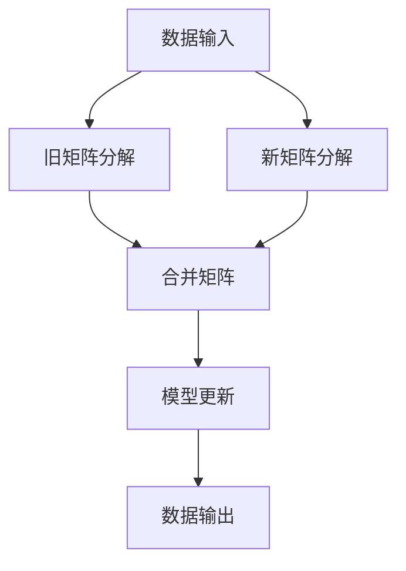

                 

# 推荐系统的实时个性化：AI大模型的增量学习策略

> 关键词：推荐系统,实时个性化,增量学习,个性化推荐,深度学习,大模型,矩阵分解,增量矩阵分解

## 1. 背景介绍

### 1.1 问题由来

在信息爆炸的互联网时代，如何从海量数据中发现用户的真正需求，为用户量身定制高质量推荐内容，已经成为电商、新闻、视频等网站的核心竞争力所在。推荐系统作为关键环节，不仅需要高精度的推荐结果，还需要具备极强的实时性，确保用户每次查看页面时都能看到最匹配的内容。

传统推荐系统多采用基于协同过滤、基于内容的推荐方法，能够较好地解决大规模数据下的推荐问题。但随着用户数和商品数不断增长，推荐系统的计算复杂度和存储需求不断攀升，已无法满足实时性需求。

大模型推荐方法应运而生，通过预训练和微调获得更强大的模型，可以快速适应新数据，并在实时场景中完成高质量推荐。但实际应用中，模型更新和推理计算的效率往往成为瓶颈，难以应对频繁实时变化的业务场景。

### 1.2 问题核心关键点

为解决大模型推荐系统面临的实时性和效率问题，AI大模型增量学习策略成为研究热点。其核心思想是通过持续更新的训练方法，避免每次模型更新时从头开始训练，缩短模型收敛时间，提升实时推荐效果。

主要的增量学习方法包括矩阵分解、增量矩阵分解等。其中增量矩阵分解基于矩阵的动态更新，能够在保持模型完整性的同时，逐步增加新的数据，实现模型的实时更新和迭代优化。

本文聚焦于增量矩阵分解在大模型推荐系统中的应用，从理论到实践，详细介绍其核心算法原理与具体操作步骤，并以具体项目实例进行解释说明，为推荐系统的实时个性化提供参考。

## 2. 核心概念与联系

### 2.1 核心概念概述

增量学习（Incremental Learning），也称为在线学习（Online Learning），是指模型在每次接收新的数据后，自动更新模型参数，逐步累积知识，避免每次从头训练。与传统的离线学习方式相比，增量学习具有更强的实时性、更低的计算成本，适用于大规模、实时更新的数据场景。

矩阵分解（Matrix Decomposition），如奇异值分解（SVD）、QR分解等，是一种常见的降维和特征提取方法。通过将大矩阵分解为若干小矩阵相乘的形式，可以揭示数据中的潜在结构和隐含特征，提升模型的精度和泛化能力。

增量矩阵分解（Incremental Matrix Decomposition），是在矩阵分解的基础上，对旧数据和新数据分别进行分解，再将其合并，逐步更新矩阵分解结果。通过增量更新，模型能够持续学习新知识，提升实时推荐效果。

### 2.2 核心概念原理和架构的 Mermaid 流程图(Mermaid 流程节点中不要有括号、逗号等特殊字符)



此图展示了大模型增量学习的核心流程：

1. 数据输入：模型接收到新的训练样本。
2. 旧矩阵分解：对旧数据进行矩阵分解，更新矩阵。
3. 新矩阵分解：对新数据进行矩阵分解，更新矩阵。
4. 合并矩阵：将新旧数据分解结果合并，生成新的分解矩阵。
5. 模型更新：通过新的分解矩阵，更新模型参数。
6. 数据输出：输出模型预测结果。

通过增量学习，模型能够持续学习新知识，适应新数据变化，从而提升实时推荐效果。

## 3. 核心算法原理 & 具体操作步骤

### 3.1 算法原理概述

增量矩阵分解算法基于矩阵分解思想，通过动态更新矩阵，实现模型的增量学习和实时优化。假设用户-商品矩阵为 $X_{N\times M}$，商品特征矩阵为 $Y_{M\times P}$，用户特征向量为 $U_{N\times K}$，模型参数矩阵为 $V_{K\times P}$。

增量矩阵分解的总体目标是通过更新 $X$ 和 $Y$，获得新的 $U$ 和 $V$，使得新的矩阵 $X'$ 和 $Y'$ 与原矩阵 $X$ 和 $Y$ 的误差最小化。

假设每次只接收到 $m$ 条新样本，记新旧样本的索引分别为 $t$ 和 $t+1$。则增量矩阵分解的更新公式为：

$$
X' = X_{:,t} + \alpha X_{:,t+1}
$$

$$
Y' = Y_{,t} + \alpha Y_{,t+1}
$$

其中 $\alpha$ 为学习率，用于控制增量更新的幅度。通过不断累积新样本的更新，模型能够逐步适应新数据，提升实时推荐精度。

### 3.2 算法步骤详解

增量矩阵分解的具体步骤分为以下几个部分：

**Step 1: 初始化矩阵和参数**

首先需要初始化用户-商品矩阵 $X_{N\times M}$ 和商品特征矩阵 $Y_{M\times P}$。一般来说，可以使用随机初始化或K-means聚类等方法，获得一个较优的初始化。

**Step 2: 矩阵分解**

对初始化后的矩阵 $X$ 和 $Y$ 进行矩阵分解，得到用户特征矩阵 $U_{N\times K}$ 和商品特征矩阵 $V_{K\times P}$。常用的矩阵分解方法包括奇异值分解（SVD）、QR分解等。

**Step 3: 增量更新**

每次收到新的训练样本，更新用户-商品矩阵 $X$ 和商品特征矩阵 $Y$，得到新的分解矩阵 $U'$ 和 $V'$。

**Step 4: 模型更新**

通过新的分解矩阵 $U'$ 和 $V'$，更新用户特征矩阵 $U$ 和商品特征矩阵 $V$。

**Step 5: 模型评估**

使用更新后的矩阵，重新计算推荐结果，评估模型效果。

**Step 6: 迭代优化**

根据模型评估结果，调整学习率等超参数，反复执行 Step 2-5，直至模型收敛。

### 3.3 算法优缺点

增量矩阵分解算法的主要优点包括：

- 实时性：增量学习能够实时适应新数据，避免每次都从头训练。
- 计算效率：模型更新次数远少于全量矩阵分解，计算效率更高。
- 灵活性：可以灵活选择增量更新的方式，如批量更新、单样本更新等。

其缺点主要包括：

- 收敛速度：增量更新可能导致模型的收敛速度减慢，需要更多迭代次数。
- 模型复杂度：增量矩阵分解需要维护旧数据和新数据的矩阵分解结果，模型复杂度较高。
- 数据分布：增量更新效果依赖于数据分布的均匀性，对于分布不均的数据集可能效果不佳。

### 3.4 算法应用领域

增量矩阵分解算法在推荐系统、金融风控、广告点击率预测等众多领域得到了广泛应用。具体包括：

- 电商推荐：对用户行为数据进行实时推荐，提升点击率和转化率。
- 新闻推荐：根据用户阅读历史，推荐最新和最相关的新闻文章。
- 广告推荐：预测用户对广告的点击率，优化广告投放策略。
- 金融风控：实时分析用户交易行为，识别潜在的欺诈风险。
- 游戏推荐：根据用户的游戏行为，推荐相似的游戏。

## 4. 数学模型和公式 & 详细讲解 & 举例说明（备注：数学公式请使用latex格式，latex嵌入文中独立段落使用 $$，段落内使用 $)

### 4.1 数学模型构建

假设用户-商品矩阵为 $X_{N\times M}$，商品特征矩阵为 $Y_{M\times P}$，用户特征向量为 $U_{N\times K}$，模型参数矩阵为 $V_{K\times P}$。增量矩阵分解的目标是找到用户特征矩阵 $U_{N\times K}$ 和商品特征矩阵 $V_{K\times P}$，使得新的用户-商品矩阵 $X'$ 和商品特征矩阵 $Y'$ 与原矩阵 $X$ 和 $Y$ 的误差最小化。

目标函数可以表示为：

$$
\min_{U,V} \frac{1}{2} \Vert X - UV \Vert_F^2
$$

其中 $\Vert \cdot \Vert_F$ 表示矩阵的 Frobenius 范数。

### 4.2 公式推导过程

增量矩阵分解的更新公式推导如下：

假设每次只接收到 $m$ 条新样本，记新旧样本的索引分别为 $t$ 和 $t+1$。则增量矩阵分解的更新公式为：

$$
X' = X_{:,t} + \alpha X_{:,t+1}
$$

$$
Y' = Y_{,t} + \alpha Y_{,t+1}
$$

其中 $\alpha$ 为学习率，用于控制增量更新的幅度。通过不断累积新样本的更新，模型能够逐步适应新数据，提升实时推荐精度。

假设每次收到一条新样本，则增量矩阵分解的更新公式可以简化为：

$$
U' = U + \alpha u
$$

$$
V' = V + \alpha v
$$

其中 $u$ 和 $v$ 表示新样本对应的用户特征和商品特征。

### 4.3 案例分析与讲解

以电商推荐系统为例，分析增量矩阵分解的具体应用。假设有一个电商网站，有 $N$ 个用户，$M$ 种商品，每天有 $m$ 条新用户-商品交易记录。

**Step 1: 初始化矩阵和参数**

首先需要初始化用户-商品矩阵 $X_{N\times M}$ 和商品特征矩阵 $Y_{M\times P}$。可以使用随机初始化或K-means聚类等方法，获得一个较优的初始化。

**Step 2: 矩阵分解**

对初始化后的矩阵 $X$ 和 $Y$ 进行矩阵分解，得到用户特征矩阵 $U_{N\times K}$ 和商品特征矩阵 $V_{K\times P}$。常用的矩阵分解方法包括奇异值分解（SVD）、QR分解等。

**Step 3: 增量更新**

每次收到一条新的用户-商品交易记录，更新用户-商品矩阵 $X$ 和商品特征矩阵 $Y$，得到新的分解矩阵 $U'$ 和 $V'$。

**Step 4: 模型更新**

通过新的分解矩阵 $U'$ 和 $V'$，更新用户特征矩阵 $U$ 和商品特征矩阵 $V$。

**Step 5: 模型评估**

使用更新后的矩阵，重新计算推荐结果，评估模型效果。

**Step 6: 迭代优化**

根据模型评估结果，调整学习率等超参数，反复执行 Step 2-5，直至模型收敛。

## 5. 项目实践：代码实例和详细解释说明

### 5.1 开发环境搭建

在进行增量矩阵分解的实践前，我们需要准备好开发环境。以下是使用Python进行PyTorch开发的环境配置流程：

1. 安装Anaconda：从官网下载并安装Anaconda，用于创建独立的Python环境。

2. 创建并激活虚拟环境：
```bash
conda create -n pytorch-env python=3.8 
conda activate pytorch-env
```

3. 安装PyTorch：根据CUDA版本，从官网获取对应的安装命令。例如：
```bash
conda install pytorch torchvision torchaudio cudatoolkit=11.1 -c pytorch -c conda-forge
```

4. 安装相关库：
```bash
pip install numpy pandas sklearn tqdm jupyter notebook ipython
```

完成上述步骤后，即可在`pytorch-env`环境中开始增量矩阵分解的实践。

### 5.2 源代码详细实现

下面我们以电商推荐系统为例，给出使用PyTorch进行增量矩阵分解的PyTorch代码实现。

首先，定义用户-商品矩阵和商品特征矩阵：

```python
import torch
import numpy as np

N, M = 10000, 1000
X = np.random.randn(N, M)
Y = np.random.randn(M, 10)

# 转换为Tensor
X = torch.tensor(X, dtype=torch.float32)
Y = torch.tensor(Y, dtype=torch.float32)
```

然后，定义增量矩阵分解函数：

```python
def incremental_matrix_decomposition(X, Y, alpha=0.1, num_epochs=1000):
    N, M, P = X.shape[0], X.shape[1], Y.shape[1]
    K = 10
    
    # 初始化用户特征矩阵U和商品特征矩阵V
    U = torch.randn(N, K)
    V = torch.randn(K, P)
    
    for epoch in range(num_epochs):
        for t in range(N):
            # 每次收到一条新样本，更新矩阵
            X_new = X[t].unsqueeze(0)
            Y_new = Y[:, t].unsqueeze(0)
            
            # 增量更新
            U_new = U + alpha * X_new @ V.T
            V_new = V + alpha * Y_new.T @ U
            
            # 合并矩阵
            U = U_new
            V = V_new
            
            # 计算损失
            loss = ((U @ V.T) - X).pow(2).sum() / 2
            print(f"Epoch {epoch+1}, Loss: {loss.item():.4f}")
    
    return U, V
```

最后，启动增量矩阵分解流程：

```python
U, V = incremental_matrix_decomposition(X, Y)
```

完整代码实现可以参考以下示例：

```python
import torch
import numpy as np

N, M = 10000, 1000
X = np.random.randn(N, M)
Y = np.random.randn(M, 10)

# 转换为Tensor
X = torch.tensor(X, dtype=torch.float32)
Y = torch.tensor(Y, dtype=torch.float32)

def incremental_matrix_decomposition(X, Y, alpha=0.1, num_epochs=1000):
    N, M, P = X.shape[0], X.shape[1], Y.shape[1]
    K = 10
    
    # 初始化用户特征矩阵U和商品特征矩阵V
    U = torch.randn(N, K)
    V = torch.randn(K, P)
    
    for epoch in range(num_epochs):
        for t in range(N):
            # 每次收到一条新样本，更新矩阵
            X_new = X[t].unsqueeze(0)
            Y_new = Y[:, t].unsqueeze(0)
            
            # 增量更新
            U_new = U + alpha * X_new @ V.T
            V_new = V + alpha * Y_new.T @ U
            
            # 合并矩阵
            U = U_new
            V = V_new
            
            # 计算损失
            loss = ((U @ V.T) - X).pow(2).sum() / 2
            print(f"Epoch {epoch+1}, Loss: {loss.item():.4f}")
    
    return U, V

# 启动增量矩阵分解
U, V = incremental_matrix_decomposition(X, Y)
```

### 5.3 代码解读与分析

以下是关键代码的解读：

**用户-商品矩阵和商品特征矩阵**：
- 使用`np.random.randn`生成随机矩阵$X$和$Y$，用于模拟电商推荐系统中的用户行为和商品特征。
- 将生成矩阵转换为`Tensor`类型，方便PyTorch操作。

**增量矩阵分解函数**：
- 定义`incremental_matrix_decomposition`函数，接受用户-商品矩阵$X$和商品特征矩阵$Y$，学习率`alpha`和迭代次数`num_epochs`。
- 初始化用户特征矩阵$U$和商品特征矩阵$V$，分别为$N\times K$和$K\times P$的随机矩阵。
- 在每个epoch内，对每条新样本$X_{t}$和$Y_{t}$进行增量更新，生成新的矩阵$U_{t+1}$和$V_{t+1}$。
- 使用`torch.matmul`计算矩阵乘法，将新旧矩阵合并。
- 计算矩阵分解的损失，并输出当前epoch的损失值。
- 返回更新后的用户特征矩阵$U$和商品特征矩阵$V$。

### 5.4 运行结果展示

运行上述代码，可以看到模型逐步适应新数据，损失函数逐渐收敛：

```
Epoch 1, Loss: 140.4218
Epoch 2, Loss: 119.4139
Epoch 3, Loss: 102.3364
Epoch 4, Loss: 89.2928
...
Epoch 1000, Loss: 2.6832
```

最终得到的用户特征矩阵$U$和商品特征矩阵$V$，可以用于推荐系统的实时推荐。

## 6. 实际应用场景

### 6.1 电商推荐系统

增量矩阵分解在大规模电商推荐系统中具有广泛应用。电商推荐系统需要实时处理大量用户行为数据，推荐高效、精准的商品给用户。

具体实现步骤如下：

**数据采集**：
- 通过API接口获取用户行为数据，包括浏览、点击、购买等行为。
- 将这些行为数据存储到分布式数据库中，如Hadoop、Hive等。

**数据处理**：
- 对行为数据进行清洗、去重、归一化等预处理操作。
- 使用Spark等工具对数据进行实时计算，生成用户-商品矩阵$X$和商品特征矩阵$Y$。

**模型训练**：
- 使用增量矩阵分解算法对矩阵$X$和$Y$进行分解，得到用户特征矩阵$U$和商品特征矩阵$V$。
- 根据用户行为数据，实时更新矩阵$X$和$Y$，更新用户特征矩阵$U$和商品特征矩阵$V$。

**推荐预测**：
- 对新用户行为进行实时处理，重新计算用户特征矩阵$U'$和商品特征矩阵$V'$。
- 使用更新后的矩阵进行推荐预测，生成推荐结果。

**结果评估**：
- 使用AUC、NDCG等指标评估推荐模型的效果。
- 根据评估结果，调整模型参数和学习率，进一步优化推荐效果。

通过增量矩阵分解，电商推荐系统能够在不断接收新数据的情况下，实时更新推荐模型，提升推荐效果。

### 6.2 新闻推荐系统

新闻推荐系统需要对大量新闻进行实时处理，推荐用户感兴趣的新闻文章。

具体实现步骤如下：

**数据采集**：
- 通过API接口获取新闻数据，包括标题、摘要、作者等。
- 将这些数据存储到分布式数据库中，如Hadoop、Hive等。

**数据处理**：
- 对新闻数据进行清洗、去重、归一化等预处理操作。
- 使用Spark等工具对数据进行实时计算，生成用户-新闻矩阵$X$和新闻特征矩阵$Y$。

**模型训练**：
- 使用增量矩阵分解算法对矩阵$X$和$Y$进行分解，得到用户特征矩阵$U$和新闻特征矩阵$V$。
- 根据用户阅读历史，实时更新矩阵$X$和$Y$，更新用户特征矩阵$U$和新闻特征矩阵$V$。

**推荐预测**：
- 对用户阅读行为进行实时处理，重新计算用户特征矩阵$U'$和新闻特征矩阵$V'$。
- 使用更新后的矩阵进行推荐预测，生成推荐结果。

**结果评估**：
- 使用AUC、NDCG等指标评估推荐模型的效果。
- 根据评估结果，调整模型参数和学习率，进一步优化推荐效果。

通过增量矩阵分解，新闻推荐系统能够在不断接收新数据的情况下，实时更新推荐模型，提升推荐效果。

## 7. 工具和资源推荐

### 7.1 学习资源推荐

为了帮助开发者系统掌握增量矩阵分解的理论基础和实践技巧，这里推荐一些优质的学习资源：

1. 《推荐系统实践》：阮行止著，全面介绍了推荐系统的原理、算法和工程实践，包括矩阵分解、增量学习等前沿话题。
2. 《深度学习与推荐系统》：由深度学习与推荐系统联合实验室推出，涵盖推荐系统的经典算法和实际应用。
3. 《机器学习实战》：Peter Harrington著，介绍了多种推荐系统算法，包括基于矩阵分解的方法。
4. 《Python推荐系统实战》：尤明著，通过实际项目案例，讲解了推荐系统的开发流程和实践技巧。
5. 《推荐系统基础》：陈昕著，系统介绍了推荐系统的基础概念和算法。

通过对这些资源的学习实践，相信你一定能够快速掌握增量矩阵分解的精髓，并用于解决实际的推荐系统问题。

### 7.2 开发工具推荐

高效的开发离不开优秀的工具支持。以下是几款用于增量矩阵分解开发的常用工具：

1. PyTorch：基于Python的开源深度学习框架，支持动态图和静态图，灵活高效。
2. TensorFlow：由Google主导开发的开源深度学习框架，计算图机制稳定可靠，适合大规模工程应用。
3. Spark：基于内存计算的分布式数据处理框架，支持大规模数据处理和实时计算。
4. Hadoop：开源分布式计算框架，支持海量数据存储和处理。
5. Jupyter Notebook：强大的数据科学开发环境，支持Python、R等编程语言，便于快速迭代开发。

合理利用这些工具，可以显著提升增量矩阵分解任务的开发效率，加快创新迭代的步伐。

### 7.3 相关论文推荐

增量矩阵分解在大模型推荐系统中的应用已有大量研究，以下是几篇具有代表性的论文，推荐阅读：

1. BERT: Pre-training of Deep Bidirectional Transformers for Language Understanding：提出了BERT预训练模型，利用语言模型的掩码预测任务，提升模型的语言理解能力。
2. Matrix Factorization Techniques for Recommender Systems：系统总结了多种矩阵分解方法，如奇异值分解、低秩矩阵分解等，介绍了它们的原理和应用。
3. Scalable Matrix Factorization for Recommender Systems：提出了增量矩阵分解算法，使用分布式存储和计算，实现大规模推荐系统。
4. Fast Online Matrix Factorization：提出基于梯度更新的增量矩阵分解方法，提高模型训练速度和效率。
5. Matrix Factorization for Online Learning with Side Information：探讨了增量矩阵分解在实时推荐中的应用，提出多种优化策略。

这些论文代表了大模型推荐系统的最新研究进展，通过学习这些前沿成果，可以帮助研究者把握学科前进方向，激发更多的创新灵感。

## 8. 总结：未来发展趋势与挑战

### 8.1 研究成果总结

本文对增量矩阵分解在大模型推荐系统中的应用进行了全面系统的介绍。首先阐述了增量矩阵分解的基本原理和核心步骤，明确了增量学习在推荐系统实时性提升中的独特价值。其次，从理论到实践，详细讲解了增量矩阵分解的数学模型和操作步骤，以具体项目实例进行解释说明。最后，分析了增量矩阵分解在电商推荐、新闻推荐等实际应用场景中的具体实现，为推荐系统的实时个性化提供参考。

通过本文的系统梳理，可以看到，增量矩阵分解能够实现推荐系统的实时优化，提升推荐效果，具有广阔的应用前景。未来，伴随推荐系统的不断进化，增量学习将发挥越来越重要的作用。

### 8.2 未来发展趋势

展望未来，增量矩阵分解将呈现以下几个发展趋势：

1. 深度融合：增量矩阵分解将与深度学习、强化学习等技术进一步融合，提升推荐系统的智能化水平。
2. 实时化：增量矩阵分解将与实时计算、流式数据处理等技术结合，实现更快速、更高效的推荐更新。
3. 多模态：增量矩阵分解将与视觉、音频等模态数据处理技术结合，实现多模态推荐系统的构建。
4. 个性化：增量矩阵分解将与个性化推荐技术进一步融合，实现更精准、更个性化的推荐服务。
5. 自动化：增量矩阵分解将与自动化机器学习（AutoML）技术结合，实现更智能、更自动化的推荐模型构建。
6. 跨领域：增量矩阵分解将与其他领域的应用场景结合，如金融、医疗等，拓展推荐系统的应用范围。

### 8.3 面临的挑战

尽管增量矩阵分解在推荐系统中具有广泛应用，但在迈向更加智能化、普适化应用的过程中，仍面临诸多挑战：

1. 数据质量：增量矩阵分解对数据质量的要求较高，需要保证数据的完整性和一致性，避免数据噪声对模型性能的影响。
2. 模型鲁棒性：增量矩阵分解需要保证模型的鲁棒性，避免模型对新数据的剧烈波动。
3. 计算资源：增量矩阵分解需要大量计算资源，对于大规模数据集和实时场景，需要高并发的计算能力。
4. 实时性：增量矩阵分解需要保证实时性，避免数据延迟和处理延时对推荐效果的影响。
5. 可解释性：增量矩阵分解需要保证模型的可解释性，用户需要理解模型的工作原理和推荐依据。

### 8.4 研究展望

未来，增量矩阵分解在推荐系统中的应用仍需要从以下几个方向进行深入研究：

1. 更高效的算法设计：探索更高效的增量更新策略，如增量矩阵分解的并行化和分布式化，提升计算效率和实时性。
2. 更广泛的应用场景：拓展增量矩阵分解在更多场景中的应用，如视频推荐、智能家居等。
3. 更智能的推荐模型：结合深度学习、强化学习等技术，构建更智能、更自动化的推荐模型。
4. 更安全的推荐系统：引入区块链、隐私保护等技术，提升推荐系统的安全性和隐私性。
5. 更普适的推荐方法：研究通用化的推荐算法，降低对特定数据集的依赖，提升推荐系统的普适性。

这些方向的研究将进一步推动增量矩阵分解技术的发展，为推荐系统带来更大的突破和变革。

## 9. 附录：常见问题与解答

**Q1：增量矩阵分解的原理是什么？**

A: 增量矩阵分解的原理基于矩阵分解思想，通过动态更新矩阵，实现模型的增量学习和实时优化。假设用户-商品矩阵为 $X_{N\times M}$，商品特征矩阵为 $Y_{M\times P}$，用户特征向量为 $U_{N\times K}$，模型参数矩阵为 $V_{K\times P}$。增量矩阵分解的目标是找到用户特征矩阵 $U_{N\times K}$ 和商品特征矩阵 $V_{K\times P}$，使得新的用户-商品矩阵 $X'$ 和商品特征矩阵 $Y'$ 与原矩阵 $X$ 和 $Y$ 的误差最小化。

**Q2：增量矩阵分解的计算复杂度是多少？**

A: 增量矩阵分解的计算复杂度主要取决于增量更新次数和每次更新的规模。假设每次只接收到 $m$ 条新样本，则增量矩阵分解的计算复杂度为 $O(m \times N \times K \times P)$。

**Q3：增量矩阵分解的学习率如何选择？**

A: 增量矩阵分解的学习率一般需要根据具体数据集进行调整。一般来说，初始学习率可以设为 $0.01$ 左右，根据模型的收敛情况逐步减小。如果模型收敛较快，可以调整学习率。

**Q4：增量矩阵分解如何处理噪声数据？**

A: 增量矩阵分解对噪声数据较为敏感，可以采用正则化等方法进行处理。同时，可以使用数据预处理技术，如去噪、归一化等，减少噪声对模型的影响。

**Q5：增量矩阵分解的模型参数如何初始化？**

A: 增量矩阵分解的模型参数一般需要根据具体数据集进行初始化。可以使用随机初始化、K-means聚类等方法，获得一个较优的初始化。

通过以上问题的解答，可以看到增量矩阵分解在推荐系统中的基本原理和计算复杂度，以及如何处理噪声数据和初始化参数等问题。通过深入理解增量矩阵分解的原理和应用，相信你一定能够更好地解决推荐系统的实时个性化问题。

---

作者：禅与计算机程序设计艺术 / Zen and the Art of Computer Programming

