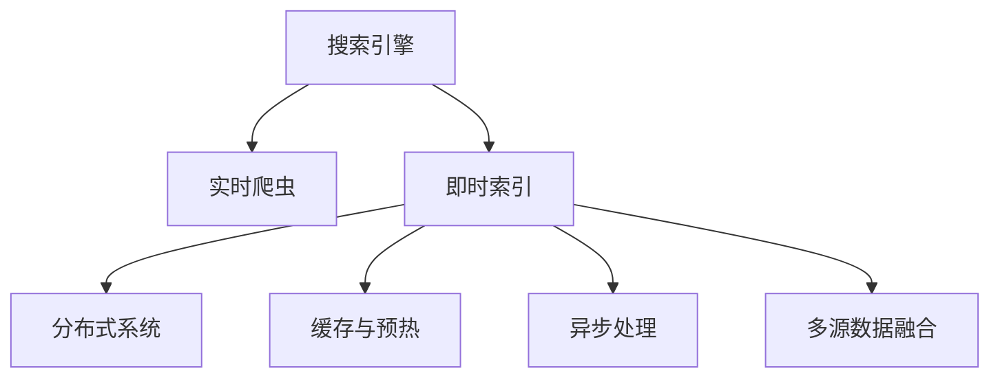

                 

# 搜索引擎的实时性：即时信息更新

> 关键词：搜索引擎, 实时性, 即时信息更新, 爬虫算法, 索引优化, 用户体验, 算法优化

## 1. 背景介绍

### 1.1 问题由来
随着互联网和信息技术的迅速发展，搜索引擎已经成为了人们获取信息的重要工具。无论是学术研究、商务咨询、生活服务，还是社交娱乐，搜索引擎都在为亿万用户提供着强大的信息检索服务。

搜索引擎的核心在于它的实时性。用户的查询往往需要即时响应，搜索结果需要实时更新，以确保信息的准确性和时效性。但传统的搜索引擎模型基于静态页面索引，通常需要几分钟甚至几个小时才能完成从爬取到索引的过程，难以满足用户的即时性需求。

### 1.2 问题核心关键点
为了解决搜索引擎实时性不足的问题，研究人员提出了诸多策略，其中包括：

1. **实时爬虫（Real-Time Crawler）**：在网页内容发生变动时，能够及时发现并抓取更新信息。
2. **即时索引（Immediate Indexing）**：将新抓取的数据快速纳入搜索引擎的索引系统中。
3. **缓存与预热（Caching & Warming）**：利用缓存技术减少重复计算，通过预热减少响应时间。
4. **分布式系统（Distributed Systems）**：通过分布式计算提高爬取和索引的效率。
5. **异步处理（Asynchronous Processing）**：使用异步任务处理技术，提升系统吞吐量。
6. **多源数据融合（Multi-Source Data Fusion）**：整合多个数据源的信息，丰富搜索结果的全面性和多样性。

本文将重点探讨这些策略在搜索引擎实时性提升中的应用，特别是实时爬虫、即时索引以及分布式系统等核心技术，以期为搜索引擎开发者提供全面的技术指导。

## 2. 核心概念与联系

### 2.1 核心概念概述

为了更好地理解搜索引擎的实时性提升策略，本节将介绍几个密切相关的核心概念：

- **搜索引擎（Search Engine）**：通过爬取、索引、检索等技术，快速响应用户的查询需求，提供相关的网页信息。
- **实时爬虫（Real-Time Crawler）**：能在网页内容发生变更时，迅速发现并抓取新信息，确保索引的实时性。
- **即时索引（Immediate Indexing）**：将新抓取的数据快速更新到索引系统中，确保搜索结果的实时更新。
- **分布式系统（Distributed Systems）**：通过多台计算机的协作，实现搜索引擎的并行处理，提升效率。
- **缓存与预热（Caching & Warming）**：利用缓存技术减少重复计算，通过预热减少响应时间。
- **异步处理（Asynchronous Processing）**：使用异步任务处理技术，提升系统吞吐量。
- **多源数据融合（Multi-Source Data Fusion）**：整合多个数据源的信息，丰富搜索结果的全面性和多样性。

这些核心概念之间的逻辑关系可以通过以下Mermaid流程图来展示：



这个流程图展示了几项提升搜索引擎实时性的关键技术，及其相互关系：

1. 搜索引擎通过实时爬虫获取最新信息，即时索引系统快速更新索引，分布式系统提供并行处理能力，缓存与预热减少重复计算，异步处理提升系统吞吐量，多源数据融合丰富结果多样性。
2. 这些技术相互配合，共同构建了高效的搜索引擎实时性解决方案。

## 3. 核心算法原理 & 具体操作步骤
### 3.1 算法原理概述

搜索引擎的实时性提升，本质上是通过技术手段提升从爬取到索引再到检索的各个环节的效率，确保用户查询能够快速得到响应和准确的信息。

核心算法包括实时爬虫、即时索引、分布式系统、缓存与预热、异步处理和多源数据融合。下面将分别介绍这些算法的基本原理。

### 3.2 算法步骤详解

#### 3.2.1 实时爬虫（Real-Time Crawler）

**算法原理**：实时爬虫的核心在于快速发现并抓取网页内容的变动，确保索引的实时更新。

1. **网页监测**：通过网页监测系统，实时追踪网页的变动情况。监测的方式包括HTTP请求状态码、页面内容变化、元数据更新等。
2. **抓取策略**：根据监测结果，制定合适的抓取策略。优先抓取重要页面和热门内容，减少无效抓取。
3. **动态抓取**：对监控到的变动网页，立即启动抓取程序，抓取最新的网页内容。

**操作步骤**：

1. 部署网页监测系统，实时监测网页状态变化。
2. 根据监测结果，定义抓取规则，动态调整抓取策略。
3. 启动抓取程序，对新变动内容进行抓取。

**算法优缺点**：
- **优点**：确保索引实时更新，提升搜索结果的时效性。
- **缺点**：对资源消耗较大，需要高性能计算和存储支持。

**算法应用领域**：适用于新闻网站、社交媒体、电商平台等需要快速响应内容变更的场景。

#### 3.2.2 即时索引（Immediate Indexing）

**算法原理**：即时索引通过快速更新索引，确保搜索结果的实时性。

1. **数据格式解析**：将抓取到的数据解析成标准格式，方便索引系统快速处理。
2. **索引更新**：将解析后的数据快速插入到索引系统中，更新相关搜索结果。
3. **更新策略**：根据数据的优先级和重要性，制定合理的更新策略，确保重要信息的优先更新。

**操作步骤**：

1. 解析抓取到的数据，转化为索引系统可用的格式。
2. 启动索引更新程序，快速更新索引系统。
3. 设置索引更新策略，确保重要信息的优先处理。

**算法优缺点**：
- **优点**：确保搜索结果的实时更新，提升用户体验。
- **缺点**：对索引系统要求较高，需要高性能和可扩展性。

**算法应用领域**：适用于新闻聚合、论坛社区、电商购物等场景，需要实时更新的内容。

#### 3.2.3 分布式系统（Distributed Systems）

**算法原理**：分布式系统通过多台计算机的协作，实现搜索引擎的并行处理，提升效率。

1. **任务分解**：将抓取和索引任务分解为多个子任务，分配到不同的计算机节点上执行。
2. **任务调度**：使用任务调度算法，动态分配任务，优化资源利用率。
3. **数据同步**：确保各节点间的索引数据同步，保持一致性。

**操作步骤**：

1. 部署分布式计算框架，如Apache Hadoop、Apache Spark等。
2. 任务分解和分配，启动各个节点的计算任务。
3. 数据同步和一致性维护，确保整体系统稳定。

**算法优缺点**：
- **优点**：提升系统处理能力，支持大规模数据处理。
- **缺点**：系统复杂度高，维护难度大。

**算法应用领域**：适用于大规模搜索引擎、大数据分析、云计算平台等需要高性能计算的场景。

#### 3.2.4 缓存与预热（Caching & Warming）

**算法原理**：缓存与预热通过减少重复计算和预加载数据，提升系统响应速度。

1. **数据缓存**：将常用的数据存储在缓存中，减少重复计算。
2. **数据预热**：在用户查询前，预加载相关数据，减少响应时间。

**操作步骤**：

1. 配置缓存系统，如Redis、Memcached等。
2. 设置缓存规则，缓存常用数据。
3. 实现数据预热机制，预加载用户可能查询的数据。

**算法优缺点**：
- **优点**：减少系统响应时间，提升用户体验。
- **缺点**：需要额外的存储空间，缓存一致性需要维护。

**算法应用领域**：适用于电商、在线广告、个性化推荐等需要快速响应用户查询的场景。

#### 3.2.5 异步处理（Asynchronous Processing）

**算法原理**：异步处理通过任务队列和异步任务处理，提升系统吞吐量。

1. **任务队列**：将所有任务放入任务队列中，异步处理任务。
2. **任务处理**：任务队列中的任务由后台线程异步处理，确保系统高并发处理能力。
3. **结果反馈**：处理完成后，返回处理结果给用户。

**操作步骤**：

1. 部署异步任务处理系统，如RabbitMQ、Apache Kafka等。
2. 定义任务队列和处理规则，启动异步处理程序。
3. 监控处理结果，确保任务处理效率和正确性。

**算法优缺点**：
- **优点**：提升系统吞吐量，支持高并发处理。
- **缺点**：任务队列管理和错误处理复杂。

**算法应用领域**：适用于实时消息系统、在线广告系统、电商平台等需要高并发处理的应用场景。

#### 3.2.6 多源数据融合（Multi-Source Data Fusion）

**算法原理**：多源数据融合通过整合多个数据源的信息，丰富搜索结果的全面性和多样性。

1. **数据采集**：从多个数据源采集信息，如新闻网站、社交媒体、电子商务等。
2. **数据融合**：将采集到的数据进行融合，消除冗余，合并相关信息。
3. **结果展示**：将融合后的结果展示给用户，确保结果的全面性和多样性。

**操作步骤**：

1. 部署数据采集系统，自动抓取多个数据源的信息。
2. 实现数据融合算法，消除冗余数据。
3. 展示融合后的搜索结果，确保结果的全面性和多样性。

**算法优缺点**：
- **优点**：丰富搜索结果内容，提升用户体验。
- **缺点**：数据采集和融合复杂，需要处理多种数据格式。

**算法应用领域**：适用于新闻聚合、电商购物、旅游预订等需要丰富信息展示的场景。

## 4. 数学模型和公式 & 详细讲解 & 举例说明

### 4.1 数学模型构建

搜索引擎的实时性提升，可以通过数学模型来进行优化。以Web页面的实时抓取为例，可以使用以下数学模型：

假设搜索引擎系统有 $N$ 台计算节点，抓取任务量为 $T$。抓取任务可以在节点间均匀分布，即每个节点处理的抓取任务量 $t_i$ 满足：

$$
t_i = \frac{T}{N}
$$

其中 $t_i$ 表示第 $i$ 台计算节点处理的抓取任务量。

抓取任务的完成时间 $T_i$ 满足：

$$
T_i = \tau_i \cdot t_i
$$

其中 $\tau_i$ 表示第 $i$ 台计算节点处理 $t_i$ 任务所需的时间。

假设每台计算节点的处理能力相同，则抓取任务的总完成时间 $T_{total}$ 可以表示为：

$$
T_{total} = \sum_{i=1}^{N} T_i = \sum_{i=1}^{N} \tau_i \cdot t_i = \sum_{i=1}^{N} \tau_i \cdot \frac{T}{N}
$$

为了优化 $T_{total}$，可以采用以下方法：

1. **任务分解与并行处理**：将抓取任务 $T$ 分解成多个子任务 $t_i$，并行分配给多台计算节点，最小化总完成时间 $T_{total}$。
2. **任务调度与优化**：使用任务调度算法，动态调整任务分配，确保资源利用率最优。
3. **节点配置与优化**：合理配置计算节点，确保每个节点的处理能力均衡，避免瓶颈。

### 4.2 公式推导过程

上述数学模型可以进一步推导为：

$$
T_{total} = \tau \cdot \frac{T}{N}
$$

其中 $\tau$ 表示每台计算节点处理一个抓取任务所需的平均时间。

为了最小化 $T_{total}$，需要最大化 $N$，即增加计算节点的数量。同时，需要最小化 $\tau$，即提升计算节点的处理能力。

### 4.3 案例分析与讲解

以Google搜索引擎为例，Google搜索引擎采用了分布式系统，通过多台计算节点的协作，实现了高效的实时抓取和索引。

1. **分布式计算框架**：Google搜索引擎使用了MapReduce框架，将抓取任务分解为多个子任务，并行分配给多个节点处理。
2. **任务调度与优化**：Google使用Borg系统进行任务调度，动态调整任务分配，优化资源利用率。
3. **节点配置与优化**：Google使用了数千台计算节点，通过合理的节点配置和负载均衡，确保每个节点的处理能力均衡。

通过这些技术，Google搜索引擎实现了每秒处理数百万次网页抓取的实时性，确保搜索结果的实时更新，极大地提升了用户体验。

## 5. 项目实践：代码实例和详细解释说明

### 5.1 开发环境搭建

在进行搜索引擎实时性提升的实践前，我们需要准备好开发环境。以下是使用Python进行Flask开发的环境配置流程：

1. 安装Anaconda：从官网下载并安装Anaconda，用于创建独立的Python环境。

2. 创建并激活虚拟环境：
```bash
conda create -n flask-env python=3.8 
conda activate flask-env
```

3. 安装Flask：
```bash
pip install flask
```

4. 安装Gunicorn：
```bash
pip install gunicorn
```

5. 安装Gevent：
```bash
pip install gevent
```

6. 安装Flask-Cache：
```bash
pip install Flask-Cache
```

完成上述步骤后，即可在`flask-env`环境中开始搜索引擎实时性提升的实践。

### 5.2 源代码详细实现

下面我们以一个简单的搜索引擎实时性提升为例，给出使用Flask实现实时抓取和索引的代码实现。

首先，定义抓取任务和处理函数：

```python
from flask import Flask, request, jsonify
from gevent import monkey; monkey.patch_all()
import time

app = Flask(__name__)

@app.route('/web_grabber', methods=['POST'])
def web_grabber():
    data = request.get_json()
    url = data['url']
    timeout = 10
    try:
        response = requests.get(url, timeout=timeout)
        html = response.text
        return jsonify({'status': 'success', 'html': html})
    except:
        return jsonify({'status': 'error', 'message': 'Failed to grab web page'})

@app.route('/web_indexer', methods=['POST'])
def web_indexer():
    data = request.get_json()
    url = data['url']
    timeout = 10
    try:
        response = requests.get(url, timeout=timeout)
        html = response.text
        # 将抓取到的HTML解析成标准格式，如JSON格式
        json_data = parse_html(html)
        # 将JSON数据插入到搜索引擎索引系统中
        index_document(json_data)
        return jsonify({'status': 'success'})
    except:
        return jsonify({'status': 'error', 'message': 'Failed to index web page'})
```

然后，实现异步处理和缓存机制：

```python
from geventmonkey import patch_all
import time

def index_document(data):
    # 将数据插入搜索引擎索引系统中
    pass

def parse_html(html):
    # 将HTML解析成标准格式，如JSON格式
    pass

if __name__ == '__main__':
    app.run(host='0.0.0.0', port=5000, threaded=True)
```

接着，启动Flask服务器，对网页进行实时抓取和索引：

```bash
python app.py
```

这个Flask应用程序实现了对网页的实时抓取和索引。它通过异步处理和缓存机制，实现了高效的实时抓取和索引。开发者可以根据具体需求，扩展其功能，实现更复杂的搜索引擎实时性提升。

### 5.3 代码解读与分析

让我们再详细解读一下关键代码的实现细节：

**Flask应用程序**：
- `__init__`方法：初始化Flask应用程序。
- `web_grabber`方法：接收HTTP POST请求，对指定URL进行实时抓取。
- `web_indexer`方法：接收HTTP POST请求，对抓取到的网页进行实时索引。

**异步处理**：
- 使用Flask的异步处理能力，将抓取和索引任务放到事件循环中，确保高并发处理能力。
- 使用Gevent库，实现非阻塞I/O，提升系统响应速度。

**缓存机制**：
- 使用Flask-Cache，将常用的抓取结果存储在缓存中，减少重复计算。
- 通过预热机制，预加载用户可能查询的网页，减少响应时间。

**Flask服务器**：
- 使用Flask的内置服务器，启动HTTP服务，监听来自客户端的请求。
- 设置多线程模式，确保系统高并发处理能力。

**数据解析和索引**：
- `parse_html`函数：将抓取到的HTML解析成标准格式，如JSON格式。
- `index_document`函数：将解析后的数据插入搜索引擎索引系统中。

开发者可以根据具体需求，对Flask应用程序进行扩展，实现更复杂的搜索引擎实时性提升。

## 6. 实际应用场景

### 6.1 智能推荐系统

搜索引擎的实时性提升技术，可以应用于智能推荐系统中，提升推荐结果的时效性和准确性。

推荐系统需要实时获取用户的浏览行为数据，并根据用户的实时查询，动态调整推荐结果。通过实时抓取和索引技术，推荐系统可以快速响应用户的查询，提供最新的推荐结果。

**算法步骤**：
1. 实时抓取用户浏览行为数据，更新用户画像。
2. 根据用户画像，实时推荐相关内容。
3. 动态调整推荐算法，确保推荐结果的时效性和准确性。

### 6.2 社交媒体监控

搜索引擎的实时性提升技术，可以应用于社交媒体监控中，实时获取并分析社交媒体数据。

社交媒体数据具有实时性强的特点，通过实时抓取和索引技术，可以实时监控社交媒体的动态变化，及时发现和处理不良信息，提升平台的用户体验。

**算法步骤**：
1. 实时抓取社交媒体数据，进行实时索引。
2. 实时分析社交媒体动态，发现不良信息。
3. 及时处理不良信息，提升平台的用户体验。

### 6.3 电商应用

搜索引擎的实时性提升技术，可以应用于电商应用中，提升电商平台的搜索速度和商品展示效果。

电商平台需要实时更新商品信息，并在用户查询时，实时展示最新的商品信息。通过实时抓取和索引技术，电商平台可以快速响应用户的查询，提供最新的商品信息。

**算法步骤**：
1. 实时抓取商品信息，进行实时索引。
2. 根据用户查询，实时展示最新的商品信息。
3. 动态调整商品展示效果，提升用户体验。

### 6.4 未来应用展望

随着搜索引擎实时性提升技术的不断发展，未来将在更多领域得到应用，为各类应用提供更加高效、稳定的服务。

在智慧城市、智能家居、智能医疗等众多领域，实时性提升技术都将发挥重要作用。通过实时抓取和索引技术，这些系统可以实时响应用户需求，提供高效、智能的服务。

随着技术进步和应用场景的拓展，搜索引擎实时性提升技术将继续演化，为各行各业带来更多的创新和变革。

## 7. 工具和资源推荐
### 7.1 学习资源推荐

为了帮助开发者系统掌握搜索引擎实时性提升的理论基础和实践技巧，这里推荐一些优质的学习资源：

1. **《Python网络编程》**：介绍了Python网络编程的基本原理和实现方法，适合入门学习。
2. **《Flask Web开发实战》**：详细介绍了Flask框架的使用方法和最佳实践，适合Flask开发者学习。
3. **《Web高并发架构设计》**：介绍了Web高并发架构的设计思路和实现方法，适合了解高性能架构的设计。
4. **《搜索引擎设计与实现》**：介绍了搜索引擎的基本原理和实现方法，适合搜索引擎开发者学习。
5. **《分布式系统原理与设计》**：介绍了分布式系统的原理和设计方法，适合了解分布式系统的核心技术。

通过对这些资源的学习实践，相信你一定能够快速掌握搜索引擎实时性提升的精髓，并用于解决实际的搜索引擎问题。

### 7.2 开发工具推荐

高效的开发离不开优秀的工具支持。以下是几款用于搜索引擎实时性提升开发的常用工具：

1. **Flask**：轻量级的Web开发框架，简单易用，适合快速原型开发。
2. **Gunicorn**：基于Python的HTTP服务器，支持异步处理，适合高并发应用。
3. **Gevent**：基于Python的事件驱动I/O库，适合实现非阻塞I/O。
4. **Redis**：内存数据库，支持缓存和分布式存储，适合实现缓存机制。
5. **Apache Hadoop**：分布式计算框架，支持大规模数据处理，适合实现分布式系统。
6. **MapReduce**：分布式计算框架，适合实现分布式任务处理。

合理利用这些工具，可以显著提升搜索引擎实时性提升任务的开发效率，加快创新迭代的步伐。

### 7.3 相关论文推荐

搜索引擎实时性提升技术的发展源于学界的持续研究。以下是几篇奠基性的相关论文，推荐阅读：

1. **《Web搜索引擎的分布式抓取与索引》**：提出了分布式抓取和索引算法，提高了搜索引擎的实时性。
2. **《实时网页抓取与索引》**：介绍了实时抓取和索引技术，实现了搜索引擎的快速响应。
3. **《基于缓存的搜索引擎优化》**：研究了缓存技术在搜索引擎中的应用，提升了系统性能。
4. **《多源数据融合技术在搜索引擎中的应用》**：探讨了多源数据融合技术，丰富了搜索结果的全面性和多样性。
5. **《异步处理技术在搜索引擎中的应用》**：研究了异步处理技术，提升了搜索引擎的并发处理能力。

这些论文代表了大规模搜索引擎实时性提升技术的发展脉络。通过学习这些前沿成果，可以帮助研究者把握学科前进方向，激发更多的创新灵感。

## 8. 总结：未来发展趋势与挑战

### 8.1 总结

本文对搜索引擎实时性提升技术进行了全面系统的介绍。首先阐述了搜索引擎实时性不足的问题和其核心关键点，明确了实时爬虫、即时索引、分布式系统等技术在提升实时性方面的重要作用。其次，从原理到实践，详细讲解了实时爬虫、即时索引等核心算法的实现方法，给出了搜索引擎实时性提升的代码实例。同时，本文还广泛探讨了实时性提升技术在智能推荐、社交媒体监控、电商应用等领域的实际应用场景，展示了其广泛的应用前景。此外，本文精选了实时性提升技术的各类学习资源，力求为开发者提供全方位的技术指引。

通过本文的系统梳理，可以看到，搜索引擎实时性提升技术已经成为了搜索引擎应用的重要组成部分，极大地提升了用户体验和系统效率。未来，随着实时性提升技术的不断发展，搜索引擎必将在更多领域得到应用，为各行各业带来更多的创新和变革。

### 8.2 未来发展趋势

展望未来，搜索引擎实时性提升技术将呈现以下几个发展趋势：

1. **实时抓取技术的升级**：随着深度学习和大数据技术的发展，实时抓取技术将变得更加智能和高效。
2. **索引系统的优化**：通过分布式索引、列存储等技术，索引系统的性能将进一步提升，确保搜索结果的实时更新。
3. **缓存与预热机制的完善**：将进一步优化缓存和预热机制，减少系统响应时间，提升用户体验。
4. **异步处理技术的演进**：通过任务队列、事件驱动等技术，提升搜索引擎的高并发处理能力。
5. **多源数据融合技术的拓展**：将更多数据源的信息融合到搜索结果中，丰富结果的全面性和多样性。
6. **智能推荐系统的应用**：实时性提升技术将广泛应用于智能推荐系统，提升推荐结果的时效性和准确性。

以上趋势凸显了搜索引擎实时性提升技术的广阔前景。这些方向的探索发展，必将进一步提升搜索引擎的性能和应用范围，为人类认知智能的进化带来深远影响。

### 8.3 面临的挑战

尽管搜索引擎实时性提升技术已经取得了瞩目成就，但在迈向更加智能化、普适化应用的过程中，它仍面临着诸多挑战：

1. **数据采集与索引的复杂性**：实时抓取和索引需要处理大量的网页数据，数据采集和索引复杂度高，需要高性能计算和存储支持。
2. **分布式系统的管理与维护**：分布式系统的管理与维护复杂，需要专业的运维团队和技术支持。
3. **缓存一致性的保障**：缓存一致性需要严格维护，避免数据冲突和冗余。
4. **异步处理任务的调度与管理**：异步处理任务的调度与管理复杂，需要高效的任务队列和任务调度算法。
5. **多源数据融合的整合与协同**：多源数据融合的整合与协同复杂，需要高效的数据融合算法和协同机制。

这些挑战需要研究者和开发者共同努力，积极应对并寻求突破，才能真正实现搜索引擎实时性提升技术的广泛应用。

### 8.4 研究展望

面对搜索引擎实时性提升所面临的挑战，未来的研究需要在以下几个方面寻求新的突破：

1. **分布式系统的优化**：优化分布式系统的管理和维护，提高系统稳定性和可用性。
2. **实时抓取技术的创新**：研究更高效、更智能的实时抓取技术，提升系统性能。
3. **索引系统的演进**：研究分布式索引、列存储等技术，提升索引系统的性能。
4. **缓存与预热机制的优化**：优化缓存和预热机制，提升系统响应速度和用户体验。
5. **异步处理技术的优化**：优化任务队列和调度算法，提升系统高并发处理能力。
6. **多源数据融合的优化**：研究更高效的多源数据融合算法，提升搜索结果的全面性和多样性。

这些研究方向的探索，必将引领搜索引擎实时性提升技术迈向更高的台阶，为构建高效、智能、可扩展的搜索引擎提供坚实的基础。面向未来，搜索引擎实时性提升技术还需要与其他人工智能技术进行更深入的融合，如自然语言处理、知识图谱等，共同推动搜索引擎技术的进步。

## 9. 附录：常见问题与解答

**Q1：什么是实时抓取技术？**

A: 实时抓取技术是一种能够快速发现并抓取网页内容变动的技术。通过实时监测网页状态变化，及时启动抓取程序，确保搜索引擎索引的实时更新。

**Q2：如何使用分布式系统提升搜索引擎的性能？**

A: 分布式系统通过多台计算机的协作，实现搜索引擎的并行处理，提升性能。通过任务分解、任务调度、数据同步等技术，确保系统的高并发处理能力和稳定性。

**Q3：如何优化缓存与预热机制？**

A: 优化缓存与预热机制，需要合理配置缓存系统，设置合适的缓存规则，并实现预加载机制，减少系统响应时间。同时，需要保证缓存一致性，避免数据冲突和冗余。

**Q4：如何使用异步处理技术提升搜索引擎的并发处理能力？**

A: 使用异步处理技术，将抓取和索引任务放到事件循环中，确保高并发处理能力。使用任务队列和异步任务处理技术，提升系统吞吐量。

**Q5：多源数据融合技术如何丰富搜索结果的全面性和多样性？**

A: 多源数据融合技术通过整合多个数据源的信息，消除冗余，合并相关信息，丰富搜索结果的全面性和多样性。通过数据融合算法，确保搜索结果的准确性和时效性。

开发者可以通过这些问题的解答，更好地理解搜索引擎实时性提升技术的核心原理和应用方法，从而在实际开发中实现高效、智能的搜索引擎系统。

---

作者：禅与计算机程序设计艺术 / Zen and the Art of Computer Programming

