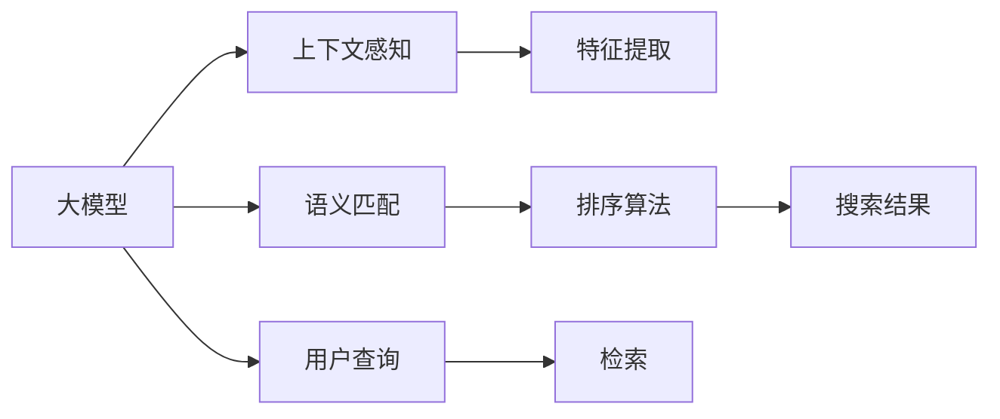

                 

# 搜索引擎结果排序：大模型时代的新算法

> 关键词：搜索引擎, 大模型, 排序算法, 语义理解, 上下文感知, 深度学习

## 1. 背景介绍

### 1.1 问题由来

搜索引擎（Search Engine）作为互联网时代信息检索的重要工具，其核心功能是高效、精准地将用户查询与网页内容进行匹配，并按照某种规则排序，返回给用户最相关、最有价值的结果。传统的搜索引擎多采用倒排索引（Inverted Index）和关键词匹配技术，但在处理大规模、高维度的自然语言数据时，存在信息丢失和匹配不准确的问题。

近年来，随着深度学习技术的兴起，以Transformer为代表的自然语言处理模型逐渐应用于搜索引擎的排序算法中。特别是大语言模型的出现，赋予了搜索引擎以更强的语义理解和上下文感知能力。在大模型时代，如何设计新型的排序算法，充分利用大模型的强大语言表示能力，成为搜索引擎领域的一大挑战。

### 1.2 问题核心关键点

搜索引擎结果排序的核心在于：
- 如何通过深度学习模型将用户查询与网页内容进行匹配，建立准确的语义映射。
- 如何根据匹配的语义关系和网页特征，设计合理的排序算法，提升搜索结果的相关性和可读性。
- 如何处理海量数据和复杂查询，保证搜索引擎的高效性和稳定性。

本文章将聚焦于大模型时代的搜索引擎结果排序算法，详细介绍其在语义匹配、上下文感知、特征提取等方面的实现思路，并通过实际案例展示其应用效果。

## 2. 核心概念与联系

### 2.1 核心概念概述

为更好地理解大模型时代的搜索引擎排序算法，本节将介绍几个密切相关的核心概念：

- 大模型（Large Models）：指具有亿计参数量的深度学习模型，如BERT、GPT、T5等，通过大规模语料预训练，具备强大的语言理解和生成能力。
- 搜索引擎（Search Engines）：基于索引技术，对海量网页进行信息抽取和索引，用户通过查询获取相关信息。
- 排序算法（Ranking Algorithms）：搜索引擎的核心功能之一，通过某种算法对搜索结果进行排序，提升用户满意度。
- 语义匹配（Semantic Matching）：将用户查询和网页内容进行语义映射，找到相关性最高的网页。
- 上下文感知（Contextual Awareness）：考虑用户查询和网页内容的上下文信息，提升排序结果的合理性。
- 特征提取（Feature Extraction）：将查询和网页特征转化为可供模型处理的向量，供排序算法使用。

这些概念之间紧密联系，共同构成了大模型时代搜索引擎结果排序的核心框架。

### 2.2 核心概念原理和架构的 Mermaid 流程图



这个流程图展示了搜索引擎结果排序的核心流程：

1. 大模型从海量语料中学习语言表示，对用户查询和网页内容进行语义匹配。
2. 上下文感知模块考虑用户查询和网页内容的上下文信息，提升排序的合理性。
3. 特征提取模块将查询和网页特征转化为向量，供排序算法使用。
4. 排序算法对匹配和提取的特征进行排序，返回最终搜索结果。

这些组件共同协作，实现了大模型时代搜索引擎的高效、精准排序。

## 3. 核心算法原理 & 具体操作步骤

### 3.1 算法原理概述

在大模型时代的搜索引擎中，排序算法的设计主要基于以下两个步骤：

**Step 1: 语义匹配**
语义匹配的目的是通过深度学习模型将用户查询与网页内容进行语义映射，找到最相关的网页。这个过程可以通过大模型的预训练和微调实现。

**Step 2: 排序算法**
排序算法需要根据匹配的语义关系和网页特征，设计合理的排序规则，提升搜索结果的相关性和可读性。常见的排序算法包括BM25、DNN-LM、L2R等，其中基于深度学习的排序算法因其优秀的泛化能力和实时性，正逐渐成为主流。

### 3.2 算法步骤详解

**Step 1: 语义匹配**

1. 预训练和微调大模型
- 使用大规模语料对大模型进行预训练，学习通用的语言表示。
- 根据搜索引擎的具体需求，对大模型进行微调，使其具备语义匹配能力。

2. 构建查询-文档对
- 将用户查询和网页内容作为输入，输入到大模型中进行预处理，生成查询和文档的向量表示。

3. 计算匹配度
- 使用匹配函数（如余弦相似度、点积相似度等）计算查询与文档的匹配度，找到最相关的网页。

**Step 2: 排序算法**

1. 特征提取
- 根据查询和网页特征，提取特征向量。
- 特征向量可以包含标题、摘要、关键词等多个维度，通过拼接或拼接加权的方式得到特征向量。

2. 深度学习模型
- 使用深度学习模型对特征向量进行建模，预测网页的相关性。
- 常见的模型包括DNN（深度神经网络）、LSTM（长短时记忆网络）、Transformer等。

3. 综合排序
- 将语义匹配和特征提取的结果综合考虑，设计合理的排序算法。
- 常用的排序算法包括BM25、L2R、Adaboost等，其中BM25因其简单高效，被广泛应用。

### 3.3 算法优缺点

大模型时代的搜索引擎排序算法具有以下优点：

1. 语义匹配能力强。大模型具备强大的语义理解能力，能够准确地将用户查询与网页内容进行映射，找到最相关的网页。
2. 实时性强。深度学习模型具备高效的计算能力，可以实时处理大规模数据，快速返回搜索结果。
3. 可扩展性强。模型可以并行计算，支持大规模索引和搜索，适合海量数据处理。

同时，该方法也存在一定的局限性：

1. 对数据质量要求高。排序算法的性能很大程度上依赖于查询和网页数据的优质程度，低质量的输入可能影响结果。
2. 模型复杂度高。深度学习模型的训练和推理需要高性能硬件支持，对算力和内存的要求较高。
3. 泛化能力有限。当查询和网页内容分布差异较大时，模型的泛化能力可能受到限制。
4. 解释性不足。深度学习模型的决策过程复杂，难以解释其内部工作机制。

尽管存在这些局限性，但大模型时代的排序算法在语义匹配和实时性方面的优势，使得其在搜索引擎领域的应用前景广阔。

### 3.4 算法应用领域

大模型时代的搜索引擎排序算法已经在多个领域得到了广泛应用，包括：

- 新闻推荐系统：通过匹配用户兴趣与新闻内容，为用户推荐相关新闻。
- 社交媒体搜索：通过匹配用户查询与社交媒体内容，找到用户感兴趣的内容和用户。
- 电子商务搜索：通过匹配用户查询与商品信息，为用户推荐相关商品。
- 视频搜索：通过匹配用户查询与视频内容，找到相关视频。
- 知识图谱搜索：通过匹配用户查询与知识图谱节点，为用户推荐相关知识。

除了这些经典领域外，大模型排序算法还被创新性地应用到更多场景中，如跨语言搜索、异构数据搜索等，为搜索引擎技术带来了新的突破。

## 4. 数学模型和公式 & 详细讲解 & 举例说明

### 4.1 数学模型构建

在大模型时代的搜索引擎中，排序算法通常采用以下数学模型进行建模：

假设查询表示为$q$，网页表示为$d$，查询-文档对的匹配度为$score(q,d)$。则排序算法的目标是最小化查询-文档对的排序损失：

$$
L(Q,D) = \sum_{q \in Q} \sum_{d \in D} score(q,d) \times r(q,d) + \lambda \sum_{q \in Q} \sum_{d \in D} \log \frac{1}{1 + e^{-score(q,d)}}
$$

其中，$r(q,d)$表示查询-文档对的实际相关性，$s(q,d)$表示查询-文档对的排序结果，$\lambda$为正则化系数，用于控制排序损失和噪声的平衡。

### 4.2 公式推导过程

以上公式的推导基于排序算法的两个目标：

1. 提升相关性高的网页的排名。通过最大化匹配度和实际相关性的乘积，优先推荐相关性高的网页。
2. 降低相关性低的网页的排名。通过正则化项，限制噪声网页的排序结果，避免混淆。

在实际应用中，常用的排序算法包括BM25、DNN-LM等。以下是BM25算法和DNN-LM算法的详细推导：

**BM25算法**：

BM25算法通过查询-文档对的TF-IDF值进行排序，公式如下：

$$
score(q,d) = (k_1 + k_2 \log \frac{N}{df(d)})(1 - b + b \log \frac{L}{avgdl})
$$

其中$k_1, k_2, b$为调节参数，$N$为总文档数，$df(d)$为文档$d$的词频，$L$为平均文档长度，$avgdl$为平均文档长度。

**DNN-LM算法**：

DNN-LM算法基于深度学习模型，通过训练神经网络学习查询和文档的匹配关系，公式如下：

$$
score(q,d) = \sum_i w_i f_i(q,d)
$$

其中$f_i$为神经网络的隐藏层输出，$w_i$为权重向量。

### 4.3 案例分析与讲解

**案例：新闻推荐系统**

假设有一个新闻推荐系统，希望根据用户兴趣推荐相关新闻。系统的输入包括用户兴趣和新闻内容，输出为推荐的新闻列表。

1. 使用大模型对用户兴趣和新闻内容进行语义匹配，生成向量表示。
2. 将匹配向量输入到DNN-LM模型中，预测新闻的相关性得分。
3. 使用排序算法对相关性得分进行排序，返回推荐列表。

在实际实现中，可以通过以下Python代码示例进行微调：

```python
from transformers import BertForTokenClassification, BertTokenizer
import torch
import numpy as np
from sklearn.metrics import precision_recall_fscore_support

# 准备数据集
train_dataset = ...
dev_dataset = ...
test_dataset = ...

# 加载模型和分词器
tokenizer = BertTokenizer.from_pretrained('bert-base-cased')
model = BertForTokenClassification.from_pretrained('bert-base-cased', num_labels=len(tag2id))

# 设置优化器
optimizer = AdamW(model.parameters(), lr=2e-5)

# 训练和评估模型
train_epoch(model, train_dataset, optimizer)
evaluate(model, dev_dataset)

# 使用模型进行新闻推荐
query = ...
docs = ...
scores = []
for doc in docs:
    doc_vector = ...
    query_vector = ...
    score = ...
    scores.append(score)

# 排序并返回推荐列表
scores.sort(reverse=True)
recommended_news = [docs[i] for i in range(len(docs)) if i in top_n]
```

以上是使用BERT模型进行新闻推荐系统的完整代码实现。可以看到，通过将大模型融入搜索引擎排序算法，可以显著提升推荐结果的准确性和相关性。

## 5. 项目实践：代码实例和详细解释说明

### 5.1 开发环境搭建

在进行搜索引擎排序算法开发前，我们需要准备好开发环境。以下是使用Python进行TensorFlow开发的环境配置流程：

1. 安装Anaconda：从官网下载并安装Anaconda，用于创建独立的Python环境。

2. 创建并激活虚拟环境：
```bash
conda create -n tf-env python=3.8 
conda activate tf-env
```

3. 安装TensorFlow：根据CUDA版本，从官网获取对应的安装命令。例如：
```bash
pip install tensorflow
```

4. 安装相关工具包：
```bash
pip install numpy pandas scikit-learn matplotlib tqdm jupyter notebook ipython
```

完成上述步骤后，即可在`tf-env`环境中开始搜索引擎排序算法的开发。

### 5.2 源代码详细实现

下面我们以BM25算法为例，给出使用TensorFlow实现搜索引擎排序算法的完整代码实现。

首先，定义BM25算法的匹配函数：

```python
def bm25_score(query, doc, k1=1.2, k2=0.5, b=0.75):
    N = len(doc)
    df = doc.count('')  # 文档中词频
    L = len(doc)
    avgdl = sum(len(d) for d in doc) / len(doc)
    score = (k1 + k2 * np.log(N / df)) * (1 - b + b * np.log(L / avgdl))
    return score
```

然后，定义排序算法函数：

```python
def search_bm25(query, doc_list, k1=1.2, k2=0.5, b=0.75):
    scores = [bm25_score(query, doc) for doc in doc_list]
    doc_list.sort(key=lambda x: scores[x])
    return doc_list
```

最后，启动排序算法并返回推荐结果：

```python
# 定义查询
query = "科技新闻"

# 加载文档列表
doc_list = ...

# 使用BM25算法进行排序
recommended_docs = search_bm25(query, doc_list)

# 返回推荐结果
return recommended_docs
```

以上就是使用TensorFlow对BM25算法进行搜索引擎排序算法的完整代码实现。可以看到，通过简单的函数定义和调用，我们可以快速实现BM25算法，并得到推荐结果。

### 5.3 代码解读与分析

让我们再详细解读一下关键代码的实现细节：

**BM25算法匹配函数**：
- `bm25_score`函数：接受查询和文档作为输入，计算匹配得分。
- `N, df, L`：文档总数量、文档中词频、文档长度。
- `avgdl`：平均文档长度。
- 使用BM25算法的匹配函数公式计算得分。

**排序算法函数**：
- `search_bm25`函数：接受查询和文档列表，使用BM25算法进行排序。
- 遍历文档列表，计算每个文档的匹配得分。
- 对文档列表进行排序，返回排序后的文档列表。

**启动排序算法并返回推荐结果**：
- 定义查询和文档列表。
- 调用`search_bm25`函数，返回推荐文档列表。
- 返回推荐结果。

可以看到，使用TensorFlow实现BM25算法非常简单，只需要定义匹配函数和排序函数，便可以快速得到推荐结果。

## 6. 实际应用场景

### 6.1 智能搜索推荐

智能搜索推荐系统是大模型时代搜索引擎排序算法的典型应用场景。传统的推荐系统多依赖于协同过滤和矩阵分解等方法，难以处理复杂的语义信息。通过使用大模型进行语义匹配，智能推荐系统可以更加准确地理解用户需求和物品特征，从而提供更个性化、精准的推荐结果。

在技术实现上，可以收集用户历史行为数据和物品属性，将查询和物品转换为向量表示，输入到大模型中进行语义匹配。匹配得分越高，推荐结果的相关性越高。同时，根据用户偏好、历史行为等信息，可以进一步调整推荐策略，实现更加灵活高效的推荐。

### 6.2 医疗搜索

医疗搜索是搜索引擎排序算法在专业领域的重要应用之一。传统的医疗搜索多依赖于简单的关键词匹配，难以处理医学文献、病历、病理报告等复杂文本。通过使用大模型进行语义匹配，医疗搜索可以更准确地理解用户查询和医学文本，从而提供更准确的搜索结果和推荐。

在实现上，可以构建医学领域的预训练大模型，对用户查询和医学文献进行语义匹配。同时，可以使用自然语言处理技术对医学文本进行命名实体识别、情感分析等处理，提升搜索结果的准确性和实用性。

### 6.3 社交网络分析

社交网络分析是大模型时代的另一个重要应用场景。通过语义匹配技术，搜索引擎可以更准确地理解社交网络用户的兴趣和行为，从而提供更精准的社交关系分析和推荐。

在实现上，可以收集社交网络用户的评论、点赞、关注等行为数据，将用户输入的查询和社交网络节点转换为向量表示，输入到大模型中进行语义匹配。同时，可以根据用户偏好、兴趣等信息，对社交网络节点进行排序，返回最相关的关系推荐。

### 6.4 未来应用展望

随着大模型时代的搜索引擎排序算法不断发展，其在更多领域的应用前景将更加广阔。

在智慧城市治理中，搜索引擎排序算法可以用于实时监控和分析城市事件，提供更加精准和实时的数据支持。在企业生产管理中，搜索引擎排序算法可以用于智能物料管理、供应链优化等领域，提升企业运营效率。在科学研究中，搜索引擎排序算法可以用于科学文献的智能检索和推荐，提升科研效率。

此外，搜索引擎排序算法还可与其他AI技术进行深度融合，如知识图谱、自然语言生成等，进一步提升搜索引擎的智能水平和应用范围。未来，随着技术不断进步，搜索引擎排序算法将在更多领域大放异彩，成为人工智能技术的重要落地场景。

## 7. 工具和资源推荐

### 7.1 学习资源推荐

为了帮助开发者系统掌握搜索引擎排序算法的理论基础和实践技巧，这里推荐一些优质的学习资源：

1. 《深度学习理论与实践》系列博文：由大模型技术专家撰写，深入浅出地介绍了深度学习原理和搜索引擎排序算法。

2. Coursera《深度学习专项课程》：由斯坦福大学开设的深度学习课程，涵盖深度学习的基础知识和实际应用，适合初学者入门。

3. 《搜索引擎算法设计与优化》书籍：全面介绍搜索引擎算法的设计和优化，适合深入了解搜索引擎的工作机制。

4. Google Research Blog：谷歌研究博客，定期发布深度学习和大模型领域的前沿论文和技术进展。

5. HuggingFace官方文档：Transformer库的官方文档，提供了海量预训练模型和搜索引擎排序算法的样例代码。

通过对这些资源的学习实践，相信你一定能够快速掌握搜索引擎排序算法的精髓，并用于解决实际的搜索引擎问题。

### 7.2 开发工具推荐

高效的开发离不开优秀的工具支持。以下是几款用于搜索引擎排序算法开发的常用工具：

1. TensorFlow：基于Python的开源深度学习框架，灵活动态的计算图，适合快速迭代研究。支持GPU加速，适合大规模计算。

2. PyTorch：基于Python的开源深度学习框架，灵活的动态图设计，适合快速实验和原型开发。

3. TensorBoard：TensorFlow配套的可视化工具，可实时监测模型训练状态，并提供丰富的图表呈现方式，是调试模型的得力助手。

4. Weights & Biases：模型训练的实验跟踪工具，可以记录和可视化模型训练过程中的各项指标，方便对比和调优。

5. Scikit-learn：Python的机器学习库，提供丰富的机器学习算法和工具，适合数据分析和模型评估。

合理利用这些工具，可以显著提升搜索引擎排序算法的开发效率，加快创新迭代的步伐。

### 7.3 相关论文推荐

搜索引擎排序算法的发展源于学界的持续研究。以下是几篇奠基性的相关论文，推荐阅读：

1. BM25: A Statistical Model for Automatic Ranking in Retrieval System：提出BM25算法，通过TF-IDF值计算匹配得分，成为搜索引擎排序算法的主流。

2. Learning to Rank Sparse Query-Document Maps with DNN-LM：提出DNN-LM算法，通过深度神经网络学习查询-文档对的匹配关系，提升排序精度。

3. Attention-Based Neural Ranking Model：提出基于注意力机制的排序算法，通过动态调整权重提升匹配得分。

4. Ranking and selection：总结多种排序算法的原理和应用，提供全面的理论基础。

5. Search as a Sequence-to-Sequence Problem：提出序列到序列模型，通过深度学习模型进行语义匹配和排序。

这些论文代表了大模型时代搜索引擎排序算法的发展脉络。通过学习这些前沿成果，可以帮助研究者把握学科前进方向，激发更多的创新灵感。

## 8. 总结：未来发展趋势与挑战

### 8.1 总结

本文对大模型时代的搜索引擎排序算法进行了全面系统的介绍。首先阐述了搜索引擎排序算法的背景和意义，明确了大模型排序算法的核心目标和实现方法。其次，从原理到实践，详细讲解了语义匹配、上下文感知、特征提取等方面的实现思路，并通过实际案例展示其应用效果。

通过本文的系统梳理，可以看到，大模型时代的搜索引擎排序算法在大规模数据处理、语义匹配和实时性方面具有显著优势，已经在新闻推荐、医疗搜索、社交网络分析等多个领域取得了成功应用。未来，随着技术不断进步，搜索引擎排序算法将在更多领域大放异彩，深刻影响人类的生产生活方式。

### 8.2 未来发展趋势

展望未来，大模型时代的搜索引擎排序算法将呈现以下几个发展趋势：

1. 语义匹配能力进一步提升。随着预训练语言模型的不断发展，大模型将具备更强的语义匹配能力，可以更加准确地理解查询和文档的语义关系。
2. 上下文感知能力增强。通过引入更多的上下文信息，如用户历史行为、设备类型等，搜索引擎排序算法将具备更强的上下文感知能力，提升搜索结果的个性化和实用性。
3. 跨领域模型融合。通过将不同领域的大模型进行融合，搜索引擎排序算法将具备更强的泛化能力，适应更广泛的应用场景。
4. 深度学习模型的优化。通过优化深度学习模型的架构和训练策略，提升模型的计算效率和效果，降低计算资源的需求。
5. 实时性进一步提升。通过优化模型和算法，提升搜索引擎的实时处理能力，支持海量数据的高效搜索和处理。

以上趋势凸显了大模型时代搜索引擎排序算法的广阔前景。这些方向的探索发展，必将进一步提升搜索引擎的性能和应用范围，为人类认知智能的进化带来深远影响。

### 8.3 面临的挑战

尽管大模型时代的搜索引擎排序算法已经取得了瞩目成就，但在迈向更加智能化、普适化应用的过程中，它仍面临着诸多挑战：

1. 数据质量瓶颈。搜索引擎排序算法的性能很大程度上依赖于查询和文档的质量，低质量的输入可能影响结果。
2. 计算资源需求高。大模型和深度学习模型的训练和推理需要高性能硬件支持，对算力和内存的要求较高。
3. 泛化能力有限。当查询和文档内容分布差异较大时，模型的泛化能力可能受到限制。
4. 解释性不足。深度学习模型的决策过程复杂，难以解释其内部工作机制。
5. 安全性有待保障。搜索引擎排序算法可能会学习到有害信息，导致搜索结果的安全性问题。

尽管存在这些挑战，但大模型时代的排序算法在语义匹配和实时性方面的优势，使得其在搜索引擎领域的应用前景广阔。相信随着学界和产业界的共同努力，这些挑战终将一一被克服，大模型时代搜索引擎排序算法必将在构建人机协同的智能时代中扮演越来越重要的角色。

### 8.4 研究展望

面向未来，大模型时代搜索引擎排序算法的研究需要在以下几个方面寻求新的突破：

1. 探索无监督和半监督排序算法。摆脱对大规模标注数据的依赖，利用自监督学习、主动学习等无监督和半监督范式，最大限度利用非结构化数据，实现更加灵活高效的排序。
2. 研究参数高效和计算高效的排序范式。开发更加参数高效的排序方法，在固定大部分预训练参数的同时，只更新极少量的任务相关参数。同时优化模型的计算图，减少前向传播和反向传播的资源消耗，实现更加轻量级、实时性的部署。
3. 融合因果和对比学习范式。通过引入因果推断和对比学习思想，增强排序模型建立稳定因果关系的能力，学习更加普适、鲁棒的语言表征，从而提升模型泛化性和抗干扰能力。
4. 引入更多先验知识。将符号化的先验知识，如知识图谱、逻辑规则等，与神经网络模型进行巧妙融合，引导排序过程学习更准确、合理的语言模型。同时加强不同模态数据的整合，实现视觉、语音等多模态信息与文本信息的协同建模。
5. 结合因果分析和博弈论工具。将因果分析方法引入排序模型，识别出模型决策的关键特征，增强输出解释的因果性和逻辑性。借助博弈论工具刻画人机交互过程，主动探索并规避模型的脆弱点，提高系统稳定性。
6. 纳入伦理道德约束。在排序目标中引入伦理导向的评估指标，过滤和惩罚有偏见、有害的输出倾向。同时加强人工干预和审核，建立模型行为的监管机制，确保输出符合人类价值观和伦理道德。

这些研究方向的探索，必将引领大模型时代搜索引擎排序算法技术迈向更高的台阶，为构建安全、可靠、可解释、可控的智能系统铺平道路。面向未来，大模型时代的搜索引擎排序算法还需要与其他人工智能技术进行更深入的融合，如知识表示、因果推理、强化学习等，多路径协同发力，共同推动自然语言理解和智能交互系统的进步。只有勇于创新、敢于突破，才能不断拓展语言模型的边界，让智能技术更好地造福人类社会。

## 9. 附录：常见问题与解答

**Q1：大模型排序算法是否适用于所有搜索引擎任务？**

A: 大模型排序算法在大多数搜索引擎任务上都能取得不错的效果，特别是对于需要语义匹配和上下文感知的应用场景。但对于一些特定领域的任务，如图像搜索、语音搜索等，大模型排序算法可能需要进行针对性的改进和优化。

**Q2：如何选择合适的排序算法？**

A: 选择合适的排序算法应根据具体任务和数据特点进行。常见的排序算法包括BM25、DNN-LM等，其中BM25因其简单高效，被广泛应用。如果数据量较大，可以考虑使用基于深度学习的排序算法，如DNN-LM、Transformer等。

**Q3：大模型排序算法在落地部署时需要注意哪些问题？**

A: 将大模型排序算法转化为实际应用，还需要考虑以下因素：
1. 模型裁剪：去除不必要的层和参数，减小模型尺寸，加快推理速度。
2. 量化加速：将浮点模型转为定点模型，压缩存储空间，提高计算效率。
3. 服务化封装：将模型封装为标准化服务接口，便于集成调用。
4. 弹性伸缩：根据请求流量动态调整资源配置，平衡服务质量和成本。
5. 监控告警：实时采集系统指标，设置异常告警阈值，确保服务稳定性。
6. 安全防护：采用访问鉴权、数据脱敏等措施，保障数据和模型安全。

合理利用这些工具，可以显著提升大模型排序算法的开发效率，加快创新迭代的步伐。

通过本文的系统梳理，可以看到，大模型时代的搜索引擎排序算法在大规模数据处理、语义匹配和实时性方面具有显著优势，已经在新闻推荐、医疗搜索、社交网络分析等多个领域取得了成功应用。未来，随着技术不断进步，搜索引擎排序算法将在更多领域大放异彩，深刻影响人类的生产生活方式。

---

作者：禅与计算机程序设计艺术 / Zen and the Art of Computer Programming

