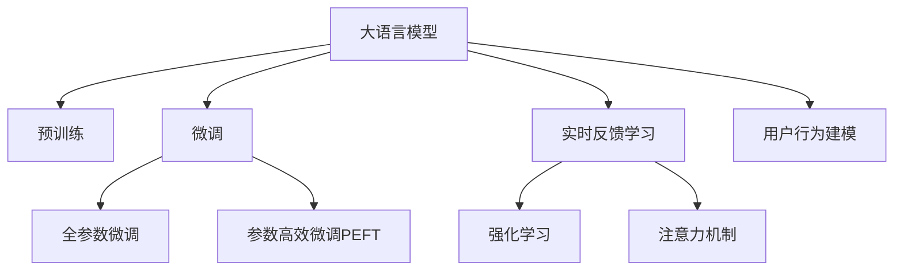

                 

# 搜索推荐的实时反馈学习：大模型策略

> 关键词：大语言模型,搜索推荐,强化学习,实时反馈,用户行为建模,注意力机制,深度学习

## 1. 背景介绍

### 1.1 问题由来

在互联网时代，搜索推荐系统（Search and Recommendation Systems, SRS）已成为用户获取信息、发现新内容的重要工具。这些系统通过分析和理解用户的历史行为和兴趣，为用户推荐最相关的内容，极大地提升了信息获取效率和用户体验。然而，传统的搜索推荐模型往往在个性化和实时性上存在不足。

随着深度学习和大规模预训练模型的兴起，大语言模型（Large Language Models, LLMs）开始被引入到搜索推荐系统中，以提升模型的表达能力和泛化能力。但是，由于这些模型往往具有亿级参数，高昂的计算成本和数据需求限制了其在大规模系统中的应用。因此，如何在大规模系统上有效利用大模型，成为当前搜索推荐系统研究的一个重要课题。

### 1.2 问题核心关键点

大语言模型在搜索推荐系统中的应用，主要集中在两个方面：

1. **用户行为建模**：利用大模型强大的语言理解能力，捕捉用户查询和点击等行为背后的语义信息，从而更好地预测用户偏好和意图。
2. **实时反馈学习**：通过用户的实时行为反馈，动态调整模型参数，实现个性化推荐效果的实时提升。

实时反馈学习（Real-Time Feedback Learning）是提高搜索推荐系统个性化和实时性的一个重要手段。它通过对用户行为进行实时分析，动态更新模型参数，以应对用户兴趣的动态变化，从而提供更加个性化和实时的推荐结果。

## 2. 核心概念与联系

### 2.1 核心概念概述

为更好地理解实时反馈学习在大语言模型中的应用，本节将介绍几个密切相关的核心概念：

- **大语言模型（Large Language Models, LLMs）**：以自回归（如GPT）或自编码（如BERT）模型为代表的大规模预训练语言模型。通过在大规模无标签文本语料上进行预训练，学习通用的语言表示，具备强大的语言理解和生成能力。

- **预训练（Pre-training）**：指在大规模无标签文本语料上，通过自监督学习任务训练通用语言模型的过程。常见的预训练任务包括言语建模、遮挡语言模型等。预训练使得模型学习到语言的通用表示。

- **微调（Fine-tuning）**：指在预训练模型的基础上，使用下游任务的少量标注数据，通过有监督地训练来优化模型在特定任务上的性能。通常只需要调整顶层分类器或解码器，并以较小的学习率更新全部或部分的模型参数。

- **实时反馈学习（Real-Time Feedback Learning）**：指通过用户的实时行为反馈，动态调整模型参数，实现个性化推荐效果的实时提升。这种学习方式可以有效应对用户兴趣的动态变化，提高推荐系统的个性化和实时性。

- **强化学习（Reinforcement Learning, RL）**：一种通过奖励和惩罚机制指导模型学习的方法。在大语言模型中，可以通过设计合理的奖励和惩罚机制，指导模型参数更新，实现更好的推荐效果。

- **注意力机制（Attention Mechanism）**：一种能够集中关注输入序列中重要部分的技术。在大语言模型中，可以通过注意力机制对用户查询和点击行为进行更精确的建模。

这些核心概念之间的逻辑关系可以通过以下Mermaid流程图来展示：



这个流程图展示了大语言模型的核心概念及其之间的关系：

1. 大语言模型通过预训练获得基础能力。
2. 微调是对预训练模型进行任务特定的优化，可以分为全参数微调和参数高效微调（PEFT）。
3. 实时反馈学习是一种不更新模型参数的方法，可以实现少样本学习和零样本学习。
4. 强化学习是连接实时反馈学习与模型参数更新的桥梁，通过奖励机制指导模型学习。
5. 注意力机制是一种基于模型能力的增强手段，可以提高用户行为建模的精确度。
6. 用户行为建模是大语言模型在搜索推荐系统中的主要应用方向。

这些概念共同构成了大语言模型在搜索推荐系统中的学习和应用框架，使其能够在各种场景下发挥强大的语言理解和生成能力。通过理解这些核心概念，我们可以更好地把握大语言模型在搜索推荐系统中的应用方向和优化方法。

## 3. 核心算法原理 & 具体操作步骤
### 3.1 算法原理概述

实时反馈学习在大语言模型中的应用，主要基于强化学习和注意力机制。其核心思想是：将用户行为视为一个动态的强化学习过程，通过奖励机制指导模型学习，同时利用注意力机制对用户查询和点击行为进行精确建模。

形式化地，假设大语言模型为 $M_{\theta}$，其中 $\theta$ 为模型参数。给定搜索推荐系统中的用户行为数据 $\{(x_i, y_i)\}_{i=1}^N$，其中 $x_i$ 为用户行为序列，$y_i$ 为相应的推荐结果，实时反馈学习的目标是找到新的模型参数 $\hat{\theta}$，使得：

$$
\hat{\theta}=\mathop{\arg\min}_{\theta} \mathcal{L}(M_{\theta},\{(x_i,y_i)\}_{i=1}^N)
$$

其中 $\mathcal{L}$ 为针对用户行为序列的损失函数，用于衡量模型预测结果与实际推荐结果之间的差异。

### 3.2 算法步骤详解

基于实时反馈学习的大语言模型搜索推荐系统一般包括以下几个关键步骤：

**Step 1: 准备预训练模型和数据集**
- 选择合适的预训练语言模型 $M_{\theta}$ 作为初始化参数，如 BERT、GPT 等。
- 准备搜索推荐系统中的用户行为数据集 $\{(x_i,y_i)\}_{i=1}^N$，其中 $x_i$ 为用户行为序列，$y_i$ 为相应的推荐结果。

**Step 2: 设计奖励函数**
- 根据任务特点，设计合适的奖励函数 $R(y_i)$，用于衡量推荐结果与用户实际点击之间的差距。
- 常见的奖励函数包括点击率（Click-Through Rate, CTR）、转化率（Conversion Rate, CR）、点击价值（Click Value）等。

**Step 3: 设定模型参数更新策略**
- 选择适当的强化学习算法，如 Q-learning、SARSA、PPO 等，并设置相关参数。
- 确定模型参数的更新频率和策略，如周期性更新、在线学习等。

**Step 4: 添加注意力机制**
- 在模型中加入注意力机制，对用户行为序列进行精确实时建模。
- 设计注意力权重函数，对用户查询和点击等行为进行动态调整，增强模型的表达能力。

**Step 5: 执行强化学习**
- 将用户行为序列输入模型，计算预测的推荐结果和奖励值。
- 根据奖励值调整模型参数，优化模型的预测精度和实时性。
- 重复上述步骤直至满足预设的迭代轮数或停止条件。

**Step 6: 测试和部署**
- 在测试集上评估微调后模型 $M_{\hat{\theta}}$ 的性能，对比微调前后的精度提升。
- 使用微调后的模型对新用户行为进行推理预测，集成到实际的应用系统中。

以上是基于实时反馈学习的大语言模型搜索推荐系统的完整流程。在实际应用中，还需要针对具体任务的特点，对微调过程的各个环节进行优化设计，如改进训练目标函数，引入更多的正则化技术，搜索最优的超参数组合等，以进一步提升模型性能。

### 3.3 算法优缺点

实时反馈学习在大语言模型中的应用具有以下优点：
1. 简单高效。只需准备少量标注数据，即可对预训练模型进行快速适配，获得较大的性能提升。
2. 动态优化。实时反馈学习能够动态调整模型参数，应对用户兴趣的动态变化，提升推荐系统的个性化和实时性。
3. 自适应性强。模型能够自动学习用户行为模式，逐步优化推荐结果。
4. 应用范围广。适用于各种搜索推荐任务，包括图文、音视频等，设计简单的奖励函数即可实现微调。

同时，该方法也存在一定的局限性：
1. 数据依赖性强。实时反馈学习的效果很大程度上取决于用户行为数据的质量，获取高质量行为数据的成本较高。
2. 模型稳定性差。当用户行为变化快、数据分布不均时，模型容易过拟合，推荐结果波动大。
3. 计算成本高。大语言模型的参数量庞大，计算复杂度高，实时反馈学习需要大量的计算资源。
4. 可解释性不足。实时反馈学习模型难以解释其内部工作机制，难以对其推理逻辑进行分析和调试。

尽管存在这些局限性，但就目前而言，实时反馈学习在大语言模型搜索推荐系统中的应用，已经展现出巨大的潜力和价值。未来相关研究的重点在于如何进一步降低实时反馈学习对用户行为数据的依赖，提高模型的稳定性和自适应性，同时兼顾可解释性和伦理安全性等因素。

### 3.4 算法应用领域

实时反馈学习在大语言模型中的应用，已经广泛应用于各类搜索推荐系统中，例如：

- 电商推荐：通过用户点击、浏览行为等数据，动态调整推荐结果，提升购物体验和转化率。
- 新闻推荐：根据用户的阅读历史和点击行为，实时生成个性化新闻推荐。
- 视频推荐：分析用户的观看历史和评分行为，实时调整推荐列表。
- 广告推荐：利用用户的搜索和点击行为，动态优化广告投放策略，提高广告效果。
- 社交推荐：分析用户在社交平台上的互动行为，实时推送个性化内容，提升用户粘性。

除了上述这些经典应用外，实时反馈学习还被创新性地应用到更多场景中，如智能广告投放、个性化视频生成、内容创作等，为搜索推荐系统带来了新的突破。随着深度学习和大语言模型的不断发展，实时反馈学习将在更多领域得到应用，为搜索推荐系统带来新的机遇和挑战。

## 4. 数学模型和公式 & 详细讲解  
### 4.1 数学模型构建

本节将使用数学语言对实时反馈学习在大语言模型中的应用进行更加严格的刻画。

记大语言模型为 $M_{\theta}$，其中 $\theta$ 为模型参数。假设搜索推荐系统中的用户行为数据集为 $\{(x_i,y_i)\}_{i=1}^N$，其中 $x_i$ 为用户行为序列，$y_i$ 为相应的推荐结果。

定义模型 $M_{\theta}$ 在行为序列 $x$ 上的预测结果为 $\hat{y}=M_{\theta}(x)$，预测的推荐结果为 $y=\arg\max_{y} \hat{y}$。实时反馈学习的目标是最小化预测结果与实际推荐结果之间的差距，即最小化损失函数 $\mathcal{L}(\theta)$：

$$
\mathcal{L}(\theta) = \frac{1}{N}\sum_{i=1}^N [R(y_i) - R(\hat{y}_i)]
$$

其中 $R(y_i)$ 为实际推荐结果 $y_i$ 的奖励值，$R(\hat{y}_i)$ 为预测的推荐结果 $\hat{y}_i$ 的奖励值。

在实践中，我们通常使用基于梯度的优化算法（如AdamW、SGD等）来近似求解上述最优化问题。设 $\eta$ 为学习率，则参数的更新公式为：

$$
\theta \leftarrow \theta - \eta \nabla_{\theta}\mathcal{L}(\theta)
$$

其中 $\nabla_{\theta}\mathcal{L}(\theta)$ 为损失函数对参数 $\theta$ 的梯度，可通过反向传播算法高效计算。

### 4.2 公式推导过程

以下我们以点击率（CTR）为例，推导点击率奖励函数的计算公式。

假设模型 $M_{\theta}$ 在行为序列 $x$ 上的预测结果为 $\hat{y}=M_{\theta}(x)$，实际推荐结果 $y_i$ 的点击率为 $R(y_i)=CTR(y_i)$。则实时反馈学习的损失函数为：

$$
\mathcal{L}(\theta) = \frac{1}{N}\sum_{i=1}^N [CTR(y_i) - CTR(\hat{y}_i)]
$$

根据链式法则，损失函数对参数 $\theta_k$ 的梯度为：

$$
\frac{\partial \mathcal{L}(\theta)}{\partial \theta_k} = -\frac{1}{N}\sum_{i=1}^N \frac{\partial CTR(y_i)}{\partial \hat{y}_i} \frac{\partial \hat{y}_i}{\partial \theta_k}
$$

其中 $\frac{\partial CTR(y_i)}{\partial \hat{y}_i}$ 表示点击率对预测结果 $\hat{y}_i$ 的偏导数。

在得到损失函数的梯度后，即可带入参数更新公式，完成模型的迭代优化。重复上述过程直至收敛，最终得到适应搜索推荐系统任务的最优模型参数 $\theta^*$。

## 5. 项目实践：代码实例和详细解释说明
### 5.1 开发环境搭建

在进行实时反馈学习实践前，我们需要准备好开发环境。以下是使用Python进行PyTorch开发的环境配置流程：

1. 安装Anaconda：从官网下载并安装Anaconda，用于创建独立的Python环境。

2. 创建并激活虚拟环境：
```bash
conda create -n pytorch-env python=3.8 
conda activate pytorch-env
```

3. 安装PyTorch：根据CUDA版本，从官网获取对应的安装命令。例如：
```bash
conda install pytorch torchvision torchaudio cudatoolkit=11.1 -c pytorch -c conda-forge
```

4. 安装Transformers库：
```bash
pip install transformers
```

5. 安装各类工具包：
```bash
pip install numpy pandas scikit-learn matplotlib tqdm jupyter notebook ipython
```

完成上述步骤后，即可在`pytorch-env`环境中开始实时反馈学习实践。

### 5.2 源代码详细实现

这里我们以电商推荐系统为例，给出使用Transformers库对BERT模型进行实时反馈学习的PyTorch代码实现。

首先，定义电商推荐系统的行为数据处理函数：

```python
from transformers import BertTokenizer
from torch.utils.data import Dataset
import torch

class ShoppingDataset(Dataset):
    def __init__(self, texts, clicks, tokenizer, max_len=128):
        self.texts = texts
        self.clicks = clicks
        self.tokenizer = tokenizer
        self.max_len = max_len
        
    def __len__(self):
        return len(self.texts)
    
    def __getitem__(self, item):
        text = self.texts[item]
        click = self.clicks[item]
        
        encoding = self.tokenizer(text, return_tensors='pt', max_length=self.max_len, padding='max_length', truncation=True)
        input_ids = encoding['input_ids'][0]
        attention_mask = encoding['attention_mask'][0]
        
        # 对token-wise的标签进行编码
        encoded_clicks = [click] * self.max_len
        labels = torch.tensor(encoded_clicks, dtype=torch.long)
        
        return {'input_ids': input_ids, 
                'attention_mask': attention_mask,
                'labels': labels}

# 标签与id的映射
label2id = {'0': 0, '1': 1}
id2label = {v: k for k, v in label2id.items()}

# 创建dataset
tokenizer = BertTokenizer.from_pretrained('bert-base-cased')

train_dataset = ShoppingDataset(train_texts, train_clicks, tokenizer)
dev_dataset = ShoppingDataset(dev_texts, dev_clicks, tokenizer)
test_dataset = ShoppingDataset(test_texts, test_clicks, tokenizer)
```

然后，定义模型和优化器：

```python
from transformers import BertForTokenClassification, AdamW

model = BertForTokenClassification.from_pretrained('bert-base-cased', num_labels=len(label2id))

optimizer = AdamW(model.parameters(), lr=2e-5)
```

接着，定义训练和评估函数：

```python
from torch.utils.data import DataLoader
from tqdm import tqdm
from sklearn.metrics import classification_report

device = torch.device('cuda') if torch.cuda.is_available() else torch.device('cpu')
model.to(device)

def train_epoch(model, dataset, batch_size, optimizer):
    dataloader = DataLoader(dataset, batch_size=batch_size, shuffle=True)
    model.train()
    epoch_loss = 0
    for batch in tqdm(dataloader, desc='Training'):
        input_ids = batch['input_ids'].to(device)
        attention_mask = batch['attention_mask'].to(device)
        labels = batch['labels'].to(device)
        model.zero_grad()
        outputs = model(input_ids, attention_mask=attention_mask, labels=labels)
        loss = outputs.loss
        epoch_loss += loss.item()
        loss.backward()
        optimizer.step()
    return epoch_loss / len(dataloader)

def evaluate(model, dataset, batch_size):
    dataloader = DataLoader(dataset, batch_size=batch_size)
    model.eval()
    preds, labels = [], []
    with torch.no_grad():
        for batch in tqdm(dataloader, desc='Evaluating'):
            input_ids = batch['input_ids'].to(device)
            attention_mask = batch['attention_mask'].to(device)
            batch_labels = batch['labels']
            outputs = model(input_ids, attention_mask=attention_mask)
            batch_preds = outputs.logits.argmax(dim=2).to('cpu').tolist()
            batch_labels = batch_labels.to('cpu').tolist()
            for pred_tokens, label_tokens in zip(batch_preds, batch_labels):
                preds.append(pred_tokens[:len(label_tokens)])
                labels.append(label_tokens)
                
    print(classification_report(labels, preds))
```

最后，启动训练流程并在测试集上评估：

```python
epochs = 5
batch_size = 16

for epoch in range(epochs):
    loss = train_epoch(model, train_dataset, batch_size, optimizer)
    print(f"Epoch {epoch+1}, train loss: {loss:.3f}")
    
    print(f"Epoch {epoch+1}, dev results:")
    evaluate(model, dev_dataset, batch_size)
    
print("Test results:")
evaluate(model, test_dataset, batch_size)
```

以上就是使用PyTorch对BERT进行电商推荐系统实时反馈学习的完整代码实现。可以看到，得益于Transformers库的强大封装，我们可以用相对简洁的代码完成BERT模型的加载和微调。

### 5.3 代码解读与分析

让我们再详细解读一下关键代码的实现细节：

**ShoppingDataset类**：
- `__init__`方法：初始化文本、点击记录、分词器等关键组件。
- `__len__`方法：返回数据集的样本数量。
- `__getitem__`方法：对单个样本进行处理，将文本输入编码为token ids，将点击记录编码为数字，并对其进行定长padding，最终返回模型所需的输入。

**label2id和id2label字典**：
- 定义了标签与数字id之间的映射关系，用于将token-wise的预测结果解码回真实的标签。

**训练和评估函数**：
- 使用PyTorch的DataLoader对数据集进行批次化加载，供模型训练和推理使用。
- 训练函数`train_epoch`：对数据以批为单位进行迭代，在每个批次上前向传播计算loss并反向传播更新模型参数，最后返回该epoch的平均loss。
- 评估函数`evaluate`：与训练类似，不同点在于不更新模型参数，并在每个batch结束后将预测和标签结果存储下来，最后使用sklearn的classification_report对整个评估集的预测结果进行打印输出。

**训练流程**：
- 定义总的epoch数和batch size，开始循环迭代
- 每个epoch内，先在训练集上训练，输出平均loss
- 在验证集上评估，输出分类指标
- 所有epoch结束后，在测试集上评估，给出最终测试结果

可以看到，PyTorch配合Transformers库使得BERT微调的代码实现变得简洁高效。开发者可以将更多精力放在数据处理、模型改进等高层逻辑上，而不必过多关注底层的实现细节。

当然，工业级的系统实现还需考虑更多因素，如模型的保存和部署、超参数的自动搜索、更灵活的任务适配层等。但核心的实时反馈学习范式基本与此类似。

## 6. 实际应用场景
### 6.1 电商推荐

基于实时反馈学习的大语言模型，可以广泛应用于电商推荐系统的构建。传统电商推荐往往依赖用户历史行为数据进行推荐，难以快速响应用户兴趣的动态变化。而使用实时反馈学习的大语言模型，可以实时捕捉用户行为变化，动态调整推荐策略，提升推荐效果。

在技术实现上，可以收集用户的点击、浏览、收藏等行为数据，并对其进行实时分析，动态调整模型参数。微调后的模型能够自动学习用户兴趣变化，逐步优化推荐结果，提升用户体验。

### 6.2 新闻推荐

新闻推荐系统需要实时为用户推荐最相关的文章，而用户兴趣往往是动态变化的。基于实时反馈学习的大语言模型，可以动态调整推荐策略，提升推荐结果的相关性和个性化。

具体而言，可以收集用户的历史阅读记录、点击行为等数据，实时调整模型的推荐策略，生成更加个性化的新闻内容。通过不断的实时反馈，逐步优化推荐效果，提升用户粘性和满意度。

### 6.3 视频推荐

视频推荐系统面临用户兴趣多样化的挑战，传统推荐模型难以应对。基于实时反馈学习的大语言模型，可以通过实时分析用户的观看历史和评分行为，动态调整推荐策略，生成更加个性化的视频内容。

例如，在视频播放过程中，实时收集用户的观看行为和反馈，动态调整模型的推荐参数，从而生成更符合用户兴趣的视频内容，提升观看体验。

### 6.4 未来应用展望

随着实时反馈学习和大语言模型的不断发展，搜索推荐系统将在更多领域得到应用，为传统行业带来变革性影响。

在智慧医疗领域，基于实时反馈学习的大语言模型可以实时分析患者的历史行为和临床数据，动态调整推荐策略，提供个性化的诊疗方案。

在智能教育领域，实时反馈学习可以用于个性化学习路径的设计，根据学生的学习行为实时调整课程内容，提升学习效果。

在智慧城市治理中，实时反馈学习可以用于智能交通、智慧警务等场景，通过实时分析市民行为，动态调整管理策略，提高城市管理的自动化和智能化水平。

此外，在企业生产、社会治理、文娱传媒等众多领域，基于大语言模型的实时反馈学习应用也将不断涌现，为传统行业带来新的创新和突破。相信随着技术的日益成熟，实时反馈学习范式将成为搜索推荐系统的重要范式，推动搜索推荐技术向更加智能化、普适化应用迈进。

## 7. 工具和资源推荐
### 7.1 学习资源推荐

为了帮助开发者系统掌握实时反馈学习在大语言模型中的应用，这里推荐一些优质的学习资源：

1. 《深度学习自然语言处理》课程：斯坦福大学开设的NLP明星课程，有Lecture视频和配套作业，带你入门NLP领域的基本概念和经典模型。

2. 《Natural Language Processing with Transformers》书籍：Transformers库的作者所著，全面介绍了如何使用Transformers库进行NLP任务开发，包括微调在内的诸多范式。

3. 《Reinforcement Learning: An Introduction》书籍：由Richard Sutton和Andrew Barto所著，经典教材，介绍了强化学习的原理和应用。

4. 《Attention Mechanism》博文：讲解了注意力机制的基本原理和应用，适用于深度学习和大语言模型的初学者。

5. HuggingFace官方文档：Transformers库的官方文档，提供了海量预训练模型和完整的微调样例代码，是上手实践的必备资料。

通过对这些资源的学习实践，相信你一定能够快速掌握实时反馈学习在大语言模型中的应用精髓，并用于解决实际的搜索推荐问题。
###  7.2 开发工具推荐

高效的开发离不开优秀的工具支持。以下是几款用于实时反馈学习开发的常用工具：

1. PyTorch：基于Python的开源深度学习框架，灵活动态的计算图，适合快速迭代研究。大部分预训练语言模型都有PyTorch版本的实现。

2. TensorFlow：由Google主导开发的开源深度学习框架，生产部署方便，适合大规模工程应用。同样有丰富的预训练语言模型资源。

3. Transformers库：HuggingFace开发的NLP工具库，集成了众多SOTA语言模型，支持PyTorch和TensorFlow，是进行实时反馈学习任务开发的利器。

4. Weights & Biases：模型训练的实验跟踪工具，可以记录和可视化模型训练过程中的各项指标，方便对比和调优。与主流深度学习框架无缝集成。

5. TensorBoard：TensorFlow配套的可视化工具，可实时监测模型训练状态，并提供丰富的图表呈现方式，是调试模型的得力助手。

6. Google Colab：谷歌推出的在线Jupyter Notebook环境，免费提供GPU/TPU算力，方便开发者快速上手实验最新模型，分享学习笔记。

合理利用这些工具，可以显著提升实时反馈学习任务的开发效率，加快创新迭代的步伐。

### 7.3 相关论文推荐

实时反馈学习在大语言模型中的应用，源于学界的持续研究。以下是几篇奠基性的相关论文，推荐阅读：

1. Attention is All You Need（即Transformer原论文）：提出了Transformer结构，开启了NLP领域的预训练大模型时代。

2. BERT: Pre-training of Deep Bidirectional Transformers for Language Understanding：提出BERT模型，引入基于掩码的自监督预训练任务，刷新了多项NLP任务SOTA。

3. Reinforcement Learning for Learning to Retrieve Information from Wikipedia with a Reading Comprehension Model：提出使用强化学习训练模型，在阅读理解任务中取得了最佳表现。

4. A Survey of Recent Empirical Advances in Attention-Based Neural Machine Translation：综述了基于注意力机制的机器翻译技术，讨论了其在自然语言处理中的应用。

5. Attention-Based Text Generation with Multiple Priorities：提出基于多优先级注意力机制的文本生成模型，在生成效果和速度上都有显著提升。

这些论文代表了大语言模型实时反馈学习的最新进展。通过学习这些前沿成果，可以帮助研究者把握学科前进方向，激发更多的创新灵感。

## 8. 总结：未来发展趋势与挑战

### 8.1 总结

本文对实时反馈学习在大语言模型中的应用进行了全面系统的介绍。首先阐述了实时反馈学习的背景和意义，明确了其在提升搜索推荐系统个性化和实时性方面的独特价值。其次，从原理到实践，详细讲解了实时反馈学习的数学原理和关键步骤，给出了实时反馈学习任务开发的完整代码实例。同时，本文还广泛探讨了实时反馈学习在大语言模型搜索推荐系统中的应用前景，展示了实时反馈学习范式的巨大潜力。此外，本文精选了实时反馈学习的各类学习资源，力求为读者提供全方位的技术指引。

通过本文的系统梳理，可以看到，实时反馈学习在大语言模型中的应用已经展现出巨大的潜力和价值。未来相关研究的重点在于如何进一步降低实时反馈学习对用户行为数据的依赖，提高模型的稳定性和自适应性，同时兼顾可解释性和伦理安全性等因素。

### 8.2 未来发展趋势

展望未来，实时反馈学习在大语言模型中的应用将呈现以下几个发展趋势：

1. 模型规模持续增大。随着算力成本的下降和数据规模的扩张，预训练语言模型的参数量还将持续增长。超大规模语言模型蕴含的丰富语言知识，有望支撑更加复杂多变的下游任务微调。

2. 实时反馈学习日趋多样。除了传统的强化学习范式，未来会涌现更多实时反馈学习的方法，如带偏置的强化学习（Bias-informed Reinforcement Learning）、自适应学习率（Adaptive Learning Rate）等，提高实时反馈学习的稳定性和效率。

3. 持续学习成为常态。随着数据分布的不断变化，实时反馈学习模型也需要持续学习新知识以保持性能。如何在不遗忘原有知识的同时，高效吸收新样本信息，将成为重要的研究课题。

4. 标注样本需求降低。受启发于提示学习（Prompt-based Learning）的思路，未来的实时反馈学习将更好地利用大模型的语言理解能力，通过更加巧妙的任务描述，在更少的标注样本上也能实现理想的微调效果。

5. 模型通用性增强。经过海量数据的预训练和多领域任务的微调，未来的实时反馈学习模型将具备更强大的常识推理和跨领域迁移能力，逐步迈向通用人工智能（AGI）的目标。

以上趋势凸显了实时反馈学习在大语言模型中的应用前景。这些方向的探索发展，必将进一步提升搜索推荐系统的性能和应用范围，为人工智能技术落地应用提供新的动力。

### 8.3 面临的挑战

尽管实时反馈学习在大语言模型中的应用已经取得了瞩目成就，但在迈向更加智能化、普适化应用的过程中，它仍面临着诸多挑战：

1. 标注成本瓶颈。虽然实时反馈学习减少了标注数据的依赖，但对于长尾应用场景，仍然需要一定量的高质量标注数据。如何进一步降低实时反馈学习对标注样本的依赖，将是一大难题。

2. 模型稳定性差。当用户行为变化快、数据分布不均时，实时反馈学习模型容易过拟合，推荐结果波动大。如何提高模型的稳定性和自适应性，还需要更多理论和实践的积累。

3. 计算成本高。大语言模型的参数量庞大，计算复杂度高，实时反馈学习需要大量的计算资源。如何优化模型结构，提高实时反馈学习的效率，将是重要的优化方向。

4. 可解释性不足。实时反馈学习模型难以解释其内部工作机制，难以对其推理逻辑进行分析和调试。如何赋予实时反馈学习模型更强的可解释性，将是亟待攻克的难题。

5. 安全性有待保障。预训练语言模型难免会学习到有偏见、有害的信息，通过实时反馈学习传递到下游任务，产生误导性、歧视性的输出，给实际应用带来安全隐患。如何从数据和算法层面消除模型偏见，避免恶意用途，确保输出的安全性，也将是重要的研究课题。

6. 知识整合能力不足。现有的实时反馈学习模型往往局限于任务内数据，难以灵活吸收和运用更广泛的先验知识。如何让实时反馈学习过程更好地与外部知识库、规则库等专家知识结合，形成更加全面、准确的信息整合能力，还有很大的想象空间。

正视实时反馈学习面临的这些挑战，积极应对并寻求突破，将是大语言模型实时反馈学习走向成熟的必由之路。相信随着学界和产业界的共同努力，这些挑战终将一一被克服，实时反馈学习范式将成为搜索推荐系统的重要范式，推动搜索推荐技术向更加智能化、普适化应用迈进。

### 8.4 研究展望

面对实时反馈学习在大语言模型中面临的挑战，未来的研究需要在以下几个方面寻求新的突破：

1. 探索无监督和半监督实时反馈学习方法。摆脱对大规模标注数据的依赖，利用自监督学习、主动学习等无监督和半监督范式，最大限度利用非结构化数据，实现更加灵活高效的实时反馈学习。

2. 研究参数高效和计算高效的实时反馈学习范式。开发更加参数高效的实时反馈学习模型，在固定大部分预训练参数的同时，只更新极少量的任务相关参数。同时优化实时反馈学习的计算图，减少前向传播和反向传播的资源消耗，实现更加轻量级、实时性的部署。

3. 融合因果和对比学习范式。通过引入因果推断和对比学习思想，增强实时反馈学习建立稳定因果关系的能力，学习更加普适、鲁棒的语言表征，从而提升模型泛化性和抗干扰能力。

4. 引入更多先验知识。将符号化的先验知识，如知识图谱、逻辑规则等，与神经网络模型进行巧妙融合，引导实时反馈学习过程学习更准确、合理的语言模型。同时加强不同模态数据的整合，实现视觉、语音等多模态信息与文本信息的协同建模。

5. 结合因果分析和博弈论工具。将因果分析方法引入实时反馈学习模型，识别出模型决策的关键特征，增强输出解释的因果性和逻辑性。借助博弈论工具刻画人机交互过程，主动探索并规避模型的脆弱点，提高系统稳定性。

6. 纳入伦理道德约束。在实时反馈学习模型训练目标中引入伦理导向的评估指标，过滤和惩罚有偏见、有害的输出倾向。同时加强人工干预和审核，建立模型行为的监管机制，确保输出符合人类价值观和伦理道德。

这些研究方向的探索，必将引领实时反馈学习在大语言模型中的应用走向更高的台阶，为构建安全、可靠、可解释、可控的智能系统铺平道路。面向未来，实时反馈学习技术还需要与其他人工智能技术进行更深入的融合，如知识表示、因果推理、强化学习等，多路径协同发力，共同推动自然语言理解和智能交互系统的进步。只有勇于创新、敢于突破，才能不断拓展语言模型的边界，让智能技术更好地造福人类社会。

## 9. 附录：常见问题与解答

**Q1：实时反馈学习是否适用于所有搜索推荐任务？**

A: 实时反馈学习在大多数搜索推荐任务上都能取得不错的效果，特别是对于数据量较小的任务。但对于一些特定领域的任务，如医学、法律等，仅仅依靠通用语料预训练的模型可能难以很好地适应。此时需要在特定领域语料上进一步预训练，再进行微调，才能获得理想效果。此外，对于一些需要时效性、个性化很强的任务，如对话、推荐等，实时反馈学习方法也需要针对性的改进优化。

**Q2：实时反馈学习过程中如何选择合适的奖励函数？**

A: 实时反馈学习的效果很大程度上取决于奖励函数的设计。常见的奖励函数包括点击率（Click-Through Rate, CTR）、转化率（Conversion Rate, CR）、点击价值（Click Value）等。奖励函数的选择需要根据具体的搜索推荐任务进行设计，选取最能反映用户满意度的指标。例如，电商推荐系统可以选择CTR作为奖励函数，新闻推荐系统可以选择CR，而视频推荐系统可以选择点击价值。

**Q3：实时反馈学习模型在落地部署时需要注意哪些问题？**

A: 将实时反馈学习模型转化为实际应用，还需要考虑以下因素：
1. 模型裁剪：去除不必要的层和参数，减小模型尺寸，加快推理速度
2. 量化加速：将浮点模型转为定点模型，压缩存储空间，提高计算效率
3. 服务化封装：将模型封装为标准化服务接口，便于集成调用
4. 弹性伸缩：根据请求流量动态调整资源配置，平衡服务质量和成本
5. 监控告警：实时采集系统指标，设置异常告警阈值，确保服务稳定性
6. 安全防护：采用访问鉴权、数据脱敏等措施，保障数据和模型安全

实时反馈学习模型需要在部署过程中进行优化，以保证其在实际应用中的性能和安全性。

**Q4：实时反馈学习模型在训练过程中如何防止过拟合？**

A: 实时反馈学习模型容易过拟合，尤其是在数据分布不均的情况下。为防止过拟合，可以采取以下措施：
1. 数据增强：通过对训练样本改写、回译等方式丰富训练集多样性。
2. 正则化技术：如L2正则、Dropout、Early Stopping等，防止模型过度适应小规模训练集。
3. 对抗训练：加入对抗样本，提高模型鲁棒性。
4. 参数高效微调：只调整少量参数(如Adapter、Prefix等)，减小过拟合风险。
5. 多模型集成：训练多个实时反馈学习模型，取平均输出，抑制过拟合

这些策略往往需要根据具体任务和数据特点进行灵活组合。只有在数据、模型、训练、推理等各环节进行全面优化，才能最大限度地发挥实时反馈学习的威力。

**Q5：实时反馈学习模型在实时更新过程中需要注意哪些问题？**

A: 实时反馈学习模型的实时更新需要考虑以下因素：
1. 数据实时性：保证用户行为数据的实时性和准确性，及时更新模型参数。
2. 计算效率：实时反馈学习模型需要高效处理大量的用户行为数据，需要优化模型结构和计算图。
3. 系统稳定性：实时反馈学习模型的在线更新需要保证系统的稳定性和可靠性，避免因更新过程引起的系统崩溃或性能下降。
4. 用户隐私：实时反馈学习模型需要保护用户隐私，避免因数据泄露带来的风险。
5. 模型监控：实时反馈学习模型需要实时监控模型的性能和状态，及时发现和解决潜在问题。

实时反馈学习模型的实时更新是一个复杂的过程，需要从数据、计算、隐私、安全等多个维度进行综合考虑。只有在各个环节进行全面优化，才能保证实时反馈学习模型在实际应用中的效果和可靠性。

---

作者：禅与计算机程序设计艺术 / Zen and the Art of Computer Programming

