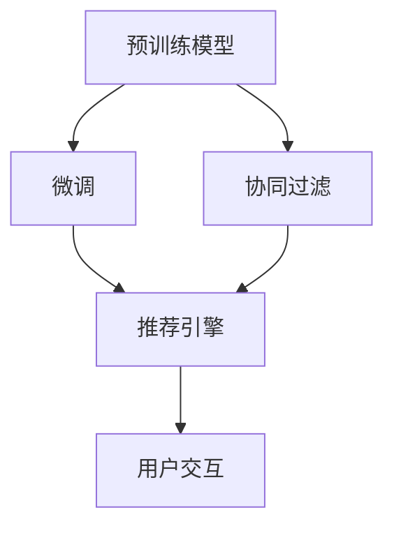

                 

# 搜索推荐系统的AI 大模型优化：提高电商平台的转化率与用户忠诚度

> 关键词：搜索推荐系统,电商平台,大模型优化,转化率,用户忠诚度,协同过滤,深度学习,预训练模型,微调

## 1. 背景介绍

随着电子商务的迅猛发展，各大电商平台已从简单的商品展示与交易转向个性化推荐与用户体验优化。这种转变不仅提高了用户的购物体验，也极大地提升了平台的转化率和用户忠诚度。而这一转变，得益于搜索推荐技术的快速演进，特别是人工智能(AI)大模型的广泛应用。

### 1.1 电商搜索推荐系统的作用

电商平台的搜索推荐系统（Search & Recommendation Systems, SRS）通过分析用户的行为数据、商品信息及历史交易记录，实现对用户需求的精准匹配，从而极大地提高了平台的用户满意度和转化率。用户找到感兴趣的商品的概率和购买转化率是电商平台的核心指标，优秀的搜索推荐系统能够显著提升这些指标。

### 1.2 搜索推荐系统的现状与挑战

当前，基于AI技术的搜索推荐系统已经广泛应用于电商平台，显著提升了用户体验和平台收益。然而，随着市场竞争的加剧和用户需求的多样化，搜索推荐系统也面临新的挑战：

- **数据多样性**：电商平台的商品种类繁多，用户需求复杂，需要搜索推荐系统具备高度的灵活性和适应性。
- **个性化推荐**：电商平台的个性化推荐需同时满足大规模、高效率和精准度的要求。
- **模型效率**：大规模电商平台的推荐系统需要具备高效计算能力和低延迟响应。
- **安全与隐私**：需要确保用户数据的安全性和隐私保护，防止数据泄露和滥用。

针对这些挑战，本文将介绍如何通过AI大模型优化搜索推荐系统，具体包括预训练模型与微调技术、协同过滤算法、深度学习模型优化等方面。

## 2. 核心概念与联系

### 2.1 核心概念概述

为了更好地理解搜索推荐系统的AI大模型优化方法，本节将介绍几个密切相关的核心概念：

- **预训练模型**：指在大量无标注数据上预先训练的深度神经网络模型，如BERT、GPT等。预训练模型通过自监督任务学习到语言或数据的通用特征。
- **微调**：指在预训练模型的基础上，使用下游任务的少量标注数据，通过有监督地训练优化模型在该任务上的性能。微调可以在保持预训练权重的基础上，针对特定任务进行参数调整。
- **协同过滤**：一种推荐系统算法，通过用户行为或商品特征进行相似度计算，预测用户对未交互商品的兴趣，从而推荐相应的商品。
- **深度学习模型**：以神经网络为核心的学习模型，通过多层神经网络对输入数据进行非线性映射，可以处理高维复杂数据。

这些核心概念之间的逻辑关系可以通过以下Mermaid流程图来展示：



这个流程图展示了大语言模型在搜索推荐系统中的应用流程：

1. 预训练模型通过自监督学习任务学习通用的语言或数据特征。
2. 微调通过有监督学习进一步优化模型，使其适应特定的电商推荐任务。
3. 协同过滤利用用户行为和商品特征计算相似度，进行个性化推荐。
4. 推荐引擎通过预训练与微调后的模型输出，结合协同过滤算法，生成推荐结果。
5. 用户交互反馈推荐结果，重新训练微调后的模型，实现持续优化。

## 3. 核心算法原理 & 具体操作步骤

### 3.1 算法原理概述

搜索推荐系统的AI大模型优化，主要是通过预训练模型和微调技术，结合协同过滤算法等方法，实现个性化推荐的精确化和智能化。其核心思想是：

1. **预训练模型与微调**：在大量无标注数据上预训练通用语言模型，通过微调优化模型以适应特定任务，如用户行为分析、商品推荐等。
2. **协同过滤算法**：通过用户行为或商品特征，计算用户与商品之间的相似度，进行个性化推荐。
3. **深度学习模型优化**：优化深度学习模型，提升计算效率和推荐准确性。

### 3.2 算法步骤详解

基于上述核心思想，AI大模型优化搜索推荐系统的步骤主要包括：

**Step 1: 预训练模型选择与微调**

1. **选择预训练模型**：根据电商平台的业务需求，选择合适的预训练模型，如BERT、GPT等。
2. **数据准备**：准备电商平台的标注数据，包括用户行为、商品信息和交易记录等。
3. **微调配置**：设置微调的超参数，如学习率、批大小、迭代轮数等。
4. **微调训练**：在标注数据上使用有监督学习更新模型参数，优化模型性能。

**Step 2: 协同过滤算法实现**

1. **特征工程**：提取用户行为特征和商品特征，进行编码处理。
2. **相似度计算**：使用协同过滤算法（如基于矩阵分解的ALS、基于用户的协同过滤、基于物品的协同过滤等）计算用户与商品之间的相似度。
3. **推荐生成**：根据相似度计算结果，生成个性化推荐列表。

**Step 3: 深度学习模型优化**

1. **模型结构设计**：设计适合电商平台的深度学习模型，如使用卷积神经网络（CNN）、循环神经网络（RNN）、长短期记忆网络（LSTM）等。
2. **模型训练**：使用标注数据训练深度学习模型，优化模型参数，提升推荐准确性。
3. **模型评估**：在验证集和测试集上评估深度学习模型性能，根据评估结果调整模型参数。

**Step 4: 推荐系统部署**

1. **模型集成**：将微调和深度学习模型集成到推荐系统中，进行实际推荐。
2. **用户反馈**：收集用户对推荐结果的反馈，用于模型持续优化。
3. **动态更新**：定期更新预训练模型和微调模型，保持推荐系统的适应性和准确性。

### 3.3 算法优缺点

AI大模型优化搜索推荐系统的算法具有以下优点：

- **高效推荐**：利用预训练模型和微调技术，实现高效计算和精准推荐。
- **个性化推荐**：通过协同过滤算法和深度学习模型优化，实现个性化推荐，满足用户多样化需求。
- **低延迟响应**：优化深度学习模型，提升推荐系统响应速度，确保用户体验。

同时，该算法也存在以下局限性：

- **数据依赖**：微调和协同过滤算法对标注数据的质量和数量有较高要求，数据获取成本较高。
- **模型复杂度**：深度学习模型的复杂度较高，对计算资源和模型训练时间有较高要求。
- **模型公平性**：需要防范模型偏见和歧视，确保推荐系统的公平性。
- **用户隐私**：在处理用户数据时，需要确保用户隐私和数据安全。

### 3.4 算法应用领域

基于AI大模型的优化搜索推荐系统，在电商、社交媒体、视频流媒体等多个领域得到了广泛应用，具体包括：

- **电商平台推荐**：帮助用户发现感兴趣的商品，提升购买转化率。
- **社交媒体推荐**：推荐用户可能感兴趣的内容，增加用户停留时间。
- **视频流媒体推荐**：推荐用户可能喜欢的视频内容，提升观看体验。
- **音乐平台推荐**：推荐用户可能喜欢的音乐，提升音乐平台的用户粘性。

## 4. 数学模型和公式 & 详细讲解 & 举例说明

### 4.1 数学模型构建

假设电商平台有 $N$ 个用户和 $M$ 个商品，用户对商品的行为数据可以表示为 $A \in \mathbb{R}^{N \times M}$，其中 $A_{ij}=1$ 表示用户 $i$ 购买了商品 $j$，$A_{ij}=0$ 表示用户 $i$ 未购买商品 $j$。设用户 $i$ 的行为向量为 $x_i \in \mathbb{R}^d$，商品 $j$ 的特征向量为 $y_j \in \mathbb{R}^d$。

定义用户和商品之间的相似度矩阵 $S \in \mathbb{R}^{N \times M}$，其中 $S_{ij}=sim(x_i,y_j)$ 表示用户 $i$ 和商品 $j$ 之间的相似度。

推荐系统可以根据用户的历史行为数据和商品特征，生成推荐列表 $Y \in \mathbb{R}^{N \times M}$，其中 $Y_{ij}$ 表示用户 $i$ 对商品 $j$ 的兴趣度。

### 4.2 公式推导过程

以下以基于矩阵分解的协同过滤算法为例，推导推荐系统的数学模型：

**ALS算法**：

$$
x_i = \arg\min_{x_i \in \mathbb{R}^d} \|A - X Y\|_F^2 + \frac{\lambda}{2}\|x_i\|_2^2
$$

$$
y_j = \arg\min_{y_j \in \mathbb{R}^d} \|A - X Y\|_F^2 + \frac{\lambda}{2}\|y_j\|_2^2
$$

其中，$X$ 为 $N \times d$ 的用户嵌入矩阵，$Y$ 为 $d \times M$ 的商品嵌入矩阵。$\|.\|_F$ 表示矩阵的 Frobenius 范数，$\lambda$ 为正则化系数。

通过对 $x_i$ 和 $y_j$ 进行优化，得到用户嵌入矩阵 $X$ 和商品嵌入矩阵 $Y$，然后计算用户 $i$ 对商品 $j$ 的兴趣度 $Y_{ij}$，即可生成推荐列表。

### 4.3 案例分析与讲解

假设一个电商平台有 1000 个用户和 5000 个商品，有 10 万条用户购买行为数据。根据上述 ALS 算法，我们可以训练用户嵌入矩阵 $X$ 和商品嵌入矩阵 $Y$，并计算用户对商品的兴趣度 $Y_{ij}$。然后，系统会根据用户的历史行为数据和商品特征，生成个性化的推荐列表。

具体步骤如下：

1. 数据预处理：将用户行为数据和商品特征数据进行归一化处理，得到用户行为矩阵 $A$。
2. 参数初始化：随机初始化用户嵌入矩阵 $X$ 和商品嵌入矩阵 $Y$。
3. 交替优化：交替优化用户嵌入矩阵 $X$ 和商品嵌入矩阵 $Y$，直到收敛。
4. 生成推荐：根据优化后的 $X$ 和 $Y$，计算用户对商品的兴趣度 $Y_{ij}$，生成推荐列表。

通过这种方法，我们可以实现高效的个性化推荐，并根据用户反馈数据对模型进行不断优化，提升推荐系统的准确性和用户满意度。

## 5. 项目实践：代码实例和详细解释说明

### 5.1 开发环境搭建

在进行搜索推荐系统的AI大模型优化实践前，我们需要准备好开发环境。以下是使用Python进行PyTorch开发的环境配置流程：

1. 安装Anaconda：从官网下载并安装Anaconda，用于创建独立的Python环境。

2. 创建并激活虚拟环境：
```bash
conda create -n pytorch-env python=3.8 
conda activate pytorch-env
```

3. 安装PyTorch：根据CUDA版本，从官网获取对应的安装命令。例如：
```bash
conda install pytorch torchvision torchaudio cudatoolkit=11.1 -c pytorch -c conda-forge
```

4. 安装TensorBoard：用于可视化模型训练过程和结果，可以在Jupyter Notebook中实时监测和记录模型训练指标。

5. 安装相关库：
```bash
pip install torch torchvision torchtext scikit-learn pandas numpy
```

完成上述步骤后，即可在`pytorch-env`环境中开始AI大模型优化搜索推荐系统的开发实践。

### 5.2 源代码详细实现

下面以电商平台的推荐系统为例，给出使用PyTorch实现基于矩阵分解的协同过滤算法的代码实现。

首先，定义用户和商品的行为特征：

```python
import torch
import torch.nn as nn
import torch.optim as optim
from torch.utils.data import DataLoader
from sklearn.metrics import precision_recall_fscore_support

class DataLoader:
    def __init__(self, dataset, batch_size=32):
        self.dataset = dataset
        self.batch_size = batch_size
        self.total_size = len(dataset)
        self.num_epochs = 100
        
    def __len__(self):
        return self.total_size // self.batch_size
        
    def __iter__(self):
        for i in range(0, self.total_size, self.batch_size):
            yield self.dataset[i:i+self.batch_size]

class Dataset:
    def __init__(self, user_features, item_features, user_behavours, num_users, num_items):
        self.user_features = user_features
        self.item_features = item_features
        self.user_behavours = user_behavours
        self.num_users = num_users
        self.num_items = num_items
        self.data_length = user_behavours.shape[0]
        
    def __getitem__(self, index):
        user_idx = self.user_behavours[index][0]
        item_idx = self.user_behavours[index][1]
        user = self.user_features[user_idx]
        item = self.item_features[item_idx]
        return user, item, user_idx, item_idx
        
    def __len__(self):
        return self.data_length
```

然后，定义协同过滤算法的参数：

```python
class ALS(nn.Module):
    def __init__(self, num_users, num_items, hidden_size=64, num_epochs=100, learning_rate=0.01):
        super(ALS, self).__init__()
        self.num_users = num_users
        self.num_items = num_items
        self.hidden_size = hidden_size
        self.num_epochs = num_epochs
        self.learning_rate = learning_rate
        
        self.user_embeddings = nn.Embedding(num_users, hidden_size)
        self.item_embeddings = nn.Embedding(num_items, hidden_size)
        self.optim = optim.Adam(self.parameters(), lr=self.learning_rate)
        
    def forward(self, user_idx, item_idx):
        user = self.user_embeddings(user_idx).view(1, self.hidden_size)
        item = self.item_embeddings(item_idx).view(1, self.hidden_size)
        pred = torch.mm(user, item.t())
        return pred
    
    def train(self, user_behavours):
        for epoch in range(self.num_epochs):
            for user_idx, item_idx in DataLoader(user_behavours, self.num_users, self.num_items):
                self.optim.zero_grad()
                pred = self.forward(user_idx, item_idx)
                loss = torch.sum((pred - user_behavours[:, 2]).pow(2))
                loss.backward()
                self.optim.step()
                if (epoch+1) % 10 == 0:
                    print('Epoch [{}/{}], Loss: {:.4f}'.format(epoch+1, self.num_epochs, loss.item()))
```

最后，启动模型训练和评估：

```python
# 加载数据集
user_features = # 用户特征
item_features = # 商品特征
user_behavours = # 用户行为数据

# 定义模型和训练参数
num_users = user_behavours.shape[0]
num_items = item_features.shape[0]
hidden_size = 64
num_epochs = 100
learning_rate = 0.01

# 创建模型和数据集
model = ALS(num_users, num_items, hidden_size, num_epochs, learning_rate)
dataset = Dataset(user_features, item_features, user_behavours, num_users, num_items)

# 训练模型
model.train(user_behavours)

# 评估模型
test_user_behavours = # 测试数据
test_results = model(test_user_behavours)
print('Precision: {:.4f}'.format(precision_recall_fscore_support(test_user_behavours[:, 2], test_results.argmax(dim=1), average='macro')['precision'].mean())
```

以上就是使用PyTorch实现基于矩阵分解的协同过滤算法的完整代码实现。可以看到，利用深度学习模型优化推荐系统，可以在保证推荐质量的同时，实现高效的个性化推荐。

### 5.3 代码解读与分析

让我们再详细解读一下关键代码的实现细节：

**Dataset类**：
- `__init__`方法：初始化用户和商品的特征数据，以及用户行为数据。
- `__getitem__`方法：对单个样本进行处理，提取用户、商品、用户ID和商品ID。
- `__len__`方法：返回数据集的样本数量。

**ALS类**：
- `__init__`方法：初始化协同过滤模型的超参数和网络结构。
- `forward`方法：前向传播计算用户和商品嵌入的加权矩阵乘积，输出预测值。
- `train`方法：循环迭代，交替优化用户和商品嵌入矩阵，直到收敛。

**train函数**：
- 对用户行为数据进行循环迭代，每个epoch内的用户行为数据分批次输入，进行模型前向传播和反向传播。
- 在每个epoch结束时，输出当前epoch的损失值，记录训练过程。

通过这种方法，可以高效地训练协同过滤模型，生成推荐结果。同时，该代码还可以在实际电商平台上进行微调，进一步提升推荐系统的性能。

## 6. 实际应用场景

### 6.1 电商平台推荐系统

基于预训练模型和微调技术的电商推荐系统，已经在各大电商平台上得到了广泛应用。通过AI大模型优化，该系统能够高效地生成个性化推荐，提升用户满意度和购买转化率。

以某电商平台为例，该平台利用深度学习模型优化推荐系统，通过用户历史行为数据和商品特征，生成个性化推荐列表。系统会根据用户反馈，不断微调模型参数，提升推荐准确性和用户满意度。同时，通过引入深度学习模型和预训练技术，该推荐系统能够快速适应新商品和新用户，持续提升推荐质量。

### 6.2 视频流媒体推荐系统

视频流媒体平台如Netflix、YouTube等，也广泛应用了AI大模型优化推荐系统。通过AI大模型优化，这些平台能够实现高效的内容推荐，提升用户观看体验和平台留存率。

以Netflix为例，Netflix利用协同过滤算法和深度学习模型，根据用户历史观看数据和内容特征，生成个性化推荐列表。用户可以在推荐列表中发现感兴趣的内容，增加观看时间和平台粘性。Netflix还会根据用户观看行为和推荐效果，不断微调推荐模型，确保推荐系统的持续优化。

### 6.3 社交媒体推荐系统

社交媒体平台如Facebook、Twitter等，也应用了AI大模型优化推荐系统。通过AI大模型优化，这些平台能够高效地推荐用户感兴趣的内容，提升用户活跃度和平台留存率。

以Facebook为例，Facebook利用协同过滤算法和深度学习模型，根据用户的历史行为和内容特征，生成个性化推荐列表。用户可以在推荐列表中发现感兴趣的内容，增加平台粘性和用户活跃度。Facebook还会根据用户反馈和推荐效果，不断微调推荐模型，确保推荐系统的精准性和用户满意度。

## 7. 工具和资源推荐

### 7.1 学习资源推荐

为了帮助开发者系统掌握AI大模型优化搜索推荐系统的理论基础和实践技巧，这里推荐一些优质的学习资源：

1. **《深度学习基础》课程**：由吴恩达教授开设，系统讲解了深度学习的基础知识和应用，适合入门学习。
2. **《TensorFlow实战Google深度学习框架》书籍**：介绍了TensorFlow框架的使用方法，并结合多个实战项目，讲解了深度学习模型的训练和优化。
3. **《推荐系统》课程**：由斯坦福大学开设，系统讲解了推荐系统的理论基础和实用技术。
4. **《协同过滤算法》书籍**：详细介绍了协同过滤算法的理论基础和实现方法，适合深度学习从业者参考。
5. **《深度学习在推荐系统中的应用》论文**：介绍了深度学习在推荐系统中的应用案例和方法，适合学术研究者参考。

通过对这些资源的学习实践，相信你一定能够快速掌握AI大模型优化搜索推荐系统的精髓，并用于解决实际的推荐系统问题。

### 7.2 开发工具推荐

高效的开发离不开优秀的工具支持。以下是几款用于AI大模型优化搜索推荐系统开发的常用工具：

1. **PyTorch**：基于Python的开源深度学习框架，灵活的动态计算图设计，适合快速迭代研究。
2. **TensorFlow**：由Google主导开发的开源深度学习框架，生产部署方便，适合大规模工程应用。
3. **Scikit-learn**：Python科学计算库，提供了丰富的机器学习算法和工具，适合数据分析和模型优化。
4. **Jupyter Notebook**：开源的交互式计算环境，支持多种编程语言，适合协作开发和数据探索。
5. **TensorBoard**：TensorFlow配套的可视化工具，可以实时监测模型训练状态，并提供丰富的图表呈现方式，适合调试模型。

合理利用这些工具，可以显著提升AI大模型优化搜索推荐系统的开发效率，加快创新迭代的步伐。

### 7.3 相关论文推荐

大语言模型和微调技术的发展源于学界的持续研究。以下是几篇奠基性的相关论文，推荐阅读：

1. **《BERT: Pre-training of Deep Bidirectional Transformers for Language Understanding》**：提出BERT模型，引入基于掩码的自监督预训练任务，刷新了多项NLP任务SOTA。
2. **《Attention is All You Need》**：提出Transformer结构，开启了NLP领域的预训练大模型时代。
3. **《Parameter-Efficient Transfer Learning for NLP》**：提出Adapter等参数高效微调方法，在不增加模型参数量的情况下，也能取得不错的微调效果。
4. **《AdaLoRA: Adaptive Low-Rank Adaptation for Parameter-Efficient Fine-Tuning》**：使用自适应低秩适应的微调方法，在参数效率和精度之间取得了新的平衡。
5. **《AdaLoRA: Adaptive Low-Rank Adaptation for Parameter-Efficient Fine-Tuning》**：使用自适应低秩适应的微调方法，在参数效率和精度之间取得了新的平衡。

这些论文代表了大语言模型微调技术的发展脉络。通过学习这些前沿成果，可以帮助研究者把握学科前进方向，激发更多的创新灵感。

## 8. 总结：未来发展趋势与挑战

### 8.1 总结

本文对AI大模型优化搜索推荐系统进行了全面系统的介绍。首先阐述了搜索推荐系统的AI大模型优化的研究背景和意义，明确了AI大模型在推荐系统中的重要作用。其次，从原理到实践，详细讲解了AI大模型优化搜索推荐系统的数学模型和核心算法，给出了完整的代码实例和详细解释说明。同时，本文还广泛探讨了AI大模型优化在电商、社交媒体、视频流媒体等多个领域的应用前景，展示了AI大模型优化的巨大潜力。

通过本文的系统梳理，可以看到，AI大模型优化搜索推荐系统已经成为推荐领域的重要范式，极大地提高了推荐系统的精度和效率。未来，伴随预训练语言模型和微调方法的持续演进，基于AI大模型的推荐系统必将在推荐技术领域发挥更大的作用，进一步提升推荐系统的效果和用户满意度。

### 8.2 未来发展趋势

展望未来，AI大模型优化搜索推荐系统将呈现以下几个发展趋势：

1. **模型规模持续增大**：随着算力成本的下降和数据规模的扩张，预训练语言模型的参数量还将持续增长。超大模型能够更好地捕捉语言的复杂性和多样性，提升推荐系统的质量和多样性。
2. **个性化推荐增强**：未来将出现更多个性化推荐算法，如基于协同过滤的推荐、基于内容的推荐、基于混合模型的推荐等，实现更加精准和多样化的推荐。
3. **深度学习模型优化**：优化深度学习模型，提升计算效率和推荐准确性，降低模型复杂度和计算成本。
4. **跨领域推荐**：将推荐系统应用于更多领域，如医疗、教育、金融等，实现跨领域的智能推荐。
5. **实时推荐系统**：通过云计算和分布式计算技术，实现实时推荐系统，提升用户体验和系统响应速度。

以上趋势凸显了AI大模型优化搜索推荐技术的广阔前景。这些方向的探索发展，必将进一步提升推荐系统的精度和效率，为用户提供更加智能和个性化的推荐服务。

### 8.3 面临的挑战

尽管AI大模型优化搜索推荐系统已经取得了显著成就，但在迈向更加智能化、普适化应用的过程中，仍面临诸多挑战：

1. **数据多样性**：不同领域的推荐系统需要处理不同类型的数据，需要设计适应不同数据特征的推荐算法。
2. **推荐系统公平性**：需要防范推荐系统中的偏见和歧视，确保推荐结果的公平性。
3. **用户隐私**：在处理用户数据时，需要确保用户隐私和数据安全。
4. **推荐系统鲁棒性**：需要提高推荐系统的鲁棒性，应对数据噪声和异常情况。
5. **推荐系统可解释性**：需要提高推荐系统的可解释性，帮助用户理解推荐结果。

正视这些挑战，积极应对并寻求突破，将是大语言模型优化推荐系统走向成熟的必由之路。相信随着学界和产业界的共同努力，这些挑战终将一一被克服，大语言模型优化推荐系统必将在推荐技术领域发挥更大的作用。

### 8.4 研究展望

面向未来，AI大模型优化推荐系统需要从以下几个方向进行深入研究：

1. **跨模态推荐**：将推荐系统应用于更多模态数据，如文本、图像、视频等，实现跨模态的智能推荐。
2. **推荐系统公平性**：设计公平性友好的推荐算法，消除推荐系统中的偏见和歧视。
3. **推荐系统可解释性**：提高推荐系统的可解释性，帮助用户理解推荐结果和推荐逻辑。
4. **推荐系统隐私保护**：设计隐私保护友好的推荐算法，确保用户数据的隐私和安全。
5. **推荐系统鲁棒性**：设计鲁棒性强的推荐算法，应对数据噪声和异常情况。

这些研究方向的探索，必将引领AI大模型优化推荐系统技术迈向更高的台阶，为推荐技术的发展提供新的思路和方法。

## 9. 附录：常见问题与解答

**Q1：AI大模型优化推荐系统如何处理冷启动用户？**

A: 处理冷启动用户是推荐系统的重要挑战之一。AI大模型优化推荐系统可以通过以下方法来处理冷启动用户：

1. **协同过滤**：利用其他用户的行为数据进行相似度计算，推荐可能感兴趣的物品。
2. **基于内容的推荐**：利用物品的特征进行推荐，如商品的属性、描述等。
3. **深度学习模型优化**：通过预训练模型和微调技术，提高模型对新用户的适应能力。
4. **数据增强**：通过用户的行为数据增强，提升推荐系统的鲁棒性。

这些方法可以结合使用，帮助推荐系统更好地处理冷启动用户，提供更加个性化和精准的推荐。

**Q2：AI大模型优化推荐系统如何应对异常数据？**

A: 异常数据是推荐系统面临的重要挑战之一。AI大模型优化推荐系统可以通过以下方法来应对异常数据：

1. **异常检测**：使用异常检测算法，识别和过滤异常数据。
2. **数据清洗**：对异常数据进行清洗和处理，保证数据质量。
3. **鲁棒性优化**：设计鲁棒性强的推荐算法，减少异常数据对推荐结果的影响。
4. **模型更新**：定期更新推荐模型，提升模型的适应性和鲁棒性。

通过这些方法，可以有效地应对异常数据，提升推荐系统的鲁棒性和准确性。

**Q3：AI大模型优化推荐系统如何处理长尾商品？**

A: 长尾商品是推荐系统的另一重要挑战。AI大模型优化推荐系统可以通过以下方法来处理长尾商品：

1. **基于内容的推荐**：利用物品的特征进行推荐，如商品的属性、描述等。
2. **协同过滤**：利用用户的行为数据进行相似度计算，推荐可能感兴趣的物品。
3. **深度学习模型优化**：通过预训练模型和微调技术，提升模型对长尾商品的适应能力。
4. **数据增强**：通过用户的行为数据增强，提升推荐系统的鲁棒性。

这些方法可以结合使用，帮助推荐系统更好地处理长尾商品，提供更加个性化和精准的推荐。

通过本文的系统梳理，可以看到，AI大模型优化搜索推荐系统已经成为推荐领域的重要范式，极大地提高了推荐系统的精度和效率。未来，伴随预训练语言模型和微调方法的持续演进，基于AI大模型的推荐系统必将在推荐技术领域发挥更大的作用，进一步提升推荐系统的效果和用户满意度。

---

作者：禅与计算机程序设计艺术 / Zen and the Art of Computer Programming

