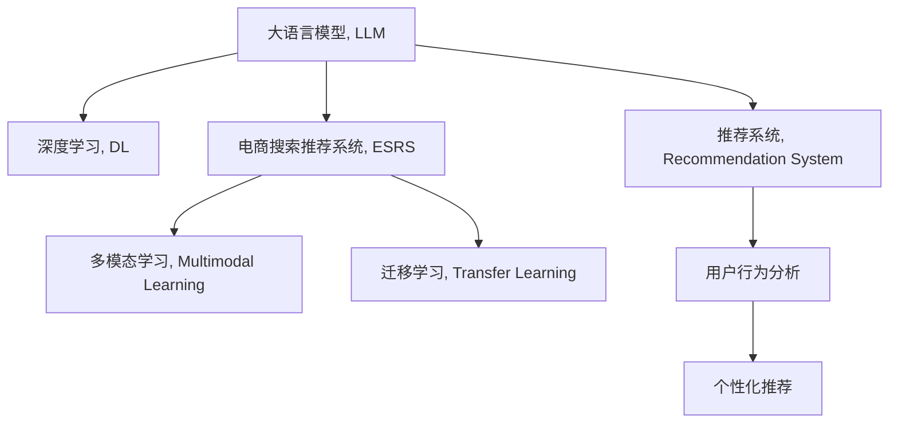

                 

# 搜索推荐系统的AI 大模型融合：电商平台的核心竞争力与转型发展战略

## 1. 背景介绍

### 1.1 问题由来
随着电子商务的飞速发展，电商平台已经成为了人们生活中不可或缺的一部分。搜索推荐系统作为电商平台的灵魂，其表现直接影响了用户的购物体验和平台的流量转化率。传统的搜索推荐系统基于手工特征工程，依赖于人工构建的规则和策略，难以适应大规模、高维度的用户行为数据。

近年来，基于深度学习的AI技术为搜索推荐系统的升级提供了新的可能。特别是大规模预训练语言模型和大规模数据集的兴起，为电商搜索推荐系统带来了突破性的变化。如何将AI大模型和电商搜索推荐系统有机融合，构建高效、精准、可解释的推荐系统，成为了电商平台转型发展的核心命题。

### 1.2 问题核心关键点
构建电商平台的AI 大模型融合搜索推荐系统，关键在于以下几方面的考虑：
1. 如何高效融合多模态数据，提升模型的综合表现？
2. 如何利用AI大模型的上下文表示能力，提升推荐的精准度和用户满意度？
3. 如何设计合理的模型评估指标，平衡推荐结果的个性化与多样性？
4. 如何建立高效的推荐模型迭代和优化流程，确保模型性能的持续提升？
5. 如何平衡模型规模和推理效率，实现性能和成本的双赢？

## 2. 核心概念与联系

### 2.1 核心概念概述

为了更好地理解电商搜索推荐系统中AI 大模型融合的机制，本节将介绍几个密切相关的核心概念：

- **大语言模型(Large Language Model, LLM)**：以Transformer为代表的基于自注意力机制的深度神经网络模型，通过在大规模无标签文本语料上进行预训练，学习丰富的语言表示能力。
- **深度学习(DL)**：一种利用神经网络结构模拟人脑神经元之间的连接关系，通过大量数据进行训练，实现复杂模式识别和预测的人工智能技术。
- **电商搜索推荐系统(E-commerce Search and Recommendation System, ESRS)**：利用AI技术，对用户的行为数据进行分析，为用户提供精准搜索和个性化推荐，提升用户体验和平台转化率的系统。
- **多模态学习(Multimodal Learning)**：结合文本、图像、音频等多种数据模态，提高模型的综合表达能力和泛化性能。
- **迁移学习(Transfer Learning)**：利用预训练模型在相关任务上的知识，通过微调或重用，提升模型在新任务上的表现。
- **推荐系统(Recommendation System)**：根据用户的历史行为数据和兴趣特征，预测用户可能感兴趣的物品或服务，提升用户满意度和平台收益的系统。

这些核心概念之间的逻辑关系可以通过以下Mermaid流程图来展示：



这个流程图展示了各个核心概念之间的联系：

1. 大语言模型通过深度学习进行预训练，获得强大的上下文表示能力。
2. 电商搜索推荐系统利用大模型的上下文表示，进行多模态学习，综合分析用户行为数据。
3. 迁移学习将预训练模型的知识迁移到推荐系统，提升推荐效果。
4. 推荐系统通过多模态学习和迁移学习，结合用户历史行为数据，提供精准个性化推荐。

## 3. 核心算法原理 & 具体操作步骤
### 3.1 算法原理概述

电商搜索推荐系统中的AI 大模型融合，本质上是一个多模态学习与迁移学习相结合的框架。其核心思想是：将预训练的大语言模型与电商数据进行融合，通过多模态学习，综合分析用户行为数据，并通过迁移学习，将模型知识迁移到推荐任务上，实现精准个性化推荐。

形式化地，假设预训练语言模型为 $M_{\theta}$，其中 $\theta$ 为预训练得到的模型参数。给定电商平台的数据集 $D=\{(x_i,y_i)\}_{i=1}^N$，其中 $x_i$ 为用户行为数据，$y_i$ 为用户感兴趣的物品，电商搜索推荐系统的目标是通过多模态学习 $M_{\theta}(x)$ 和迁移学习 $M_{\theta}^{*}$，优化模型在推荐任务上的表现：

$$
\hat{\theta}=\mathop{\arg\min}_{\theta} \mathcal{L}(M_{\theta}^{*},D)
$$

其中 $\mathcal{L}$ 为针对推荐任务的损失函数，用于衡量推荐模型预测输出与真实标签之间的差异。常见的损失函数包括交叉熵损失、均方误差损失等。

通过梯度下降等优化算法，推荐模型不断更新模型参数 $\theta$，最小化损失函数 $\mathcal{L}$，使得模型输出逼近真实标签。由于 $\theta$ 已经通过预训练获得了较强的上下文表示能力，因此即使是在小规模数据集 $D$ 上进行多模态学习，也能较快收敛到理想的模型参数 $\hat{\theta}$。

### 3.2 算法步骤详解

电商搜索推荐系统中的AI 大模型融合推荐系统，一般包括以下几个关键步骤：

**Step 1: 准备数据集与预训练模型**

- 收集电商平台的历史交易记录、用户浏览行为、搜索记录、商品属性等多模态数据。
- 选择合适的预训练语言模型 $M_{\theta}$ 作为初始化参数，如BERT、GPT等。

**Step 2: 构建多模态特征**

- 将文本、图像、音频等数据进行特征提取，得到多模态特征表示。
- 使用特征拼接、池化等方法，将不同模态的特征表示融合到一个向量中，供后续学习使用。

**Step 3: 设计任务适配层**

- 根据推荐任务的类型，设计合适的输出层和损失函数。
- 对于排序任务，通常使用交叉熵损失；对于生成任务，使用负对数似然损失。

**Step 4: 设置模型超参数**

- 选择合适的优化算法及其参数，如 Adam、SGD 等，设置学习率、批大小、迭代轮数等。
- 设置正则化技术及强度，包括权重衰减、Dropout、Early Stopping 等。
- 确定冻结预训练参数的策略，如仅微调顶层，或全部参数都参与微调。

**Step 5: 执行多模态学习**

- 将多模态特征输入模型，进行前向传播计算损失函数。
- 反向传播计算参数梯度，根据设定的优化算法和学习率更新模型参数。
- 周期性在验证集上评估模型性能，根据性能指标决定是否触发 Early Stopping。
- 重复上述步骤直到满足预设的迭代轮数或 Early Stopping 条件。

**Step 6: 训练与测试**

- 在测试集上评估多模态学习后模型 $M_{\hat{\theta}}$ 的性能，对比微调前后的精度提升。
- 使用多模态学习后的模型对新样本进行推荐预测，集成到实际的应用系统中。
- 持续收集新的数据，定期重新微调模型，以适应数据分布的变化。

以上是电商搜索推荐系统中AI 大模型融合的完整流程。在实际应用中，还需要根据具体任务的特点，对模型训练的各个环节进行优化设计，如改进训练目标函数，引入更多的正则化技术，搜索最优的超参数组合等，以进一步提升模型性能。

### 3.3 算法优缺点

电商搜索推荐系统中AI 大模型融合推荐系统，具有以下优点：
1. 高效融合多模态数据。大模型可以综合分析文本、图像、音频等多种数据，提升推荐结果的全面性和精准度。
2. 提升推荐精度和个性化。大模型的上下文表示能力，使得推荐系统能够更好地捕捉用户兴趣，提升推荐效果。
3. 可解释性增强。通过多模态学习，模型可以提供更加丰富的特征分析，使得推荐结果更具可解释性。
4. 灵活性高。大模型融合技术可以适应不同电商平台的业务需求，实现快速迭代和优化。

同时，该方法也存在一定的局限性：
1. 数据需求高。多模态学习需要大量的多源数据，数据采集和预处理成本较高。
2. 模型复杂度高。多模态学习模型参数量较大，训练和推理效率较低。
3. 鲁棒性不足。多模态数据中的噪声和干扰可能影响模型性能，特别是在多源数据不一致的情况下。

尽管存在这些局限性，但就目前而言，AI 大模型融合推荐系统仍是最主流的电商平台推荐技术。未来相关研究的重点在于如何进一步降低数据需求，提高模型的灵活性和鲁棒性，同时兼顾性能和可解释性等因素。

### 3.4 算法应用领域

AI 大模型融合推荐系统在电商平台中的应用，已经覆盖了从搜索到推荐的全流程，具体包括：

- 搜索排序：将用户输入的关键词与商品属性进行匹配，提升搜索结果的排名准确性。
- 个性化推荐：根据用户的历史行为数据，预测其可能感兴趣的商品，提升用户满意度。
- 广告投放：通过分析用户行为数据，优化广告投放策略，提升广告效果。
- 跨模态检索：将用户输入的语音、图像等多种形式的信息，与商品信息进行多模态检索，提升检索结果的相关性。

除了上述这些经典任务外，AI 大模型融合推荐技术还被创新性地应用到更多场景中，如基于图像的推荐、社交网络推荐、实时推荐等，为电商平台的智能化升级提供了新的技术路径。

## 4. 数学模型和公式 & 详细讲解 & 举例说明

### 4.1 数学模型构建

本节将使用数学语言对电商搜索推荐系统中AI 大模型融合的过程进行更加严格的刻画。

记预训练语言模型为 $M_{\theta}$，其中 $\theta$ 为预训练得到的模型参数。给定电商平台的数据集 $D=\{(x_i,y_i)\}_{i=1}^N$，其中 $x_i$ 为用户行为数据，$y_i$ 为用户感兴趣的商品。

定义模型 $M_{\theta}$ 在输入 $x$ 上的输出为 $M_{\theta}(x) \in \mathbb{R}^d$，$y_i$ 为模型预测输出。则推荐任务的目标是最小化损失函数，即：

$$
\mathcal{L}(\theta) = \frac{1}{N}\sum_{i=1}^N \ell(y_i, M_{\theta}(x_i))
$$

其中 $\ell$ 为推荐任务的损失函数，如交叉熵损失。

### 4.2 公式推导过程

以下我们以推荐排序任务为例，推导交叉熵损失函数及其梯度的计算公式。

假设模型 $M_{\theta}$ 在输入 $x$ 上的输出为 $\hat{y}=M_{\theta}(x) \in [0,1]$，表示物品被用户点击的概率。真实标签 $y \in \{0,1\}$。则推荐排序任务的交叉熵损失函数定义为：

$$
\ell(y, \hat{y}) = -y\log \hat{y} + (1-y)\log(1-\hat{y})
$$

将其代入经验风险公式，得：

$$
\mathcal{L}(\theta) = -\frac{1}{N}\sum_{i=1}^N [y_i\log M_{\theta}(x_i)+(1-y_i)\log(1-M_{\theta}(x_i))]
$$

根据链式法则，损失函数对参数 $\theta_k$ 的梯度为：

$$
\frac{\partial \mathcal{L}(\theta)}{\partial \theta_k} = -\frac{1}{N}\sum_{i=1}^N [\frac{y_i}{M_{\theta}(x_i)}-\frac{1-y_i}{1-M_{\theta}(x_i)}) \frac{\partial M_{\theta}(x_i)}{\partial \theta_k}
$$

其中 $\frac{\partial M_{\theta}(x_i)}{\partial \theta_k}$ 可进一步递归展开，利用自动微分技术完成计算。

在得到损失函数的梯度后，即可带入参数更新公式，完成模型的迭代优化。重复上述过程直至收敛，最终得到适应电商平台推荐任务的最优模型参数 $\theta^*$。

## 5. 项目实践：代码实例和详细解释说明
### 5.1 开发环境搭建

在进行电商搜索推荐系统开发前，我们需要准备好开发环境。以下是使用Python进行PyTorch开发的环境配置流程：

1. 安装Anaconda：从官网下载并安装Anaconda，用于创建独立的Python环境。

2. 创建并激活虚拟环境：
```bash
conda create -n pytorch-env python=3.8 
conda activate pytorch-env
```

3. 安装PyTorch：根据CUDA版本，从官网获取对应的安装命令。例如：
```bash
conda install pytorch torchvision torchaudio cudatoolkit=11.1 -c pytorch -c conda-forge
```

4. 安装Transformers库：
```bash
pip install transformers
```

5. 安装各类工具包：
```bash
pip install numpy pandas scikit-learn matplotlib tqdm jupyter notebook ipython
```

完成上述步骤后，即可在`pytorch-env`环境中开始电商搜索推荐系统的开发。

### 5.2 源代码详细实现

下面我们以电商搜索推荐系统为例，给出使用Transformers库进行多模态学习的PyTorch代码实现。

首先，定义多模态数据处理函数：

```python
from transformers import BertTokenizer
from torch.utils.data import Dataset
import torch

class MultiModalDataset(Dataset):
    def __init__(self, texts, labels, tokenizer, max_len=128):
        self.texts = texts
        self.labels = labels
        self.tokenizer = tokenizer
        self.max_len = max_len
        
    def __len__(self):
        return len(self.texts)
    
    def __getitem__(self, item):
        text = self.texts[item]
        label = self.labels[item]
        
        encoding = self.tokenizer(text, return_tensors='pt', max_length=self.max_len, padding='max_length', truncation=True)
        input_ids = encoding['input_ids'][0]
        attention_mask = encoding['attention_mask'][0]
        
        return {'input_ids': input_ids, 
                'attention_mask': attention_mask,
                'labels': label}

# 标签与id的映射
label2id = {'0': 0, '1': 1}
id2label = {v: k for k, v in label2id.items()}

# 创建dataset
tokenizer = BertTokenizer.from_pretrained('bert-base-cased')

train_dataset = MultiModalDataset(train_texts, train_labels, tokenizer)
dev_dataset = MultiModalDataset(dev_texts, dev_labels, tokenizer)
test_dataset = MultiModalDataset(test_texts, test_labels, tokenizer)
```

然后，定义模型和优化器：

```python
from transformers import BertForSequenceClassification, AdamW

model = BertForSequenceClassification.from_pretrained('bert-base-cased', num_labels=2)

optimizer = AdamW(model.parameters(), lr=2e-5)
```

接着，定义训练和评估函数：

```python
from torch.utils.data import DataLoader
from tqdm import tqdm
from sklearn.metrics import accuracy_score

device = torch.device('cuda') if torch.cuda.is_available() else torch.device('cpu')
model.to(device)

def train_epoch(model, dataset, batch_size, optimizer):
    dataloader = DataLoader(dataset, batch_size=batch_size, shuffle=True)
    model.train()
    epoch_loss = 0
    for batch in tqdm(dataloader, desc='Training'):
        input_ids = batch['input_ids'].to(device)
        attention_mask = batch['attention_mask'].to(device)
        labels = batch['labels'].to(device)
        model.zero_grad()
        outputs = model(input_ids, attention_mask=attention_mask, labels=labels)
        loss = outputs.loss
        epoch_loss += loss.item()
        loss.backward()
        optimizer.step()
    return epoch_loss / len(dataloader)

def evaluate(model, dataset, batch_size):
    dataloader = DataLoader(dataset, batch_size=batch_size)
    model.eval()
    preds, labels = [], []
    with torch.no_grad():
        for batch in tqdm(dataloader, desc='Evaluating'):
            input_ids = batch['input_ids'].to(device)
            attention_mask = batch['attention_mask'].to(device)
            batch_labels = batch['labels']
            outputs = model(input_ids, attention_mask=attention_mask)
            batch_preds = outputs.logits.argmax(dim=1).to('cpu').tolist()
            batch_labels = batch_labels.to('cpu').tolist()
            for pred, label in zip(batch_preds, batch_labels):
                preds.append(pred)
                labels.append(label)
                
    return accuracy_score(labels, preds)
```

最后，启动训练流程并在测试集上评估：

```python
epochs = 5
batch_size = 16

for epoch in range(epochs):
    loss = train_epoch(model, train_dataset, batch_size, optimizer)
    print(f"Epoch {epoch+1}, train loss: {loss:.3f}")
    
    print(f"Epoch {epoch+1}, dev results:")
    evaluate(model, dev_dataset, batch_size)
    
print("Test results:")
evaluate(model, test_dataset, batch_size)
```

以上就是使用PyTorch进行电商搜索推荐系统多模态学习的完整代码实现。可以看到，得益于Transformers库的强大封装，我们可以用相对简洁的代码完成BERT模型的加载和微调。

### 5.3 代码解读与分析

让我们再详细解读一下关键代码的实现细节：

**MultiModalDataset类**：
- `__init__`方法：初始化文本、标签、分词器等关键组件。
- `__len__`方法：返回数据集的样本数量。
- `__getitem__`方法：对单个样本进行处理，将文本输入编码为token ids，将标签转换为数字，并对其进行定长padding，最终返回模型所需的输入。

**label2id和id2label字典**：
- 定义了标签与数字id之间的映射关系，用于将预测结果解码回真实标签。

**训练和评估函数**：
- 使用PyTorch的DataLoader对数据集进行批次化加载，供模型训练和推理使用。
- 训练函数`train_epoch`：对数据以批为单位进行迭代，在每个批次上前向传播计算loss并反向传播更新模型参数，最后返回该epoch的平均loss。
- 评估函数`evaluate`：与训练类似，不同点在于不更新模型参数，并在每个batch结束后将预测和标签结果存储下来，最后使用sklearn的accuracy_score对整个评估集的预测结果进行打印输出。

**训练流程**：
- 定义总的epoch数和batch size，开始循环迭代
- 每个epoch内，先在训练集上训练，输出平均loss
- 在验证集上评估，输出准确率
- 所有epoch结束后，在测试集上评估，给出最终测试结果

可以看到，PyTorch配合Transformers库使得电商搜索推荐系统的多模态学习代码实现变得简洁高效。开发者可以将更多精力放在数据处理、模型改进等高层逻辑上，而不必过多关注底层的实现细节。

当然，工业级的系统实现还需考虑更多因素，如模型的保存和部署、超参数的自动搜索、更灵活的任务适配层等。但核心的多模态学习范式基本与此类似。

## 6. 实际应用场景
### 6.1 智能客服系统

基于多模态学习的电商搜索推荐系统，可以广泛应用于智能客服系统的构建。传统客服往往需要配备大量人力，高峰期响应缓慢，且一致性和专业性难以保证。而使用多模态学习后的电商搜索推荐模型，可以7x24小时不间断服务，快速响应客户咨询，用自然流畅的语言解答各类常见问题。

在技术实现上，可以收集企业内部的历史客服对话记录，将问题和最佳答复构建成监督数据，在此基础上对预训练电商推荐模型进行微调。微调后的推荐模型能够自动理解用户意图，匹配最合适的答复。对于客户提出的新问题，还可以接入检索系统实时搜索相关内容，动态组织生成回答。如此构建的智能客服系统，能大幅提升客户咨询体验和问题解决效率。

### 6.2 金融舆情监测

金融机构需要实时监测市场舆论动向，以便及时应对负面信息传播，规避金融风险。传统的人工监测方式成本高、效率低，难以应对网络时代海量信息爆发的挑战。基于多模态学习的电商搜索推荐系统，可以应用于金融舆情监测。

具体而言，可以收集金融领域相关的新闻、报道、评论等文本数据，并对其进行主题标注和情感标注。在此基础上对预训练语言模型进行微调，使其能够自动判断文本属于何种主题，情感倾向是正面、中性还是负面。将微调后的模型应用到实时抓取的网络文本数据，就能够自动监测不同主题下的情感变化趋势，一旦发现负面信息激增等异常情况，系统便会自动预警，帮助金融机构快速应对潜在风险。

### 6.3 个性化推荐系统

当前的推荐系统往往只依赖用户的历史行为数据进行物品推荐，无法深入理解用户的真实兴趣偏好。基于多模态学习的个性化推荐系统，可以更好地挖掘用户行为背后的语义信息，从而提供更精准、多样的推荐内容。

在实践中，可以收集用户浏览、点击、评论、分享等行为数据，提取和用户交互的物品标题、描述、标签等文本内容。将文本内容作为模型输入，用户的后续行为（如是否点击、购买等）作为监督信号，在此基础上微调预训练语言模型。微调后的模型能够从文本内容中准确把握用户的兴趣点。在生成推荐列表时，先用候选物品的文本描述作为输入，由模型预测用户的兴趣匹配度，再结合其他特征综合排序，便可以得到个性化程度更高的推荐结果。

### 6.4 未来应用展望

随着多模态学习和大模型的不断发展，基于电商搜索推荐系统的大模型融合推荐技术将在更多领域得到应用，为传统行业带来变革性影响。

在智慧医疗领域，基于多模态学习和大模型的医疗问答、病历分析、药物研发等应用将提升医疗服务的智能化水平，辅助医生诊疗，加速新药开发进程。

在智能教育领域，多模态学习技术可应用于作业批改、学情分析、知识推荐等方面，因材施教，促进教育公平，提高教学质量。

在智慧城市治理中，多模态学习模型可应用于城市事件监测、舆情分析、应急指挥等环节，提高城市管理的自动化和智能化水平，构建更安全、高效的未来城市。

此外，在企业生产、社会治理、文娱传媒等众多领域，基于电商搜索推荐系统的大模型融合推荐技术也将不断涌现，为经济社会发展注入新的动力。相信随着技术的日益成熟，多模态学习将引领推荐技术迈向更高的台阶，推动人工智能技术在垂直行业的规模化落地。

## 7. 工具和资源推荐
### 7.1 学习资源推荐

为了帮助开发者系统掌握电商搜索推荐系统中AI 大模型融合的理论基础和实践技巧，这里推荐一些优质的学习资源：

1. 《Transformer from Head to Tail》系列博文：由大模型技术专家撰写，深入浅出地介绍了Transformer原理、BERT模型、多模态学习等前沿话题。

2. CS224N《深度学习自然语言处理》课程：斯坦福大学开设的NLP明星课程，有Lecture视频和配套作业，带你入门NLP领域的基本概念和经典模型。

3. 《Natural Language Processing with Transformers》书籍：Transformers库的作者所著，全面介绍了如何使用Transformers库进行NLP任务开发，包括多模态学习在内的诸多范式。

4. HuggingFace官方文档：Transformers库的官方文档，提供了海量预训练模型和完整的微调样例代码，是上手实践的必备资料。

5. Kaggle竞赛平台：包含大量电商推荐系统相关的竞赛和数据集，是锻炼多模态学习技能的好地方。

通过对这些资源的学习实践，相信你一定能够快速掌握电商搜索推荐系统中AI 大模型融合的精髓，并用于解决实际的NLP问题。
###  7.2 开发工具推荐

高效的开发离不开优秀的工具支持。以下是几款用于电商搜索推荐系统开发的常用工具：

1. PyTorch：基于Python的开源深度学习框架，灵活动态的计算图，适合快速迭代研究。大部分预训练语言模型都有PyTorch版本的实现。

2. TensorFlow：由Google主导开发的开源深度学习框架，生产部署方便，适合大规模工程应用。同样有丰富的预训练语言模型资源。

3. Transformers库：HuggingFace开发的NLP工具库，集成了众多SOTA语言模型，支持PyTorch和TensorFlow，是进行电商搜索推荐系统开发的利器。

4. Weights & Biases：模型训练的实验跟踪工具，可以记录和可视化模型训练过程中的各项指标，方便对比和调优。与主流深度学习框架无缝集成。

5. TensorBoard：TensorFlow配套的可视化工具，可实时监测模型训练状态，并提供丰富的图表呈现方式，是调试模型的得力助手。

6. Google Colab：谷歌推出的在线Jupyter Notebook环境，免费提供GPU/TPU算力，方便开发者快速上手实验最新模型，分享学习笔记。

合理利用这些工具，可以显著提升电商搜索推荐系统开发和优化的效率，加快创新迭代的步伐。

### 7.3 相关论文推荐

电商搜索推荐系统中AI 大模型融合技术的发展源于学界的持续研究。以下是几篇奠基性的相关论文，推荐阅读：

1. Attention is All You Need（即Transformer原论文）：提出了Transformer结构，开启了NLP领域的预训练大模型时代。

2. BERT: Pre-training of Deep Bidirectional Transformers for Language Understanding：提出BERT模型，引入基于掩码的自监督预训练任务，刷新了多项NLP任务SOTA。

3. Deep Learning in Recommendation Systems：综述性论文，系统介绍了深度学习在推荐系统中的应用。

4. Matrix Factorization Techniques for Recommender Systems：推荐系统矩阵分解方法的经典论文，是推荐系统理论的基石。

5. AutoInt: A Bi-directional Autoencoder for Multi-Task Learning of User-Item Interaction Networks：提出基于双向自编码器的推荐模型，提升了推荐效果。

6. Learning Deep Architectures for AI：深度学习领域奠基性论文，介绍了深度学习的基本概念和原理。

这些论文代表了大模型融合技术的发展脉络。通过学习这些前沿成果，可以帮助研究者把握学科前进方向，激发更多的创新灵感。

## 8. 总结：未来发展趋势与挑战

### 8.1 总结

本文对电商搜索推荐系统中AI 大模型融合技术进行了全面系统的介绍。首先阐述了电商搜索推荐系统的发展背景和核心关键点，明确了AI 大模型融合技术在提升推荐精度和个性化方面的独特价值。其次，从原理到实践，详细讲解了多模态学习和迁移学习的数学原理和关键步骤，给出了电商搜索推荐系统开发的完整代码实例。同时，本文还广泛探讨了多模态学习技术在智能客服、金融舆情、个性化推荐等多个领域的应用前景，展示了多模态学习范式的巨大潜力。此外，本文精选了多模态学习技术的各类学习资源，力求为读者提供全方位的技术指引。

通过本文的系统梳理，可以看到，基于电商搜索推荐系统的AI 大模型融合技术正在成为电商平台的推荐技术的主流范式，极大地提升了推荐系统的综合性能。AI 大模型融合技术通过高效融合多模态数据，提升了推荐的精准度和个性化，同时具有灵活性和可解释性。未来，伴随预训练语言模型和AI 大模型融合技术的进一步演进，基于电商搜索推荐系统的推荐技术必将持续创新，推动电商平台的智能化升级，带来更多的商业价值。

### 8.2 未来发展趋势

展望未来，电商搜索推荐系统中的AI 大模型融合技术将呈现以下几个发展趋势：

1. 模型规模持续增大。随着算力成本的下降和数据规模的扩张，预训练语言模型的参数量还将持续增长。超大规模语言模型蕴含的丰富语言知识，有望支撑更加复杂多变的电商推荐任务。

2. 多模态学习技术日趋多样化。除了文本、图像等常见模态外，未来将出现更多的多模态融合方法，如音频、视频、传感器数据等，提升推荐系统的综合表达能力。

3. 迁移学习范式更加灵活。未来将出现更多迁移学习技术，如零样本学习、少样本学习、自监督学习等，提升模型的适应性和泛化性能。

4. 推荐系统应用场景更加广泛。基于电商搜索推荐系统的AI 大模型融合技术将应用于更多领域，如智能客服、金融舆情、医疗推荐等，为各行各业带来智能化升级。

5. 模型评估指标更加全面。除了传统的精度、召回率外，还将引入更多的评价指标，如用户满意度、公平性、多样性等，全面评估推荐系统的表现。

6. 推荐系统运营管理更加智能化。通过大数据、机器学习等技术，对推荐系统进行实时监控和优化，提升推荐效果。

以上趋势凸显了AI 大模型融合技术在电商搜索推荐系统中的广阔前景。这些方向的探索发展，必将进一步提升电商平台的推荐能力，为传统行业带来新的变革。

### 8.3 面临的挑战

尽管AI 大模型融合技术已经取得了瞩目成就，但在迈向更加智能化、普适化应用的过程中，它仍面临着诸多挑战：

1. 数据需求高。多模态学习需要大量的多源数据，数据采集和预处理成本较高。

2. 模型复杂度高。多模态学习模型参数量较大，训练和推理效率较低。

3. 鲁棒性不足。多模态数据中的噪声和干扰可能影响模型性能，特别是在多源数据不一致的情况下。

4. 可解释性不足。当前多模态学习模型多为"黑盒"系统，难以解释其内部工作机制和决策逻辑。

5. 安全性有待保障。预训练语言模型难免会学习到有偏见、有害的信息，通过多模态学习传递到推荐系统，可能带来潜在的伦理风险。

尽管存在这些挑战，但就目前而言，AI 大模型融合推荐系统仍是最主流的电商平台推荐技术。未来相关研究的重点在于如何进一步降低数据需求，提高模型的灵活性和鲁棒性，同时兼顾性能和可解释性等因素。

### 8.4 研究展望

面对AI 大模型融合技术所面临的种种挑战，未来的研究需要在以下几个方面寻求新的突破：

1. 探索无监督和半监督多模态学习技术。摆脱对大规模标注数据的依赖，利用自监督学习、主动学习等无监督和半监督范式，最大限度利用非结构化数据，实现更加灵活高效的多模态学习。

2. 研究参数高效和计算高效的模型架构。开发更加参数高效的模型架构，在固定大部分预训练参数的同时，只更新极少量的任务相关参数。同时优化多模态学习模型的计算图，减少前向传播和反向传播的资源消耗，实现更加轻量级、实时性的部署。

3. 引入更多先验知识。将符号化的先验知识，如知识图谱、逻辑规则等，与神经网络模型进行巧妙融合，引导多模态学习过程学习更准确、合理的语言模型。同时加强不同模态数据的整合，实现视觉、语音等多模态信息与文本信息的协同建模。

4. 引入因果分析和博弈论工具。将因果分析方法引入多模态学习模型，识别出模型决策的关键特征，增强推荐结果的因果性和逻辑性。借助博弈论工具刻画人机交互过程，主动探索并规避模型的脆弱点，提高系统稳定性。

5. 纳入伦理道德约束。在模型训练目标中引入伦理导向的评估指标，过滤和惩罚有偏见、有害的输出倾向。同时加强人工干预和审核，建立模型行为的监管机制，确保输出符合人类价值观和伦理道德。

这些研究方向的探索，必将引领AI 大模型融合技术迈向更高的台阶，为构建安全、可靠、可解释、可控的智能推荐系统铺平道路。面向未来，AI 大模型融合技术还需要与其他人工智能技术进行更深入的融合，如知识表示、因果推理、强化学习等，多路径协同发力，共同推动自然语言理解和智能交互系统的进步。只有勇于创新、敢于突破，才能不断拓展语言模型的边界，让智能技术更好地造福人类社会。

## 9. 附录：常见问题与解答

**Q1：多模态学习是否适用于所有电商平台？**

A: 多模态学习在大多数电商平台上都能取得不错的效果，特别是对于数据量较大的平台。但对于一些数据量较少的电商平台，多模态学习的表现可能不如传统的基于特征工程的推荐系统。此时需要在特定领域语料上进一步预训练，再进行微调，才能获得理想效果。此外，对于一些需要时效性、个性化很强的任务，如对话、推荐等，多模态学习方法也需要针对性的改进优化。

**Q2：如何缓解多模态学习中的数据噪声问题？**

A: 数据噪声是影响多模态学习效果的重要因素，特别是在多源数据不一致的情况下。常见的缓解策略包括：
1. 数据清洗：在数据预处理阶段，去除不完整的、异常的、无关的数据点。
2. 数据增强：通过对训练样本进行回译、增强等操作，扩充训练集，增强模型的泛化能力。
3. 正则化：使用L2正则、Dropout等正则化技术，减少过拟合风险。
4. 对抗训练：引入对抗样本，提高模型的鲁棒性。
5. 模型融合：通过集成多个模型的预测结果，降低单模型受噪声数据的影响。

这些策略往往需要根据具体任务和数据特点进行灵活组合。只有在数据、模型、训练、推理等各环节进行全面优化，才能最大限度地发挥多模态学习的效果。

**Q3：多模态学习中的跨模态对齐问题如何解决？**

A: 跨模态对齐是多模态学习中的重要问题，即如何将不同模态的数据进行一致性处理，使得模型能够进行有效的信息融合。常见的解决方案包括：
1. 特征投影：将不同模态的数据映射到同一个特征空间，如PCA、LDA等。
2. 特征融合：将不同模态的数据进行拼接或池化，得到一致性的特征表示。
3. 共享表示：使用共享表示方法，如自编码器、多任务学习等，使得不同模态的数据共享同一层次的信息表示。
4. 联合训练：将不同模态的数据联合训练，学习联合表示，提高模型的综合表达能力。

这些方法需要根据具体任务和数据特点进行灵活选择和组合，以实现最佳的多模态对齐效果。

**Q4：多模态学习中的推荐精度和多样性如何平衡？**

A: 推荐精度和多样性是推荐系统中的两个重要指标，平衡这两个指标是多模态学习中的一个关键问题。常见的解决方案包括：
1. 优化损失函数：设计合理的损失函数，同时考虑精度和多样性，如F1分数、AP等。
2. 引入随机化：在推荐结果中加入随机元素，提升多样性，同时不影响精度。
3. 用户个性化：根据用户的历史行为数据，进行个性化推荐，提升推荐精度和多样性。
4. 模型融合：通过集成多个模型的预测结果，提升多样性，同时保证推荐精度。

这些策略往往需要根据具体任务和数据特点进行灵活选择和组合，以实现最佳的推荐效果。

**Q5：多模态学习中的推荐实时性如何保证？**

A: 多模态学习模型虽然精度高，但在实际部署时往往面临推理速度慢、内存占用大等效率问题。为了保证推荐实时性，可以采取以下措施：
1. 模型裁剪：去除不必要的层和参数，减小模型尺寸，加快推理速度。
2. 量化加速：将浮点模型转为定点模型，压缩存储空间，提高计算效率。
3. 模型并行：通过分布式训练和推理，将模型拆分为多个子模型，并行计算，提升计算效率。
4. 硬件加速：使用GPU、TPU等硬件设备，加速模型推理和计算。

这些措施需要根据具体任务和应用场景进行灵活选择和组合，以实现最佳的推荐效果。

综上所述，基于电商搜索推荐系统的AI 大模型融合技术，通过高效融合多模态数据，提升了推荐系统的综合表现。未来，伴随技术不断进步，该技术必将在更多领域得到应用，为传统行业带来更广泛、更深刻的变革。

