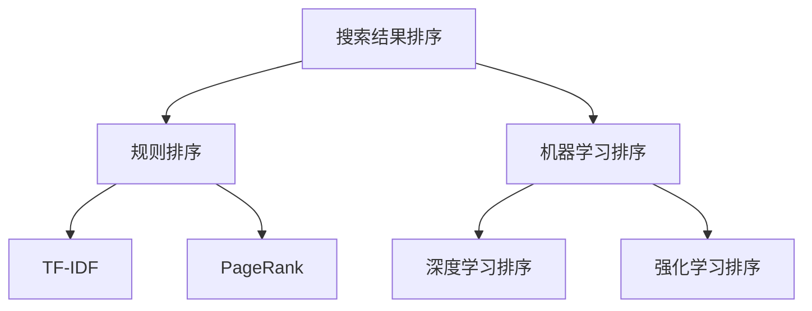

                 

# 搜索结果排序：从规则到AI的进化

## 1. 背景介绍

在互联网时代，搜索引擎早已成为人们获取信息、解决问题不可或缺的工具。然而，用户在使用搜索引擎时，常常会感到搜索结果的排序与期望不符，或者被不相关的内容所误导。这背后，是搜索引擎排序算法的选择和优化。

传统搜索引擎采用的主要是基于规则的排序算法，如PageRank、TF-IDF等，这些算法虽然能够对网页进行基本排序，但对于复杂、多变的用户需求和网页内容，显得力不从心。而随着人工智能技术的发展，AI驱动的排序算法逐渐进入大众视野，成为新一代搜索引擎排序的关键。

本文将从规则排序和AI排序两方面，系统介绍搜索引擎排序算法的发展历程，以及背后的算法原理和应用实践。

## 2. 核心概念与联系

### 2.1 核心概念概述

为更好地理解搜索引擎排序算法，本节将介绍几个密切相关的核心概念：

- 搜索结果排序（Search Ranking）：搜索引擎根据用户查询输入，从海量的搜索结果中筛选、排序，并提供给用户的过程。

- 规则排序（Rule-Based Ranking）：基于网页特征（如链接数量、文本匹配等），采用预定义的规则（如PageRank、TF-IDF等）对搜索结果进行排序的算法。

- 机器学习排序（Machine Learning Ranking）：通过机器学习模型对网页特征进行建模，学习网页与查询的相关性，以更智能的方式对搜索结果进行排序的算法。

- 深度学习排序（Deep Learning Ranking）：基于深度神经网络，利用端到端的方式，从原始网页数据直接学习网页与查询的相关性，实现更高效的排序。

- 强化学习排序（Reinforcement Learning Ranking）：通过奖励机制，训练模型在每一次用户交互中学习最优的排序策略，以适应用户动态变化的偏好和需求。

这些核心概念之间的逻辑关系可以通过以下Mermaid流程图来展示：



这个流程图展示了大规模语言模型微调的核心概念及其之间的关系：

1. 搜索结果排序是搜索引擎的核心功能。
2. 规则排序采用TF-IDF、PageRank等简单算法，对网页进行基本排序。
3. 机器学习排序基于统计学习理论，对网页特征进行建模。
4. 深度学习排序利用神经网络，端到端地学习网页与查询的相关性。
5. 强化学习排序通过奖励机制，不断优化排序策略。

这些概念共同构成了搜索引擎排序的核心框架，使其能够对用户查询输入，准确筛选并排序相关网页。

## 3. 核心算法原理 & 具体操作步骤
### 3.1 算法原理概述

搜索引擎的排序算法可以分为规则排序和AI排序两大类。

规则排序算法一般基于预定义的网页特征，通过统计学习模型对其进行加权，最终生成排序结果。例如，TF-IDF（Term Frequency-Inverse Document Frequency）算法通过计算单词在网页中的出现频率和文档频率，对每个网页进行加权，并按照权重大小进行排序。

AI排序算法则利用机器学习或深度学习模型，对网页与查询的相关性进行建模，自动学习排序规则。AI排序算法可以分为有监督学习和无监督学习两大类：

- 有监督学习：使用标注数据训练模型，模型学习网页与查询之间的相关性，并根据相关性进行排序。
- 无监督学习：无需标注数据，通过自学习的方式对网页进行排序，例如通过聚类算法对网页进行分组，并对组内进行排序。

### 3.2 算法步骤详解

下面，我们将详细介绍规则排序和AI排序的详细步骤。

#### 3.2.1 规则排序步骤

1. 收集数据：收集大量网页数据和用户查询数据，并标注网页与查询的相关性。
2. 特征工程：根据网页内容、链接结构、网页元数据等特征，设计特征提取函数，生成特征向量。
3. 模型训练：根据标注数据，训练TF-IDF等规则排序模型，学习网页与查询的相关性权重。
4. 排序计算：对于新的查询输入，计算网页与查询的相关性得分，并根据得分进行排序。

#### 3.2.2 机器学习排序步骤

1. 数据预处理：对原始网页数据进行清洗、分词、去停用词等预处理操作。
2. 特征提取：将预处理后的网页数据转换为向量表示，例如使用TF-IDF、Word2Vec等方法。
3. 模型训练：根据标注数据，训练机器学习模型，例如线性回归、支持向量机、决策树等。
4. 排序计算：对于新的查询输入，使用训练好的模型预测网页与查询的相关性得分，并根据得分进行排序。

#### 3.2.3 深度学习排序步骤

1. 数据预处理：对原始网页数据进行清洗、分词、去停用词等预处理操作。
2. 特征提取：将预处理后的网页数据转换为向量表示，例如使用TF-IDF、Word2Vec等方法。
3. 模型训练：根据标注数据，训练深度学习模型，例如使用神经网络、CNN、RNN等。
4. 排序计算：对于新的查询输入，使用训练好的模型预测网页与查询的相关性得分，并根据得分进行排序。

### 3.3 算法优缺点

规则排序算法具有以下优点：
- 模型简单，易于理解和解释。
- 对标注数据依赖较小，适用于数据量较小的场景。

规则排序算法也存在以下缺点：
- 特征工程工作量较大，需要人工设计特征。
- 对复杂、多变的用户需求和网页内容适应性较差。
- 无法动态学习，难以适应用户的动态变化需求。

AI排序算法则具有以下优点：
- 能够自动学习特征和排序规则，无需人工干预。
- 适应性强，能够适应用户的动态变化需求。
- 精度高，能够在复杂场景下取得优秀排序结果。

AI排序算法也存在以下缺点：
- 对标注数据依赖较大，需要大量的标注数据。
- 模型复杂，解释性较差。
- 对算力和存储资源要求较高，训练和推理成本高。

### 3.4 算法应用领域

规则排序算法和AI排序算法在不同的应用场景中各有优劣。

- 规则排序算法适用于对搜索结果的初步筛选和排序，例如新闻、百科等标准化程度较高的内容。
- AI排序算法适用于对复杂查询的高级排序，例如电子商务、旅游、房地产等个性化需求较强的领域。

具体而言，以下是规则排序和AI排序在各领域的应用案例：

- 新闻领域：传统的新闻网站通常采用TF-IDF等规则排序算法，对新闻进行初步筛选和排序。
- 电子商务领域：电子商务平台如淘宝、京东等，使用机器学习排序算法，对搜索结果进行个性化排序，提升用户体验。
- 旅游领域：携程、去哪儿等旅游平台，使用深度学习排序算法，对用户查询输入进行个性化推荐，提高转化率。
- 金融领域：银行、证券等金融平台，使用强化学习排序算法，对搜索结果进行动态调整，增强风险控制能力。

## 4. 数学模型和公式 & 详细讲解 & 举例说明

### 4.1 数学模型构建

搜索引擎排序算法可以通过多种数学模型进行建模，以下以机器学习排序算法为例，介绍常见的数学模型。

假设查询为 $q$，网页为 $d$，网页与查询的相关性为 $r$，机器学习模型的目标是最小化预测误差 $e$，即：

$$
\min_{r} \mathbb{E}[e(r,q,d)]
$$

其中 $e$ 为预测误差函数，可以选用均方误差（MSE）、平均绝对误差（MAE）等。

### 4.2 公式推导过程

以线性回归模型为例，假设模型为 $y = \theta^T x + b$，其中 $y$ 为预测结果，$x$ 为特征向量，$\theta$ 为模型参数，$b$ 为偏置项。最小化均方误差 $e$ 的目标函数为：

$$
\min_{\theta, b} \frac{1}{N} \sum_{i=1}^N (y_i - (\theta^T x_i + b))^2
$$

其中 $N$ 为样本数量，$y_i$ 为实际结果，$x_i$ 为特征向量。

通过求解目标函数的最小值，即可得到最优的模型参数 $\theta$ 和偏置 $b$。

### 4.3 案例分析与讲解

假设我们有一个电商平台的商品推荐系统，用户输入查询 "夏天穿什么"，系统需要从商品数据库中筛选出相关商品进行推荐。此时，可以使用机器学习排序算法，对商品标题、描述等特征进行建模，预测商品与查询的相关性，并按照相关性进行排序。

对于每个商品 $d$，可以提取特征 $x_i$，例如商品标题、价格、用户评价等。使用线性回归模型对商品与查询的相关性进行建模，得到模型参数 $\theta$ 和偏置 $b$。对于新的查询输入 $q$，计算每个商品的相关性得分 $r$，并按照得分进行排序，推荐得分最高的商品给用户。

## 5. 项目实践：代码实例和详细解释说明

### 5.1 开发环境搭建

在进行搜索排序算法开发前，我们需要准备好开发环境。以下是使用Python进行TensorFlow开发的工程环境配置流程：

1. 安装Anaconda：从官网下载并安装Anaconda，用于创建独立的Python环境。

2. 创建并激活虚拟环境：
```bash
conda create -n tf-env python=3.8 
conda activate tf-env
```

3. 安装TensorFlow：根据CUDA版本，从官网获取对应的安装命令。例如：
```bash
conda install tensorflow -c pytorch -c conda-forge
```

4. 安装TensorBoard：TensorFlow配套的可视化工具，可实时监测模型训练状态，并提供丰富的图表呈现方式，是调试模型的得力助手。
```bash
pip install tensorboard
```

5. 安装TensorFlow Addons：提供更多高级特性，例如深度学习排序算法。
```bash
pip install tensorflow-addons
```

完成上述步骤后，即可在`tf-env`环境中开始搜索排序算法实践。

### 5.2 源代码详细实现

下面以电商平台的商品推荐系统为例，给出使用TensorFlow进行机器学习排序的PyTorch代码实现。

首先，定义数据集：

```python
import tensorflow as tf
import tensorflow_addons as addons

class Dataset(tf.data.Dataset):
    def __init__(self, data, labels):
        self.data = data
        self.labels = labels
    
    def __len__(self):
        return len(self.data)
    
    def __getitem__(self, idx):
        return self.data[idx], self.labels[idx]
```

然后，定义模型：

```python
class LinearRegression(tf.keras.Model):
    def __init__(self, input_shape, output_shape):
        super(LinearRegression, self).__init__()
        self.linear = tf.keras.layers.Dense(output_shape, input_shape=input_shape)
    
    def call(self, inputs):
        return self.linear(inputs)
```

接着，定义优化器和损失函数：

```python
model = LinearRegression(input_shape=(3,), output_shape=1)
optimizer = tf.keras.optimizers.Adam(learning_rate=0.01)
loss_fn = tf.keras.losses.MeanSquaredError()

def train_step(data, labels):
    with tf.GradientTape() as tape:
        predictions = model(data)
        loss = loss_fn(labels, predictions)
    gradients = tape.gradient(loss, model.trainable_variables)
    optimizer.apply_gradients(zip(gradients, model.trainable_variables))
    return loss

def train_epoch(data, labels):
    train_loss = 0.0
    for data, labels in data:
        loss = train_step(data, labels)
        train_loss += loss
    return train_loss / len(data)

def evaluate(data, labels):
    eval_loss = 0.0
    for data, labels in data:
        predictions = model(data)
        eval_loss += loss_fn(labels, predictions)
    return eval_loss / len(data)
```

最后，启动训练流程并在测试集上评估：

```python
epochs = 100
batch_size = 32

for epoch in range(epochs):
    train_loss = train_epoch(train_dataset, train_labels)
    eval_loss = evaluate(test_dataset, test_labels)
    print(f"Epoch {epoch+1}, train loss: {train_loss:.3f}, eval loss: {eval_loss:.3f}")
    
print("Evaluation results:")
print(f"Mean squared error: {eval_loss:.3f}")
```

以上就是使用TensorFlow进行机器学习排序的完整代码实现。可以看到，TensorFlow提供了强大的计算图支持，使得模型构建和训练变得简洁高效。

### 5.3 代码解读与分析

让我们再详细解读一下关键代码的实现细节：

**Dataset类**：
- `__init__`方法：初始化数据和标签，构建DataLoader。
- `__len__`方法：返回数据集的样本数量。
- `__getitem__`方法：对单个样本进行处理，返回数据和标签。

**LinearRegression类**：
- `__init__`方法：定义模型的输入和输出形状。
- `call`方法：前向传播计算预测结果。

**优化器和损失函数**：
- 使用Adam优化器进行梯度下降，损失函数使用均方误差。
- `train_step`方法：计算单个样本的损失，并反向传播更新模型参数。
- `train_epoch`方法：对整个训练集进行迭代，计算平均损失。
- `evaluate`方法：对整个测试集进行迭代，计算平均损失。

**训练流程**：
- 定义总的epoch数和批大小，开始循环迭代。
- 每个epoch内，先在训练集上训练，输出平均损失。
- 在测试集上评估，输出均方误差。
- 所有epoch结束后，在测试集上评估，给出最终测试结果。

可以看到，TensorFlow提供了完善的高级API和工具，使得搜索排序算法的开发变得简单高效。开发者可以将更多精力放在算法改进和应用实践上，而不必过多关注底层实现细节。

当然，工业级的系统实现还需考虑更多因素，如模型的保存和部署、超参数的自动搜索、更灵活的模型架构等。但核心的排序算法基本与此类似。

## 6. 实际应用场景
### 6.1 智能客服系统

基于机器学习排序的智能客服系统，可以显著提升客服系统的响应速度和准确性。传统客服系统依赖人工客服，响应速度慢，且无法处理复杂问题。而基于机器学习排序的智能客服系统，能够根据用户输入进行智能匹配，快速回答常见问题，并提供个性化推荐。

在技术实现上，可以收集用户历史咨询记录和常见问题，构建标注数据集，在此基础上对模型进行训练。训练好的模型能够自动理解用户意图，匹配最合适的答案模板进行回复。对于用户提出的新问题，还可以接入检索系统实时搜索相关内容，动态组织生成回答。如此构建的智能客服系统，能大幅提升客户咨询体验和问题解决效率。

### 6.2 金融舆情监测

金融领域需要实时监测市场舆论动向，以便及时应对负面信息传播，规避金融风险。传统的人工监测方式成本高、效率低，难以应对网络时代海量信息爆发的挑战。基于机器学习排序的文本分类和情感分析技术，为金融舆情监测提供了新的解决方案。

具体而言，可以收集金融领域相关的新闻、报道、评论等文本数据，并对其进行主题标注和情感标注。在此基础上对模型进行训练，使其能够自动判断文本属于何种主题，情感倾向是正面、中性还是负面。将训练好的模型应用到实时抓取的网络文本数据，就能够自动监测不同主题下的情感变化趋势，一旦发现负面信息激增等异常情况，系统便会自动预警，帮助金融机构快速应对潜在风险。

### 6.3 个性化推荐系统

当前的推荐系统往往只依赖用户的历史行为数据进行物品推荐，无法深入理解用户的真实兴趣偏好。基于机器学习排序的推荐系统，可以更好地挖掘用户行为背后的语义信息，从而提供更精准、多样的推荐内容。

在实践中，可以收集用户浏览、点击、评论、分享等行为数据，提取和用户交互的物品标题、描述、标签等文本内容。将文本内容作为模型输入，用户的后续行为（如是否点击、购买等）作为监督信号，在此基础上对模型进行训练。训练好的模型能够从文本内容中准确把握用户的兴趣点。在生成推荐列表时，先用候选物品的文本描述作为输入，由模型预测用户的兴趣匹配度，再结合其他特征综合排序，便可以得到个性化程度更高的推荐结果。

### 6.4 未来应用展望

随着机器学习排序技术的发展，基于排序的AI系统将在更多领域得到应用，为传统行业带来变革性影响。

在智慧医疗领域，基于排序的医疗问答、病历分析、药物研发等应用将提升医疗服务的智能化水平，辅助医生诊疗，加速新药开发进程。

在智能教育领域，排序技术可应用于作业批改、学情分析、知识推荐等方面，因材施教，促进教育公平，提高教学质量。

在智慧城市治理中，排序模型可应用于城市事件监测、舆情分析、应急指挥等环节，提高城市管理的自动化和智能化水平，构建更安全、高效的未来城市。

此外，在企业生产、社会治理、文娱传媒等众多领域，基于排序的AI应用也将不断涌现，为经济社会发展注入新的动力。相信随着技术的日益成熟，排序方法将成为AI落地应用的重要范式，推动AI技术向更广阔的领域加速渗透。

## 7. 工具和资源推荐
### 7.1 学习资源推荐

为了帮助开发者系统掌握机器学习排序的理论基础和实践技巧，这里推荐一些优质的学习资源：

1. 《机器学习》课程：由斯坦福大学Andrew Ng教授主讲的机器学习经典课程，涵盖多种排序算法和模型，是入门机器学习的必选。

2. 《深度学习》课程：由斯坦福大学Ian Goodfellow等人主讲的深度学习课程，讲解了深度神经网络的基本原理和应用。

3. TensorFlow官方文档：提供了详细的API文档和教程，适合学习TensorFlow的排序算法实现。

4. TensorFlow Addons官方文档：提供了更多高级特性和示例，适合学习TensorFlow Addons的深度学习排序算法实现。

5. Kaggle竞赛平台：提供了大量的排序算法竞赛数据集，适合实战训练和竞赛交流。

通过对这些资源的学习实践，相信你一定能够快速掌握机器学习排序的精髓，并用于解决实际的搜索排序问题。

### 7.2 开发工具推荐

高效的开发离不开优秀的工具支持。以下是几款用于机器学习排序开发的常用工具：

1. TensorFlow：基于Python的开源深度学习框架，提供了丰富的API和工具，适合深度学习排序算法的开发。

2. PyTorch：基于Python的开源深度学习框架，灵活易用，适合各种机器学习排序算法的实现。

3. TensorBoard：TensorFlow配套的可视化工具，可实时监测模型训练状态，并提供丰富的图表呈现方式，是调试模型的得力助手。

4. Weights & Biases：模型训练的实验跟踪工具，可以记录和可视化模型训练过程中的各项指标，方便对比和调优。

5. Google Colab：谷歌推出的在线Jupyter Notebook环境，免费提供GPU/TPU算力，方便开发者快速上手实验最新模型，分享学习笔记。

合理利用这些工具，可以显著提升机器学习排序任务的开发效率，加快创新迭代的步伐。

### 7.3 相关论文推荐

机器学习排序技术的发展源于学界的持续研究。以下是几篇奠基性的相关论文，推荐阅读：

1. "A Gentle Introduction to the Negative Sampling Method"：介绍负采样方法，解决大规模数据训练中的问题。

2. "Deep Learning for Internet Search"：介绍深度学习在搜索排序中的应用，展示了大规模数据训练的效果。

3. "Learning to Rank with LambdaRank"：介绍LambdaRank排序算法，用于改进传统排序算法的效果。

4. "Efficient Learning to Rank via RankNet"：介绍RankNet排序算法，用于提升排序算法的效率。

5. "Convolutional Features for Learning to Rank"：介绍卷积特征用于排序算法的方法，提升排序算法的准确性。

这些论文代表了大规模语言模型微调技术的发展脉络。通过学习这些前沿成果，可以帮助研究者把握学科前进方向，激发更多的创新灵感。

## 8. 总结：未来发展趋势与挑战

### 8.1 总结

本文对机器学习排序算法进行了全面系统的介绍。首先阐述了机器学习排序和规则排序的基本概念，明确了排序在搜索引擎核心功能中的重要性。其次，从原理到实践，详细讲解了排序的数学原理和关键步骤，给出了机器学习排序任务开发的完整代码实例。同时，本文还广泛探讨了排序方法在智能客服、金融舆情、个性化推荐等多个行业领域的应用前景，展示了排序范式的巨大潜力。此外，本文精选了排序技术的各类学习资源，力求为读者提供全方位的技术指引。

通过本文的系统梳理，可以看到，基于机器学习排序技术在搜索引擎领域具有广泛的应用前景，能够显著提升用户体验和搜索效率。未来，伴随技术的持续演进，基于排序的AI系统必将在更多领域得到应用，为传统行业带来变革性影响。

### 8.2 未来发展趋势

展望未来，机器学习排序技术将呈现以下几个发展趋势：

1. 模型规模持续增大。随着算力成本的下降和数据规模的扩张，深度学习排序模型的参数量还将持续增长。超大规模语言模型蕴含的丰富语言知识，有望支撑更加复杂多变的排序任务。

2. 排序方法日趋多样。除了传统的基于梯度下降的排序算法外，未来会涌现更多高效的排序方法，如排序神经网络、排序向量机等，在保持高精度的同时，提升排序效率。

3. 持续学习成为常态。随着数据分布的不断变化，排序模型也需要持续学习新知识以保持性能。如何在不遗忘原有知识的同时，高效吸收新样本信息，将成为重要的研究课题。

4. 排序算法与深度学习结合。通过引入深度学习网络，优化排序过程的特征提取和组合，实现更高效、更精确的排序。

5. 强化学习排序崛起。通过奖励机制，训练模型在每一次用户交互中学习最优的排序策略，以适应用户的动态变化需求。

以上趋势凸显了大语言模型排序技术的广阔前景。这些方向的探索发展，必将进一步提升搜索引擎系统的性能和用户体验，推动搜索引擎向更智能化、高效化方向迈进。

### 8.3 面临的挑战

尽管机器学习排序技术已经取得了瞩目成就，但在迈向更加智能化、普适化应用的过程中，它仍面临着诸多挑战：

1. 标注成本瓶颈。虽然排序算法对标注数据依赖较小，但对于长尾应用场景，标注成本仍然较高。如何进一步降低排序算法对标注样本的依赖，将是一大难题。

2. 模型鲁棒性不足。当前排序模型面对域外数据时，泛化性能往往大打折扣。对于测试样本的微小扰动，排序模型的预测也容易发生波动。如何提高排序模型的鲁棒性，避免灾难性遗忘，还需要更多理论和实践的积累。

3. 推理效率有待提高。大规模排序模型虽然精度高，但在实际部署时往往面临推理速度慢、内存占用大等效率问题。如何在保证性能的同时，简化模型结构，提升推理速度，优化资源占用，将是重要的优化方向。

4. 可解释性亟需加强。当前排序模型更像是"黑盒"系统，难以解释其内部工作机制和决策逻辑。对于医疗、金融等高风险应用，算法的可解释性和可审计性尤为重要。如何赋予排序模型更强的可解释性，将是亟待攻克的难题。

5. 安全性有待保障。排序模型难免会学习到有偏见、有害的信息，通过排序传递到搜索结果中，产生误导性、歧视性的输出，给实际应用带来安全隐患。如何从数据和算法层面消除模型偏见，避免恶意用途，确保输出的安全性，也将是重要的研究课题。

6. 知识整合能力不足。现有的排序模型往往局限于网页文本信息，难以灵活吸收和运用更广泛的先验知识。如何让排序过程更好地与外部知识库、规则库等专家知识结合，形成更加全面、准确的信息整合能力，还有很大的想象空间。

正视排序面临的这些挑战，积极应对并寻求突破，将是大语言模型排序技术走向成熟的必由之路。相信随着学界和产业界的共同努力，这些挑战终将一一被克服，大语言模型排序技术必将在构建人机协同的智能搜索系统上发挥更大的作用。

### 8.4 研究展望

面对大语言模型排序所面临的种种挑战，未来的研究需要在以下几个方面寻求新的突破：

1. 探索无监督和半监督排序方法。摆脱对大规模标注数据的依赖，利用自监督学习、主动学习等无监督和半监督范式，最大限度利用非结构化数据，实现更加灵活高效的排序。

2. 研究参数高效和计算高效的排序范式。开发更加参数高效的排序方法，在固定大部分预训练参数的同时，只更新极少量的任务相关参数。同时优化排序模型的计算图，减少前向传播和反向传播的资源消耗，实现更加轻量级、实时性的部署。

3. 融合因果和对比学习范式。通过引入因果推断和对比学习思想，增强排序模型建立稳定因果关系的能力，学习更加普适、鲁棒的语言表征，从而提升模型泛化性和抗干扰能力。

4. 结合因果分析和博弈论工具。将因果分析方法引入排序模型，识别出模型决策的关键特征，增强输出解释的因果性和逻辑性。借助博弈论工具刻画人机交互过程，主动探索并规避模型的脆弱点，提高系统稳定性。

5. 纳入伦理道德约束。在排序目标中引入伦理导向的评估指标，过滤和惩罚有偏见、有害的输出倾向。同时加强人工干预和审核，建立模型行为的监管机制，确保输出符合人类价值观和伦理道德。

这些研究方向的探索，必将引领大语言模型排序技术迈向更高的台阶，为构建安全、可靠、可解释、可控的智能搜索系统铺平道路。面向未来，大语言模型排序技术还需要与其他人工智能技术进行更深入的融合，如知识表示、因果推理、强化学习等，多路径协同发力，共同推动自然语言理解和智能交互系统的进步。只有勇于创新、敢于突破，才能不断拓展语言模型的边界，让智能技术更好地造福人类社会。

## 9. 附录：常见问题与解答

**Q1：排序算法是否适用于所有搜索引擎场景？**

A: 排序算法在大多数搜索引擎场景中都能取得不错的效果，特别是对于标准化程度较高的内容。但对于一些复杂、多变的场景，如图片搜索、视频搜索等，排序算法的效果可能不如深度学习排序算法。此时，可以考虑引入深度学习排序算法进行补充。

**Q2：如何选择合适的排序算法？**

A: 选择合适的排序算法需要根据具体的应用场景和数据特点进行评估。一般而言，对于标准化程度较高的内容，可以选择规则排序算法，例如TF-IDF、PageRank等。对于复杂、多变的场景，可以选择深度学习排序算法，例如神经网络、卷积神经网络等。

**Q3：排序算法是否需要大量的标注数据？**

A: 排序算法对标注数据的需求相对较小，尤其是基于统计学习的排序算法，如TF-IDF、PageRank等。但对于深度学习排序算法，仍然需要大量的标注数据进行训练。标注数据的获取和处理成本较高，需要根据具体场景进行权衡。

**Q4：排序算法在实际部署中需要注意哪些问题？**

A: 将排序算法转化为实际应用，还需要考虑以下因素：
1. 模型裁剪：去除不必要的层和参数，减小模型尺寸，加快推理速度。
2. 量化加速：将浮点模型转为定点模型，压缩存储空间，提高计算效率。
3. 服务化封装：将模型封装为标准化服务接口，便于集成调用。
4. 弹性伸缩：根据请求流量动态调整资源配置，平衡服务质量和成本。
5. 监控告警：实时采集系统指标，设置异常告警阈值，确保服务稳定性。

排序算法需要在数据、算法、工程、业务等多个维度进行全面优化，才能真正实现高性能、高可靠的排序效果。

---

作者：禅与计算机程序设计艺术 / Zen and the Art of Computer Programming

