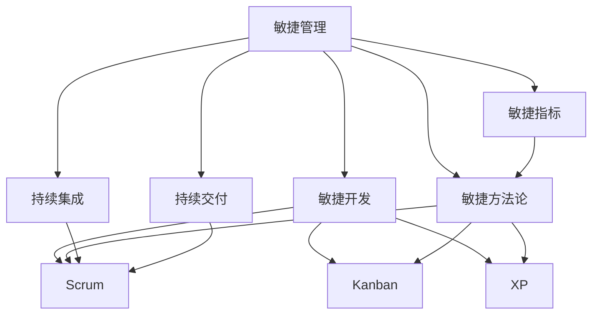

                 

# 敏捷管理：适应快速变化的市场环境

> 关键词：敏捷管理,市场环境,快速变化,项目管理,软件开发

## 1. 背景介绍

### 1.1 问题由来
在当今高度竞争和快速变化的市场环境中，企业需要快速响应市场变化，敏捷管理(Agile Management)成为了一种应对不确定性的关键策略。敏捷管理强调灵活应变、快速迭代，旨在提升企业的市场响应能力和竞争力。随着技术的发展和应用场景的不断变化，敏捷管理不仅适用于软件开发，还被广泛应用到各个行业，包括产品开发、市场推广、客户服务等。

敏捷管理通过灵活的项目管理方法，如Scrum、Kanban等，结合持续交付和反馈机制，以适应快速变化的市场需求。其核心理念是：敏捷不是一种技术，而是一种管理思维方式。敏捷管理的关键在于团队协作、客户驱动和持续改进，通过快速迭代的方式不断优化产品和服务，以满足客户需求。

### 1.2 问题核心关键点
敏捷管理在实践过程中，涉及以下核心关键点：

1. 快速迭代：通过短周期的迭代，快速交付可用的产品功能，不断积累客户反馈，逐步完善产品。
2. 客户驱动：以客户需求为导向，密切关注市场变化，确保产品交付符合客户期望。
3. 持续改进：基于反馈持续优化产品和服务，提升产品竞争力和客户满意度。
4. 团队协作：鼓励团队成员之间的沟通协作，增强团队凝聚力和效率。
5. 技术债务管理：通过合理的技术管理和重构，避免技术债务积累，提升软件质量和维护性。
6. 自动化测试与交付：通过自动化测试和持续集成(CI)、持续交付(CD)等技术，加速产品交付和质量保证。

敏捷管理的关键在于如何平衡这些关键点，确保团队高效协作，快速响应市场变化。

### 1.3 问题研究意义
敏捷管理对于企业适应快速变化的市场环境具有重要意义：

1. 提升市场响应能力：通过敏捷管理，企业可以快速交付产品功能，快速响应市场需求，缩短产品上市周期。
2. 增强客户满意度：敏捷管理强调客户驱动，确保产品交付符合客户期望，提升客户满意度和忠诚度。
3. 优化资源配置：敏捷管理通过持续改进和反馈机制，优化资源配置，提升团队效率和企业竞争力。
4. 加速技术创新：敏捷管理促进技术债务管理，推动持续技术改进和创新，提升产品质量和性能。
5. 强化团队协作：敏捷管理鼓励团队协作和沟通，增强团队凝聚力和创造力。

敏捷管理已经成为了现代企业项目管理的重要方法论，在各行各业中广泛应用，推动了企业数字化转型和智能化升级。

## 2. 核心概念与联系

### 2.1 核心概念概述

为更好地理解敏捷管理，本节将介绍几个密切相关的核心概念：

- 敏捷管理(Agile Management)：以快速响应市场变化为导向的管理方法，强调灵活应变、快速迭代，通过团队协作和持续改进，提升项目效率和质量。

- 敏捷开发(Agile Development)：敏捷管理在软件开发领域的应用，通过Scrum、Kanban等框架，实现快速迭代、持续交付和客户驱动。

- 敏捷方法论(Agile Methodology)：敏捷管理的具体实践方法，如Scrum、Kanban、XP等，指导团队如何高效管理项目、协作开发。

- 持续集成(Continuous Integration, CI)：一种软件开发实践，通过频繁地将代码集成到共享代码库，并自动构建、测试和部署，加速产品交付和质量保证。

- 持续交付(Continuous Delivery, CD)：一种软件开发实践，通过自动化测试和部署，确保产品功能快速交付，并保证交付质量。

- 敏捷框架(Framework)：如Scrum、Kanban、XP等，提供了一套系统化的敏捷方法论，指导团队如何高效管理项目、协作开发。

- 敏捷指标(Agile Metrics)：如完成工作量、迭代周期、客户满意度等，用于衡量敏捷实践的效果，指导持续改进。

这些核心概念之间的逻辑关系可以通过以下Mermaid流程图来展示：



这个流程图展示了大语言模型的核心概念及其之间的关系：

1. 敏捷管理通过敏捷开发、敏捷方法论等具体实践方法，实现快速响应市场变化。
2. 敏捷开发采用Scrum、Kanban、XP等框架，指导团队如何进行高效的项目管理和协作开发。
3. 持续集成和持续交付等技术，加速了产品的交付和质量保证，是敏捷管理的重要支撑。
4. 敏捷指标用于衡量敏捷实践的效果，指导团队持续改进，提升项目管理水平。

这些概念共同构成了敏捷管理的核心框架，使企业在快速变化的市场环境中保持高效和灵活。

## 3. 核心算法原理 & 具体操作步骤
### 3.1 算法原理概述

敏捷管理的核心算法原理可以概括为：基于快速迭代和持续改进的管理方法，通过敏捷开发和持续交付技术，确保产品快速响应市场需求，提升客户满意度。

敏捷管理通过以下步骤实现这一目标：

1. 制定敏捷计划：确定项目目标、范围、需求和优先级，定义迭代的周期和时间节点。
2. 敏捷开发：采用Scrum、Kanban等框架，进行敏捷开发和团队协作。
3. 持续集成：通过自动化测试和部署，确保代码频繁集成，快速交付可用的产品功能。
4. 持续交付：通过持续交付管道，自动化构建、测试和部署，确保产品快速上市。
5. 客户反馈：通过收集和分析客户反馈，持续改进产品和服务，提升客户满意度。
6. 团队协作：通过高效的沟通和协作工具，增强团队凝聚力和效率。

敏捷管理的核心在于如何高效管理这些关键点，确保团队高效协作，快速响应市场变化。

### 3.2 算法步骤详解

敏捷管理的实施步骤可以总结如下：

**Step 1: 确定项目目标和范围**
- 明确项目的目标、范围、需求和优先级，确定迭代的周期和时间节点。

**Step 2: 制定敏捷计划**
- 定义敏捷开发框架，如Scrum、Kanban等，定义任务分配、优先级排序、迭代周期等。

**Step 3: 敏捷开发**
- 采用敏捷框架进行项目管理和团队协作。
- 使用敏捷工具，如Jira、Trello、Confluence等，记录和跟踪任务进展。

**Step 4: 持续集成和持续交付**
- 集成自动化测试工具，如Jenkins、Travis CI等，确保代码频繁集成和构建。
- 设置持续交付管道，自动化构建、测试和部署，加速产品交付。

**Step 5: 客户反馈和持续改进**
- 收集和分析客户反馈，根据反馈进行持续改进。
- 使用用户故事和客户访谈等方法，了解客户需求，指导开发方向。

**Step 6: 团队协作和沟通**
- 使用协作工具，如Slack、Microsoft Teams等，增强团队沟通和协作。
- 定期举行站会、回顾会和评审会，确保团队高效协作。

### 3.3 算法优缺点

敏捷管理在实践过程中，具有以下优点：

1. 快速响应市场变化：通过快速迭代和持续交付，快速交付产品功能，满足客户需求。
2. 提升客户满意度：以客户驱动为导向，确保产品交付符合客户期望，提升客户满意度和忠诚度。
3. 优化资源配置：通过持续改进和反馈机制，优化资源配置，提升团队效率和企业竞争力。
4. 推动技术创新：促进技术债务管理，推动持续技术改进和创新，提升产品质量和性能。
5. 强化团队协作：鼓励团队协作和沟通，增强团队凝聚力和创造力。

同时，敏捷管理也存在一些局限性：

1. 需要高水平的管理和技术能力：敏捷管理要求团队具备较高的管理和技术能力，需要持续培训和学习。
2. 对项目需求的变化敏感：敏捷管理要求团队对项目需求的变化敏感，需要灵活应变。
3. 需要较多的沟通成本：敏捷管理需要频繁的沟通和协作，增加了沟通成本和时间开销。
4. 需要高效的协作工具：敏捷管理需要高效的协作工具，如Jira、Slack等，需要投入一定的资源。

尽管存在这些局限性，但就目前而言，敏捷管理仍是大规模项目管理的重要方法论。未来相关研究的重点在于如何进一步降低敏捷管理的沟通成本，提高其可操作性和应用范围，同时兼顾资源配置的优化和团队协作的强化。

### 3.4 算法应用领域

敏捷管理已经在软件开发、产品开发、市场推广、客户服务等多个领域得到广泛应用，推动了企业的数字化转型和智能化升级。

在软件开发领域，敏捷管理被广泛应用于各类项目的开发和维护，通过敏捷开发和持续交付，确保产品快速上市和客户满意度。

在产品开发领域，敏捷管理通过敏捷框架和持续反馈，快速迭代产品功能，提升产品竞争力和市场响应能力。

在市场推广领域，敏捷管理通过敏捷指标和客户反馈，指导市场策略和推广方案的制定和调整，提升市场推广效果和品牌影响力。

在客户服务领域，敏捷管理通过敏捷反馈和持续改进，优化客户服务和体验，提升客户满意度和忠诚度。

此外，敏捷管理还在供应链管理、人力资源管理、市场营销等多个领域得到了应用，推动了企业的全面数字化转型。

## 4. 数学模型和公式 & 详细讲解 & 举例说明

### 4.1 数学模型构建

敏捷管理的数学模型可以概括为以下几个关键指标和公式：

- **迭代周期时间(TTT)**：每个迭代周期的总时间，包括开发时间、测试时间和部署时间等。
- **平均完成时间(ACT)**：完成每个任务所需的时间。
- **任务量(Backlog Size)**：待完成的任务数量。
- **任务容量(Capacity)**：团队在每个迭代周期内可完成的任务数量。

敏捷管理的数学模型可以通过以下公式进行构建：

1. **迭代周期时间(TTT)**：

$$
TTT = \sum_{i=1}^N (D_i + T_i + P_i)
$$

其中，$D_i$ 为开发时间，$T_i$ 为测试时间，$P_i$ 为部署时间。

2. **平均完成时间(ACT)**：

$$
ACT = \frac{\sum_{i=1}^N t_i}{Backlog Size}
$$

其中，$t_i$ 为任务$i$的完成时间。

3. **任务容量(Capacity)**：

$$
Capacity = \frac{Backlog Size}{TTT}
$$

其中，Backlog Size为待完成的任务数量，TTT为每个迭代周期的时间。

### 4.2 公式推导过程

敏捷管理的数学模型推导过程如下：

1. **迭代周期时间(TTT)**：

$$
TTT = \sum_{i=1}^N (D_i + T_i + P_i)
$$

其中，$D_i$ 为开发时间，$T_i$ 为测试时间，$P_i$ 为部署时间。

2. **平均完成时间(ACT)**：

$$
ACT = \frac{\sum_{i=1}^N t_i}{Backlog Size}
$$

其中，$t_i$ 为任务$i$的完成时间。

3. **任务容量(Capacity)**：

$$
Capacity = \frac{Backlog Size}{TTT}
$$

其中，Backlog Size为待完成的任务数量，TTT为每个迭代周期的时间。

### 4.3 案例分析与讲解

以软件开发项目为例，展示敏捷管理的数学模型应用：

假设一个软件开发项目有10个任务，每个任务的开发时间、测试时间和部署时间分别为4小时、3小时和1小时。项目总时间为100小时，每个迭代周期为5天，即40小时。

- 计算每个迭代周期的总时间(TTT)：

$$
TTT = 10 \times (4+3+1) = 100
$$

- 计算平均完成时间(ACT)：

$$
ACT = \frac{10 \times (4+3+1)}{10} = 3
$$

- 计算任务容量(Capacity)：

$$
Capacity = \frac{10}{40} = 0.25
$$

通过这些指标，可以评估敏捷管理的效率和资源配置情况，指导项目管理和团队协作。

## 5. 项目实践：代码实例和详细解释说明
### 5.1 开发环境搭建

在进行敏捷管理实践前，我们需要准备好开发环境。以下是使用Jira进行敏捷管理的开发环境配置流程：

1. 安装Jira：从官网下载并安装Jira，确保版本支持最新敏捷管理功能。

2. 配置Jira：根据企业需求，配置Jira的项目、用户、团队等基本信息。

3. 安装Jira插件：根据需要安装各类敏捷管理插件，如Scrum、Kanban、Continuous Delivery等。

4. 连接CI/CD工具：将Jira与CI/CD工具，如Jenkins、GitLab等，进行集成，实现自动化构建和部署。

5. 连接协作工具：将Jira与协作工具，如Slack、Microsoft Teams等，进行集成，增强团队沟通和协作。

完成上述步骤后，即可在Jira平台上进行敏捷管理的实践。

### 5.2 源代码详细实现

下面我们以软件开发项目为例，展示使用Jira进行敏捷管理的详细代码实现。

首先，创建项目任务和用户故事：

```python
from jira import Jira

jira = Jira(options={'server': 'https://jira.example.com'}, basic_auth=('username', 'password'))
jira.create_project(name='Project Name')

jira.create_issue(project='Project Name', summary='User Story 1', description='Description of User Story 1', issuetype='Task')

# 创建更多用户故事和任务
```

然后，定义敏捷任务和指标：

```python
# 定义敏捷任务和指标
tasks = []
c_s = 0
total_time = 0
backlog_size = 10
capacity = 0.25

for i in range(10):
    task = jira.create_issue(project='Project Name', summary=f'Task {i+1}', description=f'Description of Task {i+1}', issuetype='Task')
    tasks.append(task)
    total_time += 4 + 3 + 1  # 开发、测试、部署时间
    c_s += 4  # 累计完成时间
    capacity = backlog_size / total_time

print(f'Total Time: {total_time}, Average Completion Time: {c_s / len(tasks)}, Capacity: {capacity}')
```

接着，执行敏捷管理流程：

```python
# 敏捷管理流程
for i in range(5):
    jira.create_issue(project='Project Name', summary=f'Sprint {i+1}', description=f'Sprint {i+1} Description', issuetype='Sprint')
    
    # 分配任务
    for task in tasks:
        jira.update_issue(task.id, 'Assignee', 'Team Member 1')
        jira.update_issue(task.id, 'Status', 'In Progress')

    # 执行任务
    for task in tasks:
        jira.update_issue(task.id, 'Status', 'Done')
    
    # 记录指标
    sprint_time = len(tasks) * (4 + 3 + 1)  # 每个迭代周期的时间
    total_time += sprint_time
    c_s += 4 * len(tasks)  # 累计完成时间
    capacity = backlog_size / total_time

    print(f'Sprint {i+1}, Total Time: {total_time}, Average Completion Time: {c_s / len(tasks)}, Capacity: {capacity}')
```

最后，持续改进和反馈：

```python
# 持续改进和反馈
for i in range(5):
    jira.create_issue(project='Project Name', summary=f'Review {i+1}', description=f'Review {i+1} Description', issuetype='Review')
    jira.create_issue(project='Project Name', summary=f'Retrospective {i+1}', description=f'Retrospective {i+1} Description', issuetype='Retrospective')

# 收集和分析反馈，持续改进
```

以上就是使用Jira进行敏捷管理的完整代码实现。可以看到，Jira提供了强大的项目管理和协作功能，使得敏捷管理的实践变得简洁高效。

### 5.3 代码解读与分析

让我们再详细解读一下关键代码的实现细节：

**Jira类**：
- `Jira`类的初始化方法：配置Jira服务器地址和认证信息，建立Jira连接。
- `create_project`方法：创建敏捷管理项目，如项目名称、项目ID等。
- `create_issue`方法：创建敏捷管理任务和用户故事，指定任务ID、任务摘要、任务描述、任务类型等。
- `update_issue`方法：更新任务状态、分配人和状态等。

**任务和指标定义**：
- `tasks`列表：存储敏捷任务ID。
- `c_s`变量：累计完成时间。
- `total_time`变量：总时间。
- `backlog_size`变量：待完成的任务数量。
- `capacity`变量：任务容量。

**敏捷管理流程**：
- 循环5次，表示5个迭代周期。
- 创建Sprint任务，分配任务，执行任务，更新任务状态。
- 记录每个迭代周期的总时间、累计完成时间和任务容量。
- 持续改进和反馈，收集和分析反馈。

可以看到，Jira的强大功能和简洁的代码实现，使得敏捷管理的实践变得高效可行。

当然，工业级的系统实现还需考虑更多因素，如任务分配策略、团队协作机制、持续交付管道等。但核心的敏捷管理流程基本与此类似。

## 6. 实际应用场景
### 6.1 软件开发
敏捷管理在软件开发中的应用最为广泛。通过敏捷开发和持续交付，确保软件功能快速上市，满足客户需求。敏捷管理强调客户驱动，以客户反馈为指导，持续改进产品和服务，提升客户满意度和忠诚度。

### 6.2 产品开发
敏捷管理通过敏捷框架和持续反馈，快速迭代产品功能，提升产品竞争力和市场响应能力。敏捷管理强调团队协作和客户沟通，确保产品交付符合客户期望，提升产品市场份额和用户粘性。

### 6.3 市场营销
敏捷管理通过敏捷指标和客户反馈，指导市场策略和推广方案的制定和调整，提升市场推广效果和品牌影响力。敏捷管理强调数据驱动和持续改进，确保市场营销活动的效果和投入产出比。

### 6.4 客户服务
敏捷管理通过敏捷反馈和持续改进，优化客户服务和体验，提升客户满意度和忠诚度。敏捷管理强调客户导向和快速响应，确保客户问题得到及时解决，提升客户体验和口碑。

### 6.5 项目管理
敏捷管理通过敏捷计划和任务分配，高效管理项目进度和资源配置。敏捷管理强调任务优先级和团队协作，确保项目按时交付，提升项目管理的效率和质量。

## 7. 工具和资源推荐
### 7.1 学习资源推荐

为了帮助开发者系统掌握敏捷管理的方法和实践，这里推荐一些优质的学习资源：

1. Scrum Master认证培训：Scrum Master认证是敏捷管理的重要资质，通过认证可以系统学习敏捷管理的基本原理和实践方法。
2. 敏捷管理书籍：《敏捷管理》、《Scrum敏捷管理》等书籍，深入浅出地介绍了敏捷管理的核心理念和实践方法。
3. 敏捷管理工具教程：Jira、Trello等敏捷管理工具的官方文档和教程，提供了详细的配置和使用指南。
4. 敏捷管理论坛：如Scrum.org、Agile Alliance等，聚集了大量敏捷管理的实践者和专家，提供丰富的学习资源和交流平台。
5. 敏捷管理社区：如DevOpsDays、KanbanUniversity等，定期举办敏捷管理的会议和研讨会，分享最新的敏捷管理趋势和技术。

通过对这些资源的学习实践，相信你一定能够系统掌握敏捷管理的方法和实践，提升项目管理效率和质量。

### 7.2 开发工具推荐

高效的开发离不开优秀的工具支持。以下是几款用于敏捷管理开发的常用工具：

1. Jira：领先的敏捷管理工具，提供强大的项目管理和协作功能，支持Scrum、Kanban等多种敏捷框架。
2. Trello：简单易用的敏捷管理工具，支持任务管理、团队协作、进度跟踪等功能，适合小型团队使用。
3. Confluence：企业级协作工具，支持知识管理和文档共享，增强团队沟通和协作。
4. GitHub：代码托管和版本控制工具，支持持续集成和持续交付，加速产品交付和质量保证。
5. Jenkins：持续集成工具，支持自动化构建和测试，加速产品交付和质量保证。
6. GitLab：代码托管和持续交付工具，支持自动化构建、测试和部署，提升产品交付效率。
7. Docker：容器化技术，支持快速部署和自动化测试，提高系统稳定性和可维护性。

合理利用这些工具，可以显著提升敏捷管理的开发效率，加快创新迭代的步伐。

### 7.3 相关论文推荐

敏捷管理在学界和业界得到了广泛研究，以下是几篇奠基性的相关论文，推荐阅读：

1. Agile Development: A Set of Principles and Practices that Can Guide the Conduct of R&D Management (2001)：Donnella Meeks等人，提出了敏捷管理的核心理念和实践方法，为敏捷管理奠定了理论基础。
2. Scrum: A Brief Introduction (2013)：Ken Schwaber等人，介绍了Scrum敏捷管理框架的基本原理和实践方法，详细讲解了Scrum的流程和工具。
3. Kanban: Successful Evolutionary Change for Your Technology Business Team (2006)：David J. Anderson等人，提出了Kanban敏捷管理框架的基本原理和实践方法，强调任务可视化和流程优化。
4. Agile Estimating and Planning (2006)：James PM Smith等人，详细讲解了敏捷估算和规划的方法，指导团队如何高效管理项目进度和资源配置。
5. Continuous Delivery: Reliable Software Releases through Build, Test, and Deploy Automation (2011)：Gene Kim等人，介绍了持续交付的实践方法和技术工具，推动敏捷管理与DevOps的融合。

这些论文代表了大敏捷管理的发展脉络。通过学习这些前沿成果，可以帮助研究者把握学科前进方向，激发更多的创新灵感。

## 8. 总结：未来发展趋势与挑战
### 8.1 总结

本文对敏捷管理的理论和实践进行了全面系统的介绍。首先阐述了敏捷管理在快速变化的市场环境中的重要性和实践价值，明确了敏捷管理的核心方法和关键点。其次，从原理到实践，详细讲解了敏捷管理的数学模型和具体步骤，给出了敏捷管理的代码实例和详细解释说明。同时，本文还广泛探讨了敏捷管理在软件开发、产品开发、市场营销等多个领域的应用前景，展示了敏捷管理的巨大潜力。

通过本文的系统梳理，可以看到，敏捷管理通过快速迭代和持续改进，实现了对快速变化市场环境的快速响应，提升了企业的市场响应能力和竞争力。未来，伴随敏捷管理方法的持续演进，敏捷管理必将在更多领域得到应用，为传统行业带来变革性影响。

### 8.2 未来发展趋势

展望未来，敏捷管理将呈现以下几个发展趋势：

1. 敏捷与DevOps的深度融合：敏捷管理将与DevOps的持续集成、持续交付等技术紧密结合，实现更加高效的产品交付和质量保证。
2. 自动化和智能化工具的普及：随着技术的发展，敏捷管理将越来越多地借助自动化和智能化工具，减少人工干预，提升效率和准确性。
3. 多学科交叉应用：敏捷管理将与其他学科的知识和技术，如数据科学、人工智能等，进行深度融合，推动跨学科的创新应用。
4. 敏捷与精益管理的结合：敏捷管理将与精益管理等方法进行整合，形成更加系统的项目管理方法论，提升项目管理的全面性和系统性。
5. 敏捷指标的多元化：敏捷管理将引入更多的指标体系，如产品交付速度、客户满意度等，全面衡量敏捷实践的效果和团队效率。

以上趋势凸显了敏捷管理的广阔前景。这些方向的探索发展，必将进一步提升敏捷管理的效率和应用范围，推动企业在快速变化的市场环境中保持领先。

### 8.3 面临的挑战

尽管敏捷管理在实践中已经取得了显著成效，但在迈向更加智能化、普适化应用的过程中，它仍面临诸多挑战：

1. 敏捷方法论的多样性：敏捷管理存在多种方法论，如Scrum、Kanban等，如何选择合适的敏捷方法论，并统一团队思想，仍需持续探索。
2. 敏捷实践的一致性：敏捷管理要求团队统一实践标准，避免陷入"敏捷疲劳"和"伪敏捷"的陷阱。
3. 敏捷指标的科学性：敏捷管理依赖于各类敏捷指标，如何科学定义和衡量这些指标，仍需深入研究和实践验证。
4. 敏捷工具的整合：敏捷管理需要各类敏捷工具的支持，如何整合不同的工具，形成一个高效协同的敏捷管理平台，仍需技术突破。
5. 敏捷文化的管理：敏捷管理强调文化建设，如何营造积极的敏捷文化，增强团队凝聚力和创造力，仍需持续推动。

尽管存在这些挑战，但敏捷管理作为项目管理的重要方法论，其核心价值不会改变。未来相关研究的重点在于如何进一步优化敏捷管理的方法论、工具和技术，以适应更多领域的数字化转型和智能化升级。

### 8.4 研究展望

面对敏捷管理所面临的挑战，未来的研究需要在以下几个方面寻求新的突破：

1. 敏捷方法论的统一和标准化：引入敏捷框架和最佳实践，统一敏捷方法论，避免团队思想的分裂。
2. 敏捷指标的科学化和工具化：引入数据分析和机器学习等技术，科学定义和衡量敏捷指标，提高敏捷实践的科学性和可信度。
3. 敏捷工具的整合与优化：开发更加高效、易于整合的敏捷工具，提升团队协作和资源配置的效率。
4. 敏捷文化的推动与管理：加强敏捷文化建设，营造积极的工作氛围，增强团队凝聚力和创造力。
5. 敏捷管理的普适化和跨学科应用：推广敏捷管理到更多行业和领域，探索敏捷管理的跨学科应用，推动企业的全面数字化转型。

这些研究方向的探索，必将引领敏捷管理技术迈向更高的台阶，为构建安全、可靠、高效的智能系统铺平道路。面向未来，敏捷管理技术还需要与其他人工智能技术进行更深入的融合，如知识表示、因果推理、强化学习等，多路径协同发力，共同推动自然语言理解和智能交互系统的进步。只有勇于创新、敢于突破，才能不断拓展敏捷管理的边界，让智能技术更好地造福人类社会。

## 9. 附录：常见问题与解答

**Q1：敏捷管理是否适用于所有项目？**

A: 敏捷管理适用于大部分需要快速响应市场变化的项目，如软件开发、产品开发、市场营销等。但对于一些特定领域，如军事、航天等，敏捷管理可能并不完全适用。需要根据项目需求和实际情况，选择合适的管理方法。

**Q2：敏捷管理与传统项目管理方法的区别是什么？**

A: 敏捷管理与传统项目管理方法的区别在于：
1. 方法论：敏捷管理采用敏捷方法论，如Scrum、Kanban等，强调快速迭代和持续改进；传统项目管理方法采用瀑布模型等，强调阶段性交付和文档化管理。
2. 团队协作：敏捷管理强调团队协作和客户沟通，增强团队凝聚力和创造力；传统项目管理方法强调层级管理，分工明确。
3. 资源配置：敏捷管理通过持续交付和自动化工具，优化资源配置，提高团队效率；传统项目管理方法依赖于人工管理和手动调整，效率较低。
4. 风险管理：敏捷管理通过快速迭代和持续反馈，动态管理项目风险；传统项目管理方法依赖于项目计划和风险评估，风险管理相对被动。

**Q3：敏捷管理的核心优势是什么？**

A: 敏捷管理的核心优势在于：
1. 快速响应市场变化：通过快速迭代和持续交付，快速响应市场需求，缩短产品上市周期。
2. 提升客户满意度：以客户驱动为导向，确保产品交付符合客户期望，提升客户满意度和忠诚度。
3. 优化资源配置：通过持续改进和反馈机制，优化资源配置，提升团队效率和企业竞争力。
4. 推动技术创新：促进技术债务管理，推动持续技术改进和创新，提升产品质量和性能。
5. 强化团队协作：鼓励团队协作和沟通，增强团队凝聚力和创造力。

这些优势使得敏捷管理成为现代项目管理的重要方法论，广泛应用于各行各业。

---

作者：禅与计算机程序设计艺术 / Zen and the Art of Computer Programming

