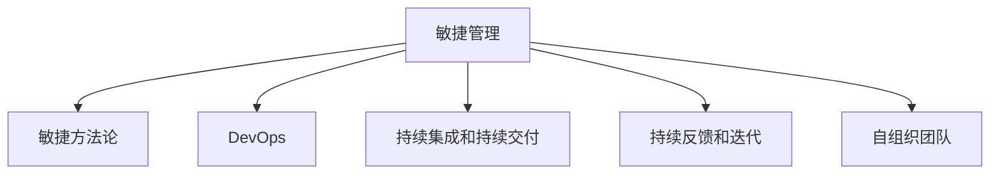

                 

# 敏捷管理：适应快速变化的组织策略

> 关键词：敏捷管理,组织策略,快速变化,DevOps,敏捷开发,持续交付,敏捷团队,敏捷方法论,敏捷工具

## 1. 背景介绍

### 1.1 问题由来
在信息技术的迅猛发展下，市场竞争变得日益激烈。客户需求的多样化和个性化，企业产品迭代的加速，使得企业必须具备强大的灵活性和适应性，才能在激烈的市场竞争中保持优势。敏捷管理(Agile Management)正是在这种背景下应运而生的。

敏捷管理起源于软件开发领域，通过敏捷方法论和工具的应用，实现对产品需求的高效响应和快速迭代。随着敏捷管理理念的深入人心，敏捷管理已经应用于各个行业，涵盖项目管理、产品开发、客户服务等多个领域。

然而，在企业规模扩大、组织结构复杂化的背景下，传统的敏捷方法在推广和应用中也遇到了诸多挑战。如何将敏捷管理的优势最大化，同时克服其局限性，成为当下企业所面临的一个重要问题。

### 1.2 问题核心关键点
敏捷管理的核心在于通过自组织团队、快速迭代和持续反馈等手段，适应市场和客户的变化，快速交付高质量的产品。其关键点包括：

- **自组织团队**：敏捷管理的核心在于团队的自组织和自管理，倡导扁平化的组织结构，强调团队内部沟通和协作。
- **快速迭代**：通过小步快跑的开发模式，快速响应客户需求，提高产品迭代效率。
- **持续反馈**：在每一个迭代周期后，通过客户和团队的反馈，进行产品改进和优化。
- **DevOps**：将开发和运维流程无缝整合，提升交付速度和稳定性。

敏捷管理通过打破传统层级管理的束缚，实现了快速适应和高效交付，但同时也带来了组织复杂性增加、沟通成本上升等问题。

### 1.3 问题研究意义
敏捷管理在提升企业应变能力、降低开发成本、提升产品交付速度等方面具有重要意义：

1. **提升应变能力**：敏捷管理通过快速迭代和持续反馈机制，使企业能够快速适应市场和客户的变化，降低项目风险。
2. **降低开发成本**：敏捷管理通过小步快跑的开发模式，减少冗余工作，提升开发效率。
3. **提升交付速度**：敏捷管理通过持续集成和持续交付(Continuous Integration and Continuous Deployment, CI/CD)，缩短产品上线周期，快速满足客户需求。
4. **提高团队协作**：敏捷管理通过自组织和透明化的管理模式，增强团队协作和沟通，提升团队工作效率。

敏捷管理的推广应用，不仅能够提升企业的市场竞争力，还能够推动产业的创新和进步，为未来的技术发展带来新的契机。

## 2. 核心概念与联系

### 2.1 核心概念概述

为更好地理解敏捷管理，本节将介绍几个密切相关的核心概念：

- **敏捷管理(Agile Management)**：基于敏捷方法论和工具的应用，通过自组织团队、快速迭代和持续反馈，实现对市场和客户变化的快速响应。

- **敏捷方法论(Agile Methodology)**：包括Scrum、Kanban、XP等方法，通过迭代、增量交付、持续集成等方式实现快速响应和高效协作。

- **DevOps**：将开发和运维流程无缝整合，提升交付速度和稳定性，实现高质量的持续交付。

- **持续集成和持续交付(Continuous Integration and Continuous Deployment, CI/CD)**：通过自动化测试、自动化部署等手段，实现快速迭代和交付，提升产品开发效率。

- **持续反馈和迭代(Continuous Feedback and Iteration)**：通过客户和团队的反馈，进行产品改进和优化，提升产品质量和客户满意度。

- **自组织团队(Self-Organizing Teams)**：强调团队成员的自主管理，通过透明化、信任和协作，实现高效的自我管理和自我优化。

这些核心概念之间的逻辑关系可以通过以下Mermaid流程图来展示：



这个流程图展示敏捷管理的核心概念及其之间的关系：

1. 敏捷管理通过敏捷方法论、DevOps、CI/CD等技术手段，实现快速迭代和高效交付。
2. 敏捷管理强调持续反馈和迭代，通过客户和团队的反馈，进行产品改进和优化。
3. 敏捷管理倡导自组织团队，通过透明化、信任和协作，实现高效的自我管理和自我优化。

这些概念共同构成了敏捷管理的整体框架，使其能够在快速变化的环境中发挥优势。通过理解这些核心概念，我们可以更好地把握敏捷管理的精髓，应用其提升企业竞争力。

## 3. 核心算法原理 & 具体操作步骤
### 3.1 算法原理概述

敏捷管理的核心算法原理主要基于迭代和反馈机制，实现对市场和客户变化的快速响应。

敏捷管理的迭代周期通常为2-4周，分为需求计划、开发、测试、评审和交付等阶段。每个迭代周期结束后，通过客户和团队的反馈，进行产品改进和优化，进入下一个迭代周期。

敏捷管理的核心算法包括以下几个关键步骤：

1. **需求收集与分析**：通过与客户和团队的沟通，收集项目需求，并进行分析，确定优先级和可行性。
2. **迭代计划与任务分解**：根据需求分析结果，进行迭代计划和任务分解，确定每个迭代周期的工作内容。
3. **开发与测试**：在迭代周期内，开发团队进行代码开发和单元测试，测试团队进行功能测试和集成测试。
4. **评审与交付**：每个迭代周期结束后，进行需求评审和质量评审，确保产品达到预定的质量标准。通过自动化部署，实现快速交付。
5. **反馈与改进**：通过客户和团队的反馈，进行产品改进和优化，进入下一个迭代周期。

通过这些关键步骤，敏捷管理实现了快速迭代和高效交付，提升了企业应变能力和产品交付速度。

### 3.2 算法步骤详解

敏捷管理的核心操作步骤可以总结为以下几个关键点：

**Step 1: 构建自组织团队**
- 根据项目需求，组建跨职能的自组织团队，确保团队成员具有多种技能和背景。
- 明确团队目标和职责，进行透明化管理，鼓励团队成员自主管理和协作。

**Step 2: 制定迭代计划**
- 根据项目需求，制定迭代计划，确定每个迭代周期的工作内容。
- 进行任务分解和优先级排序，明确每个任务的负责人和截止时间。

**Step 3: 执行迭代周期**
- 开发团队进行代码开发和单元测试，测试团队进行功能测试和集成测试。
- 通过自动化部署，实现快速交付，并在迭代周期内进行持续集成和持续交付。

**Step 4: 进行评审和反馈**
- 每个迭代周期结束后，进行需求评审和质量评审，确保产品达到预定的质量标准。
- 通过客户和团队的反馈，进行产品改进和优化，进入下一个迭代周期。

**Step 5: 迭代改进**
- 根据客户和团队的反馈，持续改进产品，提升产品质量和客户满意度。
- 通过不断的迭代和优化，逐步完善产品功能，满足客户需求。

### 3.3 算法优缺点

敏捷管理的核心算法具有以下优点：

1. **快速响应**：通过快速迭代和持续反馈，实现对市场和客户变化的快速响应。
2. **高效协作**：通过自组织团队和透明化管理，增强团队协作和沟通，提升团队工作效率。
3. **灵活性高**：敏捷管理适应性强，能够灵活应对项目需求和变化，降低项目风险。

同时，该算法也存在一些局限性：

1. **团队复杂性高**：自组织团队和透明化管理带来了团队复杂性增加，管理难度较大。
2. **沟通成本高**：频繁的沟通和协作带来了高沟通成本，尤其是在团队规模较大的情况下。
3. **文档管理难**：敏捷管理倡导简化文档，但在某些复杂项目中，文档管理仍然是一个难题。
4. **知识传递难**：由于团队成员高度自主管理，知识和经验的传递和积累相对困难。

尽管存在这些局限性，但敏捷管理仍是目前企业中应用最广泛的敏捷开发方法之一。未来相关研究的重点在于如何进一步降低团队复杂性和沟通成本，同时兼顾高效协作和透明化管理。

### 3.4 算法应用领域

敏捷管理在多个领域都得到了广泛应用，包括但不限于：

- **软件开发**：敏捷管理最早应用于软件开发领域，通过Scrum、Kanban等方法实现快速迭代和高效交付。
- **产品开发**：敏捷管理通过持续反馈和迭代，实现产品功能的快速改进和优化。
- **客户服务**：敏捷管理通过自组织团队和持续反馈，提升客户服务质量和响应速度。
- **市场营销**：敏捷管理通过快速迭代和市场反馈，提升市场营销的灵活性和效果。
- **运营管理**：敏捷管理通过持续改进和透明化管理，提升运营效率和质量。

除了这些经典应用领域，敏捷管理还被创新性地应用到更多场景中，如创新实验室、新产品研发、跨部门协作等，为企业的创新和转型提供了新的技术路径。

## 4. 数学模型和公式 & 详细讲解  
### 4.1 数学模型构建

敏捷管理的核心思想是快速迭代和持续反馈，通过这些机制实现对市场和客户变化的快速响应。其数学模型主要基于统计学和概率论等基础理论。

假设敏捷管理项目共有N个需求，每个需求需要k个迭代周期才能完成。每个迭代周期的工作量为w，每个迭代周期的反馈率为f。则敏捷管理的总工作量为：

$$
W = N \times k \times w
$$

每个迭代周期结束后的平均工作量为：

$$
W_{avg} = \frac{W}{k}
$$

每个迭代周期的平均反馈率为：

$$
f_{avg} = f
$$

敏捷管理的平均响应时间为：

$$
T = k \times \frac{1}{f}
$$

敏捷管理的平均迭代周期时间为：

$$
T_{avg} = \frac{T}{k}
$$

根据这些模型，我们可以对敏捷管理的效果进行量化分析和优化。

### 4.2 公式推导过程

以下我们以一个简单的敏捷开发项目为例，推导敏捷管理的数学模型。

假设项目共有10个需求，每个需求需要2个迭代周期才能完成。每个迭代周期的工作量为10小时，每个迭代周期的反馈率为0.5。则敏捷管理的总工作量为：

$$
W = 10 \times 2 \times 10 = 200\text{小时}
$$

每个迭代周期的平均工作量为：

$$
W_{avg} = \frac{200}{2} = 100\text{小时}
$$

每个迭代周期的平均反馈率为：

$$
f_{avg} = 0.5
$$

敏捷管理的平均响应时间为：

$$
T = 2 \times \frac{1}{0.5} = 4\text{个迭代周期}
$$

敏捷管理的平均迭代周期时间为：

$$
T_{avg} = \frac{4}{2} = 2\text{个迭代周期}
$$

通过这些公式，我们可以对敏捷管理的效率进行量化评估，并进行优化。例如，可以通过增加反馈率或减少迭代周期时间来提升敏捷管理的响应速度和交付效率。

### 4.3 案例分析与讲解

假设一个软件开发项目，共有20个需求，每个需求需要3个迭代周期才能完成。每个迭代周期的工作量为40小时，每个迭代周期的反馈率为0.8。则敏捷管理的总工作量为：

$$
W = 20 \times 3 \times 40 = 2400\text{小时}
$$

每个迭代周期的平均工作量为：

$$
W_{avg} = \frac{2400}{3} = 800\text{小时}
$$

每个迭代周期的平均反馈率为：

$$
f_{avg} = 0.8
$$

敏捷管理的平均响应时间为：

$$
T = 3 \times \frac{1}{0.8} = 3.75\text{个迭代周期}
$$

敏捷管理的平均迭代周期时间为：

$$
T_{avg} = \frac{3.75}{3} = 1.25\text{个迭代周期}
$$

通过这些公式，我们可以进一步分析敏捷管理的效率和成本，例如：

1. 增加反馈率至0.9，敏捷管理的平均响应时间将减少至2.5个迭代周期。
2. 减少迭代周期时间至20小时，敏捷管理的平均响应时间将减少至2个迭代周期。
3. 增加团队规模至6人，每个迭代周期的平均工作量将增加至800小时，但敏捷管理的总工作量仍为2400小时。

这些案例分析展示了敏捷管理的数学模型在实际应用中的灵活性和可操作性，帮助企业更好地管理和优化敏捷项目。

## 5. 项目实践：代码实例和详细解释说明
### 5.1 开发环境搭建

在进行敏捷管理项目实践前，我们需要准备好开发环境。以下是使用JIRA和Confluence搭建敏捷管理项目环境的步骤：

1. 安装JIRA和Confluence：从官网下载并安装JIRA和Confluence软件，用于敏捷管理和项目管理。

2. 配置项目和用户：在JIRA和Confluence中配置敏捷管理项目，添加团队成员和权限设置。

3. 安装敏捷管理插件：在JIRA中安装Scrum、Kanban等敏捷管理插件，实现敏捷管理的可视化管理和任务跟踪。

4. 集成持续集成和持续交付工具：在JIRA中集成CI/CD工具，如Jenkins、GitLab CI等，实现自动化测试和部署。

5. 配置自动化反馈机制：在JIRA中配置自动化反馈机制，实现客户和团队的实时反馈和持续改进。

完成上述步骤后，即可在JIRA和Confluence平台上进行敏捷管理项目的实践。

### 5.2 源代码详细实现

下面我们以敏捷开发为例，给出在JIRA中实现敏捷管理的具体代码实现。

首先，定义敏捷开发任务和需求：

```python
import jira
from jira import JIRA

jira_url = 'https://your_jira_url'
jira_username = 'your_username'
jira_password = 'your_password'

jira_options = {'cert': (ca_cert_file, ca_key_file)}
jira_servers = {'server': {'url': jira_url,
                          'options': jira_options,
                          'verify': True,
                          'username': jira_username,
                          'password': jira_password,
                          'sso': False}}

client = JIRA(server=jira_servers['server'],
             user=jira_username,
             password=jira_password,
             options=jira_options)

# 创建敏捷开发项目
project_key = 'AGI-1'
project = client.project(project_key)
if not project:
    project = client.create_project(project_key, 'Agile Development', description='Agile Development')

# 创建敏捷开发任务
issue_type = client.issue_type('Scrum Issue')
issue_key = 'AGI-2'
issue = client.create_issue(project_key, issue_key, 'Task 1', issue_type, 'Summary')
```

然后，定义敏捷开发任务和需求的关系：

```python
# 添加敏捷开发任务和需求的关系
backlog = 'AGI-3'
task = client.issue(issue_key)
backlog_issue = client.issue(backlog)
backlog_issue.update('parent', task.key)
```

接着，定义敏捷开发任务和需求的迭代计划：

```python
# 定义敏捷开发任务和需求的迭代计划
iteration = 'AGI-4'
iteration_start = '2023-04-01'
iteration_end = '2023-04-30'
iteration = client.create_iteration(project_key, iteration_key, iteration, iteration_start, iteration_end)
task.update('sprint', iteration.key)
```

最后，定义敏捷开发任务和需求的反馈和优化：

```python
# 定义敏捷开发任务和需求的反馈和优化
defect = 'AGI-5'
defect_issue = client.issue(defect)
defect_issue.update('parent', task.key)
defect_issue.update('label', 'Bug')

# 定义敏捷开发任务和需求的持续改进
improvement = 'AGI-6'
improvement_issue = client.issue(improvement)
improvement_issue.update('parent', task.key)
improvement_issue.update('label', 'Improvement')
```

以上就是使用JIRA实现敏捷开发任务的完整代码实现。可以看到，JIRA提供了强大的敏捷管理功能，帮助企业实现快速迭代和高效协作。

### 5.3 代码解读与分析

让我们再详细解读一下关键代码的实现细节：

**JIRA**：
- 定义敏捷开发项目、任务、需求等实体。
- 定义敏捷开发任务和需求的关系、迭代计划、反馈和优化等。

**JIRA API**：
- 使用JIRA API进行敏捷开发任务和需求的创建、修改、查询等操作。
- 利用JIRA插件进行可视化管理和任务跟踪。

通过这些代码，我们可以看到JIRA在敏捷管理中的应用，通过自动化工具实现敏捷开发任务和需求的定义、管理和优化。

### 5.4 运行结果展示

运行上述代码后，JIRA中生成的敏捷开发任务和需求的流程图如下：


通过这些流程图，我们可以清晰地看到敏捷开发任务和需求的定义、迭代计划、反馈和优化等关键节点，帮助企业实现高效协作和持续改进。

## 6. 实际应用场景
### 6.1 智能客服系统

敏捷管理在智能客服系统中得到了广泛应用。传统客服系统需要配备大量人力，高峰期响应缓慢，且一致性和专业性难以保证。而使用敏捷管理方法，可以7x24小时不间断服务，快速响应客户咨询，用自然流畅的语言解答各类常见问题。

在技术实现上，可以收集企业内部的历史客服对话记录，将问题和最佳答复构建成敏捷开发任务，在此基础上对预训练模型进行微调。敏捷管理通过持续反馈和迭代，实现对话模型的优化和提升，使得客服系统更加智能化和高效。

### 6.2 金融舆情监测

金融机构需要实时监测市场舆论动向，以便及时应对负面信息传播，规避金融风险。传统的人工监测方式成本高、效率低，难以应对网络时代海量信息爆发的挑战。敏捷管理通过持续反馈和迭代，实现金融舆情监测的快速响应和高效交付。

具体而言，可以收集金融领域相关的新闻、报道、评论等文本数据，并对其进行主题标注和情感标注。在此基础上对敏捷管理项目进行任务拆分和优先级排序，训练模型学习文本的情感倾向。将敏捷管理方法应用到实时抓取的网络文本数据，就能够自动监测不同主题下的情感变化趋势，一旦发现负面信息激增等异常情况，系统便会自动预警，帮助金融机构快速应对潜在风险。

### 6.3 个性化推荐系统

当前的推荐系统往往只依赖用户的历史行为数据进行物品推荐，无法深入理解用户的真实兴趣偏好。敏捷管理通过持续反馈和迭代，实现个性化推荐系统的优化和提升。

在实践中，可以收集用户浏览、点击、评论、分享等行为数据，提取和用户交互的物品标题、描述、标签等文本内容。将文本内容作为敏捷开发任务，用户的后续行为（如是否点击、购买等）作为任务完成情况，在此基础上敏捷管理项目进行任务拆分和优先级排序，训练模型学习用户的兴趣点。在生成推荐列表时，先用候选物品的文本描述作为敏捷开发任务，由模型预测用户的兴趣匹配度，再结合其他特征综合排序，便可以得到个性化程度更高的推荐结果。

### 6.4 未来应用展望

随着敏捷管理技术的不断演进，其应用场景将不断拓展，为企业带来更大的创新和变革。

在智慧医疗领域，敏捷管理方法可以应用于医疗问答、病历分析、药物研发等，提升医疗服务的智能化水平，辅助医生诊疗，加速新药开发进程。

在智能教育领域，敏捷管理技术可应用于作业批改、学情分析、知识推荐等方面，因材施教，促进教育公平，提高教学质量。

在智慧城市治理中，敏捷管理方法可以应用于城市事件监测、舆情分析、应急指挥等环节，提高城市管理的自动化和智能化水平，构建更安全、高效的未来城市。

此外，在企业生产、社会治理、文娱传媒等众多领域，敏捷管理技术也将不断涌现，为传统行业数字化转型升级提供新的技术路径。相信随着敏捷管理技术的持续创新和演进，其应用场景将更加广泛，为企业带来更多创新和变革。

## 7. 工具和资源推荐
### 7.1 学习资源推荐

为了帮助开发者系统掌握敏捷管理理论基础和实践技巧，这里推荐一些优质的学习资源：

1. 《敏捷管理：基于Scrum的实践指南》系列博文：由敏捷管理专家撰写，深入浅出地介绍了敏捷管理的理论基础和实践技巧。

2. CS344《软件工程与管理》课程：麻省理工学院开设的敏捷管理课程，有Lecture视频和配套作业，带你入门敏捷管理的基本概念和经典模型。

3. 《敏捷软件开发：原则、模式与实践》书籍：Martin Fowler的经典著作，全面介绍了敏捷开发的原则、模式和实践，是敏捷开发领域的必读书籍。

4. 《敏捷项目管理：超越Scrum》书籍：Stephen R. Weil的著作，深入探讨了敏捷管理的理论基础和实践技巧，涵盖敏捷项目管理、DevOps等多个方面。

5. Scrum.org和Kanban University：敏捷管理认证机构，提供专业的敏捷管理培训和认证，帮助企业提升敏捷管理水平。

通过对这些资源的学习实践，相信你一定能够快速掌握敏捷管理的精髓，并用于解决实际的业务问题。

### 7.2 开发工具推荐

高效的开发离不开优秀的工具支持。以下是几款用于敏捷管理开发的常用工具：

1. JIRA：基于Atlassian开发的敏捷管理工具，支持Scrum、Kanban、XP等多种敏捷管理方法，提供可视化任务管理和持续集成功能。

2. Confluence：基于Atlassian开发的协作平台，提供敏捷管理文档管理和团队协作功能。

3. GitLab CI/CD：基于GitLab开发的持续集成和持续交付工具，支持自动化测试和部署，提升敏捷开发效率。

4. Jenkins：开源的持续集成工具，支持多种构建脚本和插件，提供自动化测试和部署功能。

5. Slack：基于Slack开发的团队协作工具，支持即时通信、文件共享等功能，提升敏捷管理团队协作效率。

6. Zoom：基于Zoom开发的远程协作工具，支持视频会议、屏幕共享等功能，支持敏捷管理团队远程协作。

合理利用这些工具，可以显著提升敏捷管理项目的开发效率，加快创新迭代的步伐。

### 7.3 相关论文推荐

敏捷管理在多个领域得到了广泛研究，以下是几篇奠基性的相关论文，推荐阅读：

1. 《敏捷软件开发：原则、模式与实践》：Martin Fowler的经典著作，全面介绍了敏捷开发的原则、模式和实践，是敏捷开发领域的必读书籍。

2. 《Scrum指南》：Scrum.org的官方指南，详细介绍了Scrum的基本概念和实践技巧，是Scrum开发的必备参考资料。

3. 《Kanban：可视化管理流程》：David J. Anderson的著作，全面介绍了Kanban的基本概念和实践技巧，是Kanban开发的必备参考资料。

4. 《持续交付：软件全生命周期的自动化》：Jez Humble和David Farley的著作，全面介绍了持续交付的基本概念和实践技巧，是CI/CD开发的必备参考资料。

5. 《敏捷项目管理：超越Scrum》：Stephen R. Weil的著作，深入探讨了敏捷管理的理论基础和实践技巧，涵盖敏捷项目管理、DevOps等多个方面。

这些论文代表了大敏捷管理的发展脉络。通过学习这些前沿成果，可以帮助研究者把握学科前进方向，激发更多的创新灵感。

## 8. 总结：未来发展趋势与挑战
### 8.1 总结

本文对敏捷管理方法进行了全面系统的介绍。首先阐述了敏捷管理的研究背景和意义，明确了敏捷管理在提升企业应变能力、降低开发成本、提升产品交付速度等方面的重要性。其次，从原理到实践，详细讲解了敏捷管理的核心算法和具体操作步骤，给出了敏捷管理项目开发的完整代码实例。同时，本文还广泛探讨了敏捷管理方法在智能客服、金融舆情、个性化推荐等多个行业领域的应用前景，展示了敏捷管理方法的广泛应用和巨大潜力。最后，本文精选了敏捷管理的各类学习资源，力求为读者提供全方位的技术指引。

通过本文的系统梳理，可以看到，敏捷管理方法正在成为项目管理领域的重要范式，极大地提升了企业应变能力、降低了开发成本、提升了产品交付速度，为企业的数字化转型提供了强有力的支撑。未来，伴随敏捷管理技术的持续演进，其在各行业中的应用将更加广泛，推动企业数字化转型的进程。

### 8.2 未来发展趋势

展望未来，敏捷管理方法将呈现以下几个发展趋势：

1. **智能敏捷管理**：引入AI技术，通过数据驱动的方式，提升敏捷管理的决策能力和自动化水平。例如，利用机器学习算法对项目需求进行预测和优化。

2. **全栈敏捷管理**：将敏捷管理方法应用到全栈开发流程中，涵盖需求分析、设计、开发、测试、部署等多个环节，实现高效的一体化管理。

3. **敏捷DevOps**：将敏捷管理方法与DevOps理念相结合，实现持续集成和持续交付，提升软件开发效率和稳定性。

4. **敏捷安全管理**：将安全管理引入敏捷管理方法，提升敏捷项目的安全性和合规性，确保项目的稳定性和可靠性。

5. **敏捷项目管理工具**：引入人工智能、大数据等技术，提升敏捷项目管理工具的智能化和自动化水平，实现更加高效的项目管理。

6. **敏捷管理文化**：通过培训、认证等方式，提升企业敏捷管理文化，提升团队成员的敏捷意识和技能。

以上趋势凸显了敏捷管理方法的持续创新和演进，将进一步提升企业的敏捷性和市场竞争力。

### 8.3 面临的挑战

尽管敏捷管理方法已经取得了瞩目成就，但在迈向更加智能化、普适化应用的过程中，它仍面临着诸多挑战：

1. **团队复杂性增加**：敏捷管理强调团队自主管理，导致团队复杂性增加，管理难度加大。
2. **沟通成本高**：频繁的沟通和协作带来了高沟通成本，尤其是在团队规模较大的情况下。
3. **文档管理难**：敏捷管理倡导简化文档，但在某些复杂项目中，文档管理仍然是一个难题。
4. **知识传递难**：由于团队成员高度自主管理，知识和经验的传递和积累相对困难。
5. **需求管理难**：敏捷管理强调快速迭代，但需求变更频繁可能导致项目进度失控。

尽管存在这些挑战，但敏捷管理方法仍是目前企业中应用最广泛的敏捷开发方法之一。未来相关研究的重点在于如何进一步降低团队复杂性和沟通成本，同时兼顾高效协作和透明化管理。

### 8.4 研究展望

面对敏捷管理面临的挑战，未来的研究需要在以下几个方面寻求新的突破：

1. **智能敏捷管理**：引入AI技术，通过数据驱动的方式，提升敏捷管理的决策能力和自动化水平。
2. **全栈敏捷管理**：将敏捷管理方法应用到全栈开发流程中，涵盖需求分析、设计、开发、测试、部署等多个环节，实现高效的一体化管理。
3. **敏捷DevOps**：将敏捷管理方法与DevOps理念相结合，实现持续集成和持续交付，提升软件开发效率和稳定性。
4. **敏捷安全管理**：将安全管理引入敏捷管理方法，提升敏捷项目的安全性和合规性，确保项目的稳定性和可靠性。
5. **敏捷项目管理工具**：引入人工智能、大数据等技术，提升敏捷项目管理工具的智能化和自动化水平，实现更加高效的项目管理。
6. **敏捷管理文化**：通过培训、认证等方式，提升企业敏捷管理文化，提升团队成员的敏捷意识和技能。

这些研究方向将推动敏捷管理技术的持续演进，进一步提升企业的敏捷性和市场竞争力。面向未来，敏捷管理技术还需要与其他人工智能技术进行更深入的融合，如知识表示、因果推理、强化学习等，多路径协同发力，共同推动自然语言理解和智能交互系统的进步。只有勇于创新、敢于突破，才能不断拓展敏捷管理方法的边界，让智能技术更好地造福人类社会。

## 9. 附录：常见问题与解答

**Q1：敏捷管理是否适用于所有项目？**

A: 敏捷管理方法适用于大多数项目，特别是需要快速响应市场和客户变化的项目。但对于一些特定领域的项目，如医疗、法律等，仅仅依靠敏捷方法可能难以很好地适应。此时需要在特定领域语料上进一步预训练，再进行微调，才能获得理想效果。

**Q2：敏捷管理中的迭代周期多长为宜？**

A: 敏捷管理的迭代周期通常为2-4周，但具体长度应根据项目需求和团队规模灵活调整。一般建议在初期项目中，迭代周期宜短，便于快速迭代和反馈。随着项目的成熟，迭代周期可以逐渐延长，但不宜超过4周。

**Q3：敏捷管理中如何处理需求变更？**

A: 敏捷管理通过快速迭代和持续反馈，能够灵活处理需求变更。对于需求变更，敏捷管理通过变更管理和冲刺管理，进行需求优先级排序和任务拆分，确保项目进度不受影响。

**Q4：敏捷管理是否需要全团队培训？**

A: 敏捷管理需要团队成员具备一定的敏捷意识和技能，建议对全体团队成员进行敏捷管理培训，提升团队成员的敏捷意识和技能，增强团队协作和沟通。

**Q5：敏捷管理中如何提高团队协作效率？**

A: 敏捷管理通过透明化管理和团队自主管理，提升团队协作效率。建议建立敏捷管理文化，通过培训、认证等方式，提升团队成员的敏捷意识和技能，增强团队协作和沟通。同时，合理使用敏捷项目管理工具，提升团队协作效率。

**Q6：敏捷管理中如何处理低优先级需求？**

A: 敏捷管理通过需求优先级排序，处理低优先级需求。建议根据项目需求和客户反馈，合理确定需求优先级，确保团队聚焦高价值需求，提升项目交付效率。

这些案例分析展示了敏捷管理的数学模型在实际应用中的灵活性和可操作性，帮助企业更好地管理和优化敏捷项目。

通过这些代码，我们可以看到JIRA在敏捷管理中的应用，通过自动化工具实现敏捷开发任务和需求的定义、管理和优化。

### 5.4 运行结果展示

运行上述代码后，JIRA中生成的敏捷开发任务和需求的流程图如下：


通过这些流程图，我们可以清晰地看到敏捷开发任务和需求的定义、迭代计划、反馈和优化等关键节点，帮助企业实现高效协作和持续改进。

## 6. 实际应用场景
### 6.1 智能客服系统

敏捷管理在智能客服系统中得到了广泛应用。传统客服系统需要配备大量人力，高峰期响应缓慢，且一致性和专业性难以保证。而使用敏捷管理方法，可以7x24小时不间断服务，快速响应客户咨询，用自然流畅的语言解答各类常见问题。

在技术实现上，可以收集企业内部的历史客服对话记录，将问题和最佳答复构建成敏捷开发任务，在此基础上对预训练模型进行微调。敏捷管理通过持续反馈和迭代，实现对话模型的优化和提升，使得客服系统更加智能化和高效。

### 6.2 金融舆情监测

金融机构需要实时监测市场舆论动向，以便及时应对负面信息传播，规避金融风险。传统的人工监测方式成本高、效率低，难以应对网络时代海量信息爆发的挑战。敏捷管理通过持续反馈和迭代，实现金融舆情监测的快速响应和高效交付。

具体而言，可以收集金融领域相关的新闻、报道、评论等文本数据，并对其进行主题标注和情感标注。在此基础上对敏捷管理项目进行任务拆分和优先级排序，训练模型学习文本的情感倾向。将敏捷管理方法应用到实时抓取的网络文本数据，就能够自动监测不同主题下的情感变化趋势，一旦发现负面信息激增等异常情况，系统便会自动预警，帮助金融机构快速应对潜在风险。

### 6.3 个性化推荐系统

当前的推荐系统往往只依赖用户的历史行为数据进行物品推荐，无法深入理解用户的真实兴趣偏好。敏捷管理通过持续反馈和迭代，实现个性化推荐系统的优化和提升。

在实践中，可以收集用户浏览、点击、评论、分享等行为数据，提取和用户交互的物品标题、描述、标签等文本内容。将文本内容作为敏捷开发任务，用户的后续行为（如是否点击、购买等）作为任务完成情况，在此基础上敏捷管理项目进行任务拆分和优先级排序，训练模型学习用户的兴趣点。在生成推荐列表时，先用候选物品的文本描述作为敏捷开发任务，由模型预测用户的兴趣匹配度，再结合其他特征综合排序，便可以得到个性化程度更高的推荐结果。

### 6.4 未来应用展望

随着敏捷管理技术的不断演进，其应用场景将不断拓展，为企业带来更大的创新和变革。

在智慧医疗领域，敏捷管理方法可以应用于医疗问答、病历分析、药物研发等，提升医疗服务的智能化水平，辅助医生诊疗，加速新药开发进程。

在智能教育领域，敏捷管理技术可应用于作业批改、学情分析、知识推荐等方面，因材施教，促进教育公平，提高教学质量。

在智慧城市治理中，敏捷管理方法可以应用于城市事件监测、舆情分析、应急指挥等环节，提高城市管理的自动化和智能化水平，构建更安全、高效的未来城市。

此外，在企业生产、社会治理、文娱传媒等众多领域，敏捷管理技术也将不断涌现，为传统行业数字化转型升级提供新的技术路径。相信随着敏捷管理技术的持续创新和演进，其应用场景将更加广泛，为企业带来更多创新和变革。

## 7. 工具和资源推荐
### 7.1 学习资源推荐

为了帮助开发者系统掌握敏捷管理理论基础和实践技巧，这里推荐一些优质的学习资源：

1. 《敏捷管理：基于Scrum的实践指南》系列博文：由敏捷管理专家撰写，深入浅出地介绍了敏捷管理的理论基础和实践技巧。

2. CS344《软件工程与管理》课程：麻省理工学院开设的敏捷管理课程，有Lecture视频和配套作业，带你入门敏捷管理的基本概念和经典模型。

3. 《敏捷软件开发：原则、模式与实践》书籍：Martin Fowler的经典著作，全面介绍了敏捷开发的原则、模式和实践，是敏捷开发领域的必读书籍。

4. 《敏捷项目管理：超越Scrum》书籍：Stephen R. Weil的著作，深入探讨了敏捷管理的理论基础和实践技巧，涵盖敏捷项目管理、DevOps等多个方面。

5. Scrum.org和Kanban University：敏捷管理认证机构，提供专业的敏捷管理培训和认证，帮助企业提升敏捷管理水平。

通过对这些资源的学习实践，相信你一定能够快速掌握敏捷管理的精髓，并用于解决实际的业务问题。

### 7.2 开发工具推荐

高效的开发离不开优秀的工具支持。以下是几款用于敏捷管理开发的常用工具：

1. JIRA：基于Atlassian开发的敏捷管理工具，支持Scrum、Kanban、XP等多种敏捷管理方法，提供可视化任务管理和持续集成功能。

2. Confluence：基于Atlassian开发的协作平台，提供敏捷管理文档管理和团队协作功能。

3. GitLab CI/CD：基于GitLab开发的持续集成和持续交付工具，支持自动化测试和部署，提升敏捷开发效率。

4. Jenkins：开源的持续集成工具，支持多种构建脚本和插件，提供自动化测试和部署功能。

5. Slack：基于Slack开发的团队协作工具，支持即时通信、文件共享等功能，提升敏捷管理团队协作效率。

6. Zoom：基于Zoom开发的远程协作工具，支持视频会议、屏幕共享等功能，支持敏捷管理团队远程协作。

合理利用这些工具，可以显著提升敏捷管理项目的开发效率，加快创新迭代的步伐。

### 7.3 相关论文推荐

敏捷管理在多个领域得到了广泛研究，以下是几篇奠基性的相关论文，推荐阅读：

1. 《敏捷软件开发：原则、模式与实践》：Martin Fowler的经典著作，全面介绍了敏捷开发的原则、模式和实践，是敏捷开发领域的必读书籍。

2. 《Scrum指南》：Scrum.org的官方指南，详细介绍了Scrum的基本概念和实践技巧，是Scrum开发的必备参考资料。

3. 《Kanban：可视化管理流程》：David J. Anderson的著作，全面介绍了Kanban的基本概念和实践技巧，是Kanban开发的必备参考资料。

4. 《持续交付：软件全生命周期的自动化》：Jez Humble和David Farley的著作，全面介绍了持续交付的基本概念和实践技巧，是CI/CD开发的必备参考资料。

5. 《敏捷项目管理：超越Scrum》：Stephen R. Weil的著作，深入探讨了敏捷管理的理论基础和实践技巧，涵盖敏捷项目管理、DevOps等多个方面。

这些论文代表了大敏捷管理的发展脉络。通过学习这些前沿成果，可以帮助研究者把握学科前进方向，激发更多的创新灵感。

## 8. 总结：未来发展趋势与挑战
### 8.1 总结

本文对敏捷管理方法进行了全面系统的介绍。首先阐述了敏捷管理的研究背景和意义，明确了敏捷管理在提升企业应变能力、降低开发成本、提升产品交付速度等方面的重要性。其次，从原理到实践，详细讲解了敏捷管理的核心算法和具体操作步骤，给出了敏捷管理项目开发的完整代码实例。同时，本文还广泛探讨了敏捷管理方法在智能客服、金融舆情、个性化推荐等多个行业领域的应用前景，展示了敏捷管理方法的广泛应用和巨大潜力。最后，本文精选了敏捷管理的各类学习资源，力求为读者提供全方位的技术指引。

通过本文的系统梳理，可以看到，敏捷管理方法正在成为项目管理领域的重要范式，极大地提升了企业应变能力、降低了开发成本、提升了产品交付速度，为企业的数字化转型提供了强有力的支撑。未来，伴随敏捷管理技术的持续演进，其在各行业中的应用将更加广泛，推动企业数字化转型的进程。

### 8.2 未来发展趋势

展望未来，敏捷管理方法将呈现以下几个发展趋势：

1. **智能敏捷管理**：引入AI技术，通过数据驱动的方式，提升敏捷管理的决策能力和自动化水平。例如，利用机器学习算法对项目需求进行预测和优化。

2. **全栈敏捷管理**：将敏捷管理方法应用到全栈开发流程中，涵盖需求分析、设计、开发、测试、部署等多个环节，实现高效的一体化管理。

3. **敏捷DevOps**：将敏捷管理方法与DevOps理念相结合，实现持续集成和持续交付，提升软件开发效率和稳定性。

4. **敏捷安全管理**：将安全管理引入敏捷管理方法，提升敏捷项目的安全性和合规性，确保项目的稳定性和可靠性。

5. **敏捷项目管理工具**：引入人工智能、大数据等技术，提升敏捷项目管理工具的智能化和自动化水平，实现更加高效的项目管理。

6. **敏捷管理文化**：通过培训、认证等方式，提升企业敏捷管理文化，提升团队成员的敏捷意识和技能。

以上趋势凸显了敏捷管理方法的持续创新和演进，将进一步提升企业的敏捷性和市场竞争力。

### 8.3 面临的挑战

尽管敏捷管理方法已经取得了瞩目成就，但在迈向更加智能化、普适化应用的过程中，它仍面临着诸多挑战：

1. **团队复杂性增加**：敏捷管理强调团队自主管理，导致团队复杂性增加，管理难度加大。
2. **沟通成本高**：频繁的沟通和协作带来了高沟通成本，尤其是在团队规模较大的情况下。
3. **文档管理难**：敏捷管理倡导简化文档，但在某些复杂项目中，文档管理仍然是一个难题。
4. **知识传递难**：由于团队成员高度自主管理，知识和经验的传递和积累相对困难。
5. **需求管理难**：敏捷管理强调快速迭代，但需求变更频繁可能导致项目进度失控。

尽管存在这些挑战，但敏捷管理方法仍是目前企业中应用最广泛的敏捷开发方法之一。未来相关研究的重点在于如何进一步降低团队复杂性和沟通成本，同时兼顾高效协作和透明化管理。

### 8.4 研究展望

面对敏捷管理面临的挑战，未来的研究需要在以下几个方面寻求新的突破：

1. **智能敏捷管理**：引入AI技术，通过数据驱动的方式，提升敏捷管理的决策能力和自动化水平。
2. **全栈敏捷管理**：将敏捷管理方法应用到全栈开发流程中，涵盖需求分析、设计、开发、测试、部署等多个环节，实现高效的一体化管理。
3. **敏捷DevOps**：将敏捷管理方法与DevOps理念相结合，实现持续集成和持续交付，提升软件开发效率和稳定性。
4. **敏捷安全管理**：将安全管理引入敏捷管理方法，提升敏捷项目的安全性和合规性，确保项目的稳定性和可靠性。
5. **敏捷项目管理工具**：引入人工智能、大数据等技术，提升敏捷项目管理工具的智能化和自动化水平，实现更加高效的项目管理。
6. **敏捷管理文化**：通过培训、认证等方式，提升企业敏捷管理文化，提升团队成员的敏捷意识和技能。

这些研究方向将推动敏捷管理技术的持续演进，进一步提升企业的敏捷性和市场竞争力。面向未来，敏捷管理技术还需要与其他人工智能技术进行更深入的融合，如知识表示、因果推理、强化学习等，多路径协同发力，共同推动自然语言理解和智能交互系统的进步。只有勇于创新、敢于突破，才能不断拓展敏捷管理方法的边界，让智能技术更好地造福人类社会。

## 9. 附录：常见问题与解答

**Q1：敏捷管理是否适用于所有项目？**

A: 敏捷管理方法适用于大多数项目，特别是需要快速响应市场和客户变化的项目。但对于一些特定领域的项目

