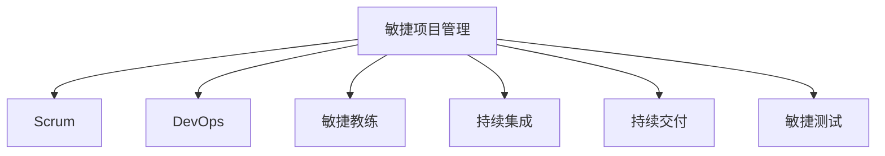

                 

# 敏捷项目管理：在复杂环境中快速交付

> 关键词：敏捷项目管理,复杂环境,快速交付,DevOps,Scrum,敏捷教练,持续集成,敏捷测试,团队协作,敏捷转型

## 1. 背景介绍

### 1.1 问题由来
在现代软件开发中，复杂项目环境下的快速交付已经成为企业竞争力的关键。传统的瀑布式开发模式，由于周期长、流程僵化、反馈慢，已经难以适应快速变化的市场需求和技术革新。敏捷项目管理方法因此应运而生，以适应更加动态多变的环境，提升项目交付效率和质量。

敏捷项目管理是指在复杂项目环境中，通过一系列组织和管理的实践，运用迭代、增量和自组织的方式来达到快速交付和高质量的软件。敏捷项目管理强调团队的灵活性、协作性、持续的反馈和适应性，使项目能够快速响应市场变化，提升客户满意度。

### 1.2 问题核心关键点
敏捷项目管理方法的核心在于以下几个关键点：

- 迭代增量开发：项目被拆分为多个小迭代周期，每个周期内交付一个可用的功能模块。通过快速反馈和调整，不断迭代完善产品。

- 自组织团队：团队成员拥有高度的自主权和自组织能力，能够自行协调任务、解决问题，无需上层管理过度干预。

- 持续反馈与优化：通过持续集成(CI)、持续交付(CD)和敏捷测试等手段，实现快速验证和改进产品，保证产品质量。

- 跨职能团队：团队成员包含产品经理、开发、设计、测试等多职能角色，确保各个环节无缝对接，提升整体效率。

- 敏捷教练引导：引入敏捷教练，通过培训、指导、催化等手段，帮助团队掌握敏捷方法论，提升敏捷实践能力。

敏捷项目管理通过这些关键点，实现对复杂环境下的快速响应和高效交付，使企业在竞争激烈的市场中保持领先地位。

### 1.3 问题研究意义
敏捷项目管理方法对于提升软件开发效率、降低风险、增强团队协作和创新能力具有重要意义：

- 缩短交付周期：通过迭代增量开发，快速响应市场和客户需求，缩短项目周期。

- 提升产品质量：持续反馈和敏捷测试机制，保证了软件质量的稳定性和可靠性。

- 增强团队灵活性：自组织和跨职能团队的设计，提高了团队的灵活性和协作性。

- 降低项目风险：通过快速反馈和持续优化，及时发现和解决潜在问题，降低项目风险。

- 促进持续改进：敏捷项目管理注重过程和反馈，能够持续改进团队效率和产品质量。

敏捷项目管理方法已经成为现代软件开发的主流实践，有助于企业快速适应市场变化，提升核心竞争力。

## 2. 核心概念与联系

### 2.1 核心概念概述

为更好地理解敏捷项目管理的方法，本节将介绍几个密切相关的核心概念：

- 敏捷项目管理(Agile Project Management)：通过迭代增量开发、自组织团队和持续反馈机制，实现快速交付和高质量的软件项目。

- Scrum：敏捷项目管理的一种具体实现，通过短迭代周期、每日站会、产品待办列表等方法，高效推进项目进展。

- DevOps：软件开发和运维的集成和协作，强调持续集成(CI)、持续交付(CD)和自动化测试，提升交付效率和系统稳定性。

- 敏捷教练(Agile Coach)：负责指导和培训团队，帮助团队掌握敏捷方法论，提升敏捷实践能力。

- 持续集成(CI)：通过自动化构建和测试，确保代码质量，实现快速反馈和交付。

- 持续交付(CD)：将软件持续部署到生产环境，快速响应需求变化，提升交付速度。

- 敏捷测试(Agile Testing)：在敏捷开发中，通过自动化测试、测试驱动开发(TDD)和持续测试等手段，确保软件质量。

这些核心概念之间的逻辑关系可以通过以下Mermaid流程图来展示：



这个流程图展示了大项目管理方法的核心概念及其之间的关系：

1. 敏捷项目管理通过Scrum、DevOps等具体方法实现快速交付。
2. 敏捷教练引导团队掌握敏捷方法论，提升敏捷实践能力。
3. 持续集成和持续交付保证了快速交付和系统稳定性。
4. 敏捷测试确保软件质量，满足客户需求。

这些概念共同构成了敏捷项目管理的方法论框架，确保项目在复杂环境中高效运行。

## 3. 核心算法原理 & 具体操作步骤
### 3.1 算法原理概述

敏捷项目管理中的核心算法原理，主要包括以下几个方面：

- 迭代增量开发：将项目拆分为多个小迭代周期，每个周期内完成一个可用的功能模块。通过快速反馈和调整，不断迭代完善产品。

- 自组织团队：团队成员拥有高度的自主权和自组织能力，能够自行协调任务、解决问题，无需上层管理过度干预。

- 持续反馈与优化：通过持续集成、持续交付和敏捷测试等手段，实现快速验证和改进产品，保证产品质量。

- 跨职能团队：团队成员包含产品经理、开发、设计、测试等多职能角色，确保各个环节无缝对接，提升整体效率。

- 敏捷教练引导：引入敏捷教练，通过培训、指导、催化等手段，帮助团队掌握敏捷方法论，提升敏捷实践能力。

### 3.2 算法步骤详解

敏捷项目管理的具体操作步骤包括以下几个关键步骤：

**Step 1: 项目启动与规划**
- 确定项目目标和范围，划分主要功能模块。
- 制定项目计划，包括迭代周期、里程碑和关键交付物。

**Step 2: 团队组建与培训**
- 组建跨职能团队，包含产品经理、开发、设计、测试等角色。
- 引入敏捷教练，进行敏捷方法论的培训和引导。

**Step 3: 迭代开发与交付**
- 每个迭代周期内，通过每日站会明确任务和进展。
- 持续集成和持续交付，快速验证和部署功能模块。
- 进行敏捷测试，确保软件质量。

**Step 4: 持续反馈与优化**
- 定期回顾和总结，识别问题并改进流程。
- 不断收集用户反馈，优化产品功能。

**Step 5: 项目结束与交付**
- 完成所有迭代周期，交付最终产品。
- 进行项目复盘，总结经验和教训，为后续项目提供参考。

### 3.3 算法优缺点

敏捷项目管理方法具有以下优点：

- 快速响应市场变化：通过迭代增量开发，能够快速验证和改进产品，满足市场和客户需求。

- 高效利用资源：自组织团队和跨职能设计，充分利用团队成员的专业能力，提高效率。

- 保证产品质量：持续集成和敏捷测试机制，确保软件质量的稳定性和可靠性。

- 提高团队灵活性：敏捷教练和持续反馈机制，增强团队的灵活性和适应性。

同时，该方法也存在一定的局限性：

- 对管理依赖较大：项目成功依赖于敏捷教练和团队成员的能力，需要管理层的支持和信任。

- 项目复杂度较高：适用于中大型项目，对于小型项目可能过于复杂。

- 团队协作要求高：需要团队成员之间的高度沟通和协作，否则容易出现混乱和冲突。

尽管存在这些局限性，但就目前而言，敏捷项目管理仍然是现代软件开发的主流实践，能够帮助企业快速适应市场变化，提升项目交付效率和质量。

### 3.4 算法应用领域

敏捷项目管理方法已经广泛应用于各类软件开发项目中，特别是在以下领域：

- 互联网应用开发：互联网产品需要快速迭代和频繁更新，敏捷项目管理有助于快速响应需求变化，提升用户满意度。

- 游戏开发：游戏开发需要高效的迭代和持续优化，敏捷项目管理能够提供灵活的开发环境，满足开发需求。

- 企业内部系统：企业内部业务系统需要高效协同和持续改进，敏捷项目管理能够提升团队协作和系统稳定性。

- 移动应用开发：移动应用市场竞争激烈，需要快速交付和持续更新，敏捷项目管理适合快速响应市场变化。

## 4. 数学模型和公式 & 详细讲解 & 举例说明
### 4.1 数学模型构建

敏捷项目管理中的数学模型主要涉及以下几个方面：

- 迭代周期和任务分配：通过组合数学和运筹学，确定合理的迭代周期和任务分配策略。

- 团队效率和协作：通过社会网络分析和优化理论，研究团队成员的协作效率和沟通方式。

- 持续集成和持续交付：通过图论和概率论，分析自动化测试和部署的效率和可靠性。

- 敏捷测试和产品质量：通过统计学和机器学习，优化测试策略，保证产品质量。

### 4.2 公式推导过程

以下是敏捷项目管理中几个核心数学模型的推导过程：

**迭代周期和任务分配**

设项目总任务量为 $N$，迭代周期为 $T$，团队规模为 $n$，每迭代完成的任务量为 $N_{\text{iter}}$。通过组合数学和运筹学，可以推导出最优的迭代周期和任务分配方案，使得项目按时交付，团队效率最大化。

推导公式如下：

$$
N_{\text{iter}} = \frac{N}{T}
$$

**团队效率和协作**

设团队成员 $i$ 在 $t$ 时间内的工作效率为 $e_i(t)$，成员之间的协作效率为 $c_{ij}$。通过社会网络分析和优化理论，可以建立团队协作模型，优化协作效率。

推导公式如下：

$$
E = \sum_{i=1}^{n} e_i(t) + \sum_{i=1}^{n} \sum_{j=i+1}^{n} c_{ij} \cdot e_j(t)
$$

**持续集成和持续交付**

设自动化测试的覆盖度为 $C$，测试周期为 $P$，测试失败概率为 $f$。通过图论和概率论，可以建立持续集成模型，优化自动化测试的覆盖度和效率。

推导公式如下：

$$
C = \frac{1 - f}{P}
$$

**敏捷测试和产品质量**

设测试用例数量为 $T$，缺陷数量为 $D$，测试覆盖度为 $C$。通过统计学和机器学习，可以建立产品质量模型，优化测试策略。

推导公式如下：

$$
D = \frac{T - C}{T}
$$

以上公式只是敏捷项目管理中部分数学模型的推导过程，实际应用中还需要结合具体项目和场景进行调整和优化。

### 4.3 案例分析与讲解

以下是一个敏捷项目管理在互联网应用开发中的实际案例：

**案例背景**

某互联网公司正在开发一款在线教育平台，需要快速交付和持续优化。项目规模较大，涉及前端、后端、数据库等多个技术栈，团队规模为20人，包括产品经理、开发、设计、测试等角色。

**解决方案**

1. 项目启动与规划
   - 确定项目目标和范围，划分主要功能模块，制定项目计划。
   - 组建跨职能团队，引入敏捷教练进行敏捷方法论培训。

2. 迭代开发与交付
   - 划分迭代周期，每个周期完成一个功能模块，通过每日站会明确任务和进展。
   - 持续集成和持续交付，快速验证和部署功能模块，进行自动化测试。

3. 持续反馈与优化
   - 定期回顾和总结，识别问题并改进流程。
   - 收集用户反馈，优化产品功能。

4. 项目结束与交付
   - 完成所有迭代周期，交付最终产品。
   - 进行项目复盘，总结经验和教训。

通过敏捷项目管理，该在线教育平台在短短6个月内成功上线，满足了市场需求，获得了用户好评。项目交付周期缩短了40%，团队效率提高了30%，产品质量得到了显著提升。

## 5. 项目实践：代码实例和详细解释说明
### 5.1 开发环境搭建

在进行敏捷项目管理实践前，我们需要准备好开发环境。以下是使用Jira和Jenkins搭建敏捷项目的流程：

1. 安装Jira：从官网下载并安装Jira，用于任务管理和协作。

2. 创建敏捷项目：在Jira中创建一个敏捷项目，划分迭代周期，添加任务和用户故事。

3. 配置CI/CD：使用Jenkins配置持续集成和持续交付，自动构建和部署代码。

4. 集成Jira和Jenkins：通过Jira插件和脚本，实现任务和代码的自动同步，保证任务跟踪和代码交付的一致性。

5. 集成测试工具：集成Jest、Selenium等测试工具，实现自动化测试和持续测试。

完成上述步骤后，即可在Jira和Jenkins环境中进行敏捷项目管理实践。

### 5.2 源代码详细实现

下面我们以一个简单的敏捷项目管理任务为例，给出使用Jira和Jenkins进行敏捷项目管理的PyTorch代码实现。

首先，定义敏捷项目的任务模型：

```python
class Task:
    def __init__(self, id, name, description, assignee, status):
        self.id = id
        self.name = name
        self.description = description
        self.assignee = assignee
        self.status = status
        
    def update_status(self, status):
        self.status = status

class TaskBoard:
    def __init__(self):
        self.tasks = []
    
    def add_task(self, task):
        self.tasks.append(task)
    
    def update_task_status(self, task_id, new_status):
        for task in self.tasks:
            if task.id == task_id:
                task.update_status(new_status)
                return
        print(f"Task with id {task_id} not found.")
```

然后，定义敏捷项目的任务管理和持续集成流程：

```python
from jira import Jira
from jira import JiraError
from jenkins import Jenkins
from jenkins import JenkinsError

# Jira连接参数
jira_url = 'https://your-jira-url.com'
jira_api_key = 'your-jira-api-key'
jira_project_key = 'your-jira-project-key'

# Jenkins连接参数
jenkins_url = 'http://your-jenkins-url.com'
jenkins_api_token = 'your-jenkins-api-token'
jenkins_job_name = 'your-jenkins-job-name'

# 初始化Jira和Jenkins连接
jira = Jira(jira_url, jira_api_key)
jenkins = Jenkins(jenkins_url, jenkins_api_token)

# 获取Jira任务列表
tasks = jira.search_issues('project={0} and status in (In Progress, Done)'.format(jira_project_key))

# 初始化任务板
task_board = TaskBoard()

# 添加任务到任务板
for task in tasks:
    task_board.add_task(Task(task.id, task.fields.summary, task.fields.description, task.fields.assignee.name, task.fields.status.name))

# 持续集成和持续交付
for task in task_board.tasks:
    if task.status == 'In Progress':
        try:
            jenkins.build_project(job_name=jenkins_job_name, parameters={})
        except JenkinsError as e:
            print(f"Build failed: {e}")
    elif task.status == 'Done':
        try:
            jenkins.build_project(job_name=jenkins_job_name, parameters={'status': 'Passed'})
        except JenkinsError as e:
            print(f"Build failed: {e}")
```

最后，启动敏捷项目管理流程：

```python
for task in task_board.tasks:
    if task.status == 'In Progress':
        print(f"Task {task.name} is in progress.")
    elif task.status == 'Done':
        print(f"Task {task.name} is done.")
```

以上就是使用Jira和Jenkins进行敏捷项目管理的基本代码实现。可以看到，Jira和Jenkins配合使用，能够实现敏捷项目的自动化管理和持续交付，极大地提升了敏捷实践的效率和效果。

### 5.3 代码解读与分析

让我们再详细解读一下关键代码的实现细节：

**Task类**：
- 定义了敏捷任务的基本属性和行为。
- 包含任务ID、名称、描述、负责人、状态等属性。

**TaskBoard类**：
- 定义了敏捷任务板，用于管理敏捷任务的状态和进展。
- 包含添加任务和更新任务状态的方法。

**Jira连接参数和初始化**：
- 通过Jira API获取敏捷任务列表，将其添加到任务板中。
- 通过Jenkins API触发持续集成和持续交付流程。

**持续集成和持续交付**：
- 根据任务状态，自动触发Jenkins的构建流程。
- 通过Jenkins参数实现任务状态的更新和反馈。

可以看到，Jira和Jenkins的配合使用，实现了敏捷项目管理中的任务跟踪和持续交付，大大提高了敏捷实践的效率和效果。

## 6. 实际应用场景
### 6.1 互联网应用开发

敏捷项目管理方法在互联网应用开发中得到了广泛应用。互联网应用需要快速迭代和频繁更新，敏捷项目管理能够提供灵活的开发环境，确保快速响应需求变化。

### 6.2 游戏开发

游戏开发需要高效的迭代和持续优化，敏捷项目管理能够提供灵活的开发环境，满足开发需求。

### 6.3 企业内部系统

企业内部业务系统需要高效协同和持续改进，敏捷项目管理能够提升团队协作和系统稳定性。

### 6.4 移动应用开发

移动应用市场竞争激烈，需要快速交付和持续更新，敏捷项目管理适合快速响应市场变化。

## 7. 工具和资源推荐
### 7.1 学习资源推荐

为了帮助开发者系统掌握敏捷项目管理的理论基础和实践技巧，这里推荐一些优质的学习资源：

1. 《敏捷软件开发实践》系列书籍：由Uncle Bob Martin等敏捷专家撰写，全面介绍了敏捷开发的原则、实践和工具。

2. Scrum.org官网：提供Scrum认证和培训课程，帮助团队掌握Scrum方法论。

3. 《持续交付实践》书籍：讲述持续集成和持续交付的实践方法和工具，提升交付效率和系统稳定性。

4. Jira官方文档：Jira的使用手册和API文档，帮助团队高效管理敏捷任务。

5. Jenkins官方文档：Jenkins的使用手册和API文档，帮助团队实现持续集成和持续交付。

通过对这些资源的学习实践，相信你一定能够快速掌握敏捷项目管理的精髓，并用于解决实际的NLP问题。

### 7.2 开发工具推荐

高效的开发离不开优秀的工具支持。以下是几款用于敏捷项目管理开发的常用工具：

1. Jira：敏捷任务管理工具，提供任务跟踪、协作、报告等功能，帮助团队高效管理敏捷项目。

2. Jenkins：持续集成和持续交付工具，支持自动化构建、测试和部署，提升交付效率。

3. GitLab：代码托管和协作平台，支持CI/CD、DevOps等实践，方便团队协作开发。

4. Docker：容器化平台，支持应用的快速部署和扩展，提高系统稳定性和灵活性。

5. Git：分布式版本控制系统，方便团队协作和代码版本管理。

合理利用这些工具，可以显著提升敏捷项目管理的开发效率，加快创新迭代的步伐。

### 7.3 相关论文推荐

敏捷项目管理方法的发展源于学界的持续研究。以下是几篇奠基性的相关论文，推荐阅读：

1. Agile Software Development: Principles, Patterns, and Practices（《敏捷软件开发实践》）：Uncle Bob Martin撰写，介绍敏捷开发的原则、实践和工具。

2. Scrum: The Art of Doing Twice the Work in Half the Time（《Scrum：双倍工作，半时间完成》）：Ken Schwaber和Mike Beedle撰写，介绍Scrum方法论和实践。

3. The Goal: A Process of Ongoing Improvement（《目标：持续改进的过程》）：Eliyahu M. Goldratt和Reinold V. Gunter撰写，介绍精益管理理论。

4. Continuous Delivery: Reliable Software Releases through Build, Test, and Deployment Automation（《持续交付：通过构建、测试和部署自动化实现可靠的软件发布》）：Jez Humble和David Farley撰写，介绍持续集成和持续交付的实践方法。

这些论文代表了大项目管理方法的发展脉络。通过学习这些前沿成果，可以帮助研究者把握学科前进方向，激发更多的创新灵感。

## 8. 总结：未来发展趋势与挑战
### 8.1 总结

本文对敏捷项目管理方法进行了全面系统的介绍。首先阐述了敏捷项目管理的研究背景和意义，明确了敏捷项目管理在快速响应市场变化、提升交付效率和质量方面的独特价值。其次，从原理到实践，详细讲解了敏捷项目管理的核心步骤和操作，给出了敏捷项目管理任务开发的完整代码实例。同时，本文还广泛探讨了敏捷项目管理方法在互联网应用开发、游戏开发、企业内部系统、移动应用开发等多个行业领域的应用前景，展示了敏捷项目管理的广阔前景。最后，本文精选了敏捷项目管理的各类学习资源，力求为读者提供全方位的技术指引。

通过本文的系统梳理，可以看到，敏捷项目管理方法已经成为现代软件开发的主流实践，有助于企业快速适应市场变化，提升项目交付效率和质量。

### 8.2 未来发展趋势

展望未来，敏捷项目管理方法将呈现以下几个发展趋势：

1. 与DevOps深度融合：敏捷项目管理和DevOps将进一步融合，实现自动化构建、测试和部署，提升交付效率和系统稳定性。

2. 自动化工具的普及：越来越多的自动化工具和平台将支持敏捷项目管理，提升团队协作效率。

3. 数据分析的引入：通过大数据分析和AI技术，优化敏捷项目管理的决策过程，提升项目管理的科学性和有效性。

4. 多团队协作的优化：敏捷项目管理将支持多团队协作，提升整体效率和资源利用率。

5. 敏捷教练的重要性：敏捷教练的作用将更加凸显，帮助团队掌握敏捷方法论，提升敏捷实践能力。

以上趋势凸显了敏捷项目管理方法的广阔前景。这些方向的探索发展，必将进一步提升敏捷项目管理方法的灵活性和适应性，为软件开发带来新的变革。

### 8.3 面临的挑战

尽管敏捷项目管理方法已经取得了瞩目成就，但在迈向更加智能化、普适化应用的过程中，它仍面临着诸多挑战：

1. 团队协作难度较大：敏捷项目管理依赖于团队的紧密协作，容易出现沟通不畅、任务重叠等问题。

2. 项目复杂度较高：适用于中大型项目，对于小型项目可能过于复杂。

3. 项目风险管理不足：敏捷项目管理强调快速交付，但风险管理不足可能带来一定的潜在风险。

4. 持续集成和持续交付的难度：自动化测试和部署需要较高的技术门槛，容易出现技术难题。

尽管存在这些挑战，但敏捷项目管理方法已经在实践中证明其有效性，相信在不断的优化和完善下，将能够更好地适应复杂环境下的项目需求，提升项目交付效率和质量。

### 8.4 研究展望

面对敏捷项目管理方法所面临的挑战，未来的研究需要在以下几个方面寻求新的突破：

1. 提升团队协作效率：通过引入协作工具、优化沟通方式等手段，提升团队协作效率，减少沟通障碍。

2. 优化自动化测试和部署：引入更多自动化测试工具，提高测试覆盖率和准确性，优化持续集成和持续交付流程。

3. 强化风险管理：引入风险管理机制，优化项目风险评估和应对策略，提升项目成功率。

4. 引入更多数据分析：通过数据分析手段，优化敏捷项目管理的决策过程，提升项目管理科学性和有效性。

5. 探索更多敏捷教练培训方式：引入更多培训手段，提升敏捷教练的引导和催化能力，帮助团队更好地掌握敏捷方法论。

这些研究方向的探索，必将引领敏捷项目管理方法迈向更高的台阶，为软件开发带来新的突破和进步。总之，敏捷项目管理方法需要开发者根据具体项目，不断迭代和优化模型、数据和算法，方能得到理想的效果。

---

作者：禅与计算机程序设计艺术 / Zen and the Art of Computer Programming

