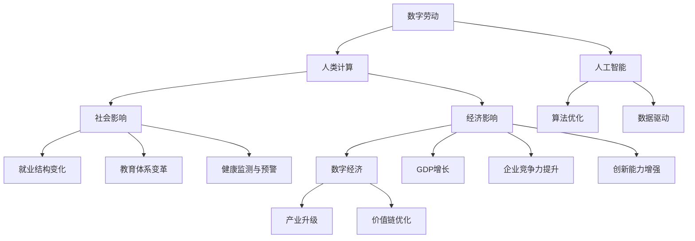

                 

# 数字劳动：人类计算的社会和经济影响分析

> 关键词：数字劳动,人类计算,社会影响,经济影响,数字经济,人工智能

## 1. 背景介绍

### 1.1 问题由来
随着数字化转型的加速，数字劳动在经济活动中的占比日益提升，已经成为衡量经济增长和社会进步的重要指标。作为数字化时代的核心生产力，数字劳动不仅在信息技术、通信、制造业等传统领域中大放异彩，也逐渐渗透到服务业、医疗、教育等新兴行业。数字劳动的兴起，对社会结构和就业模式产生了深远影响，同时也带来了前所未有的经济增长潜力。然而，这一过程也伴随着诸多挑战和风险，如何平衡数字劳动与传统劳动的关系，确保其对社会的长期健康发展，是一个亟待回答的问题。

### 1.2 问题核心关键点
数字劳动的核心在于通过信息技术手段，对数据进行收集、处理、分析，从而实现自动化、智能化、高效化的劳动过程。其关键点包括：
1. **数据驱动**：数字劳动依赖于数据的广泛收集与分析。数据不仅是劳动的原料，也是创新的源泉。
2. **算法优化**：通过机器学习、深度学习等算法，优化劳动流程，提升效率。
3. **人机协同**：在高度自动化的同时，保留人类的监督和决策能力。
4. **平台经济**：数字劳动通常依托于平台经济，如云服务、众包平台等。
5. **隐私与安全**：大规模数据处理和算法应用，带来了隐私保护和数据安全的新挑战。
6. **就业结构变化**：数字劳动导致就业结构的变化，既创造了新的工作机会，也导致部分岗位消失。

### 1.3 问题研究意义
研究数字劳动的社会和经济影响，对于理解数字化转型带来的新变化，指导政策制定和行业发展，具有重要意义：
1. **政策导向**：通过深入分析数字劳动的影响，制定更有针对性的政策，促进其健康发展。
2. **企业转型**：帮助企业识别数字劳动的应用场景，提升其竞争力。
3. **职业培训**：指导职业教育和培训体系，应对就业结构变化。
4. **伦理讨论**：探讨数字劳动带来的伦理问题，如数据隐私、就业不平等、算法偏见等。
5. **经济预测**：预测数字劳动对经济增长和社会发展的长期影响，为决策提供依据。

## 2. 核心概念与联系

### 2.1 核心概念概述

为更好地理解数字劳动的社会和经济影响，本节将介绍几个密切相关的核心概念：

- **数字劳动**：通过信息技术手段，对数据进行收集、处理、分析的劳动过程。依赖于大数据、云计算、人工智能等技术，实现自动化、智能化、高效化的劳动。
- **人类计算**：指人类通过计算活动实现的价值创造。与数字劳动相似，但更多强调人的主动参与和计算过程中的价值创造。
- **社会影响**：数字劳动对社会结构、就业、教育、健康等领域的影响。
- **经济影响**：数字劳动对GDP增长、就业结构、创新能力、企业竞争力等方面的影响。
- **数字经济**：以数字劳动和信息技术为基础，通过数据和算法驱动的经济发展模式。
- **人工智能**：实现数字劳动的关键技术之一，涉及机器学习、深度学习、自然语言处理等领域。

这些核心概念之间的逻辑关系可以通过以下Mermaid流程图来展示：



这个流程图展示了大劳动的核心概念及其之间的关系：

1. 数字劳动通过人工智能技术，实现数据驱动和算法优化。
2. 人类计算与数字劳动相似，但更多强调人的主动参与和计算过程中的价值创造。
3. 数字劳动对社会产生广泛影响，如就业结构变化、教育体系变革、健康监测等。
4. 数字劳动对经济产生深远影响，如GDP增长、企业竞争力提升、创新能力增强等。
5. 数字劳动推动数字经济的发展，通过数据和算法驱动产业升级和价值链优化。

这些概念共同构成了数字劳动的核心框架，帮助我们更好地理解和分析其社会和经济影响。

## 3. 核心算法原理 & 具体操作步骤
### 3.1 算法原理概述

数字劳动的核心算法原理，可以归纳为以下几个方面：

1. **数据预处理**：包括数据收集、清洗、标注等步骤。数据预处理的质量直接影响后续算法的输出结果。
2. **特征工程**：根据任务需求，设计合理的特征提取方式，如PCA、LDA、TF-IDF等，提高算法的鲁棒性和泛化能力。
3. **算法选择**：根据任务特点选择合适的机器学习、深度学习算法，如回归、分类、聚类、神经网络等。
4. **模型训练与优化**：通过训练数据集，优化算法模型参数，使其在验证集上表现最优。
5. **模型评估**：使用独立测试集评估模型性能，进行交叉验证，确保模型泛化能力。

### 3.2 算法步骤详解

数字劳动的算法实现一般包括以下关键步骤：

**Step 1: 数据准备**
- 收集和整理数据集，包括清洗、标注、划分训练集、验证集、测试集等。
- 选择合适的特征提取方式，如词袋模型、TF-IDF等。

**Step 2: 模型选择与设计**
- 根据任务类型，选择适合的机器学习、深度学习算法。
- 设计模型的架构和参数设置，如神经网络层数、节点数、激活函数等。

**Step 3: 模型训练**
- 使用训练集数据，通过反向传播算法进行模型参数优化。
- 设置合适的损失函数和优化器，如交叉熵损失、AdamW等。
- 设置合适的学习率、批大小、迭代轮数等超参数。

**Step 4: 模型评估**
- 使用验证集数据，评估模型在未见数据上的表现，避免过拟合。
- 使用独立测试集进行最终评估，确保模型泛化能力。
- 根据评估结果调整模型参数，进行多轮迭代训练。

**Step 5: 模型部署与优化**
- 将训练好的模型保存为二进制文件或模型压缩包。
- 在实际应用场景中，进行模型部署和优化，如模型裁剪、量化加速等。
- 设置API接口，供其他系统调用。

以上是数字劳动算法实现的一般流程。在实际应用中，还需要针对具体任务的特点，对模型进行优化设计和调整，以提升性能。

### 3.3 算法优缺点

数字劳动的算法具有以下优点：
1. 高效自动化：通过算法自动化处理大量数据，提升劳动效率。
2. 泛化能力强：基于大量数据训练的算法，具有较强的泛化能力，适应不同场景。
3. 灵活可扩展：算法可以根据需要灵活调整参数，适用于多种应用场景。
4. 成本低廉：数字劳动通过算法处理数据，无需过多人力和物理资源。

同时，数字劳动的算法也存在以下缺点：
1. 依赖数据质量：算法性能很大程度上取决于数据质量，数据偏差和噪声可能导致算法性能下降。
2. 算法黑箱问题：复杂算法难以解释，容易产生不透明性和偏见。
3. 算法隐私风险：大规模数据处理可能涉及用户隐私保护问题。
4. 算法泛化不足：基于有限数据训练的算法，可能难以泛化到新场景和新数据。
5. 算法成本高：复杂算法的训练和优化需要大量计算资源和人力投入。

尽管存在这些局限性，数字劳动的算法仍在各个领域得到广泛应用，显示出强大的生命力和发展潜力。

### 3.4 算法应用领域

数字劳动的算法应用领域非常广泛，几乎涵盖了所有传统行业的数字化转型：

- **金融行业**：通过算法处理海量金融数据，实现智能投顾、风险控制、欺诈检测等功能。
- **医疗行业**：利用算法分析医疗数据，实现疾病预测、个性化诊疗、药物研发等。
- **制造业**：使用算法优化生产流程，提升生产效率，实现智能制造。
- **零售行业**：通过算法分析消费者行为，实现精准营销、库存管理、供应链优化等功能。
- **物流行业**：利用算法优化物流路径，提高配送效率，降低成本。
- **能源行业**：通过算法分析能源数据，优化能源管理，实现节能减排。

这些领域的数字化转型，均依赖于数字劳动的算法实现。未来，随着技术的不断进步和应用的深入，数字劳动的应用领域还将进一步扩大。

## 4. 数学模型和公式 & 详细讲解
### 4.1 数学模型构建

本节将使用数学语言对数字劳动的算法模型进行更加严格的刻画。

设数字劳动的数据集为 $\{(x_i, y_i)\}_{i=1}^N$，其中 $x_i$ 为输入，$y_i$ 为标签。假设我们使用的算法模型为 $f(x; \theta)$，其中 $\theta$ 为模型参数。数字劳动的目标是通过训练数据集 $\{(x_i, y_i)\}_{i=1}^N$ 最小化损失函数 $\mathcal{L}(\theta)$，使得模型在测试集 $\{(x_j, y_j)\}_{j=1}^M$ 上表现最优。

**回归问题**：
- 目标是最小化预测值与真实值之间的误差。
- 常用的损失函数为均方误差损失，即：
$$
\mathcal{L}(\theta) = \frac{1}{N}\sum_{i=1}^N (y_i - f(x_i; \theta))^2
$$
- 常用的优化算法为梯度下降，即：
$$
\theta \leftarrow \theta - \eta \nabla_{\theta}\mathcal{L}(\theta)
$$
- 常用的正则化技术为L2正则，即：
$$
\mathcal{L}(\theta) \rightarrow \mathcal{L}(\theta) + \lambda \sum_{i=1}^n \theta_i^2
$$

**分类问题**：
- 目标是最小化交叉熵损失。
- 常用的损失函数为交叉熵损失，即：
$$
\mathcal{L}(\theta) = -\frac{1}{N}\sum_{i=1}^N (y_i \log f(x_i; \theta) + (1-y_i) \log (1-f(x_i; \theta)))
$$
- 常用的优化算法为AdamW、SGD等。

### 4.2 公式推导过程

以下是回归问题和分类问题损失函数的详细推导：

**回归问题**：
- 目标是最小化预测值与真实值之间的误差。
- 常用的损失函数为均方误差损失，即：
$$
\mathcal{L}(\theta) = \frac{1}{N}\sum_{i=1}^N (y_i - f(x_i; \theta))^2
$$
- 目标是最小化上述损失函数，即：
$$
\theta^* = \mathop{\arg\min}_{\theta} \mathcal{L}(\theta)
$$
- 使用梯度下降算法进行优化，即：
$$
\theta \leftarrow \theta - \eta \nabla_{\theta}\mathcal{L}(\theta)
$$
- 其中 $\nabla_{\theta}\mathcal{L}(\theta)$ 为损失函数对参数 $\theta$ 的梯度。

**分类问题**：
- 目标是最小化交叉熵损失。
- 常用的损失函数为交叉熵损失，即：
$$
\mathcal{L}(\theta) = -\frac{1}{N}\sum_{i=1}^N (y_i \log f(x_i; \theta) + (1-y_i) \log (1-f(x_i; \theta)))
$$
- 目标是最小化上述损失函数，即：
$$
\theta^* = \mathop{\arg\min}_{\theta} \mathcal{L}(\theta)
$$
- 使用梯度下降算法进行优化，即：
$$
\theta \leftarrow \theta - \eta \nabla_{\theta}\mathcal{L}(\theta)
$$
- 其中 $\nabla_{\theta}\mathcal{L}(\theta)$ 为损失函数对参数 $\theta$ 的梯度。

### 4.3 案例分析与讲解

以回归问题为例，使用线性回归模型进行演示：

**线性回归模型**：
- 假设模型 $f(x; \theta) = \theta_0 + \theta_1 x_1 + \theta_2 x_2$，其中 $\theta_0$、$\theta_1$、$\theta_2$ 为模型参数。
- 目标是最小化均方误差损失，即：
$$
\mathcal{L}(\theta) = \frac{1}{N}\sum_{i=1}^N (y_i - f(x_i; \theta))^2
$$
- 使用梯度下降算法进行优化，即：
$$
\theta \leftarrow \theta - \eta \nabla_{\theta}\mathcal{L}(\theta)
$$
- 其中 $\nabla_{\theta}\mathcal{L}(\theta)$ 为损失函数对参数 $\theta$ 的梯度，计算如下：
$$
\nabla_{\theta}\mathcal{L}(\theta) = \begin{bmatrix} \frac{\partial \mathcal{L}(\theta)}{\partial \theta_0} \\ \frac{\partial \mathcal{L}(\theta)}{\partial \theta_1} \\ \frac{\partial \mathcal{L}(\theta)}{\partial \theta_2} \end{bmatrix}
$$
- 具体计算如下：
$$
\frac{\partial \mathcal{L}(\theta)}{\partial \theta_0} = \frac{2}{N} \sum_{i=1}^N (y_i - f(x_i; \theta))
$$
$$
\frac{\partial \mathcal{L}(\theta)}{\partial \theta_1} = \frac{2}{N} \sum_{i=1}^N (x_{1i} - f(x_i; \theta)) \cdot y_i
$$
$$
\frac{\partial \mathcal{L}(\theta)}{\partial \theta_2} = \frac{2}{N} \sum_{i=1}^N (x_{2i} - f(x_i; \theta)) \cdot y_i
$$

通过以上推导，我们了解了线性回归模型的参数更新规则。在实际应用中，我们需要根据具体任务选择合适的模型和损失函数，进行算法的实现和优化。

## 5. 项目实践：代码实例和详细解释说明
### 5.1 开发环境搭建

在进行数字劳动的算法实践前，我们需要准备好开发环境。以下是使用Python进行Scikit-learn开发的环境配置流程：

1. 安装Anaconda：从官网下载并安装Anaconda，用于创建独立的Python环境。

2. 创建并激活虚拟环境：
```bash
conda create -n sklearn-env python=3.8 
conda activate sklearn-env
```

3. 安装Scikit-learn：
```bash
pip install scikit-learn
```

4. 安装NumPy、Pandas、Matplotlib等库：
```bash
pip install numpy pandas matplotlib scikit-learn jupyter notebook ipython
```

完成上述步骤后，即可在`sklearn-env`环境中开始数字劳动的算法实践。

### 5.2 源代码详细实现

下面以回归问题为例，给出使用Scikit-learn进行线性回归模型训练的Python代码实现。

```python
from sklearn.linear_model import LinearRegression
from sklearn.datasets import make_regression
from sklearn.model_selection import train_test_split
from sklearn.metrics import mean_squared_error
import numpy as np
import matplotlib.pyplot as plt

# 生成模拟数据
X, y = make_regression(n_samples=1000, n_features=2, noise=0.1)

# 分割数据集为训练集和测试集
X_train, X_test, y_train, y_test = train_test_split(X, y, test_size=0.2, random_state=42)

# 训练模型
model = LinearRegression()
model.fit(X_train, y_train)

# 预测并计算误差
y_pred = model.predict(X_test)
mse = mean_squared_error(y_test, y_pred)

print(f"Mean Squared Error: {mse:.3f}")
```

### 5.3 代码解读与分析

让我们再详细解读一下关键代码的实现细节：

**make_regression函数**：
- 生成一个二维的随机回归数据集，用于模拟真实数据。

**train_test_split函数**：
- 将数据集划分为训练集和测试集，便于评估模型性能。

**LinearRegression模型**：
- 使用Scikit-learn的线性回归模型，用于训练和预测。

**fit函数**：
- 使用训练集数据拟合模型参数。

**predict函数**：
- 使用训练好的模型对测试集数据进行预测。

**mean_squared_error函数**：
- 计算预测值与真实值之间的均方误差，评估模型性能。

**代码实现**：
- 首先生成模拟数据，并进行数据分割。
- 然后训练线性回归模型，并计算均方误差。
- 最后输出均方误差，评估模型性能。

## 6. 实际应用场景
### 6.1 金融风险管理

数字劳动在金融风险管理中的应用非常广泛，通过算法处理海量金融数据，可以实现智能投顾、风险控制、欺诈检测等功能。以下是一个简化的案例：

**案例描述**：
- 某银行需要对客户的信用评分进行评估，以决定是否批准贷款申请。银行收集了大量客户的历史数据，包括收入、负债、消费习惯等，但手动评估成本较高，效率低下。
- 银行希望通过数字劳动实现自动化评估，提高效率和准确性。

**解决方案**：
- 银行收集和整理客户的历史数据，作为训练集。
- 设计线性回归模型，输入为客户的收入、负债、消费习惯等，输出为客户评分。
- 使用梯度下降算法进行模型训练和优化，确保模型在未见数据上的表现。
- 使用独立测试集评估模型性能，确保模型泛化能力。
- 最终，银行通过训练好的模型，对新的客户申请进行自动评估，提高决策效率。

### 6.2 医疗影像诊断

数字劳动在医疗影像诊断中的应用，可以显著提升医疗影像分析的效率和准确性。以下是一个简化的案例：

**案例描述**：
- 某医院希望提升影像诊断的效率和准确性，通过数字劳动实现自动化诊断。
- 医院收集了大量患者的影像数据，但手动分析工作量大，且容易产生误判。

**解决方案**：
- 医院收集和整理影像数据，作为训练集。
- 设计卷积神经网络模型，输入为患者影像，输出为疾病诊断结果。
- 使用梯度下降算法进行模型训练和优化，确保模型在未见数据上的表现。
- 使用独立测试集评估模型性能，确保模型泛化能力。
- 最终，医院通过训练好的模型，对新的患者影像进行自动诊断，提高诊断效率。

### 6.3 智能交通管理

数字劳动在智能交通管理中的应用，可以提升交通流量的控制和优化，减少拥堵和事故发生。以下是一个简化的案例：

**案例描述**：
- 某城市希望提升交通管理效率，通过数字劳动实现智能化交通控制。
- 城市收集了大量交通数据，包括车辆流量、车速、事故等，但手动分析工作量大，难以实时应对交通变化。

**解决方案**：
- 城市收集和整理交通数据，作为训练集。
- 设计时间序列模型，输入为历史交通数据，输出为未来交通流量预测结果。
- 使用梯度下降算法进行模型训练和优化，确保模型在未见数据上的表现。
- 使用独立测试集评估模型性能，确保模型泛化能力。
- 最终，城市通过训练好的模型，对未来交通流量进行预测，优化交通控制策略，提高交通效率。

## 7. 工具和资源推荐
### 7.1 学习资源推荐

为了帮助开发者系统掌握数字劳动的理论基础和实践技巧，这里推荐一些优质的学习资源：

1. **《机器学习实战》**：一本深入浅出的机器学习入门书籍，适合初学者和实践者。
2. **《深度学习》**：由Goodfellow等作者编写的深度学习经典教材，涵盖深度学习的基本原理和应用。
3. **Kaggle竞赛平台**：一个数据科学竞赛平台，提供大量实际问题数据集和解决方案，适合实践学习。
4. **Coursera课程**：斯坦福大学、斯坦福大学等名校提供的机器学习和深度学习课程，适合系统学习。
5. **GitHub开源项目**：大量开源机器学习和深度学习项目，涵盖各种算法实现和应用，适合借鉴和学习。

通过对这些资源的学习实践，相信你一定能够快速掌握数字劳动的精髓，并用于解决实际的业务问题。
###  7.2 开发工具推荐

高效的开发离不开优秀的工具支持。以下是几款用于数字劳动开发的常用工具：

1. **PyTorch**：基于Python的开源深度学习框架，灵活动态的计算图，适合快速迭代研究。
2. **TensorFlow**：由Google主导开发的开源深度学习框架，生产部署方便，适合大规模工程应用。
3. **Scikit-learn**：基于Python的机器学习库，提供大量算法实现和工具，适合快速开发和实验。
4. **Keras**：一个高层次的神经网络API，易于上手，适合快速搭建模型。
5. **Jupyter Notebook**：一个交互式的笔记本环境，支持代码编写和数据可视化，适合数据科学和机器学习。

合理利用这些工具，可以显著提升数字劳动的开发效率，加快创新迭代的步伐。

### 7.3 相关论文推荐

数字劳动的研究源于学界的持续研究。以下是几篇奠基性的相关论文，推荐阅读：

1. **《A Survey of Recent Trends and Approaches in Machine Learning-Based Financial Risk Management》**：由Rahman等作者撰写，综述了机器学习在金融风险管理中的应用。
2. **《Deep Learning for Healthcare: A Review》**：由Chen等作者撰写，综述了深度学习在医疗影像分析中的应用。
3. **《Smart Traffic Management Using Machine Learning》**：由Gao等作者撰写，介绍了一种基于时间序列模型的智能交通管理方法。
4. **《Artificial Intelligence in Financial Services》**：由Angelova等作者撰写，介绍了人工智能在金融服务中的应用。
5. **《Machine Learning for Medical Image Analysis: Challenges, Limitations, and Prospects》**：由Yuan等作者撰写，综述了机器学习在医疗影像分析中的挑战和前景。

这些论文代表了大劳动的研究进展和方向，通过学习这些前沿成果，可以帮助研究者把握学科前进方向，激发更多的创新灵感。

## 8. 总结：未来发展趋势与挑战
### 8.1 总结

本文对数字劳动的社会和经济影响进行了全面系统的介绍。首先阐述了数字劳动的核心概念和其对社会结构、就业模式、经济增长等方面的影响。其次，从原理到实践，详细讲解了数字劳动的算法实现和操作步骤，给出了算法实现的完整代码实例。同时，本文还探讨了数字劳动在金融、医疗、交通等领域的实际应用，展示了其强大的应用潜力。最后，本文推荐了相关学习资源和开发工具，力求为读者提供全方位的技术指引。

通过本文的系统梳理，我们可以看到，数字劳动作为数字化转型的核心生产力，正在逐步改变各行业的运营模式和生产效率。数字劳动通过算法处理海量数据，实现了自动化、智能化、高效化的劳动过程，带来了前所未有的经济增长和社会进步。未来，随着技术的不断进步和应用的深入，数字劳动的应用领域还将进一步扩大，其对社会的长期影响也将更加显著。

### 8.2 未来发展趋势

展望未来，数字劳动的发展趋势主要体现在以下几个方面：

1. **算法复杂度提升**：随着深度学习、神经网络等算法的不断发展，数字劳动的算法复杂度将不断提升，实现更强的数据处理和分析能力。
2. **跨领域应用拓展**：数字劳动将逐步扩展到更多领域，如教育、城市治理、社会福利等，带来更多创新应用。
3. **人机协同增强**：数字劳动将进一步增强人机协同，提高自动化水平，减少人为干预。
4. **隐私保护加强**：数字劳动将更加注重隐私保护，采用差分隐私、联邦学习等技术，确保数据安全。
5. **智能决策支持**：数字劳动将更好地支持智能决策，通过多模态数据融合、因果推断等技术，提升决策的准确性和鲁棒性。

以上趋势凸显了数字劳动的巨大发展潜力。随着技术的不断进步和应用的深入，数字劳动必将在更多领域发挥更大的作用，推动经济和社会的发展。

### 8.3 面临的挑战

尽管数字劳动带来了诸多利好，但也面临着诸多挑战：

1. **数据隐私问题**：大规模数据处理可能涉及用户隐私保护问题，如何平衡数据利用与隐私保护，是一个重要挑战。
2. **算法偏见与公平性**：复杂的算法可能存在偏见，如何确保算法公平性，是一个重要问题。
3. **计算资源限制**：大规模数据处理和算法训练需要大量计算资源，如何降低成本，提高效率，是一个重要挑战。
4. **人机协同问题**：数字劳动可能取代部分人力，如何合理引导和协同，是一个重要问题。
5. **伦理道德问题**：数字劳动可能产生伦理道德问题，如何确保算法应用符合人类价值观，是一个重要问题。

尽管存在这些挑战，数字劳动的发展前景依然广阔，需要社会各界共同努力，应对挑战，推动其健康发展。

### 8.4 研究展望

面对数字劳动所面临的诸多挑战，未来的研究需要在以下几个方面寻求新的突破：

1. **隐私保护技术**：研究差分隐私、联邦学习等技术，确保数据隐私和安全。
2. **算法公平性**：研究公平性算法，减少算法偏见，确保算法公平性。
3. **计算资源优化**：研究模型压缩、量化加速等技术，降低计算成本，提高算法效率。
4. **人机协同机制**：研究人机协同机制，提高自动化水平，减少人为干预。
5. **伦理道德框架**：建立数字劳动的伦理道德框架，确保算法应用符合人类价值观。

这些研究方向的探索，必将引领数字劳动技术迈向更高的台阶，为构建安全、可靠、可解释、可控的智能系统铺平道路。面向未来，数字劳动技术还需要与其他人工智能技术进行更深入的融合，如知识表示、因果推理、强化学习等，多路径协同发力，共同推动自然语言理解和智能交互系统的进步。只有勇于创新、敢于突破，才能不断拓展数字劳动的边界，让智能技术更好地造福人类社会。

## 9. 附录：常见问题与解答
**Q1: 数字劳动与人类劳动有何区别？**

A: 数字劳动与人类劳动的最大区别在于其依赖信息技术手段，通过算法处理数据，实现自动化、智能化、高效化的劳动过程。而人类劳动则更多依赖人的主动参与和体力劳动。数字劳动可以通过算法优化，提高劳动效率和准确性，但无法完全取代人类劳动。

**Q2: 数字劳动对就业市场有何影响？**

A: 数字劳动对就业市场的影响主要体现在以下几个方面：
1. **创造就业机会**：数字劳动通过算法处理数据，创造大量新的就业机会，如数据分析师、机器学习工程师等。
2. **改变就业结构**：数字劳动可能导致部分传统岗位的消失，如数据录入员、手工操作工人等。
3. **提升劳动效率**：数字劳动通过自动化、智能化，显著提升劳动效率，减少重复劳动。
4. **影响就业技能**：数字劳动对劳动者的技能要求更高，需要掌握信息技术、数据分析等新技能。

**Q3: 数字劳动如何提升企业竞争力？**

A: 数字劳动通过算法处理数据，实现自动化、智能化、高效化的劳动过程，可以显著提升企业竞争力：
1. **降低成本**：数字劳动通过自动化处理数据，减少人力成本，提高运营效率。
2. **提升决策准确性**：数字劳动通过算法分析数据，提供科学决策依据，提升决策准确性。
3. **增强创新能力**：数字劳动通过算法处理数据，发现数据中的新模式和新趋势，增强创新能力。
4. **优化供应链管理**：数字劳动通过算法优化供应链管理，提高物流效率，降低成本。

**Q4: 数字劳动对社会结构有何影响？**

A: 数字劳动对社会结构的影响主要体现在以下几个方面：
1. **改变产业结构**：数字劳动推动产业结构优化升级，传统行业逐步向数字化转型。
2. **提升城市管理水平**：数字劳动通过智能交通、智能安防等应用，提升城市管理水平。
3. **促进区域发展**：数字劳动推动区域经济协同发展，提升区域竞争力。
4. **推动教育变革**：数字劳动推动教育数字化，提升教育质量和效率。

**Q5: 数字劳动的未来发展方向是什么？**

A: 数字劳动的未来发展方向主要体现在以下几个方面：
1. **算法复杂度提升**：随着深度学习、神经网络等算法的不断发展，数字劳动的算法复杂度将不断提升，实现更强的数据处理和分析能力。
2. **跨领域应用拓展**：数字劳动将逐步扩展到更多领域，如教育、城市治理、社会福利等，带来更多创新应用。
3. **人机协同增强**：数字劳动将进一步增强人机协同，提高自动化水平，减少人为干预。
4. **隐私保护加强**：数字劳动将更加注重隐私保护，采用差分隐私、联邦学习等技术，确保数据安全。
5. **智能决策支持**：数字劳动将更好地支持智能决策，通过多模态数据融合、因果推断等技术，提升决策的准确性和鲁棒性。

通过这些发展方向，数字劳动必将在更多领域发挥更大的作用，推动经济和社会的发展。

---

作者：禅与计算机程序设计艺术 / Zen and the Art of Computer Programming

