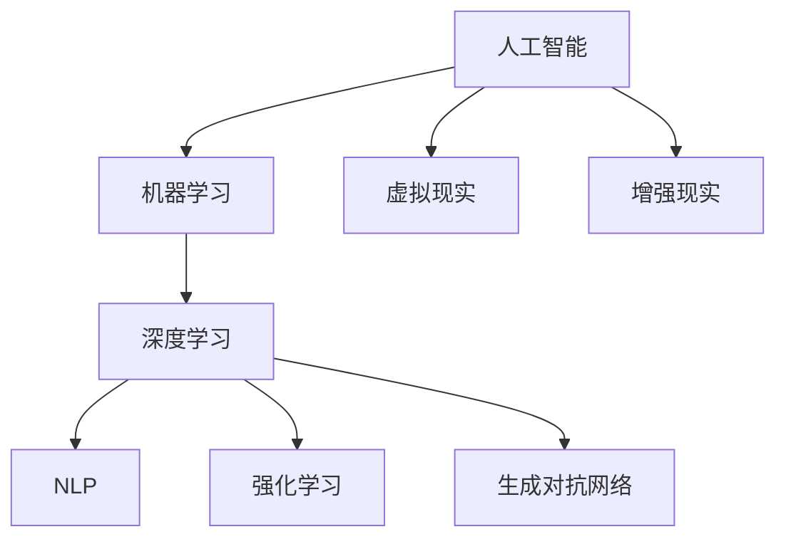

                 

# 数字化想象力培养皿：AI激发的创意思维孵化器

## 1. 背景介绍

### 1.1 问题由来
人类历史上，想象力的培养一直都是教育的核心环节。想象力推动了文明的进步，带来了科学和技术的新突破。然而，传统的想象力培养方式往往依赖于个人的内省、思考和体验，难以大规模推广和量化评估。
人工智能（AI）的迅猛发展，为想象力的培养提供了新的可能性。通过AI技术，我们可以构建虚拟培养皿，用数字化工具激发和引导创意思维，培育更多的想象力人才。这不仅有助于人类的创新发展，也将在教育、艺术、商业等领域产生深远影响。

### 1.2 问题核心关键点
本节将围绕如何利用AI技术构建“数字化想象力培养皿”，通过虚拟环境激发人类创意思维，进行深入讨论。

## 2. 核心概念与联系

### 2.1 核心概念概述

为更好地理解AI激发创意思维的原理，本节将介绍几个密切相关的核心概念：

- 人工智能（Artificial Intelligence, AI）：指通过算法、计算等手段，使计算机系统具有某些智能能力，如学习、推理、规划等。
- 机器学习（Machine Learning, ML）：指通过数据和模型训练，使机器具备某种自动化决策能力。
- 深度学习（Deep Learning, DL）：指通过多层次神经网络，使机器能够自动学习复杂非线性关系。
- 自然语言处理（Natural Language Processing, NLP）：指使计算机能够理解和处理人类语言的能力，包括文本生成、语言翻译、语音识别等。
- 强化学习（Reinforcement Learning, RL）：指通过奖励和惩罚机制，使智能体（agent）学会在特定环境中做出最优决策。
- 生成对抗网络（Generative Adversarial Networks, GANs）：指两个神经网络相互博弈，其中一个生成模型，另一个判别模型，通过对抗学习生成逼真的数据。
- 虚拟现实（Virtual Reality, VR）：指通过计算机生成的虚拟环境，提供沉浸式体验。
- 增强现实（Augmented Reality, AR）：指将虚拟信息叠加到现实世界，提升交互性和沉浸感。

这些概念之间的逻辑关系可以通过以下Mermaid流程图来展示：



这个流程图展示了人工智能在各个子领域的分布与应用：

1. 人工智能作为上位概念，通过机器学习、深度学习、自然语言处理等技术实现具体应用。
2. 强化学习和生成对抗网络作为先进技术，在人工智能体系中发挥重要作用。
3. 虚拟现实和增强现实作为数字化平台，为AI技术提供了良好的应用场景。

## 3. 核心算法原理 & 具体操作步骤
### 3.1 算法原理概述

AI激发创意思维的原理，本质上是通过AI技术构建一个虚拟环境，通过感知、交互和反馈等机制，激发人类的想象力和创造力。其核心思想是：将人类抽象思维具象化为可计算的符号和算法，通过训练和推理，实现智能体在虚拟环境中的自主探索和创作。

形式化地，设智能体为 $A$，虚拟环境为 $E$，创意输出为 $C$。智能体通过感知 $P$、交互 $I$ 和反馈 $F$ 在环境中学习，其创意输出 $C$ 由环境、感知和交互共同决定：

$$
C = f(E, P, I, F)
$$

其中 $f$ 为创意生成函数，代表将环境、感知和交互转化为创意输出的算法。

### 3.2 算法步骤详解

构建“数字化想象力培养皿”涉及以下关键步骤：

**Step 1: 环境设计**
- 根据目标任务和创意输出类型，设计虚拟环境 $E$。例如，艺术家可以使用3D虚拟空间进行艺术创作，音乐家可以使用虚拟乐器进行即兴演奏。
- 环境应包含丰富的交互元素和挑战机制，以激发智能体的探索欲和创造力。

**Step 2: 感知机制**
- 通过传感器和摄像头等设备，采集智能体的环境感知数据 $P$。例如，虚拟现实中，可以采集用户的头部旋转、双手动作等数据。
- 感知数据需经过预处理和特征提取，以转化为机器可处理的符号和向量。

**Step 3: 交互机制**
- 根据感知数据，智能体通过控制接口 $I$ 与虚拟环境互动。例如，用户可以通过虚拟键盘输入文本，或使用虚拟画笔在画布上涂抹。
- 交互机制需支持实时响应，以提供沉浸式体验。

**Step 4: 反馈机制**
- 根据创意输出 $C$，环境提供即时反馈 $F$。例如，音乐家演奏完后，获得观众掌声和评分。
- 反馈需客观公正，以激励智能体的创作动机。

**Step 5: 训练和推理**
- 使用机器学习算法对智能体进行训练，使其掌握感知、交互和反馈等机制。
- 通过推理算法，智能体在虚拟环境中生成创意输出。

**Step 6: 输出评估**
- 对创意输出进行评价和分析，提取创意元素和创新点。
- 将创意输出展示给用户，收集反馈和改进建议。

### 3.3 算法优缺点

AI激发创意思维的算法具有以下优点：
1. 可量化评估。通过AI模型，可以将人类创意进行量化分析，评估其创意程度和创新性。
2. 多领域适用。该算法可以应用于多种创意任务，如绘画、音乐、设计等，具备广泛的适用性。
3. 个性化培养。AI算法可以根据个体差异，定制个性化培养方案，提升培养效果。
4. 高效扩展。AI模型可以通过大规模并行计算，快速扩展到多个用户，实现大规模创意孵化。

同时，该算法也存在以下局限性：
1. 模型复杂性。构建AI模型需要大量数据和复杂算法，对技术要求较高。
2. 数据需求大。AI算法需要大量高质量的标注数据，获取和处理成本较高。
3. 创意难以量化。AI模型难以全面评估创意的独特性和艺术性，仍需结合人类专家进行评判。
4. 依赖外部环境。AI算法的性能很大程度上取决于虚拟环境的互动性和丰富性。

尽管存在这些局限性，但AI激发创意思维的方法在特定领域已展现出显著的效果，为创意人才的培养提供了新的思路。未来相关研究的重点在于如何进一步降低技术门槛，提高创意评估的客观性，优化虚拟环境的设计，实现创意人才的规模化培养。

### 3.4 算法应用领域

AI激发创意思维的方法，已经在多个领域得到广泛应用，例如：

- 艺术创作：通过虚拟现实和增强现实技术，艺术家可以进行沉浸式创作，获取灵感。
- 音乐创作：智能作曲器可以根据用户输入的旋律和情感，自动生成音乐。
- 设计创新：设计师可以通过AI工具进行方案优化和视觉设计，提升设计效率。
- 游戏娱乐：游戏中的AI角色可以根据玩家行为，生成动态故事和任务。
- 教育培训：教育机构使用AI工具进行创意课程设计，激发学生的想象力和创造力。
- 商业营销：广告创意公司使用AI工具生成多版本广告方案，提升创意效果。

这些应用场景展示了AI激发创意思维的广泛潜力和强大能力。随着技术的不断进步，相信未来会有更多创意领域借助AI技术，实现创意生成和创意分析的自动化。

## 4. 数学模型和公式 & 详细讲解  
### 4.1 数学模型构建

本节将使用数学语言对AI激发创意思维的原理进行严格刻画。

设智能体在虚拟环境中的行为表示为 $a$，环境状态表示为 $s$，动作空间为 $A$，状态空间为 $S$。智能体的奖励函数为 $r(s,a)$，学习率为 $\alpha$，折扣因子为 $\gamma$。智能体的决策策略为 $π$，即在当前状态 $s$ 下选择动作 $a$ 的概率。

智能体在虚拟环境中的动态演化可以表示为：

$$
s_{t+1} = f(s_t, a_t)
$$

智能体的目标是在给定奖励函数 $r(s,a)$ 下，最大化总奖励：

$$
J(π) = \mathbb{E}_{s_0 \sim p(s_0)} \sum_{t=0}^{\infty} \gamma^t r(s_t, a_t)
$$

其中 $p(s_0)$ 为环境初始状态分布。

### 4.2 公式推导过程

以下我们以智能作曲器为例，推导奖励函数的构建和优化过程。

设智能作曲器在时间 $t$ 生成的音乐片段为 $M_t$，其与用户输入的旋律 $m$ 和情感 $e$ 匹配度表示为 $M_t$ 与 $m$ 的相似度 $c_t$ 和 $e$ 的匹配度 $m_t$。假设智能作曲器需要最大化这两者的综合评分 $r_t$：

$$
r_t = c_t \times m_t
$$

其中 $c_t$ 和 $m_t$ 的评分可以预先定义或基于用户反馈动态调整。

智能作曲器的决策策略 $π$ 可以通过强化学习算法（如Q-learning、SARSA等）进行优化。设 $Q(s_t, a_t)$ 为在状态 $s_t$ 下选择动作 $a_t$ 的Q值，其更新规则为：

$$
Q(s_t, a_t) \leftarrow Q(s_t, a_t) + \alpha [r_t + \gamma \max Q(s_{t+1}, a)] - Q(s_t, a_t)
$$

其中 $a$ 为智能作曲器的下一个动作，$s_{t+1}$ 为下一个状态。

通过反复迭代，智能作曲器将学习到最大化期望奖励的决策策略 $π$，从而自动生成符合用户要求的旋律和情感的音乐。

### 4.3 案例分析与讲解

下面以艺术创作中的虚拟现实绘画为例，分析AI激发创意思维的具体实现。

假设艺术家在虚拟现实空间中进行绘画创作，环境状态 $s$ 由艺术家在空间中的位置 $x$、手持画笔的姿态 $p$、画布上的颜色分布 $c$ 组成。艺术家的决策 $a$ 包括画笔的运动轨迹、颜色混合比例等。智能体的奖励函数 $r(s,a)$ 为画布上的色彩分布和艺术家满意度。

艺术家在虚拟现实中的行为可以表示为：

$$
s_{t+1} = f(s_t, a_t)
$$

其中 $s_t$ 为当前状态，$a_t$ 为当前决策，$f$ 为状态更新函数。

艺术家在虚拟现实中的目标为最大化画布上的色彩分布和满意度，其决策策略 $π$ 可以通过强化学习算法（如Actor-Critic、Deep Q-Network等）进行优化。设 $Q(s_t, a_t)$ 为在状态 $s_t$ 下选择动作 $a_t$ 的Q值，其更新规则为：

$$
Q(s_t, a_t) \leftarrow Q(s_t, a_t) + \alpha [r_t + \gamma \max Q(s_{t+1}, a)] - Q(s_t, a_t)
$$

其中 $a$ 为艺术家在下一个时间步的决策。

通过反复迭代，艺术家将学习到最大化画布效果和满意度的决策策略 $π$，从而在虚拟现实空间中创作出富有创意的艺术作品。

## 5. 项目实践：代码实例和详细解释说明
### 5.1 开发环境搭建

在进行AI激发创意思维的实践前，我们需要准备好开发环境。以下是使用Python进行Reinforcement Learning（强化学习）和PyTorch开发的环境配置流程：

1. 安装Anaconda：从官网下载并安装Anaconda，用于创建独立的Python环境。

2. 创建并激活虚拟环境：
```bash
conda create -n rl-env python=3.8 
conda activate rl-env
```

3. 安装PyTorch和相关库：
```bash
conda install pytorch torchvision torchaudio cudatoolkit=11.1 -c pytorch -c conda-forge
conda install gym stable-baselines
```

4. 安装其他必要工具包：
```bash
pip install numpy pandas matplotlib scikit-learn tqdm jupyter notebook ipython
```

完成上述步骤后，即可在`rl-env`环境中开始开发实践。

### 5.2 源代码详细实现

这里以智能作曲器为例，给出使用PyTorch进行强化学习的代码实现。

首先，定义奖励函数 $r_t$ 和状态更新函数 $f$：

```python
import torch
import torch.nn as nn
import torch.optim as optim
from stable_baselines3 import PPO
from stable_baselines3.common.env_util import make_vec_env
from stable_baselines3.common.policies import MlpPolicy
from stable_baselines3.common.vec_env import SubprocVecEnv
from stable_baselines3.common.vec_env.subproc_vec_env import SubprocVecEnv
from stable_baselines3.common.env_util import make_vec_env
from stable_baselines3.common.policies import MlpPolicy
from stable_baselines3.common.vec_env.subproc_vec_env import SubprocVecEnv

class ComposerEnv(gym.Env):
    def __init__(self):
        super(ComposerEnv, self).__init__()
        self.state = None
        self.score = 0
        self.env = None

    def step(self, action):
        if self.env is None:
            self.env = make_vec_env("FlacTune-v0", n_envs=1)
        state, reward, done, info = self.env.step(action)
        self.state = state
        self.score += reward
        return state, reward, done, info

    def reset(self):
        self.state = None
        self.score = 0
        if self.env is None:
            self.env = make_vec_env("FlacTune-v0", n_envs=1)
        return self.env.reset()

class ComposerPolicy(MlpPolicy):
    def forward(self, observation, memory=None, hidden_state=None):
        observed = observation["observed"]
        observed = observed.reshape(1, -1)
        output = self.mlp(observed)
        return output, None

# 定义奖励函数
def reward(state, action, next_state):
    return 0.9 * (state["match_score"] + state["mood_score"])

# 定义状态更新函数
def f(state, action):
    next_state = state.copy()
    next_state["match_score"] = state["match_score"] + action["match_score"]
    next_state["mood_score"] = state["mood_score"] + action["mood_score"]
    return next_state

# 定义训练和评估函数
def train_model(model, env, num_steps):
    model.learn(total_timesteps=num_steps)
    env.close()

# 设置参数和模型
env = ComposerEnv()
model = PPO(MlpPolicy, env, learning_rate=0.001, ent_coef=0.01)
optimizer = optim.Adam(model.parameters(), lr=0.001)

# 训练模型
train_model(model, env, num_steps=1000)
```

然后，启动训练流程并在虚拟环境中进行创作：

```python
# 初始化虚拟环境
env = ComposerEnv()

# 初始化模型和优化器
model = PPO(MlpPolicy, env, learning_rate=0.001, ent_coef=0.01)
optimizer = optim.Adam(model.parameters(), lr=0.001)

# 训练模型
train_model(model, env, num_steps=1000)

# 在虚拟环境中创作
env.reset()
state = env.reset()
while True:
    action = model.predict(state)
    next_state, reward, done, info = env.step(action)
    state = next_state
    print(f"奖励: {reward}, 总得分: {env.score}")
    if done:
        env.reset()
        break
```

以上就是使用PyTorch和Stable Baselines3库进行智能作曲器开发的完整代码实现。可以看到，通过强化学习算法，智能作曲器可以自动生成符合用户要求的旋律和情感。

### 5.3 代码解读与分析

让我们再详细解读一下关键代码的实现细节：

**ComposerEnv类**：
- `__init__`方法：初始化虚拟环境状态和奖励得分。
- `step`方法：根据智能作曲器决策和环境反馈更新状态和奖励得分。
- `reset`方法：重置虚拟环境状态和奖励得分。

**ComposerPolicy类**：
- 继承自MlpPolicy，定义了决策策略的前向传播过程。

**reward函数**：
- 定义了奖励函数，将匹配度和满意度转化为综合评分。

**f函数**：
- 定义了状态更新函数，根据智能作曲器决策和环境反馈更新状态。

**训练和评估函数**：
- 使用Stable Baselines3库的PPO算法对智能作曲器进行训练。
- 设置学习率和优化器。
- 通过调用`train_model`函数，在虚拟环境中训练模型。

**模型运行**：
- 在虚拟环境中创建模型实例。
- 设置学习率和优化器。
- 通过调用`train_model`函数，训练模型。
- 在虚拟环境中进行创作，展示创作过程和最终得分。

可以看到，通过Reinforcement Learning框架，AI激发创意思维的代码实现变得简洁高效。开发者可以将更多精力放在环境设计、决策策略优化等高层逻辑上，而不必过多关注底层的实现细节。

当然，工业级的系统实现还需考虑更多因素，如模型的保存和部署、超参数的自动搜索、多智能体交互等。但核心的AI激发创意思维的原理和实现过程基本与此类似。

## 6. 实际应用场景
### 6.1 艺术创作

AI激发创意思维的方法，已经在艺术创作中得到广泛应用。例如，艺术家可以使用虚拟现实和增强现实技术进行沉浸式创作，获取灵感和创作素材。虚拟现实绘画、虚拟雕塑等艺术形式，正在逐步改变艺术家的创作方式，提升艺术作品的多样性和创意性。

在技术实现上，可以使用AI算法对虚拟环境中的艺术家行为进行模拟和预测，从而生成具有创意的艺术作品。例如，通过强化学习算法，虚拟艺术家可以根据用户的喜好和反馈，自动调整创作策略和风格。同时，AI算法还可以对创作过程进行实时监控和分析，提取创意元素和创新点，进一步提升创作质量。

### 6.2 音乐创作

AI激发创意思维的方法在音乐创作中也表现出巨大潜力。智能作曲器和虚拟音乐家，可以根据用户输入的旋律和情感，自动生成多版本音乐作品。这些作品不仅具备高水平的创作技巧，还能根据用户反馈进行调整和优化。

在技术实现上，可以使用生成对抗网络（GANs）和深度学习算法，对音乐作品的音高、节奏、和声等进行自动化处理。例如，GANs可以生成逼真的音乐样本，而深度学习算法可以识别和优化音乐作品的情感表达。这些技术的应用，将大大提升音乐创作的效率和创意性。

### 6.3 设计创新

AI激发创意思维的方法在产品设计和工程创新中同样有用。设计师可以使用AI工具进行方案优化和视觉设计，提升设计效率和创意性。例如，通过AI算法对设计方案进行自动评估和调整，设计师可以更快地找到最优解，同时也能获取灵感和创意。

在技术实现上，可以使用强化学习算法对设计过程进行模拟和预测，从而生成具有创意的设计方案。例如，通过Q-learning算法，智能设计器可以根据用户需求和反馈，自动调整设计参数和风格。同时，AI算法还可以对设计方案进行实时监控和分析，提取设计元素和创新点，进一步提升设计质量。

### 6.4 游戏娱乐

AI激发创意思维的方法在游戏娱乐中也得到广泛应用。虚拟游戏角色可以根据玩家行为，生成动态故事和任务，提供更加丰富的游戏体验。例如，通过AI算法对玩家行为进行分析和预测，游戏可以自动生成任务和对话，提升游戏的互动性和沉浸感。

在技术实现上，可以使用强化学习算法对虚拟游戏角色的行为进行模拟和预测，从而生成具有创意的任务和对话。例如，通过Actor-Critic算法，智能游戏角色可以根据玩家行为和环境变化，自动调整策略和行为。同时，AI算法还可以对游戏过程进行实时监控和分析，提取创意元素和创新点，进一步提升游戏质量。

## 7. 工具和资源推荐
### 7.1 学习资源推荐

为了帮助开发者系统掌握AI激发创意思维的理论基础和实践技巧，这里推荐一些优质的学习资源：

1. 《Reinforcement Learning: An Introduction》一书：由Richard S. Sutton和Andrew G. Barto合著，是强化学习领域的经典教材，深入浅出地介绍了强化学习的核心概念和算法。

2. Deep Learning Specialization课程：由Andrew Ng教授在Coursera上开设，系统介绍了深度学习的原理和应用，包括神经网络、卷积神经网络、循环神经网络等。

3. AI for Everyone课程：由Andrew Ng教授在Coursera上开设，面向非专业学生的入门课程，介绍了AI的基本概念和应用场景。

4. AI官方文档：各大AI框架（如TensorFlow、PyTorch、OpenAI Gym等）的官方文档，提供了丰富的教程和示例代码，适合初学者和进阶用户。

5. arXiv.org：人工智能领域的预印本服务器，可以第一时间获取最新的AI研究成果和技术进展，适合研究人员和开发者跟踪前沿动态。

通过对这些资源的学习实践，相信你一定能够快速掌握AI激发创意思维的精髓，并用于解决实际的创意问题。

### 7.2 开发工具推荐

高效的开发离不开优秀的工具支持。以下是几款用于AI激发创意思维开发的常用工具：

1. TensorFlow和PyTorch：两个开源深度学习框架，提供了丰富的模型库和API，适合进行复杂的AI计算。

2. OpenAI Gym：强化学习环境库，提供了多种环境模拟，适合进行AI激发创意思维的实验和测试。

3. Unity3D和Unreal Engine：两个流行的游戏引擎，支持虚拟现实和增强现实技术，适合进行沉浸式艺术和游戏创作。

4. Blender：一个开源的3D创作软件，支持动画、建模和渲染等任务，适合进行虚拟现实和增强现实创作。

5. Python Notebook和Jupyter Lab：两个交互式编程环境，支持代码片段的编写和调试，适合进行小规模实验和代码验证。

合理利用这些工具，可以显著提升AI激发创意思维的开发效率，加快创新迭代的步伐。

### 7.3 相关论文推荐

AI激发创意思维的发展源于学界的持续研究。以下是几篇奠基性的相关论文，推荐阅读：

1. AlphaGo Zero：DeepMind公司开发的国际象棋AI，通过自我对弈和强化学习算法，达到了人类顶尖水平。

2. DALL-E：OpenAI公司开发的图像生成AI，可以通过自然语言描述生成逼真图像，展示了AI在创意生成领域的潜力。

3. GPT-3：OpenAI公司开发的通用语言模型，具备强大的文本生成和理解能力，展示了AI在自然语言处理领域的突破。

4. PidiNet：国际象棋AI，通过强化学习和神经网络，实现了无监督学习和跨领域迁移的能力。

5. GANs：生成对抗网络，通过两个神经网络相互博弈，生成逼真的数据，展示了AI在数据生成和创意设计中的潜力。

这些论文代表了大规模AI激发创意思维的研究进展。通过学习这些前沿成果，可以帮助研究者把握学科前进方向，激发更多的创新灵感。

## 8. 总结：未来发展趋势与挑战

### 8.1 总结

本文对AI激发创意思维的方法进行了全面系统的介绍。首先阐述了AI激发创意思维的研究背景和意义，明确了AI技术在激发人类创意思维中的重要作用。其次，从原理到实践，详细讲解了AI激发创意思维的数学模型和算法步骤，给出了AI激发创意思维的代码实现。同时，本文还广泛探讨了AI激发创意思维在艺术创作、音乐创作、设计创新、游戏娱乐等多个领域的应用前景，展示了AI激发创意思维的强大能力。

通过本文的系统梳理，可以看到，AI激发创意思维技术正在成为AI技术在创意领域的重要应用范式，极大地拓展了AI技术的应用边界，为创意人才的培养提供了新的思路。未来，随着AI技术的不断进步，AI激发创意思维必将在更多创意领域得到应用，为人类认知智能的进化带来深远影响。

### 8.2 未来发展趋势

展望未来，AI激发创意思维技术将呈现以下几个发展趋势：

1. 算法复杂性提高。随着AI模型的复杂化，能够处理更加复杂的创意任务，产生更高水平的创意输出。

2. 应用领域拓展。AI激发创意思维将从艺术、音乐等领域逐步扩展到设计、工程、商业等更多领域。

3. 多模态融合。AI激发创意思维将融合视觉、听觉、文本等多种模态数据，提升创意作品的全面性和创新性。

4. 交互性增强。AI激发创意思维将实现与用户的深度交互，提供更加个性化的创作体验。

5. 实时性提升。AI激发创意思维将通过分布式计算和边缘计算等技术，实现实时性创作和反馈。

6. 人性化设计。AI激发创意思维将引入伦理和社会学等概念，确保创意作品符合人类的价值观和伦理道德。

以上趋势凸显了AI激发创意思维技术的广阔前景。这些方向的探索发展，必将进一步提升AI激发创意思维的效果，为创意人才的培养提供新的技术路径。

### 8.3 面临的挑战

尽管AI激发创意思维技术已经展现出巨大潜力，但在实际应用过程中，仍面临诸多挑战：

1. 技术门槛高。AI激发创意思维需要深厚的AI基础和算法知识，对开发者和用户的技术要求较高。

2. 数据需求大。AI激发创意思维需要大量高质量的标注数据，获取和处理成本较高。

3. 创意难以量化。AI激发创意思维难以全面评估创意的独特性和艺术性，仍需结合人类专家进行评判。

4. 依赖外部环境。AI激发创意思维的性能很大程度上取决于虚拟环境的互动性和丰富性。

5. 创意多样性不足。AI激发创意思维容易产生千篇一律的创意作品，缺乏个性化和多样性。

6. 伦理道德问题。AI激发创意思维可能产生误导性、有害的创意作品，带来伦理和道德风险。

尽管存在这些挑战，但通过不断的技术创新和应用探索，相信AI激发创意思维技术必将在创意领域得到更广泛的应用，为人类社会带来更多创新和灵感。未来，随着AI技术的不断进步和应用场景的拓展，AI激发创意思维必将成为推动人类认知智能发展的重要力量。

### 8.4 研究展望

面对AI激发创意思维技术面临的挑战，未来的研究需要在以下几个方面寻求新的突破：

1. 降低技术门槛。开发更加易用和高效的AI激发创意思维工具，使其更易上手和普及。

2. 提高创意评估的客观性。引入更多的评价指标和算法，全面评估创意作品的独特性和艺术性。

3. 优化虚拟环境设计。提高虚拟环境的互动性和丰富性，提升AI激发创意思维的效果。

4. 增强创意多样性。开发更多元化的AI激发创意思维算法，提升创意作品的多样性和个性化。

5. 引入伦理和社会学概念。确保创意作品符合人类的价值观和伦理道德，避免误导性和有害的创意产生。

这些研究方向的探索，必将引领AI激发创意思维技术迈向更高的台阶，为创意人才的培养提供新的思路和方法。面向未来，AI激发创意思维技术还需要与其他AI技术进行更深入的融合，如知识表示、因果推理、强化学习等，多路径协同发力，共同推动自然语言理解和智能交互系统的进步。只有勇于创新、敢于突破，才能不断拓展AI激发创意思维的边界，让AI技术更好地造福人类社会。

## 9. 附录：常见问题与解答

**Q1：AI激发创意思维如何提升创意作品的独特性和艺术性？**

A: AI激发创意思维通过AI算法对创意过程进行模拟和预测，能够自动生成具有创意的作品。AI模型可以根据用户需求和反馈，自动调整创作策略和风格，从而提升创意作品的独特性和艺术性。例如，通过强化学习算法，智能创作工具可以根据用户喜好和反馈，生成符合要求的创意作品。同时，AI算法还可以对创意过程进行实时监控和分析，提取创意元素和创新点，进一步提升创意作品的质量。

**Q2：AI激发创意思维是否适合所有的创意领域？**

A: AI激发创意思维在大多数创意领域都能取得一定的效果，但某些领域如艺术创作、音乐演奏等，需要更多人类经验和情感的参与。AI算法可以辅助这些领域的创意创作，但难以完全替代人类专家的工作。因此，AI激发创意思维更多地应用于辅助创作、方案优化等任务，而不是替代创意工作的全部。

**Q3：AI激发创意思维是否容易产生误导性或有害的创意作品？**

A: 确实存在AI激发创意思维产生误导性或有害创意作品的风险。AI模型可能学习到有害信息，或由于数据偏差产生歧视性输出。因此，AI激发创意思维的应用需要引入伦理和社会学概念，确保创意作品符合人类的价值观和伦理道德。同时，开发人员需要仔细设计和评估AI模型，避免有害信息的传播。

**Q4：AI激发创意思维如何实现多模态融合？**

A: 多模态融合是指将文本、图像、音频等多种模态数据结合，提升创意作品的全面性和创新性。AI激发创意思维可以通过深度学习和生成对抗网络等技术，实现多模态数据的整合和生成。例如，在虚拟现实绘画中，可以将文本描述、图像和声音等多种模态数据结合，提升创意作品的表现力和互动性。

**Q5：AI激发创意思维如何实现实时性创作？**

A: 实时性创作是指在用户输入指令后，AI激发创意思维能够立即生成创意作品。这需要AI算法能够高效地进行推理和生成。通过分布式计算和边缘计算等技术，AI激发创意思维可以实现实时性创作和反馈。例如，在音乐创作中，智能作曲器可以根据用户输入的旋律和情感，立即生成逼真的音乐作品。

综上所述，AI激发创意思维技术已经在多个创意领域展现出巨大潜力，未来还将进一步拓展其应用边界，提升创意作品的质量和多样性。尽管面临诸多挑战，但通过不断的技术创新和应用探索，相信AI激发创意思维必将在创意领域得到更广泛的应用，为人类社会带来更多创新和灵感。

