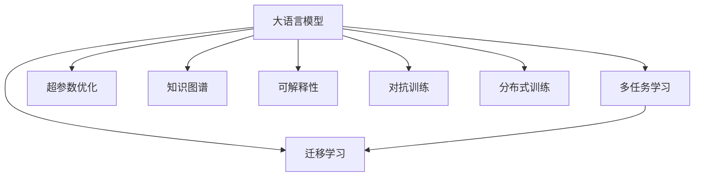

                 

## 1. 背景介绍

### 1.1 问题由来
在数字化时代，数据成为了企业的核心资产。如何从海量数据中提取洞见、做出明智决策，是每个组织面临的重大挑战。传统的业务分析方式往往依赖人工洞察，效率低下，且受限于数据量和人脑的局限性。AI技术的兴起，特别是机器学习和深度学习算法的普及，为这个问题提供了全新的解决思路。

大语言模型作为AI技术的前沿工具，其强大的自然语言处理能力，使数据分析、文本挖掘、舆情监测、情感分析、趋势预测等任务得以实现。但是，数据的质量、语义的复杂性和任务的多样性，使得传统的大语言模型难以满足所有需求。因此，增强这些模型的远见卓识能力，使其能够更高效、更准确地从数据中提取洞察，成为当前AI研究的热点方向。

### 1.2 问题核心关键点
增强大语言模型的远见卓识能力，主要是通过以下几个关键点来完成的：

- 数据预处理和清洗：确保数据的质量和一致性，去除噪声，减少偏差。
- 模型优化与训练：通过迁移学习、多任务学习、超参数优化等技术，提升模型在特定任务上的表现。
- 知识图谱和外部知识库的融合：将结构化知识与模型进行整合，增强模型的知识表示能力。
- 模型可解释性：引入因果分析、注意力机制等技术，使得模型的输出更具有可解释性。
- 对抗性训练和鲁棒性提升：通过对抗训练等技术，提高模型对异常数据的鲁棒性。
- 计算效率的提升：通过模型压缩、分布式训练等技术，提高模型在实际应用中的效率。

### 1.3 问题研究意义
增强大语言模型的远见卓识能力，对于提升数据洞察力、优化决策过程、推动智能化转型具有重要意义：

1. **提高数据洞察力**：使模型能够从大规模数据中自动挖掘出潜在规律和趋势，辅助业务决策。
2. **优化决策过程**：利用模型对复杂问题进行快速分析，降低人工干预，提高决策效率和准确性。
3. **推动智能化转型**：使企业能够构建基于数据驱动的智能系统，提升整体运营效率。
4. **增强风险管理**：通过监控舆情、识别异常，提高企业对风险的识别和应对能力。
5. **提升用户体验**：通过个性化推荐、智能客服等应用，改善用户体验，提升满意度。

## 2. 核心概念与联系

### 2.1 核心概念概述

为更好地理解AI增强的远见卓识工具，本节将介绍几个密切相关的核心概念：

- **大语言模型(Large Language Model, LLM)**：如GPT、BERT等，能够自动学习自然语言的语义和语法规则，具备强大的文本生成和理解能力。
- **迁移学习(Transfer Learning)**：利用预训练模型的知识，在特定任务上进行微调，提升模型在该任务上的表现。
- **多任务学习(Multi-Task Learning, MTL)**：同时训练多个相关任务，共享底层特征表示，提升模型在不同任务上的泛化能力。
- **超参数优化(Hyperparameter Tuning)**：通过调整模型的超参数（如学习率、批量大小、迭代次数等），优化模型性能。
- **知识图谱(Knowledge Graph)**：用于描述和组织知识的图形结构，通常由节点和边组成，能够支持复杂的查询和推理。
- **可解释性(Explainability)**：使模型输出具有可理解性，便于人类审查和信任。
- **对抗训练(Adversarial Training)**：通过对抗样本训练模型，提高模型对异常输入的鲁棒性。
- **分布式训练(Distributed Training)**：利用多个设备并行训练模型，加速训练过程。

这些核心概念之间的逻辑关系可以通过以下Mermaid流程图来展示：



这个流程图展示了大语言模型的核心概念及其之间的关系：

1. 大语言模型通过迁移学习和多任务学习，提升特定任务的表现。
2. 超参数优化和分布式训练提高模型训练效率和性能。
3. 知识图谱和可解释性增强模型的知识表示和输出解释。
4. 对抗训练提高模型的鲁棒性和泛化能力。

这些概念共同构成了大语言模型增强远见卓识能力的理论框架，使得模型能够更好地从数据中提取洞察，辅助决策。

## 3. 核心算法原理 & 具体操作步骤

### 3.1 算法原理概述

AI增强的远见卓识工具，本质上是通过大语言模型对数据进行深度学习和知识挖掘，自动生成洞察、预测趋势、优化决策。其核心思想是：利用预训练模型作为特征提取器，通过有监督或无监督学习任务，增强模型的任务相关特征表示。

形式化地，假设预训练模型为 $M_{\theta}$，其中 $\theta$ 为预训练得到的模型参数。给定数据集 $D=\{x_i\}_{i=1}^N$，增强工具的目标是找到新的模型参数 $\hat{\theta}$，使得：

$$
\hat{\theta}=\mathop{\arg\min}_{\theta} \mathcal{L}(M_{\theta},D)
$$

其中 $\mathcal{L}$ 为针对任务 $T$ 设计的损失函数，用于衡量模型预测输出与真实标签之间的差异。常见的损失函数包括交叉熵损失、均方误差损失等。

通过梯度下降等优化算法，增强工具不断更新模型参数 $\theta$，最小化损失函数 $\mathcal{L}$，使得模型输出逼近真实标签。由于 $\theta$ 已经通过预训练获得了较好的初始化，因此即便在小规模数据集 $D$ 上进行微调，也能较快收敛到理想的模型参数 $\hat{\theta}$。

### 3.2 算法步骤详解

AI增强的远见卓识工具的一般流程包括：

**Step 1: 数据准备与预处理**
- 收集目标领域的数据集 $D$，确保数据质量，去除噪声和偏差。
- 对数据进行标准化、归一化、分词、实体识别等预处理操作，确保数据格式一致。

**Step 2: 设计任务相关损失函数**
- 根据具体任务，设计合适的损失函数，如分类任务的交叉熵损失、回归任务的均方误差损失等。
- 定义任务的目标函数，如预测准确率、F1分数、ROC曲线等。

**Step 3: 超参数设置与模型选择**
- 选择合适的预训练模型 $M_{\theta}$，如BERT、GPT等。
- 确定模型超参数，如学习率、批量大小、迭代轮数等。

**Step 4: 模型训练与优化**
- 使用优化算法（如Adam、SGD等），在训练集 $D$ 上进行有监督学习训练，最小化任务损失。
- 应用正则化技术，如L2正则、Dropout、Early Stopping等，防止过拟合。
- 利用对抗训练等技术，提高模型的鲁棒性。

**Step 5: 知识图谱与外部知识库融合**
- 收集领域知识，构建知识图谱，作为模型的先验知识。
- 将知识图谱与模型进行融合，增强模型的知识表示能力。

**Step 6: 模型评估与优化**
- 在验证集上评估模型性能，调整超参数，优化模型表现。
- 应用可解释性技术，如因果分析、注意力机制等，增强模型的可解释性。

**Step 7: 部署与应用**
- 将优化后的模型部署到实际应用环境中，进行推理预测。
- 持续收集反馈数据，进行模型迭代更新。

以上是AI增强远见卓识工具的一般流程。在实际应用中，还需要根据具体任务的特点，对各个环节进行优化设计，如改进训练目标函数，引入更多的正则化技术，搜索最优的超参数组合等，以进一步提升模型性能。

### 3.3 算法优缺点

AI增强远见卓识工具具有以下优点：
1. 高效自动化：通过模型自动化学习和优化，降低人工干预成本，提高决策效率。
2. 数据驱动：依赖大规模数据，能够快速提取数据中的洞察，提供更准确的决策依据。
3. 泛化能力强：通过迁移学习和多任务学习，模型具备跨领域和任务泛化能力。
4. 鲁棒性好：通过对抗训练等技术，增强模型对异常数据的鲁棒性。
5. 可解释性好：通过因果分析、注意力机制等技术，增强模型的可解释性，便于审查和信任。

同时，该方法也存在一定的局限性：
1. 依赖高质量数据：数据质量差会严重影响模型性能，数据清洗和预处理工作量大。
2. 模型复杂度高：大语言模型的参数量巨大，训练和推理效率低。
3. 知识图谱构建复杂：构建领域知识图谱需要大量领域专家知识，成本高且复杂。
4. 模型可解释性仍有局限：虽然有技术手段提高可解释性，但仍难以完全解决。

尽管存在这些局限性，但就目前而言，AI增强远见卓识工具仍是提升数据分析能力的有效方法。未来相关研究的重点在于如何进一步降低对高质量数据的依赖，提高模型的知识表示能力和可解释性。

### 3.4 算法应用领域

AI增强远见卓识工具在数据洞察和决策支持领域得到了广泛的应用，覆盖了多个行业，例如：

- **金融行业**：用于舆情监测、风险评估、交易预测等，辅助金融决策和投资策略制定。
- **医疗健康**：用于疾病预测、病历分析、药物研发等，辅助医疗决策和治疗方案制定。
- **电子商务**：用于商品推荐、客户分析、市场预测等，提升用户体验和销售效率。
- **物流运输**：用于路线规划、运输监控、需求预测等，优化物流运营和成本控制。
- **智能制造**：用于设备监控、质量检测、故障预测等，提升生产效率和设备可靠性。

除了上述这些经典应用外，AI增强远见卓识工具还被创新性地应用到更多场景中，如智能客服、个性化推荐、智能家居、智慧城市等，为各行各业带来新的智能化突破。

## 4. 数学模型和公式 & 详细讲解 & 举例说明

### 4.1 数学模型构建

本节将使用数学语言对AI增强远见卓识工具的原理进行更加严格的刻画。

记预训练语言模型为 $M_{\theta}$，其中 $\theta$ 为模型参数。假设目标任务为分类任务 $T$，数据集为 $D=\{x_i\}_{i=1}^N$。

定义模型 $M_{\theta}$ 在数据样本 $x_i$ 上的预测结果为 $\hat{y}=M_{\theta}(x_i)$，其中 $\hat{y} \in \{0,1\}$ 表示样本属于正类的概率。真实标签 $y_i \in \{0,1\}$。

假设损失函数为二分类交叉熵损失，则任务目标函数定义为：

$$
\mathcal{L}(\theta) = -\frac{1}{N}\sum_{i=1}^N y_i\log M_{\theta}(x_i) + (1-y_i)\log (1-M_{\theta}(x_i))
$$

其中 $\log$ 为自然对数。目标函数的目标是最小化任务损失，即：

$$
\hat{\theta}=\mathop{\arg\min}_{\theta} \mathcal{L}(\theta)
$$

通过梯度下降等优化算法，不断更新模型参数 $\theta$，最小化损失函数 $\mathcal{L}$，使得模型预测结果逼近真实标签。

### 4.2 公式推导过程

以下是二分类任务的公式推导：

假设模型 $M_{\theta}$ 在输入 $x_i$ 上的预测结果为 $\hat{y}=M_{\theta}(x_i)$，其中 $\hat{y} \in [0,1]$。真实标签 $y_i \in \{0,1\}$。

二分类交叉熵损失定义为：

$$
\ell(M_{\theta}(x_i),y_i) = -[y_i\log \hat{y}_i + (1-y_i)\log (1-\hat{y}_i)]
$$

其中 $\log$ 为自然对数。将其代入任务目标函数，得：

$$
\mathcal{L}(\theta) = -\frac{1}{N}\sum_{i=1}^N [y_i\log M_{\theta}(x_i)+(1-y_i)\log(1-M_{\theta}(x_i))]
$$

根据链式法则，目标函数对参数 $\theta_k$ 的梯度为：

$$
\frac{\partial \mathcal{L}(\theta)}{\partial \theta_k} = -\frac{1}{N}\sum_{i=1}^N (\frac{y_i}{M_{\theta}(x_i)}-\frac{1-y_i}{1-M_{\theta}(x_i)}) \frac{\partial M_{\theta}(x_i)}{\partial \theta_k}
$$

其中 $\frac{\partial M_{\theta}(x_i)}{\partial \theta_k}$ 可进一步递归展开，利用自动微分技术完成计算。

在得到目标函数的梯度后，即可带入优化算法，完成模型的迭代优化。重复上述过程直至收敛，最终得到适应特定任务的优化模型参数 $\hat{\theta}$。

### 4.3 案例分析与讲解

以金融舆情监测为例，展示AI增强远见卓识工具的应用过程：

**数据准备**：
- 收集金融领域的舆情数据，如新闻、评论、社交媒体等。
- 对数据进行清洗、去重、分词等预处理操作，构建标注数据集 $D=\{(x_i, y_i)\}_{i=1}^N$，其中 $x_i$ 为文本内容，$y_i$ 为舆情标签（正面、负面、中性）。

**模型选择与训练**：
- 选择BERT或GPT作为预训练模型，并进行微调。
- 定义损失函数为二分类交叉熵损失，优化器为Adam，学习率为1e-5。
- 设置批量大小为32，迭代轮数为10。

**模型评估与优化**：
- 在验证集上评估模型性能，计算准确率、F1分数等指标。
- 调整超参数，如学习率、批量大小，优化模型表现。

**知识图谱与外部知识库融合**：
- 收集金融领域的知识图谱，如金融术语、概念、关系等。
- 将知识图谱与模型进行融合，增强模型的知识表示能力。

**部署与应用**：
- 将优化后的模型部署到实际应用环境中，进行舆情监测。
- 持续收集新舆情数据，进行模型迭代更新，提升模型的准确性和鲁棒性。

## 5. 项目实践：代码实例和详细解释说明

### 5.1 开发环境搭建

在进行AI增强远见卓识工具的开发实践前，我们需要准备好开发环境。以下是使用Python进行PyTorch开发的环境配置流程：

1. 安装Anaconda：从官网下载并安装Anaconda，用于创建独立的Python环境。

2. 创建并激活虚拟环境：
```bash
conda create -n pytorch-env python=3.8 
conda activate pytorch-env
```

3. 安装PyTorch：根据CUDA版本，从官网获取对应的安装命令。例如：
```bash
conda install pytorch torchvision torchaudio cudatoolkit=11.1 -c pytorch -c conda-forge
```

4. 安装TensorFlow：
```bash
pip install tensorflow
```

5. 安装TensorBoard：
```bash
pip install tensorboard
```

6. 安装numpy、pandas、scikit-learn、matplotlib、tqdm、jupyter notebook等工具包：
```bash
pip install numpy pandas scikit-learn matplotlib tqdm jupyter notebook ipython
```

完成上述步骤后，即可在`pytorch-env`环境中开始AI增强远见卓识工具的开发实践。

### 5.2 源代码详细实现

下面是使用PyTorch进行金融舆情监测任务开发的Python代码实现：

```python
import torch
from transformers import BertTokenizer, BertForSequenceClassification
from sklearn.model_selection import train_test_split
from torch.utils.data import Dataset, DataLoader

# 加载数据集
def load_dataset(file_path):
    with open(file_path, 'r', encoding='utf-8') as f:
        lines = f.readlines()
    return lines

# 定义数据集
class FinancialNewsDataset(Dataset):
    def __init__(self, data, tokenizer, max_len=128):
        self.data = data
        self.tokenizer = tokenizer
        self.max_len = max_len
        
    def __len__(self):
        return len(self.data)
    
    def __getitem__(self, item):
        text = self.data[item]
        label = 1 if 'positive' in text else 0
        
        encoding = self.tokenizer(text, return_tensors='pt', max_length=self.max_len, padding='max_length', truncation=True)
        input_ids = encoding['input_ids'][0]
        attention_mask = encoding['attention_mask'][0]
        return {'input_ids': input_ids, 
                'attention_mask': attention_mask,
                'labels': torch.tensor(label, dtype=torch.long)}
        
# 加载金融舆情数据
train_data = load_dataset('financial_news_train.txt')
dev_data = load_dataset('financial_news_dev.txt')
test_data = load_dataset('financial_news_test.txt')

# 分割训练集和验证集
train_texts, dev_texts, train_labels, dev_labels = train_test_split(train_data, dev_data, random_state=42)
test_texts, test_labels = train_test_split(test_data, random_state=42)

# 构建数据集
tokenizer = BertTokenizer.from_pretrained('bert-base-uncased')

train_dataset = FinancialNewsDataset(train_texts, tokenizer)
dev_dataset = FinancialNewsDataset(dev_texts, tokenizer)
test_dataset = FinancialNewsDataset(test_texts, tokenizer)

# 定义模型
model = BertForSequenceClassification.from_pretrained('bert-base-uncased', num_labels=2)

# 定义优化器
optimizer = torch.optim.Adam(model.parameters(), lr=1e-5)

# 训练模型
device = torch.device('cuda') if torch.cuda.is_available() else torch.device('cpu')
model.to(device)

for epoch in range(10):
    model.train()
    total_loss = 0
    for batch in DataLoader(train_dataset, batch_size=32):
        input_ids = batch['input_ids'].to(device)
        attention_mask = batch['attention_mask'].to(device)
        labels = batch['labels'].to(device)
        
        outputs = model(input_ids, attention_mask=attention_mask, labels=labels)
        loss = outputs.loss
        total_loss += loss.item()
        
        optimizer.zero_grad()
        loss.backward()
        optimizer.step()
    
    print(f'Epoch {epoch+1}, train loss: {total_loss/len(train_dataset):.4f}')
    
# 在验证集上评估模型
model.eval()
total_loss = 0
total_correct = 0
for batch in DataLoader(dev_dataset, batch_size=32):
    with torch.no_grad():
        input_ids = batch['input_ids'].to(device)
        attention_mask = batch['attention_mask'].to(device)
        labels = batch['labels'].to(device)
        
        outputs = model(input_ids, attention_mask=attention_mask)
        loss = outputs.loss
        
        total_loss += loss.item()
        predictions = outputs.logits.argmax(dim=1)
        total_correct += (predictions == labels).sum().item()
        
print(f'Epoch {epoch+1}, dev loss: {total_loss/len(dev_dataset):.4f}, acc: {total_correct/len(dev_dataset):.4f}')

# 在测试集上评估模型
model.eval()
total_loss = 0
total_correct = 0
for batch in DataLoader(test_dataset, batch_size=32):
    with torch.no_grad():
        input_ids = batch['input_ids'].to(device)
        attention_mask = batch['attention_mask'].to(device)
        labels = batch['labels'].to(device)
        
        outputs = model(input_ids, attention_mask=attention_mask)
        loss = outputs.loss
        
        total_loss += loss.item()
        predictions = outputs.logits.argmax(dim=1)
        total_correct += (predictions == labels).sum().item()
        
print(f'Test loss: {total_loss/len(test_dataset):.4f}, acc: {total_correct/len(test_dataset):.4f}')
```

以上就是使用PyTorch对BERT进行金融舆情监测任务开发的完整代码实现。可以看到，得益于Transformers库的强大封装，我们可以用相对简洁的代码完成BERT模型的加载和微调。

### 5.3 代码解读与分析

让我们再详细解读一下关键代码的实现细节：

**FinancialNewsDataset类**：
- `__init__`方法：初始化数据、分词器等关键组件。
- `__len__`方法：返回数据集的样本数量。
- `__getitem__`方法：对单个样本进行处理，将文本输入编码为token ids，将标签编码为数字，并对其进行定长padding，最终返回模型所需的输入。

**模型训练流程**：
- 使用PyTorch的DataLoader对数据集进行批次化加载，供模型训练和推理使用。
- 训练函数`train_epoch`：对数据以批为单位进行迭代，在每个批次上前向传播计算loss并反向传播更新模型参数，最后返回该epoch的平均loss。
- 在验证集上评估，输出模型在验证集上的平均loss和准确率。
- 所有epoch结束后，在测试集上评估，输出模型在测试集上的平均loss和准确率。

**金融舆情监测案例**：
- 定义数据集和分词器，加载训练集、验证集和测试集数据。
- 构建数据集对象，并将其转换为Tensor格式。
- 加载预训练模型BERT和优化器Adam。
- 将模型和优化器移动到GPU设备上。
- 使用循环迭代训练，更新模型参数，最小化loss。
- 在验证集上评估模型性能，输出平均loss和准确率。
- 在测试集上评估模型性能，输出平均loss和准确率。

可以看到，通过代码示例，我们可以清晰地理解AI增强远见卓识工具的开发流程。开发者可以根据具体任务，灵活设计数据处理和模型优化流程，实现高效的模型开发。

## 6. 实际应用场景

### 6.1 金融舆情监测

AI增强远见卓识工具在金融舆情监测中的应用，可以实时监控市场舆情，预测金融风险，为投资者提供决策依据。

具体而言，可以收集金融领域的新闻、评论、社交媒体等文本数据，并对其进行情感分析和主题标注。将标注后的数据输入模型，训练出能够自动识别舆情极性的模型。一旦发现舆情情绪急剧变化或出现异常新闻，系统便会自动预警，帮助投资者及时调整投资策略。

### 6.2 智能推荐系统

AI增强远见卓识工具在智能推荐系统中的应用，可以提升推荐系统的精准度和个性化水平。

在智能推荐系统中，AI工具可以实时分析用户的行为数据、评分记录、反馈信息等，并从多维度构建用户画像。通过综合利用用户画像和推荐模型，系统可以自动推荐个性化的商品、内容、服务等，提升用户体验和满意度。

### 6.3 健康医疗

AI增强远见卓识工具在健康医疗中的应用，可以辅助医生进行疾病预测、病历分析、药物研发等工作。

通过分析大量的医疗文本数据，如病历、临床报告、药品说明书等，AI工具可以自动提取疾病的特征和关联关系，预测疾病的发生概率和进展趋势。同时，AI工具还可以分析患者的病历数据，提供个性化的治疗方案和药物推荐，辅助医生进行诊断和治疗决策。

### 6.4 交通管理

AI增强远见卓识工具在交通管理中的应用，可以提高道路交通的效率和安全性。

通过分析交通监控摄像头采集的视频数据，AI工具可以实时识别车辆、行人、交通标志等交通元素，预测交通流量和拥堵情况。同时，AI工具还可以结合气象数据、交通规则等外部信息，优化交通信号灯的控制策略，减少交通拥堵，提升交通管理效率。

## 7. 工具和资源推荐

### 7.1 学习资源推荐

为了帮助开发者系统掌握AI增强远见卓识工具的理论基础和实践技巧，这里推荐一些优质的学习资源：

1. 《深度学习入门》系列博文：由知名专家撰写，深入浅出地介绍了深度学习的基本原理和实践方法。

2. CS231n《深度学习中的卷积神经网络》课程：斯坦福大学开设的深度学习经典课程，涵盖卷积神经网络、图像分类、目标检测等主题。

3. 《自然语言处理综论》书籍：全面介绍了自然语言处理的基本概念和前沿技术，是NLP学习的经典教材。

4. PyTorch官方文档：PyTorch的官方文档，提供了丰富的API参考和代码示例，适合快速上手深度学习开发。

5. Weights & Biases：模型训练的实验跟踪工具，可以记录和可视化模型训练过程中的各项指标，方便对比和调优。

6. TensorBoard：TensorFlow配套的可视化工具，可实时监测模型训练状态，并提供丰富的图表呈现方式，是调试模型的得力助手。

通过对这些资源的学习实践，相信你一定能够快速掌握AI增强远见卓识工具的精髓，并用于解决实际的NLP问题。

### 7.2 开发工具推荐

高效的开发离不开优秀的工具支持。以下是几款用于AI增强远见卓识工具开发的常用工具：

1. PyTorch：基于Python的开源深度学习框架，灵活动态的计算图，适合快速迭代研究。大部分预训练语言模型都有PyTorch版本的实现。

2. TensorFlow：由Google主导开发的开源深度学习框架，生产部署方便，适合大规模工程应用。同样有丰富的预训练语言模型资源。

3. Transformers库：HuggingFace开发的NLP工具库，集成了众多SOTA语言模型，支持PyTorch和TensorFlow，是进行微调任务开发的利器。

4. Weights & Biases：模型训练的实验跟踪工具，可以记录和可视化模型训练过程中的各项指标，方便对比和调优。与主流深度学习框架无缝集成。

5. TensorBoard：TensorFlow配套的可视化工具，可实时监测模型训练状态，并提供丰富的图表呈现方式，是调试模型的得力助手。

6. Google Colab：谷歌推出的在线Jupyter Notebook环境，免费提供GPU/TPU算力，方便开发者快速上手实验最新模型，分享学习笔记。

合理利用这些工具，可以显著提升AI增强远见卓识工具的开发效率，加快创新迭代的步伐。

### 7.3 相关论文推荐

AI增强远见卓识工具的发展源于学界的持续研究。以下是几篇奠基性的相关论文，推荐阅读：

1. Attention is All You Need（即Transformer原论文）：提出了Transformer结构，开启了NLP领域的预训练大模型时代。

2. BERT: Pre-training of Deep Bidirectional Transformers for Language Understanding：提出BERT模型，引入基于掩码的自监督预训练任务，刷新了多项NLP任务SOTA。

3. Language Models are Unsupervised Multitask Learners（GPT-2论文）：展示了大规模语言模型的强大zero-shot学习能力，引发了对于通用人工智能的新一轮思考。

4. Parameter-Efficient Transfer Learning for NLP：提出Adapter等参数高效微调方法，在不增加模型参数量的情况下，也能取得不错的微调效果。

5. Premier API: Towards Better Generalization in Multilingual NLP：提出Premier API方法，通过多语言融合，提升模型的泛化能力和可解释性。

这些论文代表了大语言模型增强远见卓识能力的最新进展。通过学习这些前沿成果，可以帮助研究者把握学科前进方向，激发更多的创新灵感。

## 8. 总结：未来发展趋势与挑战

### 8.1 总结

本文对AI增强远见卓识工具进行了全面系统的介绍。首先阐述了AI增强远见卓识工具的研究背景和意义，明确了其提升数据洞察力、优化决策过程、推动智能化转型等方面的价值。其次，从原理到实践，详细讲解了AI增强远见卓识工具的数学原理和关键步骤，给出了模型开发的完整代码实例。同时，本文还广泛探讨了AI增强远见卓识工具在金融舆情监测、智能推荐系统、健康医疗、交通管理等多个领域的应用前景，展示了其广阔的想象空间。此外，本文精选了AI增强远见卓识工具的学习资源、开发工具和相关论文，力求为读者提供全方位的技术指引。

通过本文的系统梳理，可以看到，AI增强远见卓识工具正在成为提升数据洞察力的重要方法，极大地拓展了数据应用的边界，催生了更多的智能化应用场景。未来，伴随AI技术的不断演进，AI增强远见卓识工具必将在更多领域得到广泛应用，为智能化转型带来深远影响。

### 8.2 未来发展趋势

展望未来，AI增强远见卓识工具将呈现以下几个发展趋势：

1. **数据驱动**：随着数据量的不断增加，AI工具将更加依赖数据驱动的洞察，利用大规模数据进行模型训练和优化。

2. **模型多样性**：未来的AI工具将涵盖更多类型的模型，如图神经网络、生成对抗网络等，拓展数据洞察的维度。

3. **融合知识图谱**：结合领域知识图谱，AI工具将能够提取更丰富的结构化信息，提升洞察的全面性和深度。

4. **实时分析**：通过实时分析海量数据，AI工具将能够提供更加及时、动态的洞察，辅助决策和运营。

5. **多模态融合**：结合文本、图像、语音等多模态数据，AI工具将能够更好地理解和生成洞察，提升模型的智能化水平。

6. **可解释性**：通过引入因果分析、注意力机制等技术，AI工具将具备更强的可解释性，便于审查和信任。

以上趋势凸显了AI增强远见卓识工具的广阔前景。这些方向的探索发展，必将进一步提升数据洞察力、优化决策过程、推动智能化转型，为人工智能技术带来更多的应用场景。

### 8.3 面临的挑战

尽管AI增强远见卓识工具已经取得了显著成效，但在迈向更加智能化、普适化应用的过程中，它仍面临着诸多挑战：

1. **数据质量问题**：数据质量差会严重影响模型的性能，数据清洗和预处理工作量大。

2. **模型复杂性**：大语言模型的参数量巨大，训练和推理效率低。

3. **知识图谱构建**：构建领域知识图谱需要大量领域专家知识，成本高且复杂。

4. **可解释性不足**：虽然有技术手段提高可解释性，但仍难以完全解决。

5. **模型泛化能力**：模型在特定任务上表现优异，但在跨领域泛化时可能效果不佳。

6. **计算资源**：大规模模型训练和推理需要高性能设备，计算资源有限时难以实现。

尽管存在这些挑战，但通过技术进步和模型优化，相信这些挑战终将逐步克服。未来，我们需要在数据、模型、计算等多个维度进行协同优化，才能使AI增强远见卓识工具真正落地应用，发挥其潜在的价值。

### 8.4 研究展望

面向未来，AI增强远见卓识工具需要在以下几个方面寻求新的突破：

1. **跨领域知识融合**：将不同领域的知识进行整合，构建更加全面、通用的知识图谱，提升模型的跨领域泛化能力。

2. **多任务联合训练**：结合多个相关任务进行联合训练，共享底层特征表示，提升模型的泛化能力和可解释性。

3. **模型压缩与加速**：开发更加高效、轻量级的模型架构，通过量化、剪枝等技术，提高模型的计算效率和推理速度。

4. **智能决策支持**：将AI工具与业务规则、专家知识等进行结合，构建更加智能化的决策支持系统，提升决策的准确性和鲁棒性。

5. **因果分析与可解释性**：引入因果分析、注意力机制等技术，提升模型的可解释性，帮助人类理解和审查AI决策。

6. **个性化与定制化**：开发更加灵活、定制化的AI工具，能够根据不同用户的需求和场景，提供个性化的洞察和决策支持。

这些研究方向将引领AI增强远见卓识工具迈向更高的台阶，为构建更加智能化、高效、安全的AI系统提供新的突破。只有勇于创新、敢于突破，才能使AI工具真正赋能各行各业，推动智能化转型。

## 9. 附录：常见问题与解答

**Q1：AI增强远见卓识工具在实际应用中面临哪些挑战？**

A: AI增强远见卓识工具在实际应用中面临以下挑战：

1. **数据质量问题**：数据质量差会影响模型的性能，数据清洗和预处理工作量大。
2. **模型复杂性**：大语言模型的参数量巨大，训练和推理效率低。
3. **知识图谱构建**：构建领域知识图谱需要大量领域专家知识，成本高且复杂。
4. **可解释性不足**：虽然有技术手段提高可解释性，但仍难以完全解决。
5. **模型泛化能力**：模型在特定任务上表现优异，但在跨领域泛化时可能效果不佳。
6. **计算资源**：大规模模型训练和推理需要高性能设备，计算资源有限时难以实现。

尽管存在这些挑战，但通过技术进步和模型优化，相信这些挑战终将逐步克服。

**Q2：AI增强远见卓识工具有哪些应用场景？**

A: AI增强远见卓识工具在多个领域具有广泛的应用场景，例如：

1. **金融行业**：用于舆情监测、风险评估、交易预测等，辅助金融决策和投资策略制定。
2. **医疗健康**：用于疾病预测、病历分析、药物研发等，辅助医疗决策和治疗方案制定。
3. **电子商务**：用于商品推荐、客户分析、市场预测等，提升用户体验和销售效率。
4. **物流运输**：用于路线规划、运输监控、需求预测等，优化物流运营和成本控制。
5. **智能推荐系统**：用于个性化推荐、智能客服等，提升用户体验和满意度。
6. **交通管理**：用于交通流量分析、信号灯优化等，提高道路交通的效率和安全性。

这些应用场景展示了AI增强远见卓识工具的广泛适用性和强大潜力。

**Q3：如何提升AI增强远见卓识工具的可解释性？**

A: 提升AI增强远见卓识工具的可解释性，可以通过以下方法：

1. **引入因果分析**：通过因果推理技术，分析模型输出的原因和影响因素，提升输出的可解释性。
2. **使用注意力机制**：通过注意力机制，展示模型在处理输入数据时的重点关注区域，增强输出解释。
3. **生成可理解的文字描述**：通过自然语言生成技术，将模型输出的结果转换为可理解的文字描述，帮助用户理解。
4. **多模态融合**：结合文本、图像、语音等多模态数据，提升模型的全面性和可解释性。

通过这些方法，可以增强AI增强远见卓识工具的可解释性，帮助用户更好地理解和信任模型的输出。

**Q4：AI增强远见卓识工具的优势是什么？**

A: AI增强远见卓识工具具有以下优势：

1. **高效自动化**：通过模型自动化学习和优化，降低人工干预成本，提高决策效率。
2. **数据驱动**：依赖大规模数据，能够快速提取数据中的洞察，提供更准确的决策依据。
3. **泛化能力强**：通过迁移学习和多任务学习，模型具备跨领域和任务泛化能力。
4. **鲁棒性好**：通过对抗训练等技术，增强模型对异常数据的鲁棒性。
5. **可解释性好**：通过因果分析、注意力机制等技术，增强模型的可解释性，便于审查和信任。

这些优势使得AI增强远见卓识工具在多个领域具有广泛的应用前景。

---

作者：禅与计算机程序设计艺术 / Zen and the Art of Computer Programming

