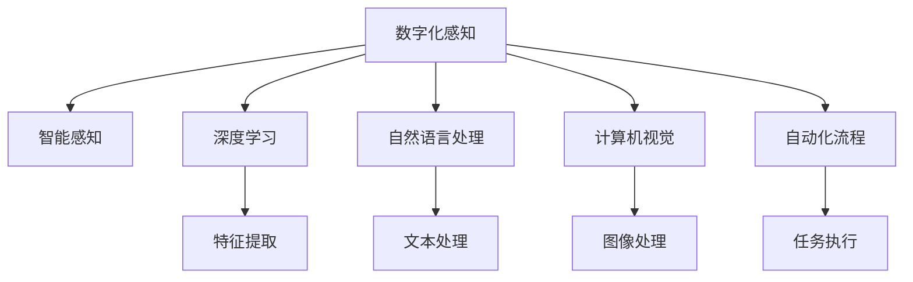

                 

# 数字化第七感：AI创造的新感知维度

> 关键词：数字化转型,智能感知,人工智能,深度学习,人机交互,自动化

## 1. 背景介绍

### 1.1 问题由来

21世纪以来，随着信息技术和大数据时代的到来，人类社会步入了数字化快速发展的崭新阶段。从生产到消费，从个人到企业，数字化浪潮几乎无所不至。然而，数字化并非仅仅意味着数据化、在线化，更在于通过数据驱动，重塑人类感知世界的方式，创造出新的“第七感”——数字化感知能力。

### 1.2 问题核心关键点

大范围数字化转型进程中，如何实现高效、实时、智能的感知与决策，成为了信息化进程中的核心问题。其关键在于：

- 理解现有数据。充分挖掘、分析海量数据，从中发现隐藏的模式和关联，为决策提供支持。
- 结合人工智能。运用机器学习、深度学习等算法，将数据转化为知识，实现更高效、更智能的感知和决策。
- 优化人机交互。通过自然语言处理、计算机视觉等技术，增强人机交流，提升用户体验。
- 自动化流程。利用智能自动化工具，自动处理重复性任务，减轻人力负担，提高效率。

数字化感知能力的构建，是数字化转型的重要基础和核心。本文将深入探讨AI技术在感知维度上的突破与应用，旨在为科技工作者提供实际可行的操作指导。

## 2. 核心概念与联系

### 2.1 核心概念概述

为更深入理解AI技术在感知维度上的应用，本节将介绍几个关键概念：

- **数字化感知**：利用AI技术从数据中提取、分析和应用信息，帮助用户理解、决策和操作，实现“无感”的数字化体验。
- **智能感知**：指AI系统通过学习训练，能够智能地从环境中获取信息，并根据用户需求或环境变化调整输出，实现“自适应”的智能决策。
- **深度学习**：一种基于人工神经网络的机器学习技术，能够自动从数据中学习特征表示，用于分类、回归、图像处理等任务。
- **自然语言处理**：AI处理人类语言的技术，包括语音识别、自然语言理解、文本生成等，是实现人机交流的重要手段。
- **计算机视觉**：利用图像处理技术，使计算机能够“看”并理解图像内容，广泛应用于视频监控、医学影像等领域。
- **自动化流程**：通过AI技术，自动执行重复性、规则性任务，提高效率，减少错误，使人类从繁重劳动中解放出来。

这些概念之间的逻辑关系可以通过以下Mermaid流程图来展示：



这个流程图展示了大范围数字化感知能力的构建过程，其中“数字化感知”是核心目标，“智能感知”是其延伸，“深度学习”、“自然语言处理”、“计算机视觉”、“自动化流程”是实现手段。

## 3. 核心算法原理 & 具体操作步骤
### 3.1 算法原理概述

在数字化感知能力构建过程中，深度学习算法起着核心作用。深度学习通过多层神经网络自动提取、学习数据中的特征表示，能够处理复杂非线性关系，适用于大量高维数据的处理。

### 3.2 算法步骤详解

基于深度学习的数字化感知构建，主要包括以下几个关键步骤：

**Step 1: 数据预处理**

- 数据清洗：处理缺失、异常数据，保持数据质量。
- 数据归一化：将数据按一定比例缩放，使各特征值在相同尺度上。
- 数据划分：将数据分为训练集、验证集和测试集。

**Step 2: 特征提取**

- 选择合适的深度学习模型。如CNN、RNN、LSTM、Transformer等，根据任务需求选择最合适的模型结构。
- 训练模型：在训练集上使用梯度下降等优化算法，最小化损失函数，迭代更新模型参数。
- 评估模型：在验证集上评估模型性能，调整超参数，防止过拟合。
- 模型微调：在测试集上评估最终性能，对比不同算法，选择最优模型。

**Step 3: 感知应用**

- 智能感知：在获得模型后，将其应用于实际环境中，感知环境变化。
- 人机交互：将模型输出的结果转化为用户可理解的形式，如自然语言对话、图像标记等。
- 自动化流程：将模型嵌入自动化系统，自动执行任务，提升效率。

### 3.3 算法优缺点

基于深度学习的数字化感知构建方法，具有以下优点：

- **高效性**：通过自动化数据处理和模型训练，大大缩短了开发周期。
- **精度高**：深度学习模型能够自动提取、学习高维特征，精度较高。
- **泛化能力强**：模型具有良好的泛化能力，可以适应新的数据和环境。

同时，该方法也存在一些局限：

- **数据需求大**：深度学习模型需要大量数据进行训练，对于小规模数据效果不佳。
- **计算成本高**：深度学习模型通常参数较多，训练和推理耗时较长，计算成本较高。
- **模型复杂性高**：深度学习模型结构复杂，难以解释其内部工作机制。
- **易过拟合**：深度学习模型容易过拟合，需要谨慎设置超参数。

### 3.4 算法应用领域

基于深度学习的数字化感知构建方法，已在多个领域得到了广泛应用：

- **医疗健康**：通过深度学习模型对医学影像进行分析，辅助医生诊断疾病。
- **金融行业**：利用深度学习模型进行股票预测、欺诈检测、客户分析等任务。
- **智能交通**：通过计算机视觉技术，对交通监控视频进行分析，优化交通管理。
- **智能制造**：利用自动化流程技术，实现生产线的智能调度、质量检测等。
- **智能家居**：通过自然语言处理技术，实现智能语音控制、场景识别等。
- **零售电商**：通过深度学习模型对用户行为进行分析，实现个性化推荐、库存管理等。

## 4. 数学模型和公式 & 详细讲解 & 举例说明
### 4.1 数学模型构建

深度学习模型通常由输入层、若干隐藏层和输出层组成。以图像识别为例，构建的模型包括：

- 输入层：接收输入图像数据。
- 隐藏层：通过卷积、池化等操作提取图像特征。
- 输出层：通过全连接层输出分类结果。

具体来说，对于图像识别任务，假设输入为大小为$M\times N$的图像$x$，输出为$K$类标签$y$，则模型可以表示为：

$$
y = f(x; \theta)
$$

其中$f$为模型函数，$\theta$为模型参数。模型的训练目标为最小化损失函数$\mathcal{L}$，可以通过反向传播算法进行参数更新：

$$
\theta = \mathop{\arg\min}_{\theta} \mathcal{L}(y, f(x; \theta))
$$

在实际应用中，我们通常使用交叉熵损失函数，其定义为：

$$
\mathcal{L}(y, f(x; \theta)) = -\frac{1}{N} \sum_{i=1}^N \sum_{k=1}^K y_i^k \log f(x; \theta)_k
$$

其中$y_i^k$表示第$i$个样本的第$k$类标签。

### 4.2 公式推导过程

对于交叉熵损失函数，其梯度计算公式为：

$$
\frac{\partial \mathcal{L}}{\partial \theta} = -\frac{1}{N} \sum_{i=1}^N \sum_{k=1}^K \frac{y_i^k}{f(x; \theta)_k} (\frac{\partial f(x; \theta)_k}{\partial \theta})
$$

在反向传播过程中，根据链式法则计算每一层参数的梯度。设$W$为权重，$b$为偏置，$A$为激活函数，则：

$$
\frac{\partial \mathcal{L}}{\partial W} = \frac{\partial f(x; \theta)}{\partial W} \cdot \frac{\partial \mathcal{L}}{\partial f(x; \theta)}
$$

具体来说，卷积层参数梯度计算为：

$$
\frac{\partial \mathcal{L}}{\partial W_{i,j}} = \frac{\partial f(x; \theta)}{\partial \tilde{W}_{i,j}} \cdot \frac{\partial \tilde{f}(\tilde{x}; \tilde{\theta})}{\partial \tilde{W}_{i,j}}
$$

其中$\tilde{W}_{i,j}$为卷积核参数。

### 4.3 案例分析与讲解

以图像识别任务为例，以下是一个基于CNN的图像识别模型构建及训练流程：

1. **模型搭建**

   ```python
   import torch
   import torch.nn as nn
   import torch.optim as optim
   from torchvision import datasets, transforms

   # 定义模型
   class CNNModel(nn.Module):
       def __init__(self):
           super(CNNModel, self).__init__()
           self.conv1 = nn.Conv2d(3, 16, 3, padding=1)
           self.relu1 = nn.ReLU()
           self.pool1 = nn.MaxPool2d(2, 2)
           self.conv2 = nn.Conv2d(16, 32, 3, padding=1)
           self.relu2 = nn.ReLU()
           self.pool2 = nn.MaxPool2d(2, 2)
           self.fc1 = nn.Linear(32 * 7 * 7, 64)
           self.relu3 = nn.ReLU()
           self.fc2 = nn.Linear(64, 10)
   
       def forward(self, x):
           x = self.conv1(x)
           x = self.relu1(x)
           x = self.pool1(x)
           x = self.conv2(x)
           x = self.relu2(x)
           x = self.pool2(x)
           x = x.view(-1, 32 * 7 * 7)
           x = self.fc1(x)
           x = self.relu3(x)
           x = self.fc2(x)
           return x
   
   model = CNNModel()
   ```

2. **数据准备**

   ```python
   # 加载数据集
   train_data = datasets.CIFAR10(root='data', train=True, download=True, transform=transforms.ToTensor())
   train_loader = torch.utils.data.DataLoader(train_data, batch_size=64, shuffle=True)
   
   test_data = datasets.CIFAR10(root='data', train=False, download=True, transform=transforms.ToTensor())
   test_loader = torch.utils.data.DataLoader(test_data, batch_size=64, shuffle=False)
   ```

3. **模型训练**

   ```python
   # 定义优化器和损失函数
   optimizer = optim.Adam(model.parameters(), lr=0.001)
   criterion = nn.CrossEntropyLoss()

   # 训练模型
   for epoch in range(10):
       running_loss = 0.0
       for i, data in enumerate(train_loader, 0):
           inputs, labels = data
           optimizer.zero_grad()
           outputs = model(inputs)
           loss = criterion(outputs, labels)
           loss.backward()
           optimizer.step()

           running_loss += loss.item()
           if i % 100 == 99:
               print('[%d, %5d] loss: %.3f' % (epoch + 1, i + 1, running_loss / 100))
               running_loss = 0.0

   # 评估模型
   correct = 0
   total = 0
   with torch.no_grad():
       for data in test_loader:
           images, labels = data
           outputs = model(images)
           _, predicted = torch.max(outputs.data, 1)
           total += labels.size(0)
           correct += (predicted == labels).sum().item()

   print('Accuracy of the network on the 10000 test images: %d %%' % (100 * correct / total))
   ```

通过上述代码，我们可以构建并训练一个简单的图像分类器。利用深度学习模型，我们能够从图像中提取特征，并通过训练得到最优的分类器。

## 5. 项目实践：代码实例和详细解释说明
### 5.1 开发环境搭建

在进行数字化感知项目实践前，我们需要准备好开发环境。以下是使用Python进行PyTorch开发的环境配置流程：

1. 安装Anaconda：从官网下载并安装Anaconda，用于创建独立的Python环境。

2. 创建并激活虚拟环境：
```bash
conda create -n pytorch-env python=3.8 
conda activate pytorch-env
```

3. 安装PyTorch：根据CUDA版本，从官网获取对应的安装命令。例如：
```bash
conda install pytorch torchvision torchaudio cudatoolkit=11.1 -c pytorch -c conda-forge
```

4. 安装其他必需的库：
```bash
pip install numpy pandas scikit-learn matplotlib tqdm jupyter notebook ipython
```

完成上述步骤后，即可在`pytorch-env`环境中开始实践。

### 5.2 源代码详细实现

下面我们以图像识别任务为例，给出使用PyTorch进行CNN模型构建的详细代码实现。

首先，定义数据处理函数：

```python
import torch
import torch.nn as nn
import torch.optim as optim
from torchvision import datasets, transforms

# 数据预处理
transform = transforms.Compose([
    transforms.ToTensor(),
    transforms.Normalize((0.5, 0.5, 0.5), (0.5, 0.5, 0.5))
])

# 加载数据集
train_data = datasets.CIFAR10(root='data', train=True, download=True, transform=transform)
train_loader = torch.utils.data.DataLoader(train_data, batch_size=64, shuffle=True)

test_data = datasets.CIFAR10(root='data', train=False, download=True, transform=transform)
test_loader = torch.utils.data.DataLoader(test_data, batch_size=64, shuffle=False)
```

然后，定义模型：

```python
class CNNModel(nn.Module):
    def __init__(self):
        super(CNNModel, self).__init__()
        self.conv1 = nn.Conv2d(3, 16, 3, padding=1)
        self.relu1 = nn.ReLU()
        self.pool1 = nn.MaxPool2d(2, 2)
        self.conv2 = nn.Conv2d(16, 32, 3, padding=1)
        self.relu2 = nn.ReLU()
        self.pool2 = nn.MaxPool2d(2, 2)
        self.fc1 = nn.Linear(32 * 7 * 7, 64)
        self.relu3 = nn.ReLU()
        self.fc2 = nn.Linear(64, 10)
    
    def forward(self, x):
        x = self.conv1(x)
        x = self.relu1(x)
        x = self.pool1(x)
        x = self.conv2(x)
        x = self.relu2(x)
        x = self.pool2(x)
        x = x.view(-1, 32 * 7 * 7)
        x = self.fc1(x)
        x = self.relu3(x)
        x = self.fc2(x)
        return x
```

接着，定义优化器和损失函数：

```python
model = CNNModel()
optimizer = optim.Adam(model.parameters(), lr=0.001)
criterion = nn.CrossEntropyLoss()
```

最后，执行训练：

```python
epochs = 10
batch_size = 64

for epoch in range(epochs):
    running_loss = 0.0
    for i, data in enumerate(train_loader, 0):
        inputs, labels = data
        optimizer.zero_grad()
        outputs = model(inputs)
        loss = criterion(outputs, labels)
        loss.backward()
        optimizer.step()

        running_loss += loss.item()
        if i % 100 == 99:
            print('[%d, %5d] loss: %.3f' % (epoch + 1, i + 1, running_loss / 100))
            running_loss = 0.0

correct = 0
total = 0
with torch.no_grad():
    for data in test_loader:
        images, labels = data
        outputs = model(images)
        _, predicted = torch.max(outputs.data, 1)
        total += labels.size(0)
        correct += (predicted == labels).sum().item()

print('Accuracy of the network on the 10000 test images: %d %%' % (100 * correct / total))
```

以上就是使用PyTorch构建CNN模型的完整代码实现。可以看到，利用深度学习模型，我们可以对图像数据进行高效的特征提取和分类。

### 5.3 代码解读与分析

让我们再详细解读一下关键代码的实现细节：

**CIFAR10数据集加载**

- `transforms.Compose`：对输入数据进行转换，如将图像数据标准化为均值为0.5，标准差为0.5，归一化等。
- `torchvision.datasets.CIFAR10`：加载CIFAR-10数据集，并进行数据增强。

**CNN模型定义**

- `nn.Conv2d`：定义卷积层，参数包括输入通道数、输出通道数、卷积核大小等。
- `nn.ReLU`：定义激活函数，用于引入非线性变换。
- `nn.MaxPool2d`：定义池化层，用于降采样。
- `nn.Linear`：定义全连接层，用于输出分类结果。

**训练流程**

- `optimizer.zero_grad()`：在每个批次开始前，将优化器梯度清零。
- `model(inputs)`：将输入数据输入模型，计算输出。
- `criterion(outputs, labels)`：计算损失函数。
- `loss.backward()`：反向传播计算梯度。
- `optimizer.step()`：更新模型参数。

在实际应用中，深度学习模型的训练是一个迭代优化过程，通过反向传播算法不断调整模型参数，最小化损失函数，从而得到最优的分类器。

## 6. 实际应用场景
### 6.1 智能制造

在智能制造领域，数字化感知能力的应用主要体现在以下几个方面：

1. **质量检测**：通过计算机视觉技术，实时监测生产线的产品质量，及时发现缺陷，提高生产效率。
2. **故障诊断**：利用深度学习模型对设备运行数据进行分析，预测设备故障，提前进行维护，减少停机时间。
3. **自动化调度**：通过智能感知技术，自动调整生产线的运行参数，优化生产流程，提高资源利用率。

以某智能工厂为例，通过在生产线上部署深度学习模型，实时监控产品的质量缺陷，并自动分类标记。利用机器学习算法，对生产设备的运行数据进行分析，预测设备故障，并生成维护计划，显著提高了生产线的稳定性和效率。

### 6.2 智慧城市

在智慧城市建设中，数字化感知能力的应用主要体现在以下几个方面：

1. **交通管理**：通过计算机视觉技术，实时监控交通流量，优化交通信号灯，减少交通拥堵。
2. **环境监测**：利用传感器数据，实时监测城市环境，预警空气污染、噪音等风险。
3. **公共安全**：通过视频监控和智能分析，快速定位和处理突发事件，提升应急响应速度。

以某智慧城市为例，通过在城市各处部署摄像头和传感器，利用计算机视觉和深度学习技术，实时监测交通、环境、公共安全等方面的数据。通过智能分析，优化交通信号灯，预警环境风险，提升应急响应速度，显著提高了城市管理的智能化水平。

### 6.3 智能家居

在智能家居领域，数字化感知能力的应用主要体现在以下几个方面：

1. **语音控制**：通过自然语言处理技术，实现智能家居设备的语音控制。
2. **场景识别**：通过计算机视觉技术，自动识别家庭场景，自动调节家电设备。
3. **能源管理**：利用传感器数据，实时监测家庭能源消耗，优化能源管理。

以某智能家居系统为例，通过深度学习模型对家庭场景进行分析，自动调节家电设备的运行状态。利用自然语言处理技术，实现语音控制家电设备，提高家居生活的便利性。利用传感器数据，实时监测家庭能源消耗，优化能源管理，提高能源利用效率。

### 6.4 未来应用展望

未来，随着AI技术的不断进步，数字化感知能力将进一步拓展到更多领域，带来更深远的影响：

1. **医疗健康**：通过深度学习模型，实现疾病预测、病理分析、药物研发等任务，提升医疗服务的智能化水平。
2. **金融行业**：利用深度学习模型，进行风险预测、欺诈检测、客户分析等任务，提高金融决策的准确性和效率。
3. **教育领域**：通过深度学习模型，实现智能辅导、个性化推荐等任务，提升教育服务的个性化水平。
4. **农业领域**：通过计算机视觉技术，实时监测农田环境，预警灾害，优化农作管理，提升农业生产的智能化水平。
5. **娱乐领域**：通过深度学习模型，实现智能推荐、内容生成等任务，提升用户体验，创造更多娱乐价值。

这些领域的应用将进一步推动数字化转型进程，实现更加高效、智能、便利的生活和工作方式。

## 7. 工具和资源推荐
### 7.1 学习资源推荐

为了帮助开发者系统掌握深度学习技术，以下推荐一些优质的学习资源：

1. **Coursera《深度学习专项课程》**：由深度学习领域专家Andrew Ng教授主讲，涵盖深度学习基础、卷积神经网络、循环神经网络等内容，系统全面，适合入门学习。
2. **Deep Learning Book**：深度学习领域的经典教材，内容详实，涵盖深度学习的基本原理、算法实现、应用实例等，是学习深度学习的重要参考。
3. **PyTorch官方文档**：PyTorch的官方文档，提供详细的教程、API接口和示例代码，是使用PyTorch进行项目开发的重要参考资料。
4. **Google AI官方博客**：Google AI的官方博客，定期发布深度学习领域的最新研究成果和实践经验，是了解深度学习前沿动态的重要渠道。
5. **GitHub深度学习项目**：GitHub上的深度学习项目，提供丰富的代码示例和数据集，是学习和研究深度学习的良好资源。

通过对这些资源的学习，相信你能够快速掌握深度学习技术，并应用于实际项目中。

### 7.2 开发工具推荐

高效的开发离不开优秀的工具支持。以下是几款用于深度学习开发的常用工具：

1. **Jupyter Notebook**：Python交互式编程环境，适合快速迭代研究。
2. **Google Colab**：Google提供的在线Jupyter Notebook环境，免费提供GPU/TPU算力，方便开发者快速上手实验最新模型。
3. **TensorFlow**：Google主导开发的深度学习框架，生产部署方便，适合大规模工程应用。
4. **PyTorch**：Facebook开源的深度学习框架，灵活动态的计算图，适合快速迭代研究。
5. **Keras**：基于TensorFlow和Theano的高层API，易于上手，适合初学者和快速原型开发。

合理利用这些工具，可以显著提升深度学习项目的开发效率，加快创新迭代的步伐。

### 7.3 相关论文推荐

深度学习技术的发展离不开学界的持续研究。以下是几篇奠基性的相关论文，推荐阅读：

1. **ImageNet Classification with Deep Convolutional Neural Networks**：AlexNet论文，提出深度卷积神经网络，开启了深度学习在图像识别领域的应用。
2. **Long Short-Term Memory**：LSTM论文，提出长短期记忆网络，解决了RNN在处理长序列数据时的问题，广泛应用于自然语言处理任务。
3. **Attention is All You Need**：Transformer论文，提出Transformer结构，改变了深度学习模型处理序列数据的方式，广泛应用于自然语言处理任务。
4. **Deep Reinforcement Learning for Playing Go**：AlphaGo论文，提出深度强化学习算法，通过学习对弈策略，成功战胜了人类世界围棋冠军，具有里程碑意义。
5. **Generating Short Documents with Attention-Based Sentimental LSTM**：情感分析论文，提出基于注意力机制的LSTM模型，用于生成情感文本，取得了不错的效果。

这些论文代表了大数据时代的深度学习技术的突破，为深度学习研究提供了宝贵的参考。

## 8. 总结：未来发展趋势与挑战

### 8.1 总结

本文对深度学习技术在数字化感知中的应用进行了全面系统的介绍。首先阐述了深度学习在数字化转型中的核心作用，明确了深度学习技术对感知维度拓展的巨大潜力。其次，从原理到实践，详细讲解了深度学习模型的构建和训练流程，给出了深度学习模型的完整代码实现。同时，本文还广泛探讨了深度学习在智能制造、智慧城市、智能家居等多个领域的应用前景，展示了深度学习技术的广阔前景。最后，本文精选了深度学习技术的各类学习资源，力求为开发者提供全面的技术指引。

通过本文的系统梳理，可以看到，深度学习技术在数字化感知构建过程中起着核心作用，显著提升了数据处理和分析的能力，推动了各行业的数字化转型。未来，随着深度学习技术的不断进步，数字化感知能力将进一步拓展到更多领域，为人类社会带来深远的影响。

### 8.2 未来发展趋势

未来，深度学习技术在数字化感知能力构建中将呈现以下几个发展趋势：

1. **模型规模持续增大**：随着算力成本的下降和数据规模的扩张，深度学习模型的参数量还将持续增长。超大规模模型蕴含的丰富语言知识，有望支撑更加复杂多变的任务微调。
2. **模型性能持续提升**：深度学习算法不断优化，模型结构不断创新，深度学习模型的性能将持续提升，实现更加高效、智能的感知和决策。
3. **多模态融合增强**：深度学习技术将在视觉、语音、文本等多模态数据上不断突破，实现跨模态信息的有效融合，增强系统的感知能力。
4. **实时性不断提升**：随着硬件计算能力的提升和算法优化，深度学习模型的实时性将不断提升，实时感知和决策将更加普及。
5. **安全性不断加强**：深度学习模型面临的安全威胁不断增加，如何确保模型安全可靠，将是未来的重要研究方向。
6. **可解释性不断增强**：深度学习模型的可解释性将不断增强，使其内部机制更加透明，便于调试和优化。

这些趋势将推动深度学习技术在数字化感知能力构建中的进一步突破，带来更加智能、可靠、高效的数字化感知系统。

### 8.3 面临的挑战

尽管深度学习技术在数字化感知能力构建中取得了显著进展，但在迈向更加智能化、普适化应用的过程中，它仍面临着诸多挑战：

1. **数据需求大**：深度学习模型需要大量数据进行训练，对于小规模数据效果不佳。如何高效利用数据，提升模型性能，仍需进一步研究。
2. **计算成本高**：深度学习模型通常参数较多，训练和推理耗时较长，计算成本较高。如何降低计算成本，提升模型训练效率，是未来的重要研究方向。
3. **模型复杂性高**：深度学习模型结构复杂，难以解释其内部工作机制。如何增强模型的可解释性，便于调试和优化，仍需进一步探索。
4. **模型鲁棒性不足**：深度学习模型容易过拟合，对噪声和数据变化敏感。如何提升模型的鲁棒性，增强其在不同环境下的适应能力，仍需进一步研究。
5. **模型可迁移性不足**：深度学习模型在不同任务上的迁移能力有限，难以在多个任务间灵活切换。如何提升模型的可迁移性，实现知识重用，是未来的重要研究方向。

这些挑战需通过持续的算法创新和工程优化，方能不断突破，推动深度学习技术在数字化感知能力构建中的应用。

### 8.4 研究展望

面向未来，深度学习技术在数字化感知能力构建中仍需不断探索和优化，主要研究方向包括：

1. **无监督学习与半监督学习**：探索无监督和半监督学习范式，降低深度学习模型对大量标注数据的依赖，提高模型泛化能力。
2. **迁移学习与自适应学习**：研究迁移学习与自适应学习技术，提升深度学习模型在不同任务间的可迁移性，实现知识重用。
3. **多模态融合与协同学习**：探索多模态数据的融合与协同学习技术，实现跨模态信息的有效融合，提升系统的感知能力。
4. **解释性增强与可解释性优化**：研究模型解释性增强与可解释性优化技术，增强深度学习模型的可解释性，便于调试和优化。
5. **对抗训练与鲁棒性优化**：研究对抗训练与鲁棒性优化技术，提升深度学习模型的鲁棒性，增强其在不同环境下的适应能力。

这些研究方向将推动深度学习技术在数字化感知能力构建中的进一步突破，带来更加智能、可靠、高效的数字化感知系统。

## 9. 附录：常见问题与解答

**Q1：深度学习技术在数字化感知能力构建中有什么优点？**

A: 深度学习技术在数字化感知能力构建中具有以下优点：

- **高效性**：深度学习模型能够自动提取、学习数据中的特征表示，处理复杂非线性关系，适合处理高维数据。
- **精度高**：深度学习模型能够从海量数据中学习到丰富的知识，精度较高。
- **可扩展性强**：深度学习模型结构灵活，可以通过增加层数、节点数等方式扩展，提升模型性能。
- **适应性强**：深度学习模型能够适应不同领域、不同任务的需求，具有较强的泛化能力。

这些优点使得深度学习技术在数字化感知能力构建中发挥了重要作用。

**Q2：如何降低深度学习模型的计算成本？**

A: 降低深度学习模型的计算成本可以从以下几个方面入手：

- **模型剪枝**：通过剪枝技术，去除冗余参数和节点，减小模型尺寸，减少计算量。
- **量化加速**：将浮点模型转为定点模型，压缩存储空间，提高计算效率。
- **模型并行化**：利用分布式计算技术，将模型分布在多台机器上进行并行计算，提升计算速度。
- **硬件优化**：使用GPU、TPU等高性能设备，提升计算效率，降低计算成本。

通过以上方法，可以有效降低深度学习模型的计算成本，提升计算效率。

**Q3：深度学习模型如何实现多模态融合？**

A: 深度学习模型实现多模态融合可以从以下几个方面入手：

- **特征融合**：将不同模态的特征进行拼接、融合，形成更全面的特征表示。
- **模型融合**：将不同模态的模型进行联合训练，优化多模态特征表示。
- **注意力机制**：引入注意力机制，自动学习不同模态特征的重要性，增强模型的多模态感知能力。

通过以上方法，可以有效实现深度学习模型的多模态融合，提升系统的感知能力。

**Q4：深度学习模型如何进行可解释性增强？**

A: 深度学习模型进行可解释性增强可以从以下几个方面入手：

- **模型可视化**：通过可视化技术，展示模型的特征图、激活图、梯度图等，便于理解模型内部工作机制。
- **可解释性模型**：采用可解释性模型，如LIME、SHAP等，生成模型输出结果的解释，增强模型可解释性。
- **模型融合**：将可解释性模型与深度学习模型进行融合，提升模型的可解释性。

通过以上方法，可以有效增强深度学习模型的可解释性，便于调试和优化。

**Q5：如何增强深度学习模型的鲁棒性？**

A: 增强深度学习模型的鲁棒性可以从以下几个方面入手：

- **对抗训练**：引入对抗样本，训练模型对噪声和攻击具有抵抗能力。
- **数据增强**：通过数据增强技术，增加模型对数据变化的适应能力。
- **正则化技术**：使用正则化技术，如L2正则、Dropout等，防止模型过拟合，提升鲁棒性。
- **多模型融合**：利用多模型融合技术，提升模型的泛化能力和鲁棒性。

通过以上方法，可以有效增强深度学习模型的鲁棒性，提升其在不同环境下的适应能力。

**Q6：深度学习技术在数字化感知能力构建中有什么局限性？**

A: 深度学习技术在数字化感知能力构建中存在以下局限性：

- **数据需求大**：深度学习模型需要大量数据进行训练，对于小规模数据效果不佳。
- **计算成本高**：深度学习模型通常参数较多，训练和推理耗时较长，计算成本较高。
- **模型复杂性高**：深度学习模型结构复杂，难以解释其内部工作机制。
- **模型鲁棒性不足**：深度学习模型容易过拟合，对噪声和数据变化敏感。
- **模型可迁移性不足**：深度学习模型在不同任务上的迁移能力有限，难以在多个任务间灵活切换。

这些局限性需要通过持续的算法创新和工程优化，方能不断突破，推动深度学习技术在数字化感知能力构建中的应用。

通过本文的系统梳理，可以看到，深度学习技术在数字化感知能力构建过程中起着核心作用，显著提升了数据处理和分析的能力，推动了各行业的数字化转型。未来，随着深度学习技术的不断进步，数字化感知能力将进一步拓展到更多领域，为人类社会带来深远的影响。

