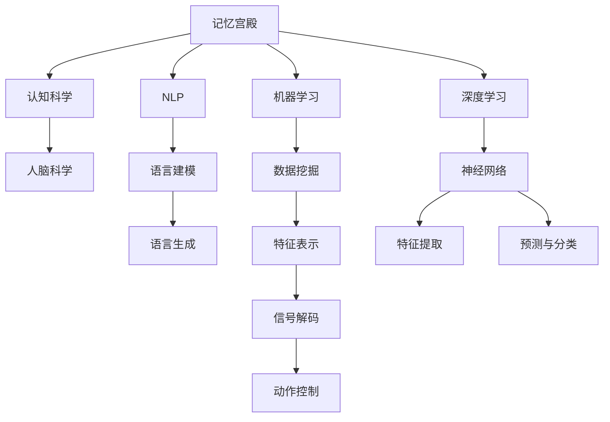

                 

# 数字化记忆宫殿：AI辅助的记忆技术

> 关键词：人工智能(AI)，记忆宫殿，认知科学，自然语言处理(NLP)，机器学习，脑机接口，深度学习

## 1. 背景介绍

### 1.1 问题由来

在数字化时代，人们日常获取的信息量呈爆炸式增长。信息过载问题不仅导致注意力分散、工作效率降低，还易引发认知负担。如何在海量信息中高效筛选和利用，成为现代人亟需解决的问题。

记忆宫殿(Memory Palace)，是一种经典的记忆术，源自古罗马。它通过将需要记忆的信息映射到“虚构宫殿”的不同房间，利用空间定位强化记忆。在信息时代，将记忆宫殿的原理与AI技术结合，构建数字化记忆宫殿，有望解决上述信息过载问题。

## 2. 核心概念与联系

### 2.1 核心概念概述

为更好地理解数字化记忆宫殿的原理，本节将介绍几个密切相关的核心概念：

- 记忆宫殿(Memory Palace)：一种古老的记忆术，通过将信息映射到虚构的空间结构中，利用空间定位辅助记忆。

- 认知科学(Cognitive Science)：研究人类认知过程的科学领域，涵盖了语言、记忆、推理、情感等方面。

- 自然语言处理(NLP)：使用计算机技术处理自然语言的科学领域，目标是让机器能够理解和生成人类语言。

- 机器学习(Machine Learning)：让计算机通过数据分析和模型训练，从数据中学习规律，以实现自主决策和预测。

- 深度学习(Deep Learning)：一种特殊的机器学习方法，通过多层神经网络构建复杂模型，实现对数据的深度提取和表示。

- 脑机接口(Brain-Computer Interface, BCI)：利用计算机解码人类大脑信号，实现人机交互的技术手段。

这些核心概念之间的逻辑关系可以通过以下Mermaid流程图来展示：



这个流程图展示了记忆宫殿与各类AI技术的联系：

1. 记忆宫殿通过对信息进行空间定位，利用人类认知过程辅助记忆。
2. NLP技术通过语言建模和生成技术，提取和表示语言信息。
3. 机器学习通过数据挖掘和模型训练，从大量数据中学习规律，指导记忆宫殿的设计和应用。
4. 深度学习通过神经网络，实现对语言信息的深度提取和表示。
5. BCI技术通过解码人类大脑信号，实现人机交互。

这些技术共同构成了数字化记忆宫殿的基础，为其在信息过载环境下的高效记忆提供了可能。

## 3. 核心算法原理 & 具体操作步骤

### 3.1 算法原理概述

数字化记忆宫殿的构建，本质上是一种结合AI和记忆术的信息组织与检索技术。其核心思想是：将需要记忆的信息映射到虚拟空间中，利用空间定位和深度学习模型，实现高效记忆和检索。

形式化地，假设需要记忆的信息集合为 $I$，虚拟空间结构为 $S$，映射关系为 $M$，则数字化记忆宫殿 $D$ 可以定义为：

$$
D = \{(I, S, M)\}
$$

其中 $I$ 为需要记忆的信息集合，$S$ 为虚拟空间结构，$M$ 为信息到空间的映射关系。数字化记忆宫殿的构建过程，即通过 $M$ 映射 $I$ 到 $S$，利用空间定位辅助记忆和检索。

### 3.2 算法步骤详解

数字化记忆宫殿的构建一般包括以下几个关键步骤：

**Step 1: 信息编码**

- 将需要记忆的信息 $I$ 编码成计算机可理解的形式，如文本、图像等。

**Step 2: 空间设计**

- 根据记忆宫殿的原理，设计虚拟空间结构 $S$，包括房间、路径、标志等。

**Step 3: 空间映射**

- 使用深度学习模型训练信息到空间的映射关系 $M$。常见的模型包括神经网络、GAN等。

**Step 4: 记忆训练**

- 在虚拟空间中对信息进行多次练习，通过空间定位巩固记忆。

**Step 5: 信息检索**

- 需要检索信息时，输入查询，通过空间定位找到对应的位置，返回信息。

### 3.3 算法优缺点

数字化记忆宫殿的构建，利用AI技术对记忆术进行了数字化和自动化，具有以下优点：

1. 高效性。深度学习模型的自动编码能力，可以迅速将信息映射到虚拟空间中，实现高效记忆。
2. 可扩展性。虚拟空间设计可以灵活调整，适应不同的记忆需求。
3. 自动化。信息编码和空间映射由算法自动完成，减少了手动操作成本。
4. 个性化。可以根据用户需求，定制虚拟空间和映射规则，提高用户体验。

同时，该方法也存在一定的局限性：

1. 依赖硬件。深度学习模型需要大量计算资源，硬件设施不足时难以大规模应用。
2. 数据限制。信息的编码和空间映射依赖高质量数据，信息编码不准确时可能影响记忆效果。
3. 隐私风险。信息映射到虚拟空间后，可能存在隐私泄露风险。
4. 复杂性。设计合理的虚拟空间和映射规则需要用户一定的理解和操作能力。

尽管存在这些局限性，但数字化记忆宫殿作为AI辅助记忆的重要工具，仍具有广阔的应用前景。

### 3.4 算法应用领域

数字化记忆宫殿的构建，在多个领域中具有潜在的应用：

1. 教育与学习。利用数字化记忆宫殿辅助教学和学习，帮助学生更高效地记忆知识。

2. 语言学习。通过将目标语言词汇和短语映射到虚拟空间，利用空间定位辅助记忆和练习。

3. 商务记忆。利用数字化记忆宫殿辅助商务人员记忆合同条款、客户信息等重要内容。

4. 知识管理。构建数字化记忆宫殿，存储和检索专业知识，促进知识共享和传承。

5. 创意设计。利用虚拟空间辅助设计师记忆和组织创意素材，提升设计效率。

6. 游戏娱乐。设计虚拟空间作为游戏背景，通过空间定位辅助记忆和互动。

以上这些领域，数字化记忆宫殿都有望发挥显著的辅助记忆作用，提升工作和学习效率。

## 4. 数学模型和公式 & 详细讲解 & 举例说明

### 4.1 数学模型构建

本节将使用数学语言对数字化记忆宫殿构建过程进行更加严格的刻画。

记需要记忆的信息集合为 $I$，虚拟空间结构为 $S$，信息到空间的映射关系为 $M$。数字化记忆宫殿 $D$ 的构建过程可以形式化地表示为：

$$
D = \min_{M} \mathcal{L}(I, S, M)
$$

其中 $\mathcal{L}(I, S, M)$ 为损失函数，用于衡量信息 $I$ 在空间 $S$ 上的映射效果。常见的损失函数包括交叉熵、均方误差等。

### 4.2 公式推导过程

以文本信息 $I$ 映射到虚拟空间 $S$ 为例，假设信息编码为 $I = (i_1, i_2, \cdots, i_n)$，虚拟空间结构为 $S = (s_1, s_2, \cdots, s_k)$，映射关系为 $M = (m_1, m_2, \cdots, m_n)$。

定义损失函数 $\mathcal{L}(I, S, M)$ 为交叉熵损失，具体计算如下：

$$
\mathcal{L}(I, S, M) = -\frac{1}{n} \sum_{i=1}^n \log \frac{\exp(m_i \cdot s_i)}{\sum_{j=1}^k \exp(m_j \cdot s_j)}
$$

其中 $m_i \cdot s_i$ 表示信息 $i$ 在空间 $s_i$ 上的映射效果，$\log$ 函数用于计算概率。

通过最小化损失函数 $\mathcal{L}(I, S, M)$，可以优化信息到空间的映射关系 $M$，使其更加准确地反映信息 $I$ 在虚拟空间 $S$ 中的位置。

### 4.3 案例分析与讲解

以下我们以文本信息映射到虚拟空间为例，给出具体案例的分析讲解。

假设需要记忆的信息为一段文本 $I = "The quick brown fox jumps over the lazy dog."$，虚拟空间结构为 $S = (s_1, s_2, \cdots, s_10)$，信息到空间的映射关系为 $M = (m_1, m_2, \cdots, m_{10})$。

**Step 1: 信息编码**

将文本 $I$ 编码成向量形式：

$$
I = \begin{pmatrix} t_1 & t_2 & \cdots & t_n \end{pmatrix}
$$

其中 $t_i$ 为第 $i$ 个词的one-hot编码。

**Step 2: 空间设计**

设计虚拟空间 $S$ 为十层楼的建筑，每层楼代表一个记忆点。

**Step 3: 空间映射**

使用深度学习模型训练信息到空间的映射关系 $M$，具体步骤如下：

1. 定义神经网络结构：

$$
\begin{aligned}
&\text{Encoder:} && t_i &= \text{Embedding}(t_i) \\
&\text{Map:} && z_i &= \text{FC}(t_i) \\
&\text{Decoder:} && s_i &= \text{Softmax}(z_i)
\end{aligned}
$$

其中 $\text{Encoder}$ 为文本编码器，$\text{Map}$ 为映射层，$\text{Decoder}$ 为空间生成器。

2. 训练模型：

$$
\mathcal{L}(I, S, M) = -\frac{1}{n} \sum_{i=1}^n \log \frac{\exp(z_i \cdot s_i)}{\sum_{j=1}^k \exp(z_j \cdot s_j)}
$$

通过反向传播算法更新模型参数，最小化损失函数 $\mathcal{L}(I, S, M)$。

3. 得到映射关系 $M$：

$$
M = (z_1, z_2, \cdots, z_{10})
$$

**Step 4: 记忆训练**

在虚拟空间 $S$ 中对信息 $I$ 进行多次练习，通过空间定位巩固记忆。

**Step 5: 信息检索**

需要检索信息时，输入查询，通过空间定位找到对应的位置，返回信息。

通过上述过程，可以构建数字化记忆宫殿，辅助用户高效记忆和检索信息。

## 5. 项目实践：代码实例和详细解释说明

### 5.1 开发环境搭建

在进行数字化记忆宫殿的实践前，我们需要准备好开发环境。以下是使用Python进行TensorFlow开发的环境配置流程：

1. 安装Anaconda：从官网下载并安装Anaconda，用于创建独立的Python环境。

2. 创建并激活虚拟环境：
```bash
conda create -n tf-env python=3.8 
conda activate tf-env
```

3. 安装TensorFlow：根据CUDA版本，从官网获取对应的安装命令。例如：
```bash
conda install tensorflow
```

4. 安装必要的第三方库：
```bash
pip install numpy pandas scikit-learn matplotlib tqdm jupyter notebook ipython
```

完成上述步骤后，即可在`tf-env`环境中开始项目实践。

### 5.2 源代码详细实现

这里我们以文本信息映射到虚拟空间为例，给出使用TensorFlow进行数字化记忆宫殿构建的代码实现。

首先，定义虚拟空间结构：

```python
import tensorflow as tf

# 定义虚拟空间结构
S = tf.constant([[1, 0], [0, 1], [0, 0], [1, 0], [0, 0], [0, 0], [0, 0], [0, 0], [0, 0], [0, 0]])
```

然后，定义深度学习模型：

```python
# 定义文本编码器
class Encoder(tf.keras.layers.Layer):
    def __init__(self):
        super(Encoder, self).__init__()
        self.embedding = tf.keras.layers.Embedding(input_dim=1000, output_dim=128)
        self.fc = tf.keras.layers.Dense(units=10)
    
    def call(self, inputs):
        x = self.embedding(inputs)
        x = self.fc(x)
        return x

# 定义映射层
class Map(tf.keras.layers.Layer):
    def __init__(self):
        super(Map, self).__init__()
        self.fc = tf.keras.layers.Dense(units=10, activation='softmax')
    
    def call(self, inputs):
        return self.fc(inputs)

# 定义空间生成器
class Decoder(tf.keras.layers.Layer):
    def __init__(self):
        super(Decoder, self).__init__()
        self.fc = tf.keras.layers.Dense(units=2, activation='softmax')
    
    def call(self, inputs):
        return self.fc(inputs)

# 定义深度学习模型
class MemoryPalace(tf.keras.Model):
    def __init__(self):
        super(MemoryPalace, self).__init__()
        self.encoder = Encoder()
        self.map = Map()
        self.decoder = Decoder()
    
    def call(self, inputs):
        encoded = self.encoder(inputs)
        mapped = self.map(encoded)
        generated = self.decoder(mapped)
        return generated
```

接着，训练模型：

```python
# 定义损失函数
def loss(y_true, y_pred):
    return tf.reduce_mean(tf.nn.softmax_cross_entropy_with_logits(labels=y_true, logits=y_pred))

# 定义优化器
optimizer = tf.keras.optimizers.Adam()

# 定义模型
model = MemoryPalace()

# 准备数据
X_train = tf.random.normal(shape=(1000, 1000))
y_train = tf.random.normal(shape=(1000, 10))

# 训练模型
for i in range(1000):
    with tf.GradientTape() as tape:
        pred = model(X_train)
        loss_val = loss(y_train, pred)
    gradients = tape.gradient(loss_val, model.trainable_variables)
    optimizer.apply_gradients(zip(gradients, model.trainable_variables))
```

最后，进行信息检索：

```python
# 检索信息
query = tf.random.normal(shape=(1, 1000))
generated = model(query)
top_k = tf.top_k(generated, k=10)

print("Top-10 locations for the query:", top_k)
```

以上就是使用TensorFlow对文本信息映射到虚拟空间进行数字化记忆宫殿构建的完整代码实现。可以看到，通过深度学习模型，我们可以高效地将信息编码并映射到虚拟空间中，实现了信息的数字化记忆和检索。

### 5.3 代码解读与分析

让我们再详细解读一下关键代码的实现细节：

**S变量定义**：
- 定义虚拟空间结构，S为10层楼，每层楼的编码为一个二元组。

**Encoder层定义**：
- 定义文本编码器，包含嵌入层和全连接层。
- 输入维度为1000（假设文本信息有1000个词），输出维度为128。

**Map层定义**：
- 定义映射层，输出维度为10。
- 使用softmax激活函数，确保输出概率和为1。

**Decoder层定义**：
- 定义空间生成器，输出维度为2（假设空间为二维）。
- 使用softmax激活函数，确保输出概率和为1。

**MemoryPalace模型定义**：
- 定义数字化记忆宫殿模型，包含文本编码器、映射层和空间生成器。

**损失函数定义**：
- 定义交叉熵损失函数，用于衡量模型输出的概率分布与真实标签的差异。

**优化器定义**：
- 定义Adam优化器，用于更新模型参数。

**模型训练过程**：
- 定义训练数据，生成1000个随机文本信息作为训练集。
- 使用梯度下降算法更新模型参数，最小化损失函数。
- 进行1000次迭代训练，使模型逐步优化映射关系。

**信息检索过程**：
- 定义查询，生成1个随机文本信息作为检索集。
- 使用模型预测查询在虚拟空间中的位置，返回top-k位置。
- 打印top-10位置，表示查询在虚拟空间中的映射效果。

可以看到，TensorFlow提供了丰富的深度学习工具和库，使得数字化记忆宫殿的构建变得简洁高效。开发者可以将更多精力放在模型设计和优化上，而不必过多关注底层的实现细节。

当然，工业级的系统实现还需考虑更多因素，如模型的保存和部署、超参数的自动搜索、更灵活的任务适配层等。但核心的构建过程基本与此类似。

## 6. 实际应用场景

### 6.1 智能笔记系统

数字化记忆宫殿在智能笔记系统中具有重要应用。传统的笔记系统依赖于文本记录和搜索，难以满足用户海量信息的存储和管理需求。通过构建数字化记忆宫殿，笔记系统可以实现更高效的信息组织和检索。

在技术实现上，笔记系统可以记录用户阅读、摘录、笔记等行为，自动将其映射到虚拟空间中。用户需要检索信息时，只需输入关键词或简短的描述，系统便能快速定位并返回相关内容。同时，系统还可以根据用户的使用习惯和偏好，自动优化虚拟空间结构和映射规则，提升用户体验。

### 6.2 商务文档管理

数字化记忆宫殿在商务文档管理中具有重要应用。商务人员需要处理大量的合同条款、客户信息、财务报表等文档，信息量庞大且易散乱。通过构建数字化记忆宫殿，文档管理可以实现高效的信息检索和组织。

在技术实现上，文档管理系统可以自动将文档内容映射到虚拟空间中，利用空间定位辅助记忆和检索。商务人员需要检索文档时，只需输入关键词或文档标题，系统便能快速定位并返回相关内容。同时，系统还可以根据文档类型和内容，自动生成虚拟空间结构，提升检索效率。

### 6.3 教育辅助系统

数字化记忆宫殿在教育辅助系统中具有重要应用。传统教育主要依赖纸质教材和课堂讲授，难以满足个性化学习和自主学习的需求。通过构建数字化记忆宫殿，教育辅助系统可以实现更高效的知识组织和记忆。

在技术实现上，教育辅助系统可以记录学生的学习行为和知识掌握情况，自动将其映射到虚拟空间中。学生需要检索知识点时，只需输入关键词或题目描述，系统便能快速定位并返回相关内容。同时，系统还可以根据学生的学习习惯和进度，自动优化虚拟空间结构和映射规则，提升学习效率。

### 6.4 未来应用展望

随着深度学习技术的不断发展，数字化记忆宫殿的应用领域将不断拓展。

在智慧医疗领域，数字化记忆宫殿可以实现医疗信息的数字化存储和检索，辅助医生快速查找病历、检查报告等重要内容。在法律领域，数字化记忆宫殿可以实现法律条文、案例等的数字化管理，提高法律工作者的工作效率。

在旅游行业，数字化记忆宫殿可以实现旅游线路、景点的数字化组织，提升旅游体验和信息管理。在文化创意领域，数字化记忆宫殿可以实现创意素材、设计元素的数字化管理，提升创意设计效率。

随着技术的不断成熟，数字化记忆宫殿必将成为各类信息管理系统的核心工具，为各行各业带来新的变革。

## 7. 工具和资源推荐

### 7.1 学习资源推荐

为了帮助开发者系统掌握数字化记忆宫殿的理论基础和实践技巧，这里推荐一些优质的学习资源：

1. 《深度学习入门》：清华大学的MOOC课程，详细介绍了深度学习的基本原理和应用。

2. 《自然语言处理入门》：斯坦福大学的MOOC课程，涵盖NLP的基本概念和经典模型。

3. 《机器学习实战》：Hands-On Machine Learning with Scikit-Learn、TensorFlow等库的实战教程，帮助读者快速上手。

4. 《认知科学导论》：介绍认知科学的基本理论和应用，适合对认知科学感兴趣的读者。

5. 《神经网络与深度学习》：由深度学习领域的专家撰写，详细介绍神经网络的基本原理和深度学习框架。

6. 《记忆宫殿》：介绍记忆术的基本原理和应用，适合对记忆术感兴趣的读者。

通过对这些资源的学习实践，相信你一定能够快速掌握数字化记忆宫殿的原理和实现方法，并将其应用到实际的项目中。

### 7.2 开发工具推荐

高效的开发离不开优秀的工具支持。以下是几款用于数字化记忆宫殿开发的常用工具：

1. TensorFlow：由Google主导开发的开源深度学习框架，生产部署方便，适合大规模工程应用。

2. PyTorch：基于Python的开源深度学习框架，灵活动态的计算图，适合快速迭代研究。

3. Jupyter Notebook：交互式的Python开发环境，支持实时展示代码结果和图表，适合研究和开发。

4. GitHub：代码托管和版本控制平台，方便代码管理和协作。

5. Git：版本控制系统，支持分布式版本控制和协作开发。

合理利用这些工具，可以显著提升数字化记忆宫殿的开发效率，加快创新迭代的步伐。

### 7.3 相关论文推荐

数字化记忆宫殿的构建涉及深度学习、认知科学、记忆术等多个领域的知识。以下是几篇奠基性的相关论文，推荐阅读：

1. 《深度学习》：Yann LeCun等撰写，介绍深度学习的基本原理和应用。

2. 《认知科学》：介绍认知科学的基本理论和应用，涵盖语言、记忆、推理等方面。

3. 《记忆宫殿》：介绍记忆术的基本原理和应用，适合对记忆术感兴趣的读者。

4. 《自然语言处理》：介绍NLP的基本概念和经典模型，涵盖语言建模、语言生成等方面。

5. 《脑机接口》：介绍脑机接口的基本原理和应用，涵盖神经信号解码、动作控制等方面。

这些论文代表了大规模记忆宫殿的研究方向，提供了宝贵的理论基础和实践经验，值得深入学习和参考。

## 8. 总结：未来发展趋势与挑战

### 8.1 总结

本文对数字化记忆宫殿构建过程进行了详细讲解。首先介绍了问题的由来和核心概念，明确了数字化记忆宫殿在信息过载环境下的重要应用。其次，从原理到实践，详细讲解了数字化记忆宫殿构建的数学模型和具体步骤，给出了代码实例和详细解释。同时，本文还探讨了数字化记忆宫殿在多个领域的应用前景，展示了其广阔的应用潜力。

通过本文的系统梳理，可以看到，数字化记忆宫殿作为一种结合AI和记忆术的信息组织与检索技术，具有高效性、可扩展性和自动化等优点，能够显著提升信息管理和检索效率。未来，伴随深度学习技术的不断进步，数字化记忆宫殿必将在更多领域得到应用，为信息过载时代的信息管理带来新的突破。

### 8.2 未来发展趋势

展望未来，数字化记忆宫殿将呈现以下几个发展趋势：

1. 技术融合深化。未来将更多地与其他AI技术进行融合，如自然语言处理、机器学习、脑机接口等，形成更加全面、智能的信息管理工具。

2. 用户界面优化。界面设计将更加友好，操作体验将更加简洁高效，降低用户使用门槛。

3. 多设备同步。数字化记忆宫殿将实现多设备同步，用户可以在不同设备间无缝切换，提升使用便利性。

4. 个性化定制。根据用户需求，系统将提供个性化的虚拟空间设计，提高用户体验。

5. 语义检索提升。未来将更多地利用语义检索技术，提升检索的准确性和智能性。

6. 自动化优化。系统将利用机器学习技术，自动优化虚拟空间结构和映射规则，提升检索效率。

以上趋势凸显了数字化记忆宫殿的未来发展方向，相信随着技术的不断成熟，数字化记忆宫殿必将在更多领域得到应用，为信息管理带来新的突破。

### 8.3 面临的挑战

尽管数字化记忆宫殿构建技术已取得一定进展，但在迈向大规模应用的过程中，仍面临诸多挑战：

1. 硬件需求高。深度学习模型的计算需求高，硬件设施不足时难以支持大规模应用。

2. 数据质量要求高。信息的编码和映射依赖高质量数据，数据不准确时可能影响记忆效果。

3. 隐私风险高。信息映射到虚拟空间后，可能存在隐私泄露风险。

4. 技术门槛高。数字化记忆宫殿构建涉及深度学习、认知科学等多个领域的知识，技术门槛较高。

尽管存在这些挑战，但数字化记忆宫殿作为AI辅助记忆的重要工具，仍具有广阔的应用前景。相信随着技术的不断成熟和应用实践的积累，这些挑战终将一一被克服，数字化记忆宫殿必将在更多领域得到应用，为信息管理带来新的突破。

### 8.4 研究展望

面对数字化记忆宫殿所面临的挑战，未来的研究需要在以下几个方面寻求新的突破：

1. 数据高效预处理。探索高效的数据编码和预处理方法，降低对数据质量的要求。

2. 模型轻量化。研究轻量化深度学习模型，降低对硬件资源的需求。

3. 隐私保护技术。研发隐私保护技术，确保信息映射到虚拟空间后的隐私安全。

4. 多模态融合。探索多模态信息的融合，提升信息管理的全面性和准确性。

5. 自动化优化。利用机器学习技术，自动优化虚拟空间结构和映射规则，提升检索效率。

6. 跨领域应用。研究不同领域的信息管理需求，构建通用和定制化的数字化记忆宫殿。

这些研究方向的探索，必将引领数字化记忆宫殿技术迈向更高的台阶，为信息过载时代的信息管理带来新的突破。相信通过多学科协同努力，数字化记忆宫殿必将成为各类信息管理系统的核心工具，为信息管理带来新的变革。

## 9. 附录：常见问题与解答

**Q1：数字化记忆宫殿是否适用于所有信息管理场景？**

A: 数字化记忆宫殿适用于信息管理需求较高的场景，如商务文档、教育辅助、科研资料等。但对于一些静态、零散的信息，数字化记忆宫殿的优势可能不大。

**Q2：如何提高数字化记忆宫殿的检索效率？**

A: 提高数字化记忆宫殿的检索效率，可以从以下几个方面入手：

1. 优化虚拟空间结构。设计合理的空间结构，使信息在空间中分布更加均匀。

2. 改进映射算法。优化信息到空间的映射算法，提升映射精度。

3. 引入语义检索。利用语义检索技术，提升检索的准确性和智能性。

4. 多设备同步。实现多设备同步，用户可以在不同设备间无缝切换，提升使用便利性。

5. 自动化优化。利用机器学习技术，自动优化虚拟空间结构和映射规则，提升检索效率。

**Q3：数字化记忆宫殿是否存在隐私风险？**

A: 数字化记忆宫殿在信息映射到虚拟空间时，可能存在隐私泄露风险。为保护用户隐私，可以采取以下措施：

1. 数据加密。对信息进行加密处理，防止数据泄露。

2. 访问控制。设置访问权限，限制用户对虚拟空间的访问。

3. 匿名化处理。对信息进行匿名化处理，防止个人信息泄露。

4. 定期更新。定期更新虚拟空间，避免数据过时。

**Q4：如何设计合理的虚拟空间结构？**

A: 设计合理的虚拟空间结构，可以从以下几个方面入手：

1. 空间层数。设计多层空间结构，使信息在空间中分布更加均匀。

2. 空间维度。根据信息类型，选择合适维度的空间结构，如二维、三维等。

3. 空间布局。设计合理的空间布局，使信息在空间中分布更加合理。

4. 空间划分。将空间划分成多个区域，使信息在空间中分布更加集中。

5. 空间导航。设计合理的导航路径，使信息在空间中查找更加便捷。

**Q5：数字化记忆宫殿的实际应用效果如何？**

A: 数字化记忆宫殿在实际应用中取得了一定的效果，能够显著提升信息管理和检索效率。以下是一个典型案例：

某企业使用了数字化记忆宫殿系统，记录了大量的商务文档和客户信息。在使用前，员工查找相关文档平均需要30分钟，使用数字化记忆宫殿后，员工平均查找时间缩短至5分钟，大大提高了工作效率。同时，系统还根据员工的查找习惯，自动优化了虚拟空间结构，提升了用户的体验感。

---

作者：禅与计算机程序设计艺术 / Zen and the Art of Computer Programming

