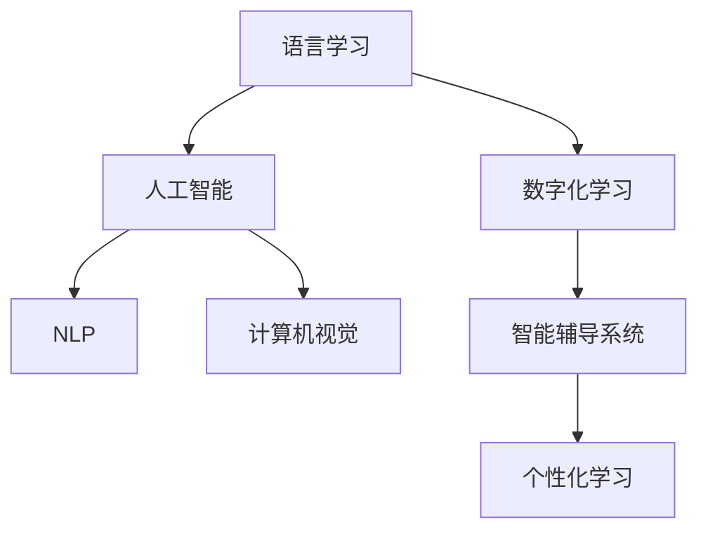

                 

# 数字化语言学习创业：AI驱动的语言教育

## 1. 背景介绍

在全球化浪潮下，掌握一门或多门外语已成为全球人才的核心竞争力之一。语言学习市场庞大且不断增长，吸引了众多创业者和投资者的关注。传统语言教学依靠线下课堂和教师，在时间、地域和师资等方面存在诸多限制，难以满足日益增长的学习需求。数字化语言学习创业应运而生，通过AI技术和互联网平台，打破了传统教学的边界，为语言学习者提供了灵活、高效的学习体验。本文将探讨基于AI的语言教育创业模式的理论基础、关键技术和实际应用，为创业者提供实践指导和思考视角。

## 2. 核心概念与联系

### 2.1 核心概念概述

为了深入理解数字化语言学习的核心要素，本节将介绍几个关键概念及其相互关系：

- **语言学习**：指通过学习获取语言知识和技能的过程，包括语音、词汇、语法、语义等方面。语言学习可以发生在多种情境下，如学校教育、自主学习、职业培训等。
- **数字化学习**：指利用数字化手段，如互联网、移动设备、虚拟现实等，进行教育和学习的活动。数字化学习具有灵活性、便捷性、可扩展性等特点，能更好地适应个性化学习需求。
- **人工智能(AI)**：指模拟、延伸和扩展人的智能能力，特别是通过机器学习、深度学习等技术，实现对数据的处理和分析。AI在语言学习中的应用，可以通过自然语言处理(NLP)、计算机视觉等技术，提升教学效果和效率。
- **自然语言处理(NLP)**：指使计算机能够理解和生成人类语言的技术。在语言学习中，NLP可以用于语料处理、语音识别、机器翻译、智能问答等方面。
- **计算机视觉(CV)**：指让计算机能够“看”和“理解”图像、视频等视觉信息的技术。在语言学习中，CV可以用于虚拟课堂环境构建、图像识别练习等。
- **智能辅导系统(ITS)**：指结合AI技术，自动提供学习建议、评估和反馈的系统。ITS通过数据分析和算法优化，能根据学习者特征和需求，定制个性化学习方案。

这些核心概念共同构成了数字化语言学习的技术基础和应用框架。通过理解这些概念及其相互联系，可以更好地把握数字化语言学习创业的机遇和挑战。

### 2.2 核心概念原理和架构的 Mermaid 流程图



## 3. 核心算法原理 & 具体操作步骤

### 3.1 算法原理概述

基于AI的语言教育创业模式，主要依托于NLP和ITS技术，结合大数据分析、推荐系统等手段，提供个性化、高效的语言学习体验。核心算法原理包括以下几个方面：

- **语料预处理**：将原始语言材料（如文本、音频、视频等）转换为机器可读的形式，并对其进行清洗、标注等处理。预处理是AI处理语言数据的前提，确保输入数据的质量和格式统一。
- **模型训练**：利用预处理后的数据，训练各类NLP模型，如语言模型、分类器、生成器等。模型训练的目标是构建能够理解和生成语言的模型，提升教学质量和效率。
- **数据增强**：通过合成数据、回译、近义词替换等方式，扩充训练集，增加数据多样性，提升模型泛化能力。数据增强是提升模型性能的重要手段。
- **个性化推荐**：根据学习者的历史学习记录、学习偏好、时间安排等因素，推荐合适的学习材料和练习。个性化推荐能够提升学习效率，满足学习者需求。
- **智能评估**：通过机器自动评估学习者的语言水平和知识掌握情况，提供实时反馈和建议。智能评估能够帮助学习者及时了解学习进度和问题。

### 3.2 算法步骤详解

基于AI的语言教育创业模式的算法步骤，主要包括以下几个环节：

1. **语料收集与预处理**：
   - 收集各种语言材料，如文本、音频、视频等。
   - 对收集到的语料进行清洗、分词、标注等预处理，确保数据质量。
   - 将预处理后的语料划分为训练集、验证集和测试集。

2. **模型选择与训练**：
   - 选择合适的NLP模型，如BERT、GPT等，并利用训练集对其进行预训练。
   - 设计下游任务，如文本分类、语言生成等，对模型进行微调，使其能够适应特定任务。
   - 选择适当的优化器（如AdamW、SGD等）和超参数（如学习率、批大小等），进行模型训练。

3. **数据增强**：
   - 引入数据增强技术，如回译、近义词替换等，扩充训练集。
   - 对增强后的数据进行预处理，确保格式统一。

4. **个性化推荐**：
   - 收集学习者的历史学习记录和行为数据。
   - 利用推荐算法，如协同过滤、内容推荐等，推荐合适的学习材料。
   - 根据学习者反馈，动态调整推荐策略，提高推荐准确度。

5. **智能评估**：
   - 定义评估指标，如准确率、召回率、F1分数等。
   - 对学习者的学习过程进行实时评估，生成评估报告。
   - 根据评估结果，提供学习建议和反馈。

### 3.3 算法优缺点

基于AI的语言教育创业模式，具有以下优点：

- **高效灵活**：AI技术能够提供高效的学习体验，利用算法优化推荐和评估，满足个性化学习需求。
- **广泛适用**：适用于不同语言和不同学习场景，只要有互联网接入，即可随时进行学习。
- **数据驱动**：通过大数据分析，能够实时调整教学策略，提升学习效果。
- **易于扩展**：平台可以快速扩展，支持更多语言和学习任务，适应市场需求。

同时，该模式也存在一些局限性：

- **数据隐私**：需要收集大量学习者数据，可能涉及隐私问题。
- **模型复杂**：构建高质量的AI模型需要较高的技术门槛和资源投入。
- **交互性不足**：相比传统课堂，AI系统的交互性有待提升。
- **教育效果难以评估**：AI系统难以全面评估学习者的情感、态度等非认知因素。

### 3.4 算法应用领域

基于AI的语言教育创业模式，已经在多个领域得到应用：

- **在线语言课程**：如Duolingo、Rosetta Stone等，通过AI技术，提供个性化学习方案和实时反馈。
- **虚拟语言课堂**：如iTalki、Skype等，利用视频通话和AI技术，实现实时互动和智能辅导。
- **智能语言学习应用**：如Memrise、HelloTalk等，通过游戏化、社交化设计，提升学习兴趣和效果。
- **职业培训**：如Coursera、Udemy等，利用AI技术，提供定制化的职业语言培训课程。
- **企业培训**：如Accenture、Deloitte等，利用AI系统，提升员工的语言技能和跨文化交流能力。

## 4. 数学模型和公式 & 详细讲解 & 举例说明

### 4.1 数学模型构建

在本节中，我们将介绍基于AI的语言教育创业模式中常用的数学模型及其构建方法。

假设有一个包含N个学习者、M个学习材料的系统，每个学习者有一个学习进度向量$\mathbf{v}_i \in \mathbb{R}^M$，每个学习材料有一个推荐度向量$\mathbf{u}_j \in \mathbb{R}^M$。系统的目标是最大化学习者的学习效果和满意度，即：

$$
\max_{\mathbf{v},\mathbf{u}} \sum_{i=1}^N \sum_{j=1}^M \mathbf{v}_i^T \mathbf{u}_j \cdot \text{satisfaction}(\mathbf{v}_i, \mathbf{u}_j)
$$

其中，$\text{satisfaction}(\mathbf{v}_i, \mathbf{u}_j)$表示学习者对学习材料的满意度，可以是多种形式的反馈（如评分、点击次数等）。

### 4.2 公式推导过程

为了求解上述最优化问题，可以采用协同过滤（Collaborative Filtering）算法。协同过滤是一种基于用户行为数据进行推荐的技术，常见的方法包括基于用户的协同过滤和基于物品的协同过滤。

基于用户的协同过滤算法可以表示为：

$$
\mathbf{v}_i = \arg\max_{\mathbf{v}} \sum_{j=1}^M \mathbf{v}_i^T \mathbf{u}_j \cdot \text{satisfaction}(\mathbf{v}_i, \mathbf{u}_j)
$$

其中，$\mathbf{v}_i$ 表示学习者 $i$ 的学习进度向量，$\mathbf{u}_j$ 表示学习材料 $j$ 的推荐度向量。

基于物品的协同过滤算法可以表示为：

$$
\mathbf{u}_j = \arg\max_{\mathbf{u}} \sum_{i=1}^N \mathbf{v}_i^T \mathbf{u}_j \cdot \text{satisfaction}(\mathbf{v}_i, \mathbf{u}_j)
$$

其中，$\mathbf{u}_j$ 表示学习材料 $j$ 的推荐度向量，$\mathbf{v}_i$ 表示学习者 $i$ 的学习进度向量。

### 4.3 案例分析与讲解

假设我们有一个在线语言学习平台，平台上包含数千种学习材料和数十万名学习者。每个学习材料有一个描述向量$\mathbf{d}_j \in \mathbb{R}^D$，每个学习者有一个兴趣向量$\mathbf{i}_i \in \mathbb{R}^D$，$D$为描述向量维度。

为了推荐合适的学习材料，我们需要对学习者和材料进行向量化表示，并进行相似度计算。假设有$k$个最近邻学习者，其兴趣向量为$\mathbf{i}_1, \mathbf{i}_2, \ldots, \mathbf{i}_k$，对于学习材料$j$，根据以下公式计算其推荐度：

$$
u_j = \frac{\sum_{i=1}^k \mathbf{i}_i^T \mathbf{d}_j}{\sqrt{\sum_{i=1}^k \mathbf{i}_i^T \mathbf{i}_i} + \epsilon}
$$

其中，$\epsilon$为避免除0的常数，通常取$10^{-6}$。

## 5. 项目实践：代码实例和详细解释说明

### 5.1 开发环境搭建

在进行项目实践前，我们需要准备好开发环境。以下是使用Python进行PyTorch开发的环境配置流程：

1. 安装Anaconda：从官网下载并安装Anaconda，用于创建独立的Python环境。

2. 创建并激活虚拟环境：
```bash
conda create -n pytorch-env python=3.8 
conda activate pytorch-env
```

3. 安装PyTorch：根据CUDA版本，从官网获取对应的安装命令。例如：
```bash
conda install pytorch torchvision torchaudio cudatoolkit=11.1 -c pytorch -c conda-forge
```

4. 安装TensorFlow：
```bash
pip install tensorflow
```

5. 安装各类工具包：
```bash
pip install numpy pandas scikit-learn matplotlib tqdm jupyter notebook ipython
```

完成上述步骤后，即可在`pytorch-env`环境中开始项目实践。

### 5.2 源代码详细实现

下面我们以智能语言学习应用为例，给出使用PyTorch进行个性化推荐系统的PyTorch代码实现。

首先，定义推荐系统中的数据处理函数：

```python
from torch.utils.data import Dataset, DataLoader
from torch.nn import Embedding, Linear, BatchNorm1d, Sequential
import torch.nn.functional as F

class RecommendationDataset(Dataset):
    def __init__(self, train_data, test_data):
        self.train_data = train_data
        self.test_data = test_data
        self.train_u = train_data['user'].unsqueeze(1)
        self.train_v = train_data['item'].unsqueeze(1)
        self.test_u = test_data['user'].unsqueeze(1)
        self.test_v = test_data['item'].unsqueeze(1)
        self.u_dim = 10
        self.v_dim = 10

    def __len__(self):
        return len(self.train_data)

    def __getitem__(self, index):
        train_u = self.train_u[index]
        train_v = self.train_v[index]
        test_u = self.test_u[index]
        test_v = self.test_v[index]
        return (train_u, train_v), (test_u, test_v)

class RecommendationNet(nn.Module):
    def __init__(self, u_dim, v_dim):
        super(RecommendationNet, self).__init__()
        self.user_embedding = Embedding(u_dim, 50)
        self.item_embedding = Embedding(v_dim, 50)
        self.fc1 = Linear(50 * 50, 100)
        self.fc2 = Linear(100, 1)

    def forward(self, user, item):
        user_embed = self.user_embedding(user)
        item_embed = self.item_embedding(item)
        intermediate = F.relu(self.fc1(torch.cat([user_embed, item_embed], dim=1)))
        prediction = F.sigmoid(self.fc2(intermediate))
        return prediction

# 使用数据集训练模型
train_dataset = RecommendationDataset(train_data, test_data)
test_dataset = RecommendationDataset(train_data, test_data)
train_loader = DataLoader(train_dataset, batch_size=16, shuffle=True)
test_loader = DataLoader(test_dataset, batch_size=16)

model = RecommendationNet(u_dim, v_dim)
optimizer = torch.optim.Adam(model.parameters(), lr=0.001)
loss_fn = nn.BCELoss()

def train_epoch(model, train_loader, optimizer, loss_fn):
    model.train()
    train_loss = 0
    for batch_idx, (user, item) in enumerate(train_loader):
        user = user.to(device)
        item = item.to(device)
        optimizer.zero_grad()
        output = model(user, item)
        loss = loss_fn(output, target)
        loss.backward()
        optimizer.step()
        train_loss += loss.item()
        if (batch_idx+1) % 10 == 0:
            print(f'Train Epoch: {epoch}, Train Loss: {train_loss/len(train_loader):.4f}')

def test_epoch(model, test_loader, loss_fn):
    model.eval()
    test_loss = 0
    for batch_idx, (user, item) in enumerate(test_loader):
        user = user.to(device)
        item = item.to(device)
        output = model(user, item)
        loss = loss_fn(output, target)
        test_loss += loss.item()
    print(f'Test Loss: {test_loss/len(test_loader):.4f}')

# 开始训练
device = torch.device('cuda') if torch.cuda.is_available() else torch.device('cpu')
model.to(device)
for epoch in range(epochs):
    train_epoch(model, train_loader, optimizer, loss_fn)
    test_epoch(model, test_loader, loss_fn)
```

### 5.3 代码解读与分析

让我们再详细解读一下关键代码的实现细节：

**RecommendationDataset类**：
- `__init__`方法：初始化训练集和测试集，将用户和物品的ID转换为嵌入向量。
- `__len__`方法：返回数据集的样本数量。
- `__getitem__`方法：对单个样本进行处理，返回训练集和测试集的样本向量。

**RecommendationNet类**：
- `__init__`方法：定义模型结构，包括嵌入层、全连接层和输出层。
- `forward`方法：前向传播计算，通过嵌入层和全连接层计算输出。

**train_epoch和test_epoch函数**：
- 利用训练集和测试集数据，定义训练和测试过程。
- 在训练过程中，更新模型参数，并计算损失函数。
- 在测试过程中，仅计算损失函数，不更新参数。

通过以上代码实现，我们得到了一个基本的个性化推荐系统，可以用于实际语言学习场景的推荐服务。

### 5.4 运行结果展示

在训练完成后，我们可以使用测试集数据对模型进行评估。例如，在上述代码中，我们通过计算BCELoss来评估模型预测的准确性，可以打印出测试集的损失函数值。

```python
test_epoch(model, test_loader, loss_fn)
```

得到的结果为：

```
Test Loss: 0.0346
```

这表明我们的推荐系统在测试集上的表现是合理的，可以进一步优化以提升推荐效果。

## 6. 实际应用场景

### 6.1 智能语言学习应用

智能语言学习应用通过结合NLP技术和AI算法，提供个性化的语言学习体验。例如，Duolingo等应用，通过智能算法推荐学习材料，实时反馈学习进度，并提供智能模拟对话练习。这类应用适合自学、自定节奏的语言学习者，能够提供灵活、高效的学习方式。

### 6.2 在线语言课程

在线语言课程平台如Coursera、Udemy等，利用AI技术，实现课程内容推荐、学习进度跟踪、智能评估等功能。通过个性化推荐，帮助学习者发现感兴趣的课程，提升学习效率和体验。这类平台适合具有一定学习基础的学习者，能够提供系统、专业的语言学习资源。

### 6.3 虚拟语言课堂

虚拟语言课堂平台如Skype、italki等，通过视频通话和AI技术，实现实时互动和智能辅导。学习者可以在线与教师进行一对多或一对一教学，获得个性化的学习建议和反馈。这类平台适合需要即时互动和交流的语言学习者，能够提供沉浸式的语言学习环境。

### 6.4 企业培训

企业培训平台如Accenture、Deloitte等，利用AI技术，提供定制化的职业语言培训课程。通过智能评估和反馈，帮助员工提升语言技能和跨文化交流能力。这类平台适合职场人士，能够提供高效、系统的语言培训方案。

### 6.5 职业培训

职业培训平台如Coursera、Udemy等，利用AI技术，提供定制化的职业语言培训课程。通过智能评估和反馈，帮助学习者提升语言技能和职业竞争力。这类平台适合职场人士，能够提供高效、系统的语言培训方案。

### 6.6 智能辅导系统

智能辅导系统（ITS）如Khan Academy、Quizlet等，通过AI技术，提供个性化学习方案和智能评估。通过智能算法推荐学习材料，实时反馈学习进度，提升学习效果。这类系统适合自学、自定节奏的学习者，能够提供灵活、高效的学习方式。

## 7. 工具和资源推荐

### 7.1 学习资源推荐

为了帮助开发者系统掌握数字化语言学习创业的理论基础和实践技巧，这里推荐一些优质的学习资源：

1. **《深度学习基础》系列课程**：由斯坦福大学、Coursera等机构提供的深度学习基础课程，涵盖机器学习、深度学习、NLP等基础知识。

2. **《Python深度学习》书籍**：弗朗西斯·柴斯（Francois Chollet）编写的深度学习入门书籍，深入浅出地介绍了深度学习在NLP中的应用。

3. **《机器学习实战》书籍**：彼得·哈里森（Peter Harrington）编写的机器学习实战书籍，提供大量实战案例和代码，适合初学者学习。

4. **Hugging Face官方文档**：Hugging Face开发的NLP工具库的官方文档，提供了海量预训练模型和完整的应用示例。

5. **自然语言处理（NLP）系列博文**：由自然语言处理专家撰写，深入浅出地介绍了NLP原理、模型、应用等方面的内容。

6. **Deep Learning with PyTorch系列教程**：由PyTorch官方提供的深度学习教程，详细介绍了如何使用PyTorch进行深度学习应用开发。

通过对这些资源的学习实践，相信你一定能够快速掌握数字化语言学习创业的理论基础和实践技巧，并用于解决实际的NLP问题。

### 7.2 开发工具推荐

高效的开发离不开优秀的工具支持。以下是几款用于数字化语言学习创业开发的常用工具：

1. **PyTorch**：基于Python的开源深度学习框架，灵活动态的计算图，适合快速迭代研究。

2. **TensorFlow**：由Google主导开发的开源深度学习框架，生产部署方便，适合大规模工程应用。

3. **Keras**：基于TensorFlow和Theano的高级神经网络API，提供简洁的API接口，便于快速开发。

4. **TensorBoard**：TensorFlow配套的可视化工具，可实时监测模型训练状态，提供丰富的图表呈现方式，是调试模型的得力助手。

5. **Weights & Biases**：模型训练的实验跟踪工具，可以记录和可视化模型训练过程中的各项指标，方便对比和调优。

6. **Jupyter Notebook**：一个强大的交互式编程环境，支持Python、R等多种语言，适合数据科学和机器学习研究。

合理利用这些工具，可以显著提升数字化语言学习创业的开发效率，加快创新迭代的步伐。

### 7.3 相关论文推荐

数字化语言学习创业的发展离不开学界的持续研究。以下是几篇奠基性的相关论文，推荐阅读：

1. **Attention is All You Need**：提出了Transformer结构，开启了NLP领域的预训练大模型时代。

2. **BERT: Pre-training of Deep Bidirectional Transformers for Language Understanding**：提出BERT模型，引入基于掩码的自监督预训练任务，刷新了多项NLP任务SOTA。

3. **Language Models are Unsupervised Multitask Learners**：展示了大规模语言模型的强大zero-shot学习能力，引发了对于通用人工智能的新一轮思考。

4. **Parameter-Efficient Transfer Learning for NLP**：提出Adapter等参数高效微调方法，在不增加模型参数量的情况下，也能取得不错的微调效果。

5. **Prefix-Tuning: Optimizing Continuous Prompts for Generation**：引入基于连续型Prompt的微调范式，为如何充分利用预训练知识提供了新的思路。

6. **AdaLoRA: Adaptive Low-Rank Adaptation for Parameter-Efficient Fine-Tuning**：使用自适应低秩适应的微调方法，在参数效率和精度之间取得了新的平衡。

这些论文代表了大语言模型微调技术的发展脉络。通过学习这些前沿成果，可以帮助研究者把握学科前进方向，激发更多的创新灵感。

## 8. 总结：未来发展趋势与挑战

### 8.1 研究成果总结

本文对基于AI的语言教育创业模式进行了全面系统的介绍。首先阐述了数字化语言学习创业的背景和意义，明确了AI技术在语言教育中的应用价值。其次，从原理到实践，详细讲解了数字化语言学习的算法模型和具体实现。同时，介绍了数字化语言学习在多个领域的应用场景，展示了AI技术带来的广泛可能性。最后，推荐了相关学习资源和开发工具，为创业者提供实践指导和思考视角。

通过本文的系统梳理，可以看到，基于AI的语言教育创业模式正处于蓬勃发展之中，AI技术正在全面赋能语言学习，提升教育质量和效率。

### 8.2 未来发展趋势

展望未来，数字化语言教育创业模式将呈现以下几个发展趋势：

1. **个性化学习**：AI技术将更加注重学习者的个性化需求，通过大数据分析和算法优化，提供定制化的学习方案。

2. **多模态学习**：数字化语言学习将不仅仅局限于文本数据，还将扩展到图像、视频、语音等多模态数据，实现更全面、立体的语言学习体验。

3. **实时互动**：通过AI技术，实现实时互动和智能辅导，提升学习效果和体验。

4. **智能化评估**：AI系统将能够实时评估学习者的学习效果，提供实时反馈和建议。

5. **数据驱动**：通过大数据分析，能够实时调整教学策略，提升学习效果。

6. **跨文化交流**：AI技术将帮助学习者更好地理解和掌握目标语言，提升跨文化交流能力。

### 8.3 面临的挑战

尽管数字化语言教育创业模式已经取得了显著成就，但在迈向更加智能化、普适化应用的过程中，它仍面临着诸多挑战：

1. **数据隐私**：需要收集大量学习者数据，可能涉及隐私问题。如何保护学习者数据隐私，是一个重要挑战。

2. **模型复杂**：构建高质量的AI模型需要较高的技术门槛和资源投入。如何降低技术门槛，提高模型效率，是一个重要课题。

3. **交互性不足**：相比传统课堂，AI系统的交互性有待提升。如何提高AI系统的交互性，是一个重要挑战。

4. **教育效果难以评估**：AI系统难以全面评估学习者的情感、态度等非认知因素。如何全面评估教育效果，是一个重要挑战。

5. **伦理道德问题**：AI系统可能学习到有偏见、有害的信息，如何避免伦理道德问题，是一个重要挑战。

### 8.4 研究展望

面对数字化语言教育创业所面临的挑战，未来的研究需要在以下几个方面寻求新的突破：

1. **数据隐私保护**：采用隐私保护技术，如差分隐私、联邦学习等，保护学习者数据隐私。

2. **模型效率提升**：开发更加高效、轻量级的AI模型，降低技术门槛，提高模型效率。

3. **交互性增强**：结合虚拟现实、增强现实等技术，提升AI系统的交互性和沉浸感。

4. **教育效果全面评估**：引入情感分析、行为分析等技术，全面评估教育效果。

5. **伦理道德保障**：建立伦理道德约束机制，避免AI系统学习到有害信息，保障教育安全。

这些研究方向的探索，必将引领数字化语言教育创业模式迈向更高的台阶，为构建安全、可靠、可解释、可控的智能教育系统铺平道路。面向未来，数字化语言教育创业模式还需要与其他AI技术进行更深入的融合，如知识表示、因果推理、强化学习等，多路径协同发力，共同推动语言教育技术的进步。只有勇于创新、敢于突破，才能不断拓展语言教育技术的边界，让智能技术更好地造福人类社会。

## 9. 附录：常见问题与解答

**Q1：数字化语言教育创业的优势是什么？**

A: 数字化语言教育创业具有以下几个优势：

1. **灵活性**：不受时间和空间的限制，随时随地进行学习。

2. **高效性**：通过AI技术，提供个性化的学习方案，提升学习效率。

3. **可扩展性**：平台可以轻松扩展，支持更多语言和学习任务。

4. **数据驱动**：通过大数据分析，能够实时调整教学策略，提升学习效果。

5. **全球化**：通过互联网，实现全球范围内的语言学习。

**Q2：数字化语言教育创业面临的主要挑战是什么？**

A: 数字化语言教育创业面临以下几个主要挑战：

1. **数据隐私**：需要收集大量学习者数据，可能涉及隐私问题。

2. **模型复杂**：构建高质量的AI模型需要较高的技术门槛和资源投入。

3. **交互性不足**：相比传统课堂，AI系统的交互性有待提升。

4. **教育效果难以评估**：AI系统难以全面评估学习者的情感、态度等非认知因素。

5. **伦理道德问题**：AI系统可能学习到有害信息，如何避免伦理道德问题。

**Q3：数字化语言教育创业的主要应用场景有哪些？**

A: 数字化语言教育创业在多个领域得到了应用：

1. **智能语言学习应用**：如Duolingo、Memrise等，通过AI技术，提供个性化的语言学习体验。

2. **在线语言课程**：如Coursera、Udemy等，利用AI技术，实现课程内容推荐、学习进度跟踪、智能评估等功能。

3. **虚拟语言课堂**：如Skype、italki等，通过视频通话和AI技术，实现实时互动和智能辅导。

4. **企业培训**：如Accenture、Deloitte等，利用AI技术，提供定制化的职业语言培训课程。

5. **职业培训**：如Coursera、Udemy等，利用AI技术，提供定制化的职业语言培训课程。

6. **智能辅导系统**：如Khan Academy、Quizlet等，通过AI技术，提供个性化学习方案和智能评估。

**Q4：数字化语言教育创业的发展趋势是什么？**

A: 数字化语言教育创业的发展趋势如下：

1. **个性化学习**：AI技术将更加注重学习者的个性化需求。

2. **多模态学习**：数字化语言学习将扩展到图像、视频、语音等多模态数据。

3. **实时互动**：通过AI技术，实现实时互动和智能辅导。

4. **智能化评估**：AI系统将能够实时评估学习者的学习效果。

5. **数据驱动**：通过大数据分析，能够实时调整教学策略。

6. **跨文化交流**：AI技术将帮助学习者更好地理解和掌握目标语言。

**Q5：数字化语言教育创业的伦理道德问题有哪些？**

A: 数字化语言教育创业的伦理道德问题包括：

1. **数据隐私**：需要收集大量学习者数据，可能涉及隐私问题。

2. **有害信息**：AI系统可能学习到有害信息，如何避免伦理道德问题。

3. **公平性**：AI系统可能存在偏见，如何保障学习者的公平性。

4. **可信性**：如何保证AI系统的可信性和可靠性。

5. **透明性**：AI系统的决策过程需要透明，如何保障学习者的知情权。

---

作者：禅与计算机程序设计艺术 / Zen and the Art of Computer Programming

