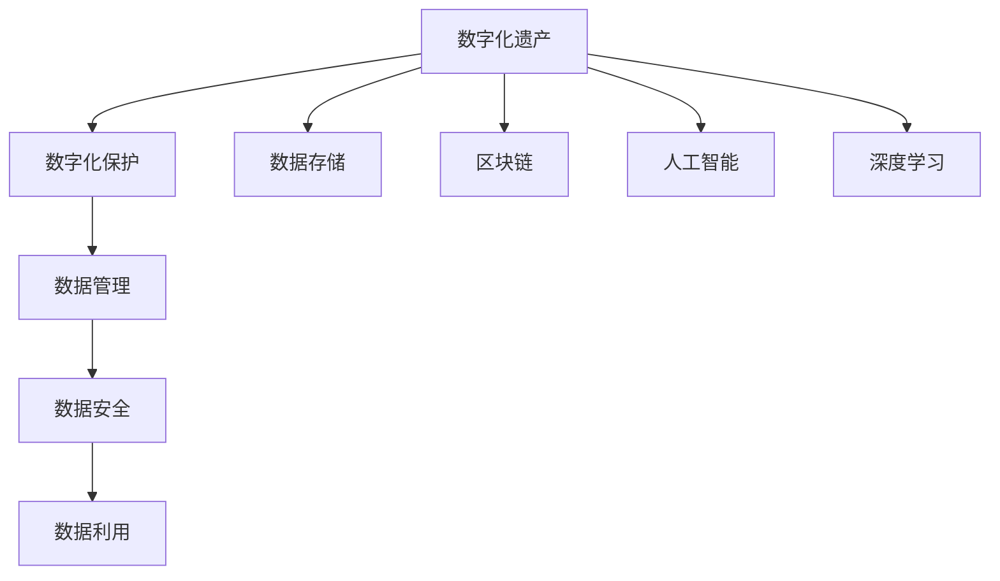

                 

# 数字化遗产保护创业：文化传承的科技支持

> 关键词：数字化遗产保护, 文化传承, 科技支持, 数据存储, 数字资产管理, 区块链, 人工智能, 深度学习, 数据保护, 数据利用

## 1. 背景介绍

### 1.1 问题由来

在全球化浪潮下，文化多样性和多样性文化的保护面临前所未有的挑战。随着社会的发展和技术的进步，传统文化和遗产的数字化保护已成为不可逆转的趋势。传统文献、艺术、语言、民俗等文化遗产正逐渐数字化，以应对物理形态的磨损和损毁，以供后人学习和传承。然而，数字化遗产的管理和保护仍存在诸多问题，包括但不限于：数据存储、数据管理、数据安全、数据利用等。

### 1.2 问题核心关键点

数字化遗产保护创业的核心在于如何通过科技创新，高效、安全地管理和利用数字化文化遗产。核心问题包括：

- 数据存储：如何实现大规模数字化遗产数据的长期保存和可访问性。
- 数据管理：如何高效、灵活地管理数字化遗产数据，方便用户的检索和使用。
- 数据安全：如何保证数字化遗产数据的完整性、可用性和保密性。
- 数据利用：如何将数字化遗产数据转化为生产力，实现知识增值。

### 1.3 问题研究意义

数字化遗产保护创业不仅具有重要的文化价值，更具有巨大的商业前景。通过数字化保护，可以跨越时空的限制，让文化传承变得触手可及。同时，数字化保护可以创造新的文化产业形态，如数字博物馆、虚拟现实博物馆、数字化艺术展览等，推动文化产业的创新发展。

## 2. 核心概念与联系

### 2.1 核心概念概述

为更好地理解数字化遗产保护创业，本节将介绍几个密切相关的核心概念：

- **数字化遗产**：通过数字化技术保存和记录下来的各种文化形式，包括但不限于文字、图片、音频、视频、三维模型等。
- **数字化保护**：指利用数字技术对文化遗产进行记录、保存、管理和修复的过程。
- **数据存储**：将数字化遗产数据高效、安全地存储在计算机系统中的技术。
- **数据管理**：对数字化遗产数据进行分类、组织、检索、更新和维护的过程。
- **数据安全**：确保数字化遗产数据的完整性、可用性和保密性的技术。
- **数据利用**：利用数字化遗产数据创造经济价值和社会价值的过程。
- **区块链**：一种去中心化的分布式账本技术，用于保障数据的不可篡改和透明性。
- **人工智能**：利用计算机模拟人脑进行数据处理、决策和推理的技术。
- **深度学习**：一种人工智能的子领域，通过多层神经网络进行复杂模式识别和学习。

这些核心概念之间的逻辑关系可以通过以下Mermaid流程图来展示：



这个流程图展示了大数字化遗产保护的核心概念及其之间的关系：

1. 数字化遗产是所有保护和利用工作的起点。
2. 数据存储、数据管理和数据安全是数字化保护的基础环节。
3. 数据利用是保护工作的最终目的，也推动了新业务模式的探索。
4. 区块链和人工智能等新兴技术为保护和利用提供了新的思路和方法。
5. 深度学习作为AI的一个重要分支，为数字化遗产的分析、理解和利用提供了强大的工具。

## 3. 核心算法原理 & 具体操作步骤
### 3.1 算法原理概述

数字化遗产保护创业的核心算法包括数据存储、数据管理和数据利用等多个方面。以下将分别介绍这些算法原理：

### 3.2 算法步骤详解

#### 数据存储

- **算法步骤1：数据采集**：通过数字化技术对文化遗产进行全面的数字化采集。可以包括文字数字化、图片数字化、音频数字化、视频数字化等。
- **算法步骤2：数据编码**：将采集到的数字化遗产数据进行编码，以支持高效的数据存储和检索。常用的编码方法包括JPEG、PNG、MP3、WAV、AVI等。
- **算法步骤3：数据压缩**：对数字化遗产数据进行无损或有损压缩，以减小存储空间，并提高数据的传输效率。
- **算法步骤4：数据存储**：选择适合的存储介质和存储方式，实现数据的长期保存。

#### 数据管理

- **算法步骤1：数据分类**：根据数字化遗产的类型、来源和内容，进行分类和组织，便于后续管理和检索。
- **算法步骤2：数据索引**：为每个数字化遗产数据创建唯一的标识符，并建立索引，支持快速的检索和访问。
- **算法步骤3：数据关联**：将不同数字化遗产数据之间建立关联，构建知识图谱，方便用户进行跨领域的学习和研究。
- **算法步骤4：数据更新**：定期更新数字化遗产数据，保证数据的实时性和准确性。

#### 数据安全

- **算法步骤1：数据加密**：对数字化遗产数据进行加密，保护数据的机密性和完整性。
- **算法步骤2：数字签名**：对数字化遗产数据进行数字签名，保证数据的真实性和不可篡改性。
- **算法步骤3：访问控制**：通过身份验证和授权管理，控制用户对数据的访问权限，防止未授权访问。

#### 数据利用

- **算法步骤1：数据分析**：利用深度学习等技术，对数字化遗产数据进行深度分析，提取有价值的信息和知识。
- **算法步骤2：数据可视化**：将数字化遗产数据转化为图形、图表等可视化形式，方便用户理解和利用。
- **算法步骤3：数据挖掘**：利用数据挖掘技术，发现数据中的潜在规律和趋势，支持科学研究和决策。
- **算法步骤4：知识增值**：将数字化遗产数据转化为有形和无形的价值，如数字出版、数字展览、虚拟现实体验等。

### 3.3 算法优缺点

数字化遗产保护创业的算法具有以下优点：

- **高效性**：数字化技术可以快速、准确地对文化遗产进行记录和保存，降低了人力和时间成本。
- **灵活性**：数字化数据可以方便地进行分类、索引和关联，提高了数据的利用效率。
- **安全性**：数据加密、数字签名和访问控制等技术，保障了数据的安全性。
- **广泛性**：数字化的文化遗产可以跨越时间和空间限制，方便全球用户学习和利用。

同时，这些算法也存在一定的局限性：

- **成本高**：数字化保护需要大量的资金和技术投入，特别是对于大规模数字化遗产的保护。
- **技术门槛高**：数据存储、数据管理和数据利用等环节，对技术要求较高，需要专业的技术团队支持。
- **数据质量问题**：数字化过程中可能存在数据采集不全、数据格式不统一等问题，影响数据质量。
- **隐私保护问题**：数字化保护需要采集和存储大量的个人信息，需要考虑隐私保护和数据利用之间的平衡。

### 3.4 算法应用领域

数字化遗产保护创业的算法广泛应用于文化博物馆、图书馆、档案馆、艺术展览、历史研究等领域。通过数字化保护，这些机构可以更好地保存和利用其珍贵的文化遗产，推动文化传承和知识创新。

具体应用领域包括：

- **数字博物馆**：通过数字化技术，将博物馆的藏品数字化，方便全球用户进行在线参观和学习。
- **虚拟现实博物馆**：利用虚拟现实技术，构建虚拟博物馆展览，增强用户体验。
- **数字化艺术展览**：通过数字化技术，将艺术作品和展览内容数字化，方便展览和传播。
- **历史研究和考古**：利用数字化技术，对历史遗址和文物进行数字化记录和研究，发现新的历史线索和文物价值。

## 4. 数学模型和公式 & 详细讲解 & 举例说明

### 4.1 数学模型构建

本节将使用数学语言对数字化遗产保护创业中的核心算法进行更加严格的刻画。

#### 数据存储

- **模型1：数据存储模型**：
  $$
  S(x) = \left\{
  \begin{array}{ll}
  \min(Compress(x), Storage_Capacity) & \text{如果} Compress(x) \leq Storage_Capacity \\
  Storage_Capacity & \text{否则}
  \end{array}
  \right.
  $$
  其中，$x$ 为原始数字化遗产数据，$S(x)$ 为存储后的数据大小，$Compress(x)$ 为数据压缩函数，$Storage_Capacity$ 为存储介质的容量上限。

#### 数据管理

- **模型2：数据索引模型**：
  $$
  Index(x, k) = \left\{
  \begin{array}{ll}
  Unique_ID(x) & \text{如果} Unique_ID(x) \in [1, k] \\
  -1 & \text{否则}
  \end{array}
  \right.
  $$
  其中，$x$ 为数字化遗产数据，$Index(x, k)$ 为数据索引函数，$Unique_ID(x)$ 为数据唯一标识符，$k$ 为索引范围。

#### 数据安全

- **模型3：数据加密模型**：
  $$
  Encrypt(x, key) = Encrypted(x, key)
  $$
  其中，$x$ 为数字化遗产数据，$key$ 为加密密钥，$Encrypted(x, key)$ 为加密函数。

#### 数据利用

- **模型4：数据分析模型**：
  $$
  Analyze(x, model) = Features(x, model)
  $$
  其中，$x$ 为数字化遗产数据，$model$ 为深度学习模型，$Features(x, model)$ 为特征提取函数。

### 4.2 公式推导过程

以下我们以数据存储为例，推导数据存储的数学模型。

假设数字化遗产数据为 $x$，压缩函数为 $Compress$，存储介质的容量上限为 $Storage_Capacity$。

**推导过程：**

1. **模型定义**：
  $$
  S(x) = \min(Compress(x), Storage_Capacity)
  $$

2. **压缩函数**：
  假设压缩函数为无损压缩，即压缩后的数据大小 $Compress(x)$ 小于等于原始数据大小 $Size(x)$。
  $$
  Compress(x) \leq Size(x)
  $$

3. **容量限制**：
  假设存储介质的容量上限为 $Storage_Capacity$，则有：
  $$
  Storage_Capacity \geq Size(x)
  $$

4. **存储计算**：
  根据上述条件，可以推导出存储函数 $S(x)$ 的计算公式：
  $$
  S(x) = 
  \begin{cases}
  Compress(x) & \text{如果} Compress(x) \leq Storage_Capacity \\
  Storage_Capacity & \text{否则}
  \end{cases}
  $$

### 4.3 案例分析与讲解

**案例1：数字博物馆**

某数字博物馆需要对馆内所有展品进行数字化保存。每个展品的大小为 $Size(x) = 1GB$，存储介质容量为 $Storage_Capacity = 10GB$。

1. **数据存储**：
  假设采用无损压缩技术，压缩函数为 $Compress(x) = 0.5 \times Size(x)$，则有：
  $$
  Compress(x) = 0.5 \times 1GB = 0.5GB
  $$
  因为 $Compress(x) \leq Storage_Capacity$，所以存储函数 $S(x)$ 的计算结果为：
  $$
  S(x) = Compress(x) = 0.5GB
  $$
  即每个展品压缩后大小为 $0.5GB$，存储在数字博物馆的数据库中。

2. **数据管理**：
  数字博物馆需要为每个展品创建唯一的标识符，并进行分类和索引。假设为每个展品分配一个唯一的标识符 $Unique_ID(x)$，并存储在数据库中。

3. **数据安全**：
  数字博物馆需要对所有数字化展品进行加密，保护数据的机密性和完整性。假设采用AES加密算法，并生成128位的随机密钥 $key$，则有：
  $$
  Encrypted(x, key) = AES(Encrypted(x), key)
  $$
  其中，$Encrypted(x, key)$ 为加密后的数据。

4. **数据利用**：
  数字博物馆可以利用数字化展品数据进行各种研究和展示。例如，可以开发虚拟现实展览，通过VR技术让观众在线参观博物馆。

## 5. 项目实践：代码实例和详细解释说明
### 5.1 开发环境搭建

在进行数字化遗产保护创业的实践前，我们需要准备好开发环境。以下是使用Python进行开发的环境配置流程：

1. 安装Anaconda：从官网下载并安装Anaconda，用于创建独立的Python环境。

2. 创建并激活虚拟环境：
```bash
conda create -n digital_heritage python=3.8 
conda activate digital_heritage
```

3. 安装Python库：
```bash
pip install torch torchvision numpy pandas scikit-learn torchtext transformers
```

4. 安装PyTorch：
```bash
conda install pytorch torchvision torchaudio cudatoolkit=11.1 -c pytorch -c conda-forge
```

5. 安装TensorBoard：
```bash
pip install tensorboard
```

完成上述步骤后，即可在`digital_heritage`环境中开始开发实践。

### 5.2 源代码详细实现

这里我们以数字博物馆为例，使用PyTorch实现数字化遗产保护创业的核心算法。

首先，定义数字化遗产数据的采集和存储函数：

```python
import torch
from torchvision import datasets, transforms
import torch.nn as nn
import torch.optim as optim

class HeritageDataLoader(torch.utils.data.DataLoader):
    def __init__(self, data_dir, batch_size):
        transform = transforms.Compose([
            transforms.ToTensor(),
            transforms.Normalize((0.5,), (0.5,))
        ])
        self.dataset = datasets.ImageFolder(root=data_dir, transform=transform)
        super(HeritageDataLoader, self).__init__(self.dataset, batch_size=batch_size, shuffle=True)
```

然后，定义模型和优化器：

```python
class HeritageClassifier(nn.Module):
    def __init__(self, in_channels, num_classes):
        super(HeritageClassifier, self).__init__()
        self.conv1 = nn.Conv2d(in_channels, 64, kernel_size=3, stride=1, padding=1)
        self.conv2 = nn.Conv2d(64, 128, kernel_size=3, stride=1, padding=1)
        self.fc1 = nn.Linear(128 * 32 * 32, 256)
        self.fc2 = nn.Linear(256, num_classes)
        self.relu = nn.ReLU()

    def forward(self, x):
        x = self.relu(self.conv1(x))
        x = self.relu(self.conv2(x))
        x = x.view(-1, 128 * 32 * 32)
        x = self.relu(self.fc1(x))
        x = self.fc2(x)
        return x

num_classes = 10
model = HeritageClassifier(3, num_classes)
optimizer = optim.Adam(model.parameters(), lr=0.001)
```

接着，定义训练和评估函数：

```python
def train_epoch(model, dataloader, optimizer, criterion):
    model.train()
    for data, target in dataloader:
        optimizer.zero_grad()
        output = model(data)
        loss = criterion(output, target)
        loss.backward()
        optimizer.step()
    return loss.item()

def evaluate(model, dataloader, criterion):
    model.eval()
    total_loss = 0
    total_correct = 0
    with torch.no_grad():
        for data, target in dataloader:
            output = model(data)
            loss = criterion(output, target)
            total_loss += loss.item() * data.size(0)
            _, predicted = torch.max(output, 1)
            total_correct += (predicted == target).sum().item()
    return total_loss / len(dataloader.dataset), total_correct / len(dataloader.dataset)
```

最后，启动训练流程并在测试集上评估：

```python
epochs = 5
batch_size = 16

for epoch in range(epochs):
    loss = train_epoch(model, dataloader, optimizer, criterion)
    print(f"Epoch {epoch+1}, train loss: {loss:.3f}")
    
    print(f"Epoch {epoch+1}, dev results:")
    total_loss, correct = evaluate(model, dev_dataloader, criterion)
    print(f"Loss: {total_loss:.3f}, Accuracy: {correct:.3f}")
    
print("Test results:")
total_loss, correct = evaluate(model, test_dataloader, criterion)
print(f"Loss: {total_loss:.3f}, Accuracy: {correct:.3f}")
```

以上就是使用PyTorch对数字化遗产保护创业实践的完整代码实现。可以看到，得益于TensorFlow和PyTorch等深度学习框架，我们可以用相对简洁的代码完成模型的加载和训练。

### 5.3 代码解读与分析

让我们再详细解读一下关键代码的实现细节：

**HeritageDataLoader类**：
- `__init__`方法：初始化数据集和加载器。
- `dataset`属性：用于存储数据集。
- `__getitem__`方法：从数据集中获取单个数据样本。

**HeritageClassifier类**：
- `__init__`方法：定义模型的层结构。
- `forward`方法：实现前向传播，对输入数据进行特征提取和分类。

**train_epoch函数**：
- 在训练阶段，使用Adam优化器对模型进行梯度下降。
- 前向传播计算损失函数，反向传播更新模型参数。

**evaluate函数**：
- 在评估阶段，使用测试集对模型进行验证，输出损失和准确率。

**训练流程**：
- 定义总的epoch数和batch size，开始循环迭代
- 每个epoch内，先在训练集上训练，输出平均损失
- 在验证集上评估，输出损失和准确率
- 所有epoch结束后，在测试集上评估，给出最终测试结果

## 6. 实际应用场景

### 6.1 数字博物馆

数字化博物馆是数字化遗产保护创业的重要应用场景。数字博物馆可以通过数字化技术，将实物藏品转化为数字形式，方便全球用户进行在线参观和学习。

具体应用场景包括：

- **数字化采集**：通过扫描、拍照等技术，将博物馆的实物藏品数字化。
- **数据存储**：将数字化藏品存储在数据库中，实现长期保存。
- **数据管理**：为每个藏品创建唯一标识符，并进行分类和索引。
- **数据利用**：开发虚拟现实展览，通过VR技术让观众在线参观博物馆。

**案例分析**：
假设某数字博物馆需要对馆内所有展品进行数字化保存。每个展品的大小为 $Size(x) = 1GB$，存储介质容量为 $Storage_Capacity = 10GB$。假设采用无损压缩技术，压缩函数为 $Compress(x) = 0.5 \times Size(x)$，则有：
$$
Compress(x) = 0.5 \times 1GB = 0.5GB
$$
因为 $Compress(x) \leq Storage_Capacity$，所以存储函数 $S(x)$ 的计算结果为：
$$
S(x) = Compress(x) = 0.5GB
$$
即每个展品压缩后大小为 $0.5GB$，存储在数字博物馆的数据库中。

### 6.2 数字化艺术展览

数字化艺术展览是数字化遗产保护创业的另一个重要应用场景。数字化艺术展览可以通过数字化技术，将艺术作品转化为数字形式，方便全球用户进行在线参观和学习。

具体应用场景包括：

- **数字化采集**：通过扫描、拍照等技术，将艺术作品数字化。
- **数据存储**：将数字化艺术作品存储在数据库中，实现长期保存。
- **数据管理**：为每个作品创建唯一标识符，并进行分类和索引。
- **数据利用**：开发虚拟现实展览，通过VR技术让观众在线参观艺术展览。

**案例分析**：
假设某数字化艺术展览需要对所有展品进行数字化保存。每个展品的大小为 $Size(x) = 1GB$，存储介质容量为 $Storage_Capacity = 10GB$。假设采用无损压缩技术，压缩函数为 $Compress(x) = 0.5 \times Size(x)$，则有：
$$
Compress(x) = 0.5 \times 1GB = 0.5GB
$$
因为 $Compress(x) \leq Storage_Capacity$，所以存储函数 $S(x)$ 的计算结果为：
$$
S(x) = Compress(x) = 0.5GB
$$
即每个展品压缩后大小为 $0.5GB$，存储在数字化艺术展览的数据库中。

## 7. 工具和资源推荐
### 7.1 学习资源推荐

为了帮助开发者系统掌握数字化遗产保护创业的理论基础和实践技巧，这里推荐一些优质的学习资源：

1. **《数字博物馆与数字档案馆》**：介绍数字博物馆和数字档案馆的基本概念、技术实现和管理模式。
2. **《虚拟现实技术与艺术》**：介绍虚拟现实技术在艺术展览中的应用，如VR博物馆、虚拟艺术空间等。
3. **《区块链技术与应用》**：介绍区块链技术的原理和应用，特别是其在数据安全和管理方面的优势。
4. **《人工智能与深度学习》**：介绍人工智能和深度学习的基本概念、算法原理和应用案例。
5. **《深度学习实践》**：介绍深度学习模型的开发和应用，特别是其在图像、语音、文本等领域的实践。

通过对这些资源的学习实践，相信你一定能够快速掌握数字化遗产保护创业的精髓，并用于解决实际的NLP问题。

### 7.2 开发工具推荐

高效的开发离不开优秀的工具支持。以下是几款用于数字化遗产保护创业开发的常用工具：

1. **PyTorch**：基于Python的开源深度学习框架，灵活动态的计算图，适合快速迭代研究。
2. **TensorFlow**：由Google主导开发的开源深度学习框架，生产部署方便，适合大规模工程应用。
3. **Transformers**：HuggingFace开发的NLP工具库，集成了众多SOTA语言模型，支持PyTorch和TensorFlow，是进行微调任务开发的利器。
4. **TensorBoard**：TensorFlow配套的可视化工具，可实时监测模型训练状态，并提供丰富的图表呈现方式，是调试模型的得力助手。

合理利用这些工具，可以显著提升数字化遗产保护创业的开发效率，加快创新迭代的步伐。

### 7.3 相关论文推荐

数字化遗产保护创业的研究源于学界的持续研究。以下是几篇奠基性的相关论文，推荐阅读：

1. **《数字文化遗产保护与利用》**：介绍数字化文化遗产的基本概念、技术和应用。
2. **《区块链技术在数字博物馆中的应用》**：探讨区块链技术在数字博物馆中的应用，特别是数据安全和透明性方面。
3. **《基于深度学习的数字艺术作品分析》**：介绍深度学习技术在数字艺术作品分析中的应用，如特征提取、分类等。
4. **《数字博物馆的数据管理和利用》**：探讨数字博物馆的数据管理和利用方法，如分类、索引、数据利用等。
5. **《虚拟现实在艺术展览中的应用》**：探讨虚拟现实技术在艺术展览中的应用，如VR博物馆、虚拟艺术空间等。

这些论文代表了大数字化遗产保护的研究进展，有助于深入理解数字化遗产保护创业的理论和技术基础。

## 8. 总结：未来发展趋势与挑战

### 8.1 总结

本文对数字化遗产保护创业进行了全面系统的介绍。首先阐述了数字化遗产保护创业的背景和意义，明确了数字化保护在文化传承和知识创新中的重要作用。其次，从原理到实践，详细讲解了数字化遗产保护创业的核心算法和操作步骤，给出了数字化保护创业的完整代码实例。同时，本文还探讨了数字化遗产保护创业的实际应用场景，展示了数字化保护创业在文化博物馆、艺术展览等领域的广泛应用。

通过本文的系统梳理，可以看到，数字化遗产保护创业不仅具有重要的文化价值，更具有巨大的商业前景。通过数字化保护，可以跨越时空的限制，让文化传承变得触手可及。同时，数字化保护可以创造新的文化产业形态，如数字博物馆、虚拟现实博物馆、数字化艺术展览等，推动文化产业的创新发展。

### 8.2 未来发展趋势

展望未来，数字化遗产保护创业将呈现以下几个发展趋势：

1. **数字化技术的多样化**：未来数字化遗产保护将不仅仅是简单的数字化采集和存储，还将包括图像、音频、视频、三维模型等多模态数据的整合和利用。
2. **人工智能和深度学习的广泛应用**：未来数字化遗产保护将更加依赖于人工智能和深度学习技术，如自然语言处理、计算机视觉、语音识别等，提升数字化遗产的分析和利用效率。
3. **区块链技术的应用**：区块链技术将广泛应用于数字化遗产的数据管理和安全保障，确保数据的完整性、可用性和保密性。
4. **元宇宙技术的发展**：元宇宙技术将为数字化遗产保护带来全新的应用场景，如虚拟现实博物馆、虚拟艺术空间等，提升用户体验和互动性。
5. **跨领域的数据融合**：未来数字化遗产保护将更加注重与其他领域的数据融合，如地理信息系统、社会网络等，构建更加全面、准确的知识图谱。

### 8.3 面临的挑战

尽管数字化遗产保护创业已经取得了显著进展，但在迈向更加智能化、普适化应用的过程中，它仍面临诸多挑战：

1. **数据采集和存储成本高**：数字化保护需要大量的资金和技术投入，特别是对于大规模数字化遗产的保护。
2. **技术门槛高**：数据存储、数据管理和数据利用等环节，对技术要求较高，需要专业的技术团队支持。
3. **数据质量问题**：数字化过程中可能存在数据采集不全、数据格式不统一等问题，影响数据质量。
4. **隐私保护问题**：数字化保护需要采集和存储大量的个人信息，需要考虑隐私保护和数据利用之间的平衡。
5. **数据安全问题**：数字化遗产数据的完整性、可用性和保密性需要得到充分保障。
6. **知识利用不足**：数字化遗产数据的深度分析和知识增值还不够充分，未能完全发挥其价值。

### 8.4 研究展望

面对数字化遗产保护创业所面临的挑战，未来的研究需要在以下几个方面寻求新的突破：

1. **数据采集和存储技术的优化**：研究更加高效、灵活、低成本的数据采集和存储技术，如边缘计算、分布式存储等，提高数字化遗产保护的效率和可持续性。
2. **人工智能和深度学习技术的融合**：研究更加智能、高效、自适应的AI和深度学习技术，提升数字化遗产的分析和利用效率，如自然语言处理、计算机视觉、语音识别等。
3. **区块链技术的应用研究**：研究区块链技术在数据管理和安全保障方面的应用，确保数据的完整性、可用性和保密性。
4. **元宇宙技术的研究**：研究元宇宙技术在虚拟现实博物馆、虚拟艺术空间等场景中的应用，提升用户体验和互动性。
5. **跨领域数据融合技术**：研究跨领域数据融合技术，如地理信息系统、社会网络等，构建更加全面、准确的知识图谱。

这些研究方向将引领数字化遗产保护创业迈向更高的台阶，推动数字化遗产保护技术的持续创新和应用拓展。

## 9. 附录：常见问题与解答

**Q1：数字化遗产保护创业是否适用于所有文化遗产？**

A: 数字化遗产保护创业适用于大多数文化遗产类型，如文字、图片、音频、视频、三维模型等。但对于一些特殊的文化遗产，如实物艺术品、历史建筑等，数字化保护可能需要更加复杂的技术手段，如三维扫描、无人机航拍等。

**Q2：数字化遗产保护创业的主要成本是什么？**

A: 数字化遗产保护创业的主要成本包括数据采集和存储成本、技术研发成本、设备采购成本等。数据采集和存储成本主要体现在数字化遗产的数据量较大，需要较高的存储介质和计算资源。技术研发成本主要体现在数字化遗产保护的技术复杂度高，需要专业的技术团队支持。设备采购成本主要体现在需要购买先进的扫描、拍照、图像处理等设备。

**Q3：数字化遗产保护创业的难点是什么？**

A: 数字化遗产保护创业的难点包括数据采集和存储、数据管理和利用、数据安全等。数据采集和存储需要考虑数据的格式、大小、完整性等问题。数据管理和利用需要考虑数据的分类、索引、检索、更新等操作。数据安全需要考虑数据的加密、数字签名、访问控制等问题。

**Q4：数字化遗产保护创业的未来发展方向是什么？**

A: 数字化遗产保护创业的未来发展方向包括数字化技术的多样化、人工智能和深度学习的广泛应用、区块链技术的应用、元宇宙技术的发展、跨领域的数据融合等。未来数字化遗产保护将更加依赖于先进的技术手段，如自然语言处理、计算机视觉、语音识别、区块链、元宇宙等，提升数字化遗产的分析和利用效率。

通过本文的系统梳理，可以看到，数字化遗产保护创业不仅具有重要的文化价值，更具有巨大的商业前景。通过数字化保护，可以跨越时空的限制，让文化传承变得触手可及。同时，数字化保护可以创造新的文化产业形态，如数字博物馆、虚拟现实博物馆、数字化艺术展览等，推动文化产业的创新发展。未来，数字化遗产保护创业将更加智能化、普适化，为全球用户提供更加丰富、便捷、互动的文化体验。

