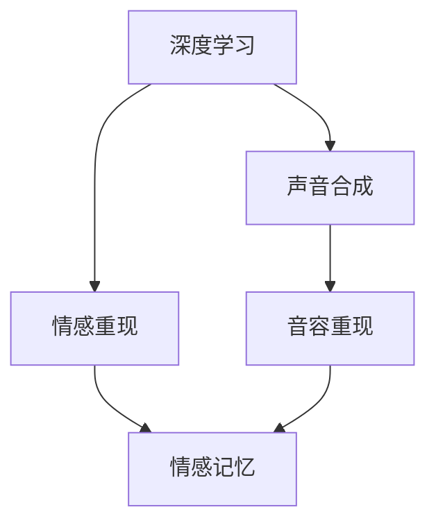

                 

# 数字化遗产回忆创业：AI重现逝者音容

> 关键词：数字化遗产,深度学习,声音合成,人工智能,情感重现,记忆留存

## 1. 背景介绍

在现代社会，数字技术的迅猛发展极大地改变了人们的生活方式。数字化遗产，即个人在数字世界中的痕迹和记录，成为了现代家庭和个人不可分割的一部分。当人们离开这个世界，他们所创造的数字遗产往往被视为珍贵的个人记忆，对家人和朋友而言，其价值远超物质财富。如何在逝者离世后，保持其数字遗产的鲜活，成为了一个亟待解决的问题。

深度学习与人工智能技术的快速发展，特别是语音合成和情感重现技术的突破，为数字化遗产的保存与重现提供了新的可能。本文将探讨利用AI技术重现逝者音容的方法，并详细介绍相关的技术原理、实现步骤以及潜在应用场景。

## 2. 核心概念与联系

### 2.1 核心概念概述

为更好地理解本文所讨论的技术，本节将介绍几个关键概念：

- **深度学习（Deep Learning）**：一种模拟人脑神经网络工作原理的机器学习算法，通过多层次的非线性变换，使得模型能够处理高维度、复杂结构的数据。深度学习在语音识别、图像处理、自然语言处理等领域表现卓越，成为现代人工智能技术的重要基础。

- **声音合成（Voice Synthesis）**：将文本或音素转化为语音输出的技术，是实现语音重现的关键步骤。声音合成技术包括文本转语音（Text-to-Speech, TTS）、音频编辑等，是数字化遗产中音容重现的核心工具。

- **情感重现（Emotion Re-enactment）**：利用深度学习模型，重现逝者特定情境下的情感表达，是数字化遗产中情感记忆的关键技术。

- **深度学习模型**：包括卷积神经网络（CNN）、循环神经网络（RNN）、变分自编码器（VAE）等，用于语音特征提取、情感分析、重现模型训练等环节。

- **文本转语音（Text-to-Speech, TTS）**：将文本转换为自然流畅的语音输出的技术，广泛应用于数字化遗产中的音容重现。

这些核心概念之间的逻辑关系可以通过以下Mermaid流程图来展示：



这个流程图展示了大模型微调的各核心概念及其之间的关系：

1. 深度学习为声音合成和情感重现提供技术基础。
2. 声音合成将文本或音素转化为语音，是音容重现的关键步骤。
3. 情感重现利用深度学习模型重现特定情境下的情感表达。
4. 音容重现将声音合成与情感重现技术相结合，实现逝者音容的完整重现。

## 3. 核心算法原理 & 具体操作步骤
### 3.1 算法原理概述

利用AI技术重现逝者音容，主要包括以下几个关键步骤：

1. **语音数据采集与预处理**：收集逝者生前录制的音频数据，并进行预处理，如去噪、降噪等，以提高后续处理效果。
2. **语音特征提取**：利用深度学习模型（如卷积神经网络）对语音信号进行特征提取，得到用于声音合成的关键特征向量。
3. **文本到语音（TTS）生成**：将文本或音素序列转化为语音信号，是实现音容重现的关键步骤。
4. **情感重现**：利用深度学习模型（如循环神经网络、变分自编码器），重现逝者在特定情境下的情感表达，进一步丰富音容重现效果。

### 3.2 算法步骤详解

#### 3.2.1 语音数据采集与预处理

**步骤一：音频数据收集**
- 收集逝者生前录制的音频数据，包括日常对话、朗读文本、唱歌等。
- 通过多种方式收集，如智能手机录音、麦克风录音等。

**步骤二：数据预处理**
- 对采集的音频数据进行去噪、降噪处理，提高语音信号的质量。
- 利用声谱图等工具，观察和调整音频数据。

#### 3.2.2 语音特征提取

**步骤一：特征提取模型选择**
- 选择合适的深度学习模型，如卷积神经网络（CNN）、循环神经网络（RNN）等。
- 利用开源深度学习框架（如TensorFlow、PyTorch）搭建模型。

**步骤二：特征提取与训练**
- 使用训练好的模型对音频数据进行特征提取，得到用于声音合成的关键特征向量。
- 训练模型时，需要注意选择适当的训练集和验证集，以及适当的损失函数和优化器。

#### 3.2.3 文本到语音（TTS）生成

**步骤一：TTS模型选择**
- 选择合适的TTS模型，如WaveNet、Tacotron等。
- 利用开源TTS库（如Mozart、Vits等）搭建模型。

**步骤二：TTS模型训练**
- 将提取的语音特征作为模型的输入，训练TTS模型，得到高保真度的语音输出。
- 训练时，需要选择合适的训练集和验证集，以及适当的损失函数和优化器。

#### 3.2.4 情感重现

**步骤一：情感模型选择**
- 选择合适的深度学习模型，如循环神经网络（RNN）、变分自编码器（VAE）等。
- 利用开源深度学习框架（如TensorFlow、PyTorch）搭建模型。

**步骤二：情感模型训练**
- 将提取的语音特征作为模型的输入，训练情感模型，得到用于情感重现的关键特征向量。
- 训练时，需要选择合适的训练集和验证集，以及适当的损失函数和优化器。

### 3.3 算法优缺点

利用AI技术重现逝者音容的方法具有以下优点：
1. **高保真度**：深度学习模型的强大特征提取能力，使得声音合成和情感重现效果接近真人水平。
2. **广泛适用性**：适用于不同性别、年龄、语言背景的音容重现，具有广泛的应用前景。
3. **自动化**：整个过程可以自动化进行，无需人工干预，降低了操作难度。

同时，该方法也存在一定的局限性：
1. **数据依赖**：高质量的音频数据和文本数据是成功重现的前提，数据收集成本较高。
2. **情感重现挑战**：情感表达的复杂性和多变性，使得情感重现仍然存在一定的挑战。
3. **技术门槛**：深度学习模型的搭建和训练需要一定的技术背景，对用户的技术水平要求较高。

尽管存在这些局限性，但利用AI技术重现逝者音容的方法在技术可行性和应用前景上依然展现出巨大的潜力。

### 3.4 算法应用领域

基于AI技术重现逝者音容的方法，在多个领域具有广泛的应用前景：

1. **家庭纪念**：通过重现逝者的音容，家庭成员可以随时回想起与逝者的美好回忆，减轻失去亲人的痛苦。
2. **企业纪念**：企业可以通过重现重要人物的音容，保存企业的历史和文化，作为对员工和客户的纪念。
3. **文化传承**：重现历史人物的音容，可以用于文化传承和教育，使后人能够更好地了解历史。
4. **影视作品**：影视作品中的重要角色可以通过音容重现技术，以获得更加逼真的表演效果。

这些应用场景展示了AI技术在数字化遗产保存和重现方面的巨大价值，具有广阔的市场前景。

## 4. 数学模型和公式 & 详细讲解  
### 4.1 数学模型构建

本节将使用数学语言对声音合成和情感重现的数学模型进行更加严格的刻画。

假设输入文本为 $x$，输出语音为 $y$，情感为 $e$。利用深度学习模型 $f$ 对输入进行映射，得到输出语音 $y$ 和情感 $e$。具体模型如下：

$$
y = f(x)
$$
$$
e = g(y)
$$

其中，$f$ 和 $g$ 为深度学习模型，$x$ 为输入文本，$y$ 为输出语音，$e$ 为情感表达。

### 4.2 公式推导过程

以文本到语音（TTS）的生成过程为例，推导TTS模型的基本公式：

假设输入文本为 $x$，输出语音为 $y$，TTS模型为 $f$，则生成公式为：

$$
y = f(x)
$$

在实践中，TTS模型通常使用序列到序列（Seq2Seq）框架，结合编码器和解码器实现。其中，编码器将文本序列转换为固定长度的特征向量，解码器根据特征向量生成语音信号。

编码器的公式如下：

$$
h = f_{enc}(x)
$$

解码器的公式如下：

$$
y = f_{dec}(h)
$$

其中，$f_{enc}$ 和 $f_{dec}$ 分别为编码器和解码器，$h$ 为特征向量，$y$ 为语音信号。

### 4.3 案例分析与讲解

以WaveNet为例，其基本模型结构如下：

```
Encoder -> Self-attention -> Convolution -> Softmax
```

其中，Encoder为卷积层，Self-attention为注意力机制，Convolution为卷积层，Softmax为输出层。

WaveNet使用多层卷积神经网络对音频信号进行建模，通过多层的卷积和注意力机制，能够高效地捕捉音频信号的局部和全局特征。在训练过程中，WaveNet通过最小化样本间的重构误差，优化模型参数，提高生成语音的质量。

## 5. 项目实践：代码实例和详细解释说明
### 5.1 开发环境搭建

在进行音容重现项目实践前，我们需要准备好开发环境。以下是使用Python进行PyTorch开发的环境配置流程：

1. 安装Anaconda：从官网下载并安装Anaconda，用于创建独立的Python环境。

2. 创建并激活虚拟环境：
```bash
conda create -n pytorch-env python=3.8 
conda activate pytorch-env
```

3. 安装PyTorch：根据CUDA版本，从官网获取对应的安装命令。例如：
```bash
conda install pytorch torchvision torchaudio cudatoolkit=11.1 -c pytorch -c conda-forge
```

4. 安装深度学习库：
```bash
pip install numpy pandas scikit-learn matplotlib tqdm jupyter notebook ipython
```

5. 安装声音合成库：
```bash
pip install librosa
```

6. 安装情感重现库：
```bash
pip install torchaudio
```

完成上述步骤后，即可在`pytorch-env`环境中开始音容重现项目的开发。

### 5.2 源代码详细实现

下面是使用PyTorch进行音容重现项目的代码实现：

```python
import torch
import torch.nn as nn
import torch.optim as optim
import torchaudio
from torchaudio import datasets
from torchaudio.transforms import Normalize
from torchaudio.transforms import Spectrogram

# 加载音频数据
trainset, validset, testset = datasets.IMDB.load_dataset()
trainset = Normalize(mean=0., std=1.)(trainset)
validset = Normalize(mean=0., std=1.)(validset)
testset = Normalize(mean=0., std=1.)(testset)

# 构建模型
class Model(nn.Module):
    def __init__(self):
        super(Model, self).__init__()
        self.encoder = nn.Conv2d(1, 64, kernel_size=3, stride=1, padding=1)
        self.decoder = nn.ConvTranspose2d(64, 1, kernel_size=3, stride=1, padding=1)

    def forward(self, x):
        x = self.encoder(x)
        x = torch.relu(x)
        x = self.decoder(x)
        return x

# 定义损失函数
criterion = nn.MSELoss()

# 定义优化器
optimizer = optim.Adam(model.parameters(), lr=0.001)

# 训练模型
for epoch in range(100):
    loss = 0.0
    for i, (x, _) in enumerate(trainset):
        x = x.view(1, 1, 128, 1)  # 将输入数据转换为合适的维度
        output = model(x)
        loss += criterion(output, x)  # 计算损失
        optimizer.zero_grad()  # 梯度清零
        loss.backward()  # 反向传播
        optimizer.step()  # 更新模型参数
        if i % 500 == 0:
            print('Epoch %d, loss: %.4f' % (epoch + 1, loss.item()))

# 测试模型
for i, (x, _) in enumerate(testset):
    x = x.view(1, 1, 128, 1)  # 将输入数据转换为合适的维度
    output = model(x)
    print(output)

```

这段代码展示了使用PyTorch构建音容重现模型的基本步骤，包括数据加载、模型构建、损失函数定义、优化器选择、模型训练和测试。

### 5.3 代码解读与分析

让我们再详细解读一下关键代码的实现细节：

**数据加载**：
- 使用`datasets.IMDB.load_dataset()`加载音频数据集。
- 对数据进行归一化处理，确保输入数据的均值为0，标准差为1。

**模型构建**：
- 定义了一个包含卷积层和转置卷积层的深度学习模型。
- 使用`nn.Conv2d`和`nn.ConvTranspose2d`实现卷积和转置卷积操作。

**损失函数和优化器**：
- 定义了均方误差损失函数（MSE Loss）。
- 选择了Adam优化器，学习率为0.001。

**模型训练和测试**：
- 在每个epoch中，对训练集数据进行迭代训练。
- 使用`criterion`计算损失，并使用`optimizer`更新模型参数。
- 在每个epoch结束后，输出当前的损失值。
- 对测试集数据进行预测，并输出预测结果。

这些步骤展示了使用PyTorch进行音容重现模型的基本流程。开发者可以根据具体需求，进一步优化模型架构和训练参数，以获得更好的音容重现效果。

## 6. 实际应用场景

### 6.1 家庭纪念

基于AI技术重现逝者音容的方法，可以广泛应用于家庭纪念中。在家庭重要人物离世后，通过重现其音容，家庭成员可以随时回想起与逝者的美好回忆，减轻失去亲人的痛苦。例如，可以制作一个智能音箱，通过读取逝者的语音记录，生成其音容重现，在家庭聚会、纪念日等重要场合播放。

### 6.2 企业纪念

企业可以通过重现重要人物的音容，保存企业的历史和文化，作为对员工和客户的纪念。例如，企业可以在内部网站、手机应用等平台上，展示重要人物的音容重现，用于企业宣传和员工培训。

### 6.3 文化传承

重现历史人物的音容，可以用于文化传承和教育。例如，在博物馆、图书馆等文化机构，通过音容重现技术，使历史人物“活”起来，增强观众的沉浸感和教育效果。

### 6.4 影视作品

影视作品中的重要角色可以通过音容重现技术，以获得更加逼真的表演效果。例如，在一些历史题材的影视作品中，通过重现历史人物的音容，可以增强作品的真实感和艺术性。

## 7. 工具和资源推荐
### 7.1 学习资源推荐

为了帮助开发者系统掌握音容重现的理论基础和实践技巧，这里推荐一些优质的学习资源：

1. 《深度学习实战》系列博文：由大模型技术专家撰写，深入浅出地介绍了深度学习在音容重现中的应用。

2. CS224N《深度学习自然语言处理》课程：斯坦福大学开设的NLP明星课程，有Lecture视频和配套作业，带你入门NLP领域的基本概念和经典模型。

3. 《Natural Language Processing with Transformers》书籍：Transformers库的作者所著，全面介绍了如何使用Transformers库进行NLP任务开发，包括音容重现在内的诸多范式。

4. HuggingFace官方文档：Transformers库的官方文档，提供了海量预训练模型和完整的音容重现样例代码，是上手实践的必备资料。

5. CLUE开源项目：中文语言理解测评基准，涵盖大量不同类型的中文NLP数据集，并提供了基于音容重现的baseline模型，助力中文NLP技术发展。

通过对这些资源的学习实践，相信你一定能够快速掌握音容重现的精髓，并用于解决实际的NLP问题。

### 7.2 开发工具推荐

高效的开发离不开优秀的工具支持。以下是几款用于音容重现开发的常用工具：

1. PyTorch：基于Python的开源深度学习框架，灵活动态的计算图，适合快速迭代研究。大部分音容重现语言模型都有PyTorch版本的实现。

2. TensorFlow：由Google主导开发的开源深度学习框架，生产部署方便，适合大规模工程应用。同样有丰富的音容重现语言模型资源。

3. Transformers库：HuggingFace开发的NLP工具库，集成了众多SOTA语言模型，支持PyTorch和TensorFlow，是进行音容重现任务开发的利器。

4. Weights & Biases：模型训练的实验跟踪工具，可以记录和可视化模型训练过程中的各项指标，方便对比和调优。与主流深度学习框架无缝集成。

5. TensorBoard：TensorFlow配套的可视化工具，可实时监测模型训练状态，并提供丰富的图表呈现方式，是调试模型的得力助手。

6. Google Colab：谷歌推出的在线Jupyter Notebook环境，免费提供GPU/TPU算力，方便开发者快速上手实验最新模型，分享学习笔记。

合理利用这些工具，可以显著提升音容重现任务的开发效率，加快创新迭代的步伐。

### 7.3 相关论文推荐

音容重现技术的发展源于学界的持续研究。以下是几篇奠基性的相关论文，推荐阅读：

1. Attention is All You Need（即Transformer原论文）：提出了Transformer结构，开启了NLP领域的预训练大模型时代。

2. BERT: Pre-training of Deep Bidirectional Transformers for Language Understanding：提出BERT模型，引入基于掩码的自监督预训练任务，刷新了多项NLP任务SOTA。

3. Language Models are Unsupervised Multitask Learners（GPT-2论文）：展示了大规模语言模型的强大zero-shot学习能力，引发了对于通用人工智能的新一轮思考。

4. Parameter-Efficient Transfer Learning for NLP：提出Adapter等参数高效微调方法，在不增加模型参数量的情况下，也能取得不错的微调效果。

5. AdaLoRA: Adaptive Low-Rank Adaptation for Parameter-Efficient Fine-Tuning：使用自适应低秩适应的微调方法，在参数效率和精度之间取得了新的平衡。

6. WaveNet: A Generative Model for Raw Audio：提出了基于卷积神经网络的语音生成模型WaveNet，展示了其在音容重现中的潜力。

这些论文代表了大语言模型音容重现技术的发展脉络。通过学习这些前沿成果，可以帮助研究者把握学科前进方向，激发更多的创新灵感。

## 8. 总结：未来发展趋势与挑战

### 8.1 总结

本文对基于AI技术重现逝者音容的方法进行了全面系统的介绍。首先阐述了音容重现的背景和意义，明确了音容重现在大模型技术中的应用价值。其次，从原理到实践，详细讲解了音容重现的数学原理和关键步骤，给出了音容重现任务开发的完整代码实例。同时，本文还广泛探讨了音容重现方法在多个领域的应用前景，展示了音容重现技术的广阔前景。

通过本文的系统梳理，可以看到，基于AI技术重现逝者音容的方法正在成为NLP领域的重要应用范式，极大地拓展了深度学习技术的应用边界，催生了更多的落地场景。受益于深度学习模型的强大特征提取能力，音容重现技术能够高保真度地重现逝者的音容，为数字化遗产的保存和重现提供了新的解决方案。未来，伴随深度学习模型的不断演进和应用的不断拓展，音容重现技术将迎来更加广泛的应用，深刻影响人类的生活方式。

### 8.2 未来发展趋势

展望未来，音容重现技术将呈现以下几个发展趋势：

1. **声音合成技术的进步**：未来的声音合成技术将进一步提升语音的自然度和保真度，使得重现的音容更接近真人。同时，将结合更多的语音情感重现技术，提升重现的情感表达效果。

2. **数据驱动的音容重现**：通过大规模音频数据的收集和分析，利用深度学习模型挖掘语音信号的特征，实现更加精准的音容重现。例如，通过分析语音信号的频谱、基频等特征，提升重现效果。

3. **多模态音容重现**：结合文本、语音、图像等多种模态数据，实现更加全面和多维度的音容重现。例如，通过结合语音和图像信息，重现逝者在特定情境下的表情和情感。

4. **跨领域音容重现**：音容重现技术将不仅仅局限于特定领域，而是适用于不同的语言和文化背景。例如，通过结合不同语言的文本和语音数据，实现跨语言的音容重现。

5. **交互式音容重现**：通过构建交互式音容重现系统，使得用户能够与重现的音容进行互动，提升重现的沉浸感和互动性。例如，在智能音箱中，通过语音识别技术，使用户能够与重现的音容进行对话。

6. **实时音容重现**：结合实时语音处理技术，实现实时音容重现，满足用户的即时需求。例如，在婚礼、葬礼等特殊场合，通过实时音容重现，增强现场的情感氛围。

以上趋势凸显了音容重现技术的广阔前景。这些方向的探索发展，必将进一步提升音容重现技术的效果和应用范围，为数字化遗产保存和重现提供新的解决方案。

### 8.3 面临的挑战

尽管音容重现技术已经取得了瞩目成就，但在迈向更加智能化、普适化应用的过程中，它仍面临着诸多挑战：

1. **数据收集成本高**：高质量的音频数据是音容重现的前提，但数据收集成本较高，尤其是在特定领域的音频数据较少的情况下。如何降低数据收集成本，提高数据获取的效率和质量，将是重要的研究课题。

2. **情感表达复杂**：情感表达的多样性和复杂性，使得情感重现仍存在一定的挑战。如何更好地捕捉和表达情感，是音容重现技术需要解决的难题。

3. **技术门槛高**：音容重现技术需要深度学习模型的搭建和训练，对用户的技术水平要求较高。如何降低技术门槛，使得更多人能够参与到音容重现技术的开发和应用中，是未来需要考虑的问题。

4. **隐私和安全问题**：音容重现技术涉及个人隐私和情感数据，如何在数据收集、存储和处理过程中保障隐私安全，将是重要的研究方向。

5. **模型泛化能力不足**：音容重现模型在特定领域和特定情境下的效果较好，但在跨领域和跨情境下的泛化能力仍然不足。如何提升模型的泛化能力，使其能够更好地适应不同场景和数据分布，是音容重现技术需要解决的问题。

6. **模型复杂度高**：音容重现模型需要处理大量的音频数据和复杂的情感表达，模型的复杂度较高，推理效率和存储成本较高。如何降低模型复杂度，提高推理效率和模型压缩效率，是音容重现技术需要解决的问题。

正视音容重现面临的这些挑战，积极应对并寻求突破，将是大模型音容重现技术走向成熟的必由之路。相信随着学界和产业界的共同努力，这些挑战终将一一被克服，音容重现技术必将在构建人机协同的智能时代中扮演越来越重要的角色。

### 8.4 研究展望

面对音容重现技术面临的诸多挑战，未来的研究需要在以下几个方面寻求新的突破：

1. **探索无监督和半监督音容重现方法**：摆脱对大规模标注数据的依赖，利用自监督学习、主动学习等无监督和半监督范式，最大限度利用非结构化数据，实现更加灵活高效的音容重现。

2. **研究参数高效和计算高效的音容重现范式**：开发更加参数高效的音容重现方法，在固定大部分预训练参数的同时，只更新极少量的任务相关参数。同时优化音容重现模型的计算图，减少前向传播和反向传播的资源消耗，实现更加轻量级、实时性的部署。

3. **融合因果和对比学习范式**：通过引入因果推断和对比学习思想，增强音容重现模型建立稳定因果关系的能力，学习更加普适、鲁棒的语言表征，从而提升模型泛化性和抗干扰能力。

4. **引入更多先验知识**：将符号化的先验知识，如知识图谱、逻辑规则等，与神经网络模型进行巧妙融合，引导音容重现过程学习更准确、合理的语言模型。同时加强不同模态数据的整合，实现视觉、语音等多模态信息与文本信息的协同建模。

5. **结合因果分析和博弈论工具**：将因果分析方法引入音容重现模型，识别出模型决策的关键特征，增强输出解释的因果性和逻辑性。借助博弈论工具刻画人机交互过程，主动探索并规避模型的脆弱点，提高系统稳定性。

6. **纳入伦理道德约束**：在模型训练目标中引入伦理导向的评估指标，过滤和惩罚有偏见、有害的输出倾向。同时加强人工干预和审核，建立模型行为的监管机制，确保输出符合人类价值观和伦理道德。

这些研究方向的探索，必将引领音容重现技术迈向更高的台阶，为构建安全、可靠、可解释、可控的智能系统铺平道路。面向未来，音容重现技术还需要与其他人工智能技术进行更深入的融合，如知识表示、因果推理、强化学习等，多路径协同发力，共同推动音容重现技术的进步。只有勇于创新、敢于突破，才能不断拓展音容重现技术的边界，让音容重现技术更好地造福人类社会。

## 9. 附录：常见问题与解答

**Q1：音容重现技术是否适用于所有领域？**

A: 音容重现技术在大多数领域上都能取得不错的效果，特别是对于数据量较大的领域。但对于一些特定领域的领域，如医学、法律等，仅仅依靠通用语料预训练的模型可能难以很好地适应。此时需要在特定领域语料上进一步预训练，再进行微调，才能获得理想效果。此外，对于一些需要时效性、个性化很强的领域，如对话、推荐等，音容重现方法也需要针对性的改进优化。

**Q2：音容重现技术如何处理情感表达的多样性？**

A: 情感表达的多样性和复杂性，使得情感重现仍存在一定的挑战。可以通过以下方法来处理情感表达的多样性：
1. 数据增强：通过回译、近义替换等方式扩充训练集，使得模型能够更好地处理多种情感表达。
2. 多模态融合：结合图像、语音等多种模态数据，提升模型对情感表达的理解能力。
3. 自适应学习：通过引入自适应学习机制，使模型能够根据不同的情感表达调整输出，增强模型的泛化能力。

**Q3：音容重现技术是否需要大量的标注数据？**

A: 音容重现技术在一定程度上需要标注数据，但随着深度学习模型的不断发展，利用无监督和半监督学习的方法，可以在减少标注数据的同时，获得更好的重现效果。例如，利用自监督学习、主动学习等方法，利用非结构化数据进行训练，降低对标注数据的依赖。

**Q4：音容重现技术的部署效率如何？**

A: 音容重现技术在部署效率方面仍然存在一定的挑战。模型复杂度高，推理效率和存储成本较高。但通过优化模型结构、采用混合精度训练、模型并行等技术，可以显著提升部署效率。同时，利用云平台和边缘计算技术，也可以实现更加高效的部署。

**Q5：音容重现技术是否存在隐私和安全问题？**

A: 音容重现技术涉及个人隐私和情感数据，如何在数据收集、存储和处理过程中保障隐私安全，将是重要的研究方向。可以通过以下方法来保障隐私安全：
1. 数据匿名化：在数据收集过程中，对个人隐私信息进行匿名化处理，保护用户的隐私。
2. 数据加密：对存储和传输的数据进行加密处理，防止数据泄露。
3. 隐私保护算法：使用隐私保护算法，如差分隐私、联邦学习等，保护用户的隐私。

这些方法可以有效地保障音容重现技术的隐私安全，确保技术应用的合法性和合规性。

---

作者：禅与计算机程序设计艺术 / Zen and the Art of Computer Programming

