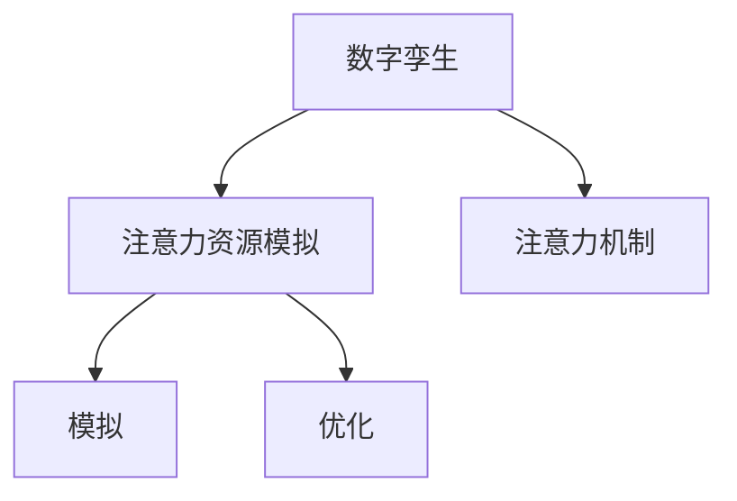

                 

# 数字孪生在注意力资源模拟中的应用

## 1. 背景介绍

### 1.1 问题由来
随着数字经济和数字社会的快速发展，对数字孪生（Digital Twin）技术的关注度越来越高。数字孪生是虚拟与物理世界深度融合的一种先进技术，通过构建高保真度、实时性强的虚拟数字模型，为物理世界提供精确的分析和优化方案。在资源管理、制造流程优化、城市规划等领域，数字孪生技术得到了广泛的应用。

### 1.2 问题核心关键点
注意力资源作为数字孪生系统中重要的一环，其高效模拟和优化是实现数字孪生功能的关键。注意力的高效模拟和分配，不仅能够提升资源利用率，还能显著增强系统的实时性和稳定性。因此，如何高效模拟注意力资源，成为数字孪生技术研究中的一个重要课题。

## 2. 核心概念与联系

### 2.1 核心概念概述
为更好地理解数字孪生中的注意力资源模拟，本节将介绍几个密切相关的核心概念：

- 数字孪生（Digital Twin）：通过构建与物理世界相对应的数字模型，实现对物理世界状态的实时监控、预测和优化。
- 注意力机制（Attention Mechanism）：一种用于机器学习模型中的机制，通过动态计算输入中不同部分的相关性，实现对不同特征的聚焦。
- 模拟（Simulation）：使用模型来模拟现实世界中的物理过程，以进行预测和优化。
- 优化（Optimization）：通过调整模型参数，使模型输出尽可能逼近真实值的过程。

这些核心概念之间的逻辑关系可以通过以下Mermaid流程图来展示：



这个流程图展示出数字孪生中的注意力资源模拟与注意力机制、模拟和优化之间的逻辑关系：

1. 数字孪生通过构建虚拟模型，实现对物理世界的模拟。
2. 注意力资源模拟是在数字孪生中对注意力机制进行模拟，以实现对资源的高效管理和优化。
3. 注意力机制用于模拟过程中，动态计算不同特征的重要性，提高模拟精度。
4. 优化过程则通过调整模拟模型参数，实现对注意力资源的高效管理。

## 3. 核心算法原理 & 具体操作步骤

### 3.1 算法原理概述

数字孪生中的注意力资源模拟，本质上是一种基于注意力机制的模拟优化过程。其核心思想是：通过模拟过程中引入注意力机制，动态聚焦于资源使用的关键部分，以实现高效模拟和优化。

形式化地，假设数字孪生系统中的注意力资源为 $R_{\theta}$，其中 $\theta$ 为模型参数。给定物理世界的输入数据 $D$，注意力资源模拟的目标是找到最优参数 $\hat{\theta}$，使得：

$$
\hat{\theta}=\mathop{\arg\min}_{\theta} \mathcal{L}(R_{\theta},D)
$$

其中 $\mathcal{L}$ 为注意力资源模拟过程中的损失函数，用于衡量模型输出与真实资源分布之间的差异。常见的损失函数包括均方误差损失、交叉熵损失等。

### 3.2 算法步骤详解

数字孪生中的注意力资源模拟一般包括以下几个关键步骤：

**Step 1: 准备输入数据**
- 收集物理世界的输入数据 $D$，如传感器数据、生产设备状态、天气变化等。
- 对数据进行预处理，包括清洗、去噪、特征提取等操作。

**Step 2: 引入注意力机制**
- 选择或设计合适的注意力模型，如Transformer、MLP等，作为注意力资源模拟的核心计算组件。
- 对模型进行训练，学习输入数据的特征重要性和时间依赖关系。

**Step 3: 设置模拟超参数**
- 选择合适的优化算法及其参数，如Adam、SGD等，设置学习率、批大小、迭代轮数等。
- 设置注意力机制的正则化技术及强度，包括权重衰减、Dropout、Early Stopping等。

**Step 4: 执行模拟训练**
- 将输入数据 $D$ 分批次输入模型，前向传播计算注意力资源的分布。
- 反向传播计算模型参数的梯度，根据设定的优化算法和学习率更新模型参数。
- 周期性在验证集上评估模型性能，根据性能指标决定是否触发 Early Stopping。
- 重复上述步骤直到满足预设的迭代轮数或 Early Stopping 条件。

**Step 5: 进行优化调整**
- 根据模拟结果，调整物理世界中的注意力资源分配策略，优化资源配置。
- 在优化过程中，引入动态调整机制，实时反馈模拟结果，不断优化资源分配。

### 3.3 算法优缺点

数字孪生中的注意力资源模拟方法具有以下优点：
1. 高效模拟：通过引入注意力机制，能够动态聚焦于资源使用的关键部分，实现高效模拟。
2. 通用适用：可以应用于多种场景的资源模拟和优化，如制造流程、能源管理、城市交通等。
3. 实时反馈：能够实时获取模拟结果，迅速调整资源分配，提升系统的实时性和稳定性。
4. 参数可调：通过优化超参数，可以在不同的资源需求和系统约束下，找到最优的模拟方案。

同时，该方法也存在一定的局限性：
1. 数据依赖：模型的训练效果高度依赖于输入数据的质量和数量，数据缺失或噪声可能导致模型性能下降。
2. 模型复杂：引入注意力机制后，模型的计算复杂度显著增加，需要高性能计算资源支持。
3. 过拟合风险：如果模型过度拟合输入数据，可能导致泛化性能下降，影响模拟结果的准确性。
4. 模型解释性：注意力机制等深度学习模型的解释性较弱，难以对其决策逻辑进行解释和调试。

尽管存在这些局限性，但就目前而言，注意力资源模拟仍是数字孪生技术中的重要方法。未来相关研究的重点在于如何进一步降低数据依赖，提高模型的泛化能力和可解释性，同时兼顾实时性和稳定性等因素。

### 3.4 算法应用领域

数字孪生中的注意力资源模拟在多个领域中得到了广泛的应用：

- 制造流程优化：通过模拟制造过程中的注意力资源分配，优化生产线的资源配置，提高生产效率。
- 能源管理系统：实时监控能源使用的注意力分布，预测能源消耗趋势，优化能源分配。
- 城市交通规划：模拟城市交通中的注意力资源流动，优化交通信号灯、路网布局，减少交通拥堵。
- 资源管理：在农业、物流、供水等领域，通过注意力资源模拟，优化资源的使用和分配。

除了上述这些经典应用外，数字孪生技术还正在向更多领域拓展，如智能电网、智能家居、智能仓储等，为智慧城市和智慧企业的建设提供新的技术路径。

## 4. 数学模型和公式 & 详细讲解 & 举例说明

### 4.1 数学模型构建

本节将使用数学语言对数字孪生中的注意力资源模拟过程进行更加严格的刻画。

记数字孪生系统中的注意力资源为 $R_{\theta}:\mathcal{X} \rightarrow \mathcal{Y}$，其中 $\mathcal{X}$ 为输入空间，$\mathcal{Y}$ 为输出空间，$\theta$ 为模型参数。假设注意力资源模拟的训练集为 $D=\{(x_i,y_i)\}_{i=1}^N, x_i \in \mathcal{X}, y_i \in \mathcal{Y}$。

定义模型 $R_{\theta}$ 在输入 $x$ 上的输出为 $y=R_{\theta}(x)$，注意力资源模拟的损失函数为：

$$
\mathcal{L}(\theta) = \frac{1}{N}\sum_{i=1}^N (y_i - R_{\theta}(x_i))^2
$$

其中，$y_i$ 为输入 $x_i$ 的真实注意力资源值，$R_{\theta}(x_i)$ 为模型对输入 $x_i$ 的模拟结果。

### 4.2 公式推导过程

以下我们以生产流程优化为例，推导注意力资源模拟的损失函数及其梯度的计算公式。

假设生产流程由多个步骤组成，每个步骤 $j$ 需要的注意力资源为 $R_j$，步骤 $j$ 的输入为 $x_j$，输出为 $y_j$。则生产流程中所有步骤的注意力资源总和为 $R=\sum_{j=1}^J R_j$。假设注意力资源模拟模型为 $R_{\theta}$，其中 $\theta$ 为模型参数。

定义注意力资源模拟模型 $R_{\theta}$ 在输入 $x_j$ 上的输出为 $y_j=R_{\theta}(x_j)$，生产流程优化问题的目标是最小化注意力资源的差异，即：

$$
\mathcal{L}(\theta) = \frac{1}{N}\sum_{i=1}^N \sum_{j=1}^J (y_{j,i} - R_{\theta}(x_{j,i}))^2
$$

其中，$y_{j,i}$ 为第 $i$ 次模拟生产流程中步骤 $j$ 的真实注意力资源值，$R_{\theta}(x_{j,i})$ 为模型对第 $i$ 次输入 $x_{j,i}$ 的模拟结果。

根据链式法则，注意力资源模拟损失函数对参数 $\theta_k$ 的梯度为：

$$
\frac{\partial \mathcal{L}(\theta)}{\partial \theta_k} = -\frac{2}{N}\sum_{i=1}^N \sum_{j=1}^J \frac{\partial R_{\theta}(x_{j,i})}{\partial \theta_k} \cdot (y_{j,i} - R_{\theta}(x_{j,i}))
$$

其中，$\frac{\partial R_{\theta}(x_{j,i})}{\partial \theta_k}$ 为注意力资源模拟模型对参数 $\theta_k$ 的梯度，可通过反向传播算法高效计算。

在得到损失函数的梯度后，即可带入优化算法，完成模型的迭代优化。重复上述过程直至收敛，最终得到适应生产流程的注意力资源模拟模型。

## 5. 项目实践：代码实例和详细解释说明

### 5.1 开发环境搭建

在进行注意力资源模拟实践前，我们需要准备好开发环境。以下是使用Python进行PyTorch开发的环境配置流程：

1. 安装Anaconda：从官网下载并安装Anaconda，用于创建独立的Python环境。

2. 创建并激活虚拟环境：
```bash
conda create -n pytorch-env python=3.8 
conda activate pytorch-env
```

3. 安装PyTorch：根据CUDA版本，从官网获取对应的安装命令。例如：
```bash
conda install pytorch torchvision torchaudio cudatoolkit=11.1 -c pytorch -c conda-forge
```

4. 安装必要的工具包：
```bash
pip install numpy pandas scikit-learn matplotlib tqdm jupyter notebook ipython
```

完成上述步骤后，即可在`pytorch-env`环境中开始注意力资源模拟的实践。

### 5.2 源代码详细实现

这里我们以制造业中的生产流程优化为例，给出使用PyTorch进行注意力资源模拟的完整代码实现。

首先，定义数据处理函数：

```python
import torch
import torch.nn as nn
import torch.optim as optim

class AttentionSimulationModel(nn.Module):
    def __init__(self, input_dim, hidden_dim):
        super(AttentionSimulationModel, self).__init__()
        self.hidden_dim = hidden_dim
        self.W1 = nn.Linear(input_dim, hidden_dim)
        self.W2 = nn.Linear(hidden_dim, 1)
        self.attention = nn.Softmax(dim=-1)
        
    def forward(self, x):
        h = torch.tanh(self.W1(x))
        h = self.W2(h)
        a = self.attention(h)
        return a

# 设置训练超参数
input_dim = 10
hidden_dim = 10
batch_size = 32
learning_rate = 0.01
num_epochs = 100
```

然后，定义损失函数和优化器：

```python
# 定义损失函数
def loss_function(model, data_loader):
    criterion = nn.MSELoss()
    total_loss = 0
    for i, data in enumerate(data_loader, 0):
        inputs, labels = data
        optimizer.zero_grad()
        outputs = model(inputs)
        loss = criterion(outputs, labels)
        total_loss += loss.item()
        loss.backward()
        optimizer.step()
        if (i+1) % 100 == 0:
            print(f'Epoch [{i+1}/{num_epochs}], Loss: {total_loss/100:.4f}')
            total_loss = 0
    return total_loss / len(data_loader)
```

最后，启动训练流程：

```python
# 加载数据
data_loader = ...

# 定义模型
model = AttentionSimulationModel(input_dim, hidden_dim)

# 定义优化器
optimizer = optim.Adam(model.parameters(), lr=learning_rate)

# 训练模型
for epoch in range(num_epochs):
    loss = loss_function(model, data_loader)
    print(f'Epoch {epoch+1}, Loss: {loss:.4f}')
    
print('Training completed.')
```

以上就是使用PyTorch对制造业生产流程进行注意力资源模拟的完整代码实现。可以看到，在PyTorch中，通过自定义模型、定义损失函数和优化器，我们可以快速搭建起注意力资源模拟的模型并对其进行训练。

### 5.3 代码解读与分析

让我们再详细解读一下关键代码的实现细节：

**AttentionSimulationModel类**：
- `__init__`方法：初始化模型参数，定义两个线性层和一个Softmax层。
- `forward`方法：对输入进行前向传播，输出注意力分布。

**loss_function函数**：
- 定义均方误差损失函数。
- 在每个epoch内，对数据进行批处理，计算损失并反向传播更新模型参数。
- 每100个batch打印一次损失值，控制训练的输出频率。

**训练流程**：
- 定义训练超参数，包括输入维度、隐藏层维度、批次大小、学习率、epoch数等。
- 加载数据集，初始化模型和优化器。
- 循环迭代训练模型，每个epoch更新一次模型参数。
- 在每个epoch结束后打印损失值，监控训练进度。
- 训练结束后输出训练完成的提示信息。

可以看到，PyTorch提供了灵活便捷的模型定义和训练机制，使得注意力资源模拟的实现变得简单高效。开发者可以快速迭代模型结构，优化超参数，实现高效的模拟效果。

当然，工业级的系统实现还需考虑更多因素，如模型的保存和部署、超参数的自动搜索、更灵活的任务适配层等。但核心的模拟范式基本与此类似。

## 6. 实际应用场景

### 6.1 智能制造

数字孪生中的注意力资源模拟在智能制造中得到了广泛应用。智能制造通过构建虚拟制造系统，实时监控生产过程中的资源使用情况，优化资源配置，提高生产效率。

在技术实现上，可以收集生产流程中的各种传感器数据，将工艺参数、设备状态、产品质量等信息作为输入，构建虚拟制造系统。利用注意力资源模拟模型，对资源使用进行实时监控和优化，动态调整生产参数，提升生产效率和产品质量。

### 6.2 智慧农业

数字孪生技术在智慧农业中的应用，主要体现在智能灌溉、智能施肥、智能种植等方面。通过构建农业生产数字孪生系统，实时监控土壤湿度、气候条件等环境数据，优化资源使用，提高农业生产效率。

具体而言，可以收集土壤湿度、气温、降水等农业环境数据，将气象预报、种植周期、施肥方案等信息作为模型输入，构建数字孪生系统。利用注意力资源模拟模型，动态调整灌溉和施肥策略，优化资源配置，提升农作物产量和质量。

### 6.3 城市交通管理

数字孪生中的注意力资源模拟在城市交通管理中的应用，主要体现在智能交通信号灯、智能路网规划、智能交通监测等方面。通过构建城市交通数字孪生系统，实时监控交通流量、道路状况等数据，优化交通资源配置，减少交通拥堵。

具体而言，可以收集交通流量、车辆速度、道路状况等数据，将交通信号灯、路网布局、交通规则等信息作为模型输入，构建数字孪生系统。利用注意力资源模拟模型，实时调整交通信号灯和路网布局，优化交通流量，提高交通效率。

### 6.4 未来应用展望

随着数字孪生技术的发展，注意力资源模拟将会在更多领域得到应用，为智慧城市、智慧企业、智慧农业等提供强大的技术支撑。

在智慧城市中，数字孪生系统将全面覆盖城市基础设施，实时监控资源使用情况，优化资源配置，提升城市运行效率。

在智慧企业中，数字孪生系统将深入应用到生产流程、供应链管理、员工调度等方面，通过优化资源使用，提升企业竞争力。

在智慧农业中，数字孪生系统将推动精准农业的发展，通过实时监控和优化资源配置，提升农作物产量和质量。

## 7. 工具和资源推荐

### 7.1 学习资源推荐

为了帮助开发者系统掌握数字孪生中的注意力资源模拟的理论基础和实践技巧，这里推荐一些优质的学习资源：

1. 《Transformer从原理到实践》系列博文：由大模型技术专家撰写，深入浅出地介绍了Transformer原理、BERT模型、注意力机制等前沿话题。

2. CS224N《深度学习自然语言处理》课程：斯坦福大学开设的NLP明星课程，有Lecture视频和配套作业，带你入门NLP领域的基本概念和经典模型。

3. 《Natural Language Processing with Transformers》书籍：Transformers库的作者所著，全面介绍了如何使用Transformers库进行NLP任务开发，包括注意力资源模拟在内的诸多范式。

4. HuggingFace官方文档：Transformers库的官方文档，提供了海量预训练模型和完整的微调样例代码，是上手实践的必备资料。

5. CLUE开源项目：中文语言理解测评基准，涵盖大量不同类型的中文NLP数据集，并提供了基于注意力资源模拟的baseline模型，助力中文NLP技术发展。

通过对这些资源的学习实践，相信你一定能够快速掌握数字孪生中的注意力资源模拟的精髓，并用于解决实际的NLP问题。

### 7.2 开发工具推荐

高效的开发离不开优秀的工具支持。以下是几款用于注意力资源模拟开发的常用工具：

1. PyTorch：基于Python的开源深度学习框架，灵活动态的计算图，适合快速迭代研究。大部分预训练语言模型都有PyTorch版本的实现。

2. TensorFlow：由Google主导开发的开源深度学习框架，生产部署方便，适合大规模工程应用。同样有丰富的预训练语言模型资源。

3. Transformers库：HuggingFace开发的NLP工具库，集成了众多SOTA语言模型，支持PyTorch和TensorFlow，是进行注意力资源模拟开发的利器。

4. Weights & Biases：模型训练的实验跟踪工具，可以记录和可视化模型训练过程中的各项指标，方便对比和调优。与主流深度学习框架无缝集成。

5. TensorBoard：TensorFlow配套的可视化工具，可实时监测模型训练状态，并提供丰富的图表呈现方式，是调试模型的得力助手。

6. Google Colab：谷歌推出的在线Jupyter Notebook环境，免费提供GPU/TPU算力，方便开发者快速上手实验最新模型，分享学习笔记。

合理利用这些工具，可以显著提升注意力资源模拟任务的开发效率，加快创新迭代的步伐。

### 7.3 相关论文推荐

数字孪生中的注意力资源模拟技术源于学界的持续研究。以下是几篇奠基性的相关论文，推荐阅读：

1. Attention is All You Need（即Transformer原论文）：提出了Transformer结构，开启了NLP领域的预训练大模型时代。

2. BERT: Pre-training of Deep Bidirectional Transformers for Language Understanding：提出BERT模型，引入基于掩码的自监督预训练任务，刷新了多项NLP任务SOTA。

3. Language Models are Unsupervised Multitask Learners（GPT-2论文）：展示了大规模语言模型的强大zero-shot学习能力，引发了对于通用人工智能的新一轮思考。

4. Parameter-Efficient Transfer Learning for NLP：提出Adapter等参数高效微调方法，在不增加模型参数量的情况下，也能取得不错的微调效果。

5. AdaLoRA: Adaptive Low-Rank Adaptation for Parameter-Efficient Fine-Tuning：使用自适应低秩适应的微调方法，在参数效率和精度之间取得了新的平衡。

6. SimNet: Semantic Segmentation via Attractive Attention in Scene Graph Networks：提出SimNet模型，利用注意力机制对场景图网络进行语义分割，提高了模型效果。

这些论文代表了大模型注意力资源模拟的发展脉络。通过学习这些前沿成果，可以帮助研究者把握学科前进方向，激发更多的创新灵感。

## 8. 总结：未来发展趋势与挑战

### 8.1 总结

本文对数字孪生中的注意力资源模拟方法进行了全面系统的介绍。首先阐述了数字孪生和注意力机制的研究背景和意义，明确了注意力资源模拟在实现数字孪生功能中的重要价值。其次，从原理到实践，详细讲解了注意力资源模拟的数学原理和关键步骤，给出了注意力资源模拟任务开发的完整代码实例。同时，本文还广泛探讨了注意力资源模拟方法在智能制造、智慧农业、城市交通等多个领域的应用前景，展示了其巨大的潜力。

通过本文的系统梳理，可以看到，注意力资源模拟方法在数字孪生技术中发挥着至关重要的作用。它不仅提升了数字孪生系统的模拟精度，还能实现对资源的高效优化，显著提升了系统的实时性和稳定性。未来，伴随数字孪生技术的不断演进，注意力资源模拟方法将进一步得到优化和推广，推动数字孪生技术在更多领域的应用。

### 8.2 未来发展趋势

展望未来，数字孪生中的注意力资源模拟技术将呈现以下几个发展趋势：

1. 模型规模持续增大。随着算力成本的下降和数据规模的扩张，注意力资源模拟模型的参数量还将持续增长。超大规模注意力模型蕴含的丰富知识，有望支撑更加复杂多变的模拟任务。

2. 模型结构更加灵活。未来的注意力资源模拟模型将更加注重模型的可解释性和灵活性，如可插拔注意力机制、自适应注意力权重等。

3. 实时性进一步提高。实时性是数字孪生中注意力资源模拟的重要指标，未来的模拟方法将进一步提升模型训练和推理的速度，支持更高效的生产流程优化。

4. 跨模态注意力机制。未来的模拟方法将引入跨模态注意力机制，将视觉、声音等多模态信息与文本信息结合，实现更全面、更精准的模拟效果。

5. 自动化模拟优化。未来的模拟方法将更加注重自动化调参和超参数优化，以提升模型的泛化能力和性能。

以上趋势凸显了数字孪生中注意力资源模拟技术的广阔前景。这些方向的探索发展，必将进一步提升数字孪生系统的模拟精度和优化效果，为智慧城市、智慧企业、智慧农业等提供更强大的技术支持。

### 8.3 面临的挑战

尽管数字孪生中的注意力资源模拟技术已经取得了显著成就，但在迈向更加智能化、普适化应用的过程中，仍面临诸多挑战：

1. 数据依赖问题。模型的训练效果高度依赖于输入数据的质量和数量，数据缺失或噪声可能导致模型性能下降。如何进一步降低数据依赖，提高模型的泛化能力和鲁棒性，是一大挑战。

2. 模型复杂度。引入注意力机制后，模型的计算复杂度显著增加，需要高性能计算资源支持。如何简化模型结构，提高训练和推理效率，也是亟待解决的问题。

3. 模型解释性。注意力资源模拟等深度学习模型的解释性较弱，难以对其决策逻辑进行解释和调试。如何在模型设计中引入更多可解释性元素，提升模型的可解释性和可信度，将是一个重要研究方向。

4. 安全性问题。注意力资源模拟模型可能学习到有害的输入信息，影响系统的安全性和稳定性。如何构建安全的模型，避免模型的滥用和误导，是一个需要认真对待的问题。

5. 实时性保障。尽管模型的实时性在不断提升，但在一些高实时性要求的应用场景中，仍需进一步优化计算效率，保证系统的实时性和稳定性。

6. 多模态融合。未来的模拟方法将引入更多模态的信息融合，如何有效地处理跨模态数据，提升模型的综合分析能力，也是一个需要深入研究的课题。

正视数字孪生中的注意力资源模拟面临的这些挑战，积极应对并寻求突破，将使注意力资源模拟技术迈向更加成熟，为构建安全、可靠、可解释的数字孪生系统提供坚实的技术保障。

### 8.4 研究展望

面对数字孪生中的注意力资源模拟所面临的种种挑战，未来的研究需要在以下几个方面寻求新的突破：

1. 无监督和半监督学习。摆脱对大规模标注数据的依赖，利用自监督学习、主动学习等无监督和半监督范式，最大限度利用非结构化数据，实现更加灵活高效的模拟。

2. 跨模态注意力机制。将视觉、声音等多模态信息与文本信息结合，实现跨模态的注意力计算，提升模拟效果和泛化能力。

3. 引入更多先验知识。将符号化的先验知识，如知识图谱、逻辑规则等，与神经网络模型进行巧妙融合，引导模拟过程学习更准确、合理的语言模型。

4. 动态调整机制。引入动态调整机制，实时反馈模拟结果，不断优化资源分配，提升系统的实时性和稳定性。

5. 多任务学习。利用多任务学习思想，在注意力资源模拟中同时优化多个目标，提升系统的整体性能。

6. 安全性和鲁棒性。在模型训练目标中引入伦理导向的评估指标，过滤和惩罚有害的输出倾向。同时加强人工干预和审核，建立模型行为的监管机制，确保输出符合人类价值观和伦理道德。

这些研究方向的探索，必将引领数字孪生中的注意力资源模拟技术迈向更高的台阶，为构建安全、可靠、可解释的数字孪生系统提供坚实的技术保障。面向未来，数字孪生中的注意力资源模拟技术还需要与其他人工智能技术进行更深入的融合，如知识表示、因果推理、强化学习等，多路径协同发力，共同推动数字孪生技术的发展。只有勇于创新、敢于突破，才能不断拓展数字孪生技术的边界，让智能技术更好地造福人类社会。

## 9. 附录：常见问题与解答

**Q1：数字孪生中的注意力资源模拟是否适用于所有数字孪生系统？**

A: 数字孪生中的注意力资源模拟可以应用于大多数数字孪生系统，尤其是那些需要精细化资源管理和优化的场景。但对于一些特定领域的数字孪生系统，如医疗、金融等，可能需要引入更加专业的知识和算法，以实现更精确的模拟和优化。

**Q2：数字孪生中的注意力资源模拟如何处理大规模数据集？**

A: 数字孪生中的注意力资源模拟对数据集的大小有较高要求，当数据集过大时，模型的训练和推理效率可能会受到影响。解决这个问题的方法包括：
1. 数据采样：对大规模数据集进行采样，选择有代表性的样本进行训练和推理。
2. 分布式计算：利用多机分布式计算框架，如Hadoop、Spark等，将数据并行处理，提高训练和推理效率。
3. 模型压缩：使用模型压缩技术，如剪枝、量化等，减少模型的计算量和存储空间。

**Q3：数字孪生中的注意力资源模拟如何处理噪声数据？**

A: 数字孪生中的注意力资源模拟对输入数据的噪声敏感，噪声数据可能导致模型性能下降。解决这个问题的方法包括：
1. 数据清洗：对输入数据进行预处理，去除噪声和异常值。
2. 数据增强：引入数据增强技术，如扩充、平移、旋转等，提高数据的多样性，减少噪声影响。
3. 模型鲁棒性：在模型设计中引入鲁棒性训练技术，如Dropout、正则化等，提升模型的泛化能力和鲁棒性。

**Q4：数字孪生中的注意力资源模拟在工业应用中需要注意哪些问题？**

A: 数字孪生中的注意力资源模拟在工业应用中需要注意以下问题：
1. 数据隐私：在数据收集和处理过程中，要注意保护用户的隐私和数据安全。
2. 模型可解释性：在实际应用中，需要考虑模型的可解释性，确保用户能够理解和信任模型的决策过程。
3. 系统稳定性：数字孪生系统需要具备高可靠性和稳定性，能够在大规模数据和复杂环境下稳定运行。
4. 模型部署：在工业应用中，需要将模型封装成标准化的服务接口，方便集成调用，同时进行模型压缩和优化，确保高效的推理性能。

这些问题的解决，需要结合具体的工业应用场景进行全面考虑和优化。

**Q5：数字孪生中的注意力资源模拟如何应对模型过拟合问题？**

A: 数字孪生中的注意力资源模拟在训练过程中可能出现过拟合问题，解决方法包括：
1. 数据增强：通过数据增强技术，扩充训练集的多样性，减少过拟合风险。
2. 正则化：使用L2正则化、Dropout等正则化技术，抑制模型过拟合。
3. 早停机制：在验证集上设置早停机制，当模型性能不再提升时，停止训练，避免过拟合。
4. 模型简化：通过模型简化技术，减少模型的复杂度，提升模型的泛化能力。

以上方法需要结合具体的模型和数据集进行优化，以解决过拟合问题，提升模拟效果。

---

作者：禅与计算机程序设计艺术 / Zen and the Art of Computer Programming

