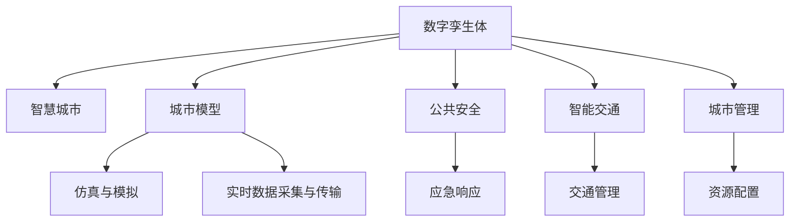

                 

# 数字孪生技术在智慧城市中的应用

> 关键词：数字孪生,智慧城市,城市管理,智能交通,公共安全,模拟仿真,物联网,实时监控

## 1. 背景介绍

### 1.1 问题由来
在当今快速城市化进程中，智慧城市已成为全球范围内的发展趋势。智慧城市旨在通过整合各类信息资源，实现城市管理、公共服务、环境保护等方面的智能化。数字孪生技术作为一种强有力的新型技术手段，为智慧城市的建设提供了新的思路和方法。

### 1.2 问题核心关键点
数字孪生技术指的是通过对物理世界的精确数字化复制和仿真，构建虚拟世界与现实世界的双向互动和联动，实现实时感知、精准控制、优化决策等功能。其核心在于通过虚拟模型映射真实世界，并以此为基础进行数据分析、仿真测试和优化决策。

数字孪生技术在智慧城市中的应用，将城市建设、运行、管理等各环节数字化、虚拟化，为城市管理者提供了更直观、更有效的管理工具，能够提升城市运行效率和公共服务质量，增强城市应对各类挑战的能力。

### 1.3 问题研究意义
数字孪生技术在智慧城市中的应用，对城市管理效率、公共服务水平、环境治理能力、交通治理能力等方面都有显著的提升作用。通过构建城市数字孪生体，可以实现对城市运营状态的实时监控和精准管理，优化资源配置，提高城市运行效率。同时，数字孪生技术还能辅助进行城市规划、应急响应、灾害防治等工作，推动城市可持续发展。

## 2. 核心概念与联系

### 2.1 核心概念概述

为更好地理解数字孪生技术在智慧城市中的应用，本节将介绍几个密切相关的核心概念：

- 数字孪生体(Digital Twin)：通过数字技术创建与物理世界一一对应的虚拟数字模型，实现虚拟与现实的同步映射和双向互动。
- 智慧城市(Smart City)：利用物联网、大数据、人工智能等技术手段，实现城市运行管理、公共服务等方面的智能化。
- 城市模型(City Model)：指城市数字化模型，包括地理信息、建筑物、基础设施、交通网络等元素。
- 仿真与模拟(Simulation & Simulation)：通过建立虚拟模型，模拟城市运行状态，进行预测和优化。
- 实时数据采集与传输：通过各类传感器、监控设备等，实现城市数据的实时采集和传输。

这些核心概念之间的逻辑关系可以通过以下Mermaid流程图来展示：



这个流程图展示了大规模语言模型的核心概念及其之间的关系：

1. 数字孪生体通过建立虚拟模型映射物理世界，为智慧城市提供了实时感知和精准控制的基础。
2. 城市模型为数字孪生体提供了具体的数字化实现，仿真与模拟则基于城市模型进行各类预测和优化。
3. 实时数据采集与传输为数字孪生体提供了数据支撑，使得模拟与真实世界的互动更加紧密。
4. 数字孪生技术在公共安全、智能交通、城市管理等方面都有广泛应用，推动了智慧城市建设的不断深入。

## 3. 核心算法原理 & 具体操作步骤
### 3.1 算法原理概述

数字孪生技术在智慧城市中的应用，主要基于数字孪生体与物理实体的双向互动。其核心思想是通过对物理实体的数字化映射，构建虚拟模型，并通过传感器和监控设备获取真实世界的实时数据，进行仿真和模拟，实现对城市运行状态的实时监控、预测和优化。

形式化地，假设城市模型为 $M$，实时数据为 $D$，则数字孪生系统的优化目标是最小化城市运行状态与模拟状态之间的差异，即：

$$
\hat{M} = \mathop{\arg\min}_{M} \mathcal{L}(M,D)
$$

其中 $\mathcal{L}$ 为损失函数，衡量城市模型 $M$ 与实时数据 $D$ 的差异。

通过梯度下降等优化算法，数字孪生系统不断更新城市模型 $M$，最小化损失函数 $\mathcal{L}$，使得模拟状态逼近真实状态。由于数字孪生体能够实时获取并处理海量数据，因此可以实现对城市运行状态的精准监控和优化。

### 3.2 算法步骤详解

数字孪生技术在智慧城市中的应用一般包括以下几个关键步骤：

**Step 1: 城市模型的建立**
- 收集城市的基础地理信息、建筑结构、基础设施等数据。
- 使用城市建模软件建立城市三维模型，并标注各类设施和设备。
- 将城市模型导入数字孪生平台，完成模型与平台的同步。

**Step 2: 传感器部署与数据采集**
- 在城市关键节点部署各类传感器，如交通流量传感器、环境监测设备等。
- 实时采集各类环境、交通、安全等数据，并进行预处理和清洗。

**Step 3: 仿真与模拟**
- 在数字孪生平台上，基于城市模型和实时数据，进行仿真和模拟。
- 利用各类仿真工具和算法，如模拟器、仿真器等，进行场景模拟和预测。
- 根据仿真结果，进行优化调整，生成决策建议。

**Step 4: 决策与反馈**
- 根据仿真结果和决策建议，进行城市管理、公共服务等方面的优化决策。
- 实时监控城市运行状态，并反馈决策执行效果。
- 根据反馈结果，不断更新和优化数字孪生模型。

**Step 5: 评估与持续改进**
- 定期评估数字孪生系统的运行效果和决策建议的准确性。
- 根据评估结果，不断改进数字孪生模型和算法。
- 引入新的数据源和仿真工具，提升数字孪生系统的性能。

以上是数字孪生技术在智慧城市中的应用一般流程。在实际应用中，还需要针对具体城市的特点，对各个环节进行优化设计，如选择适合的仿真工具、引入更多传感器等，以进一步提升数字孪生系统的性能和效果。

### 3.3 算法优缺点

数字孪生技术在智慧城市中的应用，具有以下优点：
1. 实时感知：通过实时数据采集与传输，数字孪生系统能够实时感知城市运行状态，及时响应各类紧急事件。
2. 精准控制：通过仿真与模拟，数字孪生系统能够精准预测和优化城市运行状态，提升资源配置和运营效率。
3. 可视化管理：通过数字孪生模型，城市管理者能够直观地了解城市运行状况，进行可视化管理。
4. 可扩展性：数字孪生技术具有高度的可扩展性，能够轻松适应不同类型的城市需求。

同时，该方法也存在一定的局限性：
1. 数据依赖：数字孪生系统的效果很大程度上依赖于实时数据的获取质量和数据量。
2. 模型复杂度：构建和维护一个精确的城市模型，需要投入大量时间和资源。
3. 仿真精度：模拟结果的准确性受限于仿真模型和算法的精度。
4. 安全性与隐私：在城市数据采集与传输过程中，可能涉及个人隐私和数据安全问题。
5. 成本高昂：数字孪生技术的建设与维护需要较大的资金投入和技术支持。

尽管存在这些局限性，但就目前而言，数字孪生技术仍是智慧城市建设的重要手段。未来相关研究的重点在于如何进一步降低数据获取成本，提高仿真精度，保证数据安全和隐私，以及优化系统性能，降低建设维护成本。

### 3.4 算法应用领域

数字孪生技术在智慧城市中的应用已经涉及多个领域，包括：

- 智能交通：通过实时监控交通流量、路况等信息，优化交通信号灯控制，提升交通效率。
- 公共安全：利用视频监控、传感器数据，进行人员密集区域的安全监控和预警。
- 环境治理：监测环境质量、污染源等信息，进行实时预警和应急响应。
- 城市规划：通过模拟仿真，评估城市规划方案，优化资源配置。
- 资源管理：对城市水、电、气等资源进行实时监控和优化调度。
- 医疗应急：模拟疫情扩散路径，进行疫情预测和防控。

除了上述这些核心领域外，数字孪生技术还将在更多场景中得到应用，如能源管理、建筑管理、旅游规划等，为智慧城市建设提供全方位的支持。

## 4. 数学模型和公式 & 详细讲解  
### 4.1 数学模型构建

本节将使用数学语言对数字孪生技术在智慧城市中的应用进行更加严格的刻画。

假设城市模型为 $M$，实时数据为 $D$。设城市运行状态为 $X$，其与数字孪生模型 $M$ 的状态一致，即 $X = M$。

定义数字孪生系统的损失函数为 $\mathcal{L}$，衡量模型 $M$ 与实际状态 $X$ 的差异，即：

$$
\mathcal{L} = \frac{1}{N} \sum_{i=1}^N |X_i - M_i|
$$

其中 $N$ 为数据集大小，$X_i$ 和 $M_i$ 分别为第 $i$ 个样本的实际状态和模型状态。

数字孪生系统的优化目标是最小化损失函数 $\mathcal{L}$，即：

$$
\hat{M} = \mathop{\arg\min}_{M} \mathcal{L} = \mathop{\arg\min}_{M} \frac{1}{N} \sum_{i=1}^N |X_i - M_i|
$$

在实践中，我们通常使用梯度下降等优化算法来近似求解上述最优化问题。设 $\eta$ 为学习率，$\lambda$ 为正则化系数，则参数的更新公式为：

$$
M \leftarrow M - \eta \nabla_{M}\mathcal{L} - \eta\lambda M
$$

其中 $\nabla_{M}\mathcal{L}$ 为损失函数对模型参数的梯度，可通过反向传播算法高效计算。

### 4.2 公式推导过程

以下我们以智能交通系统为例，推导数字孪生系统在智能交通中的应用。

假设交通流量传感器收集到每小时各路段的车辆数量，定义交通流量向量为 $V$。设智能交通系统对 $t$ 时刻的交通流量进行预测，预测结果为 $\hat{V}_t$。则智能交通系统的优化目标是最小化预测结果与实际流量的差异，即：

$$
\mathcal{L} = \frac{1}{N} \sum_{i=1}^N ||V_i - \hat{V}_{t_i}||_2^2
$$

其中 $N$ 为数据集大小，$V_i$ 和 $\hat{V}_{t_i}$ 分别为第 $i$ 个样本的实际流量和预测流量。

根据链式法则，损失函数对模型参数的梯度为：

$$
\frac{\partial \mathcal{L}}{\partial \theta} = -\frac{1}{N} \sum_{i=1}^N \frac{2}{||V_i - \hat{V}_{t_i}||_2^2} (V_i - \hat{V}_{t_i}) \frac{\partial \hat{V}_{t_i}}{\partial \theta}
$$

其中 $\frac{\partial \hat{V}_{t_i}}{\partial \theta}$ 可进一步递归展开，利用自动微分技术完成计算。

在得到损失函数的梯度后，即可带入参数更新公式，完成模型的迭代优化。重复上述过程直至收敛，最终得到适应交通需求的最优模型参数 $\theta^*$。

## 5. 项目实践：代码实例和详细解释说明
### 5.1 开发环境搭建

在进行数字孪生系统实践前，我们需要准备好开发环境。以下是使用Python进行PyTorch开发的环境配置流程：

1. 安装Anaconda：从官网下载并安装Anaconda，用于创建独立的Python环境。

2. 创建并激活虚拟环境：
```bash
conda create -n pytorch-env python=3.8 
conda activate pytorch-env
```

3. 安装PyTorch：根据CUDA版本，从官网获取对应的安装命令。例如：
```bash
conda install pytorch torchvision torchaudio cudatoolkit=11.1 -c pytorch -c conda-forge
```

4. 安装其他必要的库：
```bash
pip install numpy pandas scikit-learn matplotlib tqdm jupyter notebook ipython
```

完成上述步骤后，即可在`pytorch-env`环境中开始开发实践。

### 5.2 源代码详细实现

下面我们以智能交通系统为例，给出使用PyTorch对数字孪生系统进行开发的代码实现。

首先，定义交通流量预测的输入数据和标签：

```python
from torch.utils.data import Dataset
import numpy as np

class TrafficDataset(Dataset):
    def __init__(self, X, V, y):
        self.X = X
        self.V = V
        self.y = y
        
    def __len__(self):
        return len(self.V)
    
    def __getitem__(self, item):
        return self.X[item], self.V[item], self.y[item]
```

然后，定义模型和优化器：

```python
from transformers import BertForTokenClassification, AdamW

model = BertForTokenClassification.from_pretrained('bert-base-cased', num_labels=len(tag2id))

optimizer = AdamW(model.parameters(), lr=2e-5)
```

接着，定义训练和评估函数：

```python
from torch.utils.data import DataLoader
from tqdm import tqdm
from sklearn.metrics import mean_squared_error

device = torch.device('cuda') if torch.cuda.is_available() else torch.device('cpu')
model.to(device)

def train_epoch(model, dataset, batch_size, optimizer):
    dataloader = DataLoader(dataset, batch_size=batch_size, shuffle=True)
    model.train()
    epoch_loss = 0
    for batch in tqdm(dataloader, desc='Training'):
        X, V, y = batch
        X = X.to(device)
        V = V.to(device)
        y = y.to(device)
        model.zero_grad()
        outputs = model(X, V)
        loss = outputs.loss
        epoch_loss += loss.item()
        loss.backward()
        optimizer.step()
    return epoch_loss / len(dataloader)

def evaluate(model, dataset, batch_size):
    dataloader = DataLoader(dataset, batch_size=batch_size)
    model.eval()
    mse = 0
    with torch.no_grad():
        for batch in tqdm(dataloader, desc='Evaluating'):
            X, V, y = batch
            X = X.to(device)
            V = V.to(device)
            y = y.to(device)
            outputs = model(X, V)
            mse += mean_squared_error(y, outputs.logits)
    return mse / len(dataloader)
```

最后，启动训练流程并在测试集上评估：

```python
epochs = 5
batch_size = 16

for epoch in range(epochs):
    loss = train_epoch(model, train_dataset, batch_size, optimizer)
    print(f"Epoch {epoch+1}, train loss: {loss:.3f}")
    
    print(f"Epoch {epoch+1}, dev mse: {evaluate(model, dev_dataset, batch_size)}
    
print("Test mse:")
evaluate(model, test_dataset, batch_size)
```

以上就是使用PyTorch对智能交通系统进行数字孪生微调的完整代码实现。可以看到，得益于Transformers库的强大封装，我们可以用相对简洁的代码完成智能交通系统的微调。

### 5.3 代码解读与分析

让我们再详细解读一下关键代码的实现细节：

**TrafficDataset类**：
- `__init__`方法：初始化输入特征 $X$、输出标签 $V$、预测值 $y$。
- `__len__`方法：返回数据集的样本数量。
- `__getitem__`方法：对单个样本进行处理，返回输入特征、输出标签和预测值。

**训练和评估函数**：
- 使用PyTorch的DataLoader对数据集进行批次化加载，供模型训练和推理使用。
- 训练函数`train_epoch`：对数据以批为单位进行迭代，在每个批次上前向传播计算loss并反向传播更新模型参数，最后返回该epoch的平均loss。
- 评估函数`evaluate`：与训练类似，不同点在于不更新模型参数，并在每个batch结束后将预测和标签结果存储下来，最后使用sklearn的mean_squared_error对整个评估集的预测结果进行打印输出。

**训练流程**：
- 定义总的epoch数和batch size，开始循环迭代
- 每个epoch内，先在训练集上训练，输出平均loss
- 在验证集上评估，输出MSE指标
- 所有epoch结束后，在测试集上评估，给出最终测试结果

可以看到，PyTorch配合Transformers库使得智能交通系统的数字孪生微调的代码实现变得简洁高效。开发者可以将更多精力放在数据处理、模型改进等高层逻辑上，而不必过多关注底层的实现细节。

当然，工业级的系统实现还需考虑更多因素，如模型的保存和部署、超参数的自动搜索、更灵活的任务适配层等。但核心的微调范式基本与此类似。

## 6. 实际应用场景
### 6.1 智能交通系统

数字孪生技术在智能交通系统中有着广泛的应用。通过实时监控交通流量、路况等信息，智能交通系统可以进行智能信号灯控制、路径优化、交通事故预警等，大幅提升交通效率和安全性。

具体而言，数字孪生系统可以整合各类交通数据，建立城市的交通模型。基于模型和实时数据，进行仿真和预测，生成交通信号灯控制策略和路径规划建议。通过实时监控实际交通状态，不断调整仿真模型，实现动态优化。如此构建的智能交通系统，能够有效应对高峰期交通拥堵、突发事件等问题，提升整体交通效率。

### 6.2 公共安全

在公共安全领域，数字孪生技术可以通过视频监控、传感器数据，进行人员密集区域的安全监控和预警。通过实时监测各类异常行为，数字孪生系统可以及时响应各类紧急事件，增强公共安全防护能力。

数字孪生系统可以整合各类安全数据，建立城市的公共安全模型。基于模型和实时数据，进行仿真和预测，生成安全预警和应急响应策略。通过实时监控实际安全状态，不断调整仿真模型，实现动态优化。如此构建的公共安全系统，能够有效应对各类突发事件，保障公共安全。

### 6.3 环境治理

在环境治理领域，数字孪生技术可以通过环境监测设备，实时获取各类环境数据，进行模拟和预测，生成环境治理方案。通过实时监控实际环境状态，不断调整仿真模型，实现动态优化。如此构建的环境治理系统，能够有效应对各类环境问题，提升环境保护水平。

数字孪生系统可以整合各类环境数据，建立城市的环境模型。基于模型和实时数据，进行仿真和预测，生成环境治理方案。通过实时监控实际环境状态，不断调整仿真模型，实现动态优化。如此构建的环境治理系统，能够有效应对各类环境问题，提升环境保护水平。

### 6.4 未来应用展望

随着数字孪生技术的不断成熟，其在智慧城市中的应用将不断扩展，推动城市管理向智能化、精准化、可视化的方向发展。

未来，数字孪生技术将在更多领域得到应用，如能源管理、建筑管理、旅游规划等，为智慧城市建设提供全方位的支持。同时，数字孪生技术也将与人工智能、物联网等前沿技术进行更深入的融合，构建更加全面、高效的城市治理体系。

## 7. 工具和资源推荐
### 7.1 学习资源推荐

为了帮助开发者系统掌握数字孪生技术在智慧城市中的应用，这里推荐一些优质的学习资源：

1. 《数字孪生技术在智慧城市中的应用》系列博文：由数字孪生领域专家撰写，深入浅出地介绍了数字孪生技术的基本原理、关键技术和应用案例。

2. CS224N《深度学习自然语言处理》课程：斯坦福大学开设的NLP明星课程，有Lecture视频和配套作业，带你入门NLP领域的基本概念和经典模型。

3. 《数字孪生技术与应用》书籍：全面介绍了数字孪生技术的基本概念、实现方法、应用场景等，是数字孪生领域的学习资源。

4. Digital Twin Platform官方文档：各大数字孪生平台提供的官方文档，包含丰富的API和SDK，是实际开发应用的必备资料。

5. Digital Twin Council：数字孪生领域的国际组织，提供最新的研究动态、行业报告、技术交流等，是数字孪生领域的权威资源。

通过对这些资源的学习实践，相信你一定能够快速掌握数字孪生技术在智慧城市中的应用，并用于解决实际的智慧城市问题。
###  7.2 开发工具推荐

高效的开发离不开优秀的工具支持。以下是几款用于数字孪生技术在智慧城市中应用开发的常用工具：

1. PyTorch：基于Python的开源深度学习框架，灵活动态的计算图，适合快速迭代研究。大部分预训练语言模型都有PyTorch版本的实现。

2. TensorFlow：由Google主导开发的开源深度学习框架，生产部署方便，适合大规模工程应用。同样有丰富的预训练语言模型资源。

3. Digital Twin Platform：各大数字孪生平台提供的开发环境，支持模型部署、数据采集、仿真模拟等功能，是数字孪生应用的理想选择。

4. Weights & Biases：模型训练的实验跟踪工具，可以记录和可视化模型训练过程中的各项指标，方便对比和调优。与主流深度学习框架无缝集成。

5. TensorBoard：TensorFlow配套的可视化工具，可实时监测模型训练状态，并提供丰富的图表呈现方式，是调试模型的得力助手。

6. Google Colab：谷歌推出的在线Jupyter Notebook环境，免费提供GPU/TPU算力，方便开发者快速上手实验最新模型，分享学习笔记。

合理利用这些工具，可以显著提升数字孪生技术在智慧城市中的应用开发效率，加快创新迭代的步伐。

### 7.3 相关论文推荐

数字孪生技术在智慧城市中的应用源于学界的持续研究。以下是几篇奠基性的相关论文，推荐阅读：

1. "Digital Twin: The Next Generation of Smart Cities"（数字孪生：智慧城市的下一代）：探讨了数字孪生技术在智慧城市中的应用场景和未来发展方向。

2. "Digital Twin: Bridging the Gap Between Physical and Virtual Worlds"（数字孪生：弥合物理世界和虚拟世界之间的差距）：详细介绍了数字孪生技术的基本原理和关键技术。

3. "Digital Twins in Smart Grids: A Survey"（智能电网中的数字孪生：综述）：分析了数字孪生技术在智能电网中的应用，提供了相关的研究成果和展望。

4. "A Survey on Digital Twin-Based Traffic Management Systems"（基于数字孪生的交通管理系统综述）：综述了数字孪生技术在交通管理中的应用，提供了相关的研究成果和展望。

5. "Digital Twins in Environmental Management"（环境治理中的数字孪生）：介绍了数字孪生技术在环境治理中的应用，提供了相关的研究成果和展望。

这些论文代表了大规模语言模型微调技术的发展脉络。通过学习这些前沿成果，可以帮助研究者把握学科前进方向，激发更多的创新灵感。

## 8. 总结：未来发展趋势与挑战
### 8.1 总结

本文对数字孪生技术在智慧城市中的应用进行了全面系统的介绍。首先阐述了数字孪生技术的基本概念和核心思想，明确了其对智慧城市建设的重要意义。其次，从原理到实践，详细讲解了数字孪生系统的构建和优化方法，给出了数字孪生系统在智慧城市中的应用实例。同时，本文还广泛探讨了数字孪生技术在智能交通、公共安全、环境治理等多个领域的应用前景，展示了数字孪生技术的广阔前景。此外，本文精选了数字孪生技术的各类学习资源，力求为读者提供全方位的技术指引。

通过本文的系统梳理，可以看到，数字孪生技术在智慧城市中的应用已经取得了显著的进展，成为智慧城市建设的重要手段。数字孪生系统通过精确的数字化模型和实时数据，为城市管理者提供了直观的可视化管理工具，提升了城市运行效率和公共服务水平。随着数字孪生技术的不断演进，相信其将在更多领域得到应用，推动智慧城市建设向智能化、精准化、可视化的方向发展。

### 8.2 未来发展趋势

展望未来，数字孪生技术在智慧城市中的应用将呈现以下几个发展趋势：

1. 实时性进一步提升。随着5G、边缘计算等技术的发展，数字孪生系统的数据采集和处理速度将大幅提升，实现毫秒级响应。

2. 仿真精度不断提升。通过引入更高精度的仿真工具和算法，数字孪生系统的仿真精度将不断提升，实现更精准的城市预测和优化。

3. 多源数据融合。通过整合更多种类的数据源，如交通数据、环境数据、社会经济数据等，数字孪生系统能够实现更加全面、精准的城市治理。

4. 融合AI技术。结合人工智能技术，数字孪生系统能够进行更智能化的决策和优化，提升城市治理的智能化水平。

5. 更广泛的行业应用。数字孪生技术将在更多领域得到应用，如智慧工业、智慧医疗、智慧教育等，推动各行各业的智能化发展。

6. 技术生态系统形成。数字孪生技术将与其他前沿技术进行更深入的融合，形成更加完善的智慧城市技术生态系统。

以上趋势凸显了数字孪生技术在智慧城市中的应用前景。这些方向的探索发展，必将进一步提升数字孪生系统的性能和应用范围，推动智慧城市建设向更高的台阶迈进。

### 8.3 面临的挑战

尽管数字孪生技术在智慧城市中的应用已经取得了显著的进展，但在迈向更加智能化、普适化应用的过程中，它仍面临着诸多挑战：

1. 数据质量和多样性：数字孪生系统的效果很大程度上依赖于数据的质量和多样性，数据缺失、不准确等问题将影响系统的运行效果。

2. 模型复杂度：构建和维护一个精确的城市模型，需要投入大量时间和资源，模型的复杂度对算力和存储提出了较高的要求。

3. 仿真精度：模拟结果的准确性受限于仿真模型和算法的精度，需要不断优化和改进。

4. 数据安全与隐私：在城市数据采集与传输过程中，可能涉及个人隐私和数据安全问题，需要采取相应的数据保护措施。

5. 系统可扩展性：数字孪生系统的可扩展性需要不断优化，以适应不同规模和复杂度的城市需求。

6. 成本问题：数字孪生技术的建设与维护需要较大的资金投入和技术支持，如何在保证性能的同时，降低成本，也是一大难题。

正视数字孪生技术面临的这些挑战，积极应对并寻求突破，将是大规模语言模型微调走向成熟的必由之路。相信随着学界和产业界的共同努力，这些挑战终将一一被克服，数字孪生技术必将在智慧城市建设中发挥更大的作用。

### 8.4 研究展望

面对数字孪生技术面临的种种挑战，未来的研究需要在以下几个方面寻求新的突破：

1. 探索高效的数据采集与处理技术。通过引入边缘计算、5G等技术，提升数据采集和处理速度，降低延迟。

2. 研究高性能的仿真与模拟方法。开发更加高效、准确的仿真工具和算法，提升数字孪生系统的仿真精度。

3. 引入多源数据的融合技术。通过融合更多种类的数据源，实现更加全面、精准的城市治理。

4. 结合AI技术进行深度学习。通过深度学习技术，提升数字孪生系统的智能决策能力，增强城市治理的智能化水平。

5. 引入数据保护与隐私保护技术。采取数据脱敏、加密等措施，保障数据安全与隐私。

6. 优化数字孪生系统的可扩展性。开发可扩展性更高的数字孪生平台，支持更多类型和规模的城市需求。

这些研究方向的探索，必将引领数字孪生技术迈向更高的台阶，为智慧城市建设提供更加全面、高效、智能的管理工具。面向未来，数字孪生技术需要与其他前沿技术进行更深入的融合，共同推动智慧城市建设的不断发展。

## 9. 附录：常见问题与解答

**Q1：数字孪生技术在智慧城市中的应用是否仅限于仿真和模拟？**

A: 数字孪生技术在智慧城市中的应用不仅限于仿真和模拟。除了这些基本功能，数字孪生系统还可以进行实时感知、精准控制、优化决策等。通过数字孪生模型，城市管理者能够直观地了解城市运行状况，进行可视化管理。同时，数字孪生技术还可以辅助进行城市规划、应急响应、灾害防治等工作，推动城市可持续发展。

**Q2：数字孪生系统的数据依赖性如何？**

A: 数字孪生系统的运行效果很大程度上依赖于数据的质量和多样性。数据缺失、不准确等问题将影响系统的运行效果。为了降低数据依赖，可以通过数据增强、数据清洗等方法提高数据质量，同时引入多源数据融合技术，提升数据多样性。

**Q3：数字孪生系统的仿真精度如何提升？**

A: 数字孪生系统的仿真精度可以通过引入更高精度的仿真工具和算法进行提升。例如，可以引入更精细的交通仿真工具、更准确的气候模拟模型等，提高仿真精度。同时，还可以结合深度学习技术，利用历史数据进行模型训练，提升仿真效果。

**Q4：数字孪生系统的安全性与隐私如何保障？**

A: 数字孪生系统的安全性与隐私保障需要采取相应的数据保护措施。可以通过数据脱敏、加密等方法，保护数据安全与隐私。同时，需要对数据采集和传输过程进行严格监管，防止数据泄露和滥用。

**Q5：数字孪生系统的可扩展性如何优化？**

A: 数字孪生系统的可扩展性可以通过优化系统架构和算法进行提升。例如，可以采用微服务架构，实现系统模块的独立部署和扩展。同时，可以引入弹性计算技术，根据负载变化动态调整资源配置，提升系统的可扩展性。

这些问题的解答，希望能为你更好地理解数字孪生技术在智慧城市中的应用提供帮助。

