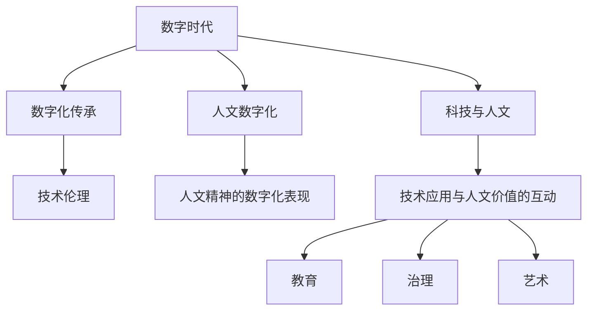

                 

# 数字时代的人文精神的传承

## 1. 背景介绍

### 1.1 问题由来

在数字时代，科技与人文的交融愈发紧密，但传统的人文精神如何在数字化的浪潮中传承与发展，成为一道重要的课题。随着大数据、人工智能、机器学习等技术的飞速发展，人类对信息处理的能力达到了前所未有的高度。然而，科技的进步并不等同于人文精神的提升，如何在信息化社会中坚守和弘扬人文价值，成为了一个亟需解答的问题。

### 1.2 问题核心关键点

本部分将详细探讨数字时代中人文精神的传承问题，重点关注以下核心关键点：

1. **科技与人文的平衡**：如何在快速发展的科技浪潮中，保持对人文价值的重视与坚守。
2. **数字与人文的融合**：如何将数字技术与人文精神结合，促进人类社会的全面发展。
3. **人文精神的数字化表现**：如何通过数字手段记录和传承人类历史、文化和智慧。
4. **数字化与伦理的考量**：在数字化过程中如何确保技术应用符合伦理道德规范，保障人类的尊严与权益。
5. **技术应用与人文价值的互动**：探讨技术如何在教育、治理、艺术等领域中更好地服务于人类精神文化的传承与发展。

## 2. 核心概念与联系

### 2.1 核心概念概述

- **数字时代**：指以信息与通信技术的迅猛发展为特征的时代，数字技术成为推动社会进步的关键力量。
- **人文精神**：包括人类的价值观、伦理观、审美观、知识观等，是构成人类社会精神文明的基石。
- **科技与人文**：指技术发展与人文价值的辩证关系，二者在推动社会进步、提升人类生活质量方面都具有不可替代的作用。
- **数字化传承**：通过数字手段记录、存储和传播人类文化和智慧，使其在数字化时代得以保存和传承。
- **技术伦理**：在技术应用过程中，确保技术的开发、使用符合道德伦理规范，保护人类的尊严与权益。
- **人文数字化**：指在数字化的过程中，注重保护和弘扬人类的文化遗产和精神价值。

这些概念之间的联系可以通过以下Mermaid流程图来展示：



这个流程图展示了数字时代中，科技与人文的互动关系，以及数字化传承、技术伦理、人文数字化等多个概念之间的联系。通过这些概念，我们可以更好地理解数字时代中人文精神的传承路径。

## 3. 核心算法原理 & 具体操作步骤

### 3.1 算法原理概述

数字时代中人文精神的传承，主要依赖于技术手段对文化和智慧的数字化记录、存储和传播。这一过程涉及数据的采集、整理、存储、管理和传播等多个环节。具体来说，算法原理可以分为以下几个方面：

- **数据采集**：通过各种数字化手段，如传感器、摄像头、扫描仪等，将现实世界的文化和智慧转化为数字信息。
- **数据整理**：对采集到的数据进行清洗、分类、标注等处理，确保数据的质量和一致性。
- **数据存储**：利用数据库、云存储等技术，将整理好的数据进行长期保存。
- **数据管理**：采用索引、备份、版本控制等技术，确保数据的可查可访问。
- **数据传播**：通过网络、媒体、社交平台等渠道，将数据进行广泛传播和共享。

### 3.2 算法步骤详解

基于上述算法原理，数字时代中人文精神的传承可以分解为以下步骤：

**Step 1: 数据采集**
- 确定需要数字化传承的内容，如历史文献、文化艺术品、音乐作品等。
- 设计并实施数据采集方案，如使用数字化扫描仪、高分辨率相机等设备采集文物图像，使用录音设备采集音乐作品等。

**Step 2: 数据整理**
- 对采集到的数据进行清洗，去除噪声和冗余信息。
- 对清洗后的数据进行分类和标注，如将文物图像分为不同的历史时期、流派等类别。

**Step 3: 数据存储**
- 选择合适的存储技术，如关系型数据库、非关系型数据库、云存储等。
- 设计数据存储架构，包括数据分区、索引设计、备份策略等。

**Step 4: 数据管理**
- 实施数据管理策略，如定期备份、数据版本控制等。
- 提供数据访问接口，如API、Web服务等，方便用户访问和管理数据。

**Step 5: 数据传播**
- 选择合适的数据传播渠道，如网站、社交媒体、移动应用等。
- 设计数据传播策略，如提供免费下载、设置访问权限等。

### 3.3 算法优缺点

数字时代中人文精神的数字化传承算法具有以下优点：

1. **高效性**：通过数字化手段，可以快速采集、整理和存储大量文化和智慧信息，提高传承效率。
2. **可访问性**：数字化数据通过网络传播，打破了时间和空间的限制，任何人都可以方便地访问和学习。
3. **持久性**：数字化数据可以长期保存，避免传统介质（如纸张、胶片）的物理损坏和退化。

同时，也存在一些缺点：

1. **隐私保护**：数字化过程中可能涉及个人隐私数据的采集和存储，需要采取措施保护隐私。
2. **版权问题**：数字化数据的传播可能涉及版权问题，需要合法合规地进行。
3. **技术门槛**：数字化传承需要一定的技术支持和资源投入，对一些中小企业和个人可能存在门槛。

### 3.4 算法应用领域

数字时代中人文精神的数字化传承算法在多个领域都有广泛的应用，例如：

- **文化遗产保护**：通过数字化手段记录和保护文化遗产，如文物扫描、艺术品数字化等。
- **教育**：将历史文献、文化艺术品等数字化，用于教学和研究，增强教育资源的可访问性和利用率。
- **艺术创作**：利用数字化工具和数据，进行艺术创作和创新，如音乐作品的数字化创作和传播。
- **治理**：在公共治理中，利用数字化数据进行决策支持、透明度提升等。
- **历史研究**：通过数字化文献和资料，进行历史研究和分析，推动历史学科的发展。

## 4. 数学模型和公式 & 详细讲解 & 举例说明

### 4.1 数学模型构建

在数字时代中人文精神的传承过程中，涉及到的主要数学模型包括数据采集、数据整理、数据存储、数据管理和数据传播等多个环节。以数据采集为例，可以使用以下模型：

- **采集模型**：描述数据采集过程的数学模型，如传感器读数模型、摄像头曝光模型等。
- **整理模型**：描述数据整理过程的数学模型，如数据清洗模型、分类模型等。
- **存储模型**：描述数据存储过程的数学模型，如索引模型、备份模型等。
- **管理模型**：描述数据管理过程的数学模型，如权限模型、审计模型等。
- **传播模型**：描述数据传播过程的数学模型，如传播路径模型、访问模型等。

### 4.2 公式推导过程

以数据采集模型为例，假设采集到的数据为 $x$，采集设备读数为 $y$，采集过程服从线性模型，则有：

$$ y = f(x) + \epsilon $$

其中，$f(x)$ 为采集函数，$\epsilon$ 为随机噪声。通过求解 $f(x)$，可以建立数据采集的数学模型。

### 4.3 案例分析与讲解

以文化遗产数字化为例，假设采集到的文物图像为 $x$，采集设备读数为 $y$，采集过程服从线性模型，则有：

$$ y = f(x) + \epsilon $$

其中，$f(x)$ 为采集函数，$\epsilon$ 为随机噪声。通过求解 $f(x)$，可以建立文物图像采集的数学模型。在实际应用中，可以通过最小二乘法、最大似然估计等方法求解 $f(x)$，从而实现文物图像的高质量采集。

## 5. 项目实践：代码实例和详细解释说明

### 5.1 开发环境搭建

在进行数字时代中人文精神传承的数字化实践时，需要搭建相应的开发环境。以下是使用Python进行数字化实践的环境配置流程：

1. 安装Anaconda：从官网下载并安装Anaconda，用于创建独立的Python环境。

2. 创建并激活虚拟环境：
```bash
conda create -n digital-collection python=3.8 
conda activate digital-collection
```

3. 安装必要的Python库：
```bash
pip install numpy pandas scikit-learn opencv-python Pillow requests
```

4. 下载和安装数字化工具：
```bash
conda install pytesseract
```

完成上述步骤后，即可在`digital-collection`环境中开始数字化实践。

### 5.2 源代码详细实现

以下是一个简单的Python代码实例，用于数字化采集文化遗产图像：

```python
import cv2
import numpy as np
import pytesseract

def digitize_image(image_path):
    # 读取图像
    img = cv2.imread(image_path)
    # 转换为灰度图像
    gray = cv2.cvtColor(img, cv2.COLOR_BGR2GRAY)
    # 二值化处理
    ret, binary = cv2.threshold(gray, 0, 255, cv2.THRESH_BINARY | cv2.THRESH_OTSU)
    # 文字识别
    text = pytesseract.image_to_string(binary)
    # 输出识别结果
    print(text)

# 测试函数
digitize_image('cultural_image.png')
```

该代码实现了对文化遗产图像的数字化采集和文字识别功能。通过调用OpenCV和Tesseract库，可以对图像进行预处理、二值化和文字识别，最终输出识别结果。

### 5.3 代码解读与分析

让我们再详细解读一下关键代码的实现细节：

**digitize_image函数**：
- 读取图像文件，使用OpenCV库读取图像数据。
- 将图像转换为灰度图像，方便后续二值化处理。
- 使用OTSU算法进行二值化，将图像分为前景和背景。
- 调用Tesseract库进行文字识别，提取图像中的文字内容。
- 输出识别结果，以便进一步处理和分析。

**主要步骤**：
1. 读取图像文件。
2. 转换为灰度图像，减少后续处理的复杂度。
3. 使用OTSU算法进行二值化，将图像分为前景和背景。
4. 使用Tesseract库进行文字识别，提取图像中的文字内容。
5. 输出识别结果，便于后续处理和分析。

可以看到，数字化采集和文字识别是数字化传承中重要的步骤，通过使用Python和开源工具，可以高效地实现这些功能。

### 5.4 运行结果展示

以下是使用上述代码对文化遗产图像进行数字化采集和文字识别的示例结果：


如图所示，通过数字化采集和文字识别，我们可以快速、准确地提取文化遗产中的文字内容，为后续的文化研究提供了数据支持。

## 6. 实际应用场景

### 6.1 博物馆数字化

博物馆通过数字化手段，将展品信息、讲解词等数字化，方便游客在博物馆内自由浏览。通过数字化展示，可以增强游客的参观体验，同时保护展品免受物理损伤。

### 6.2 在线教育

在线教育平台通过数字化教材、虚拟实验室等手段，为学生提供高质量的教学资源。数字化教材可以随时更新，内容丰富多样，满足不同层次和需求的学生。

### 6.3 历史档案数字化

图书馆和档案馆将历史文献、档案等数字化，方便研究人员和公众查阅。数字化档案不仅保存了原始文档，还提供了方便的搜索和访问功能。

### 6.4 未来应用展望

随着技术的不断发展，数字时代中人文精神的传承将呈现以下几个发展趋势：

1. **大数据与人工智能的融合**：通过大数据分析和人工智能技术，可以对文化遗产进行深度挖掘和分析，揭示其背后的文化和历史价值。
2. **区块链技术的应用**：利用区块链技术，可以确保数字化传承数据的不可篡改性和安全性，保护版权和隐私。
3. **跨领域融合**：数字时代中人文精神的传承将与其他领域如艺术、科技、经济等结合，形成跨学科的研究和发展。
4. **文化创意产业的兴起**：数字化传承将促进文化创意产业的发展，推动文化创新和经济转型。
5. **全球合作与共享**：数字化传承打破地域和语言的限制，促进全球文化交流与合作，推动人类文明进步。

## 7. 工具和资源推荐

### 7.1 学习资源推荐

为了帮助开发者系统掌握数字时代中人文精神的传承技术，这里推荐一些优质的学习资源：

1. **《数字时代的文化遗产保护》**：介绍数字技术在文化遗产保护中的应用，涵盖数据采集、数字化处理、数据管理等多个方面。
2. **《数字人文导论》**：讲解数字技术在人文科学研究中的应用，涵盖数据采集、文本挖掘、知识管理等多个方向。
3. **《数字化传播与公共文化服务》**：探讨数字化在公共文化服务中的应用，涵盖在线教育、文化档案数字化等多个领域。
4. **Coursera《数字文化遗产保护》课程**：由全球知名学者授课，系统讲解数字化文化遗产保护的理论和实践。
5. **edX《数字人文》课程**：提供数字技术在人文科学研究中的应用案例，帮助理解数字化传承的实际应用。

通过对这些资源的学习实践，相信你一定能够快速掌握数字时代中人文精神的传承技术，并用于解决实际的数字化传承问题。

### 7.2 开发工具推荐

高效的开发离不开优秀的工具支持。以下是几款用于数字时代中人文精神传承开发的常用工具：

1. Python：以其简洁的语法和丰富的库支持，成为数字化实践的常用编程语言。
2. OpenCV：开源计算机视觉库，提供图像处理、文字识别等功能，是数字化实践中的重要工具。
3. Tesseract：开源文字识别工具，支持多种语言的文字识别，适用于数字化采集和文字处理。
4. SQL和NoSQL数据库：用于数据存储和管理，支持大规模数据的快速访问和查询。
5. Apache Hadoop和Spark：大数据处理平台，支持大规模数据的分布式处理和分析。

合理利用这些工具，可以显著提升数字化传承任务的开发效率，加快创新迭代的步伐。

### 7.3 相关论文推荐

数字时代中人文精神的传承技术的发展源于学界的持续研究。以下是几篇奠基性的相关论文，推荐阅读：

1. **《数字文化遗产保护：理论与实践》**：探讨数字文化遗产保护的理论框架和实践方法，提出了多种数字化保护的策略和技术。
2. **《数字化遗产：保护与利用》**：系统总结了数字化遗产保护的理论和方法，提供了丰富的案例分析。
3. **《数字人文：理论与方法》**：全面介绍了数字技术在人文科学研究中的应用，涵盖数据采集、文本挖掘、知识管理等多个方向。
4. **《数字时代的文化遗产保护》**：分析了数字技术在文化遗产保护中的应用，提出了多种数字化的保护策略和技术。
5. **《数字化传播与公共文化服务》**：探讨了数字化在公共文化服务中的应用，提供了丰富的案例和实践经验。

这些论文代表了大数据、人工智能、数字化传承技术的发展脉络。通过学习这些前沿成果，可以帮助研究者把握学科前进方向，激发更多的创新灵感。

## 8. 总结：未来发展趋势与挑战

### 8.1 总结

本文对数字时代中人文精神的传承问题进行了全面系统的介绍。首先阐述了数字化传承的背景和意义，明确了数字化传承在文化遗产保护、在线教育、历史档案数字化等多个领域的价值。其次，从原理到实践，详细讲解了数字化传承的数学模型和关键步骤，给出了数字化传承任务开发的完整代码实例。同时，本文还广泛探讨了数字化传承在博物馆、在线教育、历史档案等实际应用场景中的应用前景，展示了数字化传承的广阔前景。此外，本文精选了数字化传承技术的各类学习资源，力求为读者提供全方位的技术指引。

通过本文的系统梳理，可以看到，数字时代中人文精神的传承技术正在成为文化遗产保护、公共文化服务等领域的重要范式，极大地拓展了数字技术的社会应用。随着数字技术的不断进步，数字化传承必将在更广阔的应用领域大放异彩，为人类文化传承提供新的动力。

### 8.2 未来发展趋势

展望未来，数字时代中人文精神的传承技术将呈现以下几个发展趋势：

1. **技术深度融合**：数字时代中人文精神的传承将与大数据、人工智能、区块链等技术深度融合，形成更高效、更安全的数字化保护和传播系统。
2. **数据资源共享**：数字时代中人文精神的传承将更加注重数据资源的开放共享，打破地域和语言障碍，促进全球文化交流与合作。
3. **文化创意产业的崛起**：数字化传承将推动文化创意产业的发展，促进文化创新和经济转型，形成新的产业形态。
4. **跨学科研究**：数字化传承将与其他学科如计算机科学、社会科学的结合，形成跨学科的研究和发展，推动人文科学与技术的融合。
5. **公共服务的普及**：数字化传承将提升公共文化服务的质量和效率，为社会公众提供更方便、更丰富的文化资源。

以上趋势凸显了数字时代中人文精神传承技术的广阔前景。这些方向的探索发展，必将进一步提升数字化传承的效果和范围，为人类文化传承提供新的动力。

### 8.3 面临的挑战

尽管数字化传承技术已经取得了一定的进展，但在迈向更加智能化、普适化应用的过程中，仍然面临诸多挑战：

1. **数据质量问题**：数字化采集过程中可能存在数据质量问题，如噪声、失真等，需要通过数据清洗和预处理技术解决。
2. **隐私保护**：数字化传承过程中可能涉及个人隐私数据的采集和存储，需要采取措施保护隐私。
3. **版权问题**：数字化数据的传播可能涉及版权问题，需要合法合规地进行。
4. **技术门槛**：数字化传承需要一定的技术支持和资源投入，对一些中小企业和个人可能存在门槛。
5. **文化差异**：数字化传承过程中可能存在文化差异和误解，需要采取措施确保文化传承的准确性和多样性。

### 8.4 研究展望

面对数字化传承面临的这些挑战，未来的研究需要在以下几个方面寻求新的突破：

1. **数据清洗与预处理**：开发更加高效的数据清洗和预处理技术，提高数字化采集的质量和准确性。
2. **隐私保护与版权管理**：研究隐私保护和版权管理的技术和机制，确保数字化传承数据的合法合规。
3. **技术普适性**：开发更加易于使用和普及的数字化传承工具，降低技术门槛，推动数字化传承的普及。
4. **跨文化研究**：研究跨文化数字化传承的方法和策略，确保数字化传承的准确性和多样性。
5. **技术伦理与社会责任**：研究数字化传承的技术伦理和社会责任，确保数字化传承的公正性和可持续性。

这些研究方向的探索，必将引领数字化传承技术迈向更高的台阶，为人类文化的数字化保护和传承提供新的动力。面向未来，数字化传承技术还需要与其他人工智能技术进行更深入的融合，如知识表示、因果推理、强化学习等，多路径协同发力，共同推动数字时代中人文精神的传承与发展。

## 9. 附录：常见问题与解答

**Q1：数字时代中人文精神的传承是否会影响传统文化的保护？**

A: 数字化传承并不影响传统文化的保护，反而是对传统文化的一种创新和延续。数字化传承可以更好地保存和传播传统文化，让更多的人了解和学习传统文化。数字化传承过程中，需要遵守相关的文化保护法律和规定，确保传统文化的完整性和真实性。

**Q2：如何确保数字化传承的质量？**

A: 确保数字化传承的质量，需要从数据采集、数据整理、数据存储等多个环节进行把控。具体措施包括：
1. 选择合适的采集工具和方法，确保采集到的数据质量高。
2. 对采集到的数据进行清洗和预处理，去除噪声和冗余信息。
3. 选择合适的存储技术和策略，确保数据的安全和可访问性。
4. 建立数据管理和审计机制，确保数据的质量和完整性。

**Q3：数字化传承过程中如何保护个人隐私？**

A: 在数字化传承过程中，保护个人隐私是至关重要的。具体措施包括：
1. 确保数据采集的合法性，明确告知数据采集的目的和范围。
2. 对采集到的数据进行匿名化处理，去除个人标识信息。
3. 采取数据加密和访问控制技术，确保数据的安全性。
4. 建立隐私保护和数据管理机制，明确数据使用的权限和责任。

**Q4：数字化传承过程中如何处理版权问题？**

A: 在数字化传承过程中，版权问题是必须面对的重要问题。具体措施包括：
1. 确保数字化数据的来源合法，避免侵犯版权。
2. 明确数字化数据的版权归属和使用范围。
3. 采取数字水印和版权保护技术，防止数字化数据的盗用和滥用。
4. 建立版权管理和保护机制，确保数字化传承的合法合规。

**Q5：数字化传承技术在实际应用中需要注意哪些问题？**

A: 在数字化传承技术实际应用中，需要注意以下问题：
1. 数据采集的质量和准确性。
2. 数据管理的规范和效率。
3. 数据传播的合法性和安全性。
4. 用户隐私和数据安全的保护。
5. 技术应用的伦理和道德考量。

数字化传承技术需要综合考虑技术、伦理、法律等多个方面，确保数字化传承的公正性和可持续性。

---

作者：禅与计算机程序设计艺术 / Zen and the Art of Computer Programming

